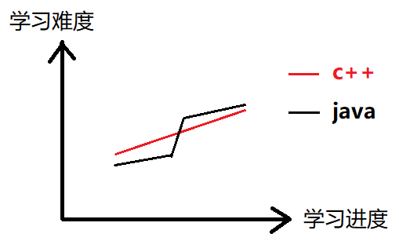
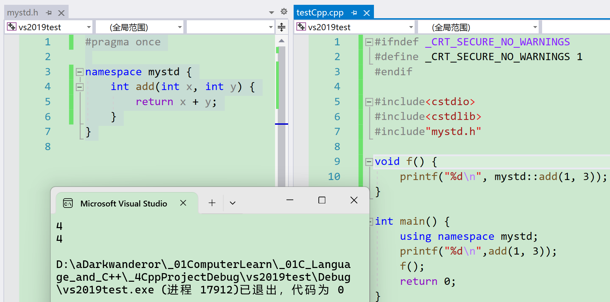

# c++入门

c++正式入门前的一些信息杂谈，都是无关紧要的内容，可跳过。

1. c++98开始，c++体系正式完成，以后的内容大都在此基础上添砖加瓦，此时c++不再是一个人而是一群人的。有一个委员会，计划5年一个大版本标准。
2. c++0x：在c++05，因故障使得标准更新暂缓，可能在零几年更新（实际是拖到c++11）。c++11是继c++98后最完善的标准，该完善的都完善了，使c++更像新语言（对比c语言而言），但c++始终没有自己的网络库。
3. 笔记内容以c++98和c++11为主，后续根据需要进行补充。c++学习的主要内容是c++语法、数据结构和STL。
4. 在写OJ题上，c++比c 好写。有大佬将c++分成4个层次，大学在第1层，平台的公开课等在第2、第3层，位于第4层的大佬：例如候捷（写书的）、写编译器的人、c++标准委员会、一些资深大佬（只被业内人士知晓，不被社会了解）等。
5. 近些年，线上笔试变得特别难，对算法要求很高，因此在c++的学习上要求：1、多刷题。2、做好笔试强训。各种形式的都行。
6. 曾经有一个《21天精通系列》，在面试时千万别写精通，而是写熟练掌握（因为写精通容易翻车）。除非真的熟练掌握，比如把这里提到的大佬的作品和书都研究透了。
7. c++适合用于写底层软件如java虚拟机、操作系统、数据库（一些），但最主要还是服务器开发。java适用于实时性要求没那么高的软件（应用开发）。
8. 服务器。例如王者荣耀，先登录，再匹配玩家，储存数据，再发送指令。其中数据就是存储在服务器。庞大的数据对服务器要求很高，此时`c++/c`比`java `更合适。
9. java半年一更，是一家商业公司sun开发，后被[Oracle（甲骨文公司）](https://baike.baidu.com/item/Oracle/301207?fromModule=lemma_inlink)公司收购直到至今（现在的编写时间是2024年10月8日）。所以c++更新慢是因为频率低。
10. c++是最难学的语言之一。“整体的难度”和java差不多，单看语法c++比java难30%（虽然不知道怎么算出来的）。例如c++有多继承而java只有单继承（因为java抄的c++）。但难的语法和坑都不可轻易去掉（任何语言），语言有向前兼容的特性，即以前支持的后面也要支持。但python就这么做过（指去掉了难的语法和坑）。c++的好一部分坑来自c语言。同时学习java的人比学习java的人多而且更卷。
    
11. c#对标java，与c和c++没关系（但都有抄袭的嫌疑，微软搞出来专门对抗java，有一定市场份额但很小）。
12. 像贝尔实验室这种，发展百年后成为研究院，大公司都会有研究院（就是实验室，一般叫研究院，例如达摩研究院）
13. c++还适用于写pc平台上绝大多数的游戏，以及嵌入式、物联网和数字图像处理、人工智能背后的深度学习算法（大多还是用python）等。c++更适合岗位：软件开发——后台开发方向。
14. 学好c++：
    1. 写博客（我认为可以是写笔记），以及经常看自己写的。
    2. 选几本好书。
       * 《c++Primer》，当字典用。《c++Primer》的作者是个全球闻名的c++大佬，
       * 《c++ Primer Plus》有点蹭热度的意思，但内容页差不多。
       * 《STL源码剖析》作者候捷老师，是汉语教学界里c++的大佬，他翻译的和写的很多书都是经典，他个人造诣属于上面提到的c++第4层（大多数时候不需要我学到第4层），没看过他的书的人只有两种：特别nb的人以及特别拉胯的人。
15. c++源文件：`name.cpp`，c语言的是`name.c`，c语言能运行的，c++也能，原因是它们调用的编译器不同，c++兼容c。
16. c++同样可以调用g++进行编译。调用编译器gcc来编译c程序的命令，改成g++同样可以对c++代码进行编译。
17. 学习c++时依旧遵循先会用，再探讨本质的原则。
18. 和编写c语言的时候一样，对编译器发出的对程序的警告：首先进行评估，不造成恶劣影响则不理会。
19. 在后续对c++的学习中会发现很多这种普遍的现象：c++的祖师爷只给定了标准，并不限制其他人怎么实现编译器（相对后起的面向对象语言更自由），这就造成某个代码在不同的编译器，因为底层逻辑造成结果不同，甚至无法正常运行。

# 命名空间

命名空间的目的是**对标识符的名称进行本地化**，以**避免命名冲突或名字污染**，`namespace`关键字的出现就是针对这种问题的。

> 命名冲突或名字污染：库冲突。库包含官方库和第三方库（如我和同事写的不同库），官方库可以尽量避免重名，但第三方的在c语言只能改名。
>
>  
>
> 对于这种错误，编译器在编译阶段会提示什么东西重定义。
>
>  
>
> 这种命名冲突还会造成链接冲突：
> 指某一段代码在全局文件中多个.c/.cpp文件都可见，然后生成的.obj会冲突；static修饰全局变量时该全局变量只在当前文件可见，可以一定程度上避免链接冲突。

## 定义命名空间

格式：

```cpp
namespace name{
    //List...
}
```

**一个命名空间就定义了一个新的作用域**，命名空间中的所有内容都局限于该命名空间中。

且**同名的名称空间会合并**，命名空间内**可嵌套同名的命名空间**。

```cpp
//int rand = 1;
//头文件stdlib.h(cstdlib)有rand函数的定义，
//若在全局或非名称空间的局部定义rand这个名的变量会产生冲突。
namespace A{
	//命名空间中可以定义变量/函数/类型(类)，
	//以及可嵌套命名空间
	int rand = 1;
    
	int ran = 10;

	int Add(int left, int right){
		return left + right;
	}

	struct Node{
		struct Node* next;
		int val;
	};
	namespace B{
		int a = 2;
	}
}

namespace A{//同名的名称空间会合并
	int x = 0;
	namespace A{//命名空间内可嵌套同名的命名空间
		int x = 1;
	}
}
```

但`main()`函数不推荐在任何`namespace`中，因为`main()`需要有全局作用域，编译器只会找`::main()`，不会找`namespace`。

即使`main`函数定义在某个`namespace`中，整个程序依旧要有全局的`::main()`。

例如这个代码，语法上没问题，但逻辑上错误。推荐将`xx::main()`的函数名更换成其他的名字。

```cpp
#include<iostream>

namespace xx {
	int main() {
		std::cout << "xx::main()\n";
		return 0;
	}
}

int main() {
	return xx::main();
}
```


## 使用命名空间

命名空间的使用有三种方式：

### 加命名空间名称即作用域限定符

```cpp
printf("%d\n", N::a);
```

`::`是域作用限定符。若之前不加命名空间名，则是在全局去找。

测试程序：

```cpp
#ifndef _CRT_SECURE_NO_WARNINGS
#define _CRT_SECURE_NO_WARNINGS 1
#endif
/*
int rand = 1;
//头文件stdlib.h(cstdlib)有rand函数的定义，
//若在全局或非名称空间的局部定义rand这个名的变量会产生冲突。
*/

#include<cstdio>
#include<cstdlib>
namespace A {
	//命名空间中可以定义变量/函数/类型(类)，
	//以及可嵌套命名空间
	int rand = 1;

	int ran = 10;

	int Add(int left, int right) {
		return left + right;
	}

	struct Node {
		struct Node* next;
		int val;
	};
	namespace B {
		int a = 2;
	}
}

namespace A {//同名的名称空间会合并
	int x = 0;
	namespace A {//命名空间内可嵌套同名的命名空间
		int x = 1;
	}
}

int main() {//使用作用域限定符::访问命名空间成员
	printf("%d\n", A::rand);
	printf("%d\n", A::ran);
	printf("%d\n", A::Add(A::rand, A::ran));
	A::Node a;
	a.next = NULL; a.val = 6;
	printf("%d\n", a.val);
	printf("%d\n", A::B::a);
	printf("%d\n", A::x);
	printf("%d\n", A::A::x);
	int test = 5;
	//匹配全局的rand函数
	{
		printf("%d\n", ::rand());
		////只会在全局找，而不是父作用域
		//printf("%d\n", ::test);
	}
	return 0;
}
```

### 使用using将命名空间中某个成员引入

但放的位置仍然决定该成员的作用范围（比如放在某函数中，则该成员的作用域就是该函数的`{}`划定的区域），这种方式在这里称之为**指定域名**。

```c++
using N::b;
```

例如：

```cpp
#ifndef _CRT_SECURE_NO_WARNINGS
#define _CRT_SECURE_NO_WARNINGS 1
#endif
/*
int rand = 1;
//头文件stdlib.h(cstdlib)有rand函数的定义，
//若在全局或非名称空间的局部定义rand这个名的变量会产生冲突。
*/

#include<cstdio>
#include<cstdlib>
namespace A {
	//命名空间中可以定义变量/函数/类型(类)，
	//以及可嵌套命名空间
	int rand = 1;

	int ran = 10;

	int Add(int left, int right) {
		return left + right;
	}

	struct Node {
		struct Node* next;
		int val;
	};
	namespace B {
		int a = 2;
	}
}

namespace A {//同名的名称空间会合并
	int x = 0;
	namespace A {//命名空间内可嵌套同名的命名空间
		int x = 1;
	}
}

void f1() {//使用关键字using将命名空间展开
	using A::rand;
	using A::ran;
	using A::Add;
	printf("%d\n", Add(rand, ran));

	using A::B::a;//嵌套展开
	printf("%d\n", a);

	using A::A::x;
	printf("%d\n", x);
}

void f2() {//验证展开受到作用域影响
	{
		using A::ran;
	}
	//printf("%d\n", ran);//这里编译器不允许
	
	//printf("%d\n", Add(3, 4));//在main函数展开的也不行
}

int main() {
	f1();//使用关键字using将命名空间展开
	using A::Add;
	f2();//验证展开受到作用域影响
	return 0;
}
```

### 使用using namespace 命名空间名称 引入

例如，常见的引入标准命名空间：

```cpp
using namespace std;
```

测试程序：

```cpp
#ifndef _CRT_SECURE_NO_WARNINGS
#define _CRT_SECURE_NO_WARNINGS 1
#endif
/*
int rand = 1;
//头文件stdlib.h(cstdlib)有rand函数的定义，
//若在全局或非名称空间的局部定义rand这个名的变量会产生冲突。
*/

#include<cstdio>
#include<cstdlib>
namespace A {
	//命名空间中可以定义变量/函数/类型(类)，
	//以及可嵌套命名空间
	int rand = 1;

	int ran = 10;

	int Add(int left, int right) {
		return left + right;
	}

	struct Node {
		struct Node* next;
		int val;
	};
	namespace B {
		int a = 2;
	}
}
void f1() {
	using namespace A;
	printf("%d\n", ran);

	//展开A后会有两个rand，需要加域名才能访问
	printf("%d\n", A::rand);

	//namespace不建议用已经有的函数名作为别的元素
	//这里就无法正常使用rand函数。
	//printf("%d\n", rand());

	//想要使用rand函数需要用更严格的作用域指定
	printf("%p\n", ::std::rand);
	printf("%d\n", ::std::rand());
	//::表示全局，std表示c++标准库
	//个人感觉不用指定全局也行
	printf("%d\n", std::rand());

	struct Node node;
	node.next = NULL; node.val = 4;
	printf("%d\n", node.val);

	//printf("%d\n", a);//嵌套的命名空间同样需要展开
	using namespace B;
	printf("%d\n", a);
}

void f2() {
	////c++不允许在局部定义命名空间
	//namespace B {
	//	float printf = 3.14;
	//}
}

int main() {
	f1();
	return 0;
}
```

特殊案例：

```cpp
#include<cstdio>
namespace A {
	float printf = 3.6;
}
void f1() {
	using namespace A;//在重名的情况下用using展开
	std::printf("%f\n", A::printf);
}

int main() {
	f1();
	return 0;
}
```

即使是用`using namespace`全面展开，c++程序会**先在全局去找**某个元素，找不到了**再去找命名空间**。因此在全局找到一个，在命名空间里又找到另一个重名的元素时，编译器不知道选哪个。

此时就需要指定域名。

若无论如何展开都会冲突，最简单的办法：能改名就改名。

### 使用头文件中的命名空间

命名空间可以放在头文件中，头文件展开时也会展开。

mystd.h：

```cpp
#pragma once

namespace mystd {
	int add(int x, int y) {
		return x + y;
	}
}

```

testCpp.cpp

```cpp
#ifndef _CRT_SECURE_NO_WARNINGS
#define _CRT_SECURE_NO_WARNINGS 1
#endif

#include<cstdio>
#include<cstdlib>
#include"mystd.h"

void f() {
	printf("%d\n", mystd::add(1, 3));
}

int main() {
	using namespace mystd;
	printf("%d\n",add(1, 3));
	f();
	return 0;
}
```



## namespace std

`std`是c++标准库的命名空间，即c++所有库里的东西都在这个库里。

头文件调用 (展开) 时拷贝头文件里的内容到代码中 (经编译器处理后) ，命名空间展开可以认为是对该空间授权，若没展开`namespace`，默认是不去`namespace`里去找，因此编译器不回去访问未规定展开的`namespace`。

不建议在大型项目中用`using namespace`全面展开，不好检查。

那么如何展开`std`使用更合理呢？

1. 在日常练习中，建议直接`using namespace std`即可，这样就很方便。

2. `using namespace std`展开，标准库就全部暴露出来了，如果我们定义跟库重名的类型/对象/函数，就存在冲突问题。该问题在日常练习中很少出现，但是项目开发中代码较多、规模大，就很容易出现。所以建议在项目开发中使用，像`std::cout`这样使用时指定命名空间 + `using std::cout`展开常用的库对象/类型等方式。