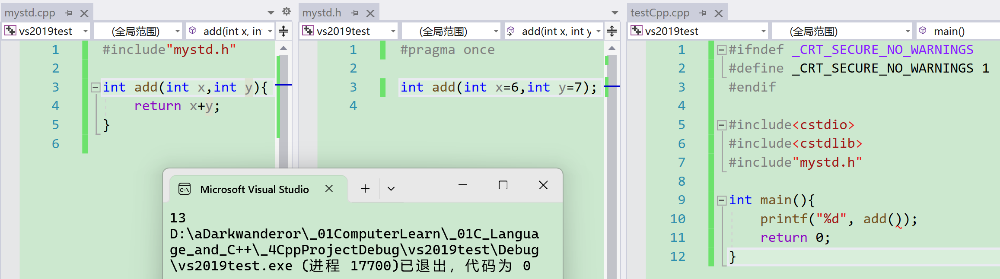
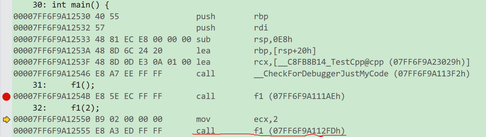
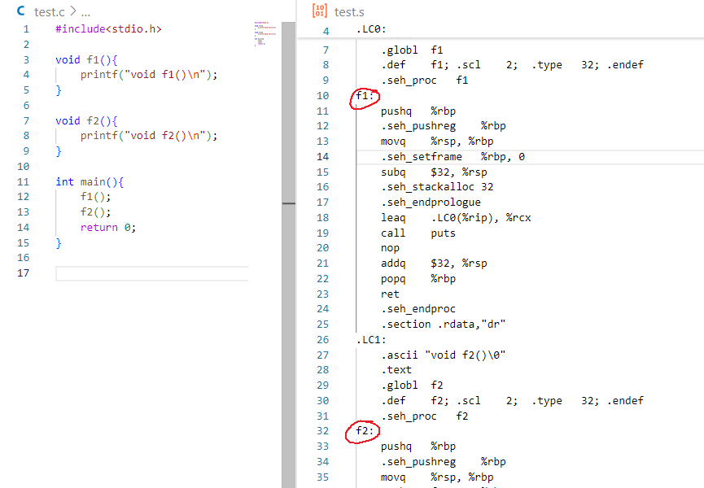
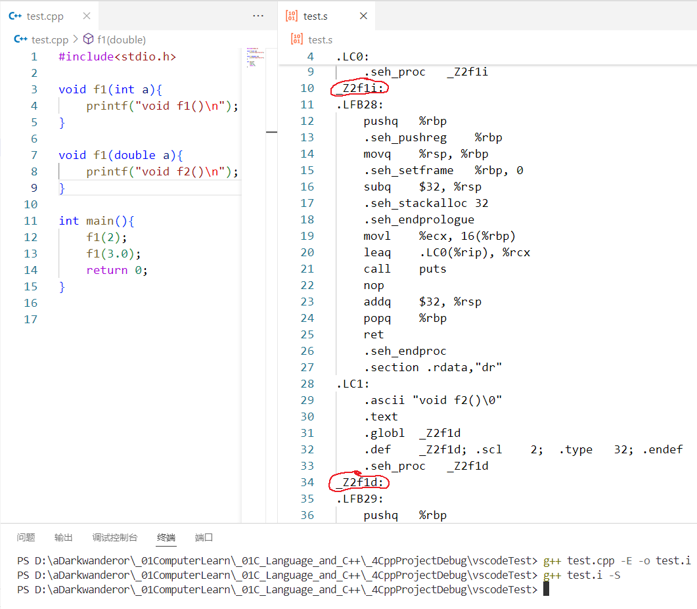
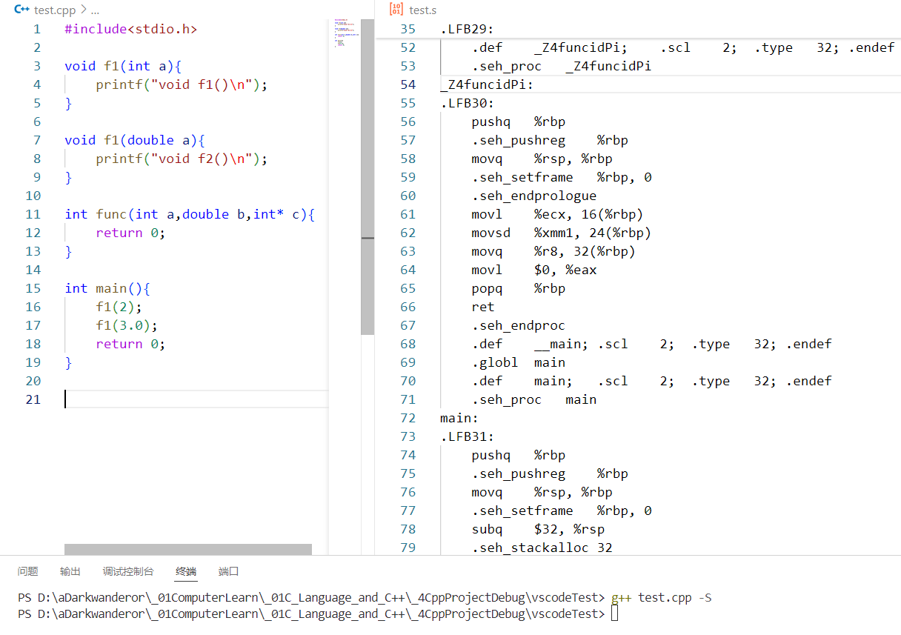

#  缺省参数

缺省参数是**声明或定义函数时**为函数的**参数指定一个缺省值**。在调用该函数时，如果没有指定实参则采用该形参的缺省值，否则使用指定的实参。

因为是c++的语法，所以c语言不支持（编译器不支持），代码文本的后缀需要为 .cpp 且通过c++专用的编译器编译。

## 全缺省参数

```cpp
#include<iostream>
using namespace std;

void f1(int a = 10, int b = 20, int c = 30) {
	cout << "a = " << a << endl;
	cout << "b = " << b << endl;
	cout << "c = " << c << endl;
}

int main() {
	f1();//全缺省可以不用给形参
	return 0;
}
```

即使是全缺省，依旧不能这样调用：

`Func(,1)`，`Func(,,1)`。

## 半缺省参数

至少有一个形参没有给缺省值就是半缺省。半缺省的最后一个形参必须有缺省值，而且有缺省值的参数之间不能有无缺省值。

```cpp
#include<iostream>
using namespace std;

void f2(int a, int b, int c = 10) {
	cout << "a = " << a << endl;
	cout << "b = " << b << endl;
	cout << "c = " << c << endl;
}

void f3(int a, int b, int c, int d = 10) {
	cout << "a = " << a << endl;
	cout << "b = " << b << endl;
	cout << "c = " << c << endl;
	cout << "d = " << d << endl;
}

int main() {
	f2(1, 2);//半缺省的实参数最少也要填平无缺省值的形参
	f2(1, 2, 3);
	return 0;
}
```

语法不允许最后1个形参无缺省值。

```cpp
void f2(int a, int b = 10, int c) {//c无缺省值，编译不通过
     cout<<"a = "<<a<<endl;
     cout<<"b = "<<b<<endl;
     cout<<"c = "<<c<<endl;
}

void f3(int a, int b, int c = 10, int d) {//d无缺省值，编译不通过
	cout << "a = " << a << endl;
	cout << "b = " << b << endl;
	cout << "c = " << c << endl;
	cout << "d = " << d << endl;
}
```

语法也不允许中间某个无缺省值的形参的前后形参都有缺省值。

```cpp
void f4(int a, int b = 10, int c, int d = 40) {//c无缺省值，编译不通过
	cout << "a = " << a << endl;
	cout << "b = " << b << endl;
	cout << "c = " << c << endl;
	cout << "d = " << d << endl;
}
```

总结半缺省参数必须**从右往左依次**来给出，不能间隔着给。

## 函数声明和定义的缺省参数

缺省参数**不能在函数声明和定义中同时出现**（怕程序员乱用，声明和定义不是同一个缺省时编译器不知道用哪个）。

```cpp
#ifndef _CRT_SECURE_NO_WARNINGS
#define _CRT_SECURE_NO_WARNINGS 1
#endif

#include<cstdio>
#include<cstdlib>

void f1(int a, int b);

void f1(int a = 9, int b = 6) {
	printf("%d %d\n", a, b);
}

void f2(int a = 9, int b = 6);

void f2(int a, int b) {
	printf("%d %d\n", a, b);
}
////缺省参数不能在函数声明和定义中同时出现
//void f3(int a = 9, int b = 6);
//void f3(int a = 9, int b) {}

int main() {
	f1();
	f2();
	return 0;
}
```

声明和定义分离时，声明给缺省参数但定义不给。反过来不可以声明无缺省值但定义有缺省值，否则编译器会报错说重定义。



## 缺省值的选择

缺省值必须是**常量或者全局变量**。

```cpp
#ifndef _CRT_SECURE_NO_WARNINGS
#define _CRT_SECURE_NO_WARNINGS 1
#endif

#include<cstdio>
#include<cstdlib>

int a = 3;
int add(int x = 4, int y = a) {
	return x + y;
}

int main(){
	printf("%d", add());
	return 0;
}
```


# 函数重载

函数重载是为了弥补c语言不允许函数重名时带来的不方便而诞生。

## 函数重载定义

**函数重载：**是函数的一种特殊情况，C++允许在**同一作用域中声明**几个功能类似的**同名函数**，这些同名函数的**形参列表**（参数个数或类型或类型顺序）**不同**，常用来处理实现功能类似数据类型不同的问题。

```cpp
#include<iostream>
using namespace std;

void f1() {
	cout << "void f1()" << endl;
}

void f1(int a) {
	cout << "void f1(int a = 10)" << endl;
}

void f1(int a, int b) {
	cout << "void f1(int a, int b)" << endl;
}

void f1(double a) {
	cout << "void f1(float a)" << endl;
}

int main() {
	f1();
	f1(2);
	f1(6, 6);
	f1(1.0);
	return 0;
}
```


## 从c++编译原理看懂函数重载原理
c++程序的编译流程和c是一样的，都需要经历**预处理**（**预编译**）、**编译**、**汇编**、**链接**来生成可执行程序。但在细节方面又有所不同。

从test.cpp到test.exe的过程：

1. test.cpp预处理 ，生成test.i

> **头文件展开**（头文件展开时头文件内容拷贝在代码里，命名空间是允许使用内部的东西，编译器会在库目录下去找，找到后把文件内容拷贝过来放进这个文件）
>
> **宏替换**
>
> **去掉注释**
>
> **条件编译**

2. test.i编译(详细见课程《编译原理》或其他相关资料)生成test.s

> **检查语法**（写编译器的人才会研究这个）
>
> **生成汇编代码**（指令集，符号集，也就是指令集代码，很接近机器码）

3. test.s汇编生成test.o

> **汇编**即将汇编代码生成二进制机器码（只含有0和1，可以理解为带孔的纸带）。
>
> 汇编指令中调用函数时，有一个语句是call，call后跟（函数）地址，在运行过程中还会伴随一个符号表生成。
>
> 函数被编译完的本质是一串指令，在反汇编（vs的一种功能）中，开头就是函数的地址（跳转至函数内）。例如下图的`call __CheckForDebuggerJustMyCode(07FF6F9A113F2h)`。
>
> 
>
> 符号表内是函数/变量与地址的映射。

4. test.o链接生成可执行程序test.exe/test.out

> **链接**，指合并链接，在链接时使用名字充当地址（c语言），故c语言不允许函数名相同。
>
> 而c++会对函数名进行修饰，不同的IDE规则不同，可以认为编译器把实参类型也整合放到名字里修饰。这就是为什么c++支持函数重载。
>
> 用gcc对c语言编译生成个的汇编代码，可以看到gcc用的还是函数名。
>
> 
>
> 而用g++生成的汇编代码：
>
> 
>
> 可以看到，g++生成的汇编代码中对两个f1函数的描述分别是`_Z2f1i`和`_Z2f1d`，不难解读`f1`是函数名，`d`表示`double`，`i`表示`int`。详细的g++编译器的命名规则见结论。
>
> 这里只研究函数重载的原理，不同的编译器的命名规则不同。例如Windows操作系统下的vs2019或vs2022可以参考这篇文章：C/C++函数调用约定和名字修饰规则，文章有对vs下函数名修饰规则讲解：
>
> [C/C++ 函数调用约定-CSDN博客](https://blog.csdn.net/lioncolumn/article/details/10376891) 
>
> 
>
> 同时多个`.cpp`会生成多个`.o`（msvc是`.obj`），故合并链接是将多个`.o`合并到一起（如`.h`和`.cpp`中，声明在`.h`，定义在`.cpp`），要通过`.h`内的声明去`.cpp`内去找，会涉及到用名字去找地址。怎么找不是c++语法应该研究的，这里不再叙述。
>
> 
>

**结论**：gcc的函数修饰后名字不变。而g++的函数修饰后变成`_Z+函数长度+函数名+类型首字`。

例如`int func(int a,double b,int* c){;}`经过g++编译完成后会得到函数的代表字`_Z4funcidPi`，`func`这个函数名是4个字符，也即 4 byte，`i`表示`int`型，`d`表示`double` 型，`Pi`指`Point int`，即`int`指针)。



所以c语言不支持重名也就不支持重载。

## 函数重载注意事项

1. 如果两个函数**函数名和参数是一样的**，**返回值不同是不构成重载的**，因为调用时编译器没办法区分。

> 因为命名规则不考虑类型,所以返回值不同不构成重载。
>
> 那么如果我是c++语言的发明人，我会考虑要不要加入这个规则？
>
> 答案是不会，因为返回值不同的两个函数，形参相同的两次调用会产生歧义。学习时可以多代入作者的视角，理解作者为啥如此设计。

2. 两个或多个**不同名的命名空间内**的函数不构成重载，因为他们**不在同一作用域**。

```c++
namespace A{
    void f(int x){
        ;
    }
}
namespace B{
    void f(double x){
        ;
    }
}
```

3. 在遇到函数重载时，例如：

```cpp
void f(int a,double b){
    ;
}

void f(double b,int a){
    ;
}

int main(){
    f(1,1.1);
    f(1.1,1);
}
```

编译器能区分它们，涉及链接查找的问题。这里暂时不过多描述。

想了解c++的很多原理，还需要掌握一些**汇编**的知识。汇编过于底层，一般不要求掌握，除非是一些类似嵌入式开发等接触到底层的工作。