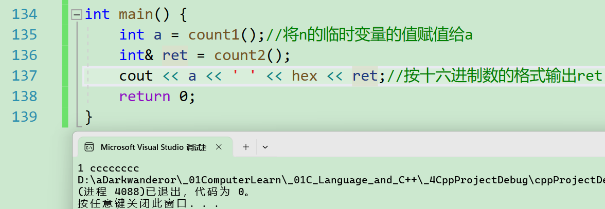
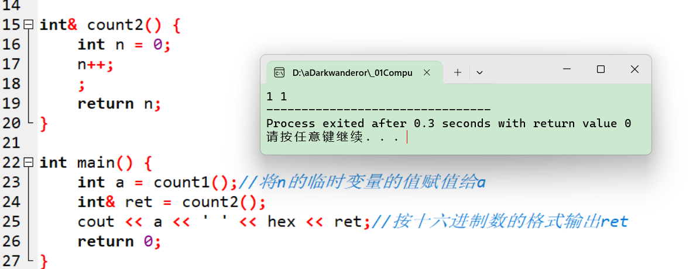
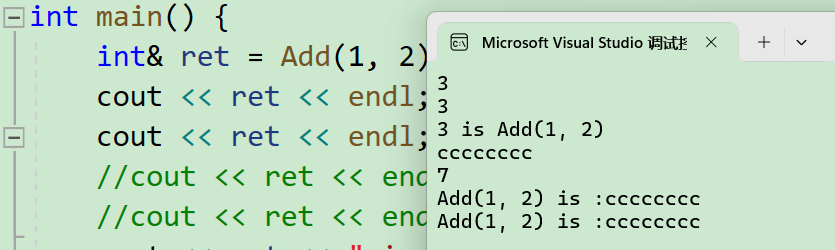
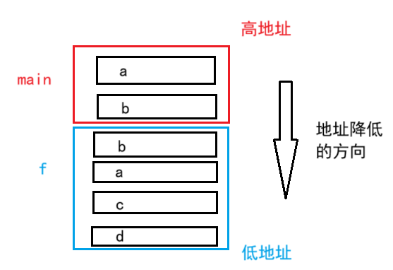
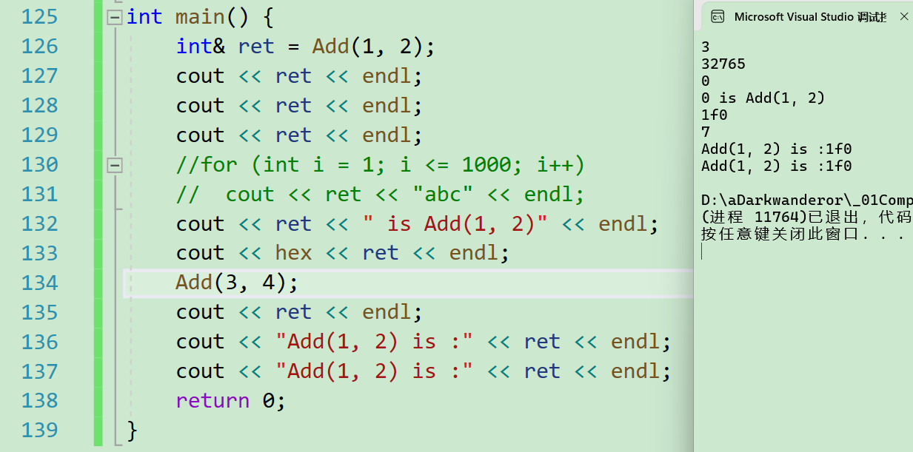
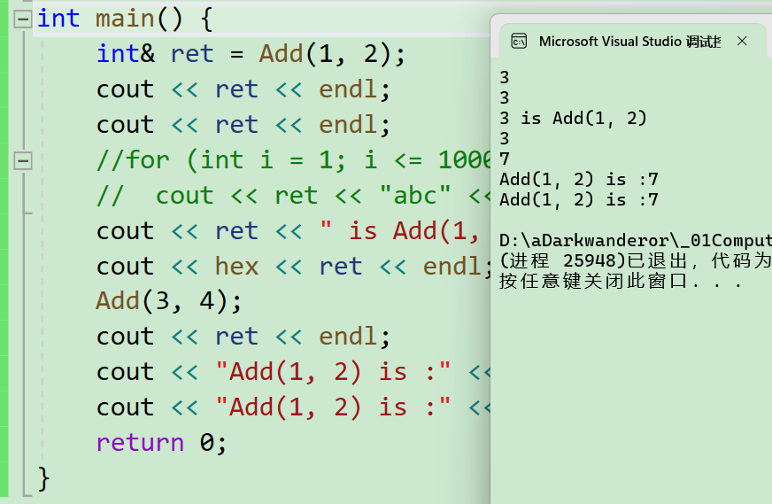
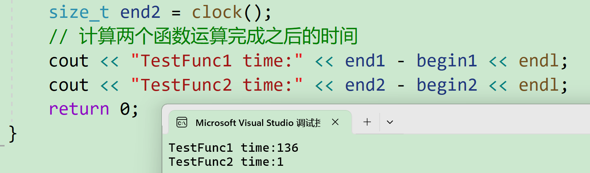
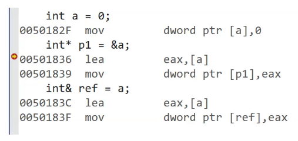
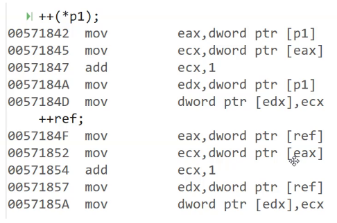
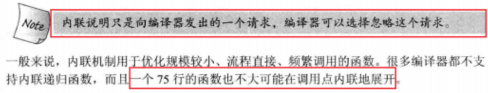

# 引用

## 引用概念和使用

引用不是新定义一个变量，而是**给已存在变量取别名**，编译器不会为引用变量开辟内存空间，它和它引用的变量**共用同一块内存空间**。

> java抄c++的引用后，连指针都抄没了。因为java基于这3个原因把显指针的概念隐藏：
>
> 1. 安全性考虑。即减少越界访问。
> 2. 简化编程模型。因为指针学习成本相对其他知识点来说比较高，还很容易造成逻辑混乱。
> 3. 垃圾回收机制。即通过指针在堆区申请的空间需要用户来回收，java会自动管理内存。
>
> 引用的出现还是因为指针难用。

格式：

`类型& 引用变量名(对象名) = 引用实体;`

例子:

```cpp
#include<iostream>
using namespace std;

int main() {
	int b = 0;
	int& a = b;//a相当于b的别名
	cout << b << endl;
	a = 3;
	cout << b << endl;//可以尝试更改a，b
	cout << &a << endl << &b << endl;//查看他们的地址
	return 0;
}
```

运行结果之一：

```cpp
0
3
000000E6E7AFFAC4
000000E6E7AFFAC4

```

> 复习：`&`这个符号的含义有3个：
>
> 1. 位与（例如：`a=a&b;`，2个变量存储的数据是以若干位 bit 位的形式存在，这2个变量的 bit 位之间进行逻辑与操作）
> 2. 取地址(`&var`)（例如：`int a=1;int b=&a`）
> 3. 引用(例如：`int& a = b;`)
>
> 取地址还衍生出一种说法：输出型参数，即**希望函数对实参内容直接进行修改的形参**。
>
> 例如：
>
> ```cpp
> #include<iostream>
> using namespace std;
> 
> void f(int* a){
>     a=3;
> }
> int main(){
>     int a=1;
>     f(&a);
>     cout<<a<<endl;//通过函数f修改a的值
>     return 0;
> }
> ```
>
> 适用场景：如函数形参用引用，形参是实参的别名，可省去很多底层实现。

注意：**引用类型**必须和引用**实体**是**同种类型**的。

引用特性：

1. 引用在**定义时必须初始化**，形如`int& a;`这种不允许。

2. 一个变量可以有多个引用（给别名取别名）。

3. 引用一旦引用一个实体，再不能引用其他实体。


## 使用场景

### 引用做参数

引用做形参的好处：当上万字节的对象不方便拷贝时用引用做形参可**节省空间上的开支**。

```cpp
void Swap(int& left, int& right){
   int temp = left;
   left = right;
   right = temp;
}
```

使用指针也能做到同样的功能，但实参要上传地址。

```cpp
void Swap(int* left, int* right){
   int temp = *left;
   *left = *right;
   *right = temp;
}
```


### 引用做返回值

```cpp
int& f(){
    return 0;
}
```

注意：如果函数返回时，进程（可以理解为程序的进度）**跳出了函数作用域**，但**返回对象还在**(还没还给系统)，则可以使用引用返回，如果已经还给系统了，则必须使用传值返回。

若引用为返回值的函数依旧选择了传递局部变量返回，则会发生未定义行为。

下面通过vs2019对这种未定义行为进行分析。这里做返回值的测试都是未定义行为，频繁的访问系统回收的空间可能引发大范围的bug，所以不要轻易尝试。

#### 传局部变量的值返回

```cpp
#include<iostream>
using namespace std;

int count1() {
	int n = 0;
	n++;
	return n;
}

int& count2() {
	int n = 0;
	n++;
	return n;
}

int main() {
	int a = count1();//将n的临时变量的值赋值给a
	int& ret = count2();
	cout << a << ' ' << hex << ret;//按十六进制数的格式输出ret
	return 0;
}
```

`count2`是**传引用返回**，相当于是**返回局部变量**`n`的**别名**（引用），但其实`n`在`count2`函数中生成后，随着`count2`的结束运行而销毁。因此`ret`访问`n`的**时间并不确定**，也就造成`ret`可能是1，也可能是随机值（系统初始化栈时用的值，vs环境是`0xcccccccc`)，这个取决于编译器。

比如，vs2019的msvc（cl.exe）：



又比如，Dev-cpp的g++.exe：




#### 被销毁的空间的不确定性

```cpp
#include<iostream>
using namespace std;

int& Add(int a, int b) {
    //int d[1000]={0};
    int c = a + b;
    return c;
}
int main() {
    int& ret = Add(1, 2);
    cout << ret << endl;
    cout << ret << endl;
    //cout << ret << endl;//这就有了一个现象，只要ret表示的内存不被征用，一直是3
    //cout << ret << endl;
    cout << ret << " is Add(1, 2)" << endl;//字符串征用了ret代表的空间后，那片空间被回收
    cout << hex << ret << endl;
    Add(3, 4);
    cout << ret << endl;
    cout << "Add(1, 2) is :" << ret << endl;//虽然是7，但不是所有编译器都会输出7
    cout << "Add(1, 2) is :" << ret << endl;
    return 0;
}
```

输出结果（环境为vs2019）：



`ret`实际代表的是已经被系统回收的整型变量`c`的空间，这样访问（`int& ret = Add(1, 2);`）无异于越界访问。

在vs2019中的运行情况进行分析：

引用变量`ret`初始化为引用函数`Add`的返回值`c`，代码中先输出两次`ret`，相当于将`ret`的引用上传给函数`<<`（在c++，部分操作符也能变成函数，详见运算符重载）得到的是`Add(1, 2)`的返回值3。虽然重新调用了`ret`代表的空间，但`ret`指向的值没有发生变化。

当向`cout`输出一个字符串形参时，`ret`代表的空间被调用，用于存储字符串。之后字符串被系统回收，空间包括`ret`代表的空间被初始化，所以第16行输出的是初始化后的值。

再调用一次`Add(3, 4)`，`ret`也就是局部变量`c`的值变成7。不是所有编译器都会输出7，这个取决于编译器是怎么讲c++源码翻译成机器码的。

再次上传字符串作为形参，则空间又会被征用，用于存储字符串。

因此在`n`之前先定义一个占字节数比较大的东西（如1000个元素的数组），此时`Add`的占用空间便影响不到`n`的占。

#### 引入占用大量空间的数组

这里首先描述在小端存储的电脑，对函数栈帧和局部变量的创建的特性：

```cpp
#include<iostream>
using namespace std;

void f(int a,int b) {
    cout << (void*)&(a) << endl;
    cout << (void*)&(b) << endl;
    int c = 3;
    int d = 4;
    cout << (void*)&(c) << endl;
    cout << (void*)&(d) << endl;
}
int main() {
    int a = 3;
    int b = 3;
    cout << (void*)&(a) << endl;
    cout << (void*)&(b) << endl;
    f(a,b);
    return 0;
}
```

输出结果之一：

```cpp
008FFDA0
008FFD94
008FFCBC
008FFCC0
008FFCA8
008FFC9C

```

可以看到在`main`函数中先后创建了2个局部变量`a`和`b`，`a`的地址大于`b`，说明`main`函数空间是从高地址往低地址扩展；而`f`函数的形参则是逆序创建，即先创建形参`b`，再创建形参`a`；最后在`f`函数内创建的2个局部变量依旧满足往低地址扩展的规律。



利用这个规律，这里给出一个测试用的程序：

在定义`c`之后引入一个数组时，因为`ret`一直指向同一片空间，多次调用`<<`函数，`<<`的形参对`ret`指向的空间造成干涉，所以第 2 次输出`ret`不是最开始的值，直到再次调用`Add`函数或输出字符串等征用空间的行为发生时值才会再次变化（仅限msvc，这里不再给出g++的测试结果）。

```cpp
#include<iostream>
using namespace std;

int& Add(int a, int b) {
	int c = a + b;
	int d[1000] = { 0 };
	return c;
}
int main() {
	int& ret = Add(1, 2);
	cout << ret << endl;
	cout << ret << endl;
	cout << ret << endl;
	//for (int i = 1; i <= 1000; i++)
	//	cout << ret << "abc" << endl;
	cout << ret << " is Add(1, 2)" << endl;
	cout << hex << ret << endl;
	Add(3, 4);
	cout << ret << endl;
	cout << "Add(1, 2) is :" << ret << endl;
	cout << "Add(1, 2) is :" << ret << endl;
	return 0;
}
```



当调换`c`和数组的定义顺序时，`<<`函数征用的空间正好是数组占用的空间，`ret`指向的空间不受影响，于是一直输出同一个值，直到再次调用`Add`函数。

```cpp
#include<iostream>
using namespace std;

int& Add(int a, int b) {
	int d[1000] = { 0 };
	int c = a + b;
	return c;
}
int main() {
	int& ret = Add(1, 2);
	cout << ret << endl;
	cout << ret << endl;
	//for (int i = 1; i <= 1000; i++)
	//	cout << ret << "abc" << endl;
	cout << ret << " is Add(1, 2)" << endl;
	cout << hex << ret << endl;
	Add(3, 4);
	cout << ret << endl;
	cout << "Add(1, 2) is :" << ret << endl;
	cout << "Add(1, 2) is :" << ret << endl;
	return 0;
}
```

输出结果（同样仅限msvc）：



> 这里的机制目前我也没弄明白，可能是编译器的优化，即函数栈帧回收时，有可能刻意不回收，因为提前计算好整个程序需要调用的栈空间的大小（c++程序和c语言一样都是文本代码一次性编译后形成的固定可执行程序，内部不会再发生变化）；也有可能回收较慢，还没来得及回收就被二次调用。
>
> 具体是哪一种，需要更深层次的解析cpp代码生成的反汇编。因为不同的编译器，可能有不同的结果，这个取决于编译器如何翻译cpp代码。
>
> c++标准只是要求编译器要实现指定的功能，并不指定要怎么实现这个功能，所以各个编译器厂家会根据自己的理解和需求，在满足标准的前提下再在底层实现。

但这个情景也不是不能使用而是想办法让这个**引用变量代表的空间不被系统回收**。例如，传引用返回的返回值是一个静态局部变量：

```cpp
#include<iostream>
using namespace std;

int& f() {
	static int times = 0;
	times++;
	return times;
}
int main() {
	int& num = f();
	for (int i = 0; i < 20; i++) {
		num++;
		cout << f() << ' ';
		cout << num << endl;
	}
	return 0;
}
```

引用做返回值最常用的地方在[类的拷贝构造函数](https://blog.csdn.net/m0_73693552/article/details/145271679)。

## 常引用和变量权限

例子：

```cpp
int f() {
	int a = 0;
	return a;
}

int main() {
	//int& ret = f();//报错：非常量的引用的初始值必须为左值
	const int& ret = f();
	return 0;
}
```

`f()`会返回一个**临时变量（或对象）**，在`main`函数中需要用一个常变量引用来给这个临时变量取别名。

> 在以后的继承关系中，派生类赋值给基类存在切片赋值的情况，那种情况不会产生临时对象。具体见后期的类继承。

用**const修饰**后，**临时变量的生命周期被延长**，直到不再访问`ret`（即`ret`出了作用域，编译器会自行处理，且这个临时变量也只能通过`ret`访问）。

对编译器，或者说对c语言和c++来说，加与不加`const`算作不同的数据类型。

例子2：

```cpp
void TestConstRef() {
    const int a = 10;
    //int& ra = a;   // 该语句编译时会出错，a为常量
    const int& ra = a;
    
    // int& b = 10; // 该语句编译时会出错，b为常量
    const int& b = 10;
    
    double d = 12.34;
    //int& rd = d; // 该语句编译时会出错，类型不同
    const int& rd = d;
}
```

这里的权限可以认为是变量（或对象）的开放程度。高权限意味着允许代码对这个变量做出修改行为，低权限则不可以。权限可以平移或缩小，但不可以放大，可以简单理解为低权限的变量的引用或指针，不可赋值给高权限的变量的引用或指针。

`const int a = 10;`到`const int& ra = a;`是权限平移。两个都是常量不可修改。

`const int& b = 10;`到`int& b = 10;`是权限放大（原来的`b`经过`const`修饰不可被修改，但是去掉`const`造成的结果是`b`内的数据可修改）。因为`b`作为一个`int`类型的引用，它是常量10的别名，将可修改的引用定义成不可修改的常量，是权限放大。`int& b = 10;`是无法通过编译的。

`double d = 12.34;`到`const int& rd = d;`是权限缩小。可以通过编译。

例子3：

```cpp
void f2() {
	int i = 0;
	//double& ret = i;//报错
	const double& ret = i;//可以，权限平移。
}
```

从`int i = 0`到`double& ret = i;`会报错：无法从`int`转换为`double&`。分析：`i`是临时变量（猜测是用的常量0进行初始化），有常属性，编译器会阻止。

而从`int i = 0`到`const double& ret = i;`可以。虽然看似`i`是变量，实际`ret`是0的别名。

例子4：

```cpp
void f3() {
	int a = 0;
	int b = a;//用变量初始化，b不具有常属性
	int& c = b;//可以
    //double& d = b;//不可以，无法用int初始化double&
}
```

例子4相当于权限平移。也印证了引例3的猜想（例子2的`i`用常量0进行初始化）。

所以有**结论**：权限可以平移、缩小，但不可放大，常属性变为正常变量属性就是权限放大。给变量取别名时不可以放大别名的权限。这个规则将伴随c++学习的整个路线。


## 传值、传引用效率分析

以**值**作为参数或者返回值类型，在传参和返回期间，函数会传递实参或者返回变量的一份**临时的拷贝**，因此用值作为参数或者返回值类型，效率很低，尤其是当参数或者返回值类型非常大时（比如包含大量元素的数组的结构体），效率就更低。

看个例子就知道了：

```cpp
#include <ctime>
#include<iostream>
using namespace std;
struct A {
	int a[10000];
};
A a;
// 值返回
A TestFunc1() {
	return a;
}
// 引用返回
A& TestFunc2() {
	return a;
}
int main() {
	// 以值作为函数的返回值类型
	size_t begin1 = clock();
	for (size_t i = 0; i < 100000; ++i)
		TestFunc1();
	size_t end1 = clock();
	// 以引用作为函数的返回值类型
	size_t begin2 = clock();
	for (size_t i = 0; i < 100000; ++i)
		TestFunc2();
	size_t end2 = clock();
	// 计算两个函数运算完成之后的时间
	cout << "TestFunc1 time:" << end1 - begin1 << endl;
	cout << "TestFunc2 time:" << end2 - begin2 << endl;
	return 0;
}
```

`clock`函数可以返回程序运行到当前函数时的用时，但精度并不是很高。

TestFunc1返回一个全局（静态）对象，出了作用域a还在。

TestFunc2相比TestFunc1使用了引用返回，提高了效率。

所以这个例子得出的结果：



结论：**传值和指针在作为传参以及返回值类型上效率相差很大**。

> 堆区上的动态申请也可用引用返回。
>
> 举个例子。保时捷属于大众的一个品牌，但保时捷买的人很多，引用是保时捷，指针是大众，这样的关系不完全一样。但引用不完全等价于指针，尽管他们的内核是一样的，下文会有介绍。

传引用传参（函数形参为引用）的作用：提高效率和输出型参数。

传引用返回（出了函数作用域对象还在可以用）：提高效率和修改返回对象。

## 引用和指针对比

在**语法概念上**引用就是一个别名，没有独立空间，和其引用实体共用同一块空间。

在**底层实现上**实际是有空间的，因为**引用是按照指针方式来实现**的（也就是说存在野引用的不官方概念）。

通过vs2019自带的反汇编功能可以看出来指针和引用其实都在底层实现有空间（因为汇编指令时一样的）：



甚至做同样的操作，汇编代码也不会变：



这个例子展示部分引用和指针的不同：

```cpp
#include<iostream>
using namespace std;

int main() {
	int a = 1;
	int& b = a;
	int c = 2;
	int d[10] = { 0,1,2,3,4,5,6,7,8,9 };
	int* e = d;
	cout << sizeof(a) << ' ' << sizeof(e) << endl;
	cout << (++b) << ' ' << *(++e) << endl;
	return 0;
}
```


这里简单列举引用和指针的不同点，就不再过多解释。

1. **引用**概念上定义一个变量的**别名**，指针存储一个变量地址。

2. **引用**在定义时**必须初始化**，指针没有要求。

3. **引用**在初始化时引用一个实体后，就**不能再引用其他实体**，而指针可以在任何时候指向任何一个同类型实体。

4. **没有空引用**（即引用不存在`NULL`的概念），但有空指针（`NULL`和`nullptr`）。

5. **在sizeof中含义不同**：**引用**结果为**引用类型的大小**，但**指针**始终是**地址空间所占字节个数**(32位平台下占4个字节)。

6. **引用自加**即**引用的实体增加**1，指针自加即指针向后偏移一个类型的大小。

7. **有多级指针，但是没有多级引用**。

8. 访问实体方式不同，**指针需要显式解引用，引用编译器自己处理**。

9. **引用比指针使用起来相对更安全**。


# 内联函数

用`inline`关键字修饰的函数叫做内联函数，**编译时**C++编译器会在**调用内联函数的地方展开**，**没有函数调用建立栈帧的开销**，内联函数提升程序运行的效率。

## 内联函数的特性

1. `inline`是一种**以空间换时间**的做法，如果编译器将函数当成内联函数处理，在**编译阶段，会用内联函数的函数体替换函数调用**，
   缺陷：可能会使目标文件变大，
   优势：少了调用开销，提高程序运行效率。

2. **inline**对于编译器而言只是一个**建议**，不同编译器关于**inline**实现机制可能不同，一般建议：将**函数规模较小**（即函数不是很长，具体没有准确的说法，取决于编译器内部实现）、**不是递归、且频繁调用**的函数采用`inline`修饰，否则编译器会忽略`inline`特性。下图为
   《C++prime》第五版关于`inline`的建议：
3. `inline`不建议声明和定义分离，分离会导致链接错误。因为`inline`被展开，就没有函数地址了，链接就会找不到。


## 内联函数和宏的对比

宏是c语言的概念，即用`#define`指令替换部分符号，用于达到减小编辑成本的目的。

**宏的优缺点？**

优点：

 1.增强代码的复用性。（同一个代码片段在编写阶段用更简短的宏代替，增加代码的编写效率）

 2.提高性能。

缺点：

 1.不方便调试宏。（因为预编译阶段进行了替换）

 2.导致代码可读性差，可维护性差，容易误用。

 3.没有类型安全的检查 。

 

**C++有哪些技术替代宏**？

1. 常量定义。即换用`const`、`enum`。

2. 短小函数定义。换用内联函数。

类似的，`inline`替换宏函数，`const`替换宏常量，`enum`也用于替换宏常量（在cpp）。