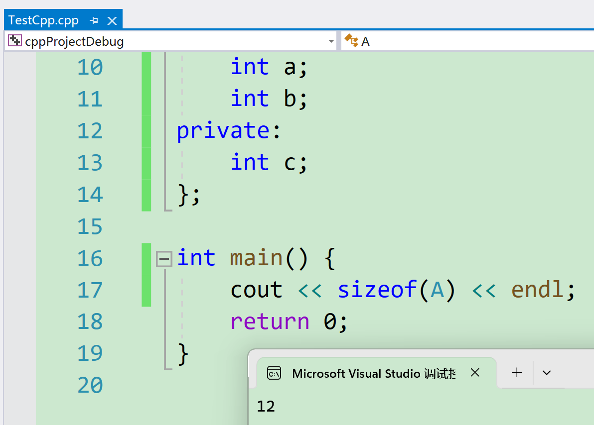
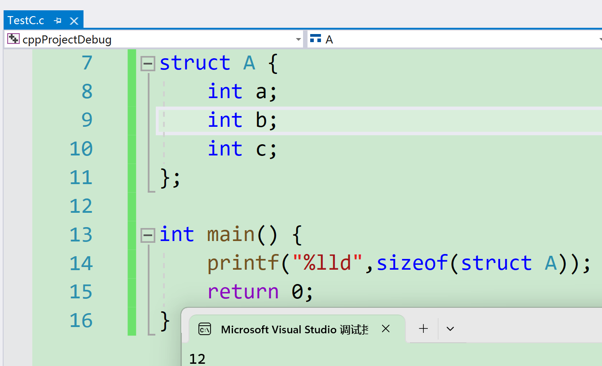
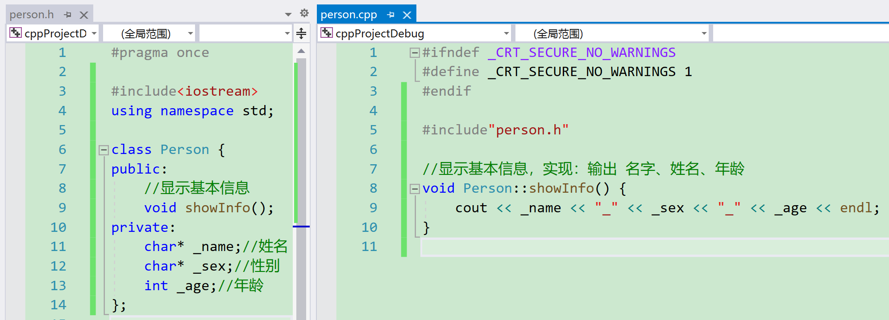
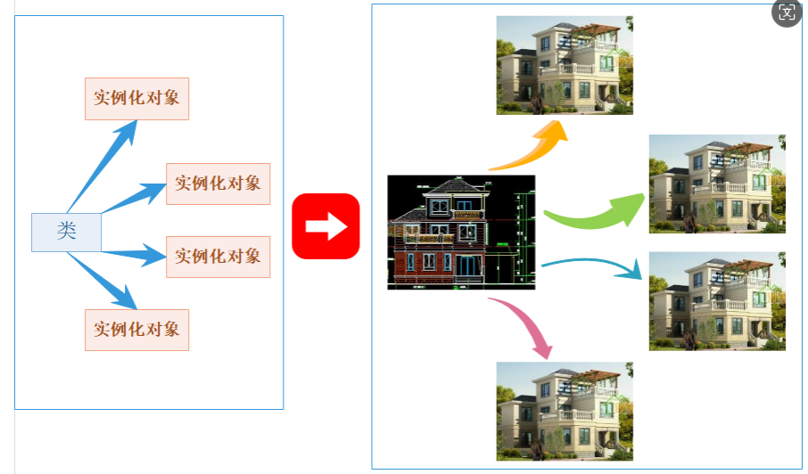

# 类和对象

类和对象是c++的开发者（本贾尼，下文称祖师爷）在设计这一块的时候根据c语言的一些习惯来针对性的进行设计。

## 面向过程和面向对象初步认识

c语言是**面向过程**的，**关注**的是**过程**，分析出求解问题的步骤，通过函数调用逐步解决问题。

c++是**基于面向对象**的，**关注**的是**对象**，将一件事情拆分成不同的对象，靠对象之间的交互完成。

c++不是纯面向对象的语言，像java这种就是纯面向对象。c++说是基于面向对象，是因为它既可以写面向过程，也可以写面向对象。

> 面向对象和面向过程的差别不止这些，在学完c++后再有一个清晰的了解更合适。

最纯粹的印象：面向过程全是一个一个的函数，函数之间互相调用互相交互来处理数据。

面向对象全是类，通过对象之间的交互解决问题。

## 类的引入

c语言的结构体变量中只能定义变量，在c++中，结构体内不仅可以定义变量，也可以定义函数。比如：

例如栈的结构体（参考[栈的c语言实现](https://blog.csdn.net/m0_73693552/article/details/143463685)）

```cpp
#ifndef _CRT_SECURE_NO_WARNINGS
#define _CRT_SECURE_NO_WARNINGS 1
#endif

#include<iostream>
#include<cassert>
#include<cstdlib>
using namespace std;
typedef int DataType;
struct Stack {
	void STInit() {//初始化栈 
		a = NULL;
		top = 0;   // top 指向栈顶数据的下一个位置
		capacity = 0;//栈中元素数初始化为0 
	}
	void STDestroy() {//销毁栈 
		free(a);//销毁alloc开辟在堆区的内存 
		a = NULL;
		top = capacity = 0;
	}

	void STPush(DataType x) {//入栈
		if (top == capacity) {
			int newCapacity = capacity == 0 ? 4 : capacity * 2;//线性表式扩容，因为栈也是特殊的线性表
			DataType* tmp = (DataType*)realloc(a, newCapacity * sizeof(DataType));
			if (tmp == NULL) {
				perror("realloc fail");
				return;
			}
			a = tmp;
			capacity = newCapacity;
		}
		a[top] = x;
		top++;//因为栈顶要指向下一个元素 
	}

	void STPop() {//出栈
		assert(!STEmpty());//栈不应该为空 
		top--;//top指向栈顶元素的下一个位置，则退一格即可 
	}

	DataType STTop() {//返回栈顶元素 
		assert(!STEmpty());
		return a[top - 1];
		//之前top指向栈顶元素的下一个位置 
	}

	bool STEmpty() {//判断栈是否为空
		return top == 0;
	}

	int STSize() {//返回栈中元素数量 
		assert(!STEmpty());
		return top;
	}
	DataType* a;
	int top;//栈顶位置
	int capacity;
};

int main() {
	struct Stack r;//c语言只能用这个
	Stack s;//c++两个都能用，这也是c语言和c++的区别之一
	s.STInit();
	s.STPush(1);
	s.STPush(2);
	s.STPush(3);
	cout << s.STTop() << endl;
	s.STDestroy();
	return 0;
}
```

所以c++第一个类的引入就是将`struct`进行了升级。因为c++兼容c语言，c++可以继续使用c语言的结构体，也可以将结构体当成类来使用。

且结构体内定义的函数可以访问成员变量，不用传参数。

这种结构体的定义，在c++中更喜欢用`class`来代替，也就是类。

## 类的定义

类的定义和结构体十分相似，只是`struct`变成了`class`，而且定义时还能定义函数。

```cpp
class className {
// 类体：由成员函数和成员变量组成
};  // 一定要注意后面的分号
```

`class`为定义类的关键字，`ClassName`为类的名字，`{}`中为类的主体，类定义结束时后面分号不能省略。

类体中内容称为**类的成员**：

* 类中的**变量**称为**类的属性**或**成员变量**。
* 类中的**函数**称为**类的方法**或者**成员函数**。

例如这个类：

```cpp
class Person{
	void showInfo(){
        cout<<_name<<"_"<<_sex<<"_"<<age<<endl;
    }
    char* _name;//姓名
    char* _sex;//性别
    int _age;//年龄
};
```

但这个类生成的对象的内容却不能访问。这时引入了访问限定符的概念。

## 类的访问限定符

c++的类对自身成员的访问进行了限制。类比生活就是每个人都有自己的隐私，这类隐私不能随便访问。所以祖师爷引入了访问限定符。

c++实现封装的方式：用类将对象的属性与方法结合在一块，让对象更加完善，通过访问权限选择性的将其接口提供给外部的用户使用。

三种访问限定符：`public`（公有），`protected`（保护），`private`（私有）。

**【访问限定符说明】**

1. `public`修饰的成员在类外**可以直接被访问**。

2. `protected`和`private`修饰的成员在**类外不能直接被访问**（此处`protected`和`private`是类似的，它们真正的区别详见[类与对象—继承-CSDN博客](https://blog.csdn.net/m0_73693552/article/details/149293427)）。

3. 访问权限**作用域**从该访问限定符出现的位置开始**直到下一个访问限定符**出现时为止。

4. 如果后面没有访问限定符，作用域就到 `} `即类结束。

5. `class`的默认访问权限为`private`，`struct`为`public`（因为`struct`要兼容C语言，即为了满足c语言能用的c++也能用）。

6. 访问限定符**只在编译时有用**，当数据映射到内存后，没有任何访问限定符上的区别。

> 第6条可以这样理解：在定义类时，类的对象的大小与存储方式，和拥有相同变量的结构体变量是一样的。访问限定符并不影响这些成员变量在内存中的布局。
>
> 例如c++的类：
>
> ```cpp
> #ifndef _CRT_SECURE_NO_WARNINGS
> #define _CRT_SECURE_NO_WARNINGS 1
> #endif
> //按c++的编译器去编译
> #include<iostream>
> using namespace std;
> 
> class A {
> public:
> 	int a;
> 	int b;
> private:
> 	int c;
> };
> 
> int main() {
> 	cout << sizeof(A) << endl;
> 	return 0;
> }
> ```
>
> 结果：
>
> 
>
> 而c语言的结构体：
>
> ```c
> #ifndef _CRT_SECURE_NO_WARNINGS
> #define _CRT_SECURE_NO_WARNINGS 1
> #endif
> //按c语言的编译器去编译
> #include<stdio.h>
> 
> struct A {
> 	int a;
> 	int b;
> 	int c;
> };
> 
> int main() {
> 	printf("%lld",sizeof(struct A));
> 	return 0;
> }
> ```
>
> 结果：
>
> 
>
> 这两个例子说明了访问限定符对数据如何在计算机中存储并不重要。但是c++的类有虚函数等新的概念造成额外的内存开销，详细见[类和对象—多态-CSDN博客](https://blog.csdn.net/m0_73693552/article/details/149293780)。

7. `public`成员函数是传引用返回，则可以间接修改`private`的成员变量。所以`private`不是不能修改，而是不能在外部修改。

例如：

```cpp
#include <iostream>
using namespace std;

class A {
public:
	int& geta() {
		return x;
	}
private:
	int x;
};

int main() {
	A a;
	a.geta() = 3;
	cout << a.geta();
	return 0;
}
```
输出：
```
3
```

8. `typedef`也会收到访问权限的影响。

问题：

c++中`struct`和`class`的区别（据说面试时有问过）：

c++需要兼容c语言，所以c++中`struct`可以当成结构体使用。

另外C++中`struct`还可以用来定义类。和`class`定义类是一样的，区别是

* `struct`定义的类**默认访问权限**是`public`，
* `class`定义的类默认访问权限是`private`。注意：在继承和模板参数列表位置，`struct`和`class`也有区别（同样是有机会再谈）。

**类里面不受访问限定符的限制**，访问限定符限定的是外面的访客。

例如：

```cpp
#ifndef _CRT_SECURE_NO_WARNINGS
#define _CRT_SECURE_NO_WARNINGS 1
#endif

#include<iostream>
using namespace std;

class A {
public:
	void f1() {
		f2();
	}
private:
	void f2() {
		cout << "hh" << endl;
	}
};

int main() {
	A a;
	//a.f2();//f2是私有函数，访问受限
	a.f1();//f1是类里面的公有函数，通过f1可以访问f2
	return 0;
}

```

## 封装
面向对象的三大特性：**封装、继承、多态**。这里简单介绍一下封装。

在类和对象阶段，主要是研究类的封装特性，那什么是封装呢？

**封装**：将数据和操作数据的方法进行有机结合，**隐藏对象的属性和实现细节**，**仅对外公开接口来和对象进行交互**。

**封装本质上是一种管理**，让用户更方便使用类。

> 比如：对于电脑这样一个复杂的设备，提供给用户的就只有开关机键、通过键盘输入，显示器，USB插孔等，让用户和计算机进行交互，完成日常事务。但实际上电脑真正工作的却是CPU、显卡、内存等一些硬件元件。(人话，想给用户访问的设成公有，否则设成私有)
>
> 对于计算机使用者而言，不用关心内部核心部件，比如主板上线路是如何布局的，CPU内部是如何设计的等，用户只需要知道，怎么开机、怎么通过键盘和鼠标与计算机进行交互即可。
>
> 因此计算机厂商在出厂时，在外部套上壳子，将内部实现细节隐藏起来，仅仅对外提供开关机、鼠标以及键盘插孔等，让用户可以与计算机进行交互即可。

在c++语言中实现封装，可以**通过类将数据以及操作数据的方法进行有机结合**，**通过访问权限来隐藏对象内部实现细节**，**控制哪些方法可以在类外部直接被使用**。

> 通俗的解释是c++将数据放到同一个类里，**想给用户访问的设置成公有**，**不想给用户访问的设置成私有**，这就是封装最通俗的解释。就像人会把重要的但不能给别人看的东西放进保险柜里。
>
> c语言和c++相比并不能直接阻止用户访问特定数据，一旦用户不遵操作文档去使用，会产生更多的问题。
>
> c语言是数据和方法是分离，自由。自由在编程中并不是好事，编程中的自由、灵活都是贬义的。写代码是工程，需要严格的管控，若不管控就会产生严重的后果，因为工程性的代码都是庞大的。
>
> 例如兵马俑不做管控的话，会有游客在古物上刻字什么的。

c++是**数据和方法是封装在一起**，严格管控的。且c++的封装使很多没必要上传的实参不用上传，比如`this`指针（见[类和对象——类的成员函数的this指针-CSDN博客](https://blog.csdn.net/m0_73693552/article/details/145243078?spm=1001.2014.3001.5501)）。

## 类的作用域

**类定义了一个新的作用域**，类的所有成员都在类的作用域中**。**在类体外定义成员时，需要使用 `::` 

作用域操作符指明成员属于哪个类域。

其实c++中用`{}`括起来的都是一个域。例如循环、条件语句、函数和现在的类。

```cpp
class Person {
public:
    void PrintPersonInfo();
private:
    char _name[20];
    char _gender[3];
    int  _age;
};
// 这里需要指定PrintPersonInfo是属于Person这个类域
void Person::PrintPersonInfo() {
    cout << _name << " "<< _gender << " " << _age << endl;
}
```

## 再谈类的定义

类的定义分成两种形式。

### 声明和定义全部放在类体中

例如：

```cpp
class Person{
public:
	void showInfo(){
        cout<<_name<<"_"<<_sex<<"_"<<age<<endl;
    }
public:
    char* _name;//姓名
    char* _sex;//性别
    int _age;//年龄
};
```

需注意：成员函数如果**在类中定义**，编译器可能会将其当成**内联函数**处理。

### 声明和定义放在不同的文件

最常用的是类的声明和成员变量放在.h文件中，成员函数定义放在.cpp文件中，注意：**成员函数的定义需要在成员函数名前加**`类名::`。

例如:



一般情况下，更期望采用第二种方式。

要加`类名::`是因为函数中可能出现**类的成员变量和成员函数的调用**。如果不加则函数会将成员变量当成全局的，但在全局找不到就会报错。

在c语言中，函数体内出现了新的变量和函数调用，编译器会向上找，但不能向下找，是防止找的停不下来。

但类是有范围的，类中的元素是一个整体，怎么找都会找到尽头，因此类中元素可以不怎么在意顺序。

## 类的成员变量的风格

例如：

```cpp
class Date {
public:
   	void Init(int year, int month, int day) {
   		year = year;
   		//两个同名怎么认出来？
   		_month = month;
   		day_ = day;
   	}
private:
   	int year;
   	int _month;
   	int day_;
};
```

不讨论编译器是怎么认出两个`year`的，从程序员的角度看这个代码的可读性似乎不是特别好，两个`year`哪个是成员变量，哪个是形参，并不好区分。

所以有的人会在成员变量前加个`_`。比如`_month`。

> 加`_`只是一种风格。风格不限制，怎么加的都有，也有不加的，例如谷歌的程序员喜欢后加`_`。这个只能说是俗成规定，具体看个人和公司要求。


## 类的实例化

因为类中的成员变量一般没有赋初值，是声明，在外部不可以直接访问。

> 举例：买房，首付50w，还差20w，我说我给朋友借点钱，朋友说会给。此时这个声明就是一个承诺。当交首付时朋友打了20w给我凑首付，此时定义就是一个实现。
>
> 类比到c语言：声明是告诉编译器有这个东西，定义是告诉这个东西的实现并给内存和地址。
>
> 类中的东西没有开空间，都是声明，所以外部不能直接访问。

**用类的类型创建对象的过程**，**称为类的实例化**。

1. **类是对对象进行描述的**，是一个**模型**一样的东西，限定了类有哪些成员，定义出一个类**并没有分配实际的内存空间**来存储它。比如：入学时填写的学生信息表，表格就可以看成是一个类，来描述具体学生信息。但学生并不等于学生信息表。

> 还有一种说法是类就像谜语一样，对谜底来进行描述，谜底就是谜语的一个实例。
>
> 谜语："年纪不大，胡子一把，主人来了，就喊妈妈" 谜底：山羊。

2. 一个类可以实例化出多个对象，**实例化出的对象占用实际的物理空间**，**存储类成员变量**。

```cpp
#include<iostream>
using namespace std;
class Person{
public:
	void showInfo(){
        cout<<_name<<"_"<<_sex<<"_"<<age<<endl;
    }
public:
    char* _name;//姓名
    char* _sex;//性别
    int _age;//年龄
};

int main() {
    //Person._age = 100;//私有变量不可在外部访问,更何况这个变量不存在
    Person Johnny;//定义对象，这才是开空间。
    //Johnny.showInfo();//对象的成员变量也是变量，和访问未初始化的局部变量一样，但编译器并不阻止。
    return 0;
}
```

`Person`类是没有空间的，只有`Person`类实例化出的对象才有具体的年龄。

3. 做个比方。**类实例化出对象就像现实中使用建筑设计图建造出房子**，**类就像是设计图**，只设计出需要什么东西，但是并没有实体的建筑存在，同样类也只是一个设计，实例化出的对象才能实际存储数据，占用物理空间。



类在内存中不占空间，只占用文本的空间（或者说磁盘的空间，就是类还是文本代码时占用的空间）。

**类型——变量**，

**类——对象**。叫法不同，类声明或定义的对象也能叫变量，和别的程序员不冲突就行。