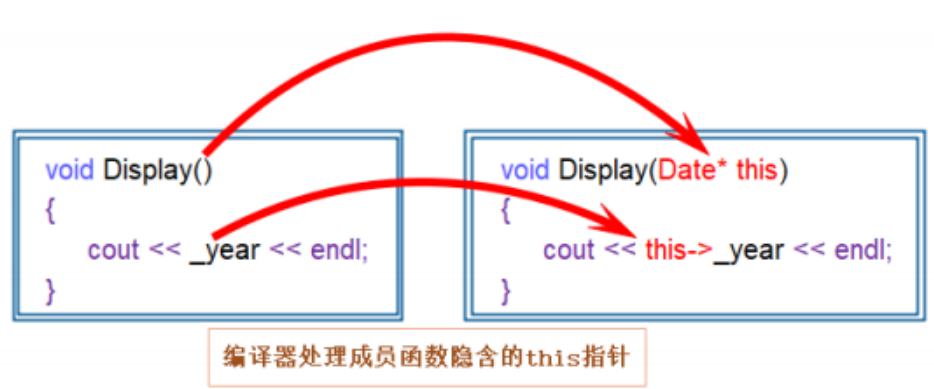

# 类的成员函数的this指针

之前有这样一个例子：在类的成员名和成员函数的形参名相同时，编译器可以区分2个同名的变量。

```cpp
class Date {
public:
   	void Init(int year, int month, int day) {
   		year = year;
   		//两个同名怎么认出来？
   		_month = month;
   		day_ = day;
   	}
private:
   	int year;
   	int _month;
   	int day_;
};
```

这一特点通过隐藏的`this`指针实现。

## this指针的概念

类的每个成员函数都有一个隐藏形参：隐藏的`this`指针。`this`在c++中定义成关键字。

即：c++编译器给每个“**非静态的成员函数**“**增加了一个隐藏的指针参数**，让该指针指向当前对象（**函数运行时调用该函数的对象**），在函数体中所有“成员变量”的操作，都是通过该指针去访问。只不过所有的操作对用户是透明的，即用户不需要来传递，编译器自动完成。

> **其他面型对象的语言**也是这么干，但不一定是指针可能是引用。

这个`this`指针是编译器加的。c++规定这个特殊的老六必须叫`this`。而且自己还**不能在代码编辑阶段加**上`this`这么个形参。

`this`在实参和形参的位置不能显示写，但**在类里可以显示着用**。

调用的地方也会被编译器在编译阶段更改：

```cpp
class Date {
public:
   	void Init(/*Date* this,*/int year, int month, int day) {
   		this->year = year;
   		_month = month;//省略this，编译时会加上
   		day_ = day;
   	}
private:
   	int year;
   	int _month;
   	int day_;
};

void f(){
    Date d1, d2;
    d1.Init(/*&d1,*/2022,1,11);//这里进行初始化
    d2.Init(/*&d2,*/2022, 1, 12);
    d1.Print(/*&d1*/);
    d2.Print(/*&d2*/);
}
```

> `this`是c++祖师爷自己定义、发明的规则。
>
> 若c++是很早就流传下的编程语言，而且c++没有文献流传下来，有人这么用琢磨出来还能说是发现吗？
>
> `this`可以改名 that 或其他东西，这个需要自己定义新的编程语言。
>
> 一般编写程序时并不加上`this`。在特定的地方`this`有自己的价值。

## this指针的使用

### 成员函数调用成员函数

成员函数也可以访问其他的成员函数，通过`this`来调用。

```cpp
#include<iostream>
using namespace std;

void f2() {
	cout << "xyz\n";
}

class A {
public:
	void f1() {
		this->f2();
		f2();//有隐藏的this指针
		::f2();//指定域名才会调用全局，说明this指针在发挥作用
	}
	void f2() {
		cout << "abc\n";
	}
};

int main() {
	A a;
	a.f1();
	return 0;
}

```

输出：

```
abc
abc
xyz

```


### this指向的地址

不同成员函数中的形参`this`不一样，他们是各自函数的形参，形参和成员函数是一个整体。但同1个对象调用的不同成员函数，它们指向的地址相同，都是调用这些函数的对象的地址。

例如这个案例：

```cpp
#include<iostream>
using namespace std;

class A {
public:
	void f1() {
		cout << (void*)(this) << endl;
	}
	void f2() {
		cout << (void*)(this) << endl;
	}
};

int main() {
	A a, b;
	a.f1();
	a.f2();
	cout << (void*)(&a) << endl;
	cout << (void*)(&b) << endl;
	return 0;
}

```

输出结果之一：

```cpp
00B3FABF
00B3FABF
00B3FABF
00B3FAB3

```

若对`this`进行取地址操作，会被编译器告知不可对左值取地址，从而阻止编译通过。这也就解释了之前不同的域里可以定义同名变量的现象。

## this指针的特性

### this指针的常属性

`this`指针的类型：`类类型* const`，即成员函数中，不能给`this`指针赋值。`const`修饰后面的`this`，使得`this`**本身不可修改**。但`this`作为指针变量，它**指向的地址的内容只要不是加了常属性也可以修改**。

同时`this`指针只能在类的“**成员函数**”**的内部使用**。

给`this`指针加`const`，使得`this`指向的地址的内容也不可修改，只需在`)`和`{`之间加`const`修饰成员函数即可。

```cpp
class A {
public:
	void get()const {
		cout << a << endl;
		//a = 3;//this经过const修饰，不可修改它指向的对象的数据
		//this -> a = 3;
	}
	int a;
};
```

> 关于`const`和类的关系，在[类和对象——const修饰的类的对象和函数-CSDN博客](https://blog.csdn.net/m0_73693552/article/details/145912529)有介绍。

### this指针的本质

`this`指针本质上是“**成员函数**”**的形参**，当对象调用成员函数时，将对象地址作为实参传递给`this`形参。所以**对象中不存储**`this`指针。

`this`指针是“成员函数”第一个隐含的指针形参，一般情况由编译器通过ecx寄存器自动传递，不需要用户传递。




之前就有介绍过，类在编译阶段会将`this`指针给加上。

```cpp
class Date {
public:
   	void Init(/*Date* this,*/int year, int month, int day) {
   		this->year = year;
   		_month = month;//省略this，编译时会加上
   		day_ = day;
   	}
private:
   	int year;
   	int _month;
   	int day_;
};

void f(){
    Date d1, d2;
    d1.Init(/*&d1,*/2022,1,11);//这里进行初始化
    d2.Init(/*&d2,*/2022, 1, 12);
    d1.Print(/*&d1*/);
    d2.Print(/*&d2*/);
}
```

> 数据存储的几个区域：栈、堆、静态区、常量区。
>
> 首先需要纠正一个错误的观点：`this`存在对象里面。
>
> `this`指针是对象的地址，不可能存在对象里。就算存在对象里，在计算对象地址里的时候并没有`this`指针的存在，也不能对`this`取地址。

`this`是一个形参，一般是存在栈帧里面。vs下一般会用ecx寄存器直接传递。

## this为空指针的情况

`this`指针可以为空，但只能调用成员函数，不能调用成员变量。

`this`指针为空的案例：

```cpp
// 1.下面程序编译运行结果是？ A、编译报错 B、运行崩溃 C、正常运行
#include<iostream>
class A {
public:
	void Print() {
		using namespace std;
		cout << "Print()" << endl;
	}
//private:
	int _a;
};
int main() {
	A* p = nullptr;
	p->Print();
	p->_a;//空指针的解引用，但这里并不报错
	return 0;
}
```
这里空指针并不会报编译错误，所以不能选A。

在编译中的某个阶段，代码都会转换成汇编指令，可以调用后台汇编查看。`p->Print()`表示调用函数，而函数不用在对象里去找而是**用函数名修饰后生成的字符集去公共的代码区域找**。至于传递`this`指针，将`p`的值传递给了`this`指针。

在这里部分编译器进行了各种未知的优化。因为`p->_a;`这里什么也没做，有的编译器并不会报错而是给警告。

但要是`p->_a=1;`就会发生错误，因为`p`毕竟是个空值指针，这么做相当于将从地址0开始的若干字节当成类的对象进行访问，本质就是越界访问，程序必定会崩溃。

案例变更：

```cpp
// 1.下面程序编译运行结果是？ A、编译报错 B、运行崩溃 C、正常运行
#include<iostream>
class A {
public:
	void PrintA() {
		using namespace std;
		cout << "PrintA()" << endl;
	}
	//private:
	int _a;
};
int main() {
	A* p = nullptr;
	(*p).PrintA();
	p->_a;
}
```

这里同样的道理，`PrintA`不在对象中，不需要解引用，因此可以正常运行。

案例再变更：

```cpp
// 1.下面程序编译运行结果是？ A、编译报错 B、运行崩溃 C、正常运行
#include<iostream>
class A {
public:
	void PrintA() {
		using namespace std;
		cout << _a << endl;
	}
//private:
	int _a;
};
void f2() {
	A* p = nullptr;
	(*p).PrintA();
	p->_a;
}
```

因为`PrintA`中有调用成员函数`_a`，而对象是个空指针，于是程序会去访问地址为0处的对象`p`的成员变量，这种行为就是野指针。所以选B运行崩溃。

## c语言和c++实现Stack的对比

### c语言实现

c语言实现见[栈的c语言实现](https://blog.csdn.net/m0_73693552/article/details/143463685)。其中`typefef struct Stack{} ST;`表示`ST`和`Stack`是一样的。这里就不具体实现。

可以看到，在用c语言实现时，`Stack`相关操作函数有以下共性：

* 每个函数的第一个参数都是`Stack*`。
* 函数中必须要对第一个参数检测，因为该参数可能会为`NULL`。
* 函数中都是通过`Stack*`参数操作栈的。
* 调用时必须传递`Stack`结构体变量的地址。
* 结构体中只能定义存放数据的结构，操作数据的方法不能放在结构体中，即**数据和操作数据的方式是分离开的**，而且实现上相当复杂一点，涉及到大量指针操作，稍不注意可能就会出错。

### c++实现

```cpp
typedef int DataType;
class Stack {
public:
	void STInit() {//初始化栈 
		a = NULL;
		top = 0;   // top 指向栈顶数据的下一个位置
		capacity = 0;//栈中元素数初始化为0 
	}

	void STDestroy() {//销毁栈 
		free(a);//销毁alloc开辟在堆区的内存 
		a = NULL;
		top = capacity = 0;
	}

	void STPush(DataType x) {//入栈
		checkCapacity();
		a[top] = x;
		top++;//因为栈顶要指向下一个元素 
	}

	void STPop() {//出栈
		assert(!STEmpty());//栈不应该为空 
		top--;//top指向栈顶元素的下一个位置，则退一格即可 
	}

	DataType STTop() {//返回栈顶元素 
		assert(!STEmpty());
		return a[top - 1];
		//之前top指向栈顶元素的下一个位置 
	}

	bool STEmpty() {//判断栈是否为空
		return top == 0;
	}

	int STSize() {//返回栈中元素数量 
		return top;
	}
private:
	void checkCapacity() {
		if (top == capacity) {
			//线性表式扩容，因为栈也是特殊的线性表
			int newCapacity = capacity == 0 ? 4 : capacity * 2;
			DataType* tmp = (DataType*)realloc(a, newCapacity * sizeof(DataType));
			if (tmp == NULL) {
				perror("realloc fail");
				return;
			}
			a = tmp;
			capacity = newCapacity;
		}
	}
	DataType* a;
	int top;//栈顶位置
	int capacity;
};
```

c++中通过类可以将数据，以及操作数据的方法进行**封装**，在使用时就像使用自己的成员一样，更符合人类对一件事物的认知。

而且每个方法不需要传递`Stack*`的参数了，编译器编译之后该参数会自动还原。
即c++中`Stack *`参数是编译器维护的，c语言中需用用户自己维护。