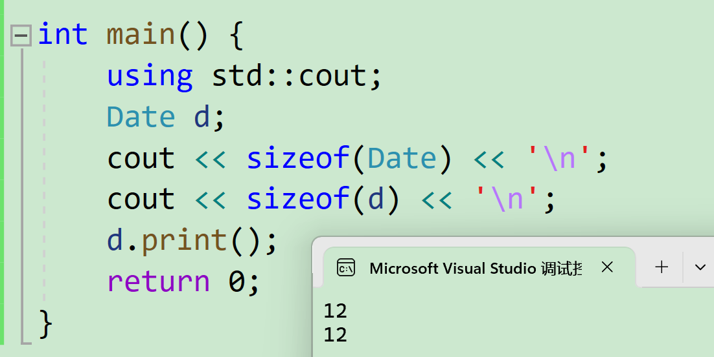
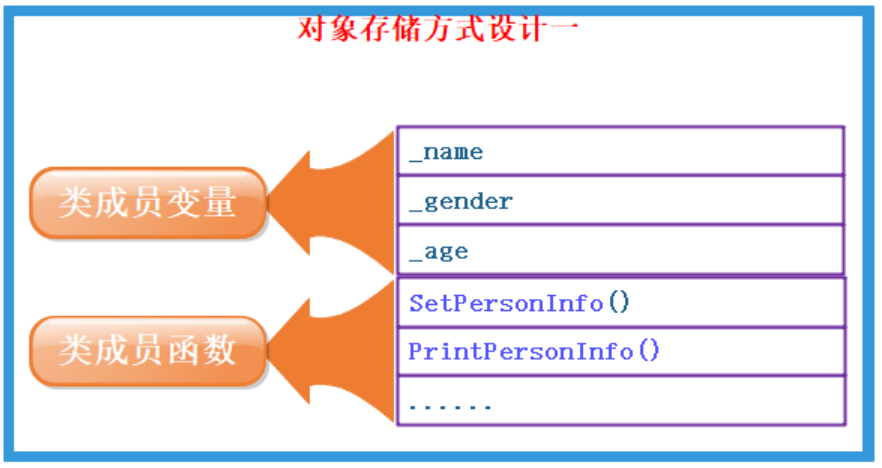
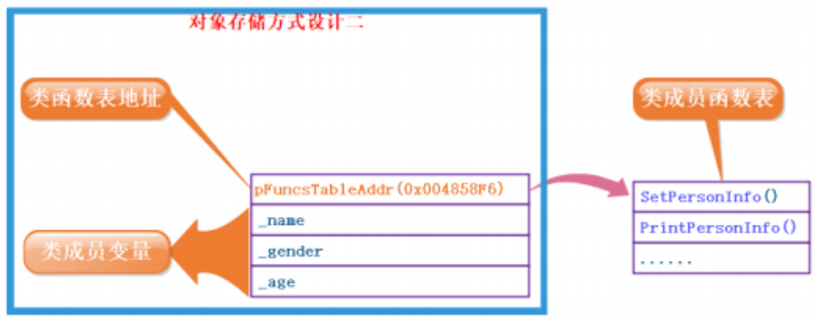
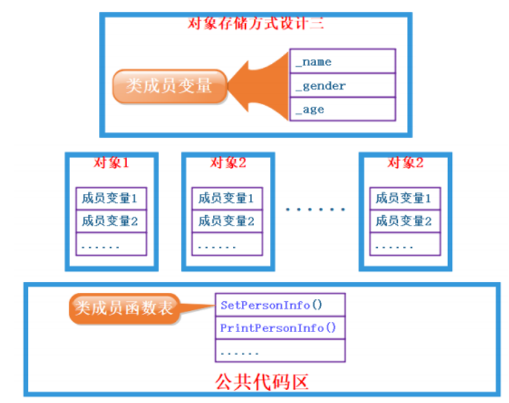
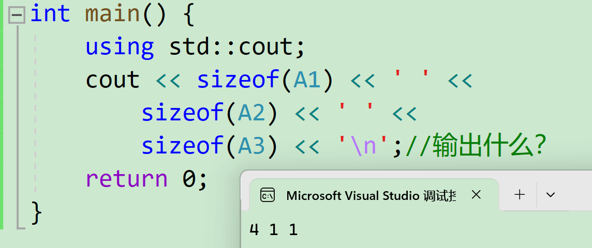
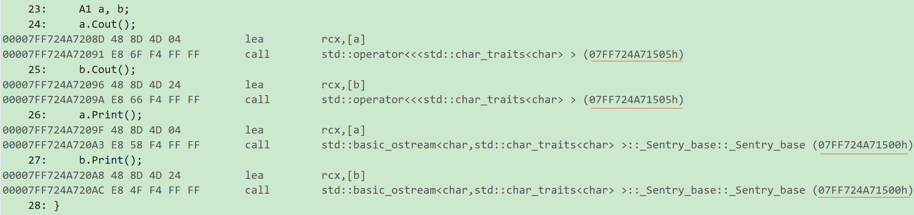
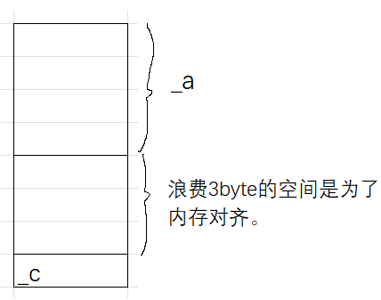
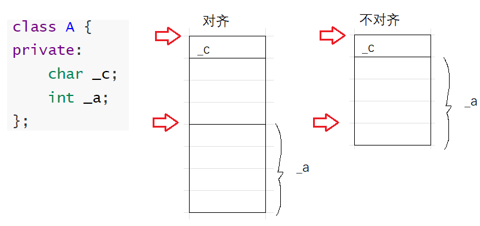
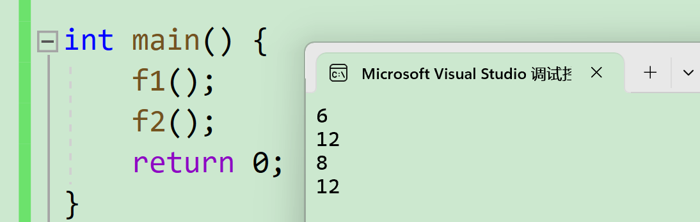

#  类的对象大小的计算

## 案例分析

```cpp
#include<iostream>

class Date {
public:
    void Init(int year, int mouth, int day) {
        year = year;
        _mouth = mouth;
        day_ = day;
    }
    void print() {
        ;
    }
private:
    int year;
    int _mouth;
    int day_;
};

int main() {
    using std::cout;
    Date d;
    cout << sizeof(Date) << '\n';
    cout << sizeof(d) << '\n';
    d.print();
    return 0;
}
```

输出：



说明函数并没有算进来，连指针都没有。

> c++的类遵循c语言的结构体的对齐规则。

这里涉及到公共的和私有的区别。对象各自的成员变量不是同一个，但对象各自的成员函数是同一个。

> 若在每一个对象里安置一个函数的内存并不划算。
>
> 类比的话，小区的健身房、泳池等都是公共的，但小区的卧室、客厅每家都各有一个。
>
> 每家都有一个泳池、健身房不划算，除非特别有钱。
>
> 成员函数就是公共的，成员变量是每个对象独有的。

所以`d.print();`是在代码的公共区去找。

> 没有类的函数表的概念，只有公共的代码区域，和全局函数一样都是存在那个区域。
>
> 从进程的角度叫代码钻(?扯到Linux了)。

## 如何计算类对象的大小

### 案例分析中的猜测

例如这个类：

```cpp
class A {
public:
    void PrintA() {
        using std::cout;
        cout<<_a<<"\n";
    }
private:
    char _a;
};
```

类对象的存储方式猜测：

1. 对象中包含类的各个成员。



缺陷：每个对象中成员变量是不同的，但是调用同一份函数，如果按照此种方式存储，当一个类创建多个对象时，每个对象中都会保存一份代码（特别是函数的定义），相同代码保存多次，浪费空间。

2. 代码只保存一份，在对象中保存存放代码的地址。



相比第1种猜测，这种方式节省了函数的实现，但可能带来大量的指针变量占用空间。

3. 只保存成员变量，成员函数存放在公共的代码段



问题：对于上述三种存储方式，那计算机到底是按照那种方式来存储的？

可以通过对下面的不同对象分别获取大小来分析。

```cpp
#include<iostream>
// 类中既有成员变量，又有成员函数
class A1 {
public:
	void f1() {}
private:
	int _a;
};

// 类中仅有成员函数
class A2 {
public:
	void f2() {}
};
// 类中什么都没有---空类
class A3
{};

int main() {
	using std::cout;
	cout << sizeof(A1) << ' ' <<
		sizeof(A2) << ' ' << 
		sizeof(A3) << '\n';//输出什么？
	return 0;
}
```

输出(vs2019环境下)：



> 为什么输出1？因为类要进行一个占位。c++规定这种没有成员变量的类需要分配1个字节进行占位，表示对象存在过。
>
> 这1个字节存什么不重要，标准并没有规定存的什么，这个字节也无法访问（通过非常特殊的手段比如取地址再强转等等）。
>
> 如果一个空间都不开，两个对象的区别无法表示。
>
> 例如：
>
> ```cpp
> class A3
> {};
> 
> void f() {
> 	using std::cout;
> 	A3 a1;
> 	A3 a2;
> 	cout << &a1 << '\n' << &a2 << "\n";
> }
> ```
>
> 若输出结果不同，则a1, a2是两个不同的对象。

结果说明了猜测3是正确的。

**结论**：一个类的大小，实际就是该类中”**成员变量**”**之和**，当然要注意**内存对齐**。注意空类的大小，空类比较特殊，编译器给了空类一个字节来唯一标识这个类的对象。

验证类中成员函数是否是同一个：

```cpp
#include<iostream>
#include<cstdio>

class A1 {
public:
	void Cout() {
		;
	}
	void Print();
private:
	int a;
};

void A1::Print() {
	;
}

void f2() {
	A1 a,b;
	a.Cout();
	b.Cout();
}

int main(){
    f2();//调用反汇编即可查看
    return 0;
}
```

结果之一：



两个对象调用的同一成员函数的地址是一样的，进一步验证了第3个猜测。

### 结构体内存对齐规则

详细见[c语言的自定义结构-CSDN博客](https://blog.csdn.net/m0_73693552/article/details/147600418)。

和c语言的对齐规则一样：

1. 第一个成员在与结构体偏移量为0的地址处。

2. 其他成员变量要对齐到某个数字（对齐数）的整数倍的地址处。

> 注意：对齐数 = 编译器默认的一个对齐数 与 该成员大小的较小值。vs2019默认的对齐数为8

3. 结构体总大小为：最大对齐数（所有变量类型最大者与默认对齐参数取最小）的整数倍。

4. 如果嵌套了结构体的情况，嵌套的结构体对齐到自己的最大对齐数的整数倍处，结构体的整体大小就是所有最大对齐数（含嵌套结构体的对齐数）的整数倍。

例如这个例子，按照对齐规则，4字节的`int`型成员变量和1字节的`char`型成员变量组成的类的大小为8。

```cpp
#include<iostream>
class A {
private:
	char _c;
	int _a;
};

int main() {
	using std::cout;
	A a;
	cout << sizeof(a) << "\n";
	return 0;
}
```

结构：



因为cpu访问内存时，并不是从任意位置随意访问。比如某设备一次访问32bit，从结构体的起始位置，以4byte为单位进行访问（不一定是4字节，这个需要看设备，但可以肯定是整数倍），若不对齐的话，因为cpu只能通过设计好的位置去访问。不对齐的数据会降低数据的访问效率。

无论对齐不对齐，都只能从指定位置去访问。




例如不对齐的情况下，访问a：假设设备一次读4个字节，第一次读取出除了`_c`的另外3个字节，再读一次取出第1个字节，最后拼接在一起得到4个字节。效率大大降低。而且读两次还会访问到不需要的数据。

这个对齐数可以通过`pragma`指令进行修改。

```cpp
#pragma pack(想要的默认对齐数) 
```

修改方式：

```cpp
#pragma pack(1)
//修改偏移量为1
struct A {
	char c1;
	int i;
	char c2;
}A;
#pragma pack()
//使默认偏移量变回编译器的缺省值
```

案例：

```cpp
#ifndef _CRT_SECURE_NO_WARNINGS
#define _CRT_SECURE_NO_WARNINGS 1
#endif

#include<iostream>
#include<cstdio>

#pragma pack(1)
//修改偏移量为1
struct A {
	char c1;
	int i;
	char c2;
};
//定义完A后，使默认偏移量变回编译器的缺省值
#pragma pack()
struct B {//再定义B时是按照默认对齐数进行定义
	char c1;
	int i;
	char c2;
};
void f1() {
	std::cout << sizeof(A) << "\n";
	std::cout << sizeof(B) << "\n";
}

void f2() {
#pragma pack(2)
	struct C {
		char c1;
		int i;
		char c2;
	};
#pragma pack()
	struct D {
		char c1;
		int i;
		char c2;
	};
	std::cout << sizeof(C) << "\n";
	std::cout << sizeof(D) << "\n";
}

int main() {
	f1();
	f2();
	return 0;
}
```

输出结果：

