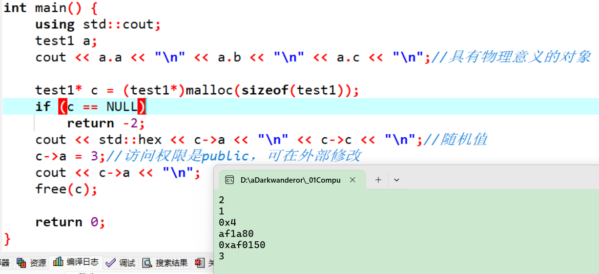

# 类的默认成员函数——构造函数

在之前用c++实现栈时用到过一个初始化函数`STInit`和销毁用函数`STDestroy`。

```cpp
typedef int DataType;
class Stack {
public:
	void STInit() {//初始化栈 
		a = NULL;
		top = 0;   // top 指向栈顶数据的下一个位置
		capacity = 0;//栈中元素数初始化为0 
	}

	void STDestroy() {//销毁栈 
		free(a);//销毁alloc开辟在堆区的内存 
		a = NULL;
		top = capacity = 0;
	}

	void STPush(DataType x) {//入栈
		checkCapacity();
		a[top] = x;
		top++;//因为栈顶要指向下一个元素 
	}

	void STPop() {//出栈
		assert(!STEmpty());//栈不应该为空 
		top--;//top指向栈顶元素的下一个位置，则退一格即可 
	}

	DataType STTop() {//返回栈顶元素 
		assert(!STEmpty());
		return a[top - 1];
		//之前top指向栈顶元素的下一个位置 
	}

	bool STEmpty() {//判断栈是否为空
		return top == 0;
	}

	int STSize() {//返回栈中元素数量 
		return top;
	}
private:
	void checkCapacity() {
		if (top == capacity) {
			//线性表式扩容，因为栈也是特殊的线性表
			int newCapacity = capacity == 0 ? 4 : capacity * 2;
			DataType* tmp = (DataType*)realloc(a, newCapacity * sizeof(DataType));
			if (tmp == NULL) {
				perror("realloc fail");
				return;
			}
			a = tmp;
			capacity = newCapacity;
		}
	}
	DataType* a;
	int top;//栈顶位置
	int capacity;
};
```

以后类的创建会越来越频繁，这种初始化和销毁的函数能不能自动运行用以简化用户的调用成本？

## 认识默认成员函数

默认的成员函数是不写，编译器会自动生成。

> 回忆在用c语言写数据结构时，经常忘记初始化变量和释放alloc系列函数申请的空间。祖师爷想着反正都创造了c++了，干脆解决这个问题。
>
> 一个类中什么成员都没有，简称为空类。
>
> 空类中真的什么都没有吗？并不是，任何类在什么都不写时，编译器会自动生成以下6个默认成员函数。

默认成员函数：用户没有显式实现，编译器会生成的成员函数称为默认成员函数。

c++在构建了类和对象的这个基础上又加了其他的东西，比如默认成员函数，即不写编译器会自动生成的成员函数。

已知的默认成员函数：

1. **构造函数**主要完成初始化工作。
2. **析构函数**主要完成清理工作。
3. **拷贝构造**是使用同类对象初始化创建另一个对象。
4. **赋值重载**主要是把一个对象赋值给另一个对象。
5. **取地址重载**：普通对象的取地址。
6. `const`**取地址重载**：`const`对象的取地址。

> 在c++11，还会新增2个默认成员函数：移动构造函数和移动赋值函数。
>
> 新增的2个涉及c++的右值引用机制，详细见c++11。

## 构造函数的概念

**构造函数**是一个特殊的成员函数，**名字与类名相同**，**创建类类型对象时由编译器自动调用**，常用于保证每个数据成员都有一个合适的初始值，并且**在对象整个生命周期内只调用一次**。

> 构造函数虽然名称叫构造，但不是构造对象，而是在构造对象时自动调用这个函数来初始化对象。构造有开空间含义。

```cpp
#include<iostream>

class A {
public:
	A() {
		//构造函数用于初始化对象的信息
		using std::cout;
		cout << "A()";
	}
};

int main() {
	A a;
	return 0;
}
```

## 构造函数的特征

**其特征如下：**

1. 函数名与类名相同。

2. 无返回值（也不需要加`void`）。

3. 对象实例化时编译器**自动调用**对应的构造函数。

4. 构造函数可以重载。（可以写很多个自己想要的构造函数来提供多种初始化方式）。

5. 通过无参构造函数创建对象时，对象后面不用跟括号，否则就成了**函数声明**。
   例如以下代码的函数：声明了`d3`函数，该函数无参，返回一个日期类型的对象。

```cpp
#include<iostream>

class Date {
public:
    // 1.无参构造函数
    Date() {}

    // 2.带参构造函数
    Date(int year, int month, int day) {
        _year = year;
        _month = month;
        _day = day;
    }

    void f() {
        std::cout << "class Date, f()\n";
    }
private:
    int _year;
    int _month;
    int _day;
};

int main() {
    Date d1; // 调无参构造函数
    Date d2(2015, 1, 1); // 调用带参的构造函数
    Date d3();
    //vs编译器发出警告：warning C4930: “Date d3(void)”: 
    //未调用原型函数(是否是有意用变量定义的?)
    //d3.f();//d3的类型被判定为Date(*)()，即被编译器当成了函数
    return 0;
}
```

> 构造函数要这么调用：`Date d2(2015, 1, 1); `，即在**对象后面加括号，里面列出要初始化的数据**。
>
> 首先我们先确立立场，我们是在学习语言，不是在发明语言，遇到任何问题都要按祖师爷的规矩，我们觉得的不重要，除非有一天自己发明语言。
>
> 且没有参数**不要用**`Date d3();`。因为编译器分不清这个是定义对象还是声明函数。声明函数是后面的括号要写类型。
>

6. 如果类中**没有显式定义构造函数**，则c++编译器会**自动生成一个无参的默认构造函数**，一旦**用户显式定义编译器将不再生成**。

   比如这个例子。

```cpp
#include<iostream>

class Date {
public:
	/*Date(int year, int month, int day) {
		_year = year;
		_month = month;
		_day = day;
	}*/

	void Print() {
		using std::cout;
		cout << _year << "-" << _month << "-" << _day << "\n";
	}

private:
	int _year;
	int _month;
	int _day;
};

int main() {
	Date d1;
	return 0;
}
```

> 将Date类中的构造函数屏蔽后，代码可以通过编译，因为编译器生成了一个无参的默认构造函数。
>
> 将Date类中构造函数解除屏蔽，代码编译失败，因为一旦显式定义任何构造函数，编译器将不再生成无参构造函数。

c++把类型分成内置类型（基本类型）和自定义类型。

* 内置类型就是语言提供的数据类型，如 `int`、`char`、$\cdots$以及所有指针（无论是语言提供的数据类型，还是自定义类型的指针）。

* 自定义类型就是使用`class`、`struct`、`union`等自己定义的类型。

编译器生成默认的构造函数会**对自定类型成员调用的它的默认构造函数**。例如这个例子，`Data`类自动生成的默认构造函数会调用`Time`类的构造函数。但是这个自动生成的默认构造函数并不会对其他的成员函数进行处理，这就造成了成员变量的初始值和平常定义局部变量时的初始值一样。

```cpp
#include<iostream>

class Time {
public:
	Time() {
		using std::cout;
		cout << "Time()\n";
		_hour = 0;
		_minute = 0;
		_second = 0;
	}
private:
	int _hour;
	int _minute;
	int _second;
};

class Date {
public:
	int getYear() {
		return _year;
	}
private:
	// 基本类型(内置类型)
	int _year;
	int _month;
	int _day;
	// 自定义类型
	Time _t;
};

int main() {
	Date d1;
	std::cout << std::hex << d1.getYear() << "\n";//vs会输出cccccccc（十六进制），取决于编译器
	return 0;
}
```

一般情况下都需要我们自己写构造函数，决定初始化方式。只有**成员变量全是自定义类型的情况可以考虑不写构造函数**。但这个不用自己写，自定义类型的成员对象背后的类，那个构造函数要写。

7. **无参**的构造函数和**全缺省**的构造函数都称为**默认**构造函数，并且**默认构造函数只能有一个**。

注意：**无参**构造函数、**全缺省**构造函数、我们**没写**构造函数时编译器**默认生成**的构造函数，这三种函数都可以认为是默认构造函数。

> 会调用默认构造函数的情况：
>
> * 声明一个对象。例如`Date d1;`，即不传参就会调用默认构造函数。
>
> 调用默认构造函数时有3种情况：
>
> 1. 啥都没写，编译器自己生成。
> 2. 调用无参的构造函数。
> 3. 调用全缺省构造函数。
>
> 多个默认构造函数并存会存在调用歧义，编译器不知道用哪个。所以无参和全缺省不能同时存在。
>
> 默认构造函数对内置类型，如果没有缺省值不会处理，有的话就会，这个是c++11的特性。
>
> 若没有默认构造函数，而是提供非全缺省构造函数，编译器会报错。

错误样例：

```cpp
class Date {
public:
	// 1.无参构造函数
	Date() {
		_year = 1900;
		_month = 1;
		_day = 1;
	}
	// 2.带参全缺省构造函数
	Date(int year = 1900, int month = 1, int day = 1) {
		_year = year;
		_month = month;
		_day = day;
	}
private:
	int _year;
	int _month;
	int _day;
};

int main() {
	Date d1;
    return 0;
}
```

这个类的两个构造函数在语法上没问题，但实际调用时会存在**歧义**：编译器不知道要调用哪个，于是干脆在编译阶段就报错，因此需要选择其中一个保留。

> 构造函数特点的前4点决定了怎么写构造函数及构造函数的基本特性。5、6、7都是在围绕着我们不写的话编译器会生成啥样的构造函数。
>
> 在以后的编程中，函数之间调用会越来越频繁且调用层数会越来越深。若函数运行失败，终止程序运行可以用`exit(-1);`，$-1$可以换成别的，表示程序异常退出。用`return`只能结束当前函数的运行，可能没法完全阻止程序继续执行后面的任务。


构造函数还有以下特点：

1. **构造函数在公共代码区**，这和其他的成员函数一样（详细见[类和对象——类的对象占用内存的大小计算](https://blog.csdn.net/m0_73693552/article/details/145243529)）。且构造函数的访问权限是`public`，否则现在的编译器会阻止编译。

2. **构造函数有this指针参与**。

   原因：在声明对象时有这样一个汇编语句：

   `lea rcx,[st]`（不同编译器或不同版本的编译器可能存在差异，这个是我测试时调用的汇编语句），取`st`的地址放到寄存器`rcx`中，说明构造函数有办法上传`this`指针的内容。而且直接在构造函数中调用`this`指针的行为是允许的。

## c++11新增成员变量的缺省值

c++的类型分成两类，**内置类型和自定义类型**。

**大部分编译器都不会处理内置类型成员，但有的编译器会处理**，这个属于个人行为（即自己的公司想构造函数也处理内置类型成员，就自己写编译器运行c++）。

后来祖师爷后悔这么设计了，有些编译器厂家看祖师爷后悔了，更放开手脚擅自修改底层的汇编代码进行初始化。所以有的小众编译器会自动给内置成员初始化（比如vs2022的哪个版本），无论构造函数是否初始化。

所以为了应对这种行为，后来在**c++11标准中支持声明给缺省值**。这个操作更像是补构造函数不会处理内置类型的坑。这个缺省值可以是公共库函数但函数错误也不会进行检查。

在这个地方给值并不是初始化，而是声明，即**声明给的缺省值**。因为在这里写，并不代表占用了内存，要占用内存，还要生成对象。

若用户给的构造函数没给全所有成员函数的初始值，则c++将声明给的缺省值拿过来填。

但即使是c++11，声明给的缺省值只有生成具有物理意义的对象时才生效，通过 `alloc` 系列函数（c语言传统的`malloc`、`calloc`和`realloc`）申请的对象依旧是随机数（随机数指在不同编译器会产生不同的结果）。

```cpp
#ifndef _CRT_SECURE_NO_WARNINGS
#define _CRT_SECURE_NO_WARNINGS 1
#endif

#include<iostream>

//需要编译器支持c++11
class test1 {
public:
	int a = 1;
	int b = 1;
	int* c = (int*)4;//指针也是内置类型 
	test1(){
		a=2;
	}
};

int main() {
	using std::cout;
	test1 a;
	cout << a.a << "\n" <<a.b<<"\n"<<a.c<<"\n";//具有物理意义的对象

	test1* c = (test1*)malloc(sizeof(test1));
	if (c == NULL)
		return -2;
	cout << std::hex << c->a << "\n"<< c->c<<"\n";//随机值
	c->a=3;//访问权限是public，可在外部修改 
	cout<< c->a<<"\n";
	free(c);

	return 0;
}
```

程序测试结果之一（g++）：




> c++历史杂谈（心得）
>
> 因为各种各样的原因，c语言阶段在语法上有很多弊端。
>
> 比如用c语言实现栈时发现栈其实不太好用。
>
> 于是在c语言的基础上改进了一下，核心是希望能有更多的功能做到自动运行。但是祖师爷早期的时候没有其他语言的实践经验作为参考，设计时十分复杂。所以c++比起其他面向对象设计语言如java更为复杂。
>
> 其次就是一些历史包袱，比如要兼容c语言。也许将这个地方给简化，会简单不少。比如一个类上必须写构造函数，不要什么默认生成。
>
> 我们作为学习者，有的东西是因为历史原因，我们没法改变历史，有的东西必须向前兼容，不能做的顺其自然。
>
> 就比如构造函数的第6条特征，c++向前兼容，以前出现的坑不敢填，只能造新的坑，让上一个坑显得没那么大。祖师爷的设计理念是内置类型没啥好处理的，于是不处理，自定义类型要处理。

## 构造函数的初始化列表

### 构造函数体赋值

在创建对象时，编译器通过调用构造函数，给对象中各个成员变量一个合适的初始值。

```cpp
class Date {
public:
	Date(int year, int month, int day) {
		_year = year;
		_month = month;
		_day = day;
	}
private:
	int _year;
	int _month;
	int _day;
};
```

虽然上述构造函数调用之后，对象中已经有了一个初始值，但是不能将其称为对对象中成员变量的初始化，**构造函数体中的语句只能将其称为赋初值**，而不能称作初始化。因为**初始化只能初始化一次，而构造函数体内可以多次赋值**。

### 初始化列表

初始化列表：以一个**冒号开始**，接着是一个以**逗号分隔的数据成员列表**，每个**"成员变量"**后面跟一个**放在括号中的初始值或表达式。**初始化列表是每个成员定义的地方。

```cpp
class Date{
public:
	Date(int year, int month, int day)
		: _year(year)
		, _month(month)
		, _day(day)
	{}
private:
	int _year;
	int _month;
	int _day;
};
```

【注意】

1. 每个成员变量在初始化列表中**只能出现一次**（初始化只能初始化一次）。

2. 类中包含以下成员，必须放在初始化列表位置进行初始化：

* **引用成员变量**。

* `const`成员变量（因为`const`成员变量无法赋初值）。

* **自定义类型成员**（且该类没有默认构造函数时）。

例如这个例子：

```cpp
#include<iostream>

class A {
public:
	A(int a)
		:_a(a)
	{}
private:
	int _a;
};

class B {
public:
	B(int a, int& ref)
		:_aobj(a)
		, _ref(ref)
		, _n(10)
	{}
	void play_ref() {
		++_ref;
	}
private:
	A _aobj;  // 没有默认构造函数
	int& _ref;  // 引用
	const int _n; // const 
};

int main() {
	int i = 0;
	std::cout << i << "\n";
	B b(6, i);
	b.play_ref();
	std::cout << i << "\n";
	return 0;
}
```

3. **成员变量**在类中**声明次序**就是其在初始化列表中的**初始化顺序**，与其在初始化列表中的先后次序无关。

```cpp
//这个程序输出什么？
#include<iostream>

class A {
public:
	A(int a)
		:_a1(a)
		, _a2(_a1)
	{}

	void Print() {
		using std::cout;
		cout << _a1 << " " << _a2 << "\n";
	}
private:
	int _a2;
	int _a1;
};
int main() {
	A aa(1);
	aa.Print();
	return 0;
}
//A.输出1  1
//B.程序崩溃
//C.编译不通过
//D.输出1  随机值
```

选D。声明的顺序是先声明`_a2`，后`_a1`，所以`_a2`是随机数，在vs是`0xcccccccc`。


4. 尽量使用初始化列表初始化，因为不管是否使用初始化列表，对于自定义类型成员变量，**一定会先使用初始化列表初始化**。

而且赋初值和初始化列表并不冲突，它们可以同时存在，而且**赋初值在构造函数中是最后一步**。

如果**成员不在初始化列表**，**内置类型用随机值去初始化**，**自定义类型**会去调用自定义类型的**构造函数**。

c++11支持给缺省值，这个缺省值是给初始化列表初始化用。若初始化列表没有显示给值，就用给的缺省值。

比如这个样例，很好地展示了初始化列表和赋初值的顺序，以及对不在初始化列表中的自定义类型成员的处理。

```cpp
#include<iostream>
//需要编译器支持c++11
class A2 {
public:
	A2() {
		std::cout << "不做事的A2构造函数\n";
	}
	int& get() {
		return a5;
	}
private:
	int a5 = 8;
};

class A {
public:
	A(int a)
		:_a1(a)
		, _a2(_a1) {
		std::cout << "A(int a)里，_a4经过初始化列表初始化为" << _a4 << "\n";
		_a4 = 7;
	}

	void Print() {
		using std::cout;
		cout << _a1 << " " << _a2
			<< " " << _a3 << " " << _a4 
			<< " "<<_a5.get()<<"\n";
	}
private:
	int _a2;//声明的顺序是先声明_a2，后_a1，所以_a2是随机数，vs是0xcccccccc
	int _a1;
	int _a3 = 3;
	int _a4 = 6;
	A2 _a5;
};

int main() {
	A aa(1);
	aa.Print();
	return 0;
}
```

初始化列表也不全是好事，比如向堆区申请内存不容易知道获取是否成功，即使申请成功也无法赋初值，所以很多时候推荐初始化列表和赋初值一起用。


## explicit关键字

构造函数不仅可以构造与初始化对象，**对于单个参数或者除第一个参数无默认值其余均有默认值的构造函数**，还具有**类型转换**的作用。

### 构造函数进行类型转换的案例

案例1：

```cpp
#include<iostream>

class A {
public:
	A(int a)
	:a(a){
		std::cout << "A(int a)\n";
	}
private:
	int a;
};

class B {
public:
	B(int a)
	:a(a){
		std::cout << "B(int a)\n";
	}
	void print() {
		std::cout << a << "\n" << b << "\n" << c << "\n";
	}
private:
	int a;
	int b;//可以不初始化，但值是随机数
	int c = 5;
};

int main() {
    //c++支持单参数构造函数的隐式类型转换
	A a = 3;//3是int型，需要先转换才能赋初值
	B b = 4;
	b.print();
	return 0;
}
```

输出：

```cpp
A(int a)
B(int a)
4
-858993460
5
```

案例2：

```cpp
#include<iostream>
#include<cstdlib>
class A {
public:
	A(int i)
		:a(i)
	{}
	A(const A& aa)
		:a(aa.a)
	{}
private:
	int a;
};

int main() {
	A a1(1);
	A a2 = 2;
	//A& ref = 2;//这个无法通过编译。
	const A& ref = 2;//权限平移
	return 0;
}
```

`A a2 = 2;`本质是先用2调用A的构造函数生成一个临时对象，再用这个临时对象在拷贝构造中初始化对象`a2`。发布离现在比较近的编译器会优化成直接构造。

`A& ref = 2;`无法通过编译的解释：通过2生成的临时对象有常属性，赋值给A对象的引用，权限放大，编译器不给过。所以`ref`需要加`const`修饰。

案例3：

```cpp
#include<iostream>

class A {
	A(int a){}
	A(int a,int b=3){}
private:
	int a;
	int b;
};

int main() {
	//A a = 4;//不给通过编译
	return 0;
}
```

两个构造函数都是第一个参数无缺省值，编译器不知道用哪个对数字4进行隐式转换，所以不给通过。

这些案例都说明了，单参数的构造函数支持隐式类型转换。

### explicit

`explicit`是c++新增的关键字，用`explicit`修饰构造函数，将会**禁止构造函数的隐式转换**。

```cpp
#include<iostream>

class A {
public:
	explicit A(int a)
		:a(a) {
		std::cout << "A(int a)\n";
	}
private:
	int a;
	int b;
};

int main() {
	//c++支持单参数构造函数的隐式类型转换
	//A a = 3;
	return 0;
}
```

构造函数加了`explicit`修饰后，将不再支持隐式转换，因此这里`A a = 3;`编译不通过。

`explicit`修饰多个形参的构造函数也是一样。

```cpp
#include<iostream>

class A {
public:
	explicit A(int a,int b=3):
	a(a){}
	void get() {
		std::cout << a << " " << b << "\n";
	}
private:
	int a;
	int b;
};

int main() {
	//A a = 4;//编译不给过
	return 0;
}
```

c++11支持多参数的隐式转换。例如：

```cpp
#include<iostream>

class A {
public:
	A(int a, int b = 3)
		:a(a),
		b(b) {
		std::cout << "A(int a, int b = 3)\n";
	}
	void get() {
		std::cout << a << " " << b << "\n";
	}
private:
	int a;
	int b;
};

int main() {
	//需要c++11，版本较新的g++会报警告但不阻止
	A a = { 7,3 };
	a.get();
	return 0;
}
```

加了`explicit`修饰后，同样不给转换。

```cpp
#include<iostream>

class A {
public:
	explicit A(int a, int b = 3)
		:a(a),
		b(b) {
		std::cout << "A(int a, int b = 3)\n";
	}
	void get() {
		std::cout << a << " " << b << "\n";
	}
private:
	int a;
	int b;
};

int main() {
	//A a = { 7,3 };
	A a(7);//不支持隐式转换，但直接调用是可以的
	a.get();
	return 0;
}
```

## c++11新增委托构造函数

构造函数可以使用它所属类的其他构造函数执行它自己的初始化过程，其他构造函数完成初始化后又会将进度归还原构造函数。这是c++11新增的委托构造函数。

```cpp
#include<iostream>
using namespace std;

//需编译器支持c++11
class A {
public:
	A(int _x, int _y, int _z) {
		x = _x; y = _y; z = _z;
		cout << "A(int _x, int _y, int _z)\n";
	}
	A() :A(0, 0, 0) {//委托构造
		cout << "A()\n";
	}
private:
	int x;
	int y;
	int z;
};

int main() {
	A a;
	return 0;
}
```

输出：

```cpp
A(int _x, int _y, int _z)
A()

```


