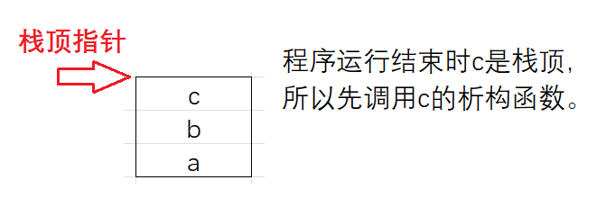

# 类的默认成员函数——析构函数

已知的默认成员函数：

1. **构造函数**主要完成初始化工作。
2. **析构函数**主要完成清理工作。
3. **拷贝构造**是使用同类对象初始化创建另一个对象。
4. **赋值重载**主要是把一个对象赋值给另一个对象。
5. **取地址重载**：普通对象的取地址。
6. `const`**取地址重载**：`const`对象的取地址。

析构函数是对象在销毁时会**自动调用的成员函数**，这个函数负责进行对象中资源的清理工作。

这个销毁一般指处理干净用户的痕迹比如向堆区申请内存，对象本身的数据比如存储具体数据的成员变量在程序结束后会被操作系统回收。

## 析构函数的特征

1. 析构函数名是在**类名前加上字符**`~`（在c语言这个符号是按位取反，它想表达的意思是和构造函数的功能是反过来的）。
2. **无参数无返回值类型**。
3. **一个类只能有一个析构函数**。若未显式定义，系统会自动生成默认的析构函数。这意味着析构函数不能重载。
4. **对象生命周期结束时，C++编译系统系统自动调用析构函数**。
5. 和构造函数一样，默认生成的析构函数会**调用自身的自定义类型成员背后的类的析构函数**。内置类型成员会被操作系统回收，析构函数不会对内置类型成员进行处理。

例子：

```cpp
#include<iostream>

class Time {
public:
	~Time() {
		std::cout << "~Time()" << "\n";
	}
private:
	int _hour;
	int _minute;
	int _second;
};
class Date {
private:
	// 基本类型(内置类型)
	int _year = 1970;
	int _month = 1;
	int _day = 1;
	// 自定义类型
	Time _t;
};

int main() {
	Date d;
	return 0;
}
```

程序运行结束后输出：`~Time()`。

`main`函数中不能直接调用`Time`类的析构函数，实际要释放的是`Date`类对象，所以编译器会**调用Date类的析构函数**。

而`Date`没有显式提供，则编译器会给`Date`类**生成一个默认的**析构函数，**目的是在其内部调用Time类的析构函数**。

即当`Date`对象销毁时，要保证其内部每个自定义对象都可以正确销毁。

`main`函数中并没有直接调用`Time`类析构函数，而是显式调用编译器为`Date`类生成的默认析构函数。

6. 如果类中没有申请资源时（即调用了`alloc`系列函数向堆区申请的内存，c++的`new`的原理也是`alloc`系列函数），析构函数可以不写，直接使用编译器生成的默认析构函数，比如这里的`Date`类；有资源申请时，一定要写，否则会造成资源泄漏，比如之前的`Stack`类。

## 构造函数和析构函数的调用顺序

这个无论是在学校，还是在面试找工作都经常考。

> 计算机的内存分为几个区域：
>
> 1. 栈
>
> 程序在现代计算机中运行需要向系统申请内存，申请的内存是以栈（帧）的形式存在。函数运行需要的空间和局部变量的存储都需要这个栈。
>
> 2. 堆
>
> 动态申请的。
>
> 栈上定义的变量会自动分配空间，因为函数调用后建立栈帧就分配好空间。函数运行结束，栈帧销毁就清理了。
>
> 而堆是手动的。堆可以选择空间大小，而栈是一开始就确定了的。
>
> 3. 静态区
> 4. 常量区

c++程序是在栈中存储数据，所以利用栈的原理即可弄清构造函数和析构函数的调用顺序。

这里举个例子：

```cpp
#include<iostream>
using std::cout;

class A {
public:
	A() {
		cout << "A()\n";
	}
	~A() {
		cout << "~A()\n";
	}
};

class B {
public:
	B() {
		cout << "B()\n";
	}
	~B() {
		cout << "~B()\n";
	}
};

class C {
public:
	C() {
		cout << "C()\n";
	}
	~C() {
		cout << "~C()\n";
	}
};

int main() {
	A a;
	B b;
	C c;
	return 0;
}
```

程序的输出结果是

```cpp
A()
B()
C()
~C()
~B()
~A()
```

利用栈的原理不难分析出原理。



若类中含有自定义成员，则**这个类**的构造函数会**优先调用自定义成员的构造函数**，再调用自己的，**销毁时先调用自己的析构函数**，**再调用自定义**类型成员的。

例子：

```cpp
#include<iostream>
using std::cout;

class A {
public:
	A() {
		cout << "A()\n";
	}
	~A() {
		cout << "~A()\n";
	}
};

class C {
public:
	C() {
		cout << "C()\n";
	}
	~C() {
		cout << "~C()\n";
	}
};

class B {
public:
	B() {
		cout << "B()\n";
	}
	~B() {
		cout << "~B()\n";
	}
	C c;
};


int main() {
	A a;
	B b;
	C c;
	return 0;
}
```

输出：

```cpp
A()
C()
B()
C()
~C()
~B()
~C()
~A()
```

若自己的类中没有程序员给的析构函数，类会自己生成析构函数去调用自身的自定义成员的析构函数。

例子：

```cpp
#include<iostream>
using std::cout;

class A {
public:
	A() {
		cout << "A()\n";
	}
	~A() {
		cout << "~A()\n";
	}
};

class C {
public:
	C() {
		cout << "C()\n";
	}
	~C() {
		cout << "~C()\n";
	}
};

class B {
public:
	B() {
		cout << "B()\n";
	}
	//~B() {//将析构函数注释掉进行测试
	//	cout << "~B()\n";
	//}
	C c;
};


int main() {
	A a;
	B b;
	C c;
	return 0;
}
```

输出：

```cpp
A()
C()
B()
C()
~C()
~C()
~A()
```

> 析构函数的本质在[类和对象—多态-CSDN博客](https://blog.csdn.net/m0_73693552/article/details/149293780)有描述。