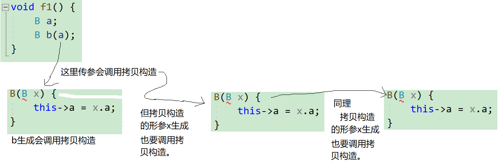
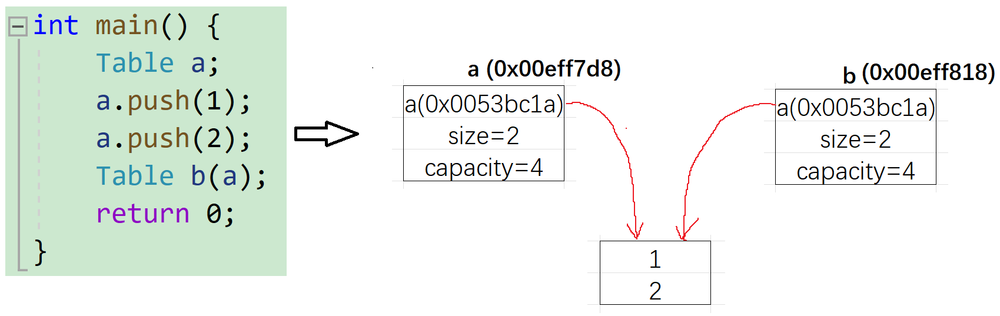
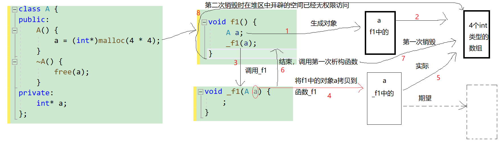
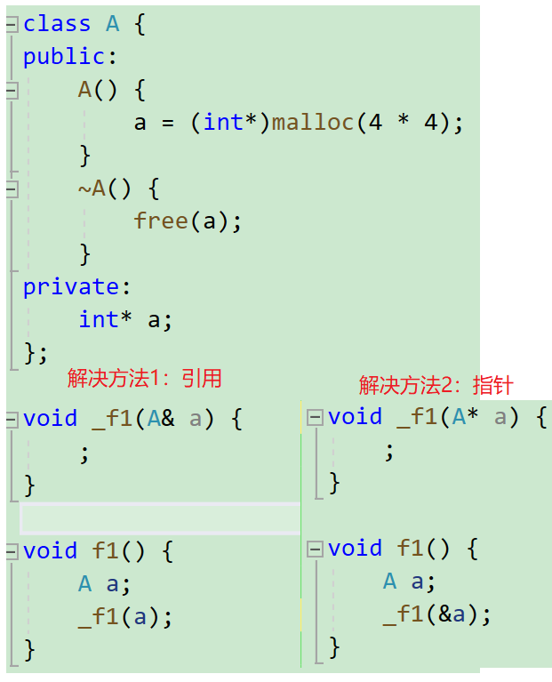

# 类的默认成员函数——拷贝构造函数

## 拷贝构造函数介绍

c语言的同标签结构体对象之间允许互相赋值，这种行为也算是一种拷贝。

```c
#include<stdio.h>

struct A{
	int a;
	double b;
};

void f(struct A x){
    ;
}

int main(){
	struct A a;
	a.a=1;
	a.b=1.0;
	
	struct A b=a,c;
	printf("%d %lf\n",b.a,b.b);
	
	c=a;
	printf("%d %lf\n",c.a,c.b);
	
	struct A d={1,2.2};
	printf("%d %lf",d.a,d.b);
	return 0;
} 
```

实参和形参之间类似`memcpy`的方式逐字节拷贝。所以函数的形参可以是类。拷贝构造函数便是负责这种拷贝的工作。

**拷贝构造函数**：**只有单个形参**，该形参是**对本类类型对象的引用**（一般常用`const`修饰），在用**已存在的类类型对象创建新对象时由编译器自动调用**。

```cpp
//调用拷贝构造
class A{
    //...
};
void f(){
    A a;
    A b(a);//调用拷贝构造
    A b = a;//调用拷贝构造
}
```

## 拷贝构造的特征

拷贝构造函数也是特殊的成员函数，其**特征**如下： 

1. 拷贝构造函数**是构造函数的一个重载形式**。
2. 拷贝构造函数的**参数只有一个**且**必须是同类型对象的引用**，使用**传值方式编译器直接报错**，因为会引发无穷递归调用。简单来说**函数的形参不是引用时**，**上传对象会调用拷贝构造**。

错误的例子：

```cpp
class B {
public:
	B(int _a = 1) {
        a=_a;
	}
	// B(B& x){ // 正确写法
	B(B x) { //错误写法：编译报错，会引发无穷递归
		this->a = x.a;
	}
private:
	int a;
};

void f1() {
	B a;
	B b(a);
}
int main() {
    f1();
	return 0;
}
```



3. 若**未显式定义**，**编译器会生成默认的拷贝构造函数**。
    默认的拷贝构造函数对象对内置类型**按内存存储按字节序完成拷贝**，这种拷贝叫做**浅拷贝**，或者**值拷贝**；对**自定义类型**是**调用这个自定义类型的拷贝构造**函数完成拷贝。
   还有一种拷贝方式，会**对原始对象的所有子对象以及拓展资源**（比如向堆区申请的空间）**进行拷贝**，使得新对象完全独立于原始对象（指修改新对象不影响原始对象），这种拷贝叫做深拷贝。

> 深拷贝不全是好事，比如10000个结点的二叉树的深拷贝，需要调用同等深度的递归或能容纳所有结点的栈完成复制。

例子1：

```cpp
#include<iostream>
using std::cout;

class Time {
public:
	Time() {
		_hour = 1;
		_minute = 1;
		_second = 1;
	}
	Time(Time& t) {
		_hour = t._hour;
		_minute = t._minute;
		_second = t._second;
		cout << "Time::Time(const Time&)\n";
	}
private:
	int _hour;
	int _minute;
	int _second;
};

class Date {
private:
	// 基本类型(内置类型)
	int _year = 1970;
	int _month = 1;
	int _day = 1;
	// 自定义类型
	Time _t;
};
int main() {
	Date d1;
	Date d2(d1);
	return 0;
}
```

用已经存在的`d1`拷贝构造`d2`，此处会调用`Date`类的拷贝构造函数。

但`Date`类并没有显式定义拷贝构造函数，则编译器会给`Date`类生成一个默认的拷贝构造函数。

例子2：

```cpp
#include<iostream>
using std::cout;

class A {
public:
	A() {
		cout << "A()\n";
	}
	A(A& a) {
		cout << "A(A& a)\n";
	}
};

class B {
public:
	B() {
		cout << "B()\n";
	}
	//B(B& b) {
	//	cout << "B(B& b)\n";
	//}
	A a;
};

int main() {
	B a;
	cout << "\n";
	B b(a);
	cout << "\n";
	B c = b;
	return 0;
}
```

这里的两个`B`的对象都调用了`A`类的拷贝构造函数。

输出：

```cpp
A()
B()

A(A& a)

A(A& a)
```


4. 类中如果**没有涉及资源申请**（c语言常见的资源申请是`alloc`系列函数）时，拷贝构造函数**是否写都可以**；一旦**涉及到资源申请**时，则**拷贝构造函数是一定要写**的，否则就是浅拷贝，容易出现问题。

错误案例1：

```cpp
#include<iostream>
using std::cout;

class Table {//简单线性表
public:
	Table(int _capacity = 4) {
		size = 0;
		if (_capacity) {
			int* tmp = (int*)malloc(4 * _capacity);
			if (tmp == NULL)
				exit(-2);
			a = tmp;
			capacity = _capacity;
		}
	}
	void push(int x) {
		a[size++] = x;
	}
	~Table() {
		if (a) {
			free(a); a = NULL;
			size = capacity = 0;
		}
	}
private:
	int* a;
	int size;
	int capacity;
};

int main() {
	Table a;
	a.push(1);
	a.push(2);
	Table b(a);
	return 0;
}
```

`b`通过拷贝构造复制了`a`的数据，却没有复制数组，当两个对象都调用析构函数时，同一块空间被连续释放两次，这个属于越权行为，程序运行发生错误。



解决方法是自己改进拷贝构造函数，使得新生成的对象能额外申请空间。

```cpp
Table::Table(Table& x) {
	this->a = (int*)malloc(4 * x.capacity);
	if (this->a == NULL)
		exit(-2);
	for (int i = 0; i < size; i++)
		this->a[i] = x.a[i];
	this->size = x.size;
	this->capacity = x.capacity;
}
```

错误案例2（这种问题c语言也有，但c++的自动调用成员函数将事情变得严重）：

```cpp
#include<iostream>
using std::cout;

class A {
public:
    A() {
        a = (int*)malloc(4 * 4);
    }
    ~A() {
        free(a);
    }
private:
    int* a;
};

void _f1(A a) {
    ;
}

void f1() {
    A a;
    _f1(a);
}

int main() {
    f1();
	return 0;
}
```

问题分析：c++中的传值传参也是一种拷贝。所以函数`_f1`先调用析构函数，将形参`a`申请的空间置空。问题是**实参a和形参a代表的在堆区中的空间是同一片空间**，实参`a`在销毁时还会调用一次析构，此时就会出现越权访问的错误。



问题还是在实参和形参不是同一个对象（地址不同）。c语言没有析构函数这么写没问题，程序员不使用已经成野指针的结构体就行，但c++会**自动调用析构函数**，从而造成越权访问。

解决方法是用引用形参或指针形参。



这些方法都是保证原来的对象在`_f1`的**函数栈帧回收时不调用析构函数**，用引用是为了可读性。除了这些方法，还可以自己改进拷贝构造函数使复制体额外申请空间（重复一遍生成对象的所有行为）。

```cpp
#include<iostream>
using std::cout;

class A {
public:
    A() {
        a = (int*)malloc(4 * 4);
    }
    A(A& a) {//使形参调用程序员指定的拷贝构造
        cout << "A(A& a)\n";
        this->a= (int*)malloc(4 * 4);
    }
    ~A() {
        free(a);
    }
private:
    int* a;
};

void _f1(A a) {
    ;
}

void f1() {
    A a;
    _f1(a);
}

int main() {
    f1();
	return 0;
}
```


5. 拷贝构造函数典型调用场景：

* 使用**已存在对象**创建新对象。

* **函数参数类型**为类类型对象。

* **函数返回值类型**为类类型对象。

为了提高程序效率，一般对象传参时，尽量使用引用类型，返回时根据实际场景，能用引用尽量使用引用。

同时在写拷贝构造时，推荐在引用形参前加const限制，这么做都是为了防止对象的数据被修改。

```cpp
class A{
public:
    A(const A& x){//权限缩小
        ;
    }
};
```

6. 拷贝构造也能用初始化列表。