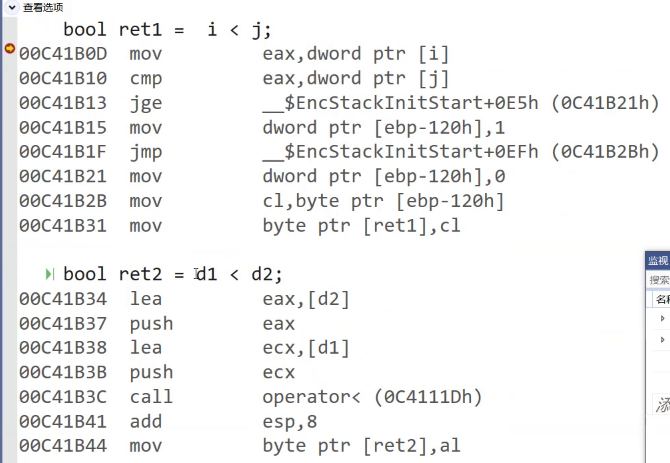
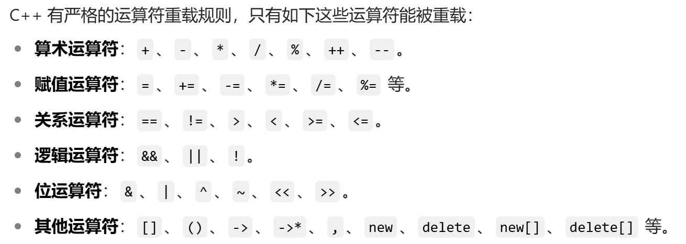
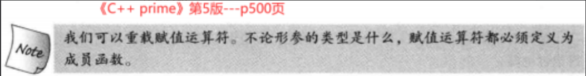

# 类和对象——运算符重载

我们想让两个日期去比较大小。人可以看到年、月、日，但计算机的话这是为难运算符。

内置类型是原生定义的，且是比较简单的类型，无论怎么定义的都可以知道比较规则（内定好的）。但自定义类型的比较规则取决于创造自定义类型的人。

对自定义类型的比较，需要创造自定义类型的人再创造一个算法（函数形式）进行比较。

比如日期的比较：

```cpp
#include<iostream>

class Date {
public:
	Date(int year, int month, int day) {
		_year = year;
		_month = month;
		_day = day;
	}
	int _year;
	int _month;
	int _day;
};

//这样的比较需要成员变量公有
bool Dateless(const Date& a, const Date& b) {
	if (a._year < b._year)
		return true;
	if (a._year == b._year && a._month < b._month)
		return true;
	if (a._year == b._year && a._month == b._month && a._day < b._day)
		return true;
	return false;
}

void f() {
	using std::cout;
	Date d1(2024, 10, 21);
	Date d2(2024, 9, 12);
	cout << Dateless(d2, d1) << "\n";
}

int main() {
	f();
	return 0;
}
```

但是为了照顾别的程序员（比如中国人用拼音，外国人用英文，以及用英文的话可读性可能会随时间和人的记忆发生变化），祖师爷想能不能用大伙都熟悉的运算符号来进行比较？

首先编译器是不能识别`d1<d2`的（否则编译器都会思考了，还要人来干啥）。

想让编译器识别`d1<d2`，编译器就要多做点事：将这个运算符`<`转换成编译器读的懂的函数名。祖师爷想到了这点，就引入了运算符重载。

## 运算符重载

c++为了**增强代码的可读性引入**了运算符重载，**运算符重载是具有特殊函数名的函数**。

> 函数重载是为了让多个同名函数能同时存在。
>
> 运算符重载是为了让自定义对象能使用运算符。
>
> 它们是两个不同的概念。
>
> 在后文为了表达方便，会用`符号`重载表示用那个符号生成的函数。比如`[]`重载。

函数原型：

```cpp
返回值类型 operator操作符(参数列表){
    //...普通的函数，但参数列表至少有一个类类型
}
```

c++规定，编译器会将操作符转换成函数`operator操作符`。而内置类型则会转换成相应的指令。例如`i`和`j`是内置类型，`d1`和`d2`是自定义类型，通过vs自带的反汇编功能即可看出它们的区别。



## 运算符重载的特征

* 不能通过连接其他符号来创建新的操作符：比如`operator@` （即c++中没有这个操作符，自己不能创造操作符来重载）。



* c++并没有规定`operator`和运算符之间不能没有空格，也没有规定`[]`之间有没有空格，一般情况下运算符和`operator`拼接在一起可以理解为这个运算符的重载。但像`new`、`delete`这种要用空格隔开，否则写在一起不太好区分（比如`operatornew`，不知道是函数名还是`new`重载）。

* 重载操作符**必须有一个类类型参数**。

* **只能对自定义类型重载**，内置类型不可以。即：

```cpp
int operator<(int a,int b){
    //...
}
```

这种形参列表全是内置类型就不可以。

* 用于内置类型的运算符，其**含义不能改变**，例如：内置的整型`+`，不能改变其含义（比如表面是加，不能重载成减，这个属于个人风格上的约束）。

* 作为类成员函数重载时，其形参看起来比操作数数目少1，因为成员函数的第一个参数为隐藏的`this`。作为普通函数重载时则没有`this`指针，在调用上需要调整参数的顺序。

  ```cpp
  #include<iostream>
  using namespace std;
  
  class A {
  public:
  	A() :a(0) {}
  	int a;
  };
  
  int operator+(int x, A& y) {
  	return x + y.a;
  }
  
  int main() {
  	int a1 = 3;
  	A a2;
  	cout << operator+(a1, a2) << endl;
  	cout << (a1 + a2) << endl;
  	//cout << (a2 + a1) << endl;//参数类型不匹配
  	return 0;
  }
  
  ```

* `.*`、`::`、`sizeof`、`?:`、`.`。这5个运算符不能重载，其中域作用限定符`::`，三目运算符`?:`，`.*`是通过指向成员变量或函数的指针（简称成员指针），来访问特定对象的成员。
  成员指针不是独立的内存地址，而是相对于类对象的偏移量或调用方式，必须通过具体对象（`obj.*ptr`）来访问。类似的还有`->*`，若是通过对象指针访问的，则用`->*`运算符。

  ```cpp
  #include<iostream>
  using namespace std;
  
  class A {
  public:
  	A() :a(0) {}
  	void get()const {
  		cout << a << endl;
  	}
  	void get2() {
  		cout << a << endl;
  	}
  	int a;
  };
  
  int main() {
  	int A::* ptr = &A::a;//指向成员的指针
  	A x;
  	x.*ptr = 66;
  	cout << (x.*ptr) << endl;
  	void(A:: * fp1)()const = &A::get;//取成员函数的地址
  	void(A:: * fp2)() = &A::get2;
  	(x.*fp1)();//调用get函数
  	(x.*fp2)();//调用get2函数
  	return 0;
  }
  ```

> `*`一般有两种重载方式：乘法和解引用。

* 不能改变操作符的操作数个数（意思是有的操作符是两个操作数，比如`+`，`<`，有的操作符是1个，比如`++`，`--`）。一个操作符是几个操作数，那么重载的时候就有几个操作数（编译器会加上限制）。
* `operator符号`这个函数可以显式调用，但用符号会更舒服。

## 运算符重载的案例

### 类的成员运算符重载

例如，假设有一个日期类，要实现日期比较的符号`==`、`<`和`>`：

`operator==`：

```cpp
//重载==符号，返回一个bool值
//实际的形参列表是(Date* this, const Date& d)
//*this==d
bool Date::operator==(Date& d) {
	return d._year == _year && d._month == _month && d._day == this->_day;
	//this指针可忽略
}
```

`operator<`：

```cpp
//重载<符号，返回一个bool值
//需要注意顺序，是*this<a
bool Date::operator<(Date& a) {
	if (_year < a._year)
		return true;
	if (_year == a._year && _month < a._month)
		return true;
	if (_year == a._year && _month == a._month && _day < a._day)
		return true;
	return false;
}
```

这种运算符重载可以不是类的成员函数。

例如，`operator>`：

```cpp
//运算符重载可以不是类的成员函数
//a>b
bool operator>(Date& a, Date& b) {
	return !((a == b) && (a < b));
}
```

放到完整的类中：

```cpp
#include<iostream>

class Date {
public:
	//默认构造函数
	Date(int year = 1900, int month = 1, int day = 1) {
		_year = year;
		_month = month;
		_day = day;
	}
	//拷贝构造函数
	Date(const Date& d) {
		_year = d._year;
		_month = d._month;
		_day = d._day;
	}
	//重载==符号，返回一个bool值
	bool operator==(Date&);

	//重载<符号，返回一个bool值
	bool operator<(Date&);

	//获取对象存储的信息
	void getDate() {
		using std::cout;
		cout << _year << " " << _month << " " << _day << "\n";
	}
private:
	int _year;
	int _month;
	int _day;
};

//重载==符号，返回一个bool值
//实际的形参列表是(Date* this, const Date& d)
//*this==d
bool Date::operator==(Date& d) {
	return d._year == _year && d._month == _month && d._day == this->_day;
	//this指针可忽略
}

//重载<符号，返回一个bool值
//需要注意顺序，是*this<a
bool Date::operator<(Date& a) {
	if (_year < a._year)
		return true;
	if (_year == a._year && _month < a._month)
		return true;
	if (_year == a._year && _month == a._month && _day < a._day)
		return true;
	return false;
}

//运算符重载可以不是类的成员函数
//a>b
bool operator>(Date& a, Date& b) {
	return !((a == b) && (a < b));
}

void f1() {
	Date today(2025, 1, 21);
	Date defaultDate;
	if (defaultDate < today)//隐式调用
		std::cout << "1 <\n";
	if (defaultDate.operator<(today))
		std::cout << "2 <\n";//显式调用
	
	if (today > defaultDate)
		std::cout << ">\n";
	if (defaultDate == today)
		std::cout << "1==\n";

	today = { 1900,1,1 };//这种拓展初始化列表仅在c++11可用
	if (defaultDate == today)
		std::cout << "2==\n";
}

int main() {
	f1();
	return 0;
}
```

注意形参的权限一致。比如这个例子，公共运算符重载`>`如果要用两个`Date`类的成员函数复用的话，第2个形参要加`const`修饰。

```cpp
//两个函数的形参都是(Date&,const Date&)
bool operator>(Date& a, const Date& b) {
	return !((a == b) && (a < b));
}

//重载==符号，返回一个bool值
//实际的形参列表是(Date* this, const Date& d)
bool Date::operator==(const Date& d) {
	return d._year == _year && d._month == _month && d._day == this->_day;
	//this指针可忽略
}

bool Date::operator<(const Date& a) {
	if (_year < a._year)
		return true;
	if (_year == a._year && _month < a._month)
		return true;
	if (_year == a._year && _month == a._month && _day < a._day)
		return true;
	return false;
}
```

将这个例子放到类中。

```cpp
#include<iostream>

class Date {
public:
	//默认构造函数
	Date(int year = 1900, int month = 1, int day = 1) {
		_year = year;
		_month = month;
		_day = day;
	}
	//拷贝构造函数
	Date(const Date& d) {
		_year = d._year;
		_month = d._month;
		_day = d._day;
	}
    //加const修饰
	//重载==符号，返回一个bool值
	bool operator==(const Date&);

	//重载<符号，返回一个bool值
	bool operator<(const Date&);
    
    //这样写编译不通过，说参数太多了，因为<作为成员函数，还有隐藏的this指针
	//bool operator<(const Date3& a, const Date3& b) {
	//	if (a._year < b._year)
	//		return true;
	//	if (a._year == b._year && a._month < b._month)
	//		return true;
	//	if (a._year == b._year && a._month == b._month && a._day < b._day)
	//		return true;
	//	return false;
	//}

	//获取对象存储的信息
	void getDate() {
		using std::cout;
		cout << _year << " " << _month << " " << _day << "\n";
	}
private:
	int _year;
	int _month;
	int _day;
};

//重载==符号，返回一个bool值
//实际的形参列表是(Date* this, const Date& d)
bool Date::operator==(const Date& d) {
	return d._year == _year && d._month == _month && d._day == this->_day;
	//this指针可忽略
}

bool Date::operator<(const Date& a) {
	if (_year < a._year)
		return true;
	if (_year == a._year && _month < a._month)
		return true;
	if (_year == a._year && _month == a._month && _day < a._day)
		return true;
	return false;
}

//两个函数的形参都是(Date&,const Date&)
bool operator>(Date& a, const Date& b) {
	return !((a == b) && (a < b));
}

void f1() {
	Date today(2025, 1, 21);
	Date defaultDate;
	if (defaultDate < today)
		std::cout << "<\n";
	if (today > defaultDate)
		std::cout << ">\n";
	if (defaultDate == today)
		std::cout << "1==\n";

	today = { 1900,1,1 };
	if (defaultDate == today)
		std::cout << "2==\n";
}

int main() {
	f1();
	return 0;
}
```

当编译器遇到类似`today<defaultDate`这种操作时，会先在全局里去找，找不到再去类中找，找到后还要转换成`operator<`这个函数名。

### 类外的运算符重载

在上文已经提到过类外的公共的运算符重载。

仍然以日期类为例，作为公共函数的`<`重载：

```cpp
#include<iostream>
using namespace std;

class Date {
public:
	Date(int _year = 1900, int _month = 1, int _day = 1)
	:year(_year),
	month(_month),
	day(_day){}

	//特意将成员变量设置为公有方便类外函数处理，私有的还有别的办法
	int year;
	int month;
	int day;
private:
};

bool operator<(Date& a, Date& b) {
	if (a.year < b.year)
		return true;
	if (a.year == b.year && a.month < b.month)
		return true;
	if (a.year == b.year && a.month == b.month && a.day < b.day)
		return true;
	return false;
}

int main() {
	Date d1;
	Date d2(2025, 1, 23);
	cout << (d1 < d2) << endl<<(d2 < d1) << endl;
	return 0;
}
```

在类外定义的运算符重载可以自由选择实参的上传顺序，但类的内部定义的成员函数因为第一个形参是隐藏的`this`指针，所以实参上传顺序受到一定限制。

比如我们想让`cout`正常输出日期类的对象的信息，除了`<<`重载，还需要上传`ostream`（流插入）对象作为实参，这里暂时用`cout`代替，且`cout`还需要作为第1个形参（后期有机会再细谈流）。

但在实现`<<`重载时若将它作为类的成员函数，则使用时是对象调用`<<`重载，所以看起来就像是将`cout`插入对象中一样。

```cpp
#include<iostream>
using namespace std;

class Date {
public:
	Date(int _year = 1900, int _month = 1, int _day = 1)
		:year(_year),
		month(_month),
		day(_day) {}

	ostream& operator<<(ostream& myout) {
		myout << year << "-" << month << "-" << day << "\n";
		return myout;//为了支持连续的<<
	}

	//特意将成员变量设置为公有方便类外函数处理，私有的还有别的办法
	int year;
	int month;
	int day;
private:
};

int main() {
	Date d1;
	Date d2(2025, 1, 23);
	d2 << cout;
	//cout << d2;//顺序反过来就不行
	return 0;
}
```

为了修改实参的顺序，有必要将`<<`重载设置为公共函数，这样就能控制形参的顺序。

```cpp
#include<iostream>
using namespace std;

class Date {
public:
	Date(int _year = 1900, int _month = 1, int _day = 1)
		:year(_year),
		month(_month),
		day(_day) {}

	ostream& operator<<(ostream& myout) {
		myout << year << "-" << month << "-" << day << "\n";
		return myout;
	}
	//特意将成员变量设置为公有方便类外函数处理，私有的还有别的办法
	int year;
	int month;
	int day;
private:
};

ostream& operator<<(ostream& myout, Date& d) {
	myout << d.year << "-" << d.month << "-" << d.day << "\n";
	return myout;//为了支持连续的<<
}

int main() {
	Date d1;
	Date d2(2025, 1, 23);
	cout << d2 << d1 << endl;//因为是传引用返回，所以支持连续插入
	d1 << (d2 << cout);//虽然支持连续插入，但顺序不符合人的思维
	return 0;
}
```

作为类外的运算符重载还将面临一个问题：如何访问类的私有变量。java的做法是用一系列的函数来访问，c++除了这个方法，还可以用友元（类似这个类给`<<`重载发通行证），这个放在后文。

## 赋值运算符重载

自定义类型有了运算符重载还不够，还需要有赋值操作。

赋值运算符重载也是默认成员函数，会自动生成。拷贝构造和赋值运算符重载很相似。

> 举个例子：
>
> ```cpp
> class A{
>  //...
> };
> 
> void f(){
>  A a;
>  //拷贝构造
>  A b = a;
>  A c = a + 6;
>  //赋值重载
>  c = a + 6;
> }
> ```
>
> `A b = a;`编译器可以解释成拷贝构造（用一个已知的对象去初始化新的对象），也可以解释成赋值重载（已存在的两个对象的拷贝）。
>
> 在vs和g++都会调用拷贝构造。
>
> `A c = a + 6;`这个也是拷贝构造。
>
> `c = a + 6;`是赋值重载。

假设`T`为类名。赋值运算符重载应满足：

* **参数**（**形参**）**类型**：`const T&`或`T&`，传递引用可以提高传参效率。不传递引用的话传参的过程会调用拷贝构造函数构造形参。加`const`是防止赋值运算符重载修改原来的对象。

* **返回值类型**：`T&`，返回引用可以提高返回的效率（不使用引用同样会调用拷贝构造函数，但有`this`指针每必要多调用一次拷贝构造函数），有返回值目的是为了**支持连续赋值**。
* **返回**this ：要复合连续赋值的含义。

到这里就能给出赋值运算符重载的大致框架了：

```cpp
class T{
public:
    T& operator=(const T& t){
        //...
        return *this;
    }
};
```

* **检测是否自己给自己赋值**。判断形参和`this`指针的地址是否是同一个即可。

```cpp
class T{
public:
    T& operator=(const T&t){
        if(this!=&t){//&T是获取t这个对象的地址
        	//...
        }
        return *this;
    }
};
```

* 赋值运算符**只能重载成类的成员函数**不能重载成全局函数。

  赋值运算符若**不显式实现**，**编译器会生成一个默认的**。此时用户再在类外自己实现一个全局的赋值运算符重载，就和编译器在类中生成的默认赋值运算符重载产生冲突，故赋值运算符重载只能是类的成员函数。



* 用户**没有显式实现**时，编译器会**生成一个默认赋值运算符重载**，以值的方式**逐字节拷贝**。注意：**内置**类型成员变量是**直接赋值**的，而**自定义**类型成员变量需要**调用对应类的赋值运算符重载**完成赋值。

> 和拷贝构造函数一样的问题，如果涉及资源管理（比如通过`alloc`系列函数向堆区申请内存），会造成浅拷贝问题，此时不能使用编译器生成的默认赋值运算符重载。
>
> 浅拷贝问题泛指2个指针共同管理同一块资源（常见的就是通过`alloc`系列函数和`new`申请的空间）的情况。这种情况原本不是问题，但配合类的默认成员函数的自动调用机制可能会出现同一块资源释放2次的问题。

赋值重载样例：

```cpp
#include<iostream>
using namespace std;

class Date {
public:
	//默认构造函数
	Date(int year = 1900, int month = 1, int day = 1) {
		_year = year;
		_month = month;
		_day = day;
	}
	//拷贝构造函数
	Date(const Date& d) {
		_year = d._year;
		_month = d._month;
		_day = d._day;
		std::cout << "Date(const Date& d)\n";
	}
	//重载赋值符号=
	Date& operator=(Date&);

	//重载赋值符号=，形参加const可以构成重载
	Date& operator=(const Date&);

	//获取对象存储的信息
	void getDate() {
		using std::cout;
		cout << _year << " " << _month << " " << _day << "\n";
	}
private:
	int _year;
	int _month;
	int _day;
};

//重载赋值符号=
//形参列表可以不加引用，但会调用一次拷贝构造函数
Date& Date::operator=(Date& a) {
	if (this != &a) {
		_year = a._year;
		_month = a._month;
		_day = a._day;
	}
	std::cout << "operator=(Date& a)\n";
	return *this;
}

//重载赋值符号=，加const可以构成重载
Date& Date::operator=(const Date& a) {
	if (this != &a) {
		_year = a._year;
		_month = a._month;
		_day = a._day;
	}
	return *this;
}

////operator=只能是类的成员函数
//Date& operator=(Date& a,Date& b) {
//	if (&b != &a) {
//		a._year = b._year;
//		a._month = b._month;
//		a._day = b._day;
//	}
//	return a;
//}

void f1() {
	Date a(2025, 1, 21);
	Date b = a;//拷贝构造 
	b.getDate();
	cout << endl;

	b = a;//赋值重载 
	b.getDate();
	cout << endl;

	Date c;
	c = b = a;//连续的赋值重载
	c.getDate();
}

int main() {
	f1();
	return 0;
}
```

因为日期类不涉及资源申请，因此可以调用默认生成的赋值运算符重载。

```cpp
#include<iostream>
using namespace std;

class Date {
public:
	//默认构造函数
	Date(int year = 1900, int month = 1, int day = 1) {
		_year = year;
		_month = month;
		_day = day;
	}
	//拷贝构造函数
	Date(const Date& d) {
		_year = d._year;
		_month = d._month;
		_day = d._day;
		std::cout << "Date(const Date& d)\n";
	}
	////重载赋值符号=
	//Date& operator=(Date&);

	////重载赋值符号=，形参加const可以构成重载
	//Date& operator=(const Date&);

	//获取对象存储的信息
	void getDate() {
		using std::cout;
		cout << _year << " " << _month << " " << _day << "\n";
	}
private:
	int _year;
	int _month;
	int _day;
};

void f1() {
	Date a(2025, 1, 21);
	Date b = a;//拷贝构造 
	b.getDate();
	cout << endl;

	b = a;//赋值重载 
	b.getDate();
	cout << endl;

	Date c;
	c = b = a;//连续的赋值重载
	c.getDate();
}

int main() {
	f1();
	return 0;
}
```

## 前置++(--)和后置++(--)重载

前置`++`和后置`++`在实现上构成了函数重载。`--`和`++`的重载方式完全一致。

### 前置++重载

前置`++`：返回对象`+1`之后的结果。

注意：`this`指向的对象函数结束后不会销毁，故以引用方式返回提高效率。

函数原型：

```cpp
类名& 类名::operator++(){
    //...
    return *this;
}
```

以日期类为例：

```cpp
#include<iostream>

class Date {
public:
	Date(int _year = 1900, int _month = 1, int _day = 1) {
		month_day = new int[13]{ 0,31,28,31,30,31,30,31,31,30,31,30,31 };
		if (month_day == NULL)
			exit(-2);

		year = _year;
		if (((year % 4 == 0) && (year % 100 != 0)) || (year % 400 == 0))
			month_day[2] = 29;
		month = _month;
		day = _day;
	}
	Date(const Date& d) {
		month_day = new int[13]{ 0,31,28,31,30,31,30,31,31,30,31,30,31 };
		if (month_day == NULL) exit(-2);
		year = d.year;
		if (((year % 4 == 0) && (year % 100)) || (year % 400 == 0))
			month_day[2] = 29;
		month = d.month;
		day = d.day;
	}

	~Date() {
		free(month_day);
	}

	void getDate() {
		using std::cout;
		cout << year << "." << month << "." << day << "\n";
	}

	//重载前置++
    //在编译器中：++d1 ---> d1.operator++()
	Date& operator++() {
		day += 1;
		if (day > month_day[month]) {
			day = 1;
			month++;
		}
		if (month > 12) {
			year++;
			month = 1;
			if (((year % 4 == 0) && (year % 100)) || (year % 400 == 0))
				month_day[2] = 29;
			else
				month_day[2] = 28;
		}
		return *this;
	}

private:
	int year;
	int month;
	int day;
	int* month_day;
};

int main() {//测试前置++
	Date d2 = { 2023,1,1 };
	for (int i = 1; i <= 365; i++) {
		d2.getDate();
		++d2;
	}
	for (int i = 1; i <= 366; i++) {
		d2.getDate();
		++d2;
	}
	for (int i = 1; i <= 365; i++) {
		d2.getDate();
		++d2;
	}
	return 0;
}
```

### 后置++重载

前置`++`和后置`++`都是一元运算符，为了让前置`++`与后置`++`形成能正确重载，

c++规定：后置++重载时多增加一个`int`类型的参数，但调用函数时该参数不用传递，编译器会自动传递。加这个参数是为了能和前置`++`构成函数重载，`int`则是占位用。

注意：后置`++`是先使用后`+1`，因此需要返回`+1`之前的旧值，故需在实现时需要先将`this`进行备份，比如复制一份给`tmp`，然后`this`自增1个单位。

而`tmp`是临时对象，因此只能以值的方式返回，不能返回引用。

所以后置`++`的函数原型：

```cpp
类名 类名::operator++(int){
    类名 对象(*this);//调用拷贝构造
    //...
    return 对象;
}
```

> 同样是面向对象的编程语言，有的没有`++`的运算符重载。比如python就没有。
>
> 后置`++`因为存在多余的拷贝构造的调用，性能上是比前置`++`差的。
>
> 后置`++`的显式调用：`对象.operator++(0);`即上传一个0让编译器识别即可。

以日期类为例：

```cpp
#include<iostream>

class Date {
public:
	Date(int _year = 1900, int _month = 1, int _day = 1) {
		year = _year;
		if (((year % 4 == 0) && (year % 100 != 0)) || (year % 400 == 0))
			month_day[2] = 29;
		month = _month;
		day = _day;
	}

	void getDate() {
		using std::cout;
		cout << year << "." << month << "." << day << "\n";
	}

	//重载后置++
    //在编译器中发生的转换：d1++ --->  d1.operator(0)
    //0是多少取决于编译器，但不重要因为用不上
	Date operator++(int) {
		Date tmp(*this);

		day += 1;
		if (day > month_day[month]) {
			day = 1;
			month++;
		}
		if (month > 12) {
			year++;
			month = 1;
			if (((year % 4 == 0) && (year % 100)) || (year % 400 == 0))
				month_day[2] = 29;
			else
				month_day[2] = 28;
		}
		return tmp;
	}

private:
	int year;
	int month;
	int day;
	static int month_day[13];//使用static修饰成员使成员变成公有
};

int Date::month_day[13]= { 0,31,28,31,30,31,30,31,31,30,31,30,31 };

int main() {//测试后置++
	Date d2 = { 2023,1,1 };
	for (int i = 1; i <= 365; i++) {
		(d2++).getDate();
	}
	for (int i = 1; i <= 366; i++) {
		d2.getDate();
		d2++;
	}
	for (int i = 1; i <= 365; i++) {
		d2.getDate();
		d2++;
	}
	return 0;
}
```

除了`++`，也可以重载`--`，原理和`++`相同，这里便不再重复。