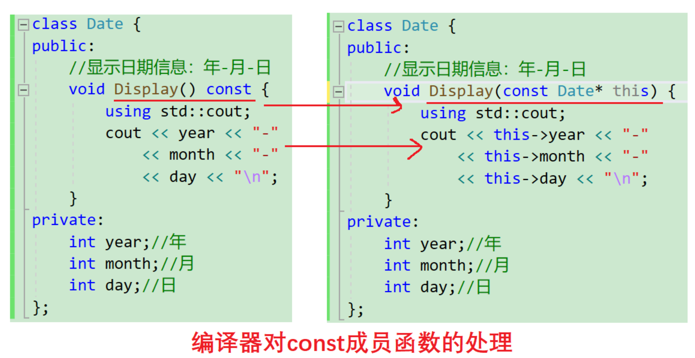

# const成员函数

## const成员函数

将`const`修饰的“成员函数”称之为`const`成员函数，`const`修饰类成员函数，实际修饰该成员函数**隐含的this指针**，表明在该成员函数中**不能对类的任何成员进行修改**。



例如：

```cpp
#include<iostream>
class Date {
public:
	Date(int year, int month, int day) {
		_year = year;
		_month = month;
		_day = day;
	}
	//编译器认为两个Print构成函数重载
	void Print() {
		using std::cout;
		using std::endl;
		cout << "Print()" << endl;
		cout << "year:" << _year << endl;
		cout << "month:" << _month << endl;
		cout << "day:" << _day << endl << endl;
	}
	void Print() const {
		using std::cout;
		using std::endl;
		cout << "Print()const" << endl;
		cout << "year:" << _year << endl;
		cout << "month:" << _month << endl;
		cout << "day:" << _day << endl << endl;
	}
private:
	int _year; // 年
	int _month; // 月
	int _day; // 日
};
int main() {
	Date d1(2022, 1, 13);
	d1.Print();
	const Date d2(2022, 1, 13);
	//编译器认为d2.Print(&d2)，&d2的类型是const Date*，
	//会为d2匹配void Print() const
	d2.Print();
	return 0;
}
```

编译器的原则：永远是最匹配的，没有就找最合适的。权限可以缩小，但不可以放大。所以`d1`调用的是`Print()`，而`d2`调用的是`Print() const`。

如果只有`Print() const`，则`d1`调用的是`Print() const`。例如：

```cpp
#include<iostream>

class Date {
public:
	Date(int year, int month, int day) {
		_year = year;
		_month = month;
		_day = day;
	}
	void Print() const {
		using std::cout;
		using std::endl;
		cout << "Print()const" << endl;
		cout << "year:" << _year << endl;
		cout << "month:" << _month << endl;
		cout << "day:" << _day << endl << endl;
	}
private:
	int _year; // 年
	int _month; // 月
	int _day; // 日
};

int main() {
	Date d1(2022, 1, 13);
	d1.Print();
	return 0;
}
```

## 调用关系

`const`对象和`const`成员函数，它们与非`const`的对象和成员函数之间的关系：

1. `const`对象不可以调用非`const`成员函数。权限放大。
2. 非`const`对象可以调用`const`成员函数。权限缩小。
3. `const`成员函数内不可以调用其它的非`const`成员函数。
4. 非`const`成员函数内可以调用其它的`const`成员函数。权限缩小。

对每个关系举例描述：

1. `const`对象不可以调用非`const`成员函数。权限放大。

因为非`const`成员函数可通过`this`指针间接修改对象，所以`const`对象不能将自身具有常属性的地址上传给`this`指针，防止权限放大。

参考样例：

```cpp
#include<iostream>
class A {
public:
	void f1() {
		using std::cout;
		cout << "void f1()\n";
	}
	void f2() const {
		using std::cout;
		cout << "void f2()\n";
	}
};

int main() {
	const A a;
	//a.f1();//不允许。
	a.f2();//允许，权限平移
	return 0;
}
```

2. 非`const`对象可以调用`const`成员函数。权限缩小。

```cpp
#include<iostream>
class A {
public:
	void f1() {
		using std::cout;
		cout << "void f1()\n";
	}
	void f2() const {
		using std::cout;
		cout << "void f2()\n";
	}
};

int main() {
	A a;
	a.f2();//允许
	return 0;
}
```

3. `const`成员函数内不可以调用其它的非`const`成员函数。
   因为`const`成员函数的`this`具有常属性，将`this`的值上传给非`const`成员函数，因为非`const`的成员函数不具有常属性的`this`，所以权限放大。

```cpp
#include<iostream>
class A {
public:
	void f1() {
		using std::cout;
		cout << "void f1()\n";
	}
	void f2() const {
		using std::cout;
		cout << "void f2()\n";
		//f1();//不允许，权限放大
	}
};
```

在存在大量代码复用的类中需要特别注意。

4. 非`const`成员函数内可以调用其它的`const`成员函数。权限缩小。

```cpp
#include<iostream>
class A {
public:
	void f1() {
		using std::cout;
		cout << "void f1()\n";
		f2();//可以，权限缩小。
	}
	void f2() const {
		using std::cout;
		cout << "void f2()\n";
	}
};
```

## const在成员函数中的位置

这是一个数组类：

```cpp
#include<iostream>
#include<cstdlib>
class SeqList {
public:
	~SeqList() {
		free(a);
	}
	int& operator[](int i) const {//a向堆区申请内存，出了这里的作用域数据还在，可以传引用返回
		return a[i];
	}
private:
	//c++11允许给内置类型成员初始值，甚至是调用公共库函数
    //但如果函数执行出错无法反馈
	int* a = (int*)malloc(sizeof(int) * 10);
	size_t size = 0;
	size_t capacity = 10;
};

void print(const SeqList& a) {
	using std::cout;
	for (int i = 0; i < 10; i++) {
		cout << a[i] << ' ';
		a[i]++;//const只限制a本身的内容不可改变，
	}
	cout << "\n";
}

int main() {
	SeqList a;
	using std::cout;
	for (int i = 0; i < 10; i++)
		a[i] = i;//修改堆区的数据
	print(a);
	print(a);
	return 0;
}
```

函数`int& operator[](int i) const{}`虽然对`this`指针本身用`const`修饰，但是函数返回值是堆区某个位置的引用，所以`[]`并没有对堆区的数据进行限制。

数组类需要通过`[]`进行修改和访问数据，因此在部分场合我们想通过`[]`修改数据，在另一场合又希望这个数据无法被修改。

所以需要提供两个`[]`的重载，一个只读，一个可读可写，此时编译器会匹配最合适的`[]`。只读的`[]`重载一般需要用两个`const`进行限制。

```cpp
#include<iostream>
#include<cstdlib>
class SeqList {
public:
	~SeqList() {
		free(a);
	}
	int& operator[](int i) {//对象可读可写
		return a[i];
	}
	const int& operator[](int i) const{//对象只读
		return a[i];
	}
private:
	int* a = (int*)malloc(sizeof(int) * 10);
	size_t size = 0;
	size_t capacity = 10;
};

void print(const SeqList& a) {
	using std::cout;
	for (int i = 0; i < 10; i++) {
		cout << a[i] << ' ';
		//a[i]++;//编译器为const SeqList匹配形参为const SeqList的operator[]，所以不可修改
	}
	cout << "\n";
}

int main() {
	SeqList a;
	using std::cout;
	for (int i = 0; i < 10; i++)
		a[i] = i;//修改堆区的数据
	print(a);
	return 0;
}
```

还是需求问题，程序员想要用户不修改什么数据，就加`const`对类的成员函数进行限制。

## 取地址&及const取地址操作符重载

默认成员函数的取地址`&`重载一般不用重新定义 ，编译器默认会生成。其中用到了`const`修饰`this`时构成的重载。

```cpp
class Date {
public:
	Date* operator&() {
		return this;
	}
	const Date* operator&() const {//参考上文的数组类
		return this;
	}
private:
	int _year; // 年
	int _month; // 月
	int _day; // 日
};
```

这两个运算符一般不需要重载，使用编译器生成的默认取地址的重载即可，只有特殊情况，才需要重载，比如不想被别人取到对象的有效地址，于是给个假地址返回。

```cpp
#ifndef _CRT_SECURE_NO_WARNINGS
#define _CRT_SECURE_NO_WARNINGS 1
#endif

#include<iostream>
using std::cout;
class Date {
public:
	Date(int year=1900,int month=0,int day=0){
		_year = year;
		_month = month;
		_day = day;
	}
	Date* operator&() {
		return nullptr;
	}
	const Date* operator&() const {//传递假地址返回
		return nullptr;
	}
private:
	int _year; // 年
	int _month; // 月
	int _day; // 日
};

int main() {
	Date a;
	const Date b;
	cout << (&a) << '\n' << (&b);
	return 0;
}
```