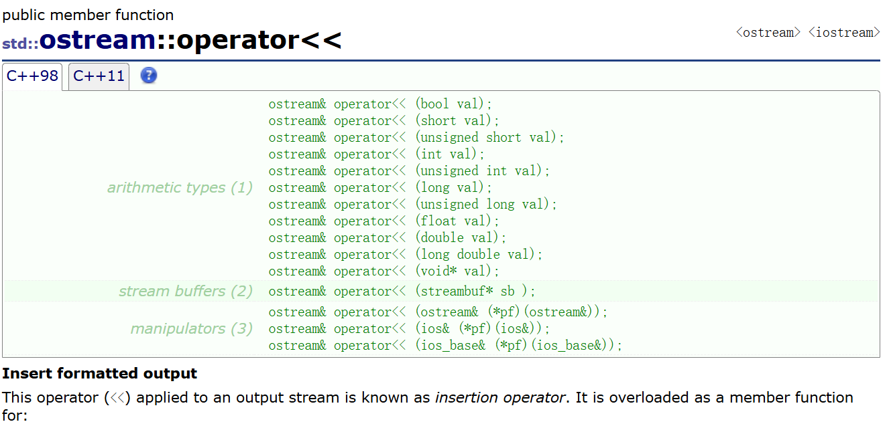

# 友元

友元类比现实生活就是房东的每个房间都是一个类，这个房东将房子租给其他租客并给了钥匙，则那个租客可以访问那个房间里的家具等。友元可以理解为这把“钥匙”。

友元提供了一种突破封装的方式，有时提供了便利。但是友元会增加耦合度（软件工程中的定义是模块间的紧密程度，模块在这里可以理解为类和非类的成员的函数），破坏了封装，所以友元不宜多用。

友元分为：**友元函数**和**友元类**。

## 友元函数

问题：现在尝试去重载`operator<<`，然后发现没办法将`operator<<`重载成成员函数。因为`cout`的输出流对象和隐含的`this`指针在**抢占第一个参数的位置**。

```cpp
#include<iostream>
using namespace std;
class Date {
public:
	Date(int year, int month, int day)
		: _year(year)
		, _month(month)
		, _day(day)
	{}
	// d1 << cout; -> d1.operator<<(&d1, cout); 不符合常规调用
// 因为成员函数第一个参数一定是隐藏的this，所以d1必须放在<<的左侧
	//这种情况就是参数顺序不匹配
	ostream& operator<<(ostream& _cout) {
		_cout << _year << "-" << _month << "-" << _day << endl;
		return _cout;
	}
private:
	int _year;
	int _month;
	int _day;
};

int main() {
	Date d(2025, 1, 1);
	d << cout;//<<重载在Date类内部，cout作为实参只能放在第二个
	return 0;
}
```

`this`指针默认是第一个参数也就是左操作数了。但是实际使用中`cout`需要是第一个形参对象，才能正常使用。

所以要将`operator<<`**重载成全局函数**。但又会导致类外没办法访问成员，此时就需要友元来解决。`operator>>`同理。

**友元函数**可以**直接访问**类的**私有**成员，它是**定义在类外部**的**普通函数**，不属于任何类，但需要在类的内部声明，声明时需要加`friend`关键字。

```cpp
class Date {
	friend ostream& operator<<(ostream& _cout, const Date& d);
	friend istream& operator>>(istream& _cin, Date& d);
public:
	Date(int year = 1900, int month = 1, int day = 1)
		: _year(year)
		, _month(month)
		, _day(day)
	{}
private:
	int _year;
	int _month;
	int _day;
};
//写成全局的函数则可以自由控制顺序
ostream& operator<<(ostream& _cout, const Date& d) {
	_cout << d._year << "-" << d._month << "-" << d._day;
	return _cout;//为了支持连续的流输出
}

istream& operator>>(istream& _cin, Date& d) {
	_cin >> d._year;
	_cin >> d._month;
	_cin >> d._day;
	return _cin;
}
int main() {
	Date d;
	cin >> d;
	cout << d << endl;
	return 0;
}
```

> java最常用的方法是使用函数获取私有变量的数据（`getter`方法）。比如：
>
> ```java
> public class A{
>  	private int a;
>  	public int geta(){
>            return a;
>  	}
> }
> ```
>
> 因为java需要做到严格的封装，而友元其实是破坏封装的行为。
>
> 但java也有其他的方法做到同样的效果，这里不讨论。
>
> c++也可以用java的`getter`方法，只要不嫌麻烦。

**说明:**

* 友元函数可**访问类的私有和保护成员**，但**不是类的成员函数**。
* 友元函数不能用`const`修饰。
* 友元函数可以在类定义的**任何地方声明**，**不受类访问限定符限制**。

> 类比朋友来我家玩，我家的泳池等可以对朋友开放。

* 一个函数可以是多个类的友元函数（团宠函数）。
* 友元函数的调用与普通函数的调用原理相同。

> c语言的`scanf`和`printf`不能很好地支持自定义类型。
>
> 一个原因是格式问题，它们不能很好地支持全部的内置类型成员（最直观的感受是所有内置型成员都要设置单独的格式）；另一个原因是如何访问访问私有数据，将`scanf`和`printf`设置为友元不现实，使用java的`getter`方法会调用多余的函数。
>
> 所以c++需要引入`cin`和`cout`，并将`<<`重载和`>>`重载设置为多个标准库里的类的友元函数。
>
> 流插入`<<`实现自动识别的机制是函数重载。
>
> 摘自：[ostream::operator<< - C++ Reference](https://legacy.cplusplus.com/reference/ostream/ostream/operator<</) 
>
> 

## 友元类

除了函数，类也可以设置成友元，可以用`friend`关键字在类中声明。

> 类比的话两个家庭是两个类，一个家庭可以使用另一个家庭的公共设备比如泳池。
>

* 友元类的所有成员函数都可以是另一个类的友元函数，都可以访问另一个类中的非公有成员。

```cpp
#include<iostream>
using namespace std;
class B {//因为是A类成员函数访问B类私有变量，所以B类先声明A并设置友元
public:
	B(int _b=9)
	:b(_b){ }
	int getb() {
		return b;
	}
private:
	friend class A;//友元和访问限定符无关
	int b;
};

class A {
public:
	void makeb(B& x,int num) {
		x.b = num;
	}
private:
	int a;
};

int main() {
	A a; B b;
	a.makeb(b, 6);
	cout << b.getb() << endl;
	return 0;
}
```

* 友元关系是单向的，不具有交换性。

比如上述的`A`类和`B`类，`A`类的成员函数可以访问`B`类对象。

以及下述的`Time`类和`Date`类，在`Time`类中声明`Date`类为其友元类，那么可以在`Date`类中直接访问`Time`类的私有成员变量，但想在`Time`类中访问`Date`类中私有的成员变量则不行。

```cpp
class Time {
	friend class Date;// 声明日期类为时间类的友元类，则在日期类中就直接访问Time类中的私有成员变量
public:
	Time(int hour = 0, int minute = 0, int second = 0)
		: _hour(hour)
		, _minute(minute)
		, _second(second)
	{}

private:
	int _hour;
	int _minute;
	int _second;
};
class Date {
public:
	Date(int year = 1900, int month = 1, int day = 1)
		: _year(year)
		, _month(month)
		, _day(day)
	{}

	void SetTimeOfDate(int hour, int minute, int second) {
		// 直接访问时间类私有的成员变量
		_t._hour = hour;
		_t._minute = minute;
		_t._second = second;
	}

private:
	int _year;
	int _month;
	int _day;
	Time _t;
};
```

* 友元关系不能传递

如果`C`类是`B`类的友元， `B`类是`A`类的友元，则不能说明`C`类是`A`类的友元。

* 友元关系不能继承。继承是类和类之间的一种关系。
  关于类的继承详细见[类与对象—继承-CSDN博客](https://blog.csdn.net/m0_73693552/article/details/149293427)。

# 内部类

概念：如果**一个类定义在另一个类的内部**，这个内部类就叫做内部类。

**内部类**是一个**独立**的类，它不属于外部类，更**不能通过外部类的对象去访问内部类的成员**。外部类对内部类没有任何优越的访问权限。

注意：**内部类就是外部类的友元类**，即内部类的成员函数可以访问外部类的私有成员，以及通过外部类的对象参数来访问外部类中的所有成员。但是外部类不是内部类的友元。

形象解释的话就是房子是一个类，书房是房子的内部类。书房不同于房子的功能，并且书房内的主人可以访问房子内的其他东西，而房子内的园丁、管家等访问书房内的东西可能不允许访问书房。

```cpp
#include<iostream>
using namespace std;
class A {
public:
	class B {
	public:
		B(int _b=6)
		:b(_b){}
		int geta(A& a) {
			return a.a;
		}
	private:
		int b;
	};
	A(int _a = 7)
		:a(_a) {}
	int geta() {
		return a;
	}
private:
	int a;
};

int main() {
	A::B b;//内部类生成的对象
	A a;
	cout<<b.geta(a)<<endl;//内部类的成员函数访问外部类的私有变量
	cout<<a.geta()<<endl;
	return 0;
}
```


特性：

1. 内部类可以定义在外部类的`public`、`protected`、`private`都是可以的。**内部类的访问受外部类的访问限定符限制**。

2. 注意内部类可以直接访问外部类中的`static`成员，不需要外部类的对象/类名。

3. `sizeof(外部类)=外部类`，和内部类没有任何关系。

```cpp
class A {
private:
	static int k;
	int h;
public:
	class B {// B天生就是A的友元
	public:
		void foo(const A& a) {
			cout << k << endl;//OK
			cout << a.h << endl;//OK
		}
	};
};
int A::k = 1;
int main() {
	A::B b;
	b.foo(A());

	return 0;
}
```

两个代码很相似但不一样，下面的类B不受类A的访问限定符影响。

```cpp
#include<iostream>
using namespace std;
class A {
	friend class B;
private:
	static int k;
	int h;
public:

};
class B {
public:
	void foo(const A& a) {
		cout << a.k << endl;//OK
		cout << a.h << endl;//OK
	}
};
int A::k = 1;
int main() {
	B b;
	b.foo(A());
	return 0;
}
```

通过内部类，这个OJ[求1+2+3+...+n，要求不能使用乘除法、for、while、if、else、switch、case等关键字及条件判断语句（A?B:C)](https://www.nowcoder.com/practice/7a0da8fc483247ff8800059e12d7caf1?tpId=13&tqId=11200&tPage=3&rp=3&ru=/ta/coding-interviews&qru=/ta/coding-interviews/question-ranking)还能通过内部类实现：

```cpp
#include <cmath>
class Solution {
public:
    int Sum_Solution(int n) {
        A* a=new A[n];
        free(a);//析构函数并没有处理static成员
        return sum;
    }
    class A{//利用内部类可以访问外部类的成员的特点
    public:
        A(){
            ++i;
            sum+=i;
        }
    };
    static int i;
    static int sum;
};
int Solution::i=0;
int Solution::sum=0;
```

# 匿名对象

`类名(上传构造函数的实参列表)`表示临时生成一个没有对象名的对象。

匿名对象的特点是生命周期只在所在行，而有名对象的生命周期在所在的局部
（`{}`内）。

因为很多时候生成这个对象就是为了调用这个函数，既然如此，于是就有了绕过生成对象来调用函数的方法。

匿名对象常用于OJ的补全（常见的是Leetcode和Nowcoder）。

```cpp
class A {
public:
	A(int a = 0)
		:_a(a) {
		cout << "A(int a)" << endl;
	}
	~A() {
		cout << "~A()" << endl;
	}
private:
	int _a;
};

class Solution {
public:
	int Sum_Solution(int n) {
		//...
		return n;
	}
};
int main() {
	A aa1;
    
    //可以这么定义匿名对象，匿名对象的特点是不用取名字，
	// 但是他的生命周期只有这一行，可以看到下一行他就会自动调用析构函数
	A();
	A aa2(2);
	// 匿名对象在这样场景下就很好用（指绕过生成对象调用函数），当然还有一些其他使用场景
	Solution().Sum_Solution(10);
	return 0;
}
```

**匿名对象具有常属性**。也就是说不能用匿名对象给有名对象进行拷贝构造。

`const` $+$ 引用 会延长匿名对象的生命周期，所以函数的缺省值可以用匿名对象。

`const A& ref = A();`的生命周期变成了所在局部。

```cpp
#include<iostream>
using namespace std;
class A {
public:
	A(int _a = 9)
	:a(_a){
		cout << "int _a = 9" << endl;
	}
	A(A& x) 
	:a(x.a){
		cout << "A(A& x) " << endl;
	}
	~A() {
		cout << "~A()" << endl;
	}
	void f1() {
		cout << "void A::f1()" << endl;
	}
	void f2() const{
		cout << "void A::f2()" << endl;
	}
	int geta() const{
		return a;
	}
private:
	int a;
};

void f() {
	const A& a = A();//生命周期延长
	cout << "void f()" << endl;
	//a.f1();//常属性对象不可调用非常属性成员函数
	a.f2();
}

void f2(const A& x=A()) {
	cout << "x.a=" << x.geta() << endl;
}
int main() {
	//A a=A();//匿名对象具有常属性，所以不允许
	f();
	cout << "int main()" << endl;
	return 0;
}
```

匿名对象的玩法很多。详细见[类和对象——拷贝对象时的一些编译器优化-CSDN博客](https://blog.csdn.net/m0_73693552/article/details/145915670)。