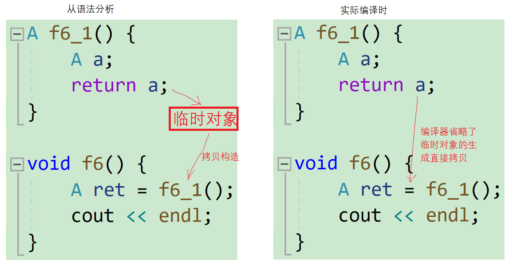

# 拷贝对象时的一些编译器优化

在传参和传返回值的过程中，一般编译器会做一些优化（也就是说有的不做优化），减少对象的拷贝，这个在一些场景下还是非常有用的。

这里只举几个案例，详细见书籍《深度探索c++对象模型》。

在20世纪末流行的编译器（例如，vc++6.0）不会对这种情况进行优化。

### 案例1：仅使用类中的成员函数

很多时候，生成这个对象的目的仅仅是为了调用类中的某个函数。此时没必要生成一个对象，特别是生成一个对象作为实参上传给普通函数。

```cpp
#include<iostream>
#include<cstdlib>
using namespace std;

class A {
public:
	A(int a = 6)
		:a(a) {
		cout << "A(int a)" << endl;
	}
	A(const A& aa)
		:a(aa.a) {
		cout << "A(const A& aa)" << endl;
	}
	A& operator=(const A& aa) {
		cout << "A& operator=(const A& aa)" << endl;
		if (this != &aa) {
			a = aa.a;
		}
		return *this;
	}

	~A() {
		cout << "~A()" << endl;
	}
	void print() {
		using std::cout;
		cout << a << "\n";
	}
private:
	int a;
};

//若调用拷贝构造仅仅是为了调用这个函数，完全没必要传值传参
void f1_1(A a) {
	a.print();
}

//所以直接加引用
void f1_2(A& a) {
	a.print();
}

void f1() {
	A a;
	f1_1(a);
	cout << endl;
	f1_2(a);
	cout << endl;
}

int main() {
	f1();
	return 0;
}
```


### 案例2：案例1减少一次拷贝构造

首先，`const`对象不能调用非`const`成员函数。所以`const`对象也要准备对应的`const`函数重载。

其次，引用和`const`一般在一起，为了避免别名修改原来的对象（变量）。

最后，形参使用引用可以减少一次拷贝构造。

```cpp
#include<iostream>
#include<cstdlib>
using namespace std;

class A {
public:
	A(int a = 6)
		:a(a) {
		cout << "A(int a)" << endl;
	}
	A(const A& aa)
		:a(aa.a) {
		cout << "A(const A& aa)" << endl;
	}
	A& operator=(const A& aa) {
		cout << "A& operator=(const A& aa)" << endl;
		if (this != &aa) {
			a = aa.a;
		}
		return *this;
	}

	~A() {
		cout << "~A()" << endl;
	}

	//相应函数也要对这个类的成员函数进行限制防止权限放大
	void print() const {
		using std::cout;
		cout << a << "\n";
	}
private:
	int a;
};

//为了支持生成临时对象，使用const引用
void f2_1(const A& a) {
	a.print();
}

void f2_2(A& a) {
	a.print();
}

void f2_3(A& a) {//非const形参，不具有常属性
	a.print();
}

void f2() {
	A a;
	f2_1(a);//权限缩小
	cout << endl;

	f2_2(a);//权限平移
	cout << endl;

	//f2_3(A());//权限放大
	f2_1(A());//形参也具有常属性时权限平移，可以调用
	cout << endl;
}

int main() {
	f2();
	return 0;
}
```

输出：

```cpp
A(int a)
6

6

A(int a)
6
~A()

~A()
```

`f2_3(A());`无法编译通过，因为临时对象、匿名对象都有常属性，上传无常属性形参的函数，权限放大。

### 案例3：临时对象也具有常属性

在案例2已经证明匿名对象具有常属性。隐式类型转换的临时对象也具有常属性。

```cpp
#include<iostream>
#include<cstdlib>
using namespace std;

class A {
public:
	A(int a = 6)
		:a(a) {
		cout << "A(int a)" << endl;
	}
	A(const A& aa)
		:a(aa.a) {
		cout << "A(const A& aa)" << endl;
	}
	A& operator=(const A& aa) {
		cout << "A& operator=(const A& aa)" << endl;
		if (this != &aa) {
			a = aa.a;
		}
		return *this;
	}

	~A() {
		cout << "~A()" << endl;
	}

	//相应函数也要对这个类的成员函数进行限制防止权限放大
	void print() const {
		using std::cout;
		cout << a << "\n";
	}
private:
	int a;
};

//const引用能很好的支持生成临时对象
void f3_1(const A& a) {//这个地方引用和const一般同时出现防止不小心修改
	a.print();
}

void f3() {//少调用一次拷贝构造
	f3_1(A());//匿名对象有常属性
	cout << endl;
	f3_1(A(4));
	cout << endl;
	f3_1(3);//临时对象也具有常属性
	cout << endl;
}

int main() {
	f3();
	return 0;
}
```

输出：

```cpp
A(int a)
6
~A()

A(int a)
4
~A()

A(int a)
3
~A()
```

它们都被优化成了只调用一次构造函数。

### 案例4：const引用延长生命周期

`const`引用可以延长临时对象的生命周期，本质是将临时对象变成有名对象，这样临时对象就可以像有名对象一样生命周期在局部。

```cpp
#include<iostream>
#include<cstdlib>
using namespace std;

class A {
public:
	A(int a = 6)
		:a(a) {
		cout << "A(int a)" << endl;
	}
	A(const A& aa)
		:a(aa.a) {
		cout << "A(const A& aa)" << endl;
	}
	A& operator=(const A& aa) {
		cout << "A& operator=(const A& aa)" << endl;
		if (this != &aa) {
			a = aa.a;
		}
		return *this;
	}

	~A() {
		cout << "~A()" << endl;
	}

	//相应函数也要对这个类的成员函数进行限制防止权限放大
	void print() const {
		using std::cout;
		cout << a << "\n";
	}
private:
	int a;
};

//缺省值为匿名对象
//const延长生命周期使得匿名对象存在于局部
void f4_1(const A& a = A()) {
	a.print();
}

void f4() {
	f4_1();
	cout << endl;

	//这里只有ref出了作用域，
	//临时对象的生命周期才终止
	const A& ref = A();
	cout << endl;

	ref.print();//还在{}也就是作用域内，可以使用
	cout << endl;
}

int main() {
	f4();
	return 0;
}
```

### 案例5：传匿名对象传参

编译器优化情况1：隐式类型转换作为实参，此时会调用两次构造。编译器将连续的两次构造（构造+拷贝构造）优化为直接构造。

c++标准并没有对这种情况进行优化说明，这个其实还是编译器本身的行为。在一些年代比较久远的编译器（比如20世纪末）就不会。

```cpp
#include<iostream>
#include<cstdlib>
using namespace std;

class A {
public:
	A(int a = 6)
		:a(a) {
		cout << "A(int a)" << endl;
	}
	A(const A& aa)
		:a(aa.a) {
		cout << "A(const A& aa)" << endl;
	}
	A& operator=(const A& aa) {
		cout << "A& operator=(const A& aa)" << endl;
		if (this != &aa) {
			a = aa.a;
		}
		return *this;
	}

	~A() {
		cout << "~A()" << endl;
	}

	//相应函数也要对这个类的成员函数进行限制防止权限放大
	void print() const {
		using std::cout;
		cout << a << "\n";
	}
private:
	int a;
};

void f5_1(A a) {
	a.print();
}//析构

void f5_2(const A a) {
	a.print();
}

A f5_3() {
	A a;
	return a;
}

//隐式类型，连续构造(两次及以上)->优化为直接构造
void f5() {
	//传值传参
	//正常情况
	A a;//构造
	f5_1(a);//拷贝构造
	cout << endl;

	// 一个表达式中，构造+拷贝构造->优化为一个构造
	f5_1(A());//匿名对象构造+拷贝构造被优化
	cout << endl;

	f5_1(A(3));
	cout << endl;
	
	f5_1(4);//隐式类型转换
	cout << endl;

	//这个也是构造+拷贝构造
	A b = A(3);
	cout << endl;
}

int main() {
	f5();
	return 0;
}
```

输出：

```cpp
A(int a)
A(const A& aa)
6
~A()

A(int a)
6
~A()

A(int a)
3
~A()

A(int a)
4
~A()

A(int a)

~A()
~A()
```

分析：

`f5_1(A());`，`f5_1(A(3));`：匿名对象调用构造函数，加拷贝构造生成形参。

`f5_1(4);`：隐式转换，一次构造加拷贝构造。

`A b = A(3);`：一次构造加拷贝构造。

这三种情况，都被优化为一次构造。

### 案例6：函数传值返回时的优化

```cpp
#include<iostream>
#include<cstdlib>
using namespace std;

class A {
public:
	A(int a = 6)
		:a(a) {
		cout << "A(int a)" << endl;
	}
	A(const A& aa)
		:a(aa.a) {
		cout << "A(const A& aa)" << endl;
	}
	A& operator=(const A& aa) {
		cout << "A& operator=(const A& aa)" << endl;
		if (this != &aa) {
			a = aa.a;
		}
		return *this;
	}

	~A() {
		cout << "~A()" << endl;
	}

	//相应函数也要对这个类的成员函数进行限制防止权限放大
	void print() const {
		using std::cout;
		cout << a << "\n";
	}
private:
	int a;
};

A f6_1() {
	A a;//构造
	return a;//拷贝构造生成临时对象
}

A& f6_2() {
	A a;
	return a;
}

void f6() {
	A a;
	cout << endl;

	f6_1();
	cout << endl;

	a = f6_1();
	cout << endl;
	
	A ret = f6_1();
	cout << endl;

	A ret2 = f6_2();
	cout << endl;
}

int main() {
	f6();
	return 0;
}
```

输出：

```cpp
A(int a)

A(int a)
A(const A& aa)
~A()
~A()

A(int a)
A(const A& aa)
~A()
A& operator=(const A& aa)
~A()

A(int a)
A(const A& aa)
~A()

A(int a)
~A()
A(const A& aa)

~A()
~A()
~A()
```


单独看`A ret = f6_1();`这种情况：



`A f6_1()`在`return`语句会生成临时对象，但编译器进行了优化，直接将这个`a`在生命周期结束前拷贝给`ret`。

所以在一个表达式的连续两个步骤里，局部对象构造 + 传值返回生成临时对象调用拷贝构造，两次调用构造被优化为一次。

而`A ret2 = f6_2();`因为`f6_2`是传引用返回，所以直接省去了`return`语句的一次拷贝构造，在析构前生成临时对象，之后通过拷贝构造将对象拷贝给`ret2`。

### 案例7：优化的条件

```cpp
#include<iostream>
#include<cstdlib>
using namespace std;

class A {
public:
	A(int a = 6)
		:a(a) {
		cout << "A(int a)" << endl;
	}
	A(const A& aa)
		:a(aa.a) {
		cout << "A(const A& aa)" << endl;
	}
	A& operator=(const A& aa) {
		cout << "A& operator=(const A& aa)" << endl;
		if (this != &aa) {
			a = aa.a;
		}
		return *this;
	}

	~A() {
		cout << "~A()" << endl;
	}

	//相应函数也要对这个类的成员函数进行限制防止权限放大
	void print() const {
		using std::cout;
		cout << a << "\n";
	}
private:
	int a;
};

A f7_1() {
	A a;
	return a;
}

void f7() {//这种情况编译器不会再优化
	A ret2;
	ret2 = f7_1();
}

int main() {
	f7();
	return 0;
}
```

`f7()`这种情况不能优化，两个原因：

* 同类型才能优化（都是构造或都是拷贝构造才能优化，这里是构造和赋值）。
* 不在同一步骤（声明对象和赋值重载是两个语句或者说步骤）。


### 案例8：隐式类型转换的优化

和案例6的情况相似，都是构造临时对象并返回，只是存在隐式类型转换。所以被优化为一次构造。

```cpp
#include<iostream>
#include<cstdlib>
using namespace std;

class A {
public:
	A(int a = 6)
		:a(a) {
		cout << "A(int a)" << endl;
	}
	A(const A& aa)
		:a(aa.a) {
		cout << "A(const A& aa)" << endl;
	}
	A& operator=(const A& aa) {
		cout << "A& operator=(const A& aa)" << endl;
		if (this != &aa) {
			a = aa.a;
		}
		return *this;
	}

	~A() {
		cout << "~A()" << endl;
	}

	//相应函数也要对这个类的成员函数进行限制防止权限放大
	void print() const {
		using std::cout;
		cout << a << "\n";
	}
private:
	int a;
};

//被优化为直接构造
//构造匿名对象加临时对象，两次构造被优化为1次
A f8_1() {
	return A();
}

A f8_2() {
	return 8;
}

A f8_3() {
	return A(1);
}

void f8() {
	A a1 = f8_1();
	cout << endl;
	A a2 = f8_2();//隐式类型转换
	cout << endl;
	A a3 = f8_3();
	cout << endl;
}

int main() {
	f8();
	return 0;
}
```

所以就有了这样一个特性：局部对象都只能传值返回，因此可以的话尽可能使用临时对象返回或隐式类型转换，可以减少拷贝调用次数。

# 再次理解封装

现实生活中的实体计算机并不认识，计算机只认识二进制格式的数据。如果想要让计算机认识现实生活中的实体，用户必须通过某种面向对象的语言，对实体进行描述，然后通过编写程序，创建对象后计算机才可以认识。

比如想要让计算机认识洗衣机，就需要：

1. 用户先要对现实中洗衣机实体进行抽象——即在人为思想层面对洗衣机进行认识，洗衣机有什么属性，有那些功能，即对洗衣机进行抽象认知的一个过程。

2. 经过1之后，在人的头脑中已经对洗衣机有了一个清醒的认识，只不过此时计算机还不清楚，想要让计算机识别人想象中的洗衣机，就需要人通过某种面向对象的语言（比如：c++、java、python等）将洗衣机用类来进行描述，并输入到计算机中。

3. 经过2之后，在计算机中就有了一个洗衣机类，但是洗衣机类只是站在计算机的角度对洗衣机对象进行描述的，通过洗衣机类，可以实例化出一个个具体的洗衣机对象，此时计算机才能洗衣机是什么东西。

4. 用户就可以借助计算机中洗衣机对象，来模拟现实中的洗衣机实体了。

所以**类是对某一类实体**（**对象**）**来进行描述的**，描述该对象具有那些**属性**，那些**方法**，描述完成后就**形成**了一种新的**自定义类型**，才用该自定义类型就可以实例化具体的对象。


[计算日期到天数转换](https://www.nowcoder.com/practice/769d45d455fe40b385ba32f97e7bcded?tpId=37&&tqId=21296&rp=1&ru=/activity/oj&qru=/ta/huawei/question-ranking) 

[日期差值](https://www.nowcoder.com/practice/ccb7383c76fc48d2bbc27a2a6319631c?tpId=62&&tqId=29468&rp=1&ru=/activity/oj&qru=/ta/sju-kaoyan/question-ranking) 

[打印日期](https://www.nowcoder.com/practice/b1f7a77416194fd3abd63737cdfcf82b?tpId=69&&tqId=29669&rp=1&ru=/activity/oj&qru=/ta/hust-kaoyan/question-ranking) 

[累加天数](https://www.nowcoder.com/practice/eebb2983b7bf40408a1360efb33f9e5d?tpId=40&&tqId=31013&rp=1&ru=/activity/oj&qru=/ta/kaoyan/question-ranking) 

# 综合运用——日期类的实现

在学习时自己意识到一个很严重的问题，自己的博客写的过于死板，看起来就像抄书抄笔记一样。所以为了运用学过的知识点，我会尝试做很多在生活中有实际意义的功能。

比如这个日期类就是实现和[日期计算器](https://ri7.com.cn/)大部分的功能。但暂时不将它展示在网页。

### 日期类模版参考

这里采用头文件和源文件分离的写法，将它们拷在同一个.cpp文件里也可以用，但代码会特别长。

成员函数的实现只挑几个点来讲。

```cpp
#pragma once
#include<iostream>
using std::ostream;

class Date {
public:
	// 获取某年某月的天数
	static int GetMonthDay(int year, int _month);

	// 全缺省的构造函数
	Date(int _year = 1900, int _month = 1, int _day = 1);

	// 拷贝构造函数
	// d2(d1)
	Date(const Date& d);

	//获取对象的信息
	void print();

	// 赋值运算符重载
    // d2 = d3 -> d2.operator=(&d2, d3)
	Date& operator=(const Date& d);

	// 析构函数
	~Date();

	// 日期+=天数
	Date& operator+=(int day);

	// 日期+天数
	Date operator+(int day);

	// 日期-天数
	Date operator-(int day);

	// 日期-=天数
	Date& operator-=(int day);

	// 前置++
	Date& operator++();

	// 后置++
	Date operator++(int);

	// 后置--
	Date operator--(int);

	// 前置--
	Date& operator--();

	// >运算符重载
	bool operator>(const Date& d);

	// ==运算符重载
	bool operator==(const Date& d);

	// >=运算符重载
	//运算符和operator允许间隔空格
	bool operator >= (const Date& d);

	// <运算符重载
	bool operator < (const Date& d);

	// <=运算符重载
	bool operator <= (const Date& d);

	// !=运算符重载
	bool operator != (const Date& d);

	// 日期-日期 返回天数
	int operator-(const Date& d);

	//统计活跃的对象个数
	static int count();
private:
	//日期纠错
	void check();
	int year;
	int month;
	int day;
	static int num;
	//为了Date类能用cout输出
	//不在头文件定义<<重载，是为了<<重载只出现在
	//一个.cpp文件中
	friend ostream& operator<<(ostream& out, Date& d);
};
```

### 非法日期处理

这里的日期采用公元纪年。

公元纪年的特点是月份的天数固定，闰年的二月加一天。

所以需要一个内置函数来获取每月都有多少天。

```cpp
// 获取某年某月的天数
int Date::GetMonthDay(int _year, int _month) {
	static int days[13] =
	{ 0, 31, 28, 31, 30, 31, 30, 31, 31, 30, 31, 30, 31 };
	int day = days[_month];
	if (_month == 2
		&& ((year % 4 == 0 && year % 100 != 0)
			|| (year % 400 == 0))) {
		day += 1;
	}
	return day;
}
```

规定，当月份`month`小于0时，相当于某年1月的前`month`个月，日同理。

当月份`month`大于12时，相当于某年12月的未来几个月，日同理。

按照规定，当月份小于0，则向年份借位；当月份大于0时，则向年进1。

当月份矫正后，若日为负数，则相当于当前月的1月1日的前若干天。举个例子，`2024_2_-6`相当于`2024_2_1`的前5天，也就是`2024_1_26`（`31-5=26`）。

若日大于当前月的天数，则减去当前月的天数，月份进一位。例如，`2024_3_32`相当于
`2024_3_31`的明天也就是`2024_4_1`。

根据分析，就有了非法日期纠错的函数：

```cpp
//日期纠错
void Date::check() {
	while (month <= 0) {//向年份借位
		month += 12;
		year--;
	}
	while (month > 12) {//向月份进位
		year++;
		month -= 12;
	}
	while (day < 1) {//向月份借位
		month--;//用的是上一个月的日期
		while (month <= 0) {
			month += 12;
			year--;
		}
		day += GetMonthDay(year, month);
	}
	while (day > GetMonthDay(year, month)) {//向月份进位
		day -= GetMonthDay(year, month);
		month++;
		while (month > 12) {
			year++;
			month -= 12;
		}
	}
}
```

### 日期<=日期

先说日期大于日期：年份谁大谁代表的日期就大，相等则比月份，再相等则比日期。最后返回一个`bool`值。

```cpp
// >运算符重载
bool Date::operator>(const Date& d) {
	if (year > d.year)
		return true;
	if (year == d.year && month > d.month)
		return true;
	if (year == d.year && month == d.month && day > d.day)
		return true;
	return false;
}
```

日期相等则比较两个对象的成员变量是否一致即可。

```cpp
// ==运算符重载
bool Date::operator==(const Date& d) {
	return year == d.year && month == d.month && day == d.day;
}
```

之后的比较运算符重载可以在这两个函数的基础上复用。也可根据`>`重载的原理实现`<`重载。

比如实现类似`<=`的运算符重载：

```cpp
bool operator<=(const T& d){
    return !(*this>d);
}

//实现了<重载时用这个
/*
bool operator<=(const T& d){
    return *this<d||*this==d;
}
*/
//注意这两个函数是某个类的成员函数。
```

这种成员函数调用别的成员函数的行为，部分人称为成员复用（代码复用）。

### 日期+天数和日期+=天数

类重载什么运算符并没有规定，只要重载的运算符是有意义就行。比如日期加日期没有意义，日期减日期可以计算间隔，日期加天数可以知道某个天数后是几月几号。

比如`2025_1_23`，加5天就变成了`2025_1_28`。

这两个运算符可以互相进行代码复用。但要考虑优化问题：谁复用谁才能保证最少的拷贝构造函数调用次数最少。

日期重载运算符`+`：

重载操作符作为公共函数必须有一个类类型参数，作为类的成员函数也可以只有内置类型。

因为`+`重载只是将日期相加，并将值通过赋值重载赋值给新日期，所以本身没变，需要新增临时对象参与运算，调用了一次拷贝构造。之后临时对象只需要在天数上相加，剩下的交给日期纠错函数即可，之后返回临时对象，又调用了一次拷贝构造。

所以`+`重载调用了两次拷贝构造。

而`+=`需要再原基础上进行日期相加，通过传引用返回可以不调用拷贝构造。

如果是`+=`调用`+`，则两次拷贝构造之后还要进行一次赋值重载，反过来的话则不用。

所以最好是`+`调用`+=`。

```cpp
// 日期+=天数
Date& Date::operator+=(int day) {
	this->day += day;
	check();
	return *this;
}

// 日期+天数
Date Date::operator+(int day) {
	Date tmp(*this);
	tmp.day += day;
	tmp.check();
	return tmp;
}
```

### 日期相减

日期减日期和日期减天数构成重载，根据实际的应用，日期相减的返回值是天数更符合生活的需求。

最粗暴的方式是日期小的持续自增，直到和原日期相等即可。

```cpp
// 日期-日期 返回天数
int Date::operator-(const Date& d) {
	Date max = *this;
	Date min = d;
	int flag = 1;
	if (max < min) {
		flag = -1;
		Date t = max;
		max = min;
		min = t;
	}
	int num = 0;
	while (min != max) {
		++min;
		++num;
	}
	return num * flag;
}
```

还有其他方法：

假设要算的是`d1-d2`，则先算`d1`和`d2`各自距1月1日多少天分别记作`D1`、`D2`，再计算`d1`和`d2`的年份差值，最后计算出`d1`和`d2`的年份差`y`，按一年365天加上闰年天数`r`（当`d1.year<d2.year`时，`r<=0`），即可算出时间差值为

`365*y+r+D1-D2`。

至于当前日期距1月1日多少天（同样指1月1日加多少天等于当前日期），自己的天数减1加月份差积累的天数即可。

例如`2024_3_15`距离`2024_1_1`相差`15-1+(29+31)=74`天。但是1月1日距1月1日相差0天。

这些都可以在时间轴上进行模拟。

根据以上分析，得到日期减日期的函数：

```cpp
// 日期-日期 返回天数
int Date::operator-(const Date& d) {
	if (*this == d)
		return 0;
	int d1 = 0, d2 = 0;
	int m1 = this->month, m2 = d.month;
	int r = 0;

	//计算闰年天数，同一年则不用
	if (this->year == d.year)
		r = 0;
	else
		for (int i = 
			((this->year < d.year) ? (this->year) : (d.year));
			i <= ((this->year > d.year) ? (this->year) : (d.year)); i++)
			if ((!(i % 4) && (i % 100)) || !(i % 400))
				++r;

	//根据月份累加天数
	while (m1 && m2) {
		--m1;
		if (m1)
			d1 += GetMonthDay(this->year, m1);
		--m2;
		if (m2)
			d2 += GetMonthDay(d.year, m2);
	}
	while (m1) {
		--m1;
		if (m1)
			d1 += GetMonthDay(this->year, m1);
	}
	while (m2) {
		--m2;
		if (m2)
			d2 += GetMonthDay(d.year, m2);
	}

	//1月1日额外计算
	if (!(this->month == 1 && this->day == 1))
		d1 += this->day - 1;
	if (!(d.month == 1 && d.day == 1))
		d2 += d.day - 1;
	//确保闰年能准确加上去
	if ((*this).year < d.year) {
		r = -r;
	}
	return 365 * (this->year - d.year) + r + d1 - d2;
}
```

### 最终参考程序

直接拷贝后就能使用的参考程序。

`Date.h`

```cpp
#pragma once
#include<iostream>
using std::ostream;

class Date {
public:
	// 获取某年某月的天数
	static int GetMonthDay(int year, int _month);

	// 全缺省的构造函数
	Date(int _year = 1900, int _month = 1, int _day = 1);

	// 拷贝构造函数
	// d2(d1)
	Date(const Date& d);

	//获取对象的信息
	void print();

	// 赋值运算符重载
    // d2 = d3 -> d2.operator=(&d2, d3)
	Date& operator=(const Date& d);

	// 析构函数
	~Date();

	// 日期+=天数
	Date& operator+=(int day);

	// 日期+天数
	Date operator+(int day);

	// 日期-天数
	Date operator-(int day);

	// 日期-=天数
	Date& operator-=(int day);

	// 前置++
	Date& operator++();

	// 后置++
	Date operator++(int);

	// 后置--
	Date operator--(int);

	// 前置--
	Date& operator--();

	// >运算符重载
	bool operator>(const Date& d);

	// ==运算符重载
	bool operator==(const Date& d);

	// >=运算符重载
	//运算符和operator允许间隔空格
	bool operator >= (const Date& d);

	// <运算符重载
	bool operator < (const Date& d);

	// <=运算符重载
	bool operator <= (const Date& d);

	// !=运算符重载
	bool operator != (const Date& d);

	// 日期-日期 返回天数
	int operator-(const Date& d);

	//统计活跃的对象个数
	static int count();
private:
	//日期纠错
	void check();
	int year;
	int month;
	int day;
	static int num;
	//为了Date类能用cout输出
	//不在头文件定义<<重载，是为了<<重载只出现在
	//一个.cpp文件中
	friend ostream& operator<<(ostream& out, Date& d);
};
```

`Date.cpp`

```cpp
#include "Date.h"

// 获取某年某月的天数
int Date::GetMonthDay(int year, int month) {
	static int days[13] =
	{ 0, 31, 28, 31, 30, 31, 30, 31, 31, 30, 31, 30, 31 };
	int day = days[month];
	if (month == 2)
		if (((year % 4 == 0) && (year % 100 != 0)) || (year % 400 == 0)) {
			day += 1;
		}
	return day;
}

// 全缺省的构造函数，声明给缺省值，定义不用给
Date::Date(int _year, int _month, int _day) {
	day = _day;
	month = _month;
	year = _year;
	check();
	++num;
}

// 拷贝构造函数
Date::Date(const Date& d) {
	year = d.year;
	month = d.month;
	day = d.day;
	check();
	++num;
}

//获取类的信息
void Date::print() {
	using std::cout;
	cout << year << "-" << month << "-" << day << "\n";
}

// 赋值运算符重载
// d2 = d3 ---> d2.operator=(&d2, d3)
Date& Date::operator=(const Date& d) {
	if (this != &d) {
		year = d.year;
		month = d.month;
		day = d.day;
	}
	return *this;
}

// 析构函数
Date::~Date() {
	--num;//全是内置类型，可忽略，这里象征性地统计活跃的对象个数
}

// 日期+=天数
Date& Date::operator+=(int day) {
	this->day += day;
	check();
	return *this;
}

// 日期+天数
Date Date::operator+(int day) {
	Date tmp(*this);
	tmp.day += day;
	tmp.check();
	return tmp;
}

// 日期-天数
Date Date::operator-(int day) {
	Date tmp(*this);
	tmp.day -= day;
	tmp.check();
	return tmp;
}


// 日期-=天数
Date& Date::operator-=(int day) {
	this->day -= day;
	check();
	return *this;
}


// 前置++
Date& Date::operator++() {
	day++;
	check();
	return *this;
}


// 后置++
Date Date::operator++(int) {
	Date tmp(*this);
	day++;
	check();
	return tmp;
}

// 后置--
Date Date::operator--(int) {
	Date tmp(*this);
	day--;
	check();
	return tmp;
}

// 前置--
Date& Date::operator--() {
	day--;
	check();
	return *this;
}

// >运算符重载
bool Date::operator>(const Date& d) {
	if (year > d.year)
		return true;
	if (year == d.year && month > d.month)
		return true;
	if (year == d.year && month == d.month && day > d.day)
		return true;
	return false;
}

// ==运算符重载
bool Date::operator==(const Date& d) {
	return year == d.year && month == d.month && day == d.day;
}

// >=运算符重载
bool Date::operator >= (const Date& d) {
	return (*this > d) || (*this == d);
}

// <运算符重载
bool Date::operator < (const Date& d) {
	return !(*this >= d);
}


// <=运算符重载
bool Date::operator <= (const Date& d) {
	return !(*this > d);
}

// !=运算符重载
bool Date::operator != (const Date& d) {
	return !(*this == d);
}


//// 日期-日期 返回天数
//// 粗暴解法
//int Date::operator-(const Date& d) {
//	Date max = *this;
//	Date min = d;
//	int flag = 1;
//	if (max < min) {
//		flag = -1;
//		Date t = max;
//		max = min;
//		min = t;
//	}
//	int num = 0;
//	while (min != max) {
//		++min;
//		++num;
//	}
//	return num * flag;
//}

// 日期-日期 返回天数
int Date::operator-(const Date& d) {
	if (*this == d)
		return 0;
	int d1 = 0, d2 = 0;
	int m1 = this->month, m2 = d.month;
	int r = 0;

	//计算闰年天数
	if (this->year == d.year)
		r = 0;
	else
		for (int i = 
			((this->year < d.year) ? (this->year) : (d.year));
			i <= ((this->year > d.year) ? (this->year) : (d.year)); i++)
			if ((!(i % 4) && (i % 100)) || !(i % 400))
				++r;

	//根据月份累加天数
	while (m1 && m2) {
		--m1;
		if (m1)
			d1 += GetMonthDay(this->year, m1);
		--m2;
		if (m2)
			d2 += GetMonthDay(d.year, m2);
	}
	while (m1) {
		--m1;
		if (m1)
			d1 += GetMonthDay(this->year, m1);
	}
	while (m2) {
		--m2;
		if (m2)
			d2 += GetMonthDay(d.year, m2);
	}

	//1月1日额外计算
	if (!(this->month == 1 && this->day == 1))
		d1 += this->day - 1;
	if (!(d.month == 1 && d.day == 1))
		d2 += d.day - 1;
	//确保闰年能准确加上去
	if ((*this).year < d.year) {
		r = -r;
	}
	return 365 * (this->year - d.year) + r + d1 - d2;
}

int Date::num = 0;

int Date::count() {
	return num;
}

//日期纠错
void Date::check() {
	while (month <= 0) {//向年份借位
		month += 12;
		year--;
	}
	while (month > 12) {//向月份进位
		year++;
		month -= 12;
	}
	while (day < 1) {//向月份借位
		month--;//用的是上一个月的日期
		while (month <= 0) {
			month += 12;
			year--;
		}
		day += GetMonthDay(year, month);
	}
	while (day > GetMonthDay(year, month)) {//向月份进位
		day -= GetMonthDay(year, month);
		month++;
		while (month > 12) {
			year++;
			month -= 12;
		}
	}
}

//为了cout能支持Date类
ostream& operator<<(ostream& out, Date& d) {
	out << d.year << '-' << d.month << '-' << d.day;
	return out;//为了支持连续<<
}
```

# 综合运用——支持高精度算法的类