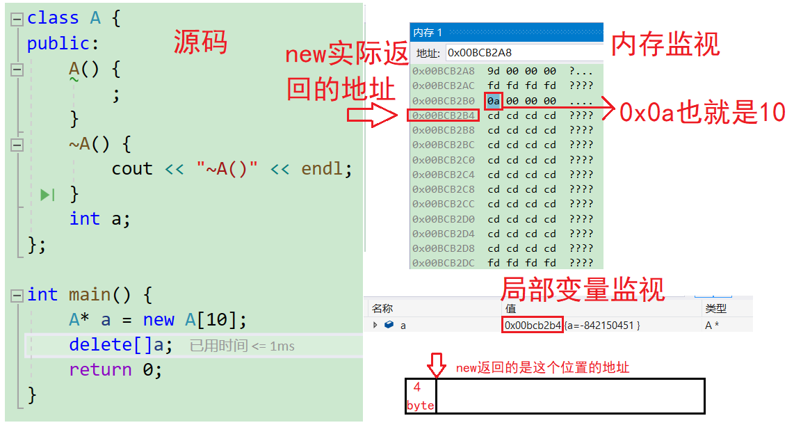

# c语言的内存管理

## c/c++内存分布

c/c++的内存分布本质是一样的，常用的内存大致可以分成：栈区、堆区、数据段（静态区）、代码段（常量区）。这样分肯定存在纰漏，但从语言的角度和平时使用足够。这样设计是为了对不同的内存方便地管理，应对不同的需求。

栈区是为了建立函数栈帧（换一种说法，调用函数时给若干空间让函数正常运行）。局部变量的数据也存放在栈区。栈区通常是接一些短期的变量申请、释放空间的需求。

静态区存放生命周期和`main`相同的全局公共资源。

常量区存放不可修改的常量。

堆区是为了方便用户能在原有程序的基础上进行额外的资源申请。

因为c语言和c++程序是在操作系统上运行的，所以对内存有必要进行了解。

```cpp
int globalVar = 1;
static int staticGlobalVar = 1;
void Test() {
    static int staticVar = 1;
    int localVar = 1;
    int num1[10] = { 1, 2, 3, 4 };
    char char2[] = "abcd";
    const char* pChar3 = "abcd";
    int* ptr1 = (int*)malloc(sizeof(int) * 4);
    int* ptr2 = (int*)calloc(4, sizeof(int));
    int* ptr3 = (int*)realloc(ptr2, sizeof(int) * 4);
    free(ptr1);
    free(ptr3);
}
```

* `globalVar`在数据段（静态区，因为是全局变量）。

* `staticGlobalVar`在数据段（静态区，因为是静态全局变量）。

* `staticVar`在数据段（静态区，因为是静态局部变量）。

* `localVar`在栈（局部变量）。

* `num1`在栈区（数组也是多个连续的局部变量组成的集合体）。

* `char2`在栈区。`*char2`在栈区（在常量区开5byte的空间存储数据，然后将数据拷贝给栈区的数组）。

* `pChar3`在栈区。`*pChar3`在代码段（常量区）。

这种现象就是指针变量在栈区，存储的数据在别的区。`ptr1`同理。

* `ptr1`在栈区。`*ptr1`在堆区。

```cpp
sizeof(num1) = 40;//算整个数组的大小
sizeof(char2) = 5;//4个字符多一个\0
strlen(char2) = 4;//遇到\0时终止
sizeof(pChar3) = 4 or 8;//取决于电脑的位数，32位是4字节，64字节是8字节
sizeof(ptr1) = 4 or 8;
strlen(pChar3) = 4;
```

`sizeof` 和 `strlen` 区别？

`sizeof`求的是括号内的内容占用的字节数，`strlen`求的是字符数组内索引小于`\0`的字符数。

* 栈又叫堆栈，存放非静态局部变量/函数参数/返回值等等，栈是向下增长的。
* 内存映射段是高效的I/O映射方式，用于装载一个共享的动态内存库。用户可使用系统接口创建共享共享内存，做进程间通信。
* 堆用于程序运行时动态内存分配，堆是可以上增长的。
* 数据段，存储全局数据和静态数据。
* 代码段，存放可执行的代码/只读常量

## c语言传统的alloc系列函数和free

详细见[c语言的动态内存管理-CSDN博客](https://blog.csdn.net/m0_73693552/article/details/147604514)，这里只是简单描述。

```cpp
void Test () {
    int* p1 = (int*) malloc(sizeof(int));
    free(p1);
// 1.malloc/calloc/realloc的区别是什么？
    int* p2 = (int*)calloc(4, sizeof (int));
    int* p3 = (int*)realloc(p2, sizeof(int)*10);
//这里没需要free(p2)。因为realloc会将p2原来的空间扩容或转移
    free(p3 );
}
```

`malloc`、`calloc`和`realloc`三个函数的区别：

`calloc`等价于`malloc`加`memset`。

`realloc`在原有空间的基础上扩容或转移。

`malloc`的实现原理：[【CTF】GLibc堆利用入门-机制介绍_哔哩哔哩_bilibili](https://www.bilibili.com/video/BV117411w7o2/?spm_id_from=333.788.videocard.0&vd_source=34ca6b96395dd31c5a689792493d3268) 

# c++的内存管理

## new和delete

`alloc`系列函数和`free`因为不方便（指`alloc`系列函数和`free`只负责申请空间和释放空间，不负责对象调用的资源管理），所以有了`new`和`delete`。`new`和`delete`都是c++的关键字。

但是`new`申请失败后无法通过`perror`函数检测到，而是抛异常（c++后期的概念，详细见）。

### new和delete操作内置类型指针

`new`和`malloc`对内置类型的处理是一样的。

```cpp
#include<iostream>
using namespace std;


int main() {
    int* p1 = (int*)malloc(sizeof(int));
    int* p2 = new int;//new能自动计算大小，但不会初始化内置类型
    
    int* p3 = (int*)malloc(sizeof(int) * 10);//开辟连续的空间但不初始化
    int* p4 = new int[10];//和malloc一样开空间但不初始化
    
    int* p5 = new int(1);//new支持初始化
    int* p6 = new int[10]{ 1,2 };//c++11可用初始化列表初始化，除了指定第几个初始化，其余均初始化为0
    
    //int* p6=new int[10](1);//不允许
    
    int* p7 = new int[10]{};//全初始化为0
    
    //int* p7=new int[10]={};//这样也不行

    free(p1);
    
    //free(p2);//不涉及自定义类型时可以这么用
    delete p2;
    
    free(p3);
    
    delete[] p4;
    delete p5;
    delete[] p6;
    delete[] p7;
    return 0;
}
```

申请和释放单个元素的空间，使用`new`和`delete`操作符，申请和释放连续的空间。

使用`new[]`和`delete[]`，需要匹配起来使用，因为它们实现的原理是函数重载。

### new和delete操作类指针

情景：定义局部栈返回。

```cpp
#include<iostream>
using namespace std;

typedef char DataType;
class Stack {
public:
	Stack(size_t capacity = 4) {
		cout << "Stack()" << endl;

		_array = new DataType[capacity];
		//_array = new char[0x7fffffff];//21 4748 3647

		_capacity = capacity;
		_size = 0;
	}

	void Push(DataType data) {
		// CheckCapacity();
		_array[_size] = data;
		_size++;
	}

	~Stack() {
		cout << "~Stack()" << endl;

		delete[] _array;
		_array = nullptr;
		_size = _capacity = 0;
	}
private:
	// 内置类型
	DataType* _array;
	int _capacity;
	int _size;
};

//Stack f1_1() {//不能定义局部栈并返回地址
//	int n;
//	cin >> n;
//	Stack st(n);
//	return &st;
//}

Stack& f1_2() {//传局部定义的对象返回，对象可能被销毁
	int n;
	cin >> n;
	Stack st(n);

	return st;
}

Stack* f1_3() {//最合适的情况：向堆区申请内存并返回
	int n;
	cin >> n;
	Stack* pst = new Stack(n);

	return pst;
}

void f1() {
	Stack* ptr = f1_3();
	ptr->Push(1);//如果要这样使用，则不能用malloc
	ptr->Push(2);
	// ....

	delete ptr;
}

int main() {
	f1();
	return 0;
}
```

在申请自定义类型的空间时，`new`会调用构造函数，`delete`会调用析构函数，而`alloc`系列函数与`free`不会。

因为`Stack`类的构造函数也会申请空间，所以`Stack`类不能用`malloc`和`free`，因为构造函数和析构函数在这里起到管理内存的作用，用了`malloc`和`free`相当于罢免构造函数和析构函数。


而且构造函数不能显式调用，而是在对象实例化的时候自动调用，此时需要自己手动实现构造函数，当成员变量数量一多会明显加大处理难度。

同样`delete`会调用析构函数清理对象额外生成的拓展，而`free`不会。

这个案例将展示`new`和`delete`的尽可能多的玩法。

```cpp
#include<iostream>
using namespace std;

class A {
public:
	A(int a = 4):
	a(a){
		cout << "A()" << endl;
	}
	A(const A& x) {
		cout << "A(const A& x)" << endl;
	}
	~A() {
		cout << "~A()" << endl;
	}
	int a;
};

int main() {
	A* p1 = new A;
	cout << endl;
	A* p2 = new A(5);//调用构造函数
	cout << endl;
	A* p3 = new A[10];//连续调用构造函数
	cout << endl;
	A a1, a2;
	cout << endl;
	A* p4 = new A[10]{ a1,a2 };//用已有对象初始化，通过拷贝构造
	cout << endl;
	A* p5 = new A[10]{ 1,2 };//隐式类型转换
	cout << endl;
	A* p6 = new A[10]{ A(),A(4) };//匿名对象
	cout << endl;

	delete[] p6;
	cout << endl;
	delete[] p5;
	cout << endl;
	delete[] p4;
	cout << endl;
	delete[] p3;
	cout << endl;
	delete p2;
	cout << endl;
	delete p1;
	cout << endl;
	return 0;
}
```

### operator new和operator delete

`new`和`delete`是用户进行动态内存申请和释放的操作符，`operator new` 和`operator delete`是**系统提供的全局函数**（恰好叫这个名字，并不是`new`和`delete`的函数重载）。

`new` **在底层调用** `operator new`全局函数来申请空间，针对自定义类型还会调用构造函数。

`delete` **在底层通过** `operator delete`全局函数来释放空间，针对自定义类型还会调用析构函数。

当然，`operator new`和`operator delete`可以显式调用。

```cpp
int main() {
    int* p = (int*)operator new(sizeof(int));
    operator delete(p);
    return 0;
}
```

`operator new`：
该函数实际通过`malloc`来申请空间，当`malloc`申请空间成功时直接返回。

申请空间失败，尝试执行空间不足应对措施，如果用户设置了改应对措施，则继续申请，否则**抛异常**。

```cpp
void *__CRTDECL operator new(size_t size) _THROW1(_STD bad_alloc) {
// try to allocate size bytes
    void *p;
    while ((p = malloc(size)) == 0)
        if (_callnewh(size) == 0) {
            // report no memory
            // 如果申请内存失败了，这里会抛出bad_alloc 类型异常
            static const std::bad_alloc nomem;
            _RAISE(nomem);
        }
    return (p);
}
```

`operator new` 实际也是通过`malloc`来申请空间，如果`malloc`申请空间成功就直接返回，否则执行用户提供的空间不足应对措施，如果用户提供该措施就继续申请，否则就抛异常。


`operator delete`: 该函数最终是通过`free`来释放空间的。

```cpp
void operator delete(void *pUserData) {
     _CrtMemBlockHeader * pHead;
     RTCCALLBACK(_RTC_Free_hook, (pUserData, 0));
     if (pUserData == NULL)
         return;
     _mlock(_HEAP_LOCK);  /* block other threads */
     __TRY
         /* get a pointer to memory block header */
         pHead = pHdr(pUserData);
          /* verify block type */
         _ASSERTE(_BLOCK_TYPE_IS_VALID(pHead->nBlockUse));
         _free_dbg( pUserData, pHead->nBlockUse );//这个就是free
     __FINALLY
         _munlock(_HEAP_LOCK);  /* release other threads */
     __END_TRY_FINALLY
     return;
}
```

`free`的实现：

```cpp
#define free(p) _free_dbg(p, _NORMAL_BLOCK)
```

所以`free`的实现也是一个库。`operator delete` 最终是通过`free`来释放空间的。

到这里可以得出结论：`operator new`和`operator delete`分别是`malloc`和`free`的封装。


### new和delete的实现原理

**对内置类型**：

如果申请的是内置类型的空间，`new`和`malloc`，`delete`和`free`基本类似，不同的地方是：

`new`/`delete`申请和释放的是单个元素的空间，`new[]`和`delete[]`申请的是连续空间，而且`new`在申请空间失败时会抛异常，`malloc`会返回`NULL`。

**对自定义类型**：

* `new`的原理
调用`operator new`函数申请空间。
**在申请的空间上执行构造函数**，完成对象的构造。
* `delete`的原理
**在空间上执行析构函数**，完成对象中资源的清理工作。
调用`operator delete`函数释放对象的空间。
* `new T[N]`的原理
调用`operator new[]`函数，在`operator new[]`中实际调用`operator new`函数完成`N`个对象空间的申请（**多次调用**）。
在申请的空间上执行`N`次构造函数。
* `delete[]`的原理
在释放的对象空间上执行`N`次析构函数，完成`N`个对象中资源的清理。
调用`operator delete[]`释放空间，实际在`operator delete[]`中调用`operator delete`来释放空间。

对内置类型，用`new T[N]`开数组，用`delete`释放不会内存泄漏。因为对内置类型，实际还是通过`malloc`函数一次性申请`sizeof(T)*N`个字节的空间。

但对自定义类型，用`new T[N]`开数组，如果自己写了析构函数，则要用`delete[]`，否则会报错。

因为如果是自定义类型，系统会**额外开辟** 4byte 用于存储申请的空间数放在数组之前，之后返回数组的实际位置。

之后使用`delete[]`时，`delete[]`会向前访问4byte的空间（怎么取的数据是编译器的事，一般情况不用知道）确认要访问的析构函数的次数。而`delete`不会向前访问，使得这4byte的内存泄漏。

根据测试，这个特性在MSVC（Visual Studio 2019）是向前开辟 4byte 的空间，g++编译器则是开辟一个`size_t`（`typedef unsigned __int64 size_t`，占位8个字节，也就是说，同样是8byte的`unsigned long long`也行）的空间存储这个数据。

```cpp
//测试用源码
#include<iostream>
using namespace std;
class A {
public:
	A() {
		;
	}
	~A() {
		cout << "~A()" << endl;
	}
	int a;
};

int main() {
	A* a = new A[10];
	delete[]a;
	return 0;
}
```

MSVC的上帝视角：



如果没写析构函数，即使使用`delete`访问的位置不对，因为自动生成的析构函数能做的事很少，所以不调用析构函数也影响不大。

但是尝试通过矫正位置，使用`delete`也可以。这样只会将整个数组当成一个对象来释放，析构函数只会调用一次。

```cpp
//测试用源码
#include<iostream>
using namespace std;
class A {
public:
	A() {
		cout << "A()" << endl;
	}
	~A() {
		cout << "~A()" << endl;
	}
	int a;
};

void f1() {
	A* a = new A[7];
	cout << (*((int*)a - 1)) << endl;
	delete (A*)((int*)a - 1);
}


void f2() {
	A* a = new A[7];
	cout << (*((unsigned int*)a - 1)) << endl;
	delete (A*)((unsigned*)a - 1);
}


void f3() {
	A* a = new A[7];
	cout << (*((unsigned long long*)a - 1)) << endl;
	delete (A*)((unsigned long long*)a - 1);

}

int main() {
	//f1();//MSVE支持，int 
	f2();//MSVC支持，unsigned int 
	//f3();//g++支持 
	return 0;
}
```


总之这么多案例，只有一个结论：一定要匹配着使用，否则结果未定义会产生未定义行为。未定义行为：非标准定义的行为，不同编译器可能有不同的处理方式，后果自负。

### 通过异常检测new使用失败

一个例子：

```cpp
#include<iostream>
using namespace std;

int main() {
    //char* p1=new char[0x7fffffff];//21 4748 3647
    char* p2 = new char[100000000];
    cout << p2 << endl;
    return 0;
}
```

在部分过去的MSVC的版本，这个例子会一直输出“屯”，直到遇到`\0`。

流插入`<<`能自动识别类型的原理是函数重载。但是对于所有指针来说，`char*`是一个特例，只有`char*`，`<<`重载会将它识别为字符串，遇到`\0`时才会停下来。但即使是这样，也不能算作内存申请失败。

一般向堆区申请内存不容易失败，哪怕是10亿个空间（10亿个`char`的空间也就是10亿字节，相当于953 MB）。但如果是有符号数的最大值（比如`int`的最大值是`0x7fffffff`）肯定失败。

`new`申请空间失败时会抛异常。处理抛异常需要捕获异常。异常是一种处理错误的方式，不同于c语言（终止程序，返回错误码到`errno`中），**当一个函数发现自己无法处理的错误时就可以抛出异常**，**让函数的直接或间接的调用者处理这个错误**。

如果有一个块抛出一个异常，捕获异常的方法会使用 `try` 和 `catch `关键字。`try` 块中放置可能抛出异常的代码，`try` 块中的代码被称为保护代码。使用`try`/`catch` 异常如下所示：

```cpp
#include<iostream>
using namespace std;

int main(){
    try{
        char* p1=new char[0x7fffffff];//21 4748 3647
        cout<<"p1 successed."<<endl;//一般情况不会执行这句，除非机器性能支持
    }
    catch(const exception& e){//捕获异常后会抛出对象e，e包含错误信息
        cout<<e.what()<<endl;//
    }
    return 0;
}
```

> 正常的面向对象语言（比如java，python）都应写一个`try{}catch(){}`，因为面向对象的语言处理错误都使用异常这种方式。

异常会引起执行流跳跃（类似`goto`），将程序流程跳跃到`catch`的域中。若不使用`try{}catch(const exception&){}`捕获异常，程序会直接崩溃。

异常处理主要用于错误的日志记录。

而且即使在其他函数中（包括类的成员函数）也会直接跳转到`catch`的域中。

```cpp
#include<iostream>
using namespace std;

void f(){
    char* p1=new char[0x7fffffff];//21 4748 3647
    cout<<"p1 successed."<<endl;//一般情况不会执行这句，除非机器性能支持
}

int main(){
    try{
        f();
    }
    catch(const exception& e){//捕获异常后会抛出对象e，e包含错误信息
        cout<<e.what()<<endl;//
    }
    return 0;
}
```

一般会要求函数（包括对象的成员函数的调用）等在`try{}catch(){}`中（哪怕是间接），否则不会捕获。

```cpp
#include<iostream>
using namespace std;

void f(){
    char* p1=new char[0x7fffffff];//21 4748 3647
    cout<<"p1 successed."<<endl;//一般情况不会执行这句，除非机器性能支持
}

int main(){
    f();//不在try中，异常不会被catch捕获
    try{
    }
    catch(const exception& e){//捕获异常后会抛出对象e，e包含错误信息
        cout<<e.what()<<endl;//
    }
    return 0;
}
```

如果程序正常执行，就不会经过`catch`的域中而是执行后面的语句。

所以异常的逻辑是出错了并且被捕获到时就跳跃到`catch`中处理错误，出错了捕获不到就直接终止程序进行。

关于异常的使用，详细见[C++的异常的使用和规范-CSDN博客](https://blog.csdn.net/m0_73693552/article/details/150288220?spm=1001.2014.3001.5501)。

### malloc/free和new/delete的区别

> 不建议背，记住两个：指针和引用的区别，`malloc`、`free`和`new`、`delete`的区别。
>
> 从用法和底层原理去理解，`malloc`/`free`和`new`/`delete`的区别：
>
> 1. 简化用法。
>
> 2. 解决动态申请的自定义对象的初始化问题。
>
> 在实际去公司面试时，面试官更多是看面试的人的理解和解决问题的思路。

`malloc`/`free`和`new`/`delete`的共同点是：都是从堆上申请空间，并且需要用户手动释放。不同的地方是：

1. `malloc`和`free`是函数，`new`和`delete`是操作符。
2. `malloc`申请的空间不会初始化，`new`可以初始化（有时候不会，需要用户给初始化列表）。
3. `malloc`申请空间时，需要手动计算空间大小并传递，`new`只需在其后跟上空间的类型即可，如果是多个对象，`[]`中指定对象个数即可。
4. `malloc`的返回值为`void*`, 在使用时必须强转，`new`不需要，因为`new`后跟的是空间的类型。
5. `malloc`申请空间失败时，返回的是`NULL`，因此使用时必须判空，`new`不需要，但是`new`需要捕获异常。
6. 申请自定义类型对象时，`malloc`/`free`只会开辟空间，不会调用构造函数与析构函数，而`new`在申请空间后会调用构造函数完成对象的初始化，`delete`在释放空间前会调用析构函数完成空间中资源的清理。


## 定位new表达式

> c++不能显式调用构造函数，但是析构函数可以。
>
> ```cpp
> #ifndef _CRT_SECURE_NO_WARNINGS
> #define _CRT_SECURE_NO_WARNINGS 1
> #endif
> 
> //测试用源码
> #include<iostream>
> using namespace std;
> 
> class A {
> public:
> 	A() {
> 		;
> 	}
> 	~A() {
> 		cout << "~A()" << endl;
> 	}
> 	int a;
> };
> 
> int main() {
> 	A* a = (A*)operator new(sizeof(A));
> 	//a->A();//不可显式调用构造函数
> 	a->~A();//可以显式调用析构函数
> 	cout << "abcdef";
> 	operator delete(a);
> 	return 0;
> }
> ```
>
> 但如果是构造函数有申请资源的行为，通过`operator new`申请内存并没有调用构造函数，此时若析构函数有释放资源的行为，会去尝试释放未获得权限的空间，从而发生错误。
>
> 想自己调用构造函数，可以尝试定位`new`表达式。

定位`new`表达式是**在已分配的原始内存空间中调用构造函数初始化一个对象**。

使用格式：

`new (place_address) type`或者`new (place_address) type(initializer-list)`

`place_address`必须是一个**指针**，`initializer-list`是**类型的初始化列表**。

使用场景：

有时候申请的内存不想从堆区中申请，因为堆区的申请效率不高，比如STL内存池（STL自己设计的内存池，计算机系统设计的一种池化技术）。

> 因为部分场景内存使用很频繁，使用时再去申请会很慢，于是提前准备好。即使内存实际上还是从堆中来。
>
> 除了内存池，还有进程池、线程池、连接池等池化技术。都是因为频繁申请，时间会被消耗。类比生活的话就是自来水站（另外的说法叫饮水池、水库、水塔）给每个家庭送去。
>
> 除了申请内存，释放内存也是将内存还给内存池。
>
> 所以`operator new`和`operator delete`是向内存中申请内存，并不调用类的构造函数和析构函数。

定位`new`表达式在实际中一般是配合内存池使用。因为内存池分配出的内存没有初始化，所以如果是自定义类型的对象，需要使用`new`的定义表达式进行显示调构造函数进行初始化。

所以一般不会用这个，类比的话直接用`new`和`delete`是直接点外卖，而定位`new`是自己做饭。

测试用 cpp 源码：

```cpp
#include<iostream>
using namespace std;

class A {
public:
    A(int a = 0)
        : _a(a) {
        cout << "A():" << this << endl;
    }
    ~A() {
        cout << "~A():" << this << endl;
    }
    int _a;
private:
};

// 定位new/replacement new
int main() {
    //p1现在指向的只不过是与A对象相同大小的一段空间，还不能算是一个对象，因为构造函数没有执行
    A* p1 = (A*)malloc(sizeof(A));
    cout << "abc" << endl;//分隔符，为直观观察上一句是否调用构造函数

    //定位new表达式1
    //new (place_address) type
    new(p1)A;//注意：如果A类的构造函数有参数时，此处需要传
    p1->~A();
    free(p1);
    cout << endl;

    A* p2 = (A*)operator new(sizeof(A));
    cout << "abc" << endl;
    new(p2)A(10);//调用构造函数
    cout << p2->_a << endl;
    p2->~A();
    operator delete(p2);
    return 0;
}
```

定位 `new` 表达式在 g++ 也能使用。

## 内存泄漏

### 会造成危害的内存泄漏

内存泄漏一般指通过`new`或`alloc`系列函数**申请的内存在程序结束时没有及时释放**。普通的内存泄漏并不会造成太大的危害，因为**申请的内存在程序运行结束后会被操作系统回收**。

但是运行的程序很多是**长期运行**的，这就意味着一旦某些程序造成了内存泄漏，但那个程序长时间运行，使得**泄漏的内存不被操作系统回收**（类比生活就是某人一直占用厕所的坑位），之后又有别的若干个程序调用内存，使得整个系统的内存越来越少，造成设备卡顿。卡顿是很严重的事故（直观感受就是自己的手机、电脑变卡，或者游戏画面变卡）。

自己的电脑或者手机还能重启强制终止所有程序的运行，但是服务器不能轻易重启。有的服务器重启需要时间，因为服务器上某些程序重启后需要大量申请资源进行初始化，严重耗费时间，短的半个小时，长的几天。

如果是公司的服务器重启，而那个公司刚好掌握了社会的某些资源调动（比如美团外卖），长时间的重启将会导致工作无法进行，造成严重的经济损失。

举个例子，腾讯的某个服务器停止运行1分钟，很多业务无法进行，公司要赔偿几个亿甚至几十个亿。

> 出于这样的原因，很多公司不会给实习生的代码开放权限，提交还要有专人审核。
>
> 嵌入式设备对内存的管理也很严格，比如部分机器人的内存很小，不支持大量的内存使用，一旦内存泄漏会出很严重的问题。

还有就是**程序不正常的结束**（比如通过某种方式**阻止操作系统回收已结束的程序的内存**），这种也会造成内存泄漏。

c/c++程序中一般我们关心两种方面的内存泄漏：

* 堆内存泄漏(Heap leak)
堆内存指的是程序执行中依据须要分配通过`malloc`/`calloc`/`realloc`/`new`等从堆中分配的一块内存，用完后必须通过调用相应的`free`或者`delete`删掉。假设程序的设计错误导致这部分**内存没有被释放**，那么以后这部分空间将无法再被使用，就会产生 Heap Leak 。
* 系统资源泄漏
指程序使用系统分配的资源，比方套接字、文件描述符、管道等没有使用对应的函数释放掉，导致系统资源的浪费，严重可导致系统效能减少，系统执行不稳定。

c++的内存泄漏和智能指针（c++后期概念）有密切联系。

### 如何检测内存泄漏

在Visual Studio下，可以使用 windows 操作系统提供的`_CrtDumpMemoryLeaks()`函数进行简单检测，该函数只报出了大概泄漏了多少个字节，没有其他更准确的位置信息。而且，只能在调试版本（Debug）的Visual Studio进行，发布版本（Release）的Visual Studio为了保证代码的兼容性，将这些调试相关的函数设置为了固定值，无法输出内存泄漏的情况。

```cpp
#include<iostream>
#include<crtdbg.h>
using namespace std;

#define _CRTDBG_MAP_ALLOC

int main() {
    // 启用内存泄漏检测
    _CrtSetDbgFlag(_CRTDBG_ALLOC_MEM_DF | _CRTDBG_LEAK_CHECK_DF);
    int* p = new int[10];
    // 将该函数放在main函数之后，每次程序退出的时候就会检测是否存在内存泄漏
    _CrtDumpMemoryLeaks();
    return 0;
}
```

程序退出后，在输出窗口中可以检测到泄漏了多少字节，但是没有具体的位置。

```cpp
Detected memory leaks!
Dumping objects ->
{79} normal block at 0x00EC5FB8, 40 bytes long.
Data: <                > CD CD CD CD CD CD CD CD CD CD CD CD CD CD CD CD
Object dump complete.
```

因此写代码时一定要小心，尤其是动态内存操作时，一定要记着释放。但有些情况下总是防不胜防，简单的可以采用上述方式快速定位下。如果工程比较大，内存泄漏位置比较多，不太好查时一般都是借助第三方内存泄漏检测工具处理的。

* 在linux下内存泄漏检测：[Linux下几款C++程序中的内存泄露检查工具_c++内存泄露工具分析-CSDN博客](https://blog.csdn.net/gatieme/article/details/51959654) 
* 在windows下使用第三方工具：[VS编程内存泄漏：VLD(Visual LeakDetector)内存泄露库_visual leak detector vs2020-CSDN博客](https://blog.csdn.net/GZrhaunt/article/details/56839765) 
* 其他工具：[内存泄露检测工具比较 - 默默淡然 - 博客园](https://www.cnblogs.com/liangxiaofeng/p/4318499.html) 

### 避免内存泄漏

1. 工程前期良好的设计规范，养成良好的编码规范，申请的内存空间记着匹配的去释放。这个属于理想状态。但是如果碰上异常时，就算注意释放了，还是可能会出问题。需要下一条智能指针来管理才有保证。
2. 采用 RAII （Resource Acquisition Is Initialization）思想或者**智能指针**来管理资源。
3. 有些公司内部规范使用内部实现的私有内存管理库。这套库自带内存泄漏检测的功能选项。
4. 出问题了使用内存泄漏工具检测。不过很多工具都不够靠谱，或者收费昂贵。

总结一下:

内存泄漏非常常见，解决方案分为两种：

1、事前预防型。如智能指针等。2、事后查错型。如泄漏检测工具。

