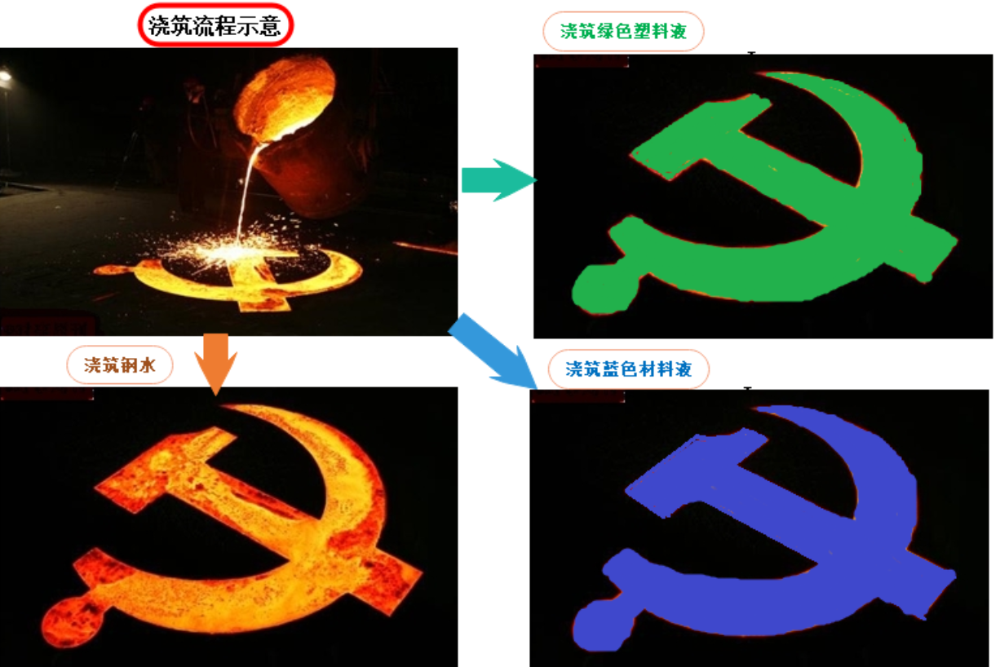
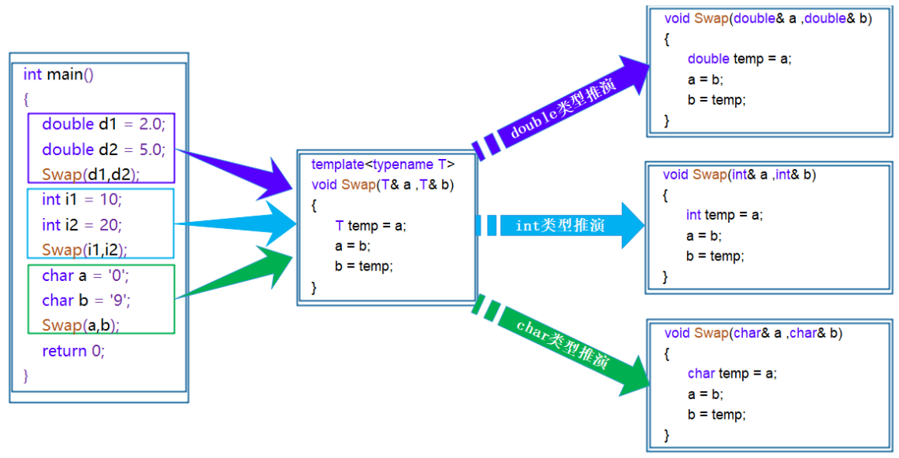
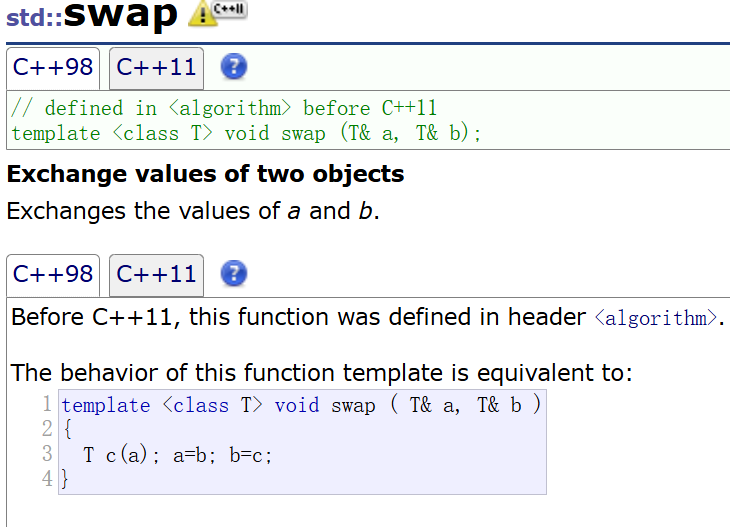
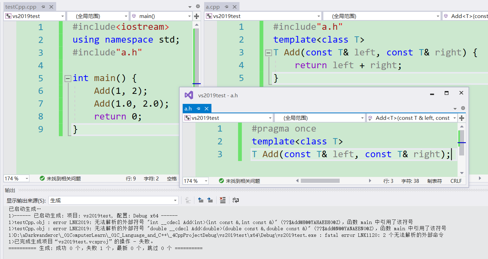
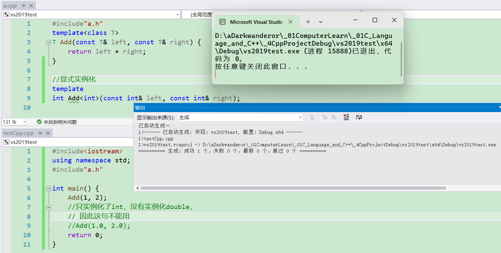
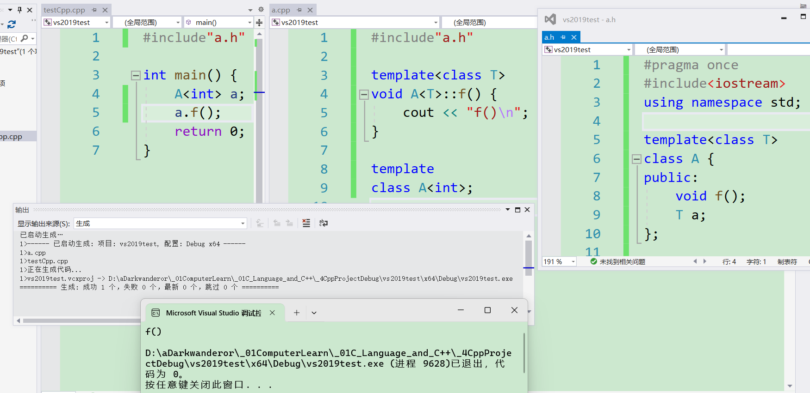

# 泛型编程

如何实现一个通用的交换函数呢？

```cpp
void Swap(int& left, int& right) {
    int temp = left;
    left = right;
    right = temp;
}
void Swap(double& left, double& right) {
    double temp = left;
    left = right;
    right = temp;
}
void Swap(char& left, char& right) {
    char temp = left;
    left = right;
    right = temp;
}
```

使用函数重载虽然可以实现，但是有一下几个不好的地方：

1. 重载的函数仅仅是类型不同，代码复用率比较低，只要有新类型出现时，就需要用户自己增加对应的函数。

2. 代码的可维护性比较低，一个出错可能所有的重载均出错。

如果在c++中，也能够存在这样一个模具，通过给这个模具中填充不同材料(类型)，来获得不同材料的铸件(即生成具体类型的代码），那将会节省许多头发。



泛型编程：编写与类型无关的通用代码，是代码复用的一种手段。模板是泛型编程的基础。

# 函数模板

函数模板代表了一个函数家族，该函数模板与类型无关，在使用时被参数化，根据实参类型产生函数的特定类型版本。

## 函数模板和模板函数

函数模板格式：

```cpp
//格式1
template<typename T1, typename T2,......,typename Tn>
返回值类型 函数名(参数列表){
    //...
}

//格式2
template<class T1, class T2,......,class Tn>
返回值类型 函数名(参数列表){
    //...
}
```

`template`是c++新增的关键字，作为英文单词翻译为模板。`T`是type，类型的意思，但其实这个`T`可以换成别的，规则和变量名一致。

`typename`也是c++新增的关键字，能一眼看出来直译为类型名。`typename`和`class`作为模板参数时可以混用。

上传不同的模板参数，实例化的模板函数属于不同的函数。

例如，通用的交换函数可以这么写：

```cpp
template<typename T>
void Swap(T& left, T& right) {
    T temp = left;
    left = right;
    right = temp;
}
```

`typename`是用来定义模板参数关键字，也可以使用`class`（但不能使用`struct`代替`class`）。

`typename`表示类型，`class`表示类。

这里的**函数模板**指的是**生成函数用的模板**，**模板函数**是**通过函数模板生成的具体函数**。

## 函数模板的原理

函数模板是一个**蓝图**，它本身并不是函数，是编译器用使用方式**产生特定具体类型函数的模具**。

所以其实模板就是将本来应该我们做的重复的事情（比如同一个函数，只是形参和返回类型不同，就需要拷贝若干份一起构成重载）交给了编译器。



在编译器编译阶段，对于模板函数的使用，编译器需要**根据传入的实参类型来推演**生成对应类型的函数以供调用。

比如：当用`double`类型使用函数模板时，编译器通过对实参类型的推演，将`T`确定为`double`类型，然后产生一份专门处理`double`类型的代码，对于字符类型也是如此。

同一个函数模板推演出的不同类型的函数不是同一个，因为某个变量的类型不同。

## 函数模板的隐式、显式实例化

用不同类型的参数使用函数模板时，称为函数模板的实例化。模板参数实例化分为：隐式实例化和显式实例化。

**隐式实例化**：让**编译器根据实参推演模板参数的实际类型**。

```cpp
template<class T>
T Add(const T& left, const T& right) {
    return left + right;
}
int main() {
    int a1 = 10, a2 = 20;
    double d1 = 10.0, d2 = 20.0;
    Add(a1, a2);
    Add(d1, d2);
    //Add(a1, d1);//这一句不能通过编译
    Add(a, (int)d);
    return 0;
}
```

`Add(a1, a2);`和`Add(d1, d2);`调用的函数不一样，因为`T`被解释的类型不一样。

`Add(a1, d1);`不能通过编译，因为在编译期间，当编译器看到该实例化时，需要推演其实参类型。通过实参`a1`将`T`推演为`int`，通过实参`d1`将`T`推演为`double`类型，但模板参数列表中只有一个`T`，编译器无法确定此处到底该将`T`确定为`int` 或者 `double`类型而报错。

在模板中，编译器一般不会进行类型转换操作。

所以此时有两种处理方式：

1. 用户自己来强制转化 。即`Add(a, (int)d);`。
2. 使用显式实例化。

**显式实例化**：在函数名后的`<>`中指定模板参数的实际类型。

```cpp
template<class T>
T Add(const T& left, const T& right) {
    return left + right;
}

int main(void) {
    int a = 10;
    double b = 20.0;
 
    // 显式实例化
    Add<int>(a, b);
    return 0;
}
```

如果类型不匹配，编译器会尝试进行隐式类型转换，如果无法转换成功编译器将会报错。

有了模板，c++便可以提供一个通用的`swap`函数。



而且有的场景只能用显式实例化：

```cpp
template<class T>
T* f(int n) {
    return new T[n];
}
int main() {
    int* p = f<int>(10);//这种情况
    delete[]p;
    return 0;
}
```


## 模板参数的匹配原则

1. 一个**非模板函数**可以和一个**同名的函数模板同时存在**，而且该**函数模板**还**可以被实例化为这个非模板函数**。如果实参和非模板函数的类型列表高度匹配，会优先调用非模板函数，找不到重合的再根据模板生成一个更符合的。

```cpp
#include<iostream>
using namespace std;

// 专门处理int的加法函数
int Add(int left, int right/*, double x = 1.0*/) {//只要前几个形参匹配
	cout << "int Add(int left, int right)" << endl;
	return left + right;
}

// 通用加法函数
template<class T>
T Add(T left, T right) {
    cout << "T Add(T left, T right)" << endl;
    return left + right;
}

int main() {
    Add(1, 2); //与非模板函数匹配，编译器不需要特化，这里会调用现有的
    Add<int>(1, 2); // 调用编译器特化的Add版本
    return 0;
}
```

2. 对于非模板函数和同名函数模板，如果其他**条件都相同**，在调动时会**优先调用非模板函数而不会从该模板产生出一个实例**。如果**模板可以产生一个具有更好匹配的函数， 那么将选择模板**。

```cpp
#include<iostream>
using namespace std;

// 专门处理int的加法函数
int Add(int left, int right/*, double x = 1.0*/) {
	cout << "int Add(int left, int right)" << endl;
	return left + right;
}

template<class T1,class T2>
T1 Add(T1 left, T2 right) {
	cout << "T Add(T left, T right)" << endl;
	return left + right;
}

int main() {
	Add(1, 2); //与非模板函数匹配，编译器不需要特化，这里会调用现有的
	Add(1, 2.0); // 调用编译器特化的Add版本
	return 0;
}
```

3. 模板函数不允许自动类型转换，但普通函数可以进行自动类型转换。

例如这个案例。

```cpp
#include<iostream>
using namespace std;

void f1(double x) {
    cout << sizeof(x) << endl;
}

template<class T>
void f2(T x) {
    cout << sizeof(x) << endl;
}

template<class T>
void f3(T a,T b){}

int main() {
    f1(3);//int通过自动(隐式)类型转换变成double
    f2('4');//函数模板隐式实例化成char型
    f2(5.0);//函数模板隐式实例化成double型
    f2<double>('a');
    f3(3, 4);
    //f3(3.0, 13);//不允许自动类型转换
    return 0;
}
```

普通函数：参数传递时支持隐式类型转换（如 `int`$\rightarrow$`double`）。例如`f1`中将`int`型的4转换成了`double`型，这个过程编译器进行了处理，相当于是自动。

模板函数：当调用一个模板函数时，编译器会严格匹配实参类型与模板参数类型，不会自动转换类型（除非显式指定或使用强制类型转换）。

例如`f2('4');`和`f2(5.0);`的两次调用，推导出来的模板函数的类型和实参的类型严格匹配，而`f2<double>('a');`因为显式实例化，所以`char`型被强制转换成`int`型，即发生了自动转换的行为。

若模板函数允许自动类型转换，则`f3(3.0, 13);`也会被允许，现实是编译器都不允许。

# 类模板

格式：

```cpp
template<class T1, class T2, ..., class Tn>
class 类模板名 {
    // 类内成员定义
};

template<typename T1, typename T2, ..., typename Tn>
class 类模板名 {
    // 类内成员定义
};
```

和函数模板一样，上传不同的模板参数，实例化的模板类属于不同的类。

例如，动态顺序表：

```cpp
// 动态顺序表
// 注意：Vector不是具体的类，是编译器根据被实例化的类型生成具体类的模具
template<class T>
class Vector { 
public :
    Vector(size_t capacity = 10)
    : _pData(new T[capacity])
    , _size(0)
    , _capacity(capacity){}

    // 使用析构函数演示：在类中声明，在类外定义。
    ~Vector();
 
    void PushBack(const T& data);
    void PopBack();
    // ...
    size_t Size() {return _size;}

    T& operator[](size_t pos) {
        assert(pos < _size);
        return _pData[pos];
    }

private:
    T* _pData;
    size_t _size;
    size_t _capacity;
};
// 注意：类模板中函数放在类外进行定义时，需要加模板参数列表
template <class T>
Vector<T>::~Vector() {
    if(_pData)
        delete[] _pData;
    _size = _capacity = 0;
}
```

## 类模板的实例化

类模板实例化需要且必须在类模板名字后跟`<>`，然后将实例化的类型放在`<>`中即可，类模板名字不是真正的类，而实例化的结果才是真正的类。

`<>`内的类型不同，实例化的类不同。例如`Vector<int>`和`Vector<double>`是两个不同的类。

`Vector`是类名，`Vector<int>`才是类型（类名加模板参数）。

类模板中函数放在类外进行定义时，需要加模板参数列表。而且**模板的作用范围**是`template`的**下一个类或函数**。

例如：

```cpp
#include<iostream>
using namespace std;

template<typename T>
class A {
public:
	A(T _a = T());
	void f(T);
	T a;
};

template<typename T>
A<T>::A(T _a)
:a(_a){}

//在这种场景下class和typename等价，但
//最好还是保持一致
template<class T>
void A<T>::f(T a) {
	cout << "f(T)\n";
}

int main() {
	A<int>().f(6);
	return 0;
}
```


若是成员函数在类中实现，返回类型可以不用加类型。例如：

```cpp
#include<iostream>
using namespace std;

template<class T>
class Vector {
public:
    //省略若干功能...
    void swap(Vector<T>& a) {}

    void swap2(Vector& a) {}

    Vector substr() {}
private:
    T* _pData;
    size_t _size;
    size_t _capacity;
};

int main() {
    Vector<int>a;
    Vector<int>b;
    a.swap(b);
	return 0;
}
```

`void swap(Vector<T>&a){}`和`void swap2(Vector&a){}`都是被允许的，出于严谨考虑，最好还是用`void swap(Vector<T>&a){}`。

不仅如此，类模板内部可以用模板函数作为成员函数，但不推荐类内部的函数模板用和类一样的模板参数名，因为标准未定义这种行为，可能在不同的编译器或最新的标准出错。

```cpp
#include<iostream>
using namespace std;

template<class T>
class A {
public:
	A(int _a = int(0), T _b = T())
		:a(_a), b(_b) {}

	//template<class T>
    //不建议类模板内部的函数模板，函数模板的
    //模板参数和类模板的相同
	template<class TT>
	void f(TT a) {
		cout << "f(TT)\n";
	}
private:
	int a;
	T b;
};

int main() {
	A<int>().f(3);
	return 0;
}
```

## 模板的使用案例

这里的案例使用库里的工具`string`、`vector`、`list`，它们都是类模板。

### 用函数模板运行不同的模板类

例如，用函数模板打印不同类型的`vector`。

```cpp
#include<iostream>
#include<string>
#include<vector>
using namespace std;

template<class T>
void print(vector<T>&a) {
	auto it = a.begin();
	while (it != a.end()) {
		cout << *it << ' ';
		++it;
	}
	cout << endl;
}

int main() {
    //这里的初始化列表需要编译器支持c++11
	vector<int>a = { 0,1,2,3,4,5 };
	vector<double>b = { 1,1,4,5,1,4 };
	vector<string>c = { "aaa","bbb","ccc","ddd" };
	print(a);
	print(b);
	print(c);
	return 0;
}
```

因为函数模板使用`auto`进行自动推导，所以`it`会被编译器推导成迭代器类型。

但若将`auto`更换成函数模板的迭代器，则编译器发生错误。

```cpp
#include<iostream>
#include<string>
#include<vector>
using namespace std;

template<class T>
void print(vector<T>&a) {
	vector<T>::iterator it = a.begin();
	while (it != a.end()) {
		cout << *it << ' ';
		++it;
	}
	cout << endl;
}

int main() {
	vector<int>a = { 0,1,2,3,4,5 };
	vector<double>b = { 1,1,4,5,1,4 };
	vector<string>c = { "aaa","bbb","ccc","ddd" };
	//print(a);//出错
	//print(b);
	//print(c);
	return 0;
}
```

在函数模板`print`中，`vector<T>::iterator it = a.begin();`的`vector<T>`是未实例化的类模板。

这种情况下编译器就无法识别`vector<T>::iterator`是内嵌类型，还是静态成员变量。

这种情况下前面需要加一个`typename`告诉编译器，这里是一个类型，等`vector<T>`实例化后，再去搜索迭代器。也可以加`class`，但这是旧版本的编译器的宽容行为，不是标准规定，不保证在以后的标准中不会出错。

因此修正后的代码：

```cpp
#include<iostream>
#include<string>
#include<vector>
using namespace std;

template<class T>
void print(vector<T>& a) {
	typename vector<T>::iterator it = a.begin();
	while (it != a.end()) {
		cout << *it << ' ';
		++it;
	}
	cout << endl;
}

int main() {
	vector<int>a = { 0,1,2,3,4,5 };
	vector<double>b = { 1,1,4,5,1,4 };
	vector<string>c = { "aaa","bbb","ccc","ddd" };
	print(a);
	print(b);
	print(c);
	return 0;
}
```

不只是`vector`，其他模板函数等也会有这种情况。

### 用函数模板运行不同的STL容器

STL的容器有`vector`，`string`，`list`等，若想实现一个函数，可以实现所有容器的迭代器枚举，则需要让编译器将模板推导为对应的模板类。

```cpp
#include<iostream>
#include<string>
#include<vector>
#include<list>
using namespace std;

template<class Container>
void print(const Container& a) {
	typename Container::const_iterator it = a.begin();
	while (it != a.end()) {
		cout << *it << ' ';
		++it;
	}
	cout << endl;
}

int main() {
	vector<int>a = { 0,1,2,3,4,5 };
	list<double>b = { 1,1,4,5,1,4 };
	vector<string>c = { "aaa","bbb","ccc","ddd" };
	print(a);
	print(b);
	print(c);
	return 0;
}
```

# 模板的缺省参数

模板参数是可以上传缺省值的。比如STL中容器适配器，`stack`的类模板可以塞`list`和`deque`：

```cpp
#include<iostream>
#include<deque>
using namespace std;

//模板参数的缺省值
template<class T,class Container=deque<T> >
class Stack {//简易栈
public:
    void push(const T& x) {
        q.push_back(x);
    }
    void pop() {
        q.pop_back();
    }
    T top() {
        return q.back();
    }
    size_t size() {
        return q.size();
    }
private:
    Container q;
};

int main() {
    Stack<int>sk;//第2个模板参数默认为deque
    sk.push(1);
    sk.push(2);
    sk.push(3);
    sk.push(4);
    sk.push(5);
    while (sk.size()) {
        cout << sk.top() << ' ';
        sk.pop();
    }
    return 0;
}
```

但即使是全缺省，依旧要给至少1个模板参数，还只能给从左到右数的第1个模板参数。

```cpp
#include<iostream>
#include<deque>
using namespace std;

//模板参数的缺省值
template<class T = int, class Container = deque<T> >
class Stack {//简易栈
public:
    void push(const T& x) {
        q.push_back(x);
    }
    void pop() {
        q.pop_back();
    }
    T top() {
        return q.back();
    }
    size_t size() {
        return q.size();
    }
private:
    Container q;
};

int main() {
    Stack<int>sk;
    return 0;
}
```


# 非类型模板参数

模板参数分**类型形参**与**非类型形参**。

类型形参：出现在模板参数列表中，跟在`class`或者`typename`之类的参数类型名称。

非类型形参：用一个**整型常量**比如`int`、`char`和`size_t`等作为类（函数）模板的一个参数，在类（函数）模板中可将该参数当成常量来使用。

但需要注意：

* 浮点数、类对象以及字符串是不允许作为非类型模板参数的。据说在c++20可以使用浮点数。

* 非类型的模板参数必须在编译期就能确认结果（即编译期间的常量）。

例如定义一个静态数组（`N`在类模板中被当成常数使用）：

```cpp
#include<iostream>
using namespace std;

// 定义一个模板类型的静态数组
// N是常数，这里给了缺省值
template<class T, size_t N = 10>
class Array
{
public:
    T& operator[](size_t index) {
        return _array[index];
    }

    const T& operator[](size_t index)const {
        return _array[index];
    }
private:
    T _array[N];
};

int main() {
    Array<int> a;
    for (int i = 0; i < 10; i++)
        a[i] = i;
    for (int i = 0; i < 10; i++)
        cout << a[i] << ' ';
    return 0;
}
```

`N`可以不给缺省值，这样做的话需要使用时上传。

```cpp
#include<iostream>
using namespace std;

// 定义一个模板类型的静态数组
// N是常数
template<class T, size_t N>
class Array {
public:
    T& operator[](size_t index) {
        return _array[index];}
    const T& operator[](size_t index)const {
        return _array[index]; }
private:
    T _array[N];
};

int main() {
    //类模板没有给N的缺省值，这里就需要给
    Array<int, 10> a;
    for (int i = 0; i < 10; i++)
        a[i] = i;
    for (int i = 0; i < 10; i++)
        cout << a[i] << ' ';
    return 0;
}
```

STL里的容器`array`，就有使用非类型模板参数。这个容器就是静态数组，但不会做越界检查（部分编译器会检查，例如vs2022的语法编译强制识别），因为`array[]`的本质是函数调用，而静态数组则是指针解引用。

```cpp
template < class T, size_t N >
    class array;
```

c++11的初衷是希望程序员用`array`去替代静态数组，但奈何不是所有的程序员愿意与时俱进，而且还有更好用的`vector`。因此`array`的设计非常鸡肋。当然不止这个容器，也有其他工具。

非类型模板参数也有应用：`bitset`位图。

```cpp
template <size_t N>
class bitset;
```

位图有机会再谈。

# 模板的特化

模板特化：针对某些类型进行特殊化处理。

使用模板可以实现一些与类型无关的代码，但对于一些特殊类型的可能会得到一些错误的结果，需要特殊处理。

比如：实现了一个专门用来进行小于比较的函数模板。

```cpp
#include<iostream>
using namespace std;

// 函数模板 -- 参数匹配
template<class T>
bool Less(T left, T right) {
    return left < right;
}

class Date {
public:
    Date(int _y=1900, int _m=1, int _d=1)
        :y(_y) ,m(_m) ,d(_d){}
    bool operator<(const Date& b) {
        const Date& a = *this;
        if (a.y < b.y) return 1;
        if (a.y == b.y && a.m < b.m) return 1;
        if (a.y == b.y && a.m == b.m && a.d < b.d)
            return 1;
        return 0;
    }
private:
    int y; int m; int d;
};
int main() {
    cout << Less(1, 2) << endl; // 可以比较，结果正确
    Date d1(2022, 7, 7);
    Date d2(2022, 7, 6);
    cout << Less(d1, d2) << endl; // 可以比较，结果正确
    Date* p1 = &d1;
    Date* p2 = &d2;
    cout << Less(p1, p2) << endl; // 可以比较，但结果随机
    return 0;
}
```

可以看到，Less绝对多数情况下都可以正常比较，但是在特殊场景下就得到错误的结果（比如指针）。

上述示例中，`p1`指向的`d1`显然小于`p2`指向的`d2`对象，但是`Less`内部并没有比较`p1`和`p2`指向的对象内容，而比较的是`p1`和`p2`指针的地址，这就无法达到预期而错误。

此时，就需要对模板进行特化。即：在原模板类的基础上，针对特殊类型所进行特殊化的实现方式。模板特化中分为**函数模板特化**与**类模板特化**。


## 函数模板的特化

函数模板的特化步骤：

1. 必须要**先有一个基础的函数模板**。否则一切特化都没有意义。

2. 关键字`template`后面接一对空的尖括号`<>`。

3. 函数名后跟一对尖括号，尖括号中**指定需要特化的类型**。

4. 函数形参表: 必须要**和模板函数的基础参数类型完全相同**，如果不同，编译器可能会报一些奇怪的错误。

> 即让编译器推演特殊特殊类型时，让编译器给程序员开个后门。
>
> 模板特化和函数重载很像，但不能归为一谈。

例如，上个例子可以给出`Less`针对指针的特化版本：

```cpp
//Less函数模板不能少，这里省略不代表实战时可以省略

// 对Less函数模板进行特化
template<>
bool Less<Date*>(Date* left, Date* right) {
    return *left < *right;
}
```

特化版本可以与原模板除了函数名外，内部实现可以完全不同。

```cpp
#include<iostream>
using namespace std;

class Date {
public:
    Date(int _y = 1900, int _m = 1, int _d = 1)
        :y(_y) , m(_m) , d(_d) {}
    bool operator<(const Date& b) {
        const Date& a = *this;
        if (a.y < b.y) return 1;
        if (a.y == b.y && a.m < b.m) return 1;
        if (a.y == b.y && a.m == b.m && a.d < b.d)
            return 1;
        return 0;
    }
private:
    int y; int m; int d;
};

// 函数模板 -- 参数匹配
template<class T>
bool Less(T left, T right) {
    return left < right;
}

// 对Less函数模板进行特化
template<>
bool Less<Date*>(Date* left, Date* right) {
    return *left < *right;
}

int main() {
    cout << Less(1, 2) << endl; // 可以比较，结果正确
    Date d1(2022, 7, 7);
    Date d2(2022, 7, 6);
    cout << Less(d1, d2) << endl; // 可以比较，结果正确
    Date* p1 = &d1;
    Date* p2 = &d2;
    cout << Less(p1, p2) << endl; // 可以比较，但结果随机
    return 0;
}
```

一般情况下如果函数模板遇到不能处理或者处理有误的类型，为了实现简单通常都是将该函数直接给出，即让函数与模板函数构成重载。

```cpp
#include<iostream>
using namespace std;

class Date {
public:
    Date(int _y = 1900, int _m = 1, int _d = 1)
        :y(_y) , m(_m) , d(_d) {}
    bool operator<(const Date& b) {
        const Date& a = *this;
        if (a.y < b.y)
            return 1;
        if (a.y == b.y && a.m < b.m)
            return 1;
        if (a.y == b.y && a.m == b.m && a.d < b.d)
            return 1;
        return 0;
    }
private:
    int y; int m; int d;
};

// 函数模板 -- 参数匹配
template<class T>
bool Less(T left, T right) {
    return left < right;
}

// 不做特化，而是让模板函数和这个函数构成重载
bool Less(Date* left, Date* right) {
    return *left < *right;
}

int main() {
    cout << Less(1, 2) << endl; // 可以比较，结果正确
    Date d1(2022, 7, 7);
    Date d2(2022, 7, 6);
    cout << Less(d1, d2) << endl; // 可以比较，结果正确
    Date* p1 = &d1, * p2 = &d2;
    cout << Less(p1, p2) << endl; // 可以比较，但结果随机
    return 0;
}
```

重载实现简单明了，代码的可读性高，容易书写，因为对于一些参数类型复杂的函数模板，特化时特别给出，因此函数模板不建议特化。


## 类模板的全特化

全特化即是将模板参数列表中所有的参数都确定化。

```cpp
#include<iostream>
using namespace std;

template<class T1, class T2>
class Data {
public:
    Data() { cout << "Data<T1, T2>" << endl; }
};

//全特化
template<>
class Data<int, char> {
public:
    Data() { cout << "Data<int, char>" << endl; }
};

int main() {
    Data<int, int> d1;
    Data<int, char> d2;
    return 0;
}
```


## 类模板的偏特化

偏特化：任何针对模版参数进一步进行条件限制设计的特化版本。比如对于以下模板类：

```cpp
template<class T1, class T2>
class Data {
public:
    Data() { cout << "Data<T1, T2>" << endl; }
};
```

偏特化有以下两种表现方式：

### 部分特化

将模板参数类表中的一部分参数特化。

```cpp
#include<iostream>
using namespace std;

template<class T1, class T2>
class Data {
public:
    Data() { cout << "Data<T1, T2>" << endl; }
};

// 将第二个参数特化为int
template <class T1>
class Data<T1, int> {
public:
    Data() { cout << "Data<T1, int>" << endl; }
};

int main() {
    Data<double,int> a;
    return 0;
}
```

模板特化可以这样比喻：没有用特化的是生米，用了特化的有熟米、粥、盖饭等。

### 参数更进一步的限制

偏特化并不仅仅是指特化部分参数，而是针对模板参数更**进一步的条件限制**所设计出来的一个特化版本。

```cpp
#include<iostream>
using namespace std;

template<class T1, class T2>
class Data {
public:
    Data() { cout << "Data<T1, T2>" << endl; }
private:
    T1 _d1; T2 _d2;
};

//两个参数偏特化为指针类型
template <typename T1, typename T2>
class Data <T1*, T2*> {
public:
    Data() { cout << "Data<T1*, T2*>" << endl; }
private:
    T1 _d1; T2 _d2;
};
//两个参数偏特化为引用类型
template <typename T1, typename T2>
class Data <T1&, T2&> {
public:
    Data(const T1& d1, const T2& d2)
        : _d1(d1) , _d2(d2) {
        cout << "Data<T1&, T2&>" << endl; } 
private:
    const T1& _d1; const T2& _d2;
};

int main() {
    Data<double, int> d1; // 调用特化的int版本
    Data<int, double> d2; // 调用基础的模板 
    Data<int*, int*> d3; // 调用特化的指针版本
    Data<int&, int&> d4(1, 2); // 调用特化的指针版本
    return 0;
}
```

## 给部分模版参数的模板函数

经过特化的模板函数可以与函数模板在**实现上不同**，但返回值、形参数要保持一致。

样例1：

```cpp
#include<iostream>
using namespace std;

template<class T>
void f(T a, T b) {
    cout << "bool f(T a, T b){}\n";
}

template<>
void f(bool a, bool b) {
    int x = 0; int y = 0;
    double z = 0;
    cout << x << ' ' << y << ' ' << z << '\n';
    cout << "bool f(bool a, bool b){}\n";
}

////这三种情况都不是f的特化模板函数
////将注释解开会出错
////形参列表的类型不同
//template<>
//void f(double a, int b) {}
//
////返回值不同
//template<>
//int f(double a, double b) {}
////形参数不同
//template<>
//void f(int a,int b,int c){}

int main() {
    f<int>(1,2);
    f<bool>(true, true);
    return 0;
}
```

这三种情况都不是`f`的特化模板函数。

```cpp
//形参列表的类型不同
template<>
void f(double a, int b) {}

//返回值不同
template<>
int f(double a, double b) {}
//形参数不同
template<>
void f(int a,int b,int c){}
```

样例2：函数模板有2个模板参数。

这2种情况都不是`f`的特化模板函数：

* 返回值不同

```cpp
template<>
int f(double a, double b) {}
```
* 形参数不同

```cpp
template<>
void f(int a,int b,int c){}
```

这个样例特化了`<int,bool>`和`<double,int>`两个模板函数。

```cpp
#include<iostream>
using namespace std;

template<class T1,class T2>
void f(T1 a, T2 b) {
    cout << "bool f(T a, T b){}\n";
}

template<>
void f(int a, bool b) {
    int x = 0; int y = 0;
    double z = 0;
    cout << x << ' ' << y << ' ' << z << '\n';
    cout << "bool f(int a, bool b){}\n";
}

//形参列表的类型不同
template<>
void f(double a, int b) {
    cout << "bool f(double a, int b){}\n";
}

void f1() {
    f<bool>(true, true);//只显式实例化模板参数T1
    cout << endl;
}

void f2() {
    f<bool, int>(true, 0);
    cout << endl;

    f<int, bool>(true, 0);
    cout << endl;
}

void f3() {
    f<int>(1, true);
    cout << endl;

}

void f4() {
    //
    f<int>(1.0, 1);
    cout << endl;
}

int main() {
    //f1();
    //f2();
    //f3();
    f4();
    return 0;
}
```

`f<bool>(true, true);`只给了第1个模板参数，第2个模板参数靠编译器推演，推演成了`<bool,bool>`，于是实例化了新的函数模板，`f1`输出`bool f(T a, T b){}`。

`f<bool, int>(true, 0)`和`f<int, bool>(true, 0)`两种实例化方式调用的函数不同。说明特化的参数按照**从左到右的顺序推演**，`f2`输出：

```
bool f(T a, T b){}

0 0 0
bool f(int a, bool b){}

```

`f<int>(1, true)`给第1个模板参数但不给第2个，通过实参推演知道要调用的是`f(int,bool)`。`f3`输出：

```cpp
0 0 0
bool f(int a, bool b){}
```

`f<int>(1.0, 1)`给第1个模板参数但不给第2个，即使第1个形参是`double`行，编译器也不会考虑`f(double,int)`而是重新推演一个。因此`f4`输出：`bool f(T a, T b){}`。

## 函数模板的偏特化

函数模板没有偏特化这个概念，上面两个案例都是建立在全特化的情况下，给一部分模板参数，另一部分靠推演。

没有但不代表不能用，方法有很多，比如用类封装函数，通过类模板的偏特化，来间接实现函数的偏特化。

```cpp
#include<iostream>
using namespace std;

// 类模板（支持偏特化）
template <class T, class U>
struct A {
    static void f(T a, U b) {
        cout << "f(T a,U b)\n";
    }
};

// 类模板的偏特化
template <typename U>
struct A<int, U> {
    static void f(int a, U b) {
        cout << "f(T a,U b)\n";
    }
};

int main() {
    A<int, double>().f(13,3.0);
    return 0;
}
```

类模板推荐用特化，但函数模板不推荐用，函数模板用重载来匹配即可，没有必要强求特化。函数重载和实例化的函数模板能构成重载。

## 形参为const引用实参为指针的情况

形参有时是自定义，有时是内置类型，可能会带来很多不必要的拷贝，于是形参会出现引用加`const`的情况。例如`Less`函数：

```cpp
template<class T>
bool Less(const T& left, const T& right) {
    return left < right;
}
```

但若`T`被推演成指针类型时会出现问题。

```cpp
template<>
bool Less(const Date*& left, const Date*& right) {
    return left < right;
}
```

指针也能取别名，但这种`const A* & p`，`const`修饰的是`A*`，原本是想`cosnt`修饰引用。

想特化指针，需要将`const`放在`*`后才可以。

```cpp
#include<iostream>
using namespace std;

class Date {
public:
    Date(int _y = 1900, int _m = 1, int _d = 1)
        :y(_y) , m(_m) , d(_d) {}
    bool operator<(const Date& b) {
        const Date& a = *this;
        if (a.y < b.y) return 1;
        if (a.y == b.y && a.m < b.m) return 1;
        if (a.y == b.y && a.m == b.m && a.d < b.d)
            return 1;
        return 0;
    }
private:
    int y; int m; int d;
};

template<class T>
bool Less(const T& left, const T& right) {
    return left < right;
}

template<>
bool Less(Date* const& left,  Date* const& right) {
    return *left < *right;
}

int main() {
    Date d1(2025, 6, 8);
    Date d2(2025, 5, 10);
    cout << Less(&d1, &d2);
    return 0;
}
```


# 模板分离编译

c++的编译原理和c语言的是一样的。

一个程序（项目）由若干个源文件（拓展名为.c 或 .cpp）共同实现，而每个源文件单独编译生成目标文件（.obj ），最后将所有目标文件链接起来形成单一的可执行文件（.exe）的过程称为分离编译模式。

## 模板分离编译场景

假如有以下场景，模板的声明与定义分离开，在头文件中进行声明，源文件中完成定义：

```cpp
// a.h
#pragma once
template<class T>
T Add(const T& left, const T& right);

// a.cpp
#include"a.h"
template<class T>
T Add(const T& left, const T& right) {
    return left + right;
}
// testCpp.cpp
#include<iostream>
using namespace std;
#include"a.h"

int main() {
    Add(1, 2);
    Add(1.0, 2.0);
    return 0;
}
```

将两个 cpp 加入编译会报链接错误。



`Add`函数会随着`a.h`的展开，变成类似的代码：

```cpp
template<class T>
T Add(const T& left, const T& right);

int main() {
    Add(1, 2);
    Add(1.0, 2.0);
    return 0;
}
```

即有函数声明，但没有定义却有调用，函数模板编译器不知道如何确定`T`，因此无法生成函数模板的汇编代码。这个过程发生在链接上，即函数调用转化的汇编语句`call f...`会去找函数的地址。

或者说`Add`函数模板没有实例化，在最后的链接时没有`Add`函数的地址。

解决方法：

1. 将声明和定义放到一个文件 "xxx.hpp" 里面或者 "xxx.h" 前者表示这个文本文件中可能有模板，后者表示有各种类和函数的声明，再通过`#include`展开。也就是这里能运行的代码中的各种模板的指定模板参数和实现紧贴在一起的形式，推荐使用这种。

2. 模板定义的位置显式实例化。这种方法不实用，遇到别的类型又无法实例化，不推荐使用。

函数模板显式实例化的情况：



类模板显式实例化的情况：



[【分离编译扩展阅读】 ](http://blog.csdn.net/pongba/article/details/19130)

## 编译过程思考

c++的编译过程是将所有的 .cpp 文件都分别编译成汇编代码，那就有人有这样一个疑问：为什么设计c++的老爷子为啥不在编译阶段就去找找哪里使用了这个模板，找到后再实例化呢？

从后人的视角猜测：不是不想，而是这样做会增加编译的时间。而且一个c++项目的代码不止一个，可能有几十个、上百个 .cpp 文件，每个文件的代码长度都在几十行、几百行，在如此大的代码量中寻找被使用的模板函数本身就不现实。

这种几十个、几百个甚至上千个 .cpp 的编译成一个可执行程序可能要几个小时甚至几天，因此c++的每一个设计都是经过考虑的。

除了模板的缺陷，还有将普通函数、普通类的声明放在上方，应用放在下方，编译时从上往下找，以及命名空间也是从上往下找函数的实现，这些都是出于效率考虑。


# 模板总结

【优点】

1. 模板复用了代码，节省资源，更快的迭代开发，c++的标准模板库(STL)因此而产生。

2. 增强了代码的灵活性。

【缺陷】

1. 模板会导致代码膨胀问题，也会导致编译时间变长（为了实例化）。

2. 出现模板编译错误时，错误信息非常凌乱（一旦错误，提示信息一大堆，而且报错的位置不一定是原代码中报错的那一行），不易定位错误。

模板的应用在STL中的应用有很多，STL的六大组件都有模板的使用技巧。学习模板的使用还得学习STL，特别是部分工具的模拟实现。
