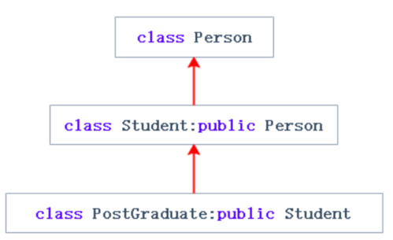

# 继承的概念

**继承**（inheritance）机制是面向对象程序设计**使代码可以复用**的最重要的手段，它允许程序员在**保持原有类特性的基础上进行扩展**，增加功能。

> 继承**呈现了面向对象程序设计的层次结构**，体现了由简单到复杂的认知过程。常见的代码复用是函数复用，**继承是类设计层次的复用**。

格式：比如这个代码`Person`是父类，也称作**基类**。`Student`是子类，也称作**派生类**。


例如下面的代码，继承后父类的`Person`的成员（成员函数+成员变量）都会拷贝一份给子类。

```cpp
#include<iostream>
using namespace std;

//父类
class Person {
public:
	void Print() {
		cout << "name:" << _name << endl;
		cout << "age:" << _age << endl;
	}
protected:
	string _name = "peter";// 姓名
	int _age = 18;//年龄
};

//子类学生
class Student : public Person {
protected:
	int _stuid=114514; // 学号
};

//子类老师
class Teacher : public Person{
protected:
	int _jobid=271828; // 工号
};

int main(){ 
	Student s;Teacher t;
	s.Print();
    t.Print();
	return 0;
}
```

在这个例子里，有两个类：学生，老师。

发现2个类有很多共同的信息：
学生有名字、学号、年龄、班级和专业信息，
老师有名字、学号、年龄、工号、学院、课程。

于是将公共部分提取出来写成另一个类：人类。让学生类和老师类继承人类的特性。

此时人类就是**父类或基类**，老师类和学生类相对于人类就是**子类或派生类**。

其他有这种关系的**继承其他类的成员的类**和**自身成员被其他类所继承的类**都能用这个称呼，前者是子类，后者是父类，父子比基类子类能更形象地体现两个类的关系，后文也是直接称父类和子类，正式场合再用基类和派生类。

使用监视窗口查看`Student`和`Teacher`对象，可以看到变量的复用。调用`Print`可以看到成员函数的复用。


> 因此继承的本质是一种复用，就像函数调用另一个函数的复用。

但继承并不代表函数也拷贝一份，而是子类可以根据继承方式来调用父类的函数。


# 继承的方式

继承方式有3种：`public`（公有）继承、`protected`（保护）继承和`private`（私有）继承。

对应的成员有三种访问权限：`public`公有、`protected`（保护）和`private`（私有）。

继承关系和访问限定符的关系：

<!DOCTYPE html>
<html>
<head>
    <title>类成员继承方式表格</title>
    <style>
        table {
            border-collapse: collapse;
            width: 80%;
            margin: 20px auto;
        }
        th, td {
            border: 1px solid black;
            padding: 8px;
            text-align: center;
        }
        th {
            background-color: #f2f2f2;
        }
    </style>
</head>
<body>
    <table>
        <tr>
            <th>类成员/继承方式</th>
            <th>public继承</th>
            <th>protected继承</th>
            <th>private继承</th>
        </tr>
        <tr>
            <td>基类的public成员</td>
            <td>是派生类的public成员</td>
            <td>是派生类的protected成员</td>
            <td>是派生类的private成员</td>
        </tr>
        <tr>
            <td>基类的protected成员</td>
            <td>是派生类的protected成员</td>
            <td>是派生类的protected成员</td>
            <td>是派生类的private成员</td>
        </tr>
        <tr>
            <td>基类的private成员</td>
            <td>在派生类中不可见</td>
            <td>在派生类中不可见</td>
            <td>在派生类中不可见</td>
        </tr>
    </table>
</body>
</html>

这张表不用记，可以直接看总结，用的最多的是前3条。


总结：

1. 无论以什么方式继承，父类的`private`成员即**私有成员在子类中不可见**。这里的不可见是指父类的私有成员还是被继承到了子类对象中，但是**语法上限制**子类对象不管在类里面还是类外面都不能去访问它。

2. 父类的`private`成员即**私有成员在子类中是不能被访问**，如果父类成员**不想在类外直接被访问**，但**需要在子类中能访问**，就定义为`protected`。
   可以看出保护成员限定符是因继承才出现的。

3. 父类的其他成员在子类的访问方式 $= \min($成员在父类的访问限定符，继承方式$)$，
   `public`$>$ `protected `$>$ `private`。
   通过这种方式去推导父类成员是否能使用即可。

4. **不写继承方式**时，使用关键字`class`时默认的继承方式是`private`，使用`struct`时默认的继承方式是`public`，推荐写出继承方式。

5. 在实际运用中一般使用都是`public`继承，几乎很少使用`protetced`和`private`继承，也不提倡使用`protetced`和`private`继承，因为`protetced`和`private`继承下来的成员都只能在子类的类里面使用，实际中扩展维护性不强。


简单体验类的继承和访问限定符的关系：

```cpp
#include<iostream>
using namespace std;

class C {
public:
	void f1() {
		cout << "public\n";
	}
protected:
	void f2() {
		cout << "protected\n";
	}
private:
	void f3() {
		cout << "private\n";
	}
};

void func1() {
	class A :public C {//公有继承
	public:
		void f2() {
			cout << "In class A, A::f2(), C::f2():";
			C::f2();
		}
		void f3() {
			//C::f3();//不可访问
			cout << "Can't visited.\n";
		}
	};
	A a;
	a.f1();
	a.f2();//可以在类内部的函数访问继承的protected
	a.f3();//任何继承都不能访问父类的private
}

void func2() {
	class A :protected C {
	public:
		void f1() {
			cout << "In class A, A::f1(), C::f1():";
			C::f1();
		}
		void f2() {
			cout << "In class A, A::f2(), C::f2():";
			C::f2();
		}
		void f3() {
			//C::f3();//不可访问
			cout << "Can't visited.\n";
		}
	};
	A a;
	a.f1();//保护继承下只能在类中访问父类的
	a.f2();//public和protected成员
	a.f3();
}

int main() {
	//func1();
	func2();
	//私有继承直接不可访问，无法演示
	return 0;
}
```

形象地表示访问关系：

$\text{A公有继承C}\begin{cases}
正常访问\text{C}的\text{public}成员。
\\
先访问\text{A}的内部函数\rightarrow 再访问\text{C}的\text{protected}函数\\
不可访问\text{C}的\text{private}\end{cases}$

$\text{B保护或私有继承C}\begin{cases}
先访问\text{B}的内部函数\rightarrow 再访问\text{C}的\text{public}或\text{protected}函数\\
不可访问\text{C}的\text{private}\end{cases}$

# 父类和子类对象赋值转换

## 隐式类型转换

隐式类型转换会产生**带常属性的临时对象**（仅限于相似类型，例如`int`和`double`都是存储数据的对象）。

```cpp
#include<iostream>
using namespace std;

int main() {
    double d = 2.2;
    int i = d;
    //int& r = d;//因访问权限放大，被编译器阻止
    const int& r = d;//引用是临时对象的别名
    return 0;
}
```

相近类型可以进行隐式类型转换，除了`int`和`double`，`int`和`int*`也是（`int*`本质是一种编号，这个编号某种意义上也是数值）。

公有（`public`）继承有的人会比喻成这样的一种关系：is - a ，即“子类是一个特殊的父类”。例如上述案例可以说成”学生是一个特殊的人“。

> 还有一种组合关系，即 has - a ，例如不用类继承，而是类中包含另一个类的对象。

其他的隐式类型转换：

```cpp
std::string st="xxxx";//调用构造函数
const std::string& st2="xxxx";//引用常属性的临时对象
```


## 子类和父类的赋值

* **子类对象**可以赋值给**父类对象**。

* **子类对象的地址**可以赋值给**父类的指针**。

* **子类对象**可以赋值给**父类的引用**。

而且中间**不产生临时对象**，这个叫做父子类（一种特殊处理）。

这里有个形象的说法叫切片或者切割。寓意**把子类中父类那部分切分出来赋值过去**。

例如这个案例：

```cpp
#include<iostream>
using namespace std;

class Person {
protected:
	string _name; // 姓名
	string _sex; // 性别
	int _age; // 年龄
};

class Student : public Person {
public:
	int _No; // 学号
};

int main() {
	Student s;
	// 1.
	Person p = s;//子类对象赋值给父类
	Person* pp = &s;//子类地址赋值给父类指针
	Person& rp = s;//父类引用作为子类对象的别名

	//2.
	//s = p;//父类对象不可复制给子类

	// 3.
	pp = &s;//子类指针赋值给父类指针

	//这种情况转换时可以，但是会存在越界访问的问题
	Student* ps1 = (Student*)pp;//父类指针需要先强制转换才能赋值
	ps1->_No = 10;

	return 0;
}

```

对第1点和第2点：

* 子类对象可以赋值给父类对象。
* 子类对象的地址可以赋值给父类的指针。
* 子类对象可以赋值给父类的引用的这个特性**仅限于子类赋值给父类**，**父类对象不能赋值给子类对象**。

对于第3点：

* **父类的指针或者引用**可以通过**强制类型转换赋值**给子类的指针或者引用。但是必须是**父类的指针是指向子类对象**时才是安全的。
  因为子类也有成员，若子类指针指向父类对象，子类指针访问自身成员时会越界访问。

> 这里父类如果是多态类型，可以使用RTTI(Run-Time Type Information)的`dynamic_cast `来进行识别后进行安全转换（c++后面的内容，关于类类型的强制转换）。
>
> 即使不是多态，也可用`dynamic_cast`进行识别并转换。
>
> ```cpp
> #include<iostream>
> using namespace std;
> 
> class A {
> public:
>     void f(){
>         cout << "A::f()\n";
>     };
> };
> class B :public A {
>     void f() {
>         cout << "B::f()\n";
>     };
> };
> 
> int main() {
>     B b;
>     //(A*)(&b)->f();//编译器会阻止这种父子类的类型转换
>     dynamic_cast<A*>(&b)->f();
>     return 0;
> }
> ```
>
> 


## 继承顺序差异

```cpp
#include<iostream>
using namespace std;

class A {
public:
	A() { _a = 1; }
	int _a;
protected:
};

class B {
public:
	B() { _b = 2; }
	int _b;
protected:
};

class C :public A, public B {
public:
	C() { _c = 3; }
	int _c;
};

class D :public B, public A {
public:
	D() { _d = 4; }
	int _d;
};

int main() {
	C c;
	cout << (long long)(&c._a) << endl;
	cout << (long long)(&c._b) << endl;
	cout << (long long)(&c._c) << endl;
	cout << endl;
	D d;
	cout << (long long)(&d._a) << endl;
	cout << (long long)(&d._b) << endl;
	cout << (long long)(&d._d) << endl;
	return 0;
}
```

输出结果之一（vs2019，指针为8byte）：

```
430454666600
430454666604
430454666608

430454666652
430454666648
430454666656
```

`C`类先继承`A`，后继承`B`，则在`C`的结构中，`A`的成员先放在`B`的成员之前，这里的测试环境是小端存储，在小端存储中表现为`A`存放在低地址。

`D`类则先继承`B`，所以继承的`B`的成员在`A`的成员之前。

## 简单体验子类和父类的指针互相赋值

根据之前的分析可知，子类对象地址和父类指针可以互相赋值，但父类指针赋值给子类指针时需要强转。

```cpp
#include<iostream>
using namespace std;

class A {
public:
	A() { _a = 1; }
	int get() { return _a; };
protected:
	int _a;
};

class B {
public:
	B() { _b = 2; }
	int get() { return _b; };
protected:
	int _b;
};

class C :public A, public B {
public:
	C() { _c = 3; }
	int get() { return _c; };
	int _c;
};

int main() {
	C c;
	A* pa = &c;//子类指针赋值给父类
	B* pb = &c;
	C* pc = &c;
	cout << (void*)(pa) << endl;
	cout << (void*)(pb) << endl;
	cout << (void*)(pc) << endl;
	cout << pa->get() << ' ';
	cout << pb->get() << ' ';
	cout << pc->get() << '\n';
	C* p = (C*)pa;//父类指针通过强转赋值给子类指针
	cout << p->get() << ' ';
	p = (C*)pb;
	cout << p->get() << ' ';
	return 0;
}
```

输出：

```
010FFB24
010FFB28
010FFB24
1 2 3
3 3
```


## 子类和父类的互相引用

将子类`C`的对象的地址取出后再赋值给两个父类的指针，父类的指针会**把子类中自己的那部分切来赋值过去**，通过**偏移量**找到，因此`pa`和`pb`实际是指向继承给`c`的那部分成员。

案例：父类引用为子类别名的情况。

```cpp
#include<iostream>
using namespace std;

class A {
public:
	A() { _a = 1; }
	int get() { return _a; };
protected:
	int _a;
};

class B {//A和B是继承关系
public:
	B() { _b = 2; }
	int get() { return _b; };
protected:
	int _b;
};

class C :public A, public B {
public:
	C() { _c = 3; }
	int get() { return _c; };
	int _c;
};

int main() {
	C c;
	A& a = c;
	B& b = c;
	cout << a.get() << ' ' << b.get();
	return 0;
}
```

输出：

```
1 2
```

说明`a`和`b`都是`c`继承的成员的引用，说明引用也遵守切片的规则。

## 总结

1. **子类对象**可以**以切片的形式赋值给父类对象**。

   * **子类对象**可以赋值给父类对象。
   * **子类对象的地址**可以赋值给父类的指针。
   * 子类对象可以赋值给父类的**引用**。

2. **父类对象不能赋值给子类对象**（不能倒反天罡）。

3. 子类的指针可以通过强制类型转换赋值给父类的指针，再将父类指针强转回子类，重新赋值给子类指针。
   因为子类能访问的空间更多。

   

4. 父类的指针强转为子类，再赋值给子类的指针，再访问子类有但父类没有的成员，会越界访问，因为父类没有的成员不会被初始化。

# 继承中的作用域

命名空间是划定了一个域，类也是划定了一个域。子类继承父类，因此相当于子类也有父类成员的同名成员。

1. 在继承体系中**父类**和**子类**都有**独立的作用域**。
2. 子类和父类中有同名成员，**子类成员将屏蔽父类对同名成员的直接访问**，这种情况叫**隐藏**，也叫**重定义**。
   在子类成员函数中，可以使用 `父类::父类成员` 显式访问。
   也就是说，默认情况下，**同名成员**由**子类对象访问**时都是**子类的成员**。
   因此类的成员分三类：
   * 内置类型成员。
   * 自定义类型成员。
   * 父类成员（这个当成一个整体）。
3. 需要注意的是如果是成员函数的隐藏，只需要**函数名相同就构成隐藏**。
4. 注意在实际中在继承体系里面最好不要定义同名的成员。

## 同名成员变量的隐藏关系案例

```cpp
#include<iostream>
using namespace std;

class Person {
protected:
	string _name = "小李子"; // 姓名
	int _num = 111; // 身份证号
};

class Student : public Person {
public:
	void Print() {
		cout << " 姓名:" << _name << endl;
		cout << " 学号:" << _num << endl;//优先访问子类的成员
		cout << " 身份证号:" << Person::_num << endl;//加上域名，编译器就知道要访问哪个
	}
protected:
	int _num = 999; // 学号
};


void f1() {
	Student s1;
	s1.Print();
};

int main() {
	f1();
	return 0;
}
```

输出：

```
 姓名:小李子
 学号:999
 身份证号:111
```

这里`Student`的`_num`和`Person`的`_num`构成隐藏关系，可以看出这样代码虽然能运行，但是非常容易混淆。

## 同名成员函数的隐藏关系案例

```cpp
#include<iostream>
using namespace std;

class A {
public:
	void fun() {
		cout << "func()" << endl;
	}
};
class B : public A {
public:
	void fun(int i) {
		A::fun();//将A::去掉，编译器只会将它识别为B的成员
		cout << "func(int i)->" << i << endl;
	}
};
int main() {
	B b;
	b.fun(10);
	b.A::fun();//只想访问父类的函数成员
	return 0;
};
```

输出：

```
func()
func(int i)->10
func()
```

`B`中的`fun`和`A`中的`fun`不是构成重载，因为**不是在同一作用域**。

但`B`中的`fun`和`A`中的`fun`构成隐藏，因为它们是继承关系，在这个关系下成员函数满足函数名相同就构成隐藏。

# 子类的默认成员函数

“默认”的意思就是指我们不给出，编译器会给我们自动生成一个。

c++的类有的默认成员函数：构造函数、析构函数、拷贝构造函数、赋值重载。


## 子类的构造函数

在子类中，这几个默认成员函数的生成：

**子类的构造函数**必须**调用父类的构造函数**初始化父类的那一部分成员。如果**父类没有**默认的构造函数，则必须在**子类构造函数的初始化列表**阶段**显示调用**（看上去像是生成匿名对象）。

例如这个案例，当父类有、无默认构造函数的情况：

```cpp
#include<iostream>
using namespace std;

//A、B对照组
class A {
public:
	A(int _a = 0)//默认构造函数
		:a(_a) {
		cout << "A()\n";
	}
	int a;
};

class B :public A {
public:
	B(int _b)
		:b(_b) {
		cout << "B()\n";
	}
	int b;
};

//C、D实验组
class C {
public:
	C(int _c)
		:c(_c) {
		cout << "C()\n";
	}
	int c;
};

class D :public C {
public:
	D(int _d = 0)
		:d(_d)
		, C(_d) {//C类无默认构造函数，不能省略显式调用
		cout << "D()\n";
	}
	int d;
};


void f1() { B b(3); cout << endl; }

void f2() { D d; }

int main() {
	f1();
	f2();
	return 0;
};
```

输出：

```cpp
A()
B()

C()
D()

```

## 子类的拷贝构造函数

**子类的拷贝构造**函数同样需要**调用父类的拷贝构造**完成父类的拷贝初始化。

```cpp
#include<iostream>
using namespace std;

class Person {
public:
	Person(const char* name = "peter")
		: _name(name) {
		cout << "Person(const char* name=\"peter\")\n";
	}

	Person(const Person& p)
		: _name(p._name) {
		cout << "Person(const Person& p)" << endl;
	}
protected:
	string _name; // 姓名
};

class Student : public Person {
public:
	Student(const char* name, int id)
		:_id(id)
		, Person(name) {}

	Student(const Student& s)
		:Person(s)
		, _id(s._id) {
		cout << "Student(const Student& s)" << endl;
	}
protected:
	int _id;
};

int main() {
	Student a("AlphaGo", 1);
	cout << endl;
	Student b(a);
	return 0;
};
```

输出：

```
Person(const char* name="peter")

Person(const Person& p)
Student(const Student& s)

```

## 子类的赋值重载

子类的`operator=`必须要调用父类的`operator=`完成父类的复制。

```cpp
#include<iostream>
using namespace std;

class Person {
public:
	Person(const char* name = "peter")
		: _name(name) {
		cout << "Person(const char* name=\"peter\")\n";
	}

	Person& operator=(const Person& p) {
		cout << "Person operator=(const Person& p)" << endl;
		if (this != &p)
			_name = p._name;
		return *this;
	}
protected:
	string _name; // 姓名
};

class Student : public Person {//Student是子类
public:
	Student(const char* name, int id)
		:_id(id)
		, Person(name) {}

	Student& operator=(const Student& s) {
		if (&s != this) {
			Person::operator=(s);
			_id = s._id;
		}
		cout << "Student& operator=(const Student& s)" << endl;
		return *this;
	}
protected:
	int _id;
};

int main() {
	Student a("AlphaGo", 1);
	Student b("aa", 2);
	b = a;
	return 0;
};
```

输出：

```cpp
Person(const char* name="peter")
Person(const char* name="peter")
Person operator=(const Person& p)
Student& operator=(const Student& s)

```

## 子类的析构函数

**子类的析构函数**会在被调用完成后自动**调用父类的析构函数**清理父类成员。因为这样才能保证子类对象**先清理子类成员**再清理父类成员的顺序。

由于**多态**的原因，析构函数统一处理成`destructor`。详细见多态。

所以父类析构函数不加`virtual`关键字的情况下，子类析构函数和父类析构函数构成**隐藏关系**。因此要在子类显式调用父类的析构函数，需要加`父类名::`指定。

而析构的调用顺序则是**先调用子类的析构**，再**调用父类的析构**。若在子类中显式调用父类的析构，则子类的析构结束后，还会**自动调用父类的析构**，也就是两次父类的析构。

因此为了保证析构安全，先子后父，父类析构函数不需要显式调用。

案例：

```cpp
#include<iostream>
using namespace std;

class Person {
public:
	Person(const char* name = "peter")
		: _name(name) {}
	~Person() {
		cout << "~Person()" << endl;
	}
protected:
	string _name; // 姓名
};

class Student : public Person {//Student是子类
public:
	Student(const char* name, int id)
		:_id(id)
		, Person(name) {}
	~Student() {
		cout << "~Student()" << endl;
	}
protected:
	int _id;
};

class Teacher : public Person {//Teacher是子类
public:
	Teacher(const char* name, int id)
		:_id(id)
		, Person(name) {}
	~Teacher() {
		Person::~Person();
		cout << "~Teacher()" << endl;
	}
protected:
	int _id;
};

void f1() {
	Student a("张三", 1);
}

void f2() {
	cout << endl;
	Teacher b("李四", 2);
}

int main() {
	f1();//未显示调用父类析构
	f2();//显示调用父类析构
	return 0;
};
```

输出：

```cpp
~Student()
~Person()

~Person()
~Teacher()
~Person()

```

## 无法被继承的父类

子类会自动调用父类的构造函数，也就是说当**父类**的**构造函数**的访问权限为**私有**，父类就无法被继承，或者说被继承了也没有意义。这是c++98的做法，间接达到目的。

```cpp
#include<iostream>
using namespace std;

class A {
private:
	A() {}
private:
	int _a;
	int _b;
};

//class B : public A {
//public:
//	B():A(){}//因为父类A的构造函数私有，无法被B继承
//};

int main() {
	//B bb;
	return 0;
}
```

在c++11，新增新的关键字`final`，经过`final`修饰的类是最终类，同样无法被继承。

```cpp
#include<iostream>
using namespace std;

class A  final {
public:
	A() {}
private:
	int _a;
	int _b;
};

//class B : public A {//父类A被final修饰，无法被B继承
//public:
//};

int main() {
	//B bb;
	return 0;
}
```

# 继承与友元

只需记住**友元关系不能继承**即可，也就是说父类友元不能访问子类私有和保护成员。

```cpp
#include<iostream>
using namespace std;

class Student;
class Person {
public:
	friend void Display(const Person& p, const Student& s);
	Person() { _name = "key"; }
private:
	string _name; // 姓名
};

class Student : public Person {
public:
	Student() { _stuNum = 6; }
private:
	int _stuNum = 6; // 学号
};

void Display(const Person& p, const Student& s)
{
	cout << p._name << endl;//Display是Person类的友元
	//cout << s._stuNum << endl;//Display不是Student类的友元
}
int main() {
	Person p;
	Student s;
	Display(p, s);
	return 0;
}
```

# 继承与静态成员

父类定义了`static`静态成员，则整个继承体系里面只有一个这样的成员。无论派生出多少个子类，都只有一个`static`成员实例 。

可以理解为因为**静态成员不属于某个对象**，所以**所有对象和类都只有**父类的公有静态成员的**使用权**。

> 我玩某个游戏，花时间玩出来的账号，我把账号转让给别人，我们都只有账号的使用权。

私有静态成员，继承给其他子类也不可见。

父类静态成员最常用的地方是记录整个体系的对象个数。

```cpp
#include<iostream>
using namespace std;

class Person {
public:
	static int _count; //统计人的个数。
	Person() { ++_count; }
protected:
	string _name; // 姓名
};
int Person::_count = 0;

class Student : public Person {
protected:
	int _stuNum; // 学号
};

class Graduate : public Student {
protected:
	string _seminarCourse; // 研究科目
};


int main() {
	Student s1;
	Student s2;
	Student s3;
	Graduate s4;
	cout << " 人数 :" << Person::_count << endl;
	Student::_count = 0;//子类访问父类的公有静态成员
	cout << " 人数 :" << Person::_count << endl;
	return 0;
}
```

输出：

```
 人数 :4
 人数 :0

```

# 菱形继承和虚拟继承

## c++的三种继承方式

单继承：一个**子类只有一个直接父类**时称这个继承关系为单继承。



多继承：一个子类有两个或以上直接父类时称这个继承关系为多继承。


菱形继承：菱形继承是多继承的一种特殊情况。即某个类自身的所有父类，它们本身也是某个或某些类的子类。


## 菱形继承的历史遗留问题

菱形继承的问题：从下面的对象成员模型构造，可以看出菱形继承有数据冗余和二义性的问题。在`Assistant`的对象中`Person`成员会有两份。


案例：

```cpp
#include<iostream>
using namespace std;

//菱形继承
class Person{
public:
	string _name; // 姓名
};

class Student : public Person {
protected:
	int _num; //学号
};

class Teacher : public Person {
protected:
	int _id; // 职工编号
};

class Assistant : public Student, public Teacher {
protected:
	string _majorCourse; // 主修课程
};

int main() {
	// 这样会有二义性无法明确知道访问的是哪一个
	Assistant a;
	//a._name = "peter";//_name不明确
	// 需要显示指定访问哪个父类的成员可以解决二义性问题，但是数据冗余问题无法解决
	a.Student::_name = "xxx";
	a.Teacher::_name = "yyy";
	return 0;
}
```


> c++是早期的面向对象的语言，在设计时因为没有经验借鉴，因此创作者本贾尼祖师爷参考生活中的亲属关系设计出了继承体系。
>
> 后来根据实际验证，多继承在很多地方都用不上，而且多继承本身没有问题，但多继承会存在菱形继承的问题。
>
> 这里菱形继承带来的问题是祖父类会将自身成员多次继承给孙子类，从而造成多个祖父类的成员，孙子类都有，这直接带来的后果是对象中继承自祖父类的成员有歧义，以及空间的浪费（也就是数据冗余）。

## 虚拟继承

虚拟继承可以解决菱形继承的二义性和数据冗余的问题。祖师爷为了解决这个问题，新增关键字`virtual`。

如下的继承关系，在`B`和`C`的继承`A`时使用虚拟继承，即可解决菱形继承的二义性问题（即使得祖父类的成员看上去像是一套成员的引用）。

```cpp
#include<iostream>
using namespace std;

//菱形继承
class A {
public:
	A() :_a(1) {}
	int _a;
};

//class B : public A//普通继承
class B : virtual public A //虚拟继承
{
public:
	B() :_b(2) {}
	int _b;
};

//class C : public A
class C : virtual public A 
{
public:
	C() :_c(3) {}
	int _c;
};

class D : public B, public C {
public:
	D() :_d(4) {}
	int _d;
};

class E {
public:
	E() :_e(5) {}
	int _e;
};

class F:public E {
public:
	F() :_f(6) {}
	int _f;
};

int main() {
	B b;
	b._a = 11;
	printf("%p\n%p\n", &b._a, &b._b);//虚拟继承的成员位置关系
	F f;
	printf("%p\n%p\n", &f._e, &f._f);//普通继承的成员位置关系

	C c;
	printf("%p\n%p\n", &b._a, &c._a);//虚拟继承的父类成员关系

	D d;
	d._a = 3;//二义性不再存在
	cout << d._a << endl;
	d.C::_a = 2;
	cout << d._a << endl;
	return 0;
}
```

输出结果之一：

```
012FFB5C
012FFB58
012FFB44
012FFB48
012FFB5C
012FFB38
3
2

```

分析：

**只看父子类**的话，若系统为小端存储，普通继承会将继承来的成员放在低地址，而虚拟继承会将继承来的成员放在高地址也就是内存的末尾，除此之外虚拟继承和普通继承在使用上几乎没有区别。

但若是**菱形继承**，会发现**二义性问题被解决**。

而且调试时会发现，虚拟继承的情况下**最先调用**的是**产生二义性的类的构造函数**，然后才是继承的各个父类的构造函数，最后才是自己的。

但问题是菱形继承不一定是四边形。解决哪个最底层的子类的菱形继承问题，`virtual`就加在那个类的**产生二义性的成员所属的类的所有子类**上。

例如这种继承方式：


不使用虚拟继承：

```cpp
#include<iostream>
using namespace std;

//菱形继承
class A {
public:
	int a;
	A() { a = 1; }
};
class B :public A{
public:
	int b;
	B() { b = 2; }
};
class C :public A {
public:
	int c;
	C() { c = 3; }
};
class D :public C {
public:
	int d;
	D() { d = 4; }
};
class E :public B,public D {
public:
	int e;
	E() { e = 5; }
};

int main() {
	E e;
	//cout << e.a << endl;//编译器不知道用哪个a
	cout << (void*)&e.B::a << endl;
	cout << (void*)&e.C::a << endl;
	cout << (void*)&e.D::a << endl;
	cout << (void*)&e.D::C::a << endl;
	cout << (void*)&e.b << endl;
	cout << (void*)&e.C::c << endl;
	cout << (void*)&e.D::c << endl;
	return 0;
}
```

输出结果之一：

```
0000001AB96FFC98
0000001AB96FFCA0
0000001AB96FFCA0
0000001AB96FFCA0
0000001AB96FFC9C
0000001AB96FFCA4
0000001AB96FFCA4

```


`virtual`关键字没有加在关键位置，例如只加在`E`的2个继承上：


```cpp
#include<iostream>
using namespace std;

//菱形继承
class A {
public:
	int a;
	A() { a = 1; }
};
class B :public A{
public:
	int b;
	B() { b = 2; }
};
class C :public A {
public:
	int c;
	C() { c = 3; }
};
class D :public C {
public:
	int d;
	D() { d = 4; }
};
class E :virtual public B,virtual public D {
public:
	int e;
	E() { e = 5; }
};

int main() {
	E e;
	//cout << e.a << endl;//编译器不知道用哪个a
	cout << (void*)&e.B::a << endl;
	cout << (void*)&e.C::a << endl;
	cout << (void*)&e.D::a << endl;
	cout << (void*)&e.D::C::a << endl;
	cout << (void*)&e.b << endl;
	cout << (void*)&e.C::c << endl;
	cout << (void*)&e.D::c << endl;
	return 0;
}
```

输出结果之一：

```
000000B86995F678
000000B86995F680
000000B86995F680
000000B86995F680
000000B86995F67C
000000B86995F684
000000B86995F684

```


`virtual`加在了关键位置B和C上：


```cpp
#include<iostream>
using namespace std;

//菱形继承
class A {
public:
	int a;
	A() { a = 1; }
};
class B :virtual public A{
public:
	int b;
	B() { b = 2; }
};
class C :virtual public A {
public:
	int c;
	C() { c = 3; }
};
class D :public C {
public:
	int d;
	D() { d = 4; }
};
class E :public B,public D {
public:
	int e;
	E() { e = 5; }
};

int main() {
	E e;
	cout << e.a << endl;//a唯一确定
	cout << (void*)&e.B::a << endl;
	cout << (void*)&e.C::a << endl;
	cout << (void*)&e.D::a << endl;
	cout << (void*)&e.D::C::a << endl;
	cout << (void*)&e.b << endl;
	cout << (void*)&e.C::c << endl;
	cout << (void*)&e.D::c << endl;
	return 0;
}
```

输出：

```
000000E7988FF618
000000E7988FF618
000000E7988FF618
000000E7988FF618
000000E7988FF5F0
000000E7988FF600
000000E7988FF600

```

## 虚拟继承在内存中的分布

子类先继承谁，谁的数据就存放在低地址（小端存储的情况下）。也就是说，存放位置取决于`:类1,类2,...,类n{};`中类1的成员存放在低地址、类2的成员存放在比类一高的地址。

使用虚拟继承需要付出代价，这里祖师爷在内存夹缝间存储了祖父类成员的偏移量。

例如这个例子。

```cpp
#include<iostream>
using namespace std;

class A {
public:
	//int _a[100];
	int _a;
};

//class B : public A
class B : //virtual //进行对照实验时记得把virtual解除注释
	public A {
public:
	int _b;
};

//class C : public A
class C : //virtual 
	public A {
public:
	int _c;
};

class D : public B, public C {
public:
	int _d;
};

int main() {
	D d;
	d.B::_a = 1;
	d.C::_a = 2;
	d._b = 3;
	d._c = 4;
	d._d = 5;
	return 0;
}
```

在32位环境下，指针变量是4 byte ，IDE为vs2019，没有用虚拟继承时，用于存储对象`d`的内存中，相当于有5个成员变量（`B::_a`，`C::_a`，`_b`，`_c`，`_d`），它们经过类的内存对齐后可以看出很明显的分区。


用虚拟继承时，用于存储对象`d`的内存中，夹缝间还存有地址，这个地址背后存储的数据是虚拟继承的父类成员的位置。


之前父类和子类的对象赋值转换，在虚拟继承下需要**先通过指针找到继承自父类的成员**的位置时，就需要通过偏移量来定位。

> 不一定是所有编译器都用这种实现方式，祖师爷只规定用虚拟继承的标准，不会对实现做硬性规定，但可以肯定的是，绝大部分编译器都是如此处理。后期遇到不这样做的编译器时再做补充。

无论是多个类似的对象，还是对象数组，每个对象元素都是这样的存储方式。对象数组在这个存储方式下能节省不少重复的曾祖父类那部分的内存。

> 为啥存的是偏移量，不是直接存地址，在内存2中为啥又要空出 1 byte 的数据初始化为0，需要结合多态来分析。
>
> 尽管菱形继承看上去很酷，但日常使用时尽量不要使用，能用别的方式实现就用别的方式实现，这个语法的存在本身就是坑，以至于Java和Python在借鉴c++的同时，Java将多继承的概念给删了，Python用别的方法解决菱形继承的问题。

其中用的最多的菱形继承是IO流：


推荐其他人的博客：

[优先使用对象组合，而不是类继承 - 残雪余香 - 博客园](https://www.cnblogs.com/nexiyi/archive/2013/06/16/3138568.html)。

# 软件工程拓展：继承和组合

之前提到过，`public`继承是一种 is-a 的关系，也就是说每个子类对象都是一个父类对象。

组合是一种 has-a 的关系。假设`B`组合了`A`，每个`B`对象中都有一个`A`对象。

简单理解的话**组合就是将其他类的对象当做另一个类的成员**。

```cpp
#include<iostream>
using namespace std;

class A {
public:
	A() { _a = 0; }
	void func() {
		cout << "class A, void func()\n";
	}
protected:
	int _a;
};

class B : public A {//A和B是继承关系
public:
	B() { _b = 0; }
	void f() {
		func();
		_a++;
	}
protected:
	int _b;
};

// 组合
class C {
public:
	C() { _c = 0; }
	void func() {
		cout << "class C, void func()\n";
	}
protected:
	int _c;
};

class D {
public:
	D() { _d = 0; }
	void f() {
		_c.func();
		//_c._c++;//组合类的保护成员不能使用
	}
protected:
	C _c;
	int _d;
};

int main() {
	cout << sizeof(D) << endl;
	cout << sizeof(B) << endl;
	D dd;
	//dd.func();//组合类的保护成员不能使用
	B bb;
	bb.func();
	return 0;
}
```

输出：

```
8
8
class A, void func()

```

## 白箱复用

**继承**允许根据父类的实现来定义子类的实现。这种通过生成子类的复用通常被称为白箱复用(white-box reuse)。

术语“白箱”是相对可视性而言：在继承方式中，父类的内部细节对子类可见 。

继承一定程度破坏了父类的封装，父类的改变，对子类有很大的影响。子类和父类间的**依赖关系很强**，耦合度高（即一个模块的修改，其他模块随之改变的难度低，详见软件工程）。

## 黑箱复用

**对象组合**是类继承之外的另一种复用选择，新的更复杂的功能可以通过组装或组合对象来获得。对象组合要求被组合的对象具有良好定义的接口。

这种复用风格被称为**黑箱复用**(black-box reuse)，因为对象的内部细节是不可见的。

对象只以“黑箱”的形式出现。

组合类之间没有很强的依赖关系，耦合度低。优先使用对象组合有助于保持每个类被封装。

从软件工程的角度，实际尽量多去用组合。组合的耦合度低，代码维护性好。不过继承也有用武之地的，有些关系就适合继承那就用继承，另外要实现多态，也必须要继承。

类之间的关系可以用继承，可以用组合，就用组合。实际情况是判断类和类之间是的关系是 is - a 要是 has - a 来选择用继承还是组合。


