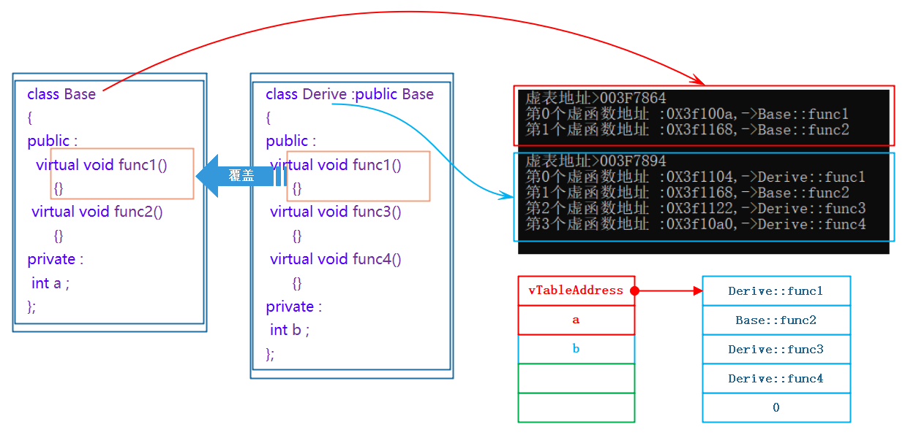

# 多态的概念

多态的概念：通俗来说，就是多种形态，具体点就是去**完成某个行为**，当**不同的对象**去完成时会**产生出不同的状态**。

举个栗子：比如买票这个行为，当普通人买票时，是全价买票；学生买票时，是半价买票；军人买票时是优先买票。

类比到c++，多态是在**不同继承关系的类对象**，去**调用同一函数**，产生了**不同的行为**。比如`Student`继承了`Person`。`Person`对象买票全价，`Student`对象买票半价。

这样被不同派生类的对象调用，产生结果不同的基类函数，官方学名叫**虚函数**。虚函数即被`virtual`修饰的类成员函数称为虚函数。

`virtual`不能修饰非类的成员函数（也就是类外的不属于任何类的普通函数），也不能修饰被`static`修饰的成员函数（没有`this`指针，后面会详细解释）。

`virtual`修饰的虚函数，在类内声明时，若是父类则要加`virtual`，若是子类则可加可不加（原因后面再说）；在类外定义时不能加`virtual`修饰。

```cpp
#include<iostream>
using namespace std;

//virtual void f() { }//不能修饰普通函数

class A {
public:
	//不能修饰被static修饰的函数
	//virtual static void f1() {
	//	cout << "void f()\n";
	//}
	//static virtual void f2() {
	//	cout << "void f()\n";
	//}
    virtual void f();
};
void A::f();//不用加virtual

int main() {return 0;}

```


## 构成多态的条件

那么在继承中要**构成多态还有两个条件**：

1. 必须**通过基类的指针或者引用调用虚函数**。

2. 被调用的函数必须是**虚函数**，且派生类必须**对基类的虚函数进行重写**。

> 重写指的是对已有的虚函数（包括缺省的形参列表）进行二次实现。
>
> 一般情况下，普通调用，调用的函数类型往往已经确定。
>
> 而多态调用，和指针指向的对象有关，指针指向父类则调用父类的虚函数，指针指向子类则调用父类的虚函数。

简单体验多态：

```cpp
#include<iostream>
using namespace std;

class Person {
public:
	virtual void BuyTicket() {
		cout << "买票-全价" << endl;
	}
};

class Student : public Person {
public:
	virtual void BuyTicket() {
		cout << "买票-半价" << endl;
	}
};
void Func(Person& p) {//切片赋值
	p.BuyTicket();
}
int main() {
	Person Mike;
	Func(Mike);

	Student Johnson;
	Func(Johnson);
	return 0;
}

```
输出：

```cpp
买票-全价
买票-半价

```


若`Person`和`Student`非继承关系，则因为是**不同类型**，无法编译通过。

## 派生类的虚函数不加virtual

在重写基类虚函数时，派生类的虚函数在不加`virtual`关键字时，因为继承后基类的**虚函数被继承**下来了在派生类**依旧保持虚函数属性**，所以可以构成重写。

也可以这样理解：子类继承的是父类的**接口声明**，重写的是实现，所以可以不加`virtual`。

但是该种写法不是很规范，不建议这样使用。


```cpp
#include<iostream>
using namespace std;

class Person {
public:
	virtual void BuyTicket() {
		cout << "买票-全价" << endl;
	}
};

class Student : public Person {
public:
	void BuyTicket() {
		cout << "买票-半价" << endl;
	}
};
void Func(Person& p) {
	p.BuyTicket();
}
int main() {
	Person Mike;
	Func(Mike);

	Student Johnson;
	Func(Johnson);
	return 0;
}

```


## 不构成多态的情况

父类的函数不加`virtual`，不构成多态。

```cpp
#include<iostream>
using namespace std;

class Person {//父类
public:
	Person* BuyTicket() {
		cout << "买票-全价" << endl;
		return nullptr;
	}
};

class Student : public Person {//子类
public:
	virtual Student* BuyTicket() {
		cout << "买票-半价" << endl;
		return nullptr;
	}
};
void Func(Person& p) {//切片赋值
	p.BuyTicket();
}
int main() {
	Person Mike;
	Func(Mike);

	Student Johnson;
	Func(Johnson);//切片作为父类的引用，调用父类的函数
	return 0;
}

```

输出：

```
买票-全价
买票-全价

```

父类的虚函数加了`virtual`，但没通过父类的指针或引用进行调用，也不构成多态。

例如这个案例：

```cpp
#include<iostream>
using namespace std;

class A {
public:
	virtual void func(int val = 1) { 
		std::cout << "A->" << val << std::endl; 
	}
	virtual void test() { func(); }
};

class B : public A {
public:
	void func(int val = 0) { 
		std::cout << "B->" << val << std::endl; 
	}
};

int main() {
	B* p = new B;
	p->test();//构成多态
	p->func();//不构成多态
	return 0;
}

```

输出：

```
B->1
B->0

```

`B->0`：

无论`func()`是否加`virtual`，在这里都是通过`B`类指针进行调用（而不是父类指针`A*`），所以不构成多态，且`A`类的`func`已被隐藏，所以直接调用`B`类的`func()`。

`B->1`：

`B`继承`A`的成员函数，有对`A::func()`进行重写（但形参的缺省参数不影响重写，缺省参数还是1），但没有对`A::test()`函数进行重写，只是简单地继承。

所以`p->test();`，在`test()`中`this`指针的类型是`A*`。而在`test()`中调用`func()`，则相当于指向`B`的对象的`A*`指针，调用已被重写的虚函数`func()`，所以调用的是`cout << "B->" << val`，缺省指是1。

> 第2个样例据说是个面试题。

# 虚函数重写

虚函数的重写（覆盖）：派生类中有一个**跟基类完全相同的虚函数**，称子类的虚函数重写了基类的虚函数。

这里的**完全相同**指派生类虚函数与基类虚函数的**返回值**类型、**函数名**、**参数列表的类型**完全相同。

> 重写指将函数的实现重新修改。
>
> 参数列表的类型如字面意思，参数的缺省值不影响多态。
>
> 函数重载则是根据形参类型让编译器选择用哪个函数，重载不要求返回值类型相同。但这里需要返回值类型相同。
>


## 协变

重写的特殊情况，这种情况叫**协变**，即**返回值可以不同**，但必须是**父子**类关系的**指针**或者**引用**，其他的都不行。

### 虚假的协变

父类和子类的虚函数返回值不能差异过大，比如这个一个`void`一个`Person*`，这种情况不是协变。

```cpp
class Person {
public:
	virtual Person* BuyTicket() {
		cout << "买票-全价" << endl;
	}
};

class Student : public Person {
public:
	//virtual void BuyTicket() {//编译器会报错
	//	cout << "买票-半价" << endl;
	//}
};
```

这种父类的虚函数的返回值是子类，子类的虚函数的返回值是父类的也不是协变。

```cpp
class Student;
class Person {
public:
	virtual Student* BuyTicket() {
		cout << "买票-全价" << endl;
		return nullptr;
	}
};

class Student : public Person {
public:
	//virtual Person* BuyTicket() {//编译器会报错
	//	cout << "买票-半价" << endl;
	//	return nullptr;
	//}
};
```

### 真正的协变

协变情况1：同一个虚函数，返回值跟随所在的类。

```cpp
class Person {
public:
	virtual Person* BuyTicket() {
		cout << "买票-全价" << endl;
		return nullptr;
	}
};

class Student : public Person {
public:
	virtual Student* BuyTicket() {
		cout << "买票-半价" << endl;
		return nullptr;
	}
};
```

协变情况2：函数的返回值可以是其他有继承关系的类的指针。

```cpp
class A {};
class B:public A{};

class Person {
public:
	virtual A* BuyTicket() {
		cout << "买票-全价" << endl;
		return nullptr;
	}
};

class Student : public Person {
public:
	virtual B* BuyTicket() {
		cout << "买票-半价" << endl;
		return nullptr;
	}
};
```

协变情况3：子类不加`virtual`，一样可以构成多态。这个可以这样理解：两个不同类的函数因为继承关系构成重写，重写的是实现，因此将父类的函数的虚函数属性给继承过来。

```cpp
class Person {
public:
	virtual Person* BuyTicket() {
		cout << "买票-全价" << endl;
		return nullptr;
	}
};

class Student : public Person {
public:
	Student* BuyTicket() {
		cout << "买票-半价" << endl;
		return nullptr;
	}
};
```


## virtual修饰析构函数

### 继承关系下的析构函数特有现象

不用`virtual`的情况：

```cpp
#include<iostream>
using namespace std;

class Person {
public:
	~Person() { cout << "~Person()" << endl; }
};
class Student : public Person {
public:
	~Student() { cout << "~Student()" << endl; }
};

int main() {
	Person a;
	Student b;
	return 0;
}
```

输出：

```cpp
~Student()
~Person()
~Person()

```

因为`b`先调用析构，`b`是`a`的子类，因此`b`调用自己的和父类的析构函数，最后`a`调用自身的析构函数。

> 若是先调用父类的析构，则子类有可能继承父类的成员，若继承了指向堆区资源的指针，则父类先析构，释放了堆区的资源，子类后析构，对已释放的资源进行二次释放，造成越权访问。


```cpp
#include<iostream>
using namespace std;

class Person {
public:
	~Person() { cout << "~Person()" << endl; }
};
class Student : public Person {
public:
	~Student() { cout << "~Student()" << endl; }
};

int main() {
	Person* p1 = new Person;
	delete p1;
	p1 = new Student;
	delete p1;
	return 0;
}
```

输出：

```cpp
~Person()
~Person()

```

这里`p1`第二次调用析构，应该用的是`~Student`，但调用的却是`~Person`。在平时没问题，但它们是继承关系，父类指针指向的对象可能是子类，也可能是父类，这种不能精准定位需要调用的析构函数的情况会存在极大风险。

### 析构函数的本质

在c++，析构函数的名称会被特殊处理，即析构函数的名称不是原名称。即这里的析构其实是
`p1->destrutor() + operator delete(p1)`。这样的特殊处理是因为多态，所以父类的析构和子类的构成**隐藏关系**，它们的析构都被处理成了`destructor()`。

所以这里是普通调用，但我们不希望在有继承关系时是普通调用，而是多态调用。

所以存在继承关系时需要将析构函数也加`virtual`修饰，使得它们构成多态。

```cpp
#include<iostream>
using namespace std;

class Person {
public:
	virtual ~Person() { cout << "~Person()" << endl << endl; }
};
class Student : public Person {
public:
	virtual ~Student() { cout << "~Student()" << endl; }
};

int main()
{
	Person* p1 = new Person;
	Person* p2 = new Student;
	delete p1;
	delete p2;
	return 0;
}
```

输出：

```
~Person()

~Student()
~Person()


```

只有派生类`Student`的析构函数重写了`Person`的析构函数，下面的`delete`对象调用析构函数，才能构成多态，才能保证`p1`和`p2`指向的对象正确的调用析构函数。

若父类和子类只有一个加`virtual`，

## 重载、重写和重定义对比

$\text{三个概念的对比}\begin{cases}
重载\begin{cases}两个函数在同一作用域\\函数名相同且参数不同(参数不同指类型、数量和顺序)\end{cases}\\重写\begin{cases}两个函数分别在基类和派生类的作用域\\函数名/参数/返回值都必须相同(协变除外)\\两个函数必须是虚函数\end{cases}\\重定义\begin{cases}两个函数分别在基类和派生类的作用域\\函数名相同\\两个基类和派生类的同名函数不构成重写就是重定义\end{cases}\end{cases}$

包含关系：


# c++11的override和 final

从上面可以看出，c++对函数重写的要求比较严格，但是有些情况下由于疏忽，可能会导致函数名字母次序写反而无法构成重载，而这种错误在编译期间是不会报出的，只有在程序运行时没有得到预期结果才来debug会得不偿失，因此：c++11提供了`override`和`final`两个关键字，可以帮助用户检测是否重写。

## final限制重写

`final`：**修饰虚函数**，表示该虚函数**不能再被重写**。`final`也能用于**修饰类**，使类**不能**当成父类**被继承**。

```cpp
class Car{
public:
	virtual void Drive() final {}
};
class Benz :public Car{
public:
	//virtual void Drive() { cout << "Benz-舒适" << endl; }//无法重写
};
```

## override检查重写

`override`: 修饰派生类，检查派生类虚函数是否重写了基类某个虚函数，如果没有重写编译报错。

所以`override`可以规范程序员的行为，让程序员不忘记重写虚函数。

```cpp
#include<iostream>
using namespace std;
class Car {
public:
	virtual void Drive() {}//将Drive改名或去掉virtual会报错
};
class Benz :public Car {
public:
	virtual void Drive() override {
		cout << "Benz-舒适" << endl;
	}
};
int main()
{
	Benz a;
	a.Drive();
	return 0;
}
```


# 抽象类

## 纯虚函数和抽象类

在虚函数的后面写上 $=0$ ，则这个函数为**纯虚函数**。

**包含纯虚函数的类**叫做**抽象类**（也叫**接口类**），**抽象类不能实例化**出对象（问就是规定）。

派生类继承后也不能实例化出对象，只有**重写纯虚函数**，**派生类才能实例化**出对象。纯虚函数规范了派生类必须重写，另外纯虚函数更体现出了接口继承。

```cpp
#include<iostream>
using namespace std;

class Car {//抽象类
public:
	virtual void Drive() = 0;//纯虚函数
	virtual void Fuel() = 0 {
		cout << "Car-化石能源" << endl;
	};
};
class Benz :public Car {
public:
	virtual void Drive() {
		cout << "Benz-舒适" << endl;
	}
	virtual void Fuel() {
		cout << "Benz-汽油" << endl;
	}
};
class BMW :public Car {
public:
	virtual void Drive() {
		cout << "BMW-操控" << endl;
	}
	virtual void Fuel() {
		cout << "BMW-柴油" << endl;
	}
};

void f(Car& car) {
	car.Drive();
}

int main() {
	Benz benzi;//静态实例化
	Car* pBenz = new Benz;//动态实例化
	pBenz->Drive();
	Car* pBMW = new BMW;
	pBMW->Drive();
	//Car* pC = new Car;//无法实例化抽象类
	//Car Pc;

	//抽象类同样满足多态
	Benz benz;
	BMW bmw;
	f(benz);
	f(bmw);
	//纯虚函数可以不是空函数
	//dynamic_cast可以认为是动态的强制类型转换
	dynamic_cast<Car*>(&benz)->Fuel();
	dynamic_cast<Car*>(&bmw)->Fuel();
	return 0;
}

```

抽象类和关键字`override`：2个都是强制重写虚函数的手段，`override`相对于抽象类，出现的比较晚。

## 接口继承

普通函数的继承是一种**实现继承**，派生类继承了基类函数，可以使用函数，继承的是函数的实现（所以子类的成员函数可以不加`virtual`）。

虚函数的继承是一种接口继承，派生类继承的是基类虚函数的接口，目的是为了重写，达成多态，继承的是接口。所以如果**不实现多态**，**不要把函数定义成虚函数**。

> 在现实中有很多事物有抽象概念。例如人是个抽象概念，当指定职业例如医生、学生等后，人才是个完整的人。

# 多态的原理

## 虚函数表

案例：

```cpp
#include<iostream>
using namespace std;

class A {
public:
	virtual void f() {
		cout << "void f()\n";
	}
	int a;
};
int main() {
	cout << sizeof(A) << endl;
	A b;
	return 0;
}

```

在32位环境下，输出是8，在64位环境输出16。

调用调试窗口（vs）可以看到成员信息：


通过观察测试我们发现`b`对象除了`a`成员，还多一个`__vfptr`放在对象的前面(注意有些平台可能会放到对象的最后面，这个跟平台有关)，对象中的这个指针我们叫做**虚函数表指针**(v 代表 virtual，f代表 function)。

一个含有虚函数的类中都至少都有一个虚函数表指针，因为虚函数的地址要被放到虚函数表中，虚函数表也简称虚表。


> 可以理解为带虚函数的类，成员必定包含一个**指针**，这个指针的类型是**函数指针数组**。遍历这个数组可以找到当前类的所有带虚属性（继承但未重写的虚函数、完成重写的虚函数、自身有的虚函数）的函数。

案例，继承关系下的虚函数表：

```cpp
#include<iostream>
using namespace std;

class Base {
public:
	virtual void Func1() {
		cout << "Base::Func1()" << endl;
	}
	virtual void Func2() {
		cout << "Base::Func2()" << endl;
	}
	void Func3() {
		cout << "Base::Func3()" << endl;
	}
private:
	int _b = 1;
};
class Derive : public Base
{
public:
	virtual void Func1() {
		cout << "Derive::Func1()" << endl;
	}
private:
	int _d = 2;
};
int main() {
	Base b;
	Derive d;
	return 0;
}
```


通过观察和测试，我们发现了以下几点：

1. 派生类对象`d`中也有**虚表指针**也**只有这一个**。

   `d`对象由两部分构成，一部分是父类继承下来的成员，另一部分是自己的成员。但虚表指针指向的数组中，有一部分函数是父类的，其余都是子类的。

2. 基类`b`对象和派生类`d`对象虚表（**父类和子类的虚表**）是不一样的（可通过调试窗口查看2个对象的成员），这里`Func1`完成了重写，所以`d`的虚表中存的是重写的`Derive::Func1`，所以**虚函数的重写**也叫作**覆盖**，覆盖就是指虚表中虚函数的覆盖。

   重写是语法的叫法，覆盖是原理层的叫法。

3. 另外`Func2`**继承下来**后**是虚函数**，所以**放进了虚表**，`Func3`也继承下来了，但是**不是**虚函数（正常继承而不是作为虚函数重写），所以**不会放进虚表**。

4. **虚函数表**本质是一个**存虚函数指针的指针数组**，一般情况这个数组最后面放了一个`nullptr`。

5. 总结一下派生类的虚表生成：
   1. 先将**基类**中的**虚表内容拷贝**一份到派生类虚表中 
   2. 如果派生类**重写了**基类中**某个虚函数**，用派生类**自己的虚函数覆盖**虚表中基类的虚函数 
   3. **派生类自己新增加的虚函数**按其在派生类中的**声明次序尾插**到派生类虚表的最后。

6. **虚表存的是虚函数指针**，不是虚函数，**虚函数**和普通函数一样的，都是**存在代码段**的，只是他的**指针又存到了虚表中**。
   另外**对象**中存的不是虚表，存的是**虚表指针**。真正的虚表（不是指针）存储的位置取决于编译器。但通常都会选择存放在**代码段**和**只读数据段**。

   vs下是存在**代码段**的，Linux g++下虚函数表一般存放在**只读数据段**（.rodata），这是ELF（Linux可执行文件格式）的标准做法。

可以通过这个代码查看不同分段的大概位置（看地址的十六进制的前几位）：

```cpp
#include<iostream>
using namespace std;

class A {
public:
	virtual void f() {
		cout << "void f()\n";
	}
	void g(){;}
	int a=1;
};

int a = 0;
void h() {;}

int main() {
	A x;
	static int b = 0;
	int c = 0;
	int* d = new int;
	const char* e = "asdfghjkl";
	printf("%p\n", (void*)&a);//全局变量，静态区
	printf("%p\n", (void*)&b);//静态局部变量，静态区
	printf("%p\n", (void*)&c);//局部变量，栈区
	printf("%p\n", (void*)d);//堆区
	printf("%p\n", (void*)e);//代码段静态区
	printf("%p\n", &A::f);//虚函数地址
	printf("%p\n", &A::g);//成员函数地址
	printf("%p\n", (void*)h);//普通函数地址
	return 0;
}

```

输出结果之一：

```
008ED3E0
008ED3E4
0133F6EC
017B1D60
008EAB44
008E158C
008E15AF
008E1591

```

可以看到，静态区的地址的前4位都是`008E`，可以想到类的成员函数，无论是虚函数还是普通成员函数，都存放在静态区（代码段）。

## 多态的原理

引用最开始的例子。

```cpp
#include<iostream>
using namespace std;

class Person {
public:
	virtual void BuyTicket() {
		cout << "买票-全价" << endl;
	}
};

class Student : public Person {
public:
	virtual void BuyTicket() {
		cout << "买票-半价" << endl;
	}
};
void Func(Person& p) {//切片赋值
	p.BuyTicket();
}
int main() {
	Person Mike;
	Func(Mike);

	Student Johnson;
	Func(Johnson);
	return 0;
}

```

这里`Func`函数传`Person`调用的`Person::BuyTicket`，传`Student`调用的是`Student::BuyTicket`。


1. 观察下图的红色箭头我们看到，`p`是指向`mike`对象时，`p->BuyTicket`在`mike`的虚表中找到虚函数是`Person::BuyTicket`。

2. 观察下图的蓝色箭头我们看到，`p`是指向`johnson`对象时，`p->BuyTicket`在`johson`的虚表中找到虚函数是`Student::BuyTicket`。


3. 这样就实现出了不同对象去完成同一行为时，展现出不同的形态。

4. 反过来思考我们要达到多态，有两个条件，一个是**虚函数覆盖**，一个是对象的**指针**或**引用调用虚函数**。

5. 再通过下面的汇编代码分析（使用的IDE是vs2019），看出**满足多态以后的函数调用**，不是在编译时确定的，是**运行起来以后到对象的中取找**的。不满足多态的函数调用时编译时确认好的。

```cpp
//以下汇编代码中跟调用函数不相关的都被去掉了
void Func(Person* p) {
//...
    p->BuyTicket();
	//p中存的是mike对象的指针，将p移动到eax中
001940DE  mov         eax,dword ptr [p]
//[eax]就是取eax值指向的内容，这里相当于把mike对象头4个字节(虚表指针)移动到了edx
001940E1  mov         edx,dword ptr [eax]
//[edx]就是取edx值指向的内容，这里相当于把虚表中的头4字节存的虚函数指针移动到了eax
00B823EE  mov         eax,dword ptr [edx]
//call eax中存虚函数的指针。这里可以看出满足多态的调用，不是在编译时确定的，是运行起来以后到对象的中取找的。
001940EA  call        eax  
001940EC  cmp         esi,esp  
}

int main() {
//... 
//首先BuyTicket虽然是虚函数，但是mike是对象，不满足多态的条件，
//所以这里是普通函数的调用转换成地址时，是在编译时已经从符号表确认了函数的地址，直接call 地址
    mike.BuyTicket();
00195182  lea         ecx,[mike]
00195185  call        Person::BuyTicket (01914F6h)  
//... 
}
```


## 动态绑定与静态绑定

1. 静态绑定又称为**前期绑定**(早绑定)，在程序**编译期间确定了程序的行为**，也称为静态多态，比如：函数重载。

2. 动态绑定又称**后期绑定**(晚绑定)，是在**程序运行期间**，根据具体拿到的类型确定程序的具体行为，调用具体的函数，**也称为动态多态**。

3. 之前买票的汇编代码很好的解释了什么是静态(编译器)绑定和动态(运行时)绑定。

例如这个案例：

```cpp
#include<iostream>
using namespace std;

class A { 
public: 
	virtual void f() {
		cout << "A::f()\n"; 
	} 
}; 
				
class B :public A {
private:
	virtual void f() {
		cout << "B::f()\n";
	}
}; 

int main() {
	A* p = (A*)new B;
	p->f();
	return 0;
}
```

虽然`B`类的虚函数`f()`的访问权限是私有（`private`），但c++ 的访问控制（`public`/`private`）是**编译期**行为，是静态绑定。

而虚函数的动态绑定是运行期行为，是通过运行时查找虚函数表来找到`B::f()`，此时访问不受静态绑定的权限约数。


## 总结多态的原理

回忆多态的条件：

1. 必须**通过基类的指针或者引用调用虚函数**。

2. 被调用的函数必须是**虚函数**，且派生类必须**对基类的虚函数进行重写**。

通过观察底层实现可以了解到：

父类指针`ptr`，根据`ptr`指向的虚表查找要调用的函数。`ptr`指向父类就查父类的虚表，指向子类就查子类的虚表。

> 对象无法实现多态，是因为继承关系中，子类对象通过切片方式将属于父类的那一部分赋值给父类对象，通过父类对象调用的函数自然只属于父类。
>
> 切片只是形象的说法，只是将子类中继承自父类的那一部分的值拷贝给父类对象。
>
> 但父类的切片赋值不会将虚表指针也拷贝过去，这也是为什么普通的父类对象无法实现多态的原因。
>
> 从开发语言的人（读到这里，你就是本贾尼祖师爷本人，现在的时间是上个世纪90年代）的角度思考，若允许父类的切片赋值时，将虚表指针也拷贝过去，则多态调用时，若父类对象指向的是父类，则虚表中的虚函数还是父类的虚函数吗？
>
> 不一定，因为父类对象不能保证是父类的虚表，也有可能是子类的虚表。之前查看底层汇编就能知道，多态也只是傻傻地执行准备好的指令。
>
> 例如这个代码：
>
> ```cpp
> void Func(Person p){
>     p.BuyTicket();
> }
> int main(){
>     Person p; Student s;
>    
>     p=s;//这句是关键
>     Func(p); Func(s);
>     return 0;
> }
> ```
>
> 若允许父类对象也拷贝虚表指针，则`p=s`也会将虚表指针也拷贝进去，此时`main()`中的`p`的虚表是子类的虚表，则通过父类对象调用时只会查找子类的虚表。这样的后果在析构函数那一部分已经叙述。

# 单继承和多继承关系的虚函数表

需要注意的是在单继承和多继承关系中，下面我们去关注的是派生类对象的虚表模型，因为基类的虚表模型前面我们已经看过了，没什么需要特别研究的

## 单继承中的虚函数表

```cpp
#include<iostream>
using namespace std;

class Base {
public:
	virtual void func1() { cout << "Base::func1" << endl; }
	virtual void func2() { cout << "Base::func2" << endl; }
private:
	int a;
};
class Derive :public Base {
public:
	virtual void func1() { cout << "Derive::func1" << endl; }
	virtual void func3() { cout << "Derive::func3" << endl; }
	virtual void func4() { cout << "Derive::func4" << endl; }
private:
	int b;
};
int main() {
	Base b;
	Derive d;
	return 0;
}
```

观察下图中的监视窗口中我们发现看不见`func3`和`func4`。这里是编译器的监视窗口故意**隐藏**了这两个函数（这里用的编译器是vs2019，可以意识到微软的工程师做了什么），也可以认为是他的一个小`bug`。那么我们如何查看`d`的虚表呢？下面我们使用代码打印出虚表中的函数。


## 打印虚函数表

思路：取出`b`、`d`对象的头 4 byte，就是**虚表的指针**，前面我们说了虚函数表本质是一个存虚函数指针的**函数指针数组**，这个数组最后面放了一个`nullptr`。

1. 先取`b`的地址，若编译器环境是32位，强转成一个能存储 4 byte 数据的类型（比如`int`）的指针；若编译器环境是64位，则需要强转成能存储 8 byte 数据的类型（比如`long long`）的指针。

   在Visual Studio系列编译器和Dev系列编译器查看编译环境的 bit 位：

   

2. 再解引用取值，就取到了`b`对象头的值，这个值就是指向虚表的指针。

3. 再强转成`VFPTR*`，因为虚表就是一个存`VFPTR`类型(虚函数指针类型)的**指针数组**。

4. 虚表指针传递给`PrintVTable`进行打印虚表。

> 需要说明的是这个打印虚表的代码经常会崩溃，因为编译器有时对虚表的处理不干净，虚表最后面没有放`nullptr`，导致越界，这是编译器的问题。
>
> 若是在Visual Studio，需要点目录栏的 - 生成 - 清理解决方案，再编译就好了。
>
> 在Dev还没遇到这种问题。

```cpp
#include<iostream>
using namespace std;

class Base {
public:
	virtual void func1() { cout << "Base::func1" << endl; }
	virtual void func2() { cout << "Base::func2" << endl; }
private:
	int a;
};
class Derive :public Base {
public:
	virtual void func1() { cout << "Derive::func1" << endl; }
	virtual void func3() { cout << "Derive::func3" << endl; }
	virtual void func4() { cout << "Derive::func4" << endl; }
private:
	int b;
};

typedef void(*VFPTR) ();
void PrintVTable(VFPTR vTable[]) {
	// 依次取虚表中的虚函数指针打印并调用。调用就可以看出存的是哪个函数
	cout << " 虚表地址>" << vTable << endl;
	for (int i = 0; vTable[i] != nullptr; ++i) {
		printf(" 第%d个虚函数地址 :0X%x,->", i, vTable[i]);
		VFPTR f = vTable[i];
		f();//也可以这样调用：(*f)();本质是通过地址调用函数
	}
	cout << endl;
}
int main() {
	Base b;
	Derive d;

	VFPTR* vTableb = (VFPTR*)(*(int*)&b);
	PrintVTable(vTableb);
	VFPTR* vTabled = (VFPTR*)(*(int*)&d);
	PrintVTable(vTabled);
	return 0;
}

```

单继承下的虚表：



通过这个代码也可以确认，只要成员函数确认是虚函数，一定会放入虚表。

## 多继承中的虚函数表

可以通过调试时的监视窗口看到，多继承类的对象，继承了多少个父类，就有多少个虚表。

在x86（32位）环境下的测试代码：

```cpp
#include<iostream>
using namespace std;

class Base1 {
public:
	virtual void func1() { cout << "Base1::func1" << endl; }
	virtual void func2() { cout << "Base1::func2" << endl; }
private:
	int b1;
};

class Base2 {
public:
	virtual void func1() { cout << "Base2::func1" << endl; }
	virtual void func2() { cout << "Base2::func2" << endl; }
private:int b2;
};

class Derive : public Base1, public Base2 {
public:
	virtual void func1() { cout << "Derive::func1" << endl; }
	virtual void func3() { cout << "Derive::func3" << endl; }
private:
	int d1;
};

typedef void(*VFPTR) ();
void PrintVTable(VFPTR vTable[]) {
	cout << " 虚表地址>" << vTable << endl;
	for (int i = 0; vTable[i] != nullptr; ++i) {
		printf(" 第%d个虚函数地址 :0X%x,->", i, vTable[i]);
		VFPTR f = vTable[i];
		f();
	}
	cout << endl;
}

int main() {
	Derive d;
	VFPTR* vTableb1 = (VFPTR*)(*(int*)&d);
	PrintVTable(vTableb1);
	//跳过继承的Base1的成员占用的空间
    //可通过Base2* ptr=&d;printVTable(VF代替(继承的切片)
	VFPTR* vTableb2 = (VFPTR*)(*(int*)((char*)&d + sizeof(Base1)));
	PrintVTable(vTableb2);
	return 0;
}

```

观察下图可以看出：多继承派生类的**未重写的虚函数**放在**第一个**继承基类部分的**虚函数表**中。


这里有个现象：2个虚表的`func1()`，它们是同一个函数，却有不同的地址。

那两个`func1`是同一个函数吗？

## 父类都有同一虚函数的情况

依旧是上个问题，`Derive`作为子类，继承的2个父类`Base1`和`Base2`，它们都有同一虚函数`func1`，这2个`func1`是否是同一个？

通过这个代码检验：

```cpp
#include<iostream>
using namespace std;

class Base1 {
public:
	virtual void func1() {
		cout << "Base1::func1" << endl; 
	}
	virtual void func2() { 
		cout << "Base1::func2" << endl; 
	}
private:
	int b1;
};

class Base2 {
public:
	virtual void func1() {
		cout << "Base2::func1" << endl; 
	}
	virtual void func2() { 
		cout << "Base2::func2" << endl; 
	}
private:int b2;
};

class Derive : public Base1, public Base2 {
public:
	virtual void func1() { 
		cout << "Derive::func1" << endl; 
	}
	virtual void func3() { 
		cout << "Derive::func3" << endl; 
	}
private:
	int d1;
};

int main() {
	Derive d;
	Base1* p1 = &d;
	p1->func1();
	Base2* p2 = &d;
	p2->func1();
	return 0;
}

```

输出（vs2019）：

```
Derive::func1
Derive::func1

```

可以看到，它们其实还是同一个。

但2个虚表中的`func1`的地址和类型并不相同，这是为什么？

学习c++，遇到不懂的，直接扒编译器底层的汇编代码。读懂了汇编代码，就读懂了c++。


## 虚拟继承下的虚函数表

可以通过虚拟继承来防止2个虚表都保存有虚函数`func1`的地址的这种现象：

```cpp
#include<iostream>
using namespace std;

class Base1 {
public:
	virtual void func1() { cout << "Base1::func1" << endl; }
	virtual void func2() { cout << "Base1::func2" << endl; }
private:
	int b1;
};

class Base2 {
public:
	virtual void func1() { cout << "Base2::func1" << endl; }
	virtual void func2() { cout << "Base2::func2" << endl; }
private:int b2;
};

class Derive : virtual public Base1, virtual public Base2 {
public:
	virtual void func1() { cout << "Derive::func1" << endl; }
	virtual void func3() { cout << "Derive::func3" << endl; }
private:
	int d1;
};

typedef void(*VFPTR) ();
void PrintVTable(VFPTR vTable[]) {
	cout << " 虚表地址>" << vTable << endl;
	for (int i = 0; vTable[i] != nullptr; ++i) {
		printf(" 第%d个虚函数地址 :0X%x,->", i, vTable[i]);
		VFPTR f = vTable[i];
		f();
	}
	cout << endl;
}

int main() {
	Derive d;
	VFPTR* vTableb1 = (VFPTR*)(*(int*)&d);
	PrintVTable(vTableb1);
	//虚拟继承就没必要通过这种方式找到虚表
	//VFPTR* vTableb2 = (VFPTR*)(*(int*)
	// ((char*)&d + sizeof(Base1)));
	//PrintVTable(vTableb2);
	Base2* ptr = &d;//直接通过切片赋值定位
	PrintVTable((VFPTR *) (*(int*)ptr));
	return 0;
}
```

因为虚拟继承中只有`Base2`的函数`func1`得到保留，所以直接跳过`sizeof(Base1)`时很容易越界。因此直接使用切片赋值。


## 菱形继承和菱形虚拟继承

菱形继承也是多继承的一种，虚表数取决于继承的父类个数。自身有的虚函数地址也是放在第1个虚表中。

但如果是菱形虚拟继承，情况会变得复杂。可以借助vs2019等工具查看。其中菱形虚拟继承的原始主类的虚表，可以称为**虚基表**。即虚拟继承下，菱形虚拟继承中的某些类可能没有独属于自己的虚表。

虚基表是MSVC系列编译器的特性，g++系列编译器和clang（苹果操作系统的编译器）可能没有这种特性（没测试过）。

这一块知识点就是一个迷宫，实际中我们不建议设计出菱形继承及菱形虚拟继承，一方面太复杂容易出问题，另一方面这样的模型，访问基类成员有一定得性能损耗。所以一般我们也不需要研究清楚，因为实际中很少用。即使研究，也只是参考多继承的做法。

关于菱形继承的多态的两篇链接文章：

[C++ 虚函数表解析 | 酷 壳 - CoolShell](https://coolshell.cn/articles/12165.html#一般继承（无虚函数覆盖）)

[C++ 对象的内存布局 | 酷 壳 - CoolShell](https://coolshell.cn/articles/12176.html)

# 常考题目收集

## 选择题

1. 下面哪种面向对象的方法可以让你变得富有( ) 

   A: 继承 

   B: 封装 

   C: 多态 

   D: 抽象

2. ( )是面向对象程序设计语言中的一种机制。这种机制实现了方法的定义与具体的对象无关，而对方法的调用则可以关联于具体的对象。

   A: 继承 

   B: 模板 

   C: 对象的自身引用 

   D: 动态绑定

3. 面向对象设计中的继承和组合，下面说法错误的是？（）

   A：继承允许我们覆盖重写父类的实现细节，父类的实现对于子类是可见的，是一种静态复用，也称为白盒复用

   B：组合的对象不需要关心各自的实现细节，之间的关系是在运行时候才确定的，是一种动态复用，也称为黑盒复用

   C：优先使用继承，而不是组合，是面向对象设计的第二原则

   D：继承可以使子类能自动继承父类的接口，但在设计模式中认为这是一种破坏了父类的封装性的表现

4. 以下关于纯虚函数的说法,正确的是( )

   A：声明纯虚函数的类不能实例化对象 

   B：声明纯虚函数的类是虚基类

   C：子类必须实现基类的纯虚函数 

   D：纯虚函数必须是空函数

5. 关于虚函数的描述正确的是( )

   A：派生类的虚函数与基类的虚函数具有不同的参数个数和类型 

   B：内联函数不能是虚函数

   C：派生类必须重新定义基类的虚函数 

   D：虚函数可以是一个static型的函数 

6. 关于虚表说法正确的是（ ）

   A：一个类只能有一张虚表

   B：基类中有虚函数，如果子类中没有重写基类的虚函数，此时子类与基类共用同一张虚表

   C：虚表是在运行期间动态生成的

   D：一个类的不同对象共享该类的虚表

7. 假设A类中有虚函数，B继承自A，B重写A中的虚函数，也没有定义任何虚函数，则（ ）

   A：A类对象的前4个字节存储虚表地址，B类对象前4个字节不是虚表地址

   B：A类对象和B类对象前4个字节存储的都是虚基表的地址

   C：A类对象和B类对象前4个字节存储的虚表地址相同

   D：A类和B类虚表中虚函数个数相同，但A类和B类使用的不是同一张虚表

8. 下面程序输出结果是什么? （）

   A：class A class B class C class D 

   B：class D class B class C class A

   C：class D class C class B class A 

   D：class A class C class B class D

```cpp
#include<iostream>
using namespace std;

class A {
public:
	A(const char* s) {
		cout << s << endl; 
	}
	~A() {}
};

class B :virtual public A {
public:
	B(const char* s1, const char* s2) :A(s1) {
		cout << s2 << endl; 
	}
};

class C :virtual public A {
public:
	C(const char* s1, const char* s2) :A(s1) {
		cout << s2 << endl; 
	}
};
class D :public B, public C {
public:
	D(const char* s1, const char* s2, 
		const char* s3, const char* s4)
		:B(s1, s2), C(s1, s3), A(s1) {
		cout << s4 << endl;
	}
};

int main() {
	D* p = new D("class A", "class B", "class C", "class D");
	delete p;
	return 0;
}

```


9. 多继承中指针偏移问题？下面说法正确的是( )

   A：p1 == p2 == p3 

   B：p1 < p2 < p3 

   C：p1 == p3 != p2 

   D：p1 != p2 != p3

```cpp
#include<iostream>
using namespace std;

class Base1 {
public:
	int _b1;
};
class Base2 {
public:
	int _b2;
};

class Derive : public Base1, public Base2 {
public: int _d;
};

int main() {
	Derive d;
	Base1* p1 = &d;
	Base2* p2 = &d;
	Derive* p3 = &d;
	return 0;
}

```

10. 以下程序输出结果是什么（）

    A: A->0 

    B: B->1 

    C: A->1 

    D: B->0 

    E: 编译出错 

    F: 以上都不正确

```cpp
#include<iostream>
using namespace std;

class A {
public:
	virtual void func(int val = 1) { 
		std::cout << "A->" << val << std::endl; 
	}
	virtual void test() { func(); }
};

class B : public A {
public:
	void func(int val = 0) { 
		std::cout << "B->" << val << std::endl; 
	}
};

int main() {
	B* p = new B;
	p->test();
	return 0;
}

```


## 选择题参考答案

```
1. A   2. D   3. C   4. A   5. B
6. D   7. D   8. A   9. C   10. B
```

个人解析：

1. “富有” 指变得有钱，在程序中若自己是个对象，则富有代指使自己的成员变多。只有继承能做到。
2. 题目描述的机制是 “方法的定义与具体对象无关，而对方法的调用可以关联于具体对象”。动态绑定是在**程序运行期间**，根据具体拿到的类型确定程序的具体行为，调用具体的函数，符合题目的描述。
3. 优先使用组合，而不是继承，是为了降低类之间的耦合度。
4. 排除法，A是概念的内容，直接选。B不一定，类根据继承关系有多个身份。C没有说明子类也不是抽象类。D在之前的案例中已经证明。
5. B内联函数是虚函数的话需要加入虚表，而加入虚表则意味着放弃内联函数的身份，所以B对。C参考第4题的C。A违反概念。D`static`修饰的函数没有`this`指针，无法加入虚表，所以不可能是虚函数。
6. A错，没有考虑多继承的情况。B错，前后无关联，重写与不重写某个虚函数和虚表数无关，更何况不同类的虚表不是同一个。C错，虚表是在编译阶段定义的。D可以在编译器中声明不同的对象，通过Visual Studio系列编译器查看底层。
7. 只有D符合概念。A错，B有重写A的虚函数，则B需要有虚表存储虚函数的地址，且位于前`sizeof(void*)`个字节。B和C错，参考D。
8. 程序描述了一个菱形虚拟继承，且`virtual`都加在了关键位置。根据构造函数先调用父类的构造函数的原则，D的构造函数先调用B的构造函数，B的构造函数掉调用A的构造函数，所以先输出`class A`，排除B、C；B调用完A的构造函数后，结合调用自己的构造函数，所以排除D，A对。补充：在虚继承下，B、C都有调用A的构造函数，但只有D中的`A(s1)`会正常执行。
9. 程序描述了多继承情况下的赋值关系。因为继承顺序的关系，`Base1`的成员在`Base2`之前定义，然后再定义自身的成员。因为继承关系下的赋值是切片赋值，所以指针只会指向自己应该指向的类的部分。所以只有C符合。
10. 这个案例在之前不构成多态的情况一小节中有提到。

## 问答题

1. 什么是多态？

**完成某个行为**，当**不同的对象**去完成时会**产生出不同的状态**，这一现象即为多态。多态分静态多态和动态多态。静态多态就是函数重载。

动态多态有2个条件：父类指针或引用调用虚函数和虚函数被重写。其中每个类有多个身份，例如它继承了某个类，也被某个类继承，类似爷爷、爸爸、自己中，爸爸的角色。

2. 什么是重载、重写(覆盖)、重定义(隐藏)？

3. 多态的实现原理？

4. `inline`函数可以是虚函数吗？
   答：可以，不过编译器忽略`inline`属性时，这个函数就不再是`inline`，因为虚函数要放到虚表中去。

   即类中的内联函数正常调用时，只要编译器认为它可以当成内联函数，则它就是内联函数。但若是多态调用，则不是内联函数，因为要将地址放到虚表中。

5. 静态成员可以是虚函数吗？
   答：不能，因为静态成员函数没有`this`指针，使用
   `类型::成员函数`的调用方式无法访问虚函数表，所以静态成员函数无法放进虚函数表。

   也可以这样理解：静态成员函数和全局函数的区别只剩下需要指定类域。

6. 构造函数可以是虚函数吗？
   答：不能，因为对象中的虚函数表指针是在构造函数初始化列表阶段（初始化所有成员之前）才初始化的。所以构造函数用`virtual`修饰会报错。

   且虚函数多态调用需要在虚表中找，但虚表初始化要在初始化列表调用完之后。

7. 析构函数可以是虚函数吗？什么场景下析构函数是虚函数？
   答：可以，并且最好把基类的析构函数定义成虚函数。

   场景：`父类指针=new 子类对象;delete 父类指针`

8. 对象访问普通函数快还是虚函数更快？
   答：首先如果是普通对象，是一样快的。如果是指针对象或者是引用对象，则调用的普通函数快，因为构成多态，运行时调用虚函数需要到虚函数表中去查找。

9. 虚函数表是在什么阶段生成的，存在哪的？
   答：虚函数表是在编译阶段就生成的，一般情况下存在代码段(常量区)的。

10. C++菱形继承的问题？虚继承的原理？
    答：参考继承课件。注意这里不要把虚函数表和虚基表搞混了。

11. 什么是抽象类？抽象类的作用？
    答：参考（3.抽象类）。抽象类强制重写了虚函数，另外抽象类体现出了接口继承关系。
