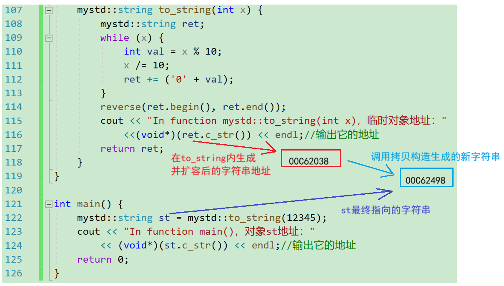
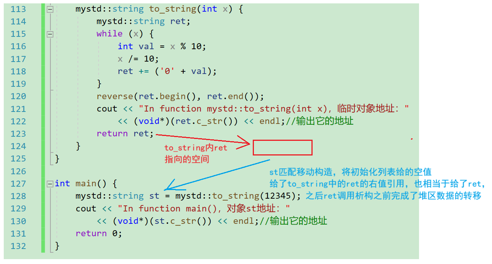
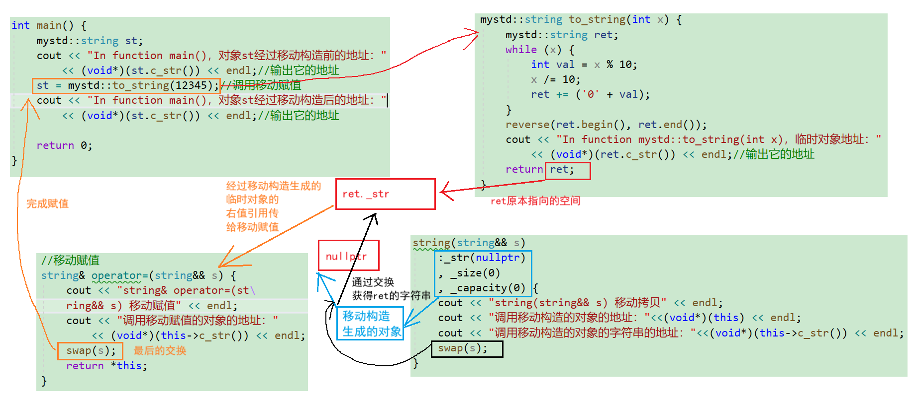
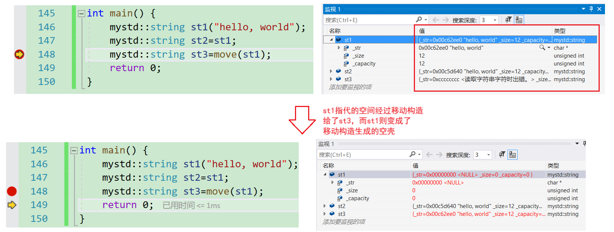
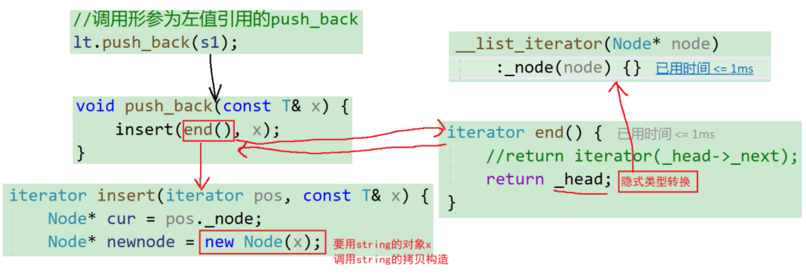
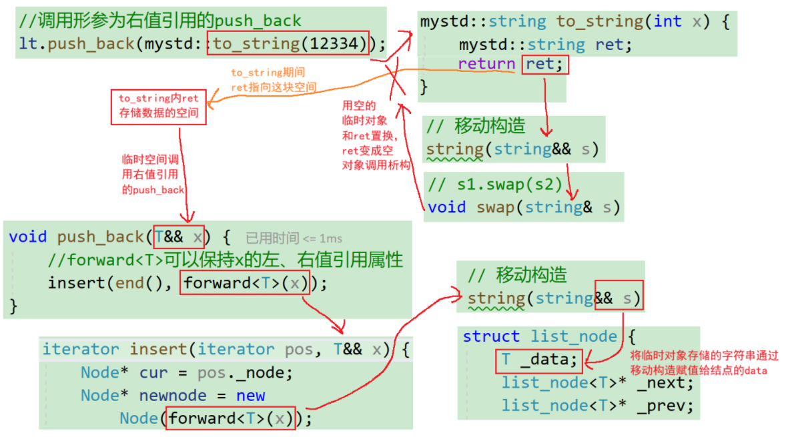
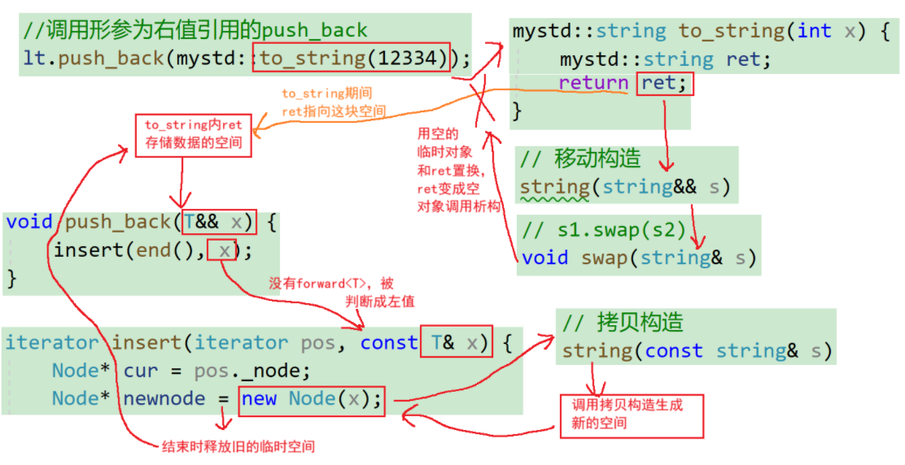
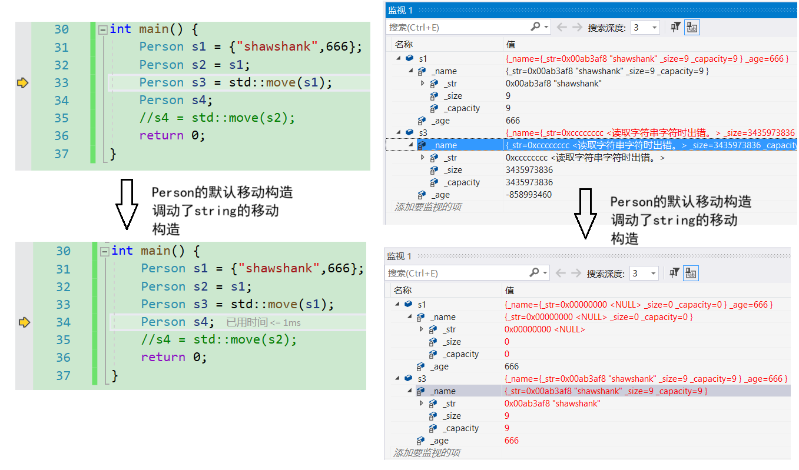
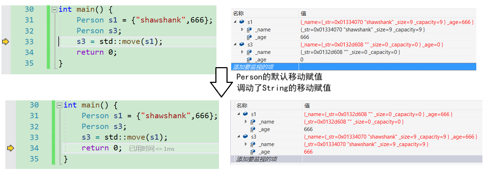

# 左值引用和右值引用

传统的C++语法中就有引用的语法，而C++11中新增了的**右值引用**语法特性，所以之前学习的引用就叫做左值引用（见[c++入门——引用和内联函数-CSDN博客](https://blog.csdn.net/m0_73693552/article/details/145215015)）。无论左值引用还是右值引用，**都是给对象取别名**。

c语言时期就有左值和右值的概念。左值是一个**表示数据的表达式**（如变量名或解引用的指针），我们可以**获取它的地址** $+$ **可以对它赋值**，左值可以出现在**赋值符号**`=`的**左边**，**右值不能出现在赋值符号左边**。即可以出现 `int a;a=3;` 但不能出现类似 `3=a;` 的情况。

`const`修饰符后的左值（如`const int c = 2;`，`c`严格来说叫常变量），不能给他赋值，但是可以取它的地址。**左值引用**就是给左值的引用，**给左值取别名**。

```cpp
#include<iostream>
using std::cout;
using std::endl;

int main() {
	// 以下的p、b、c、*p都是左值
	int* p = new int(0);
	int b = 1;
	const int c = 2;
	// 以下几个是对上面左值的左值引用
	int*& rp = p;
	int& rb = b;
	const int& rc = c;
	int& pvalue = *p;
	return 0;
}
```

右值也是一个**表示数据的表达式**，如：字面常量、表达式返回值，函数返回值（这个不能是左值引用返回）等等，**右值可以出现在赋值符号的右边**，但是**不能出现出现在赋值符号的左边**，**右值不能取地址**。**右值引用**就是对右值的引用，**给右值取别名**。

因此区分左值和右值的最大区别是能否取地址。

```cpp
#include<iostream>
#include<typeinfo> 
using namespace std;

int fmin(int x, int y) {
	return min(x, y);
}

int main() {
	double x = 1.1, y = 2.2;
	// 以下几个都是常见的右值
	10;
	x + y;//结果会先保存在底层的临时变量
	fmin(x, y);//结果会先保存在底层的临时变量

	// 以下几个都是对右值的右值引用
	int&& rr1 = 10;
	cout << typeid(rr1).name() << endl;//输出结果还是int，在g++则是i 
	cout << typeid(int).name() << endl;//用于做对比
	double&& rr2 = x + y;
	double&& rr3 = fmin(x, y);
	const double&& rr4 = x + y;

	//// 这里编译会报错：error C2106: “=”: 左操作数必须为左值
	//10 = 1;
	//x + y = 1;
	//fmin(x, y) = 1;
	rr1 = 20;
	//rr4 = 5.5; ?//修改右值常引用会报错
	return 0;
}
```

虽然右值不能取地址，但是给右值取别名后，这会导致右值被存储到特定位置，且可以取到该位置的地址。例如上方程序：不能取字面量10的地址，但是`rr1`引用后，可以对`rr1`取地址，也可以修改`rr1`。如果不想`rr1`被修改，可以用`const int&& rr1` 去引用。

左值引用不能否给右值取别名，因为权限放大（左值允许修改，但右值不可修改），但是`const`左值引用可以给右值取别名（权限平移）。 

右值引用也不能给左值取别名，但是右值引用可以给`move(左值)`取别名。详细见后文分析。

## 左值引用的缺陷

左值引用解决了绝大部分场景：

1. 引用传参。
2. 引用返回的部分场景（指程序进度到走出了某个函数的作用域，那个函数的返回对象的生命周期还没结束）。

但左值引用也有缺陷：当**函数返回对象是一个局部变量**非引用，出了函数作用域就不存在了，就不能使用左值引用返回，只能传值返回。但传值返回会造成多余的拷贝行为，影响程序性能。

例如，这是一个自制的`string`和`to_string`，用于演示左值的缺陷。

```cpp
#define _CRT_SECURE_NO_WARNINGS 1
#include<iostream>
#include<typeinfo> 
#include<cstring>
#include<cassert>
#include<algorithm>
using namespace std;

namespace mystd
{
	class string {
	public:
		typedef char* iterator;
		iterator begin() {
			return _str;
		}

		iterator end() {
			return _str + _size;
		}

		string(const char* str = "")
			:_size(strlen(str))
			, _capacity(_size) {
			cout << "string(const char* str) 构造" << endl;
			_str = new char[_capacity + 1];
			strcpy(_str, str);
		}

		// s1.swap(s2)
		void swap(string& s) {
			std::swap(_str, s._str);
			std::swap(_size, s._size);
			std::swap(_capacity, s._capacity);
		}

		// 拷贝构造
		string(const string& s) {
			cout << "string(const string& s) 深拷贝\n";
			string tmp(s._str);
			cout << "临时对象tmp的地址："
				<< (void*)(tmp.c_str()) << endl;//输出它的地址
			swap(tmp);
		}

		// 赋值重载
		string& operator=(const string& s) {
			cout << "string& operator=(const string& s) 深拷贝" << endl;
			if (this != &s) {
				char* tmp = new char[s._capacity + 1];
				strcpy(tmp, s._str);

				delete[] _str;
				_str = tmp;
				_size = s._size;
				_capacity = s._capacity;
			}
			return *this;
		}

		~string() {
			delete[] _str;
			_str = nullptr;
		}

		char& operator[](size_t pos) {
			assert(pos < _size);
			return _str[pos];
		}

		void reserve(size_t n) {
			if (n > _capacity) {
				char* tmp = new char[n + 1];
				strcpy(tmp, _str);
				delete[] _str;
				_str = tmp;
				_capacity = n;
			}
		}

		void push_back(char ch) {
			if (_size >= _capacity) {
				size_t newcapacity = _capacity == 0 ? 4 : _capacity * 2;
				reserve(newcapacity);
			}
			_str[_size] = ch;
			++_size;
			_str[_size] = '\0';
		}

		//string operator+=(char ch)
		string& operator+=(char ch) {
			push_back(ch);
			return *this;
		}

		const char* c_str() const {
			return _str;
		}
	private:
		char* _str = nullptr;
		size_t _size = 0;
		size_t _capacity = 0;//不包含最后做标识的\0
	};

	//string& to_string(int x)//因为ret是局部对象，不能传引用返回。 
	mystd::string to_string(int x) {
		mystd::string ret;
		while (x) {
			int val = x % 10;
			x /= 10;
			ret += ('0' + val);
		}
		reverse(ret.begin(), ret.end());
		cout << "In function mystd::to_string(int x)，临时对象地址："
			<<(void*)(ret.c_str()) << endl;//输出它的地址
		return ret;
	}
}

int main() {
	mystd::string st = mystd::to_string(12345);
	cout << "In function main()，对象st地址："
		<< (void*)(st.c_str()) << endl;//输出它的地址
	return 0;
}
```

> `string to_string(int value)`函数中可以看到，这里只能使用传值返回，因为`ret`是局部对象，出了作用域之后会被销毁。

传值返回会导致至少1次拷贝构造（如果是一些旧一点的编译器可能是2次拷贝构造）。因此在vs2019，上述代码的输出结果之一：

```cpp
string(const char* str) 构造
In function mystd::to_string(int x)，临时对象地址：00C62038
string(const string& s) 深拷贝
string(const char* str) 构造
临时对象tmp的地址：00C62498
In function main()，对象st地址：00C62498

```



> 本来应该是2次拷贝构造，但编译器一般都会优化，优化后变成了一次拷贝构造。若是`mystd::string st;st=mystd::to_string(12345);`则是2次深拷贝，因为第2个语句是赋值语句，在`to_string`函数返回时调用一次拷贝构造生成临时对象，这是第一次深拷贝；调用赋值重载时又调用了一次深拷贝，这是第2次。具体优化有在[类和对象——拷贝对象时的一些编译器优化-CSDN博客](https://blog.csdn.net/m0_73693552/article/details/145915670)案例6有提到。

`to_string`返回的是一个右值，用这个右值（对应图中00C62038）构造新的对象，会匹配调用拷贝构造函数，在拷贝构造中进行深拷贝时会通过`new`生成新的空间（对应图中00C62498）来复制数据。

这整个过程是`to_string`的局部生成在局部内的左值，但传值返回时调用的是拷贝构造，尽管2次拷贝构造已经被优化成1次，但局部对象的构造 $+$ 1次拷贝后早不被编译器优化成1次构造。若能优化，则`to_string`内的`ret`指向的空间将直接转交给`main`函数内`st`。

尽管`ret`是局部变量，被销毁的情况无法避免，但`ret`在`to_string`函数存在期间向底层申请的空间还可以利用，将这个空间直接交给`main`函数内的`st`可以减少拷贝。

这是在vs2019观测到的现象，若是`release`模式或vs2022则会优化成1次拷贝构造。但并不是所有情况都能像那样都能进行优化，所以需要使用右值引用来优化这个拷贝的现象。


## 右值引用解决多余的拷贝问题

右值引用解决这方面的问题可通过给类增加形参为右值引用
（`string&& s`）的构造函数和赋值重载来解决。传值返回的函数会自动调用右值引用来避免多余的拷贝，从而解决多余的拷贝问题。

> 当容器的模板参数给的是另一个类时（例如`vector<string>`这种），这个类的数据在生成时需要向堆区申请空间，若某个函数返回局部对象时（`to_string`），因为局部变量会被销毁，这时还会再多一次拷贝。
>
> 这个行为就好比我向某个艺术家订购了一个雕塑，这个雕塑经过某个中间商时，中间商又弄了一个一模一样的雕塑，然后将原来的雕塑留给自己（或销毁），自己做的雕塑发给我。
>
> 右值引用的目的是保留最原始的数据，减少多余的拷贝问题。

这个代码为方便展示，将上个代码中的很多细节删除，后续测试时记得补上。

```cpp
class string {
public:
    //...省略很多无关内容，测试时记得加上
    // s1.swap(s2)
    void swap(string& s) {
        std::swap(_str, s._str);
        std::swap(_size, s._size);
        std::swap(_capacity, s._capacity);
    }
	// 拷贝构造
	string(const string& s) {
		cout << "string(const string& s) 深拷贝\n";
		string tmp(s._str);
		cout << "临时对象tmp的地址："
			<< (void*)(tmp.c_str()) << endl;//输出它的地址
		swap(tmp);
	}
	// 移动构造
	string(string&& s) {
		cout << "string(string&& s) 移动拷贝" << endl;
		swap(s);
	}
    //...省略很多无关内容，测试时记得加上
};
//main函数也被省略，测试时记得加上
```

在`string`中增加移动构造，移动构造本质是将参数右值的资源窃取过来，占位已有，那么就不用做深拷贝了，所以它叫做移动构造，就是窃取别人的资源来构造自己。

因此新增移动构造后，输出结果之一：

```cpp
string(const char* str) 构造
In function mystd::to_string(int x)，临时对象地址：01182AE0
string(string&& s) 移动拷贝
In function main()，对象st地址：01182AE0

```

当新增移动构造时，会发现`to_string`函数内的`ret`和`main`函数内的`st`指向的是同一个空间。



> 这种行为在生活中也有对应的情况。例如一个即将离开这个世界的人，他签署了器官捐赠的表格，那他离开后，他的器官也被移植给了其他需要这个器官的病人。

## 移动赋值

不仅仅有移动构造，还有移动赋值。因为传统的赋值重载有2种：

1. 形参不是引用。在形参的构建过程中调用拷贝构造。

```cpp
// 赋值重载
string& operator=(string s) {
    swap(s);
    return *this;
}
```

2. 形参是引用。但赋值重载过程中还是进行了深拷贝。

```cpp
// 赋值重载
string& operator=(const string& s) {
    //深拷贝
    if (this != &s) {
        char* tmp = new char[s._capacity + 1];
        strcpy(tmp, s._str);
        delete[] _str;
        _str = tmp;
        _size = s._size;
        _capacity = s._capacity;
    }
    return *this;
}
```

若只给移动构造，则还会再生成一个临时对象接管`to_string`的空间，将这个临时对象赋值给左值，还要进行一次深拷贝，于是就有了这么个东西：移动赋值。移动赋值即形参为右值引用的赋值重载。

```cpp
class string {
public:
	//...
	// 移动赋值
	string& operator=(string&& s) {
		cout << "string& operator=(string&& s) -- 移动语义" << endl;
		swap(s);
		return *this;
	}
    //...
};
```

若在`string`类中增加移动赋值函数，测试程序如下：

```cpp
#define _CRT_SECURE_NO_WARNINGS 1
#include<iostream>
#include<typeinfo> 
#include<cstring>
#include<cassert>
#include<algorithm>
using namespace std;

namespace mystd
{
	class string {
	public:
		typedef char* iterator;
		iterator begin() {
			return _str;
		}

		iterator end() {
			return _str + _size;
		}

		string(const char* str = "")
			:_str(nullptr)
			,_size(strlen(str))
			, _capacity(_size) {
			cout << "string(const char* str) 构造" << endl;
			_str = new char[_capacity + 1];
			strcpy(_str, str);
		}

		// s1.swap(s2)
		void swap(string& s) {
			std::swap(_str, s._str);
			std::swap(_size, s._size);
			std::swap(_capacity, s._capacity);
		}

		// 拷贝构造
		string(const string& s)
			:_str(nullptr)
			, _size(0)
			, _capacity(0) {
			cout << "string(const string& s) 深拷贝\n";
			string tmp(s._str);
			cout << "临时对象tmp的地址："
				<< (void*)(tmp.c_str()) << endl;//输出它的地址
			swap(tmp);
		}

		// 移动构造
		string(string&& s)
			:_str(nullptr)
			, _size(0)
			, _capacity(0) {
			cout << "string(string&& s) 移动拷贝" << endl; 
			cout << "调用移动构造的对象的地址："<<(void*)(this) << endl;
			cout << "调用移动构造的对象的字符串的地址："<<(void*)(this->c_str()) << endl;
			swap(s);
		}

		// 赋值重载
		string& operator=(const string& s) {
			//cout << "string& operator=(const string& s) 深拷贝" << endl;
			if (this != &s) {
				char* tmp = new char[s._capacity + 1];
				strcpy(tmp, s._str);
				delete[] _str;
				_str = tmp;
				_size = s._size;
				_capacity = s._capacity;
			}
			return *this;
		}

		//移动赋值
		string& operator=(string&& s) {
			cout << "string& operator=(string&& s) 移动赋值" << endl;
			cout << "调用移动赋值的对象的地址：" << (void*)(this->c_str()) << endl;
			swap(s);
			return *this;
		}

		~string() {
			delete[] _str;
			_str = nullptr;
		}

		char& operator[](size_t pos) {
			assert(pos < _size);
			return _str[pos];
		}

		void reserve(size_t n) {
			if (n > _capacity) {
				char* tmp = new char[n + 1];
				strcpy(tmp, _str);
				delete[] _str;
				_str = tmp;
				_capacity = n;
			}
		}

		void push_back(char ch) {
			if (_size >= _capacity) {
				size_t newcapacity = _capacity == 0 ? 4 : _capacity * 2;
				reserve(newcapacity);
			}
			_str[_size] = ch;
			++_size;
			_str[_size] = '\0';
		}

		//string operator+=(char ch)
		string& operator+=(char ch) {
			push_back(ch);
			return *this;
		}

		const char* c_str() const {
			return _str;
		}
	private:
		char* _str;
		size_t _size;
		size_t _capacity;//不包含最后做标识的\0
	};

	//string& to_string(int x)//因为ret是局部对象，不能传引用返回。 
	mystd::string to_string(int x) {
		mystd::string ret;
		while (x) {
			int val = x % 10;
			x /= 10;
			ret += ('0' + val);
		}
		reverse(ret.begin(), ret.end());
		cout << "In function mystd::to_string(int x)，临时对象地址："
			<< (void*)(ret.c_str()) << endl;//输出它的地址
		return ret;
	}
}

int main() {
	mystd::string st;
	cout << "In function main()，对象st经过移动构造前的地址："
		<< (void*)(st.c_str()) << endl;//输出它的地址
	st = mystd::to_string(12345);//调用移动赋值
	cout << "In function main()，对象st经过移动构造后的地址："
		<< (void*)(st.c_str()) << endl;//输出它的地址

	return 0;
}
```

输出：

```
string(const char* str) 构造
In function main()，对象st经过移动构造前的地址：01180F60
string(const char* str) 构造
In function mystd::to_string(int x)，临时对象地址：01181E90
string(string&& s) 移动拷贝
调用移动构造的对象的地址：00CFFDF4
调用移动构造的对象的字符串的地址：00000000
string& operator=(string&& s) 移动赋值
调用移动赋值的对象的地址：01180F60
In function main()，对象st经过移动构造后的地址：01181E90

```

`to_string`内的`ret`生成时向堆区申请的空间，通过移动构造和移动赋值后传给`main`内的`st`对象，过程中并未发生任何多余的拷贝行为。

同时这里对调用移动构造的对象的地址进行了分析，发现**移动构造**其实也**生成了一个临时对象**，但这个对象并未经过其他构造函数，而是经过移动构造内部的初始化列表生成后，直接和`to_string`传来的对象的右值引用进行指针之间的交换。交换完成后，`to_string`内的`ret`的**原空间交给了临时对象**，而已是空壳的`ret`则带着初始值调用析构函数。

之后移动赋值时，通过移动构造生成的临时对象也和`main`函数的`st`进行了交换。至此，从`to_string`内创建的新空间，经过移动构造生成的临时对象，和移动赋值对移动构造生成的临时对象二次生成的右值引用，交付给了`main`函数内的`st`。尽管经过了2个形参为右值引用的函数，但空间仍然是同一个。



在c++11，几乎所有的STL中的容器都是增加了移动构造和移动赋值。

## move函数

当需要用右值引用引用一个左值时，可以通过`move`函数将左值转化为右值（即转换属性）。C++11中，`move()`函数位于头文件中，该函数名字具有迷惑性，它并不搬移任何东西，唯一的功能就是将一个左值强制转化为右值引用，然后实现移动语义。

且`move`函数不会对内置类型生效，但内置类型依旧能用。

```cpp
#define _CRT_SECURE_NO_WARNINGS 1
#include<iostream>
#include<typeinfo> 
#include<cstring>
#include<cassert>
#include<algorithm>
using namespace std;

int main() {
	int a = 2;
	int b = move(a);
	b = 3;
	cout << a << ' ' << b << endl;
	return 0;
}
```

输出：

```
2 3

```

这里继续沿用之前的类`mystd::string`，但先通过`move`函数将原本的`mystd::string`对象`st1`的值转换为右值，之后通过移动构造将`st1`的空间交付给`st3`，而`st1`变成了移动构造生成的空壳。所以`move`函数的机制依赖于类自带的移动构造和移动赋值。



左值通过`move`函数转化后，`move`的返回值是实参的右值，若这个返回值没有经过类的移动构造和移动赋值，则`move`函数没有实际意义。

```cpp
int main(){
    string st1="123";
    move(st1);
    string st2=st1;//st1还是左值，正常调用拷贝构造函数
    return 0;
}
```

## 左、右值引用总结和右值引用细分

**左值引用总结：**

1. 左值引用只能引用左值，不能引用右值。

2. 但是`const`左值引用既可引用左值，也可引用右值。

**右值引用总结：**

1. 右值引用只能右值，不能引用左值。

2. 但是右值引用可以`move`以后的左值。

在c++，右值可分为纯右值（prvalue, pure rvalue）和将亡值（xvalue, eXpiring value）。

纯右值就是传统意义上的“临时值”，没有持久身份（identity）。而将亡值表示一个即将被移动/销毁的对象，具有“身份”（identity），但可以被安全地“掏空”（资源转移）。通过`move`函数转换的对象就是一种将亡值。

对不涉及外部资源申请的浅拷贝，移动拷贝和移动赋值没有意义，因为无论用不用移动赋值，都只是简单的修改成员变量的值。

## 右值引用的其他应用

### std::swap

比如`std::swap`，原来的`swap`：

```cpp
template <class T>
void swap(T& a, T& b) {
	T c(a); a = b; b = c;
}
```

C++11的改版：

```cpp
template <class T>
void swap(T& a, T& b) {
	T c(std::move(a)); a = std::move(b); b = std::move(c);
}

template <class T, size_t N>
void swap(T& a[N], T& b[N]) {
	for (size_t i = 0; i < N; ++i) swap(a[i], b[i]);
}
```

可见，有了移动构造和移动拷贝，C++11也能轻松解决深拷贝下的对象内核交换问题。

### Leetcode的Soulution类

再比如Leetcode的`Soultion`类，可以很放心地将核心函数设置为传值返回。而c++98只能上传带引用的参数。

```cpp
class Solution{
public:
    vector<vector<int>> generate(int nuwRows){
        
    }
};
```

### 容器的push_back

STL的容器，但凡支持`push_back`，都被添加了c++11的右值引用版本。

例如：

```cpp
//deque
void push_back (const value_type& val);
void push_back (value_type&& val);
//list
void push_back (const value_type& val);
void push_back (value_type&& val);
//vector
void push_back (const value_type& val);
void push_back (value_type&& val);
```

这里将通过自制的`list`和`string`来演示`push_back`的运行机制。

能正常进行右值引用`push_back`的`list`和`string`：

```cpp
#define _CRT_SECURE_NO_WARNINGS 1
#include<iostream>
#include<typeinfo> 
#include<cstring>
#include<cassert>
#include<algorithm>
using namespace std;

namespace mystd {
	template<class T>
	struct list_node {
		T _data;
		list_node<T>* _next;
		list_node<T>* _prev;

		list_node(const T& x = T())
			:_data(x)
			, _next(nullptr)
			, _prev(nullptr) {}

		list_node(T&& x)
			:_data(move(x))
			, _next(nullptr)
			, _prev(nullptr) {}
	};

	// T T& T*
	// T cosnt T& const T*
	template<class T, class Ref, class Ptr>
	struct __list_iterator {
		typedef list_node<T> Node;
		typedef __list_iterator<T, Ref, Ptr> self;
		Node* _node;

		__list_iterator(Node* node)
			:_node(node) {}

		self& operator++() {
			_node = _node->_next;
			return *this;
		}

		self& operator--() {
			_node = _node->_prev;
			return *this;
		}

		self operator++(int) {
			self tmp(*this);
			_node = _node->_next;

			return tmp;
		}

		self operator--(int) {
			self tmp(*this);
			_node = _node->_prev;

			return tmp;
		}

		Ref operator*() {
			return _node->_data;
		}

		Ptr operator->() {
			return &_node->_data;
		}

		bool operator!=(const self& s) {
			return _node != s._node;
		}

		bool operator==(const self& s) {
			return _node == s._node;
		}
	};

	template<class T>
	class list {
	public:
		typedef list_node<T> Node;
		typedef __list_iterator<T, 
			T&, T*> iterator;
		typedef __list_iterator<T, 
			const T&, const T*>
			const_iterator;

		const_iterator begin() const {
			return const_iterator(_head->_next);
		}

		const_iterator end() const {
			return const_iterator(_head);
		}

		iterator begin() {
			//return iterator(_head->_next);
			return _head->_next;
		}

		iterator end() {
			//return iterator(_head->_next);
			return _head;
		}

		void empty_init() {
			_head = new Node;
			_head->_next = _head;
			_head->_prev = _head;

			_size = 0;
		}

		list() {
			empty_init();
		}

		// lt2(lt1)
		list(const list<T>& lt) {
			empty_init();
			for (auto e : lt)
			{
				push_back(e);
			}
		}

		void swap(list<T>& lt) {
			std::swap(_head, lt._head);
			std::swap(_size, lt._size);
		}

		// lt3 = lt1
		list<int>& operator=(list<int> lt) {
			swap(lt);
			return *this;
		}

		~list() {
			clear();

			delete _head;
			_head = nullptr;
		}

		void clear() {
			iterator it = begin();
			while (it != end())
			{
				it = erase(it);
			}
		}

		void push_back(const T& x) {
			insert(end(), x);
		}

		void push_back(T&& x) {
			//forward<T>可以保持x的左、右值引用属性
			insert(end(), forward<T>(x));
		}

		void push_front(const T& x) {
			insert(begin(), x);
		}

		void pop_front() {
			erase(begin());
		}

		void pop_back() {
			erase(--end());
		}

		iterator insert(iterator pos, const T& x) {
			Node* cur = pos._node;
			Node* newnode = new Node(x);

			Node* prev = cur->_prev;

			// prev newnode cur
			prev->_next = newnode;
			newnode->_prev = prev;

			newnode->_next = cur;
			cur->_prev = newnode;

			++_size;

			return iterator(newnode);
		}

		iterator insert(iterator pos, T&& x) {
			Node* cur = pos._node;
			Node* newnode = new 
				Node(forward<T>(x));

			Node* prev = cur->_prev;

			// prev newnode cur
			prev->_next = newnode;
			newnode->_prev = prev;

			newnode->_next = cur;
			cur->_prev = newnode;

			++_size;

			return iterator(newnode);
		}

		iterator erase(iterator pos) {
			Node* cur = pos._node;
			Node* prev = cur->_prev;
			Node* next = cur->_next;

			delete cur;
			prev->_next = next;
			next->_prev = prev;

			--_size;

			return iterator(next);
		}

		size_t size() {
			return _size;
		}

	private:
		Node* _head;
		size_t _size;
	};

	class string {
	public:
		typedef char* iterator;
		iterator begin() {
			return _str;
		}

		iterator end() {
			return _str + _size;
		}

		string(const char* str = "")
			:_str(nullptr)
			, _size(strlen(str))
			, _capacity(_size) {
			_str = new char[_capacity + 1];
			strcpy(_str, str);
		}

		// s1.swap(s2)
		void swap(string& s) {
			std::swap(_str, s._str);
			std::swap(_size, s._size);
			std::swap(_capacity, s._capacity);
		}

		// 拷贝构造
		string(const string& s)
			:_str(nullptr)
			, _size(0)
			, _capacity(0) {
			string tmp(s._str);
			swap(tmp);
		}

		// 移动构造
		string(string&& s)
			:_str(nullptr)
			, _size(0)
			, _capacity(0) {
			swap(s);
		}

		// 赋值重载
		string& operator=(const string& s) {
			if (this != &s) {
				char* tmp = new
					char[s._capacity + 1];
				strcpy(tmp, s._str);
				delete[] _str;
				_str = tmp;
				_size = s._size;
				_capacity = s._capacity;
			}
			return *this;
		}

		//移动赋值
		string& operator=(string&& s) {
			swap(s);
			return *this;
		}

		~string() {
			delete[] _str;
			_str = nullptr;
		}

		char& operator[](size_t pos) {
			assert(pos < _size);
			return _str[pos];
		}

		void reserve(size_t n) {
			if (n > _capacity) {
				char* tmp = new char[n + 1];
				strcpy(tmp, _str);
				delete[] _str;
				_str = tmp;
				_capacity = n;
			}
		}

		void push_back(char ch) {
			if (_size >= _capacity) {
				size_t newcapacity = _capacity == 0 ? 4 : _capacity * 2;
				reserve(newcapacity);
			}
			_str[_size] = ch;
			++_size;
			_str[_size] = '\0';
		}

		//string operator+=(char ch)
		string& operator+=(char ch) {
			push_back(ch);
			return *this;
		}

		const char* c_str() const {
			return _str;
		}
	private:
		char* _str;
		size_t _size;
		size_t _capacity;//不包含最后做标识的\0
	};

	//因为ret是局部对象，不能传引用返回。
	//string& to_string(int x) 
	mystd::string to_string(int x) {
		mystd::string ret;
		while (x) {
			int val = x % 10;
			x /= 10;
			ret += ('0' + val);
		}
		reverse(ret.begin(), ret.end());
		return ret;
	}
}

int main() {
	mystd::list<mystd::string> lt;
	
	mystd::string s1("hello world");
	//调用形参为左值引用的push_back
	lt.push_back(s1);
	
	//调用形参为右值引用的push_back
	lt.push_back(mystd::to_string(12334));
	
	lt.push_back("111111");

	return 0;
}
```

`s1="hello world"`作为左值插入左值的`push_back`：



`to_string(12334)`作为右值通过右值引用的`push_back`插入`list`：



`forward<T>`可以保持`x`的右值引用属性，在这里很重要，不可去掉。

在`lt.push_back(mystd::to_string(12334));`的某个环节中，若去掉`forward<T>`，比如去掉`push_back`中的`forward<T>`：

```cpp
void push_back(T&& x) {
    insert(end(), x);
}
```

则会调用左值形参的`insert`，从而造成多余的拷贝构造调用。



编译器存在强制识别，即右值被右值引用引用后的属性变成了左值，否则无法修改。在`to_string`中，`ret`指向的空间是右值；将`string`内的移动构造的形参作为`ret`指向的空间的引用时，虽然能被修改的是右值引用`s`，但`ret`指向的空间可以被修改，`s`在编译器的认知中（可以这么认为）变成了左值。

同理在`list`的`push_bakc`中，尽管形参`x`是右值引用，但它的属性被编译器识别成了左值（作为右值引用，引用了之前本属于`to_string`内的`ret`的空间）。因此这里调用的是左值引用的`insert`。

这个强制识别无法避免，因此只能在上传实参的结点增加`forward<T>`来确保程序要走的路线。

## 函数模板的万能引用和完美转发

```cpp
template<class T>
void f(T&& x){
    ;
}
```

若函数模板的形参是类似右值引用的形式，则这里的`x`不是右值引用，而是表示`x`既可以接受左值引用（包括`const`左值），又可以接受右值引用，相当于是万能引用。

有的资料将它称作引用折叠。是因为在`f`内形参`x`和实参的引用类型一致。

但`f`想要调用别的函数时，免不了将`x`上传给其他函数。这时可以通过`forward<T>(x)`来保持`x`的属性。

```cpp
#define _CRT_SECURE_NO_WARNINGS 1
#include<iostream>
using namespace std;

template<class T>
void g(T& x) {
	cout << "左值引用" << endl; 
}

template<class T>
void g(const T& x) { 
	cout << "const 左值引用" << endl; 
}

template<class T>
void g(T&& x) { 
	cout << "右值引用" << endl; 
}
template<class T>
void g(const T&& x) { 
	cout << "const 右值引用" << endl; 
}

template<class T>
void f(T&& x) {
	g(forward<T>(x));
}

int main() {
	f(19);//右值
	int a = 0;
	f(a);//左值
	f(std::move(a));//尝试转换成右值

	const int Ten = 10;
	f(Ten);//const 左值
	f(std::move(Ten));//const 右值
	return 0;
}
```

输出：

```cpp
右值引用
左值引用
右值引用
const 左值引用
const 右值引用

```

但若是普通函数，则形参只是普通的右值引用，这种情况下实参不能是左值。

```cpp
void f(string&& x) {//形参只是普通的右值引用
	;
}
```


# 类的默认成员函数

原来C++类中，有6个默认成员函数：

1. 构造函数

2. 析构函数

3. 拷贝构造函数

4. 拷贝赋值重载

5. 取地址重载

6. `const` 取地址重载

最后重要的是前4个，后两个用处不大。默认成员函数就是我们不写编译器会生成一个默认的。C++11 新增了两个：移动构造函数和移动赋值运算符重载。

## 移动构造

针对移动构造函数和移动赋值运算符重载有一些需要注意的点如下：

如果没有自己实现移动构造函数，且**没有实现析构函数** 、**拷贝构造**、**拷贝赋值重载**中的**任意一个**。那么编译器会**自动生成一个默认移动构造**。

默认生成的移动构造函数，对于**内置类型成员**会执行**逐字节拷贝**，**自定义类型成员**，则需要看这个**成员是否实现移动构造**，如果**实现了就调用移动构造**，**没有实现就调用拷贝构造**。

这里继续沿用右值引用的`mystd`中的`string`，头文件`mystd.h`：

```cpp
#pragma once
#include<string>
#include<iostream>
#include<vector>
#include<cstdlib>
#include<typeinfo> 
#include<cstring>
#include<cassert>
#include<algorithm>
using std::vector;
using std::string;
using std::cout;
using std::endl;
using std::reverse;
using std::forward;

namespace mystd {
	class string {
	public:
		typedef char* iterator;
		iterator begin() {
			return _str;
		}

		iterator end() {
			return _str + _size;
		}

		string(const char* str = "")
			:_str(nullptr)
			, _size(strlen(str))
			, _capacity(_size) {
			_str = new char[_capacity + 1];
			strcpy(_str, str);
		}

		// s1.swap(s2)
		void swap(string& s) {
			std::swap(_str, s._str);
			std::swap(_size, s._size);
			std::swap(_capacity, s._capacity);
		}

		// 拷贝构造
		string(const string& s)
			:_str(nullptr)
			, _size(0)
			, _capacity(0) {
			string tmp(s._str);
			swap(tmp);
		}

		// 移动构造
		string(string&& s)
			:_str(nullptr)
			, _size(0)
			, _capacity(0) {
			cout << "string(string&& s)移动构造\n";
			swap(s);
		}

		// 赋值重载
		string& operator=(const string& s) {
			if (this != &s) {
				char* tmp = new
					char[s._capacity + 1];
				strcpy(tmp, s._str);
				delete[] _str;
				_str = tmp;
				_size = s._size;
				_capacity = s._capacity;
			}
			return *this;
		}

		//移动赋值
		string& operator=(string&& s) {
			cout << "string& operator=(string&& s) 移动赋值\n";
			swap(s);
			return *this;
		}

		~string() {
			delete[] _str;
			_str = nullptr;
		}

		char& operator[](size_t pos) {
			assert(pos < _size);
			return _str[pos];
		}

		void reserve(size_t n) {
			if (n > _capacity) {
				char* tmp = new char[n + 1];
				strcpy(tmp, _str);
				delete[] _str;
				_str = tmp;
				_capacity = n;
			}
		}

		void push_back(char ch) {
			if (_size >= _capacity) {
				size_t newcapacity = _capacity == 0 ? 4 : _capacity * 2;
				reserve(newcapacity);
			}
			_str[_size] = ch;
			++_size;
			_str[_size] = '\0';
		}

		//string operator+=(char ch)
		string& operator+=(char ch) {
			push_back(ch);
			return *this;
		}

		const char* c_str() const {
			return _str;
		}
	private:
		char* _str;
		size_t _size;
		size_t _capacity;//不包含最后做标识的\0
	};

	//因为ret是局部对象，不能传引用返回。
	//string& to_string(int x) 
	mystd::string to_string(int x) {
		mystd::string ret;
		while (x) {
			int val = x % 10;
			x /= 10;
			ret += ('0' + val);
		}
		reverse(ret.begin(), ret.end());
		return ret;
	}
}

```

给一个`person`类，将`mystd::string`作为成员，同时注释掉拷贝构造、赋值重载和析构函数。

```cpp
#define _CRT_SECURE_NO_WARNINGS 1
#include<iostream>
#include"mystd.h"
using namespace std;

class Person {
public:
	Person(const char* name = "", int age = 0)
		:_name(name)
		, _age(age) {}

	////拷贝构造
	//Person(const Person& p)
	//	:_name(p._name)
	//	, _age(p._age) {}
	////赋值重载
	//Person& operator=(const Person& p) {
	//	if (this != &p) {
	//		_name = p._name;
	//		_age = p._age;
	//	}
	//	return *this;
	//}
	////析构函数
	//~Person() {}
private:
	mystd::string _name;
	int _age;
};
int main() {
	Person s1 = {"shawshank",666};
	Person s2 = s1;
	Person s3 = std::move(s1);
	Person s4;
	//s4 = std::move(s2);
	return 0;
}
```

程序输出：

```
string(string&& s)移动构造

```



可以将拷贝构造、赋值重载、析构函数中的任意一个解除注释，会发现即使通过`move`函数将`s1`转换成右值，也不会调用`string`的移动构造而是调用拷贝构造。

比如解开`Person`类的析构函数：

```cpp
#define _CRT_SECURE_NO_WARNINGS 1
#include<iostream>
#include"mystd.h"
using namespace std;

class Person {
public:
	Person(const char* name = "", int age = 0)
		:_name(name)
		, _age(age) {}

	////拷贝构造
	//Person(const Person& p)
	//	:_name(p._name)
	//	, _age(p._age) {}
	////赋值重载
	//Person& operator=(const Person& p) {
	//	if (this != &p) {
	//		_name = p._name;
	//		_age = p._age;
	//	}
	//	return *this;
	//}
	//析构函数
	~Person() {}
private:
	mystd::string _name;
	int _age;
};
int main() {
	Person s1 = { "shawshank",666 };
	Person s3 = std::move(s1);
	return 0;
}
```

输出：

```
string(string& s)拷贝构造

```


## 移动赋值

和移动构造同理，如果没有自己实现移动赋值重载函数，且**没有实现析构函数** 、**拷贝构造**、**拷贝赋值重载**中的**任意一个**，那么编译器会**自动生成一个默认移动赋值**。

默认生成的移动构造函数，对于**内置类型成员**会执行**逐字节拷贝**，**自定义类型成员**，则需要看这个**成员是否实现移动赋值**，如果**实现了就调用移动赋值**，**没有实现就调用拷贝赋值**（默认移动赋值跟上面移动构造完全类似）。

如果**提供了移动构造或者移动赋值**，编译器**不会自动提供**拷贝构造和拷贝赋值。

```cpp
#define _CRT_SECURE_NO_WARNINGS 1
#include<iostream>
#include"mystd.h"
using namespace std;

class Person {
public:
	Person(const char* name = "", int age = 0)
		:_name(name)
		, _age(age) {}

	////拷贝构造
	//Person(const Person& p)
	//	:_name(p._name)
	//	, _age(p._age) {}
	////赋值重载
	//Person& operator=(const Person& p) {
	//	if (this != &p) {
	//		_name = p._name;
	//		_age = p._age;
	//	}
	//	return *this;
	//}
	////析构函数
	//~Person() {}
private:
	mystd::string _name;
	int _age;
};
int main() {
	Person s1 = {"shawshank",666};
	Person s3;
	s3 = std::move(s1);//调用移动赋值
	return 0;
}
```

输出：

```
string& operator=(string&& s) 移动赋值

```



和移动构造一样，但凡将拷贝构造、赋值重载、析构函数中的任意一个解除注释，会发现即使通过`move`函数将`s1`转换成右值，也不会调用`string`的移动赋值而是调用赋值重载。

> 模拟实现这么多容器后可以发现，析构函数、拷贝构造、拷贝赋值重载一般不会单独出现，需要手动实现析构函数就说明另外2个有外部资源需要释放。

