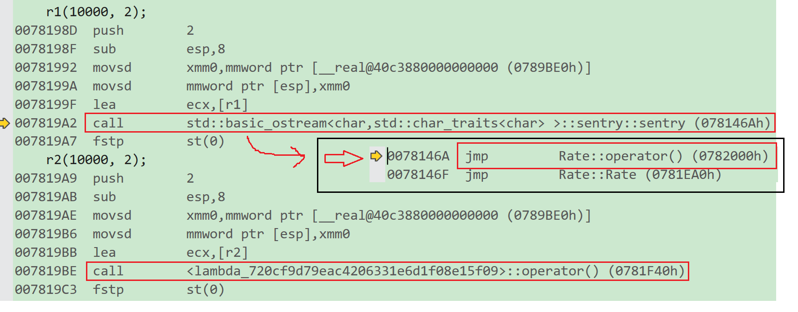

# 函数指针的简化需求

在算法库`algorithm`中有不少函数和`sort`一样需要用户上传支持随机迭代器的容器和比较用的函数。

```cpp
template <class RandomAccessIterator>
void sort (RandomAccessIterator first, RandomAccessIterator last);
template <class RandomAccessIterator, class Compare>
void sort (RandomAccessIterator first, RandomAccessIterator last, Compare comp);
```

第3个参数`comp`可以是lambda表达式，可以是仿函数，也可以是函数名或函数指针，只要能通过`()`给出`bool`值即可。这时`sort`会根据第3个参数的比较结果来进行排序。

比如第3个参数要求2个形参是某个关键字之间呈 `<` 关系，则最后整个数据都会是按照某种关键字升序。

若是自定义类型，可能需要自己设计比较函数。

```cpp
#define _CRT_SECURE_NO_WARNINGS 1
#include<iostream>
#include<algorithm>
#include<vector>
using namespace std;

struct Goods {
	string _name;// 名字
	double _price;// 价格
	int _evaluate; // 评价
	Goods(const char* str, double price, int evaluate)
		:_name(str)
		, _price(price)
		, _evaluate(evaluate) {}
};

struct ComparePriceLess {
	bool operator()(const Goods& gl, const Goods& gr) {
		return gl._price < gr._price;
	}
};

struct ComparePriceGreater {
	bool operator()(const Goods& gl, const Goods& gr) {
		return gl._price > gr._price;
	}
};

int main() {
	vector<Goods> v = { 
		{ "苹果", 2.1, 5 }, 
		{ "香蕉", 3, 4 }, 
		{ "橙子", 2.2,3 }, 
		{ "菠萝", 1.5, 4 } 
	};
	sort(v.begin(), v.end(), ComparePriceLess());
	sort(v.begin(), v.end(), ComparePriceGreater());
	return 0;
}
```

随着C++语法的发展，人们开始觉得上面的写法太复杂了，每次为了实现一个`algorithm`算法，都要重新去写一个类，如果每次比较的逻辑不一样，还要去实现多个类，特别是相同类的命名，这些都给程序员带来了极大的不便。因此，在C++11语法中出现了lambda表达式。

> c++11也有受到其他语言的启发，lambda最开始是`python`先弄出来的。
>
> c++11引入其他语言的优秀设计这样的现象不止一处，之前的范围 `for` 循环也是受到 java 的 `for` 循环的启发。

# lambda表达式

上述程序的排序可这样写：

```cpp
#define _CRT_SECURE_NO_WARNINGS 1
#include<iostream>
#include<algorithm>
#include<vector>
using namespace std;

struct Goods {
	string _name;// 名字
	double _price;// 价格
	int _evaluate; // 评价
	Goods(const char* str, double price, int evaluate)
		:_name(str)
		, _price(price)
		, _evaluate(evaluate) {}
};

int main() {
	vector<Goods> v = { 
		{ "苹果", 2.1, 5 }, 
		{ "香蕉", 3, 4 }, 
		{ "橙子", 2.2,3 }, 
		{ "菠萝", 1.5, 4 } 
	};
    //按价格升序
	sort(v.begin(), v.end(), 
		[](const Goods& g1, const Goods& g2) {
		return g1._price < g2._price; });
    //按价格降序
	sort(v.begin(), v.end(), 
		[](const Goods& g1, const Goods& g2) {
		return g1._price > g2._price; });
    
    //按评价升序
	sort(v.begin(), v.end(), 
		[](const Goods& g1, const Goods& g2) {
		return g1._evaluate < g2._evaluate; });
    
    //按评价降序
	sort(v.begin(), v.end(), 
		[](const Goods& g1, const Goods& g2) {
		return g1._evaluate > g2._evaluate; });
	return 0;
}
```

这个函数就是lambda表达式，也可以叫lambda函数。

```cpp
[](const Goods& g1, const Goods& g2) {
		return g1._evaluate > g2._evaluate; }
```

## lambda表达式语法

lambda表达式书写格式：
`[capture-list] (parameters) mutable -> return-type { statement}`

* `[capture-list]` : 捕捉列表，该列表总是出现在lambda函数的开始位置，编译器根据`[]`来判断接下来的代码是否为lambda函数，捕捉列表能够**捕捉上下文中的变量**供lambda函数使用。

  捕捉列表描述了上下文中那些数据可以被lambda使用，以及使用的方式传值还是传引用。

  * `[]`：表示函数不会捕捉也不会访问父作用域的变量，只能访问全局变量、静态变量、lambda 本身的参数。

  * `[var]`：表示值传递方式捕捉变量`var`。

  * `[=]`：表示值传递方式捕获所有父作用域中的变量（若在类的成员函数中还包括`this`指针）。

  * `[&var]`：表示引用传递捕捉变量`var`（`&val`指取`val`的地址，但在这里多了一个特例）。

    > lambda表达式中`[]`内的`&val`很容易和取地址混淆，需要当成特例来看（一般的引用都是类型`& 引用名=变量`）。传引用的目的就是为了修改，所以不受`mutable`的影响，mutable不加也可以。
    >
    > 这个东西并不是特例，例如之前实现`operator->`时，逻辑自洽的情况应该是`it.operator()->()->first`，`it`是实例化的迭代器。因为`operator->`返回的是类型的指针。

  * `[&]`：表示引用传递捕捉所有父作用域中的变量（包括`this`指针）。

  * `[this]`：表示值传递方式捕捉当前的`this`指针。

  其中需要注意的点：

  * 父作用域指包含 lambda 函数的语句块。

  * 语法上捕捉列表可由多个捕捉项组成，并以逗号分割。比如：`[=, &a, &b]`：以引用传递的方式捕捉变量`a`和`b`，值传递方式捕捉其他所有变量`[&，a, this]`：值传递方式捕捉变量`a`和`this`，引用方式捕捉其他变量。

  * 捕捉列表不允许变量重复传递，否则就会导致编译错误。
    比如：`[=, a]`：`=`已经以值传递方式捕捉了所有变量，捕捉`a`重复。
  * 在块作用域以外的 lambda 函数捕捉列表必须为空。
  * 在块作用域中的lambda函数仅能捕捉父作用域中局部变量，捕捉任何非此作用域或者非局部变量都会导致编译报错。
  * lambda表达式之间不能相互赋值，即使看起来类型相同

* `(parameters)`：参数列表。与普通函数的参数列表一致，如果不需要参数传递，则可以连同`()`一起省略。

* `mutable`：默认情况下（指不写`mutable`），lambda函数总是一个`const`函数，`mutable`可以**取消其常量性**。使用该修饰符时，参数列表不可省略，即使参数为空。

* `->returntype`：**返回值类型**。用追踪返回类型形式声明函数的返回值类型，没有返回值时此部分**可省略**。返回值类型明确情况下，也可省略，由编译器对返回类型进行推导。

* `{statement}`：函数体。在该函数体内，除了可以使用其参数外，还可以使用所有捕获到的变量。

在lambda函数定义中，参数列表和返回值类型都是可选部分，而捕捉列表和函数体可以为空。因此C++11中最简单的lambda函数为：`[]{};` 该lambda函数不能做任何事情。

lambda 表达式实际上可以理解为无名函数，该函数无法直接调用，如果想要直接调用，可借助`auto`将其赋值给一个变量。

简单体验lambda函数：

```cpp
#define _CRT_SECURE_NO_WARNINGS 1
#include<iostream>
using namespace std;

double pi = 3.14;

void f1() {
	int a = 1;
	static double e = 2.718;
	auto f = []() {
		//cout << a << endl;//无法捕捉父作用域的局部变量
		cout << pi << endl;//可以捕捉全局变量
		cout << e << endl;//可以捕捉静态局部变量
	};
	f();
	a = 2;
	cout << a << endl;
}

void f2() {
	int a = 1;

	auto f = [a]() {
		//指定捕捉局部变量a
		//a = 2;//捕捉的a无法修改
		cout << a << endl;
	};

	auto g = [a]()mutable {
		a = 2;//mutable去掉函数的常属性
		cout << a << endl;
	};

	f();
	cout << a << endl;
	g();
	cout << a << endl;//但g内的修改无法影响父作用域的变量
}

void f3() {
	int a=1, b=2;
	auto f = [=]() {//=捕获所有变量
		cout << a << ' ' << b << endl;
	};
	f();
	auto g = [&a]() {//引用传递捕捉变量a，可直接修改
		a = 3;
	};
	g();
	cout << a << ' ' << b << endl;
}

void f4() {
	int a = 1, b = 2;
	auto f = [&]() {//引用捕获所有变量，可修改
		a += 10;
		b += 20;
	};
	f();
	cout << a << ' ' << b << endl;
}

void f5() {
	class A {
	public:
		void test() {
			auto f = [this]() {
				cout << this->a << endl;
				this->a = 3;//不仅可访问，还可修改
				cout << this->a << endl;
				a = 4;
				cout << this->a << endl;
			};
			f();
		}
		int a = 0;
	};
	A().test();

	auto f = []()->int {//指定返回值为int
		return 3;//不指定的话会自动推演
	};
	cout << f() << endl;
}

int main() {
	//f1();//lambda函数无捕获
	//f2();//捕获变量和取消函数常属性
	//f3();//捕获所有变量
	//f4();//引用捕获
	f5();//捕获this和指定返回值
	return 0;
}
```

## lambda 的实质

```cpp
#include<iostream>
using namespace std;

class A{};

int main() {
	auto f1 = [] {};
	auto f2 = [] {};
	cout << typeid(f1).name() << endl;
	cout << typeid(f2).name() << endl;
	cout << typeid(A).name() << endl;
	return 0;
}
```

输出结果之一：

```cpp
class <lambda_f2c76bd8d1ab2561bb40bc98354c0175>
class <lambda_bfeb535a5c65268cd0ad93d19ea5295c>
class A

```

可以看到 lambda 本质还是一个类，这说明在编译的过程中生成了类，而且很可能是仿函数。看到的名字一般都是uuid。uuid是系统（或编译器）为某个对象取的唯一标识。详细见[UUID_百度百科](https://baike.baidu.com/item/UUID/5921266?fr=aladdin)。因为每次使用lambda都要保证生成的函数互不相同，所以每次运行都会为lambda函数生成不同的uuid。

lambda表达式和STL的仿函数的使用方式完全相同，都是确定名称后和普通的函数调用一样适用即可。

实际在底层编译器对于 lambda 表达式的处理方式，完全就是按照函数对象的方式处理的，即：如果定义了一个 lambda 表达式，编译器会自动生成一个类，在该类中重载了`operator()`。

例如：

```cpp
#define _CRT_SECURE_NO_WARNINGS 1
#include<iostream>
using namespace std;

class Rate {
public:
	Rate(double rate) 
		: _rate(rate) {}
	double operator()(double money, int year) {
		return money * _rate * year;
	}
private:
	double _rate;
};

int main() {
	// 函数对象
	double rate = 0.49;
	Rate r1(rate);
	// lambda
	auto r2 = [=](double monty, int year)->double
	{return monty * rate * year;};

	r1(10000, 2);
	r2(10000, 2);
	return 0;
}
```

通过vs2019的反汇编可以看到，lambda的实质还是仿函数。只是编译器自动完成了类的生成和捕获变量的管理。



# 包装器function

C++中的`function`本质是一个类模板，也是一个包装器。

`function`用于包装可调用对象：函数指针、仿函数和 lambda 表达式，在很多地方需要回调，需要将函数变成可调用对象，比如：将函数作为容器的数据类型进行统一调度。

函数指针、仿函数和lambda表达式可通过`function`进行统一包装。使用`function`需要展开头文件`functional`。

## 简单使用function

```cpp
#include<iostream>
#include<functional>
#include<map>
using namespace std;

void swap_func(int& r1, int& r2) {
	int tmp = r1;
	r1 = r2;
	r2 = tmp;
}

struct Swap {
	void operator()(int& r1, int& r2) {
		int tmp = r1;
		r1 = r2;
		r2 = tmp;
	}
};

int main() {
	int x = 0, y = 1;
	cout << x << " " << y << endl;

	auto swaplambda = [](int& r1, int& r2) {
		int tmp = r1;
		r1 = r2;
		r2 = tmp;
	};

	function<void(int&, int&)> f1 = swap_func;
	cout << typeid(f1).name() << endl;
	f1(x, y);
	cout << x << " " << y << endl << endl;

	function<void(int&, int&)> f2 = Swap();
	f2(x, y);
	cout << x << " " << y << endl << endl;

	function<void(int&, int&)> f3 = swaplambda;
	f3(x, y);
	cout << x << " " << y << endl << endl;

	//将函数放进容器
	map<string, function<void(int&, int&)>> cmdOP = {
		{"函数指针", swap_func},
		{"仿函数", Swap()},
		{"lambda", swaplambda},
	};

	cmdOP["函数指针"](x, y);
	cout << x << " " << y << endl << endl;

	cmdOP["仿函数"](x, y);
	cout << x << " " << y << endl << endl;

	cmdOP["lambda"](x, y);
	cout << x << " " << y << endl << endl;

	return 0;
}
```

输出：

```
0 1
class std::function<void __cdecl(int &,int &)>
1 0

0 1

1 0

0 1

1 0

0 1

```

凡是需要通过指令调用函数的场景都需要使用`function`包装器。这里的`[string:functional<int&,int&>]`中`string`很可能就是一个指令，用于调用指定接口，类似cmd的指令。

## function包装类的成员函数

成员函数取地址要加类域和`&`，不能简单地通过类域和函数名（`类名::函数名`）获得。

包装器**包装类的成员函数**，需要**加上类的指针**，**调用**时还要**上传对象的地址**。注意**不可上传匿名对象的地址**，因为匿名对象是右值，右值不能取地址。

包装器**不能直接包装类的非静态成员函数**，因为这种成员都有隐藏的`this`指针，导致类型不匹配。

除了类的指针，也可以直接用**类名推导**`function`。这是编译器的特殊处理，上传类名可让编译器将函数指针识别为这个类的成员函数，之后就可以上传匿名对象。

```cpp
#include<iostream>
#include<functional>
using namespace std;

class A {
public:
	static int add(int x, int y) {
		return x + y;
	}
	int add2(int x, int y) {
		return x + y;
	}
};

int main() {
	//静态成员函数2种都可以
	function<int(int, int)> f1 = A::add,f2;
	f2 = &A::add;
	cout << f1(1, 2) << ' ' << f2(3, 5) << endl;
	//非静态成员函数的地址要加&取地址
	// 因成员函数有this指针，所以类型不匹配
	//function<int(int, int)>f3 = A::add2;
	//function<int(int, int)>f3 = &A::add2;

	//上传类的指针作为参数就行，
	// 非静态成员函数的地址要加&取地址
	//function<int(A*,int, int)>f3 = A::add2;
	function<int(A*,int, int)>f3 = &A::add2;
	A aa;
	cout << f3(&aa, 1, 2) << endl;

	//匿名对象是右值
	//cout << f3(&A(), 1, 2) << endl;

	//这样构建时就能用匿名对象作为形参上传
	function<int(A, int, int)>f4 = &A::add2;
	cout << f4(A(), 1, 2) << endl;
	return 0;
}
```

即使这样，成员函数的包装还是很繁琐（指本来可以不指定类名，但现在要指定）。

# 适配器bind

传统STL中的`std::bind1st`/`std::bind2nd`（C++11后已废弃），现在主要用`std::bind`。`std::bind`函数定义在头文件中，它的原型：

```cpp
template <class Fn, class... Args>
  /* unspecified */ bind (Fn&& fn, Args&&... args);
template <class Ret, class Fn, class... Args>
  /* unspecified */ bind (Fn&& fn, Args&&... args);
```

`std::bind`是一个函数模板（但没有给定返回值），它就像一个（函数）适配器，接受一个可调用对象（callable object），生成一个新的可调用对象，生成一个新的可调用对象来“适应”原对象的参数列表。

## bind的使用

调用`bind`的一般形式：`auto newCallable = bind(callable,arg_list);`

* `newCallable`：可调用对象。

* `arg_list`：一个逗号分隔的参数列表，对应给定的`callable`的参数。

当我们调用`newCallable`时，`newCallable`会调用`callable`，并传给它`arg_list`中的参数。

```cpp
#include<iostream>
#include<functional>
using namespace std;

int add(int x, int y) {
	return x + y;
}

int main() {
	auto f1 = bind(add, placeholders::_1, placeholders::_2);
	cout << f1(3, 4) << endl;
	cout << typeid(f1).name() << endl;
	return 0;
}

```

输出：

```
7
class std::_Binder<struct std::_Unforced,int (__cdecl&)(int,int),struct std::_Ph<1> const &,struct std::_Ph<2> const &>

```

`arg_list`中的参数可能包含形如`placeholders::_n`的名字，其中`n`是一个整数，这些参数是“占位符”，表示`newCallable`的第 `n` 个参数，它们占据了传递给`newCallable`的参数的“位置”。数值`n`表示生成的可调用对象中参数的位置：`placeholders::_1`为`newCallable`的第一个参数，`placeholders::_2`为第二个参数，以此类推。

同时，调整`placeholders::_n`的顺序，可使`std::bind`函数还可以实现参数顺序调整的操作。

```cpp
#include<iostream>
#include<functional>
using namespace std;

int add(int x,int y) {
	cout << x << ' ' << y << endl;
	return x + y;
}

int main() {
    //更换上传的参数顺序
	auto f1 = bind(add, placeholders::_2, placeholders::_1);
	cout << f1(3, 4) << endl;
	return 0;
}
```

输出：

```
4 3
7

```

## bind绑定参数

一般而言，我们用它可以把一个原本接收`N`个参数的函数`fn`，通过**绑定一些参数**，返回一个接收`M`个（`M`可以大于`N`，但这么做没什么意义）参数的新函数。

例如之前用包装器`function`时就有包装类的成员函数，其中需要上传对象的场景就可以通过`bind`实现。

```cpp
#include<iostream>
#include<functional>
using namespace std;

class Add {
public:
	int add(int x, int y) {
		return x + y;
	}
};

int add(int x, int y) {
	return x + y;
}

int main() {
	Add a;
	function<int(int, int)>f =
		bind(&Add::add, &a, placeholders::_1, placeholders::_2);
	cout << f(3, 4) << endl;

	function<int(int)> g =
		bind(add, 66, placeholders::_1);
	cout << g(3) << endl;
	return 0;
}
```

实践中很多应用，例如windows进程创建。
