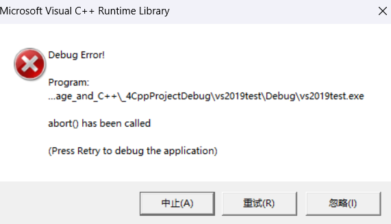
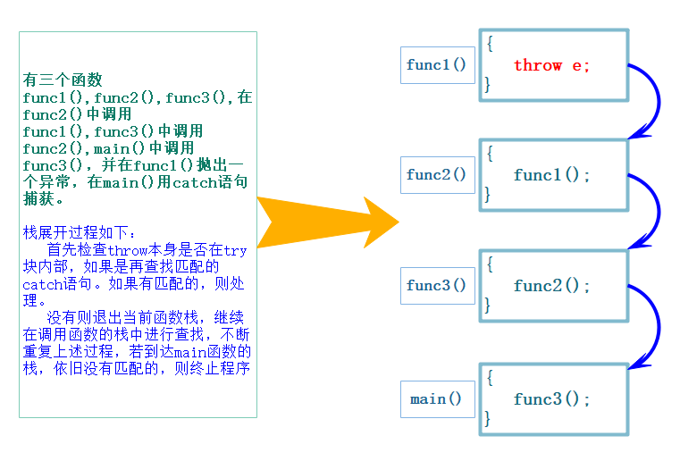
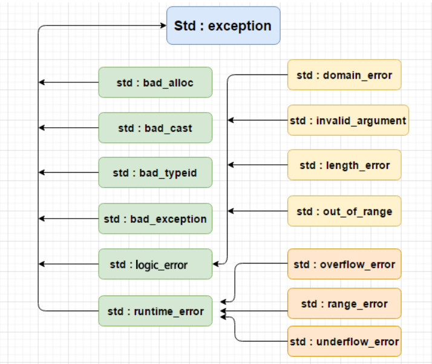
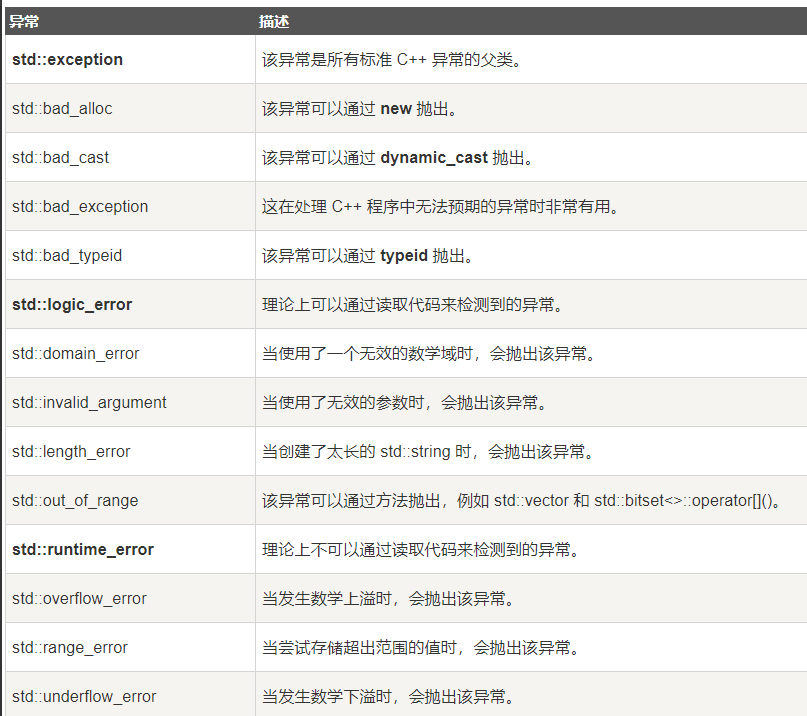
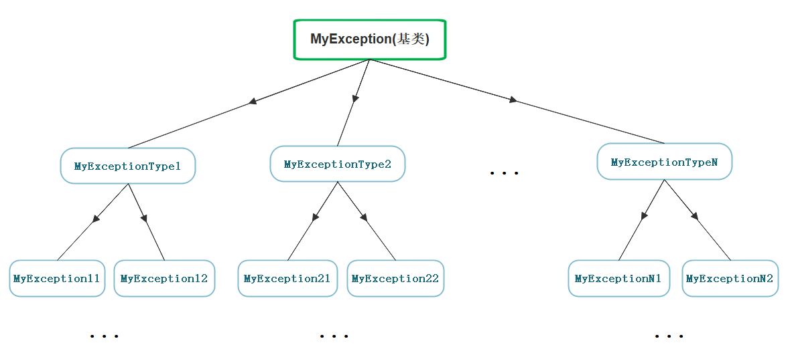

# C语言的错误处理

C语言传统的处理错误的方式或者说机制：

1. **终止程序**，如断言`assert`，缺陷：用户难以接受。如发生内存错误，除0错误时就会终止程序。且`assert`在编译环境为 Release 模式下不会生效。

   ```c
   //c语言的话展开assert.h
   #include<cassert>
   
   int main(){
       assert(false);//当括号内的bool值为false或0时触发断言
       return 0;
   }
   ```

2. **返回错误码**，缺陷：需要程序员自己去查找对应的错误。如系统的很多库的接口函数都是通过把错误码放到`errno`中，表示错误。

实际情况C语言基本都是使用返回错误码的方式处理错误，部分情况下使用终止程序处理非常严重的错误。但多数人其实是不知道错误码表示的含义是什么，得去查表差资料。

且并不是所有情况都适合直接终止程序。比如某个大型程序在某个环节出现错误时，传统的处理方式是终止程序，导致已经运行的数据没有及时存储到硬盘，造成严重损失。

而写日志只是在捕获错误以后进行记录，方便回溯进行查询，但很难做到快速反应。

更重要的是断言在Debug模式会起作用，但Release模式不会起作用。

所以c语言传统的错误处理机制存在局限性，急需改进。

# C++的异常

异常是一种**处理错误的方式**，当一个**函数**发现自己无法处理的错误时就可以抛出异常，让**函数的直接或间接的调用者**处理这个错误。

## 异常的使用

异常主要由3个关键字组成：

* `throw`: 当问题出现时，程序会**抛出一个异常**。这是通过使用 `throw` 关键字来完成的。也就是说，异常可能是人为设置，也可能是库中的函数自带（制作c++的人添加的）。

* `catch`: 在想要处理问题的地方，通过异常处理程序捕获异常。`catch` 关键字用于捕获异常，可以有多个`catch`进行捕获。

* `try`: `try` 块中的代码标识将被激活的特定异常,它后面通常跟着一个或多个 `catch` 块。

如果有一个块抛出一个异常，捕获异常的方法会使用 `try` 和 `catch` 关键字。`try` 块中**放置可能抛出异常的代码**，`try` 块中的代码被称为**保护代码**。使用 `try/catch` 语句的语法如下所示：

```cpp
try {
	//保护的标识代码
    //内部关联代码可能含throw语句
}
catch( ExceptionName e1) {
	// catch 块
}
catch( ExceptionName e2) {
	// catch 块
}
catch( ExceptionName eN) {
	// catch 块
}
//...
```

例如，这里凭空捏造的错误，抛出一个`char*`型的异常信息。

```cpp
#include<iostream>
using namespace std;

int main() {
	try {
		//抛出异常，以字符串的形式抛出
        //也可以抛别的
		throw "啥都没有，单纯抛错误";
	}
	catch (const char* e) {
		cout << e << endl;
	}
	return 0;
}

```

输出：

```
啥都没有，抛着玩的

```

若不用`try{}catch(){}`捕获抛出的异常，而是只用`throw`，程序在 Debug 模式下运行会触发断言，在 Release 模式下直接崩溃。从 `try` 中捕获的异常若匹配不到合适的 `catch`，程序也会崩溃，现象和只抛出异常一致。

通过`try{}catch(){}`，程序员可以从`catch`中获取错误信息写成日志，若错误不是很严重，可以迅速对出错的源码做出反应。

异常没有被捕获时，底层会调用`abort()`函数（MSVC）。



## 异常的抛出和匹配原则

1. 异常是通过**抛出对象而引发**的，该**对象的类型**决定了应该激活哪个 `catch` 的处理代码。若程序运行过程中没有抛出异常，则 `catch` 不会执行。

2. 被**选中的处理代码**是调用链中**与该对象类型匹配且离抛出异常位置最近**的那一个。

3. 抛出异常对象后，会**生成一个异常对象的拷贝**，因为抛出的异常对象可能是一个临时对象，所以会生成一个拷贝对象，这个拷贝的临时对象会在被`catch`以后销毁（这里的处理类似于函数的传值返回）。

   > 在c++11新增右值引用和相关联的移动构造、移动赋值后拷贝数据带来的开销会小很多。

4. `catch(...)`可以捕获任意类型的异常，问题是不知道异常错误是什么。

   > 同一个项目写不同模块的人，抛异常时需要按照规定去抛。不能因为一个未知异常就终止整个程序，所以需要设置一个`catch`能捕获任何异常。用`catch(...)`主要用于检测团队中是否有人没有按规范或没有按约定抛异常。
   >
   > 且异常没有被任何`catch`捕获等同于使用`assert`也就是断言。

   ```cpp
   #include<iostream>
   using namespace std;
   
   int main() {
   	try {
   		throw 114514;
   	}
   	catch (...) {
   		cout << "未知异常" << endl;
   	}
   	return 0;
   }
   ```

5. 实际中抛出和捕获的匹配原则有个例外，并不都是类型完全匹配，可以**抛出的派生类对象**，**使用基类捕获**，再调用父类指定的虚函数，这个虚函数在派生类有重写，这个在实际中非常实用。

   > 即写同一个项目的多人小组，每人实现部分类时对同一个父类去继承，这时每人在可能出问题的地方抛出子类对象，检查错误时只需要捕获父类的异常即可，防止有人在自己的代码里乱抛异常，不好检查的情况。

   ```cpp
   #include<iostream>
   #include<string>
   using namespace std;
   
   class Father {
   public:
   	Father()
   		:st("测试错误抛出：") {}
   	virtual string what() {
   		return st;
   	};
   protected:
   	string st;
   };
   
   class Kid :public Father {
   public:
   	Kid() {};
   	string what() {
   		return st + "测试抛出子类";
   	}
   };
   
   int main() {
   	try {
   		throw Kid();
   	}
   	catch (Father& father) {
   		cout << father.what() << endl;
   	}
   	return 0;
   }
   
   ```

   输出：

   ```
   测试错误抛出：测试抛出子类
   
   ```

   


## 函数调用链中异常栈展开匹配原则

1. 首先检查`throw`本身是否在`try`块内部，如果是再查找匹配的`catch`语句，不是则直接终止程序（断言或崩溃）。如果有匹配的，则调到最近且和抛出的异常的类型匹配的`catch`所在的`{}`内进行处理。

2. 没有匹配的`catch`则退出当前函数栈，继续在调用函数的栈中进行查找匹配的`catch`。

3. 如果到达`main`函数的栈，依旧没有匹配的，则终止程序（断言或崩溃）。上述这个沿着调用链查找匹配的`catch`子句的过程称为**栈展开**。所以实际中最后都要加一个`catch(...)`捕获任意类型的异常，否则当有异常没捕获，程序就会直接终止。

4. 找到匹配的`catch`子句并处理以后，会继续沿着`catch`子句后面继续执行。



这个程序将展示异常的抛出和匹配原则。

```cpp
#include<iostream>
using namespace std;

double Division(int len, int time) {
	if (time == 0)
        //抛出char*型的异常
		throw "除0错误";
	else
		return (double)len / (double)time;
}

void Func1() {
	try {
		int len=3, time=0;
		//cin >> len >> time;
		cout << Division(len, time) << endl;
		cout << "金恩是酒厂卧底";//Division抛出异常，这里不会执行
	}
	catch (const int s) {//和抛出的异常不匹配
		cout << "Func1()内的catch" << endl;
		cout << s << endl;
	}
	cout << "xxxxxxxxxxxx" << endl;
}

void Func2() {
	try {
		int len = 3, time = 0;
		//cin >> len >> time;
		cout << Division(len, time) << endl;
		cout << "金恩是酒厂卧底";//Division抛出异常，这里不会执行
	}
	catch (const char* s) {//和抛出的异常匹配
		cout << "Func1()内的catch" << endl;
		cout << s << endl;
	}
	cout << "xxxxxxxxxxxx" << endl;
}

int main() {
	try {//{}不能省略
		Func1();
	}
	catch (const char* str) {
		cout << "main()内的catch" << endl;
		cout << str << endl;
	}
	cout << endl;
	try {
		Func2();
	}
	catch (const char* str) {
		cout << "main()内的catch" << endl;
		cout << str << endl;
	}
	return 0;
}
```

输出：

```
main()内的catch
除0错误

Func1()内的catch
除0错误
xxxxxxxxxxxx

```

分析：
首先函数栈里调用的函数顺序依次是`main`、`Func1`、`Division`。后`Division`因提前设计好的除0错误抛出异常，`Division`内无`try-catch`语句块，所以退出`Division`的函数栈帧，在`Func1`的`catch`，因为类型不匹配（抛出的异常是`const char*`型，而`Func1`的`catch`是`const int`型），于是`Func1`的函数栈也弹出。在`main`函数中终于找到匹配异常的`catch`语句块，于是执行`catch`语句块后，继续执行下一个`try-catch`语句。

`main`、`Func2`、`Division`的函数调用顺序也是如此，但因为`Func2`内有匹配的`catch`语句，所以调用`Func2`中的`catch`语句块后，继续执行后续的
`cout << "xxxxxxxxxxxx" << endl;`。弹出`Func2`的函数栈后，回到`main`函数，因为没有匹配`main`函数的异常（一个异常匹配一个`catch`语句块，且`catch`语句块中没有抛出新的异常），所以程序结束。

此外还有一个特性：一旦抛出异常，抛出异常的地方，之后的语句将不会执行，而是直接跳转寻找合适的`catch`语句块。但之前的语句该进行还是得进行，函数栈帧也能正常销毁。`catch`结束后的语句也会正常执行。

例如这个代码，`A`类对象`bb`并不会创建，但`aa`的基本工作不会变。

```cpp
#include<iostream>
#include<string>
using namespace std;

class A {
public:
	A() {
		cout << "A()" << endl;
	}
	~A() {
		cout << "~A()" << endl;
	}
};

double Division(int len, int time) {
	if (time == 0) {
		throw "除0错误";
	}
	else {
		return (double)len / (double)time;
	}
}

void Func() {
	A aa;//aa的构造和析构会正常调用
	cout << "aa创建\n";
	int len, time;
	//cin >> len >> time;
	len = 3; time = 0;
	cout << Division(len, time) << endl;//异常从这里抛出并在函数栈中传递
	A bb;//这里并不会调用
	cout << "bb创建\n";
}

int main() {
	try {
		Func();
	}
	catch (const char* str) {
		cout << str << endl;
	}

	return 0;
}
```

输出：

```
A()
aa创建
~A()
除0错误

```


# 异常的使用规范

## 内存泄漏的规避

在使用异常时可能会出现这样的情况：在`try`语句块中或之前存在资源申请，然后中间某个语句或某个函数抛出异常时，导致资源没能及时释放。

```cpp
void test{
    try{
        int* p = new int[100000]{0};
        test2();//假设这里抛出了异常，则后续的delete[]不会执行，造成内存泄漏
        delete[] p;
    }
    catch(const char* e){
        //...
    }
}
```

最好的解决方式是在所有使用`new`的地方都设置`try`，然后在相关的`catch`进行`delete`操作。`delete`完后在`catch`中再抛异常。

这是比较常见的**异常的重新抛出**：有可能单个的`catch`不能完全处理一个异常，在进行一些校正处理以后，希望再交给更外层的调用链函数来处理，`catch`则可以通过重新抛出将异常传递给更上层的函数进行处理。

```cpp
#include<iostream>
#include<string>
using namespace std;

double Division(int a, int b) {
	// 当b == 0时抛出异常
	if (b == 0) {
		throw "Division by zero condition!";
	}
	return (double)a / (double)b;
}

void Func() {
	int* array = new int[10];
	try {
		int len, time;
		//cin >> len >> time;
		len = 3; time = 0;
		cout << Division(len, time) << endl;
	}
	catch (...) {
		cout << "delete []" << (void*)array << endl;
		delete[] array;
		throw;//catch(...)捕获到什么异常，这里就抛什么
        //若不重新抛出异常，这个catch结束后依旧会执行catch(...)后的语句
	}
	// ...
	cout << "delete []" << (void*)array << endl;
	delete[] array;
}

int main() {
	try {
		Func();
	}
	catch (const char* errmsg) {
		cout << errmsg << endl;
	}
	return 0;
}
```

这里可以看到如果发生除0错误抛出异常，首先被`catch(...)`捕获，先将在这个函数栈帧内申请的外部资源释放，再将异常传递。在这里的`catch(...)`捕获异常后并不处理异常，而是处理申请的外部资源等安全问题，异常还是交给外面其他的`catch`处理，通过将异常重新重新抛出去的方式。

但若是这个场景：

```cpp
void Func() {
	int* array1 = new int[10];
	int* array2 = new int[10];
	try {
		int len, time;
		//cin >> len >> time;
		len = 3; time = 0;
		cout << Division(len, time) << endl;
	}
	catch (...) {
		delete[] array1;
		throw;
	}
	delete[] array2;
}
```

情况1：`int* array1 = new int[10];`抛异常（`new`抛的异常），直接弹出`Func`的函数栈帧，这没什么问题。

情况2：`int* array2 = new int[10];`抛异常，直接弹出`Func`的函数栈帧，导致`array1`申请的资源没来得及释放，导致内存泄漏。

因此异常对内存泄漏的规避所能做的也很有限。

类似的场景还有：

1. 构造函数完成对象的构造和初始化，最好不要在构造函数中抛出异常，否则可能导致对象不完整或没有完全初始化。
2. 析构函数主要完成资源的清理，最好不要在析构函数内抛出异常，否则可能导致**资源泄漏**（内存泄漏、句柄未关闭等）。

这些资源泄漏的问题，比如在`new`和`delete`中抛出了异常，或捕捉异常时处理不到位，导致内存泄漏，c++经常使用RAII来解决以上问题，关于RAII详见智能指针。


## 异常规范

1. 异常规范（异常规格说明）的目的是为了让函数使用者知道该函数可能抛出的异常有哪些。 可以在函数的后面接`throw(类型)`，列出这个函数可能抛掷的所有异常类型。

   c++98的`throw(类型)`只是提示可能会出什么类型的异常，并不限制函数抛出的异常种类。实际情况程序员可能都不知道自己写的代码会抛什么异常，或者就算知道也不一定会遵守规则列出来。所以这套规则实际上很少人用。

2. 函数的后面接`throw()`，表示函数不抛异常。

   在c++11新增关键字`noexcept`，用于告诉编译器函数不会抛出异常。

   但需要注意，若使用了`noexcept`，但函数中仍然抛处了异常，则这个异常不会被捕获，程序会直接崩溃。

   例如这个程序，`f()`使用了`noexcept`修饰，但内部依旧抛出了异常，运行这个程序会导致程序直接崩溃。

   ```cpp
   #include<iostream>
   #include<vector>
   #include<exception>
   using namespace std;
   
   void f() noexcept {
   	throw 6;
   }
   
   int main() {
   	try {
   		f();
   	}
   	catch (...) {
   		cout << "ababa" << endl;
   	}
   	return 0;
   }
   ```

   

3. 若无异常接口声明（`noexcept`），则此函数可以抛掷任何类型的异常。

其他的经验总结：

异常最好包含 id（错误编号）和错误描述。因为需要针对某些错误做针对性处理。例如有的异常可能是某种现象例如某种请求超时（例如微信发信息没发出去），可能是请求还在等待，这时应该重新请求。


## 异常体系

c++ 提供了一系列标准的异常，定义在`exception`头文件中，我们可以在程序中使用这些标准的异常。它们是以父子类层次结构组织起来的，箭头表示继承关系。如下所示：



在c++学习早期，见得最多的异常是`std::bad_alloc`（内存申请异常）和`std::out_of_range`（越界访问）。下面是对上面层次结构中出现的每个异常的说明：



实际中我们可以去继承`exception`类实现自己的异常类，这样就只需设置`catch(const exception& e){//处理e.what()}`即可，这个`what()`是`exception`的虚函数`what`，实际调用时用的是子类重写的版本。例如这里演示`vector`的越界异常抛出：

```cpp
#include<iostream>
#include<vector>
#include<exception>
using namespace std;

int main() {
	try {
		vector<int>a;
		//vector的[]不会抛出异常，要用at
		cout << a.at(1) << endl;
	}
	//2个都可以，out_of_range是exception的子类
	catch (const out_of_range& e) {
		cout << e.what() << endl;
	}
	catch (const exception& e) {
		cout << e.what() << endl;
	}
	return 0;
}
```

输出：

```cpp
invalid vector subscript

```

> 早期 C++ 标准库更倾向于信任程序员自行保证安全性，因此`operator[]`没有对越界进行检查，保持和 c 语言一样的风格。
>
> 但总有不讲武德的程序员，总是设计出越界的场景（例如输入数据），于是新增一个`at`弥补`[]`不会抛出异常的缺陷，但又保留有`[]`，提供了灵活的选择。

但实际上截止今日（2025年8月），很多公司都会自定义自己的异常体系进行规范的异常管理，因为一个项目中如果大家随意抛异常，那么外层的调用者基本就没办法玩了，所以实际中都会定义一套继承的规范体系。所以异常体系是不统一的（指各个异常体系百家争鸣，官方有体系但大伙有不用官方的）。

继承体系的原理大致都是多态：通过子类对父类的虚函数的重写，遇到情况时抛出子类对象，在`catch`处将捕获的异常用父类的指针或引用进行输出。这样大家抛出的都是继承的派生类对象，捕获一个基类就可以了。但在继承的基础上还有很多细节，取决于定制体系的公司或第三方。




# 异常的优缺点

C++异常的优点：

1. 异常对象定义好了，相比错误码的方式可以清晰准确的展示出错误的各种信息，甚至可以包含堆栈调用的信息，这样可以帮助更好的定位程序的 bug 。

2. 返回错误码的传统方式有个很大的问题就是，在函数调用链中，深层的函数返回了错误，那么我们得层层返回错误，最外层才能拿到错误，具体看下面的详细解释。

3. 很多的第三方库都包含异常，比如`boost`、`gtest`（谷歌的单元测试框架）、`gmock`（也是谷歌的测试框架）等等常用的库，那么我们使用它们也需要使用异常。

4. 部分函数使用异常更好处理，比如构造函数没有返回值，不方便使用错误码方式处理。比如`T&`、` operator`这样的函数，如果`pos`越界了只能使用异常或者终止程序处理，没办法通过返回值表示错误。

C++异常的缺点：

1. 异常会导致程序的执行流乱跳，并且非常的混乱，并且是运行时出错抛异常就会乱跳。这会导致我们跟踪调试时以及分析程序时，比较困难。

2. 异常会有一些性能的开销。当然在现代硬件速度很快的情况下，这个影响基本忽略不计。

3. C++没有垃圾回收机制，资源需要自己管理。有了异常非常容易导致内存泄漏、死锁等异常安全问题。这个需要使用RAII来处理资源的管理问题。学习成本较高。

4. C++标准库的异常体系定义得不好，导致大家各自定义各自的异常体系，非常的混乱。

   > java就规范得很好。c++的官方、公司、第三方都规定自己的异常体系。但c++就十分的混乱，官方弄了一套，有的公司自己弄了一套，第三方又弄了一套。
   >
   > 所以还需要有智能指针。

5. 异常尽量规范使用，否则后果不堪设想，随意抛异常，外层捕获的用户苦不堪言。所以异常规范有两点：

   一、抛出异常类型都继承自一个基类。

   二、函数是否抛异常、抛什么异常，都使用 `func() throw()`或`func() noexcept`的方式规范化。

**总结**：异常总体而言，利大于弊，所以工程中我们还是鼓励使用异常的。另外OO（面向对象）的语言基本都是用异常处理错误，这也可以看出这是大势所趋。


