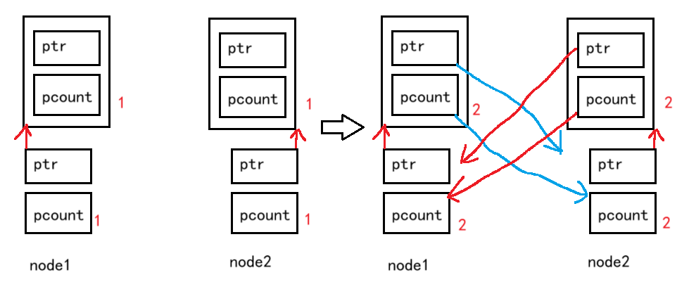
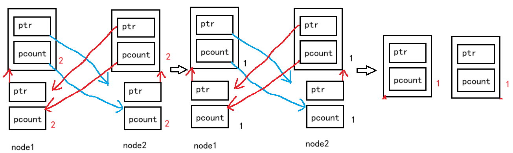

# 为什么需要智能指针

下面我们先分析一下下面这段程序有没有什么**内存方面**的问题。

```cpp
int div() {
	int a, b;
	cin >> a >> b;
	if (b == 0)
		throw invalid_argument("除0错误");
	return a / b;
}

void Func() {
	// 这里存在安全隐患
	int* p1 = new int;
	int* p2 = new int;
	cout << div() << endl;
	delete p1;
	delete p2;
}

int main() {
	try {
		Func();
	}
	catch (exception& e) {
		cout << e.what() << endl;
	}
	return 0;
}
```

在函数`Func`中：

1. 如果`p1`这里`new`抛异常，由于`p1`和`p2`都未被成功分配，因此没有内存泄漏。
2. 如果`p2`这里`new`抛异常，由于`p1`已经分配但未被释放，会导致`p1`指向的内存泄漏。
3. 如果`div`调用这里又会抛异常，由于`p1`和`p2`已经成功分配，这会导致`p1`和`p2`指向的内存泄漏。

关于内存泄漏，详见[c++内存管理和new、delete的使用-CSDN博客](https://blog.csdn.net/m0_73693552/article/details/146197288)。

这也是异常无法很好处理的资源管理问题。所以就有人想，若这个指针和类一样，自己申请资源后，即使用户忘记释放申请的资源，自身的析构函数也会自主释放资源。于是就诞生了智能指针这个概念。

> Java实现有垃圾回收机制。大致原理：
>
> Java虚拟机会将所有使用的资源记录下来，之后设计某种周期性检查资源是否有在使用的程序，检查到没有使用的资源就进行释放。
>
> 这也是Java学会怎么用很容易，但熟练掌握很难的原因。Java会用只需会用接口就行，就像C++会用各种函数和STL的工具就行，但熟练掌握需要了解垃圾回收（Garbage Collection, GC）等各种复杂的机制。
>
> C++ 是追求效率的语言，因此不可能有这种垃圾回收机制。这种机制会随时占用一部分资源来运行这个回收机制。这也是为什么很多游戏的底层用C++实现，而不是Java。

# 智能指针的使用及原理

RAII（Resource Acquisition Is Initialization）是一种**利用对象生命周期来控制程序资源**（如内存、文件句柄、网络连接、互斥量等等）的简单技术。

**在对象构造时获取资源**，接着**控制对资源的访问**使之在对象的**生命周期内始终保持有效**，最后在**对象析构的时候释放资源**。借此，我们实际上把管理一份资源的责任托管给了一个对象。这种做法有两大好处：

1. 不需要显式地释放资源。

2. 采用这种方式，对象所需的资源在其生命期内始终保持有效

所以理想的智能指针的原理：

1. 具有 RAII 特性。
2. 重载`operator*`和`opertaor->`，具有像指针一样的行为。

简单的说，让指针和普通对象一样，初始化时可以申请内存，析构时自己释放内存。根据智能指针的原理，可以设计出简易的智能指针`SmartPtr`类。

```cpp
#include<iostream>
#include<string>
using namespace std;

// 使用RAII思想设计的SmartPtr类
template<class T>
class SmartPtr {
public:
	SmartPtr(T* ptr = nullptr)
		: _ptr(ptr) {}
	~SmartPtr() {
		if (_ptr) {
			cout << "~SmartPtr：delete " << endl;
			delete _ptr;
		}
	}
    //给SmartPtr对象重载*和->让它具有指针的功能
	T& operator*() {
		return *_ptr;
	}

	T* operator->() {
		return _ptr;
	}

private:
	T* _ptr;
};
int div() {
	int a, b;
	//cin >> a >> b;
	a = 3; b = 0;
	if (b == 0)
		throw invalid_argument("除0错误");
	return a / b;
}
void Func() {
	SmartPtr<int> sp1(new int(3));
	SmartPtr<string> sp2(new string("alpha"));
	SmartPtr<pair<int, int>> sp3(new pair<int, int>(3, 4));
	cout << *sp1 << endl;
	cout << *sp2 << endl;
	cout << "[" << sp3->first << ':' << sp3->second << "]\n";
	cout << div() << endl;//当发生异常后，智能指针也能自动清理空间
}

int main() {
	try {
		Func();
	}
	catch (const exception& e) {
		cout << e.what() << endl;
	}
	return 0;
}
```

这个智能指针在申请单个对象时没什么问题，但若是申请数组，则析构函数会造成内存泄漏。根据[c++内存管理和new、delete的使用-CSDN博客](https://blog.csdn.net/m0_73693552/article/details/146197288)的结论，使用`delete`删除对象数组，会导致空间的一部分用于存储数组元素个数的数据没能释放。


# 库里的智能指针

## c++98的std::auto_ptr

C++98版本的库中就提供了`auto_ptr`的智能指针。详见[auto_ptr - C++ Reference](https://legacy.cplusplus.com/reference/memory/auto_ptr/?kw=auto_ptr)。

`auto_ptr`的实现原理：管理权转移的思想，下面简单模拟实现了一份`auto_ptr`来了解它的原理。

```cpp
template<class T>
class auto_ptr
{
public:
	auto_ptr(T* ptr)
		:_ptr(ptr) {}

	auto_ptr(auto_ptr<T>& sp)
		:_ptr(sp._ptr) {
		// 管理权转移
		sp._ptr = nullptr;
	}
	auto_ptr<T>& operator=(auto_ptr<T>& ap) {
		// 检测是否为自己给自己赋值
		if (this != &ap) {
			// 释放当前对象中资源
			if (_ptr)
				delete _ptr;
			// 转移ap中资源到当前对象中
			_ptr = ap._ptr;
			ap._ptr = NULL;
		}
		return *this;
	}
	~auto_ptr() {
		if (_ptr) {
			cout << "delete:" << _ptr << endl;
			delete _ptr;
		}
	}
	// 像指针一样使用
	T& operator*() {
		return *_ptr;
	}
	T* operator->() {
		return _ptr;
	}
private:
	T* _ptr;
};
```

但它是一个失败的设计，很多公司明确要求不能使用`auto_ptr`。因为这个指针之间的拷贝构造是浅拷贝，在使用不当的情况会导致同一片空间被析构2次，即使明确提示了交换管理权，但总有人不按规定使用。例如这个使用会导致越界访问：

```cpp
int main() {
	auto_ptr<int> sp1(new int);
	auto_ptr<int> sp2(sp1); // 管理权转移
	// sp1悬空
	*sp2 = 10;
	cout << *sp2 << endl;
	cout << *sp1 << endl;//sp1实际被架空
	return 0;
}
```

指针比较特殊，不能使用深拷贝，因为使用指针的目的是管理资源，这种拷贝行为的初衷是2个指针管理同一片空间。


## c++11的std::unique_ptr

c++98的`auto_ptr`对指针之间的拷贝设计的管理权限转移并不适用，有人就尝试禁止类的拷贝构造和赋值重载的使用。

且若只声明不实现，其他人可能会在类外自己实现。也可以将拷贝构造和赋值重载设置为私有，这是c++98的做法。

到了c++11，库里才更新智能指针实现。但问题是c++11出来之前，`boost`搞出了更好用的`scoped_ptr`、`shared_ptr`和`weak_ptr`，于是c++11就将`boost`库中智能指针精华部分吸收了过来。

[unique_ptr - C++ Reference](https://legacy.cplusplus.com/reference/memory/unique_ptr/?kw=unique_ptr)

`unique_ptr`的实现原理：简单粗暴的防拷贝，下面简单模拟实现了一份`UniquePtr`来了解它的原理。

```cpp
template<class T>
class unique_ptr {
public:
	unique_ptr(T* ptr)
		:_ptr(ptr) {}

	~unique_ptr() {
		if (_ptr) {
			cout << "delete:" << _ptr << endl;
			delete _ptr;
		}
	}

	// 像指针一样使用
	T& operator*() {
		return *_ptr;
	}
	T* operator->() {
		return _ptr;
	}
    
    //防止拷贝
	unique_ptr(const unique_ptr<T>&sp) = delete;
    
    //防止赋值
	unique_ptr<T>& operator=(const unique_ptr<T>&sp) = delete;
private:
	T* _ptr;
};
```


## c++11的std::shared_ptr

但总有人忍不住乱用指针之间的拷贝和赋值，于是就有了`shared_ptr`。

[shared_ptr - C++ Reference](https://legacy.cplusplus.com/reference/memory/shared_ptr/?kw=shared_ptr)

`shared_ptr`的原理：是通过**引用计数**的方式来实现多个`shared_ptr`对象之间共享资源。关于引用计数，在[c++STL-string的使用-CSDN博客](https://blog.csdn.net/m0_73693552/article/details/147881146)中有提到类似思想的引用计数和写时拷贝。例如：

老师晚上在下班之前都会通知，让最后走的学生记得把门锁下。

1. `shared_ptr`在其内部，给每个资源都维护了着一份计数，用来记录该份资源被几个对象共享。

2. 在对象被销毁时(也就是析构函数调用)，就说明自己不使用该资源了，对象的引用计数减一。

3. 如果引用计数是0，就说明自己是最后一个使用该资源的对象，必须释放该资源；

4. 如果不是0，就说明除了自己还有其他对象在使用该份资源，不能释放该资源，否则其他对象就成野指针了。


### 引用计数的原理

> 这里分析引用计数的理论实现：
>
> 2个或多个智能指针都指向同一片空间，智能指针类设置整型成员变量来记录有多少个指针指向空间，这样做最大的问题是，一个对象销毁，其他对象并不能及时做出反应。
>
> 设置静态整型的成员变量也不行，因为静态成员变量只能代表1个空间的信息。
>
> 用`map`或`unordered_map`设置`<T*,int>`型键值对，平时自己玩还可以，但若是放在其他地方应用，最大的隐患还是多线程的情况，这个`map`就会变成木桶，所有智能指针都要访问这个`map`，在不同线程可能会导致线程安全问题，操作系统对线程安全问题的处理方式是加锁，但加锁会导致访问效率下降。
>
> 所以最好的方式是每个空间附带一个整型变量，用来统计多少个指针指向本空间。这样每个智能指针多带1个整型指针指向空间附带的整型变量，即可达到所有智能指针都能监视空间数量的变化。

对每个空间都附带一个整型变量，用来统计多少个指针指向本空间。这样每个智能指针多带1个整型指针指向空间附带的整型变量，即可达到所有智能指针都能监视空间数量的变化。

既如此，完全可以将指向空间的指针和统计用的整型设置成同一个类：

```cpp
class share_ptr{
private:
    T* ptr;
    int* pcount;
};
```

引入引用计数的理念后，对这个智能指针的功能进行规定：

1. 拷贝构造：指针进行浅拷贝，计数变量增加。
2. 赋值重载：若成员指针指向的地址不同则允许赋值并增加计数变量。若允许成员指针指向的地址相同，则会导致计数变量混乱。
3. 析构函数：优先减去计数变量。若计数变量为0，则正式清理内存。

引用计数智能指针最开始的设计：

```cpp
namespace mystd {
	//引用计数
	template<class T>
	class shared_ptr {
	public:
		shared_ptr(T* ptr=nullptr)
			: ptr(ptr)
			, pcount(new int(1)) {}

		~shared_ptr() {
			Release();
		}
		
	private:
		void Release() {
			if (--(*pcount) == 0) {
				delete ptr;
				delete pcount;
			}
		}
	public:
		shared_ptr(const shared_ptr<T>& sp)
			:ptr(sp.ptr)
			, pcount(sp.pcount) {
			++(*pcount);
		}

		shared_ptr<T>& operator=(const shared_ptr<T>& sp) {
			if (ptr != sp.ptr) {
				Release();

				ptr = sp.ptr;
				pcount = sp.pcount;

				++(*pcount);
			}
			return *this;
		}

		// 像指针一样
		T& operator*() {
			return *ptr;
		}

		T* operator->() {
			return ptr;
		}

		int use_count() const {
			return *pcount;
		}

		T* get() const {
			return ptr;
		}
	private:
		T* ptr;
		int* pcount;
	};
}
```

智能指针会配置定制删除器，将`delete`和`delete[]`封装成仿函数后作为模板参数或初始化参数上传给智能指针，用以应对申请的空间是对象数组的情况。仿函数可以换成lambda函数。

还有一种场景，就是智能指针上传的是用`fopen`打开的文件，这时定制删除器也要上传关闭文件的`fclose`函数的封装。

若是拥有定制删除器的版本，则增加特定构造函数和修改内置的`Release`方法即可。删除器可以通过包装器`function`作为类的成员，也可以使用带缺省值的模板参数。

这里给模拟的智能指针引入包装器。

```cpp
namespace mystd {
	//引用计数
	template<class T>
	class shared_ptr {
	public:
		shared_ptr(T* ptr = nullptr)
			: ptr(ptr)
			, pcount(new int(1)) {}

		~shared_ptr() {
			Release();
		}

		template<class D>
		shared_ptr(T* ptr,D Del)
			: ptr(ptr)
			, pcount(new int(1))
			, Del(Del){}

	private:
		void Release() {
			if (--(*pcount) == 0) {
				Del(ptr);
				delete pcount;
			}
		}
	public:
		shared_ptr(const shared_ptr<T>& sp)
			:ptr(sp.ptr)
			, pcount(sp.pcount) {
			++(*pcount);
		}

		shared_ptr<T>& operator=(const shared_ptr<T>& sp) {
			if (ptr != sp.ptr) {
				Release();

				ptr = sp.ptr;
				pcount = sp.pcount;

				++(*pcount);
			}
			return *this;
		}

		// 像指针一样
		T& operator*() {
			return *ptr;
		}

		T* operator->() {
			return ptr;
		}

		int use_count() const {
			return *pcount;
		}

		T* get() const {
			return ptr;
		}
	private:
		T* ptr;
		int* pcount;
		//默认情况下删除器直接删除对象
		function<void(T*)> Del = [](T* ptr) {delete ptr; };
	};
}
```

当然这个设计和库中的设计有很大的差距，仅做参考。


### 循环引用的缺陷

若使用环境是双向循环链表的构建：

```cpp
struct ListNode {
    int data;
    shared_ptr<ListNode> prev;
    shared_ptr<ListNode> next;

    ListNode(int data=0, shared_ptr<ListNode> prev=nullptr, 
             shared_ptr<ListNode> next = nullptr)
        : data(data)
            , prev(prev)
            , next(next){}

    ~ListNode() {
        cout << "~ListNode()" << endl;
    }
};
void testListNode() {
    mystd::shared_ptr<ListNode> node1(new ListNode);
    mystd::shared_ptr<ListNode> node2(new ListNode);
    cout << node1.use_count() << endl;
    cout << node2.use_count() << endl;
    node1->next = node2;
    node2->prev = node1;
    cout << node1.use_count() << endl;
    cout << node2.use_count() << endl;
    return;
}
```

使用`shared_ptr`表示双向循环链表的个结点，对2个这样的结点进行链接操作时会发生如下变化：

1. `node1`和`node2`这两个智能指针对象指向两个节点，引用计数变成1，我们不需要手动`delete`。

2. `node1`的`next`指向`node2`，`node2`的`prev`指向`node1`，引用计数变成2。



之后程序接受，`node2`先调用析构，`node1`后调用，这中间发生的事：

1. `node1`和`node2`析构，引用计数减到1，但是`node1`的`next`还指向`node2`，`node2`的`prev`还指向`node1`。

2. 之后函数结束，`node1`和`node2`调用过1次析构函数，名义上已经不存在，但实际上它们在堆区申请的空间依旧存在。

3. `node1`和`node2`作为函数栈帧里的成员被销毁，但因为不会第2次调用析构函数，导致它们各自申请的空间依旧存在，而且这2个空间的智能指针依旧指向已经被销毁的`node1`和`node2`。




这就是智能指针对象之间的互相引用导致引用计数无法降为0，间接导致空间无法被回收造成内存泄漏的**循环引用**问题。

### c++11的std::weak_ptr

循环引用这个缺陷源于`shared_ptr`的设计缺陷，但直至目前依旧没有更好的方案可以替代`shared_ptr`，于是过去的人们新增一个`weak_ptr`来解决这一块问题。

关于`weak_ptr`见[weak_ptr - C++ Reference](https://legacy.cplusplus.com/reference/memory/weak_ptr/?kw=weak_ptr)。`weak_ptr`不是传统的智能指针，不支持 RAII，它支持`shared_ptr`的对象的赋值，但不参与引用计数。

即使不参与`shared_ptr`的引用计数，它也可以观察`shared_ptr`的引用计数变量，通过库中的函数`use_count`实现。

这里简单模拟一个`weak_ptr`，库里的`std::weak_ptr`比这个要考虑更多问题，设计比这个完善。

```cpp
namespace mystd{
    	template<class T>
	class weak_ptr {
	public:
		weak_ptr()
			:ptr(nullptr) {}

		weak_ptr(const shared_ptr<T>& sp)
			:ptr(sp.get()) {}

		weak_ptr<T>& operator=(const shared_ptr<T>& sp) {
			ptr = sp.get();
			return *this;
		}

		T& operator*() {
			return *ptr;
		}

		T* operator->() {
			return ptr;
		}
	private:
		T* ptr;
	};
}
```

之前在2个智能指针互相指向对方，或双向链表构建时造成的引用计数问题，解决的方法是将双向链表的`next`和`prev`更换成`weak_ptr`类型。

```cpp
struct ListNode {
    int data;
    mystd::weak_ptr<ListNode> prev;//这里的指针指向shared_ptr不应调整引用计数
    mystd::weak_ptr<ListNode> next;

    ListNode(int data=0, shared_ptr<ListNode> prev=nullptr, 
             shared_ptr<ListNode> next = nullptr)
        : data(data)
            , prev(prev)
            , next(next){}

    ~ListNode() {
        cout << "~ListNode()" << endl;
    }
};
```

完整的测试程序如下：

`mystd.h`

```cpp
#pragma once
#include<string>
#include<iostream>
#include<vector>
#include<cstdlib>
#include<typeinfo> 
#include<cstring>
#include<cassert>
#include<algorithm>
using std::vector;
using std::string;
using std::cout;
using std::endl;
using std::reverse;
using std::forward;

namespace mystd {
	//引用计数
	template<class T>
	class shared_ptr {
	public:
		shared_ptr(T* ptr=nullptr)
			: ptr(ptr)
			, pcount(new int(1)) {}

		~shared_ptr() {
			Release();
		}
		
	private:
		void Release() {
			if (--(*pcount) == 0) {
				delete ptr;
				delete pcount;
			}
		}
	public:
		shared_ptr(const shared_ptr<T>& sp)
			:ptr(sp.ptr)
			, pcount(sp.pcount) {
			++(*pcount);
		}

		shared_ptr<T>& operator=(const shared_ptr<T>& sp) {
			if (ptr != sp.ptr) {
				Release();

				ptr = sp.ptr;
				pcount = sp.pcount;

				++(*pcount);
			}
			return *this;
		}

		// 像指针一样
		T& operator*() {
			return *ptr;
		}

		T* operator->() {
			return ptr;
		}

		int use_count() const {
			return *pcount;
		}

		T* get() const {
			return ptr;
		}
	private:
		T* ptr;
		int* pcount;
	};

	template<class T>
	class weak_ptr {
	public:
		weak_ptr()
			:ptr(nullptr) {}

		weak_ptr(const shared_ptr<T>& sp)
			:ptr(sp.get()) {}

		weak_ptr<T>& operator=(const shared_ptr<T>& sp) {
			ptr = sp.get();
			return *this;
		}

		T& operator*() {
			return *ptr;
		}

		T* operator->() {
			return ptr;
		}
	private:
		T* ptr;
	};

	struct ListNode {
		int data;
		mystd::weak_ptr<ListNode> prev;
		mystd::weak_ptr<ListNode> next;

		ListNode(int data=0, shared_ptr<ListNode> prev=nullptr, 
			shared_ptr<ListNode> next = nullptr)
			: data(data)
			, prev(prev)
			, next(next){}

		~ListNode() {
			cout << "~ListNode()" << endl;
		}
	};
	void testListNode() {
		mystd::shared_ptr<ListNode> node1(new ListNode);
		mystd::shared_ptr<ListNode> node2(new ListNode);
		cout << node1.use_count() << endl;
		cout << node2.use_count() << endl;
		cout << endl;
		node1->next = node2;
		node2->prev = node1;
		cout << node1.use_count() << endl;
		cout << node2.use_count() << endl;
		return;
	}
}
```

`main`函数只负责调用测试用的函数。

```cpp
#include<iostream>
#include"mystd.h"
using namespace std;

int main() {
	mystd::testListNode();
	return 0;
}
```

输出：

```cpp
1
1

1
1
~ListNode()
~ListNode()

```

这里的测试可以将`mystd::`更换成`std::`，即使用库里的，结果不会发生变化。

之后智能指针的使用还包括操作系统中线程的问题，以后有机会会单独提及。

## c++11和boost中智能指针的关系

因为c++每次将某个功能引入新标准都会进行讨论，确认不会出问题或即使出问题了也能接受，才允许这个功能加入新标准。为减少这种模式对c++标准的更新速度造成的影响，于是就有了 boost 。

boost 是c++的第三方库，算是准标准库，负责c++更前沿的研发。而标准库的要求是所有编译器都要支持，因此标准库只有在确保万无一失的情况才会更新标准。c++的标准会借鉴 boost 的研发成果，将boost好用的功能加入新标准。

其中关于智能指针的历史：

1. c++ 98 中产生了第一个智能指针`auto_ptr`。

   > 个人认为，即使当初的作者因为历史原因和社会背景，设计出这种几乎无人使用的工具，也不能完全否定作者对c++的完善做出的贡献。

2. c++ `boost`给出了更实用的`scoped_ptr`和`shared_ptr`和`weak_ptr`。

3. c++ TR1，引入了`shared_ptr`等。不过注意的是TR1并不是标准版。

4. C++ 11，引入了`unique_ptr`和`shared_ptr`和`weak_ptr`。需要注意的是`unique_ptr`对应`boost`。的`scoped_ptr`。并且这些智能指针的实现原理是参考`boost`中的实现的。

