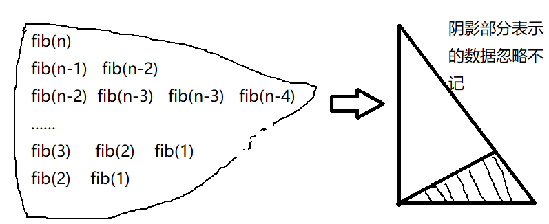
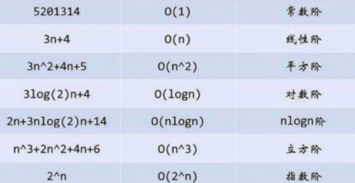
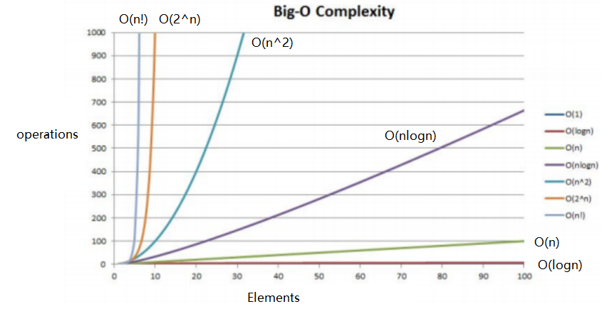
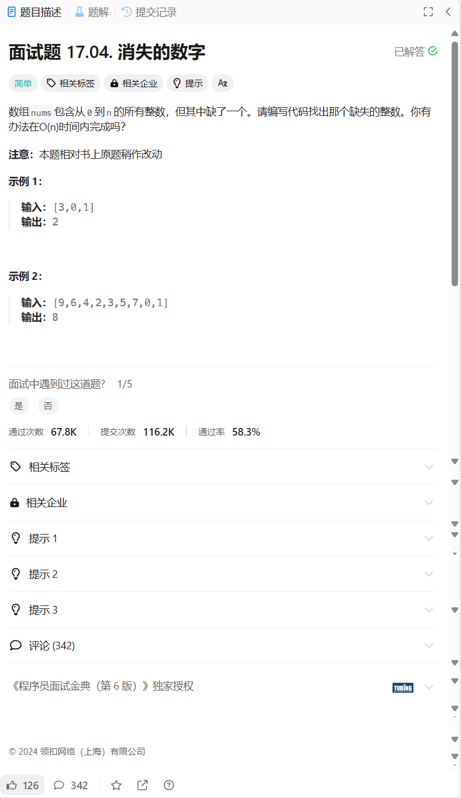
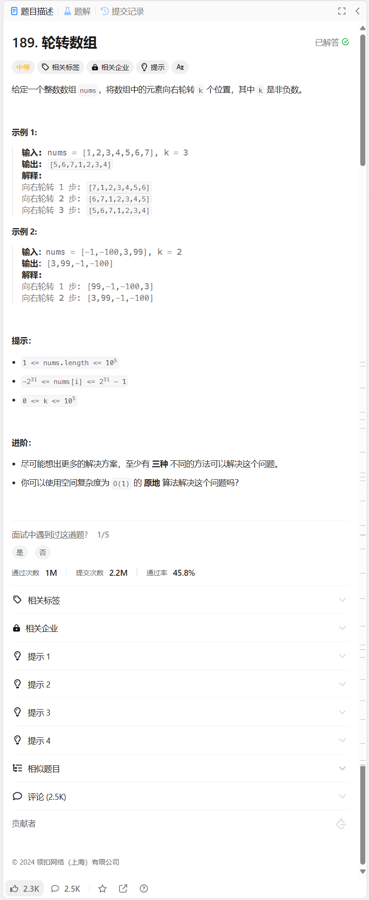
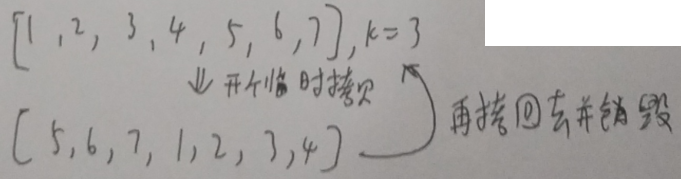
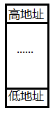
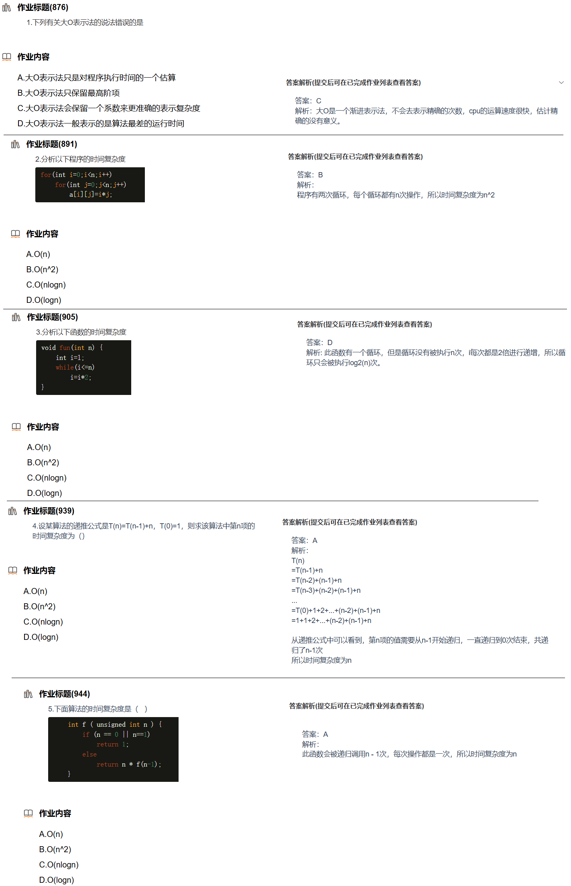

## 0.数据结构与算法杂谈

1. 数据结构与算法（Data structur and Algorithm，数据结构简称ds，算法简称alg）本质：在内存中管理数据——增、删、查、改。即ds是计算机存储、组织数据的方式，指相互之间存在一种或多种特定关系的数据元素的集合。
2. 算法：对存好的数据进行某种处理。即alg就是定义良好的计算过程，他取一个或一组的值为输入，并产生出一个或一组值作为输出。
3. ds要求的c语言的动态管理基础要会：指针、结构体、动态内存管理。
4. 微信的列表的信息本质是存在tensent(腾讯)的服务器里，展示给用户的是界面，界面不存储数据，是一个交互平台。上下互动实在遍历数组。数组是最基础的ds。
5. ds网站：[LeetCode](https://leetcode.cn/problemset/), [newcode](https://www.nowcoder.com/)。
6. ds&alg不分家，两者为一整体，彼此互相联系。ds中有alg，alg中有ds。
7. ds书籍推荐：大多书的知识点都大同小异，但代码不尽相同。
   c语言描述：严蔚敏的
   c++描述：殷人昆的
   图比较多：《大话数据结构》
   《剑指offer》（中、后期）
8. 人工智能AI的核心是机器学习。AI本质已不再试计算机语言而是数学，也就是AI算法岗。目前的算法工程师大都是AI算法岗，纯粹的算法工程师只有大厂才有且大都找好学校的ACM选手。
9. 笔记中标题标`(*)`的都是需要能手搓的。
10. LeetCode是全球程序员刷题的OJ网站。
11. Newcode提示的段错误是野指针、空指针和越界问题，它的后台是gcc和g++编译器。所以凡是出现需要访问、解引用的指针，多考虑下指针是否有权限访问。
12. 代码优先考虑可读性。
13. 关于断言`assert`：当`assert`的括号内表达式返回值为假时，阻止程序进行。断言的存在都是怕用户上传错误数据，若代码核心包容这种错误则可以不用。
14. 线上OJ分析需要分析极端场景。

## 1. 复杂度

### 1.1 时间复杂度

算法，即对已保存好的数据进行某种处理的过程。
时间复杂度是衡量算法好坏的一个指标。另一个指标是空间复杂度。即**衡量一个算法的好坏，一般是从时间和空间两个维度来衡量的**。

时间复杂度衡量算法**快慢**，

#### 1 时间复杂度的定义

**算法的时间复杂度是一个函数**，它定量描述了该算法的运行时间。

**算法中的基本操作的执行次数，为算法的时间复杂度**。描述算法的时间复杂度用大O的渐进表示法。


**大O的渐进表示法**：

**大O符号（Big O notation）：是用于描述函数渐进行为的数学符号**。

**推导大O阶方法：**

    1. 1取代加法常数运算
    2. 保留最高阶
    3. 不考虑最高阶的常数项

渐进表示法**去掉了那些对结果影响不大的项**，简洁明了的表示出了执行次数。

另外有些算法的时间复杂度存在最好、平均和最坏情况：

* 最坏情况：任意输入规模的最大运行次数(上界)

* 平均情况：任意输入规模的期望运行次数

* 最好情况：任意输入规模的最小运行次数(下界)

**在实际中一般情况关注的是算法的最坏运行情况**。


一般算算法时间复杂度不考虑`if`—`else`，加、减、乘、除，`return`，只考虑量级。

因为加、减、乘、除对于计算机而言只是一个指令。将这条指令加上对它的量级不影响。

大$O$表示法只取最高阶的部分。

例如：

```c
for(;1==0;){
    ;
}
```

这个算法可以理解为只运行了1次（做了1次判断），也可以理解为0次，但无论如何它都是常数次。


#### 2二次函数的时间复杂度

**引例1：**$O(n^2)$

```c++
//时间复杂度的定义
void f1() {
	int cnt = 0, n = 1000;
	while (cin >> n) {
		for (int i = 0; i < n; i++)
			for (int j = 0; j < n; j++)
				++cnt;
		for (int i = 0; i < 2 * n; i++)
			++cnt;
		for (n = 10; n--;)
			++cnt;
		cout << cnt<<'\n';
	}
	return;
}
```

走完3个for循环需要$n^2+2n+10$次
规定用描述函数渐进行为的数学符号O(非0，其实就是另一种估算)来描述时间复杂度。

综上，f1的时间复杂度为$O(n^2)$


**引例2：**

```c++
long long f(size_t N){
    if(N==0)
        return 1;
    return f(N-1)*N;
}
```

`f(n)`会调用`f(n-1)`，往下会调用`f(n-2)`，一直这样调用下去，直到最后一次调用`f(0)`。每次可看成常数次，调用n次，故时间复杂度为$O(N)$。虽然是N+1层，但不影响。

比如：

```c
void f(int n){
    if(n==0)
        return 1;
    for(int i=1;i<=N;i++){
        //...
        ;
    }
    return f(n-1)*n;
}
```

它是$O(n^{2})$，可以理解为每层递归都是n次，n层就是n个n相加，用乘法表示即为$n^2$。


#### 3一次函数的时间复杂度

**引例1**：$O(n)$

```c++
//O(N)
void f2() {
	int n;
	int count = 0;
	while (cin >> n) {
		for (int k = 0; k < 2 * n; ++k)//省略最高阶的系数
			++count;
		int M = 10;
		while (M--)//M为常数
			++count;
		printf("%d\n", count);
	}
}
```

**引例2**：$O(M+N)$

```c++
//O(M+N)
void f3() {
	int count = 0, N, M;
	while (cin >> N >> M) {//M，N都不是常数
		for (int k = 0; k < M; ++k)
			++count;
		for (int k = 0; k < N; ++k)
			++count;
		printf("%d\n", count);
	}
}
```

**引例3**：$O(n^2)$

```c++
long long f(size_t N) {
	if (0 == N)
		return 1;
	return f(N - 1) * N;
}
//O(n)
void f7() {
	size_t n;//typedef unsigned int size_t;
	for (; cin >> n;)
		cout << f(n) << endl;
}
```

调用n次f，每次可看成常数，共计调用n次，
故时间复杂度为$O(n)$。


#### 4常数时间复杂度

$O(1)$：

```c++
//O(1)
void f4() {
	int N=0;
	int count = 0;
	for (int k = 0; k < 100; ++k)//常数
		++count;
	printf("%d\n", count);
}
```

> p.s. 小知识点积累：
>
> const char * strchr ( const char * str, int character );
> 该函数是在str中查找character第一次出现的位置
> 最坏情况是O(strlen(str))，反正都有可能

#### 5 对数时间复杂度

$O(logN)$

```c++
//O(logN)，但是二分查找
int f6() {
	int a[] = { 54,56,3,4,3,4,5,1,5,4,6874,5,45 }, n = 13,x=1;
	int begin = 0;
	int end = n - 1;
	// [begin, end]：begin和end是左闭右闭区间，因此有=号
	while (begin <= end) {
		int mid = begin + ((end - begin) >> 1);
		if (a[mid] < x)
			begin = mid + 1;
		else if (a[mid] > x)
			end = mid - 1;
		else
			return mid;
	}
	return -1;
}
```

二分查找本质是缩小空间，最中间是最好情况。
开始$n$个值，找一次砍掉一半的数据，找了多少次就砍多少次，
设找了$x$次，则$2^x=n$，$x=\log_2 n$，
故算法时间复杂度$O(\log_{2}n)$，一般省略底数故$O(\log n)$。
相对于二分查找(BinarySearch)，暴力枚举的时间复杂度为$O(N)$。


#### 6 指数时间复杂度

引例：

$O(2^n)$

```c++
long long fib(size_t N) {
	if (N < 3)
		return 1;
	return Fib(N - 1) + Fib(N - 2);
}

//O(2^N)，递归求斐波那契数列中的一项
void f8() {
	size_t n;
	for (; cin >> n;)
		cout << fib(n) << endl;
	
}
```

Fib数列递归求法：

可用二叉树表示，二叉树每层的结点数都可看成$2^n$次运算，即等比数列$2^n$，求它的前n项和：

$\frac{1(1-2^n)}{1-2}=2^n-1$。

但不是全满，因为$n<3$时是常数次，因此对时间复杂度而言可忽略（时间复杂度本身就是估算值）。

大概的感觉：




### 1.2 空间复杂度

空间复杂度衡量算法运行所需的**额外空间**。

空间复杂度也是一个数学表达式，是对一个算法在运行过程中**临时占用存储空间大小的量度** 。

空间复杂度不是程序占用了多少bytes的空间，因为这个也没太大意义，所以空间复杂度算的是**变量的个数**。

空间复杂度计算规则基本跟实践复杂度类似，也使**用大O渐进表示法**。

注意：函数运行时所需要的栈空间(存储参数、局部变量、一些寄存器信息等)在编译期间已经确定好了，因此空间复杂度主要通过**函数在运行时候显式申请的额外空间来确定**。

空间复杂度常见的有$O(n)$和$O(1)$两种。记住特点就行：凡是在**堆区额外申请空间，或产生递归的，空间复杂度不再是$O(1)$常数级**。

空间复杂度的一种常见情况：

```c
// 计算斐波那契递归Fib的时间复杂度？
long long Fib(size_t N) {
	if (N < 3)
		return 1;
	return Fib(N - 1) + Fib(N - 2);
}

//O(n)
void f4() {
	cout << Fib(20) << '\n';
	return;
}
```

Fib先后调用$Fib(N-1)$，$Fib(N-2)$，$\cdots$，$Fib(2)$，总共调用$n-2$次，

之后的每次调用`Fib`，都在原来的空间申请栈空间，每次都没有额外申请空间，故空间复杂度为$O(n)$。

### 1.3 常见复杂度对比

一般算法常见的复杂度：





### 1.4 刷题笔记

#### 消失的数字

[面试题 17.04. 消失的数字 - 力扣（LeetCode）](https://leetcode.cn/problems/missing-number-lcci/description/) 

这里将题目放出来是因为OJ网站在维护时可能下架一些题目。为防止链接失效特意拷贝一张图片。



在$O(n)$之内完成需要考虑：

1. 数组中的数虽然是乱序，但都是自然数。自然数可以联想到等差数列。
2. 找出消失的数字，可以通过分别求和，再求差值，差值就是缺的一个。

3. 从0到n的所有整数，则数组长度应该是n+1，最大值是n。但缺了1个，长度则变成了n。所以题目的一个**隐含信息**是长度即为数组的最大值。此时只需要进行两轮异或将出现的数筛除即可。

时间复杂度：$O(n)$（两轮异或实际上是$O(2n)$，省略系数也算$O(n)$）

空间复杂度：$O(1)$。

参考程序：

```c++
class Solution {
public:
    int missingNumber2(vector<int>& nums) {//等差数列求和
        int num=0,cnt=0;
        for(auto i:nums)
        {
            num+=i;
            ++cnt;
        }
        return -(num-cnt*(cnt+1)/2);
    }
    int missingNumber(vector<int>& nums) {//两轮异或
        int mmax=nums.size(),value=nums[0];
        for(int i=1;i<nums.size();i++){
            value^=nums[i];
        }
        for(int i=0;i<=mmax;i++){
            value^=i;
        }
        return value;
    }
};
```

#### 轮换数组

[189. 轮转数组 - 力扣（LeetCode）](https://leetcode.cn/problems/rotate-array/description/) 



**思路1**：给一个临时变量标记尾部元素，每次旋转的时候所有数后移一位，再将标记的尾部元素赋值给首元素。

时间复杂度：这样重复进行$k$次，每次需要移动$n-1$个元素，共移动$k(n-1)$次，$k$最坏的情况是$n$，此时时间复杂度为$O(n^2)$，Leetcode不会允许通过。

空间复杂度为$O(1)$。

参考程序：

```c++
class Solution {
public:
    //传统手段。最后一个样例不出意外的超时
    void rotate(vector<int>& nums, int k) {
        k %= nums.size();
        while (k) {
            int t = nums[nums.size() - 1];
            for (int i = nums.size() - 2; i >= 0; i--) {
                nums[i + 1] = nums[i];
            }
            nums[0] = t;
            k--;
        }

        cout << '[';
        for (int i = 0; i < nums.size(); i++) {
            cout << nums[i];
            if (i != nums.size() - 1)
                cout << ',';
        }
        cout << ']';
    }
};
```


**思路2：**三段逆置

操作：

1. 将前n-k个逆置
2. 将后k个逆置
3. 整体逆置

**时间复杂度：**

两次逆置的运行次数为$\frac{n-k}{2}+\frac{k}{2}$，最后进行一次整体逆置的运行次数为$\frac{n}{2}$，

加起来就是$\frac{n-k}{2}+\frac{k}{2}+\frac{n}{2}=n$，所以时间复杂度为$O(n)$。

**空间复杂度：**$O(1)$

参考程序：

```c++
class Solution {
public:
    void rotate(vector<int>& nums, int k) {
        k%=nums.size();
        revearse(0,nums.size()-k-1,nums);
        revearse(nums.size()-k,nums.size()-1,nums);
        revearse(0,nums.size()-1,nums);
        cout<<'[';
        for(int i=0;i<nums.size();i++)
        {
            cout<<nums[i];
            if(i!=nums.size()-1)
                cout<<',';
        }
        cout<<']';
    }
    void revearse(int left,int right,vector<int>& nums)
    {
        while(right>=left)
        {
            int t=nums[right];
            nums[right--]=nums[left];
            nums[left++]=t;
        }
    }
};
```

**思路3：**空间换时间

给数组开个临时拷贝，将数组的后k个（k<n）逆序拷贝到临时拷贝的前k个，再拷回原数组。



时间复杂度：$O(n)$。

空间复杂度：$O(n)$。

参考程序

```c++
class Solution {
public:
    // 空间换时间
    void rotate(vector<int>& nums, int k) {
        k %= nums.size();
        vector<int> tmp = nums; // 调用拷贝构造函数
        int j = 0, i = 0;
        for (i = nums.size() - 1, j = k - 1; j >= 0; i--, j--) {
            tmp[j] = nums[i];
        }
        j = k;
        for (i = 0; j < nums.size(); i++, j++) {
            tmp[j] = nums[i];
        }
        nums = tmp;

        cout << '[';
        for (int i = 0; i < nums.size(); i++) {
            cout << nums[i];
            if (i != nums.size() - 1)
                cout << ',';
        }
        cout << ']';
    }
};
```


> 信息积累：
>
> 关于找工作：1次笔试+3次左右的面试，笔试一般是线上。
>
> 
>
> 1. 引例
>
> ```c++
> void f1(){
>     int a=0;
>     cout<<&a;
> }
> void f2(){
>     int b=0;
>     cout<<&b;
> }
> int main(){
>     f1();
>     f2();
>     return 0;
> }
> ```
>
> 他们的输出是一样的。
>
> 空间的销毁（栈、队列、变量等）本质是归还空间的使用权，内存属于OS的进程，故可以认为是归还空间进程（类比住酒店，住完了房间不归自己）。
>
> 2. 越界和野指针是访问无权限的空间
> 3. 有的书会这样描述系统栈（即栈是向下“生长”）：
>
> 
>
> 它严格来说叫进程地址空间。与栈不同，堆是向上增长。
>
> 4. 衡量递归好坏看递归深度。
> 5. c/c++程序是直接运行在OS上，是直接以一个进程的角度。
>
> 对比java，java有虚拟机（放在OS上），java程序是泡在虚拟机上的。

### 选择题



