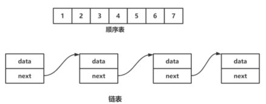
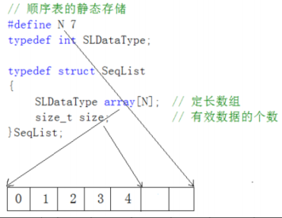
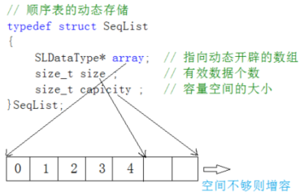
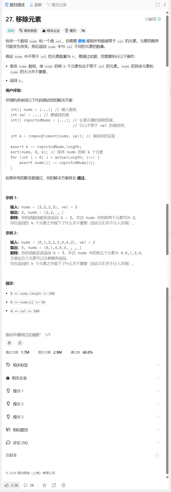
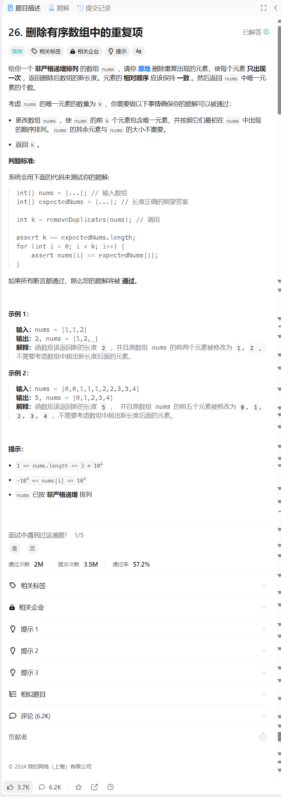
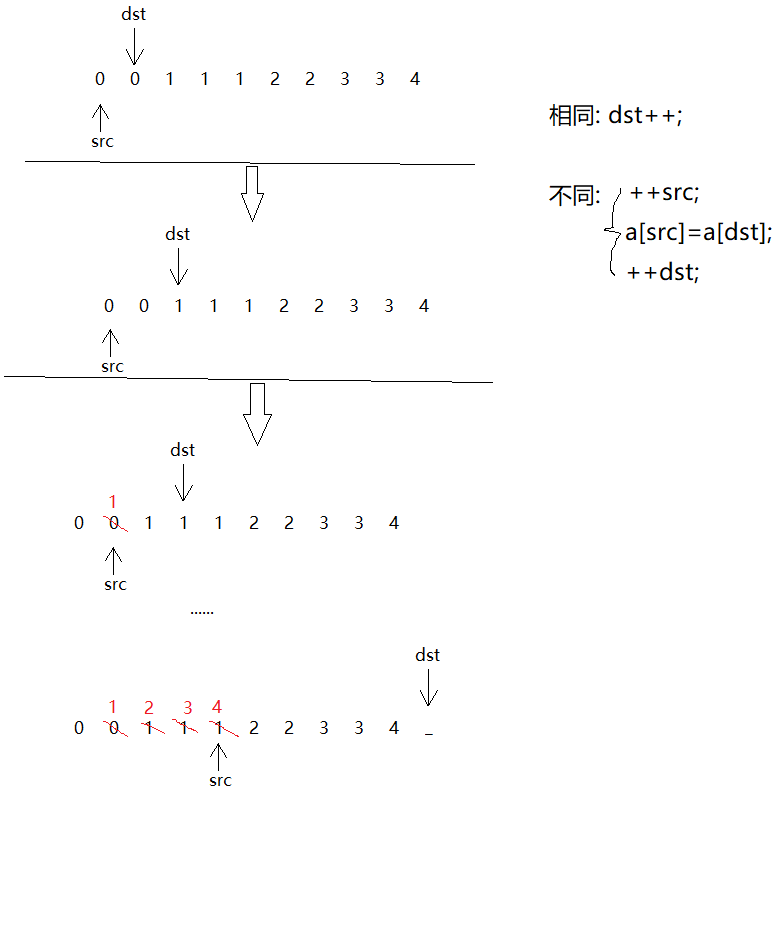
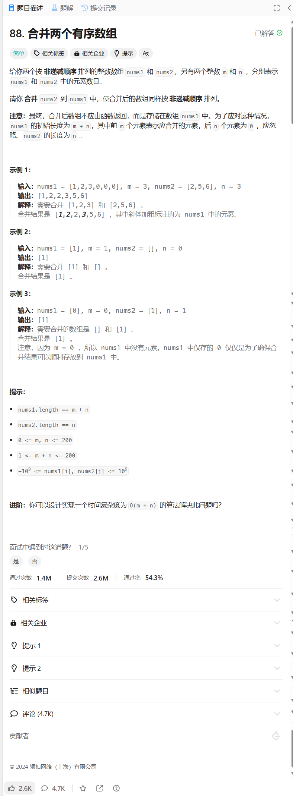
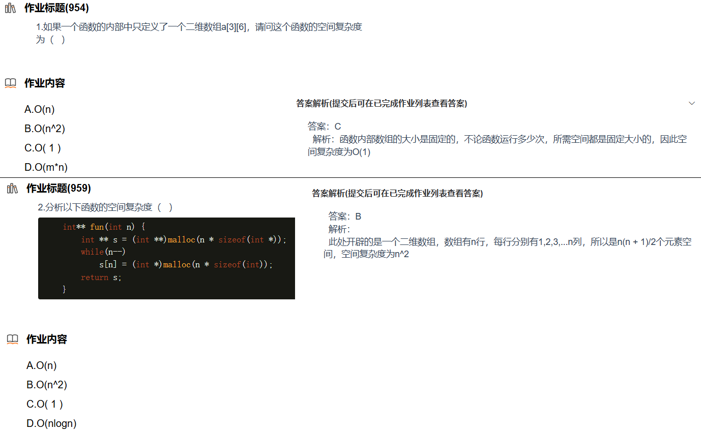

# 2. 顺序表

## 2.1 线性表

线性表（*linear list*）是n个具有相同特性的数据元素的有限序列。

常见的线性表：顺序表、链表、栈、队列、字符串...

线性表在逻辑上是线性结构，也就说是连续的一条直线。但是在物理结构上并不一定是连续的，线性表在物理上存储时，通常以数组和链式结构的形式存储。



## 2.2 顺序表

顺序表是用一段**物理地址连续**的存储单元依次存储数据元素的线性结构。

顺序表分**静态顺序表**和**动态顺序表**。

**静态顺序表：使用定长数组存储元素**。

**动态顺序表：使用动态开辟的数组存储**。

静态顺序表只适用于确定知道需要存多少数据的场景。现实中基本都是使用动态顺序表，根据需要动态的分配空间大小。

例如，静态顺序表样例：



动态顺序表样例：



## 2.3 顺序表的接口实现

### 1 注意事项

推荐使用typedef关键字或using关键字统一命名类型名称，以后要改类型可以顺畅无阻。

需要随时手搓的数据结构物理模型会加`(*)`标记。

这里只是将功能作为需求列举出来，熟悉顺序表需要自己按照功能一一实现。

### 2 静态顺序表

静态顺序表因为数组不可扩容，所以不常用。

**基本信息**

* 固定容量的**数组**(a)
* 元素**个数**(size)，

**功能**

 **初始化(Init)**

 > 所有元素同一为0。
 >
 > 
 >
 > 若使用c++编写，则可用构造函数进行初始化。

 **销毁顺序表(Destroy)**

 > size=0即可。

 **遍历所有元素(Print)**

 > 一共有size个元素，数组下标从0开始。

 **检查容量(CheckCapacity)**

 > 一般会加预处理指令例如：
 >
 > `#define N 100`
 >
 > 所以预处理指令的符号N就是容量。
 >
 > 检查容量看`size==N`的布尔值是否为1。

 **尾插(PushBack)**

 > 插入一个元素在顺序表末尾。
 >
 > 
 >
 > 若检查容量(CheckCapacity)已满，则根据检查容量(CheckCapacity)接口的情况进行讨论。
 >
 > 
 >
 > 这里是下标为size的元素。

 **头插(pushFront)**

 > 所有元素后移一个单位。
 >
 > 插入一个元素在顺序表开头。
 >
 > 这里是下标为0的元素。

 **尾删(PopBack)**

 > 删除最后一个元素。
 >
 > 不一定需要重置元素的值，更改size即可。

 **头删(PopFront)**

 > 删除开头元素，这里是下标为0的元素。
 >
 > 头删需要将所有元素向前移动一个单位。

 **插入(Insert)**

 > 将指定元素(x)放到顺序表的指定位置(pos)。
 >
 > 插入前需要先检查容量，然后将pos与pos后面的元素整体右移。

 **删除指定结点(Erase)**

 > 删除指定位置(pos)的元素。
 >
 > 可以不对pos的元素进行处理，而是将pos后面的所有元素前移一个单位。

 **寻找指定结点(Find)**

 > 遍历所有元素。
 >
 > 若顺序表有序还可用二分查找。

 **修改(Modify)**

 > 修改指定位置的元素

### 3 动态顺序表(*)

动态顺序表要求看着基本信息和功能的提示进行手搓。

**基本信息**

* **指针**：**用于存放开辟的数组的首元素地址**
* **元素个数**(**size**)，
* **顺序表容量**（**capacity**）：


**功能**

 **初始化(Init)**

 > 推荐一个动态顺序表最低拥有4个元素的存储空间。

 **销毁顺序表(Destroy)**

 > 动态顺序表的销毁需要释放a指向的申请而来的内存，以及及时调整**元素个数(size)**和**顺序表容量(capacity)**。

 **遍历所有元素(Print)**

 > 一共有size个元素，数组下标从0开始。

 **检查容量(CheckCapacity)**

 > 只要设计数据增加的情况，就需要考虑容量是否足够。
 >
 > 容量不够时需要扩容。

 **尾插(PushBack)**

 > 插入一个元素在顺序表末尾。
 >
 > 这里是下标为size的元素。

 **头插(pushFront)**

 > 插入一个元素在顺序表开头。
 >
 > 这里是下标为0的元素。

 **尾删(PopBack)**

 > 删除最后一个元素。
 >
 > 不一定需要重置元素的值，更改size即可。

 **头删(PopFront)**

 > 删除开头元素，这里是下标为0的元素。
 >
 > 头删需要将所有元素向前移动一个单位。

 **插入(Insert)**

 > 将指定元素(x)放到顺序表的指定位置(pos)。
 >
 > 插入前需要先检查容量，然后将pos与pos后面的元素整体右移。

 **删除指定结点(Erase)**

 > 删除指定位置(pos)的元素。
 >
 > 可以不对pos的元素进行处理，而是将pos后面的所有元素前移一个单位。

 **寻找指定结点(Find)**

 > 遍历所有元素。
 >
 > 若顺序表有序还可用二分查找。

 **修改(Modify)**

 > 修改指定位置的元素

### 4 参考程序

静态顺序表略。

#### 动态顺序表

`SeqList.h`

```c
#pragma once
//头文件中声明，同名.c/.c++中定义
#include<stdio.h>
#include<stdlib.h>
#include<assert.h>


// 静态的顺序表
// 给小了不够用，给多了浪费
//#define N 10000
//typedef int SLDatatype;
//struct SeqList {
//	SLDatatype a[N];
//	int size;
//};

// 动态顺序表
//typedef double SLDatatype;
typedef int SLDatatype;
typedef struct SeqList {
	SLDatatype* a;
	int size;       // 存储的有效数据的个数
	int capacity;   // 容量
}SL;

//函数名最好用带有含义的英文名命名

//初始化顺序表 
void SLInit(SL* psl);

//销毁顺序表 
void SLDestroy(SL* psl);

//遍历顺序表的元素 
void SLPrint(SL* psl);

//STL命名风格

//尾插，在尾部插入数据
void SLPushBack(SL* psl, SLDatatype x);

//头插，在头部插入数据
void SLPushFront(SL* psl, SLDatatype x);

//尾删，在尾部删除数据
void SLPopBack(SL* psl);

//头删，在头部删除数据
void SLPopFront(SL* psl);

//插入指定元素作为新的下标pos代表元素 
void SLInsert(SL* psl, int pos, SLDatatype x);

//删除pos元素 
void SLErase(SL* psl, int pos);

// 找到返回下标，没有找到返回-1
int SLFind(SL* psl, SLDatatype x);

//修改指定位置元素 
void SLModify(SL* psl, int pos, SLDatatype x);
```

`SeqList.c`

```c
#include"SeqList.h"

//void SLInit(SL* psl) {
//	//顺序表可以初始化为空
//	psl->a = NULL;
//	psl->capacity = 0;
//	psl->size = 0;
//}

void SLInit(SL* psl) {//初始化顺序表
	//顺序表也可以初始化一定数目的空间，但不能开太多
	assert(psl);
	psl->a = (SLDatatype*)malloc(sizeof(SLDatatype) * 4);
	if (psl->a == NULL) {
		perror("malloc fail");
		exit(-1);
	}

	psl->capacity = 4;
	psl->size = 0;
}

void SLDestroy(SL* psl) {//销毁顺序表
	assert(psl);
	free(psl->a);
	psl->a = NULL;//与OJ不同，为避免空间释放后被再次访问，需要制空
	psl->size = 0;
	psl->capacity = 0;
}

void SLPrint(SL* psl) {//遍历顺序表的元素 
	assert(psl);
	for (int i = 0; i < psl->size; i++) {
		printf("%d ", psl->a[i]);
	}
	printf("\n");
}

void SLCheckCapacity(SL* psl) {//检查容量，作为内置函数存在 
	assert(psl);

	if (psl->size == psl->capacity) {
		SLDatatype* tmp = (SLDatatype*)realloc
		(psl->a, sizeof(SLDatatype) * psl->capacity * 2);
		//一般在现有的基础上扩大两倍

		if (tmp == NULL) {
			perror("realloc fail");
			return;
		}

		psl->a = tmp;
		psl->capacity *= 2;
	}
}

void SLPushBack(SL* psl, SLDatatype x) {//尾插，在尾部插入数据
	assert(psl);

	//在尾部插入数据时还要检查容量
	//psl->a[psl->size] = x;
	//psl->size++;
	//SLCheckCapacity(psl);

	//psl->a[psl->size++] = x;

	SLInsert(psl, psl->size, x);
}

void SLPushFront(SL* psl, SLDatatype x) {//头插，在头部插入数据
	assert(psl);
	//SLCheckCapacity(psl);//先检查容量

	//// 挪动数据
	//int end = psl->size - 1;//可以考虑用memmove
	//while (end >= 0) {
	//	psl->a[end + 1] = psl->a[end];
	//	--end;
	//}
	//psl->a[0] = x;
	//psl->size++;

	SLInsert(psl, 0, x);
}

void SLPopBack(SL* psl) {//尾删，在尾部删除数据
	assert(psl);
	// 暴力检查
	//assert(psl->size > 0);

	//// 温柔的检查，即发现错误后也不做反馈，直接糊弄过去
	////if (psl->size == 0)
	////	return;

	////psl->a[psl->size - 1] = 0;
	//psl->size--;

	SLErase(psl, psl->size - 1);
}

void SLPopFront(SL* psl) {//头删，在头部删除数据
	assert(psl);
	// 暴力检查
	//assert(psl->size > 0);

	//
	/*
	int start = 0;
	while (start < psl->size-1) {
		psl->a[start] = psl->a[start + 1];
		start++;
	}
	*/

	//int start = 1;//两种都可
	//while (start < psl->size) {
	//	psl->a[start-1] = psl->a[start];
	//	start++;
	//}

	//psl->size--;

	SLErase(psl, 0);
}

//插入指定元素作为新的下标pos代表元素 
void SLInsert(SL* psl, int pos, SLDatatype x) {
	assert(psl);
	//assert(0 <= pos <= psl->size);//新标准可能支持，但旧标准不一定支持
	assert(0 <= pos && pos <= psl->size);

	SLCheckCapacity(psl);//凡是涉及添加数据都要解决容量问题防止越界

	int end = psl->size - 1;
	while (end >= pos) {
		psl->a[end + 1] = psl->a[end];//插入一般从后往前走，删除一般从前往后走
		--end;
	}

	psl->a[pos] = x;
	psl->size++;
}

//删除pos元素 
void SLErase(SL* psl, int pos) {
	assert(psl);
	assert(0 <= pos && pos < psl->size);
	//assert(psl->size > 0);//前两条已经解决大部分情况，因此可有可无

	int start = pos + 1;
	while (start < psl->size) {
		psl->a[start - 1] = psl->a[start];//指针从前往后走，数据从后往前挪
		++start;
	}

	psl->size--;
}

// 找到返回下标，没有找到返回-1
int SLFind(SL* psl, SLDatatype x) {//查找用搜索枚举更多，二分查找限制太多
	assert(psl);//断言可以迅速定位出错的位置，可以避开很多bug的诞生

	for (int i = 0; i < psl->size; i++) {
		if (psl->a[i] == x) {
			return i;
		}
	}

	return -1;
}

//修改指定位置元素 
void SLModify(SL* psl, int pos, SLDatatype x) {
	assert(psl);

	assert(0 <= pos && pos < psl->size);

	psl->a[pos] = x;
}
```

## 2.4 顺序表的部分问题

问题：

1. 中间/头部的插入删除，时间复杂度为$O(N)$。

2. 增容需要申请新空间，拷贝数据，释放旧空间。会有不小的消耗。

3. 增容一般是呈2倍的增长，势必会有一定的空间浪费。例如当前容量为100，满了以后增容到200，我们再继续插入了5个数据，后面没有数据插入了，那么就浪费了95个数据空间。

解决这些问题的方法是用链表这种新的数据结构来处理数据。

## 2.5 刷题笔记

### LeetCode 27. 移除元素

[27. 移除元素 - 力扣（LeetCode）](https://leetcode.cn/problems/remove-element/description/) 



枚举，不是要移除的元素重新拷贝回原数组。

时间复杂度：$O(n)$，

空间复杂度：$O(1)$.

参考程序：

```c++
class Solution {
public:
    int removeElement(vector<int>& nums, int val) {
        int j=0;
        for(int i=0;i<nums.size();i++)
        {
            if(nums[i]!=val)
            {
                nums[j++]=nums[i];
            }
        }
        return j;
    }
};
```

### LeetCode 26. 删除有序数组中的重复项

[26. 删除有序数组中的重复项 - 力扣（LeetCode）](https://leetcode.cn/problems/remove-duplicates-from-sorted-array/description/) 



非严格递增排列：升序序列中掺杂有相等的数据。

采用双指针的思路。

> 给两个起到下标作用的变量：dst，src。
>
> 重复进行着两个操作，直到`dst`等于数组的长度为止。
>
> * 当`a[dst]==a[src]`时，dst下标后移一个单位。
>
> * 当`a[dst]==a[src]`不同时，我们做如下处理：
>
> 1. src下标后移一个单位。
> 2. 将`a[dst]`的值赋值给`a[src]`。
> 3. 完成2之后下标`dst`变量后移。
>
> 
>
> 最后按照数组下标从0开始的规矩，长度即为`src+1`。

时间复杂度：$O(n)$

空间复杂度：$O(1)$

参考程序：

```c++
class Solution {
public:
    int removeDuplicates(vector<int>& nums) {
        int src = 0, dst = 1;
        while (dst < nums.size()) {
            if(nums[dst]!=nums[src])
                nums[++src]=nums[dst++];
            else
                ++dst;
        }
        return src+1;
    }
};
```

### LeetCode 88. 合并两个有序数组

[88. 合并两个有序数组 - 力扣（LeetCode）](https://leetcode.cn/problems/merge-sorted-array/description/)  



模仿归并排序即可。因为是拷贝到第一个数组，为了防止拷贝的过程中对第一个数组原有的数据进行破坏，决定两个数组都从最后一个元素开始合并。

时间复杂度：$O(m+n)$

空间复杂度：$O(1)$

参考程序：

```c++
class Solution {
public:
    void merge(vector<int>& nums1, int m, vector<int>& nums2, int n) {
        
        int p1=m-1,p2=n-1;
        while(p1>=0&&p2>=0)
        {
            if(nums1[p1]>nums2[p2])
            {
                nums1[p1+p2+2]=nums1[p1--];
            }
            else
            {
                nums1[p1+p2+2]=nums2[p2--];
            }
        }
        while(p2>=0)
        {
            nums1[p1+p2+2]=nums2[p2--];
        }
    }
};
```


> 1. 数据存起来后还要涉及增、删、查、改，因此需要用不同的数据结构来应对不同场景。
> 2. 数组的优势：可以用下标随机访问。
>
> 例如：二分查找不可用于链表，排序（大部分）也需要下标随机访问（因为物理空间连续）。
>
> 3. 数组的缺陷：要删除数组中的某个元素，需要用后方元素前移进行覆盖，操作繁琐。
> 4. OJ题，向堆区申请过空间的指针可以不置空（因无人访问），但其他情况不一定。
> 5. 动态顺序表可用柔性数组，但没必要。柔性数组与直接将指针作为成员变量的区别：
>
> 柔性数组扩容时是同一块空间上，这个是两个空间：栈区和堆区。
>
> 6. 一般写工程（项目）时，声明写在`.h`，定义写在同名`.c`，同名`.c`加一句`#include`。

### 选择题

