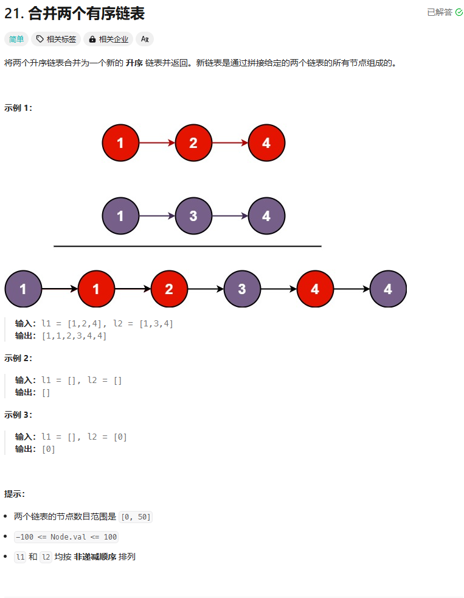
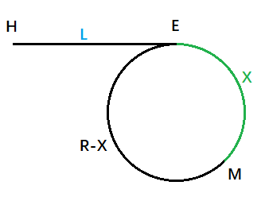

# 3. 链表

## 3.1 概念

链表是一种**物理存储结构上非连续**、非顺序的存储结构，数据元素的**逻辑顺序**是通过链表中的**指针链接**次序实现的 。

链表的逻辑结构（看着舒服的）：


现实中的链表：


实际中链表的结构非常多样，以下情况组合起来就有**8种链表结构**：

1. 单向或者双向


2. 带头或者不带头（头即哨兵卫结点，部分情况会用于存储链表的长度）


3. 循环或者非循环


虽然有这么多的链表的结构，但是我们实际中最常用还是两种结构：

1. **无头单向非循环链表**

> **结构简单**，一般不会单独用来存数据。实际中更多是作为**其他数据结构的子结构**，如哈希桶、图的邻接表等等。另外这种结构在**笔试面试**中出现很多。

2. **带头双向循环链表**

> **结构最复杂**，一般用在单独存储数据。实际中使用的链表数据结构，都是带头双向循环链表。另外这个结构虽然结构复杂，但是使用代码实现以后会发现结构会带来很多优势，实现反而简单了，后面我们代码实现了就知道了。

接下来的链表实现也是围绕这两种链表进行。可以尝试通过基本信息和功能手搓一个。其中的术语中 A（指针）指向B（指针）指的是A作为指针变量，存有B的地址。

## 3.2 无头单向非循环链表(*)

**基本信息**（**结点**）

> **数据域**，用于存放数据。
>
> **指针域**，用于存放其他结点的地址。


**功能**

**生成新结点(BuyNode)**

> 单链表single list简写为SL。
>
> 向堆区申请一个区域并返回地址，这个区域即为SL的一个结点。
>
> 将这个结点的地址返回。

**打印单链表(Print)**

> 链表操作大都遵循以下伪代码：
>
> ```c
> SLNode* head=链表头结点
> while(head没走到底){
> 	工作区间。
> 	head=head->指针域。
> }
> ```
>
> 其中`head=head->指针域`有时被称作迭代。

**头插(PushFront)**

> 申请一个结点并赋予初始值。
>
> 将申请的结点的指针指向原链表的头结点。
>
> 更新头结点。

**尾插(PushBack)**

> 申请一个结点并赋予初值。
>
> 后分情况讨论：
>
> 1. 空链表的尾插
>
> 申请的结点直接作为头结点和尾结点。
>
> 2、非空链表的尾插
>
> 通过Print的伪代码找到尾结点。
>
> 将尾结点的指针变量赋值刚申请的结点地址。
>
> 更新尾结点。

**头删(PopFront)**

> 分两种情况进行。
>
> 1. 空链表。
>
> 直接终止子程序运行。
>
> 2. 非空链表
>
> 标记头结点。
>
> 释放标记背后申请的内存。

**尾删(PopBack)**

> 分情况进行：
>
> 1. 空链表
>
> 直接返回。
>
> 2. 链表只有一个结点
>
> 释放头结点申请的内存。
>
> 头结点置空。
>
> 3. 多个结点
>
> 通过伪代码标记最后两个结点。
>
> 释放尾结点申请的内存。
>
> 将倒数第二个结点定义为新的尾结点，并将指针域置空。

**单链表查找(Find)**

> 伪代码的工作区间改为找到就停止寻找，并返回找到的结点的信息。
>
> 没找到则返回NULL。

**在指定结点前插入结点(InsertFront)**

> 分情况讨论：
>
> 1. 要插入的结点和头结点是同一个，则进行头插(PushFront)。
>
> 2. 指定结点和要插入的结点不同。
>
>    通过伪代码标记**指定结点**和指**针域存放指定结点地址的结点**。
>
>    **指针域存放指定结点地址的结点**的指针域赋值**新结点**地址。
>
>    **新结点**的指针域赋值**指定结点**。

**在指定结点后插入结点(InsertBack)**

> 申请新结点。
>
> **新结点**的指针域赋值**指定结点**的指针域**背后的结点**。
>
> **指定结点**的指针域赋值**新结点**的地址。

**删除指定位置的结点(Erase)**

> 分情况讨论
>
> 1. 指定结点即为头结点。则进行**头删(PopFront)**。
>
> 2. 指定结点不为头结点
>
>    通过伪代码找到指定结点的前一个结点，并标记指定结点。
>
>    **前一个结点**的指针域赋值**指定结点**的指针域的值。
>
>    释放指定结点。

**删除指定结点后的结点(EraseAfter)**

> 分两种情况讨论。
>
> 1. 指定结点即为尾结点，指针域为空。
>
>    终止子程序运行并返回错误信息。
>
> 2. 指定结点的指针域非空。
>
>    标记指定结点的指针域。
>
>    指定结点的指针域赋值被标记结点的指针域。
>
>    释放被标记结点。

**销毁链表(Clear)**

> 持续进行**头删(PopFront)**，直到删无可删为止。


补充：

1. 关于约瑟夫环，用链表其实更合适。用数组要么挪动数据，要么覆盖原值。
2. 单链表多记录一个变量，放在工程（项目中）会增加维护成本，应该尽可能保持间接。


## 3.3 带头双向循环链表(*)

**基本信息**（**结点**）

> **数据域**，用于存放数据。
>
> **前指针**，用于存放前一个结点。
>
> **后指针**，用于存放后一个结点


**功能**

**生成新结点(BuyNode)**

> 双向链表可以直接用List命名。
>
> 向堆区申请一个区域并返回地址，这个区域即为SL的一个结点。
>
> 将这个结点的地址返回。

**初始化哨兵卫结点(Init)**

> 生成新结点(BuyLTNode)并赋接下来用不到的值。
>
> 前、后两个指针都指向自己。

**打印链表(Print)**

> 即使是双向链表，也大都都遵循以下伪代码：
>
> ```c
> SLNode* head=链表头结点
> while(head没走到底){
> 	工作区间。
> 	head=head->指针域。
> }
> ```
>
> 

**判断链表是否为空(Empty)**

> 判断哨兵卫结点的后指针是否等于本身的地址。

**尾插(PushBack)**

> 通过哨兵卫标记尾结点。
>
> 申请新结点。
>
> 尾结点的后指针指向新结点。
>
> 新结点的前指针指向尾结点。
>
> 新结点的后指针指向哨兵卫。
>
> 哨兵卫的前指针指向新结点。
>
> 
>
> 还可以通过在哨兵卫前**插入(LTInsert)**结点来实现尾插（代码复用）。

**头插(PushFront)**

> 申请一个结点并赋予初始值。
>
> 标记原来的头结点。
>
> 哨兵卫的后指针指向新结点。
>
> 新节点的前指针指向哨兵卫。
>
> 新结点的后指针指向原来的头结点。
>
> 原来的头结点的前指针指向新结点。
>
> 更新头结点信息。
>
> 
>
> 还可以在哨兵卫和头结点之间**插入(LTInsert)**结点来实现。

**尾删(LTPopBack)**

> 标记尾结点（可通过哨兵卫结点的前指针找到）。
>
> 标记**尾结点前指针指向的结点**。
>
> 释放尾结点。
>
> 原**尾结点前指针指向的结点**的后指针指向哨兵卫。
>
> 哨兵卫的前指针指向原**尾结点前指针指向的结点**。
>
> 更新尾结点。

**头删(PopFront)**

> 标记哨兵卫尾指针指向的结点即头结点。
>
> 标记头结点的后指针指向的结点。
>
> 哨兵卫结点的后指针指向**原头结点的后指针指向的结点**。
>
> **原头结点的后指针指向的结点**的前指针指向的结点。
>
> 释放被标记的原头结点。
>
> 更新头结点信息。


**单链表查找(Find)**

> 伪代码的工作区间改为找到就停止寻找，并返回找到的结点的信息。
>
> 没找到则返回NULL。
>
> 参考伪代码：
>
> ```c
> SLNode* head=链表头结点
> while(head没走到底){
> 	工作区间。
> 	head=head->指针域。
> }
> ```
>
> 

**在指定结点前插入结点(Insert)**

> 标记**指定结点**前指针指向的结点。
>
> 生成新结点。
>
> **指定结点**的后指针指向新结点。
>
> 新结点的前指针指向**指定结点前指针指向的结点**。
>
> 新结点的后指针指向**指定结点**。
>
> **指定结点**的前指针指向新结点。

**删除指定位置的结点(Erase)**

> 标记指定结点的前指针指向的结点记为结点1。
>
> 标记指定结点的后指针指向的结点记为结点2。
>
> 结点1的后指针指向结点2。
>
> 结点2的前指针指向结点1。
>
> 释放指定结点。

**销毁链表(Destroy)**

> 通过伪代码持续进行**头删(PopFront)**，直到删无可删为止。
>
> 伪代码：
>
> ```c
> SLNode* head=链表头结点
> while(head没走到底){
> 	工作区间。
> 	head=head->指针域。
> }
> ```


## 3.4 参考程序

### 1 无头单向非循环链表

Slist.h

```c
#pragma once

#include<stdio.h>
#include<stdlib.h>
#include<assert.h>

typedef int SLTDataType;
//int可换成其他数据类型

typedef struct SListNode {
	SLTDataType data;
	struct SListNode* next;
}SLTNode;

SLTNode* BuyLTNode(SLTDataType x);//生成新结点
void SLTPrint(SLTNode* phead);//打印单链表
void SLPushFront(SLTNode** pphead, SLTDataType x);//头插
void SLPushBack(SLTNode** pphead, SLTDataType x);//尾插

void SLPopFront(SLTNode** pphead);//头删
void SLPopBack(SLTNode** pphead);//尾删

// 单链表查找
SLTNode* STFind(SLTNode* phead, SLTDataType x);

// 在pos之前插入
void SLInsert(SLTNode** pphead, SLTNode* pos, SLTDataType x);

//在pos之后插入
void SLInsertAfter(SLTNode* pos, SLTDataType x);

// 删除pos位置的结点
void SLErase(SLTNode** pphead, SLTNode* pos);

// 删除pos位置后面的结点
void SLEraseAfter(SLTNode* pos);

//清空链表
void SLClear(SLTNode** pphead);
```

Slist.c

```c
#include"Slist.h"

void SLTPrint(SLTNode* phead) {//打印单链表
	SLTNode* cur = phead;//防止丢失头结点，建议定义替补
	while (cur != NULL) {
		//可以这样写：while(cur)
		printf("%d->", cur->data);
		cur = cur->next;
	}
	printf("NULL\n");
}

/*
void SLPushFront(SLTNode** pphead, SLTDataType x) {//头插
	//实参是一级指针，可忽略上传空链表的问题

	//这部分可单独做一个模块
	SLTNode* newnode = (SLTNode*)malloc(sizeof(SLTNode));
	if (newnode == NULL) {
		perror("malloc fail");
		return;
	}
	newnode->data = x;
	newnode->next = NULL;

	newnode->next = *pphead;
	*pphead = newnode;
}
*/

void SLPushFront(SLTNode** pphead, SLTDataType x) {//头插
	assert(pphead);  // 链表为空，pphead也不为空，因为他是头指针plist的地址
	//assert(*pphead); // 不能断言，链表为空，也需要能插入
	SLTNode* newnode = BuyLTNode(x);//申请空间环节单独一个模块

	newnode->next = *pphead;
	*pphead = newnode;
}


SLTNode* BuyLTNode(SLTDataType x) {//生成新结点
	SLTNode* newnode = (SLTNode*)malloc(sizeof(SLTNode));
	if (newnode == NULL) {
		perror("malloc fail");
		return NULL;
	}
	newnode->data = x;
	newnode->next = NULL;

	return newnode;
}


// void SLPushBack(SLTNode* phead, SLTDataType x) {//尾插，有问题
// 	SLTNode* tail = phead;
// 	while (tail != NULL) {//生成野指针
// 		tail = tail->next;
// 	}

// 	SLTNode* newnode = BuyLTNode(x);
// 	tail = newnode;
// }

void SLPushBack(SLTNode** pphead, SLTDataType x) {//尾插
	assert(pphead); // 链表为空，pphead也不为空，因为他是头指针plist的地址
	//assert(*pphead); // 链表为空，可以尾插
	SLTNode* newnode = BuyLTNode(x);

	// 1、空链表的情况处理
	if (*pphead == NULL) {
		*pphead = newnode;
	}
	// 2、非空链表的情况处理
	else {
		SLTNode* tail = *pphead;
		while (tail->next != NULL) {
			//最开始其实是while(tail){...}，但这样会造成内存泄漏
			tail = tail->next;
		}

		tail->next = newnode;
	}
}


void SLPopFront(SLTNode** pphead) {//头删
	assert(pphead); // 链表为空，pphead也不为空，因为他是头指针plist的地址
	// 情况1：空
	//assert(*pphead);// 链表为空，不能头删。
	if (*pphead==NULL)//温柔的检查
		return;

	// 情况2：一个节点
	// if ((*pphead)->next == NULL) {
	// 	free(*pphead);
	// 	*pphead = NULL;
	// }
	// 情况3：多个节点
	// else {
	// 	SLTNode* del = *pphead;
	// 	//*pphead = del->next;
	// 	*pphead = (*pphead)->next;
	// 	free(del);
	// }

	//但其实情况2、3都能这样解决
	SLTNode* del = *pphead;
	*pphead = (*pphead)->next;
	free(del);
}


void SLPopBack(SLTNode** pphead) {//尾删
	//情况1：没有节点(空链表)
	assert(pphead); // 链表为空，pphead也不为空，因为他是头指针plist的地址
	// 暴力检查
	assert(*pphead); // 链表为空，不能头删。（当然还可以用温柔的检查，断言会强制终止程序）

	// 温柔的检查
	/*if (*pphead == NULL) {
		return;
	}*/


	//情况2： 一个节点
	if ((*pphead)->next == NULL) {
		free(*pphead);
		*pphead = NULL;
	}
	//情况3： 多个节点
	else {
		//SLTNode* prev = NULL;
		//SLTNode* tail = *pphead;

		// while (tail->next) {// 找尾
		// 	prev = tail;
		// 	tail = tail->next;
		// }

		//free(tail);
		//prev->next = NULL;

		//还可以不额外申请变量
		SLTNode* tail = *pphead;
		// 找尾
		while (tail->next->next) {
			tail = tail->next;
		}

		free(tail->next);
		tail->next = NULL;//释放尾结点后还要置空上一个结点的指针域
	}
}


SLTNode* STFind(SLTNode* phead, SLTDataType x) {// 单链表查找
	//assert(phead);
	//这里可以查找空链表，可以不需要断言

	SLTNode* cur = phead;
	while (cur) {//#define NULL ((void*)0)
		if (cur->data == x) {
			return cur;
		}

		cur = cur->next;
	}

	return NULL;
}

//单链表更适合在后插入
// 在pos之前插入（指定结点）
void SLInsert(SLTNode** pphead, SLTNode* pos, SLTDataType x) {
	//形参采用C++的STL的写法
	assert(pphead);
	assert(pos);
	//assert(*pphead);

	if (*pphead == pos) {//结点只有一个则是头插
		SLPushFront(pphead, x);
	}
	else {
		SLTNode* prev = *pphead;
		while (prev->next != pos) {
			prev = prev->next;
		}

		SLTNode* newnode = BuyLTNode(x);
		prev->next = newnode;
		newnode->next = pos;//因为形参是下一个结点的地址
	}
}

// 在pos之后插入
void SLInsertAfter(SLTNode* pos, SLTDataType x) {
	assert(pos);

	SLTNode* newnode = BuyLTNode(x);
	newnode->next = pos->next;
	pos->next = newnode;
}

// 删除pos位置的结点
void SLErase(SLTNode** pphead, SLTNode* pos) {
	assert(pphead);
	assert(pos);

	if (pos == *pphead) {
		SLPopFront(pphead);
	}
	else {
		SLTNode* prev = *pphead;
		while (prev->next != pos) {
			//指定删除pos指向的结点，要做的是修改相邻结点的指针域
			prev = prev->next;
		}

		prev->next = pos->next;
		free(pos);
	}
}


void SLEraseAfter(SLTNode* pos) {// 删除pos位置后面的结点
	assert(pos);
	assert(pos->next);

	SLTNode* next = pos->next;
	pos->next = next->next;
	free(next);
}


void SLClear(SLTNode** pphead) {//清空链表
	assert(pphead);
	if (*pphead == NULL)
		return;
	while (*pphead)
		SLPopFront(pphead);
}
```

### 2 带头双向循环链表

List.h

```c
#pragma once
#include<stdio.h>
#include<stdlib.h>
#include<assert.h>
#include<stdbool.h>

typedef int LTDataType;
typedef struct ListNode {
	struct ListNode* next;
	struct ListNode* prev;
	LTDataType data;
}LTNode;

LTNode* LTInit();//初始化哨兵卫结点
void LTPrint(LTNode* phead);//打印链表

bool LTEmpty(LTNode* phead);//判断链表是否为空
void LTPushBack(LTNode* phead, LTDataType x);//尾插
void LTPushFront(LTNode* phead, LTDataType x);//头插
void LTPopBack(LTNode* phead);//尾删
void LTPopFront(LTNode* phead);//头删

LTNode* LTFind(LTNode* phead, LTDataType x);//寻找数据域为x的结点


void LTInsert(LTNode* pos, LTDataType x);// 在pos之前插入
void LTErase(LTNode* pos);// 删除pos位置的值
void LTDestroy(LTNode* phead);//销毁链表
```

List.c

```c
#include"List.h"

LTNode* BuyLTNode(LTDataType x) {
	LTNode* newnode = (LTNode*)malloc(sizeof(LTNode));
	if (newnode == NULL) {
		perror("malloc fail");
		return NULL;
	}

	newnode->data = x;
	newnode->next = NULL;
	newnode->prev = NULL;
	return newnode;
}

LTNode* LTInit()//初始化哨兵卫结点
{
	LTNode* phead = BuyLTNode(-1);
	phead->next = phead;
	phead->prev = phead;

	return phead;
}

void LTPrint(LTNode* phead) {//打印链表
	assert(phead);

	printf("guard<==>");
	LTNode* cur = phead->next;
	while (cur != phead) {
		printf("%d<==>", cur->data);
		cur = cur->next;
	}
	printf("NULL\n");
}

bool LTEmpty(LTNode* phead) {//判断链表是否为空
	assert(phead);

	return phead->next == phead;
}

void LTPushBack(LTNode* phead, LTDataType x) {//尾插
	assert(phead);

	LTInsert(phead, x);

	//LTNode* tail = phead->prev;
	//LTNode* newnode = BuyLTNode(x);

	//tail->next = newnode;
	//newnode->prev = tail;
	//newnode->next = phead;
	//phead->prev = newnode;
}

// void LTPushFront(LTNode* phead, LTDataType x) {
// 	assert(phead);
// 	LTNode* newnode = BuyLTNode(x);

// 	newnode->next = phead->next;
// 	phead->next->prev = newnode;

// 	phead->next = newnode;
// 	newnode->prev = phead;
// }

void LTPushFront(LTNode* phead, LTDataType x) {//头插
	/*assert(phead);
	LTNode* newnode = BuyLTNode(x);
	LTNode* first = phead->next;//标记真正的头结点

	phead->next = newnode;
	newnode->prev = phead;

	newnode->next = first;
	first->prev = newnode;*/

	LTInsert(phead->next, x);//在笔试时尽可能做到简化
}

void LTPopBack(LTNode* phead) {//尾删
	assert(phead);
	assert(!LTEmpty(phead));
	LTErase(phead->prev);

	/*LTNode* tail = phead->prev;
	LTNode* tailPrev = tail->prev;

	free(tail);
	tailPrev->next = phead;
	phead->prev = tailPrev;*/

}

// void LTPopFront(LTNode* phead) {
// 	assert(phead);
// 	assert(!LTEmpty(phead));

// 	LTNode* next = phead->next;

// 	/*phead->next = next->next;
// 	phead->next->prev = phead;
// 	free(next);*/

// 	phead->next = next->next;
// 	next->next->prev = phead;
// 	free(next);
// }

void LTPopFront(LTNode* phead) {//头删
	assert(phead);
	assert(!LTEmpty(phead));

	LTErase(phead->next);

	//LTNode* first = phead->next;//纯粹是为了可读性流畅
	//LTNode* second = first->next;

	//phead->next = second;
	//second->prev = phead;

	//free(first);
}

LTNode* LTFind(LTNode* phead, LTDataType x) {//寻找数据域为x的结点
	assert(phead);

	LTNode* cur = phead->next;
	while (cur != phead) {
		if (cur->data == x) {
			return cur;
		}

		cur = cur->next;
	}

	return NULL;
}


void LTInsert(LTNode* pos, LTDataType x) {// 在pos之前插入
	assert(pos);

	LTNode* prev = pos->prev;
	LTNode* newnode = BuyLTNode(x);

	// prev newnode pos
	prev->next = newnode;
	newnode->prev = prev;
	newnode->next = pos;
	pos->prev = newnode;
}


void LTErase(LTNode* pos) {// 删除pos位置的值
	assert(pos);

	LTNode* posPrev = pos->prev;
	LTNode* posNext = pos->next;

	posPrev->next = posNext;
	posNext->prev = posPrev;
	free(pos);
}

void LTDestroy(LTNode* phead) {//销毁链表
	assert(phead);

	LTNode* cur = phead->next;
	while (cur != phead) {
		LTNode* next = cur->next;
		free(cur);
		cur = next;
	}


	free(phead);
}
```


## 3.5 顺序表和链表的对比

**顺序表优点**：

1. 尾插/尾删效率高（时间复杂度$O(1)$）。
2. 可通过下标进行随机访问。
3. cpu高速缓存命中率会更高。

**顺序表缺点**：

1. 头部附近的插入、删除效率较差（时间复杂度$O(n)$），需挪动数据。
2. 空间不够，需要扩容。
   * 扩容需要付出代价，若出现realloc将数组的空间移动到其他内存块（异地扩容），损失会更大。
   * 一般还会伴随空间浪费。例如：顺序表只有100个空间，而需求是101个，于是扩容到200，虽然需求满足，但有99个空间浪费。

**链表优点**：

1. 任意位置插入、删除，效率$O(1)$。但一般要先找到某位置，效率$O(n)$。
2. 按需申请释放，内存利用率极高。

**链表缺点**：

1. 不支持下标访问。
2. 链表的缓存命中会更低。


## 3.6 刷题

### 1 移除链表元素 - 力扣（LeetCode）

[203. 移除链表元素 - 力扣（LeetCode）](https://leetcode.cn/problems/remove-linked-list-elements/description/)


通常操作单链表中的一个结点，需要知道3个结点的信息：前一个结点、当前结点和后一个结点。

而后一个结点在很多时候可以通过当前结点的指针域得到，但无法通过当前结点知得到前一个结点的信息，因此只需要**知道前一个结点和当前结点的信息**即可完成大部分的链表操作。

这题的思路同样是需要标记两个结点的信息进行排查操作。


但需要注意：

1. 开头的几个元素都符合条件。
2. 所有元素都符合条件都被删，或系统直接给个空结点。

因此有必要先排查前几个结点的情况。

时间复杂度：$O(n)$，$n$为结点个数。

空间复杂度：$O(1)$。

参考程序：

```cpp
/**
 * Definition for singly-linked list.
 * struct ListNode {
 *     int val;
 *     ListNode *next;
 *     ListNode() : val(0), next(nullptr) {}
 *     ListNode(int x) : val(x), next(nullptr) {}
 *     ListNode(int x, ListNode *next) : val(x), next(next) {}
 * };
 */
class Solution {
public:
    ListNode* removeElements(ListNode* head, int val) {
        //排除首结点的情况
        while(head&&head->val==val){//短路操作使空链表不会进行访问
            ListNode* del=head;
            head=head->next;
            delete del;
        }

        //1、空链表
        //2、全部结点都是这个值
        if(head==nullptr)
            return head;
        
        //前、后指针
        ListNode* src=head->next,*pre=head;
        while(src!=NULL){
            ListNode* del=src;
            src=src->next;
            if(del->val==val){
                pre->next=src;
                delete del;
            }
            else{
                pre=pre->next;
            }
        }
        return head;
    }
};
```


### 2 反转链表 - 力扣（LeetCode）

[206. 反转链表 - 力扣（LeetCode）](https://leetcode.cn/problems/reverse-linked-list/description/)


思路1：三个结点指针标记三个结点进行反转操作。但要筛选出结点数不足3个的情况，还要对头结点进行特别处理。

时间复杂度：$O(n)$。

空间复杂度：$O(1)$。


参考源码

```cpp
/**
 * Definition for singly-linked list.
 * struct ListNode {
 *     int val;
 *     ListNode *next;
 *     ListNode() : val(0), next(nullptr) {}
 *     ListNode(int x) : val(x), next(nullptr) {}
 *     ListNode(int x, ListNode *next) : val(x), next(next) {}
 * };
 */
class Solution {
public:
    ListNode* reverseList(ListNode* head) {
        // 迭代
        ListNode *pre = head, *tmp = nullptr;

        if (head == nullptr) // 空链表
            return head;
        ListNode* src=head->next;
        
        if (src == nullptr) // 一个结点的链表
            return head;

        tmp = pre;
        pre = src;
        src = src->next;
        tmp->next = nullptr; // 首结点特别处理
        pre->next = tmp;

        tmp = pre;
        if (src == nullptr)
            return pre;//两个结点的情况
        pre = src;
        src = src->next;

        while (src) {
            pre->next = tmp;
            tmp = pre;
            pre = src;
            src = src->next;
        }

        pre->next = tmp;
        return pre;
    }
};
```

思路2 头插

利用单链表只能一个方向枚举的特点，用类似头插的方式，将原结点插在新的头结点前。

但这题不能用生成的新结点来取代老结点，LeetCode平台不给过。

参考程序：

```cpp
/**
 * Definition for singly-linked list.
 * struct ListNode {
 *     int val;
 *     ListNode *next;
 *     ListNode() : val(0), next(nullptr) {}
 *     ListNode(int x) : val(x), next(nullptr) {}
 *     ListNode(int x, ListNode *next) : val(x), next(next) {}
 * };
 */
class Solution {
public:
    ListNode* reverseList(ListNode* head) {
        ListNode* src = head;
        ListNode* newhead = nullptr;

        while (src) {
            ListNode* tmp = src;//根据头删的原理，当src后移一个单位时，之前的结点无法对当前情况造成影响
            src = src->next;
            tmp->next = newhead;
            newhead = tmp;
        }
        return newhead;
    }
};
```


### 3 链表的中间结点 - 力扣（LeetCode）

[876. 链表的中间结点 - 力扣（LeetCode）](https://leetcode.cn/problems/middle-of-the-linked-list/description/) 


我们可以尝试快慢指针。例如快指针`pre`一次能跳过两个结点，而慢指针`src`一次就跳过一个结点。

若链表的长度是奇数，当指针`pre`走到尾结点时，`src`正好在中间的位置。

若链表的长度是偶数，当指针`pre`走到尾结点的指针域时，`src`正好在两个中间位置的第二个。

这里我用两个计数变量`p`和`q`进行计数。

参考程序：

```cpp
/**
 * Definition for singly-linked list.
 * struct ListNode {
 *     int val;
 *     ListNode *next;
 *     ListNode() : val(0), next(nullptr) {}
 *     ListNode(int x) : val(x), next(nullptr) {}
 *     ListNode(int x, ListNode *next) : val(x), next(next) {}
 * };
 */
class Solution {
public:
    ListNode* middleNode(ListNode* head) {
        ListNode* pre=head,*src=head;
        int p=0,s=0;
        if(head==nullptr)
            return head;
        while(src->next){
            src=src->next;
            ++s;

            if(s/2>p){
                pre=pre->next;
                ++p;
            }

        }
        if(s%2)
            return pre->next;
        else
            return pre;
    }
};
```


### 4 链表中倒数第k个结点_牛客网 LeetCode

[链表中倒数第k个结点_牛客网](https://www.nowcoder.com/practice/529d3ae5a407492994ad2a246518148a?tpId=13&&tqId=11167&rp=2&ru=/activity/oj&qru=/ta/coding-interviews/question-ranking) 

题目已下线（写到这里时是2024年10月27日），只截得一张图。


可以用两个指针，前指针先前进k次，再和后指针同步行走，当前指针走到前指针自身的值为空时，后指针在的结点即为想要的结点。

同样要预防题解为空指针的情况。

参考程序：

```cpp
//c语言
struct ListNode* Find(struct ListNose* pListHead, int k){
    struct ListNode* fast=pListHead, *slow=pListHead;
    
    while(k--){
        if(fast==NULL)
            return NULL;
        fast=fast->next;
    }
    while(fast){
        slow=slow->next;
        fast=fast->next;
    }
}
```

但在力扣还有一道类似的题：[面试题 02.02. 返回倒数第 k 个节点 - 力扣（LeetCode）](https://leetcode.cn/problems/kth-node-from-end-of-list-lcci/) 


参考程序：

```cpp
/**
 * Definition for singly-linked list.
 * struct ListNode {
 *     int val;
 *     ListNode *next;
 *     ListNode(int x) : val(x), next(NULL) {}
 * };
 */
class Solution {
public:
    int kthToLast(ListNode* head, int k) {
        // 迭代
        ListNode *pre = head, *src = head;

        if (head == nullptr) // 空链表
            return k;
        k-=1;
        while(k){
            src=src->next;
            --k;
        }
        while(src->next){
            src=src->next;
            pre=pre->next;
        }

        return pre->val;
        
    }
};
```


### 5 合并两个有序链表 - 力扣（LeetCode）

[21. 合并两个有序链表 - 力扣（LeetCode）](https://leetcode.cn/problems/merge-two-sorted-lists/description/)



合并的思路是两条链表的结点分别进行比较，谁符合条件就将谁的结点插入新链表中，同时自己后移一个单位。

参考程序

```cpp
/**
 * Definition for singly-linked list.
 * struct ListNode {
 *     int val;
 *     ListNode *next;
 *     ListNode() : val(0), next(nullptr) {}
 *     ListNode(int x) : val(x), next(nullptr) {}
 *     ListNode(int x, ListNode *next) : val(x), next(next) {}
 * };
 */
class Solution {
public:
    ListNode* mergeTwoLists(ListNode* list1, ListNode* list2) {
        bool flag = true;
        ListNode *head = nullptr, *src = nullptr, *l1 = list1, *l2 = list2;
        
        //处理链表有一条为空链表的情况
        if(l1==NULL&&l2==NULL)
            return NULL;
        if(l1==NULL&&l2)
            return l2;
        if(l2==NULL&&l1)
            return l1;
        
        //合并
        while (l1 && l2) {
            if (l1->val < l2->val) {
                if (flag) {//flag的作用是判断头结点是否找到
                    head = l1;
                    flag = false;
                    src = head;
                } else {//否则进行尾插处理
                    src->next = l1;
                    src = l1;
                }
                l1 = l1->next;
            } else {
                if (flag) {
                    head = l2;
                    flag = false;
                    src = head;
                } else {
                    src->next = l2;
                    src = l2;
                }
                l2 = l2->next;
            }
        }
        
        //短的链表枚举完成后将剩下的链表接上
        if(l1==NULL){
            src->next=l2;
        }
        else if(l2==NULL){
            src->next=l1;
        }

        return head;
    }
};
```


### 6 链表分割_牛客题霸_牛客网

[链表分割_牛客题霸_牛客网](https://www.nowcoder.com/practice/0e27e0b064de4eacac178676ef9c9d70?tpId=8&&tqId=11004&rp=2&ru=/activity/oj&qru=/ta/cracking-the-coding-interview/question-ranking) 


题目说的不能改变原来的数据顺序也包括每个结点自身的地址。

思路：

1. 用`phead`表示头结点，代替链表进行枚举。
2. 设`pre`表示`phead`的前驱。根据`pre->val`是否小于`x`选择合适的链表进行尾插。
3. 枚举完成后，将每个元素的`val`都大于`x`的那个链表的第一个元素（简称大的链表，可能不存在），接在每个元素的`val`都小于`x`的那个链表（简称小的链表）的最后一个元素之后。

特殊情况：小的链表不存在，此时返回大的链表的头结点。

```cpp
/*
struct ListNode {
    int val;
    struct ListNode *next;
    ListNode(int x) : val(x), next(NULL) {}
};*/
class Partition {
public:
    ListNode* partition(ListNode* pHead, int x) {
        // write code here
        ListNode* phead=pHead;
        ListNode* ps0=nullptr,*ps1=nullptr;//0表示链表头结点，1表示尾结点
        ListNode* pb0=nullptr,*pb1=nullptr;//s代表small，表示val<x的结点组成的链表，b代表big
        ListNode* pre=nullptr;
        while(phead){
            pre=phead;
            phead=phead->next;//phead前进后pre改变对phead不造成影响
            if(pre->val<x){
                if(ps1==nullptr){//当前链表还是空链表的情况
                    ps0=ps1=pre;
                    ps1->next=nullptr;
                }
                else{
                    ps1->next=pre;
                    ps1=ps1->next;
                    ps1->next=nullptr;//每找到一个前驱都可进行处理。
                }
            }
            else{
                if(pb1==nullptr){
                    pb0=pb1=pre;
                    pb1->next=nullptr;
                }
                else{
                    pb1->next=pre;
                    pb1=pb1->next;
                    pb1->next=nullptr;
                }
            }
        }
        if(ps0){//如果small链表存在就将big链表接上并返回
            ps1->next=pb0;
            return ps0;
        }
        return pb0;
    }
};
```

### 7 链表的回文结构_牛客题霸_牛客网

[链表的回文结构_牛客题霸_牛客网](https://www.nowcoder.com/practice/d281619e4b3e4a60a2cc66ea32855bfa?tpId=49&&tqId=29370&rp=1&ru=/activity/oj&qru=/ta/2016test/question-ranking)


推荐先找到中间结点，再将后半段链表逆置，再同步枚举两条链表。

相当于是在保证空间复杂度为$O(1)$的情况下，循环次数为$\frac{3}{2}n$，时间复杂度还是$O(n)$。

```cpp
/*
struct ListNode {
    int val;
    struct ListNode *next;
    ListNode(int x) : val(x), next(NULL) {}
};*/
class PalindromeList {
public:
    bool chkPalindrome(ListNode* A) {
        // write code here
        if(A==nullptr) return false;
        if(A->next==nullptr) return true;
        ListNode* a1=A,*a2,*a3;
        a1=a2=a3=A;
        size_t len=1;

        //a1记录a2前缀，a2走一步，a3走两步
        //走完之后a2必在中间结点或中间结点之一的第二个。
        while(a3->next){
            a1=a2;
            a2=a2->next;
            a3=a3->next;
            len++;
            if(a3->next){
                a3=a3->next;
                len++;
            }
        }
        a1->next=nullptr;//将链表重中间分割
        if(len%2)//处理奇数个结点的情况
            a2=a2->next;
        
        //用头插的方式将后半段链表逆置
        a3=nullptr;
        while(a2){
            ListNode* tmp=a2;
            a2=a2->next;
            tmp->next=a3;
            a3=tmp;
        }

        //判断是否是回文链表
        while(A){
            if(A->val!=a3->val)
                return false;
            A=A->next;
            a3=a3->next;
        }
        return true;
    }
};
```


### 8 相交链表 - 力扣（LeetCode）

[160. 相交链表 - 力扣（LeetCode）](https://leetcode.cn/problems/intersection-of-two-linked-lists/description/) 


判断链表是否有交点：

1. 看尾结点地址是否相等（时间复杂度为$O(m+n)$）。
2. 假设有两条链表A和B，长度分别为m、n，A链表的所有结点都和B链表的每一个结点分别进行比较，地址相同即为交点。
   时间复杂度为$O(N^2)$（实际是$O(mn)$）
3. 先求A、B的长度，分别记为$L_A$，$L_B$，再让长的链表先走$abs(L_A-L_B)$步，最后再一起走到结尾。相同结点即为交点。
   目前看来3的性能最优，枚举次数为$2*max(L_A,L_B)，$时间复杂度为$O(max(L_A,L_B))$。

第3个方法的参考程序：

```cpp
/**
 * Definition for singly-linked list.
 * struct ListNode {
 *     int val;
 *     ListNode *next;
 *     ListNode(int x) : val(x), next(NULL) {}
 * };
 */
class Solution {
public:
    ListNode *getIntersectionNode(ListNode *headA, ListNode *headB) {
        size_t la=0,lb=0;
        ListNode* pa=headA,*pb=headB;
        
        //求长度
        while(pa&&pb){
            la++;lb++;
            pa=pa->next;
            pb=pb->next;
        }
        while(pa){
            la++;
            pa=pa->next;
        }
        while(pb){
            lb++;
            pb=pb->next;
        }
        
        //假设headA比headB长
        pa=headA;pb=headB;
        if(la<lb){
            la=la^lb;
            lb=la^lb;
            la=la^lb;
            ListNode* t=pa;
            pa=pb;
            pb=t;
        }
        
        //长的链表先走几步
        while(la>lb){
            la--;
            pa=pa->next;
        }
        while(pa&&pb){
            if(pa==pb)
                return pa;
            pa=pa->next;
            pb=pb->next;
        }
        return nullptr;
    }
};
```


### 9 环形链表 - 力扣（LeetCode）

[141. 环形链表 - 力扣（LeetCode）](https://leetcode.cn/problems/linked-list-cycle/description/) 


如果链表中有环，则环一定是在末尾。可以用反证法证明。

假设有环且环不在末尾，因为链表的结点只有唯一的索引指向下一个结点，则当第一次进入环的第一个结点时，这唯一的索引必须指向进入环的方向才能保证有环，此时环在末尾；否则链表中没有环，而是变成了两条链表有公共部分，这与有环的结论相矛盾。所以环一定在末尾。


所以有了思路：快慢指针，即慢指针一次走一步，快指针一次走两步，两个指针从链表起始位置开始运行，如果链表带环则一定会在环中相遇，否则快指针率先走到链表的末尾。

> 这是一个数学问题。可以尝试证明：
>
> 在某一单向循环链表中，设快指针为`fast`，慢指针为`slow`，很容易想到`fast`指针会先进入环。
>
> 
>
> 当`fast`和`slow`都进入环中时，设`slow`到`fast`**在**`slow`**的逆时针方向上**（**不包含`slow`和`fast`指针本身的结点**）**的距离**为$m$个结点。
>
> 当两个指针都沿着顺时针方向走一步，它们的距离变为为`m-1`个结点。
>
> 
>
> 所以，两个指针每走一步，它们的距离减少1个单位，直到两个指针相遇。两个指针相遇后，按照这里规定的距离的定义，它们的距离变为了环的结点数。
>
> 所以，若链表中有环，则快慢指针一定会相遇。

参考程序（空间复杂度为$O(1)$）：

```cpp
/**
 * Definition for singly-linked list.
 * struct ListNode {
 *     int val;
 *     ListNode *next;
 *     ListNode(int x) : val(x), next(NULL) {}
 * };
 */
class Solution {
public:
    bool hasCycle(ListNode* head) {
        if (head == nullptr)
            return false;
        if (head->next == nullptr)
            return false;
        ListNode *fast = head, *slow = head;
        while (1) {
            slow = slow->next;
            fast = fast->next;
            if (fast) {//尾结点存在时一定无环
                if (fast->next) {//快指针没有越界时继续走
                    fast = fast->next;
                    if (fast == slow) {//两个指针每走完一步就进行判断
                        return true;
                    }
                }
            }
            else
                return false;
        }
    }
};
```

`slow`一次走$k$步，`fast`一次走$n$步（$n>k$），`slow`和`fast`在环中是否会相遇？

设环的大小为$c$，`slow`进入环时，两个指针**在**`slow`**的逆时针方向上**（**不包含`slow`和`fast`指针本身的结点**）**的距离**为$m$。`slow`和`fast`每走一步，它们的距离就会变成$m+k-n$，即距离缩小$n-k$。

按照这里的距离上的设定，当两个指针相遇时，它们之间的距离最大，为$m=c-1$。

例如，$m=4$，$k=1$，$n=3$，$c=6$的情景：


而当$m=4$，$k=1$，$n=3$，$c=7$时，两个指针又会相遇：


这里先猜测结论。当$(c-1)\%(n-k)=0$时，说明两个指针在相遇后，继续按原来的方式走，则它们还会在同一点相遇，此时无论$m$为多少。

因为：

$m\in \{c-1,c-1-(n-k),c-1-2(n-k),\cdots,\\0,c-(n-k),c-2(n-k),\\ \cdots,1,c+1-(n-k),c+1-2(n-k),\\\cdots,2,c+2-(n-k),\\\cdots,c-1\}$

其中$0$表示两个指针中间已经没有结点，再按同样的方式走，`fast`又会走在`slow`的前面，但又因为它们是在同一个环内移动，所以按照定义，它们的距离又变成了$c-(n-k)$
（$c-1-(n-k-1)$,即`slow`先走$k$步，`fast`走了$k+1$步时相遇，$m=c-1$，此时`fast`还能再走$n-(k+1)$步，所以距离变成了$c-1-(n-k-1)$），

而$(c-1)\%(n-k)=0$，所以最后$m$必定在某一时刻为$1$；

当$m=1$时，两个指针再走一步时，`fast`指针再走$1+k+1$步就与`slow`相遇，此时$m=c-1$，此时`fast`还能再走$n-k-2$步，所以$m=c-1-(n-k-2)=c+1-(n-k)$;

再继续走，又会发现$m=2$，此时再继续走一步，又会变成$m=c+2-(n-k)$。

每一次走，都会出现距离为$3,4,5,\cdots$的情况，这种情况相加到$c-1$时，已经没必要继续推理下去，因为两个指针已经相遇。

### 10  环形链表 II - 力扣（LeetCode）

[142. 环形链表 II - 力扣（LeetCode）](https://leetcode.cn/problems/linked-list-cycle-ii/description/) 


如下图中的带环链表。H是链表的起点，E是链表开始入环的第一个结点，H和E之间的结点数为L（两个结点间的逻辑距离为1），环的结点数为R。

假设有两个指针`slow`和`fast`，`slow`一次走1步，`fast`一次走2步，根据[141. 环形链表 - 力扣（LeetCode）](https://leetcode.cn/problems/linked-list-cycle/description/)  得到的结论，它们必定在环中相遇。

设相遇的结点为M，则E和M之间的结点数为X（路程为X）。



当两个指针在M处相遇时，`fast`可能遍历了一次环，也可能遍历了很多次环。所以它们在M处相遇时走过的路程：

$S_{fast}=L+X+n*R$，$n$是`fast`遍历环的次数。

$S_{slow}=L+X$。

而`slow`的速度是`fast`的一半（速度=路程/时间），因此相同的时间内有路程关系：

$2*S_{slow}=S_{fast}$。

将$S_{fast}$和$S_{slow}$代入可得：

$L=n*R-X$，$n=1,2,3,\cdots$

当`slow`进入环时，它们之间的距离最多就是环的长度。而当他们各自走一步时，它们的距离就会缩小1个结点的距离。

所以`fast`能在`slow`遍历一个环的距离之前和`slow`相遇。而相遇后，`slow`和`fast`再从同一个起点开始出发，依旧会在同一个起点相遇。

所以就有了关系$L=R-X$，也就是第1次相遇时，关系便已经固定。到这里即可得到方案：

两个`slow`指针分别从H点和M点出发，相遇点E即为链表开始入环的第一个结点。

参考程序：

```cpp
/**
 * Definition for singly-linked list.
 * struct ListNode {
 *     int val;
 *     ListNode *next;
 *     ListNode(int x) : val(x), next(NULL) {}
 * };
 */
class Solution {
public:
    ListNode *detectCycle(ListNode *head) {
        if(head==nullptr) return head;//因为用了do，所以必须判断head是否为为空链表
        ListNode* fast=head,*slow=head;
        do{//因为它们是从同一起点出发，所以需要他们先走一步再判断
            fast=fast->next;
            slow=slow->next;
            if(fast){
                if(fast->next)
                    fast=fast->next;
                else
                    return nullptr;
            }
            else
                return nullptr;
        }while(fast!=slow);//相等时即为第一次相遇的点
        
        fast=head;
        while(fast!=slow){
            fast=fast->next;
            slow=slow->next;
        }
        return slow;
    }
};
```


### 11  随机链表的复制 - 力扣（LeetCode）

[138. 随机链表的复制 - 力扣（LeetCode）](https://leetcode.cn/problems/copy-list-with-random-pointer/description/)

粗暴的解法：弄两个数组给两条链表做修饰。额外的数组会造成额外的开销。

参考程序：

```cpp
/*
// Definition for a Node.
class Node {
public:
    int val;
    Node* next;
    Node* random;
    
    Node(int _val) {
        val = _val;
        next = NULL;
        random = NULL;
    }
};
*/

class Solution {
public:
    Node* copyRandomList(Node* head) {
        if(head==nullptr) return nullptr;
        Node* phead=head;
        vector<Node*>a,b;//用数组存储每个结点的地址
        while(phead){
            Node* tmp1=new Node(phead->val);
            tmp1->random=phead->random;
            a.push_back(tmp1);//a存储深拷贝链表的信息
            if(a.size()>1)
                a[a.size()-2]->next=a[a.size()-1];
            b.push_back(phead);//b存储原链表的信息
            phead=phead->next;
        }
        
        //此时a中的链表的random还是指向b中的链表的结点
        //可以通过判断结点的位置进行定位
        for(int i=0;i<a.size();i++){
            if(a[i]->random==nullptr) continue;
            int pos=0;
            phead=a[i]->random;//找到a[i]->random在b[i]中的具体位置
            while(phead){
                pos++;
                phead=phead->next;
            }
            pos=b.size()-pos;
            a[i]->random=a[pos];
        }
        return a[0];
    }
};
```

最优解：每个结点都生成一个弟弟结点插入原链表的哥哥结点后面。当所有结点都复制完成后，将所有的弟弟结点的random值后移一个结点（如果存在的话），再分离弟弟结点为新的链表即可。

参考程序：

```cpp
/*
// Definition for a Node.
class Node {
public:
    int val;
    Node* next;
    Node* random;
    
    Node(int _val) {
        val = _val;
        next = NULL;
        random = NULL;
    }
};
*/

class Solution {
public:
    Node* copyRandomList(Node* head) {
        if(head==nullptr) return nullptr;
        
        //生成弟弟结点并插入
        Node* phead=head;
        while(phead){
            Node* tmp1=phead;
            phead=phead->next;
            Node* tmp2=new Node(tmp1->val);
            tmp2->random=tmp1->random;
            tmp2->next=phead;
            tmp1->next=tmp2;
        }
        
        //弟弟结点的random指针后移一个单位
        phead=head;
        while(phead&&phead->next){
            if(phead->next->random!=nullptr){
                phead->next->random=phead->next->random->next;
            }
            phead=phead->next->next;
        }
        
        //分离弟弟结点成为新的链表
        Node* head2=head->next;
        phead=head;
        Node* phead2=head2;
        while(phead2->next){
            phead->next=phead->next->next;
            phead=phead->next;
            phead2->next=phead2->next->next;
            phead2=phead2->next;
        }
        phead->next=nullptr;
        return head2;
    }
};
```


### 12  链表题单 - 力扣（LeetCode）

[链表 - 力扣（LeetCode）全球极客挚爱的技术成长平台](https://leetcode.cn/problem-list/linked-list/)

### 13  链表题单 - 牛客网在线编程_算法面试_面试必刷TOP101

[牛客网在线编程_算法面试_面试必刷TOP101](https://www.nowcoder.com/exam/oj)


### 选择题

