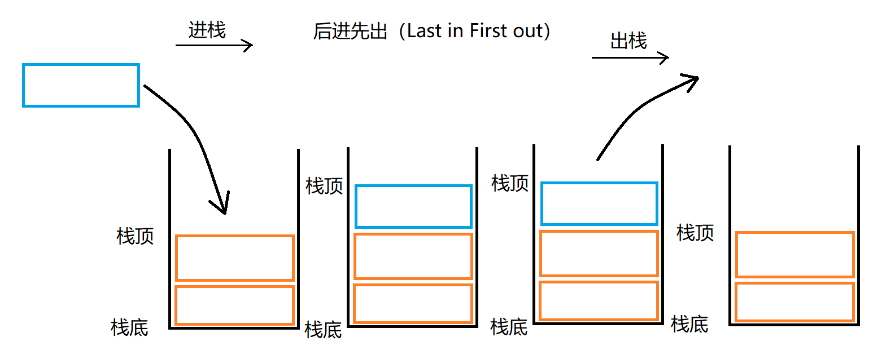
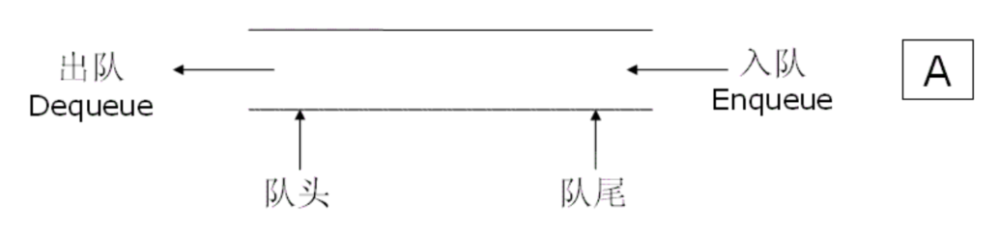
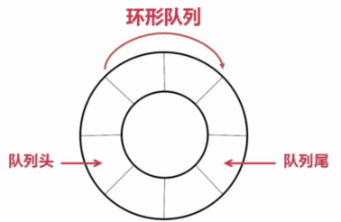
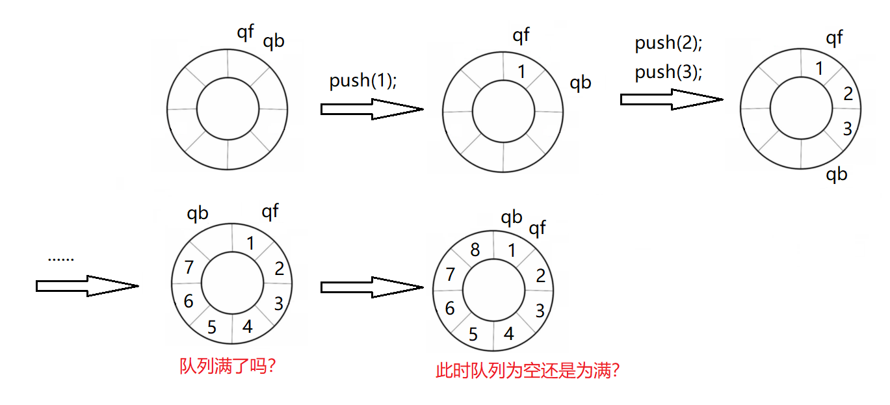
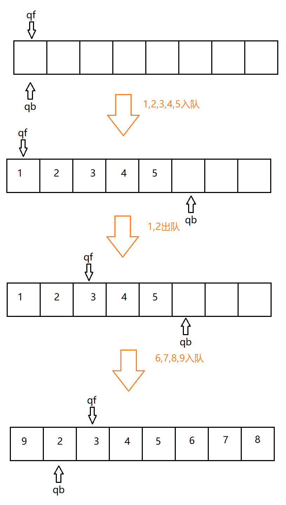
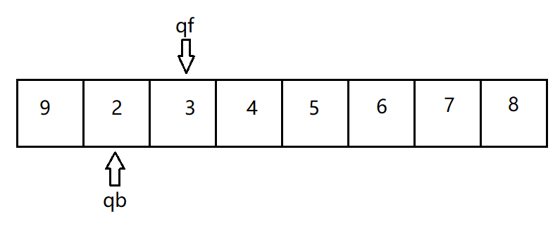
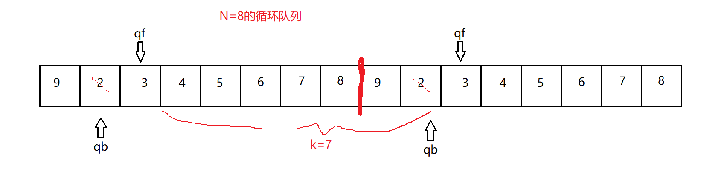
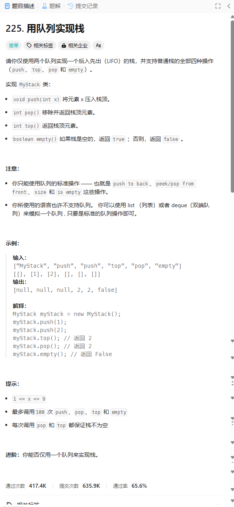
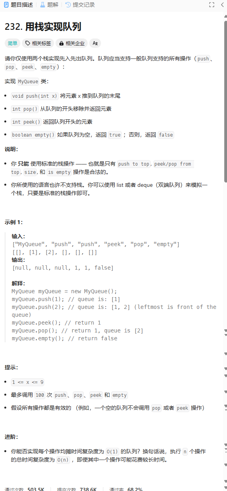
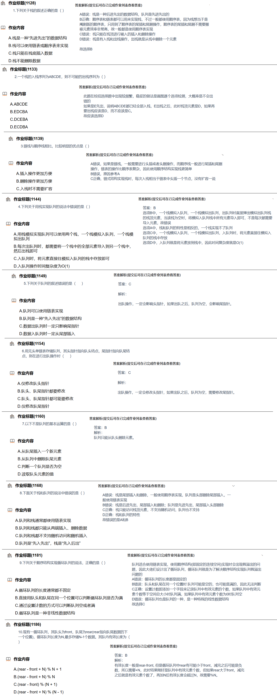

# 4. 栈(*)

## 4.1 栈的概念及结构

栈：一种特殊的线性表，其只允许在固定的一端进行插入和删除元素操作。**进行数据插入和删除操作的一端**称为栈顶，另一端称为栈底。栈中的数据元素遵守后进先出LIFO（Last In First Out）的原则。

压栈：栈的插入操作叫做进栈/压栈/入栈，**入数据在栈顶**。

出栈：栈的删除操作叫做出栈。**出数据也在栈顶**。



## 4.2 栈的实现

### 1 正式的栈

基本信息

> 用于动态申请内存的**指针**。
>
> **栈顶**。一般由整型变量担任。
>
> **容量**。一般由整型变量担任。

功能

**初始化栈（Init）**

> 指针置空。
>
> 栈顶指向栈底。这里有两种处理方式：
>
> > 假设`int top;`为表示栈顶的变量，`int *a;`为动态数组，`int t;`为即将入栈的元素。
> >
> > 1. 若栈顶元素初始化为`top = 0`，则尽量使用`a[top++] = t;`表示入栈。此时栈顶元素为`a[top-1]`。
> > 2. 若栈顶元素初始化为`top = -1`，则尽量使用`a[++top] = t;`表示入栈。此时栈顶元素为`a[top]`。
> >
> > 两种处理方式不能同时用，最好坚持一种风格。
>
> 栈容量置空。

**销毁栈（destroy）**

> 释放alloc系列函数（malloc，calloc，realloc以及c++关键字new）在堆区申请的空间并将指针置空。
>
> 栈顶元素和容量恢复初始值。

**入栈（push）**

> 假设`int top;`为表示栈顶的变量，`int *a;`为动态数组，`int t;`为即将入栈的元素。
>
> 1. 若栈顶元素初始化为`top = 0`，则尽量使用`a[top++] = t;`表示入栈。此时栈顶元素为`a[top-1]`。
> 2. 若栈顶元素初始化为`top = -1`，则尽量使用`a[++top] = t;`表示入栈。此时栈顶元素为`a[top]`。
>
> 这里以第1种风格为例。
>
> 首先判断栈顶元素和容量是否相等（即判断栈是否已满）。若满了则要进行有限的扩容。
>
> 后按照风格1入栈。

**出栈（pop）**

> 栈顶元素自减1即可。

**返回栈顶元素（top）**

> 假设`int top;`为表示栈顶的变量，`int *a;`为动态数组，`int t;`为即将入栈的元素。
>
> 1. 若栈顶元素初始化为`top = 0`，则尽量使用`a[top++] = t;`表示入栈。此时栈顶元素为`a[top-1]`。
> 2. 若栈顶元素初始化为`top = -1`，则尽量使用`a[++top] = t;`表示入栈。此时栈顶元素为`a[top]`。
>
> 若使用风格1，则返回`a[top-1]`。
>
> 若使用风格2，则返回`a[top]`。

**判断栈是否为空（empty）**

> 假设`int top;`为表示栈顶的变量，`int *a;`为动态数组，`int t;`为即将入栈的元素。
>
> 1. 若栈顶元素初始化为`top = 0`，则尽量使用`a[top++] = t;`表示入栈。此时栈顶元素为`a[top-1]`。
> 2. 若栈顶元素初始化为`top = -1`，则尽量使用`a[++top] = t;`表示入栈。此时栈顶元素为`a[top]`。
>
> 若使用风格1，则当`top == 0`时栈为空。
>
> 若使用风格2，则当`top == -1`时栈为空。

**返回栈中元素（size）**

> 假设`int top;`为表示栈顶的变量，`int *a;`为动态数组，`int t;`为即将入栈的元素。
>
> 1. 若栈顶元素初始化为`top = 0`，则尽量使用`a[top++] = t;`表示入栈。则栈中元素数为`top-1`。
> 2. 若栈顶元素初始化为`top = -1`，则尽量使用`a[++top] = t;`表示入栈。则栈中元素数为`top`。

### 2 栈的参考程序

`Stack.h`：

```c
#pragma once
#include<stdlib.h>
#include<assert.h>
#include<stdbool.h>

typedef int STDataType;
typedef struct Stack {
	STDataType* a;
	int top;//栈顶位置
	int capacity;
}ST;

void STInit(ST* pst);//初始化栈
void STDestroy(ST* pst);//销毁栈
void STPush(ST* pst, STDataType x);//数据入栈
void STPop(ST* pst);//删除栈顶元素
STDataType STTop(ST* pst);//返回栈顶元素
bool STEmpty(ST* pst);//判断栈是否为空
int STSize(ST* pst);//返回栈的元素个数
```

Stack.c

```c
#include "Stack.h"

void STInit(ST* pst) {//初始化栈 
	assert(pst);//真实存在的栈才能被初始化 
	pst->a = NULL;

	//pst->top = -1;   // top 指向栈顶数据
	pst->top = 0;   // top 指向栈顶数据的下一个位置

	pst->capacity = 0;//栈中元素数初始化为0 
}

void STDestroy(ST* pst) {//销毁栈 
	assert(pst);

	free(pst->a);//销毁alloc开辟在堆区的内存 
	pst->a = NULL;
	pst->top = pst->capacity = 0;
}

void STPush(ST* pst, STDataType x) {//入栈
	if (pst->top == pst->capacity) {
		int newCapacity = pst->capacity == 0 ? 4 : pst->capacity * 2;//线性表式扩容，因为栈也是特殊的线性表
		STDataType* tmp = (STDataType*)realloc(pst->a, newCapacity * sizeof(STDataType));
		if (tmp == NULL) {
			perror("realloc fail");
			return;
		}

		pst->a = tmp;
		pst->capacity = newCapacity;
	}

	pst->a[pst->top] = x;
	pst->top++;//因为栈顶要指向下一个元素 
}

void STPop(ST* pst) {//出栈
	assert(pst);
	assert(!STEmpty(pst));//栈不应该为空 

	pst->top--;//top指向栈顶元素的下一个位置，则退一格即可 
}

STDataType STTop(ST* pst) {//返回栈顶元素 
	assert(pst);
	assert(!STEmpty(pst));

	return pst->a[pst->top - 1];
	//之前top指向栈顶元素的下一个位置 
}

bool STEmpty(ST* pst) {//判断栈是否为空
	assert(pst);

	/*if (pst->top == 0) {
		return true;
	}
	else {
		return false;
	}*/

	return pst->top == 0;
}

int STSize(ST* pst) {//返回栈中元素数量 
	assert(pst);

	return pst->top;
}
```


### 3 简化的栈

根据上方栈的描述，我们完全可以省略大部分功能，弄一个临时的栈：

```c
int a[1000]={0};//静态数组表示栈，但容量固定。可根据实际情况开辟。类型可更换。
int top=0;//栈顶元素，这里采用风格1，则栈顶元素即为a[top-1]。

//之后写几个函数作为栈的接口即可
void push(int x){//风格1入栈
    a[top]=x;
    top++;
}
void pop(){//出栈
    top--;
}
int size(){//返回栈的元素数
    return top;
}
//其他功能可自行补充
```

## 4.3 栈的应用

这里简单举个例子。

原题地址：http://ybt.ssoier.cn:8088/problem_show.php?pid=1354

1354：括弧匹配检验
时间限制: 1000 ms     内存限制: 65536 KB

**【题目描述】**

假设表达式中允许包含两种括号：圆括号和方括号，其嵌套的顺序随意，如`（［］（））`或`［（［ ］［ ］）］`等为正确的匹配，`［（ ］）`或`（［ ］（ ）`或` ( ( ) ) ）`均为错误的匹配。

现在的问题是，要求检验一个给定表达式中的括弧是否正确匹配？

输入一个只包含圆括号和方括号的字符串，判断字符串中的括号是否匹配，匹配就输出 “`OK`” ，不匹配就输出“`Wrong`”。输入一个字符串：`［（［］［］）］`，输出：`OK`。

**【输入】**

输入仅一行字符（字符个数小于255）。

**【输出】**

匹配就输出 “`OK`” ，不匹配就输出“`Wrong`”。

**【输入样例】**

```
[(])
```

**【输出样例】**

```
Wrong
```


分析：遍历题解给的字符串，是左括号则入栈，是右括号则判断栈顶元素是否与该括号匹配，若匹配则出栈，不匹配则整个字符串不匹配。

若遍历完所有的字符串，栈中还有剩余的左括号，则整个字符串不匹配。

参考程序：

```c
#include<stdio.h>
#include<string.h>
int main () {
	char str[256];
	scanf("%[^\n]",str);
	int len=strlen(str);
    
    //一个数组和一个整型变量就能模拟一个栈的基本功能
	char str2[256]={0};                 //栈本体 
	int po=0;                           //栈顶 
    
    
	for(int i=0;i<len;i++) {
		if((str[i]=='[')||(str[i]=='(')) {//左括号入栈
			str2[po]=str[i];            //风格1入栈
			po++;
			continue;
		}
		else if(str[i]==')') {//右括号则观察是否和栈顶元素匹配
			if(str2[po-1]=='(') {
				str2[po-1]=0;
				po--;                   //风格1出栈
				continue;
			}
			printf("Wrong");
			return 0;
		}
		else if(str[i]==']') {
			if(str2[po-1]=='[') {
				str2[po-1]=0;
				po--;
				continue;
			}
			printf("Wrong");
			return 0;
		}
	}
	if(po==0)//判断栈是否为空
		printf("OK");
	else
		printf("Wrong");
	return 0;
}
```


# 5. 队列(*)

队列我们其实并不陌生。在生活中的排队本身也是一种队列。在旧时代（泛指非信息时代）的抽号机防插队也是用了这个。

## 5.1队列的概念及结构

队列：只允许在**一端进行插入数据操作**，在**另一端进行删除数据操作**的特殊线性表，队列具有先进先出FIFO(First In First Out) 入队列：进行插入操作的一端称为**队尾**，进行删除操作的一端称为**队头**。



## 5.2 队列的实现

队列也可以数组和链表的结构实现，使用链表的结构实现更优一些，因为如果使用数组的结构，队列在数组第一位弹出数据，可能伴随移位的操作，效率会比较低。即使不用移位，也会造成空间浪费。

### 1 链表实现

我们采用一个链表和两个指针的方式来模拟队列。术语 `A`(指针)指向`B`(指针)指的是`A`作为指针变量，存放有`B`（指针）的地址。

#### 基本信息

> 链式结构：表示队列
>
> ```c
> typedef struct QListNode {
>         struct QListNode* _pNext;
>         QDataType _data; 
> }QNode;
> ```
>
> 队列的结构
>
> ```c
> typedef struct Queue{
>        QNode* _front;
>        QNode* _rear;
>        int size;
> }Queue;
> ```
>
> > 之所以这么定义，是因为不是所有场合都用得到头、尾指针。这样分开，一个结构体代表整体，另一个结构体用于操作队列，使得队列的使用更方便。


#### 功能

**初始化**(**Init**)

> 代表一个队列的指针置空。
>
> 队列长度（下文简称队长）置0。

**队列销毁**(**Destroy**)

> 可参考链表操作的伪代码：
>
> ```c
> SLNode* head=链表头结点
> while(head没走到底){
> 	工作区间。
> 	head=head->指针域。
> }
> ```
>
> 链表头结点标记队头即可。
>
> 销毁链表之后进行一次**初始化(Init)**操作即可。

**入队**(**push**)

> 申请一个结点。
>
> 若队列处于刚初始化的状态，则新申请的结点即是队首也是队尾。
>
> 若队列中有结点，将队尾的指针域指向新申请的结点即可。
>
> 队长加1。

**出队**(**pop**)

> 出队即单链表的头删。分两种情况：
>
> 1. 一个结点
>    释放头结点，后进行队列**初始化(Init)**操作。
> 2. 多个结点
>    先标记头结点后的第二个结点。
>    释放头结点。将第二个结点更新为新的头结点。
>
> 不要忘记队长减一。

**获取队首元素**(**Front**)

> 一般是返回队首的数据域里的数据，因为头结点虽然能随时访问，但以后使用c++的话，可能需要限制对数据的访问。
>
> 同时不要忘记先判断队列是否为空。

**获取队尾元素**(**Back**)

> 同**获取队首元素(Front)**一样，只是指针变成了尾结点。

**获取队列长度**(**Size**)

> 若定义中有定义变量来存储，返回这个变量即可。
>
> 若没有，则需要通过遍历链表来获得长度。
>
> 遍历链表同样遵循伪代码：
>
> ```c
> SLNode* head=链表头结点
> while(head没走到底){
> 	工作区间。
> 	head=head->指针域。
> }
> ```

**判断队列是否为空**(**Empty**)

> 若定义中有定义变量来存储，判断这个变量是否为0即可。
>
> 若没有，则需要判断头、尾结点指针是否为空。

#### 参考程序

Queue.h

```c
#pragma once

#include<stdlib.h>
#include<assert.h>
#include<stdbool.h>

typedef int QDataType;
typedef struct QueueNode {//这里采用单链表模拟队列
	struct QueueNode* next;
	QDataType data;
}QNode;

typedef struct Queue {//操作队列的工具和队列的元素分开
	QNode* phead;
	QNode* ptail;
	int size;
}Queue;

void QueueInit(Queue* pq);//队列初始化
void QueueDestroy(Queue* pq);//队列的销毁
void QueuePush(Queue* pq, QDataType x);//x入队
void QueuePop(Queue* pq);//弹出队首
QDataType QueueFront(Queue* pq);//获取队首元素
QDataType QueueBack(Queue* pq);//获取队尾元素
int QueueSize(Queue* pq);//获取队列长度
bool QueueEmpty(Queue* pq);//判断队空
```


Queue.c

```c
#include"Queue.h"

void QueueInit(Queue* pq) {//队列初始化
	assert(pq);//既然我选择将队列给这个函数进行处理，则队列应该存在

	pq->phead = NULL;
	pq->ptail = NULL;
	pq->size = 0;
}

void QueueDestroy(Queue* pq) {//队列的销毁
	assert(pq);

	QNode* cur = pq->phead;
	while (cur) {
		QNode* next = cur->next;
		free(cur);
		cur = next;
	}

	pq->phead = pq->ptail = NULL;
	pq->size = 0;
}

void QueuePush(Queue* pq, QDataType x) {//x入队
	assert(pq);

	QNode* newnode = (QNode*)malloc(sizeof(QNode));
	if (newnode == NULL) {
		perror("malloc fail\n");
		return;
	}
	newnode->data = x;
	newnode->next = NULL;

	if (pq->ptail == NULL) {
		assert(pq->phead == NULL);

		pq->phead = pq->ptail = newnode;
	}
	else {
		pq->ptail->next = newnode;
		pq->ptail = newnode;
	}


	pq->size++;
}

void QueuePop(Queue* pq) {//弹出队首
	assert(pq);
	assert(!QueueEmpty(pq));
	//不放一起判断是因为这样做无法判断是空地址还是队列为空

	// 1、一个节点
	// 2、多个节点
	if (pq->phead->next == NULL) {
		free(pq->phead);
		pq->phead = pq->ptail = NULL;
	}
	else {
		// 头删
		QNode* next = pq->phead->next;
		free(pq->phead);
		pq->phead = next;
	}

	pq->size--;
}

QDataType QueueFront(Queue* pq) {//获取队首元素
	assert(pq);
	assert(!QueueEmpty(pq));

	return pq->phead->data;
}

QDataType QueueBack(Queue* pq) {//获取队尾元素
	assert(pq);
	assert(!QueueEmpty(pq));

	return pq->ptail->data;
}

int QueueSize(Queue* pq) {//获取队列长度
	assert(pq);

	return pq->size;
}

bool QueueEmpty(Queue* pq) {//判断队空
	assert(pq);

	/*return pq->phead == NULL
		&& pq->ptail == NULL;*/
	return pq->size == 0;
}

```

### 2 数组实现循环队列

我们有时还会使用一种队列叫**循环队列**。如操作系统课程讲解生产者消费者模型时可以就会使用循环队列。环形队列可以使用数组实现，也可以使用循环链表实现。



我们依旧从队列的功能角度对循环队列进行分析。分析的是**数组实现的循环队列**。

可通过这个OJ题来检测自己设计的循环队列：[622. 设计循环队列 - 力扣（LeetCode）](https://leetcode.cn/problems/design-circular-queue/) 

##### 基本信息

我们定义用变量`qf`代表队首，变量`qb`代表队尾。

数组`a`代表队列本体。

变量`N`表示数组的大小。


##### 功能

###### 初始化(Init)

`qf`，`qd`都赋予相同的值（数组表示循环队列的话推荐0）。

数组开多少单位决定队列能容纳多少数据，可根据情况选择。


###### 入队(push)

若`x`为准备入队的新数据，这里规定`a[qb++]=x;`即为入队。每次成功入队后，进行一次`qb%=N;`防止溢出。


###### 出队(pop)

这里规定`qf++;`即可完成出队操作。

每次成功出队后，进行一次`qf%=N;`防止溢出。

至于数据是否清空，取决于个人喜好。


###### 判断队列是否为空(Empty)

若当`qf==qb`时队列为空，可能会出现这种情况：



所以为了避免这种情况出现，我们可以做如下处理：

(1) 留1个空间控制。此时当`qf+1==qb`时队满。

(2) 增加记录队长的变量size。当`size==0`时队空，当`size==8`时队满。

**这里选择留1个空间控制。**此时当`qb==qf`时队列为空。


###### 判断队列是否为满(Full)

因为是从用数组建立环形队列的角度来看，而数组即使要扩容也需要判断容量，所以需要判断队列是否为满就有必要。

将这个环用方块拼在一起的图形来代替。



> 到这里可以看出，循环列表避免不了`qf`的前一个数据是`qb`的情况，所以单向循环链表实现的循环队列获取队尾并不方便。若一定要用链表实现，解决思路：
>
> 1. 从一开始就用双向链表。
> 2. 增加一个**队首前**指针标记尾元素。
> 3. 遍历获取数据（效率最差的一种方式）。

这个队列我们可以认为满队时存在`7`个数据，开了`N=8`个空间。

满队的标志：`(qb+1)%N==qf`。

例如这里。



数组的下标是从0开始，所以`(qb+1)%N==qf`也即`(1+1)%8==2`。

所以可以通过表达式`(qb+1)%N==qf`来判断队列是否满员。


###### 获取队尾元素(Back)

我们将两个一样的队列拼在一起。



虽然`a[qb-1]`的内容即为队尾，但当`qb==0`时不符合数组的下标访问方式的要求，所以我们对qb进行一定的处理。

所以队尾为`a[(qb+N-1)%N]`。


###### 队列销毁(Destroy)

释放`a`申请的空间。其他变量全部置0。

但销毁后的循环队列要先**初始化(Init)**后才能再次使用。


###### 获取队首元素(Front)

队首即为`a[qf]`。`qf`在每次**入队(push)**时都会做一次取模处理，所以这里可以不做处理。


**获取队列长度(Size)**

考虑到`qf`可能比`qb`小，我们需要做预处理。

例如这个队列，将两个队列拼在一起。


所以可以很容易的看出队列长度为`(qb+N-f)%(N)`。


##### 参考程序

```c
#include<stdlib.h>

//队列基本信息
int qf = 0, qb = 0;//队首，队尾
int* a;//数组
int k = 0, N = 0;//元素个数，数组大小

//初始化
void Init(int num) {
	qf = qb = 0;
	a = (int*)malloc(sizeof(int)*(num + 1));
	k = 0;
	N = num + 1;//预留1个空间方便做判断
}

//判断队列是否为空
int Empty() {
	return qb == qf ? 1 : 0;
}

//判断队列是否为满
int Full() {
	return (qb + 1) % N == qf ? 1 : 0;
}

//入队
void Push(int x) {
	if (Full())
		return;//入队失败可自己加提示
	a[qb++] = x;
	qb %= N;
}

//出队
void Pop() {
	if (Empty())
		return;
	qf++;
	qf %= N;
}

//获取队首元素
int Front() {
	if (Empty())
		return -1;
	return a[qf];
}

//获取队尾元素
int Back() {
	if (Empty())
		return -1;
	return a[(qb + N - 1) % N];
}

//销毁队列
void Destroy() {
	qb = qf = k = N = 0;
	free(a);
	a = NULL;
}

//获取队列长度
int Size() {
	return (qb + N - qf) % N;
}
```

## 5.3 用队列实现栈

原OJ题：[225. 用队列实现栈 - 力扣（LeetCode）](https://leetcode.cn/problems/implement-stack-using-queues/description/)



#### 两队列实现栈

1. **入栈的实现**

选非空的队列进行push，两个都空的话随便选。

2. **出栈的实现和返回栈顶元素**

假设我们有两个队列1、2。

若1队列非空，2队列为空，则1队列除了队尾全部转移到2队，1队仅剩的1个元素即为目标元素。

随着操作次数变多，我们可能会忘了哪个队列为空。此时需要假设一个队列为空，再去验证该队列是否为空。

3. **判断队列是否为空**

两个队列都没有数据时，栈才算为空。

为节省篇幅，这里用STL来模拟相应的数据结构。

参考程序：

```c
#include<queue>
using namespace std;

class MyStack {
public:
    MyStack() {
        size=0;
    }
    
    void push(int x) {//入栈
        if(!q2.empty()){
            q2.push(x);
            size++;
        }
        else{
            q1.push(x);
            size++;
        }
    }
    
    int pop() {
        
        //假设队列q1为空
        queue<int>*emptyQ=&q1,*noEmptyQ=&q2;
        if(!(*emptyQ).empty()){
            emptyQ=&q2;
            noEmptyQ=&q1;
        }
        
        //将非空队列的数据转移到空队列
        while((*noEmptyQ).size()>1){
            (*emptyQ).push((*noEmptyQ).front());
            (*noEmptyQ).pop();
        }
        
        
        int t=(*noEmptyQ).front();//获取栈顶元素
        (*noEmptyQ).pop();
        size--;
        return t;
    }
    
    int top() {
        //这里的操作和pop函数是一样的
        queue<int>*emptyQ=&q1,*noEmptyQ=&q2;
        if(!(*emptyQ).empty()){
            emptyQ=&q2;
            noEmptyQ=&q1;
        }
        while((*noEmptyQ).size()>1){
            (*emptyQ).push((*noEmptyQ).front());
            (*noEmptyQ).pop();
        }
        int t=(*noEmptyQ).front();
        (*noEmptyQ).pop();
        
        (*emptyQ).push(t);
        return t;
    }
    
    bool empty() {
        return size==0;
    }
private:
    queue<int>q1,q2;
    int size;
};

/**
 * Your MyStack object will be instantiated and called as such:
 * MyStack* obj = new MyStack();
 * obj->push(x);
 * int param_2 = obj->pop();
 * int param_3 = obj->top();
 * bool param_4 = obj->empty();
 */
```

#### 一个队列实现栈

假设我们只有一个队列q。

思路：

1. **入栈**

假设我们要将数据x入队。

若队列q为空，则x正常入队。

若队列有数据，则先标记队列内的元素长度，再将x入队，最后将除了x的数据全部进行先出队再入队的操作，保证队首始终为后进的元素。

2. **出栈和获取栈顶元素**

队列正常弹出队首即可。

3. **判断栈是否为空**

直接判断队列是否为空即可。

参考程序：

```c
#include<queue>
using std::queue;

class MyStack {
public:
    void push(int x) {
        int num=q.size();//获取当前队列元素个数
        q.push(x);
        while(num--){//除了x都进行一次排队的操作
            int t=q.front();
            q.pop();
            q.push(t);
        }
    }
    
    //之后都是正常队列的操作
    int pop() {
        int t=q.front();
        q.pop();
        return t;
    }
    
    int top() {
        int t=q.front();
        return t;
    }
    
    bool empty() {
        return q.empty();
    }
private:
    queue<int>q;
};

/**
 * Your MyStack object will be instantiated and called as such:
 * MyStack* obj = new MyStack();
 * obj->push(x);
 * int param_2 = obj->pop();
 * int param_3 = obj->top();
 * bool param_4 = obj->empty();
 */
```

## 5.4 用栈实现队列

[232. 用栈实现队列 - 力扣（LeetCode）](https://leetcode.cn/problems/implement-queue-using-stacks/description/)



#### 两栈实现队列

模仿两队列实现栈的思路。

参考程序：

```c
#include<stack>
using std::stack;

class MyQueue {
public:
    MyQueue() {
        size=0;
    }
    
    void push(int x) {
        if(!s2.empty()){
            s2.push(x);
            size++;
        }
        else{
            s1.push(x);
            size++;
        }
    }
    
    int pop() {
        //找出空栈
        stack<int>*emptyS=&s1,*noEmptyS=&s2;
        if(!(*emptyS).empty()){
            emptyS=&s2;
            noEmptyS=&s1;
        }
        
        //获取栈顶元素
        while((*noEmptyS).size()>1){
            (*emptyS).push((*noEmptyS).top());
            (*noEmptyS).pop();
        }
        int t=(*noEmptyS).top();
        (*noEmptyS).pop();//这步使非空栈变为空
        size--;

        return t;
    }
    
    int peek() {
        stack<int>*emptyS=&s1,*noEmptyS=&s2;
        if(!(*emptyS).empty()){
            emptyS=&s2;
            noEmptyS=&s1;
        }
        while((*noEmptyS).size()>1){
            (*emptyS).push((*noEmptyS).top());
            (*noEmptyS).pop();
        }
        int t=(*noEmptyS).top();
        
        while((*emptyS).size()){//因为没有进行pop操作，需要将数据放回原栈
            
            (*noEmptyS).push((*emptyS).top());
            (*emptyS).pop();
        }

        return t;
    }
    

    bool empty() {
        return size==0;
    }
private:
    stack<int>s1,s2;
    int size;
};

/**
 * Your MyCircularQueue object will be instantiated and called as such:
 * MyCircularQueue* obj = new MyCircularQueue(k);
 * bool param_1 = obj->enQueue(value);
 * bool param_2 = obj->deQueue();
 * int param_3 = obj->Front();
 * int param_4 = obj->Rear();
 * bool param_5 = obj->isEmpty();
 * bool param_6 = obj->isFull();
 */
```

#### push栈和pop栈

1. **入队**

一个栈用于实现数据入队操作，记为`ins`栈；另一个栈用于实现出队操作，记为`outs`栈。

2. **出队**

若`outs`栈为空，则`ins`栈的数据全部压入`outs`栈再pop；

若`outs`栈非空，直接出栈即可。

3. **获取队首元素**

套用出栈的思路即可。

或将**出栈**获取栈顶元素的步骤用于**获取栈顶元素的函数**的实现，出栈的函数调用**获取栈顶元素的函数**即可。

4. **判断队列是否为空**

两个栈都为空，队列则为空。


**参考程序：**

```c
class MyQueue {//一个栈用于push，一个栈用于pop
public:
    MyQueue() {
        size=0;
    }
    
    void push(int x) {//入栈
        ins.push(x);
        size++;
    }
    
    int pop() {//出栈
        int t=this->peek();
        outs.pop();
        size--;
        return t;
    }
    
    int peek() {//获取栈顶元素
        if(outs.empty()){
            while(ins.size()>1){
                outs.push(ins.top());
                ins.pop();
            }
            int t=ins.top();
            ins.pop();
            outs.push(t);//到这里，ins栈为空
            return t;
        }
        return outs.top();
    }
    

    bool empty() {
        return size==0;
    }
private:
    stack<int>ins,outs;
    int size;
};
```


#### 一个栈实现队列

原则上一个栈是不可能实现完整的队列操作，至少需要两个栈。

但我们可以利用栈的特性，通过递归来暂时替代另一个栈的功能。

1. **入队**

假设元素x为入队的元素。

若栈内没有元素，则x直接入栈。

若栈内有元素，则先取出栈顶元素进行保存，之后进行递归。直到栈空时，将x入栈。之后回溯的过程中将通过递归保存的数据重新放回栈。

2. **出队**

正常弹出栈顶元素即可。

3. **获取队首元素**

正常返回栈顶元素即可。

4. **判断队列是否为空**

栈为空，队列则为空。


这里入队的每层递归时间复杂度都为$O(1)$，所有的$n$个数据都进行一次递归的话，时间复杂度为$O(n)$。

参考程序：

```c
#include<stack>
using std::stack;

class MyQueue {
public:
    void push(int x) {
        //栈为空则x入栈
        if(sk.empty()){
            sk.push(x);
            return;
        }
        int t=sk.top();
        sk.pop();
        push(x);
        sk.push(t);//回溯操作其实也用到了系统自带的栈
        
    }
    
    int pop() {
        int t=sk.top();
        sk.pop();
        return t;
    }
    
    int peek() {
        int t=sk.top();
        return t;
    }
    

    bool empty() {
        return sk.empty();
    }
private:
    stack<int>sk;
};

/**
 * Your MyQueue object will be instantiated and called as such:
 * MyQueue* obj = new MyQueue();
 * obj->push(x);
 * int param_2 = obj->pop();
 * int param_3 = obj->peek();
 * bool param_4 = obj->empty();
 */
```

# 栈和队列有关的选择题

