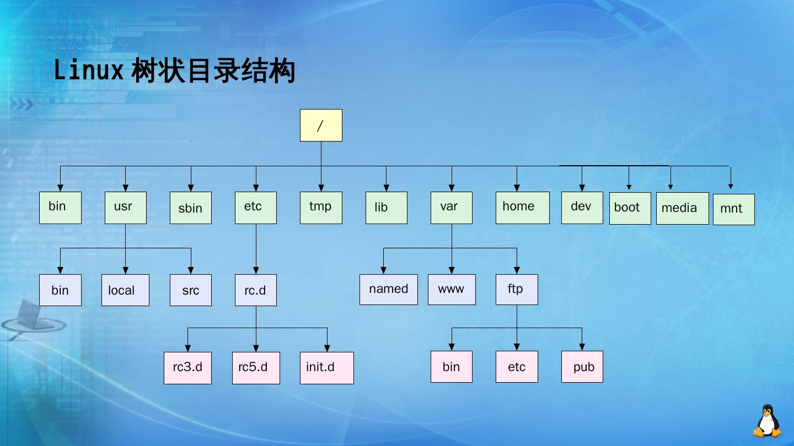
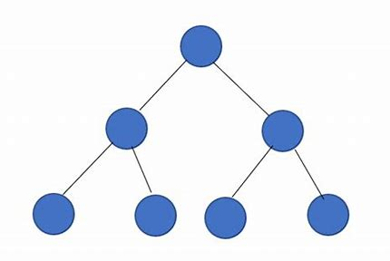
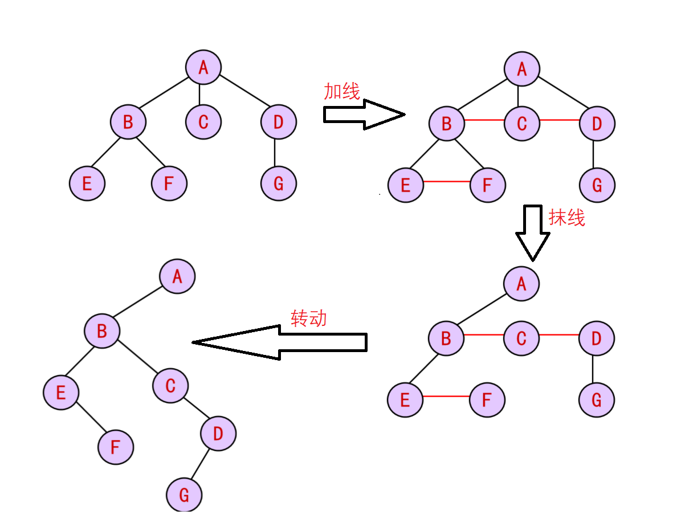

# 6. 树

## 6.1 树概念及结构

### 1 树的概念

树是一种**非线性**的数据结构，它是由$n$（$n>=0$）个有限结点组成一个具有层次关系的集合。**把它叫做树是因为它看起来像一棵倒挂的树，也就是说它是根朝上，而叶朝下的**。

* 有一个**特殊的结点，称为根结点**，根节点没有前驱结点

* 除根节点外，其余结点被分成$M(M>0)$个互不相交的集合$T_1$、$T_2$、……、$T_m$，其中每一个集合$T_i(1\leq i \leq m)$又是一棵结构与树类似的子树。每棵子树的根结点有且只有一个前驱，可以有0个或多个后继

* 因此，**树是递归定义**的。树将一个整体分成若干个根和子树。

**注意：树形结构中，子树之间不能有交集，否则就不是树形结构，在数据结构中这种有交集的树不再是树，而是图。**


关于树，结点和节点指同一个东西。虽然节点更像是通过输入法打字造成的错词。

### 2 树的术语解读

> 关于树：树的概念参照树+人类亲缘关系描述。
>
> 现代计算机基本起源于欧美，翻译上可能存在争议和社会色彩。无论什么样的翻译，不影响学习即可。

**节点的度**：一个节点含有的**子树的个数**称为该节点的度； 如图：A的度为6。


**叶节点或终端节点**：**度为0的节点**称为叶节点； 如上图：B、C、H、I...等节点为叶节点。

> 除了叶结点都是分支结点。

**非终端节点或分支节点**：**度不为0的节点**； 如上图：D、E、F、G...等节点为分支节点。

> A既是分支结点，又是根结点，它可以有多重身份。

**双亲节点或父节点**：若一个节点**含有子节点**，则这个节点称为其子节点的父节点； 如上图：A是B的父节点。

**孩子节点或子节点**：一个节点含有的**子树的根节点**称为该节点的子节点； 如上图：B是A的孩子节点。

**兄弟节点**：**具有相同父节点**的节点互称为兄弟节点； 如上图：B、C是兄弟节点。

> 除了亲兄弟，还有堂兄弟结点表示它们是同辈分但不一定是一样的父结点，比如H，I。这种说法不常用。

**树的度**：一棵树中，**最大的节点的度**称为树的度； 如上图：树的度为6（A结点有6个子结点是所有结点中度最大的，所以A的度为6也就是是树的度）。

**节点的层次**：从根开始定义起，根为第1层，根的子节点为第2层，以此类推；

**树的高度或深度**：树中**节点的最大层次**； 如上图：树的高度为4。

> 1个结点的树高（层次）为1，空树的树高为0，这是以根结点为第一层来定义的。
>
> 若按根结点为第0层算，则空树树高为-1。
>
> 一般根结点的树高为1更常用。

**堂兄弟节点**：双亲在**同一层的节点**互为堂兄弟；如上图：H、I互为兄弟节点。

> 这个概念不常用。

**节点的祖先**：从**根到该节点**所经分支上的所有节点；如上图：A是所有节点的祖先。

**子孙**：以**某节点为根的子树中任一节点**都称为该节点的子孙。如上图：所有节点都是A的子孙。

**森林**：由$m(m>0)$棵互不相交的树的集合称为森林。

### 3 树的表示

树结构**既然保存值域，也要保存结点和结点之间的关系**，实际中树有很多种表示方式如：双亲表示法，孩子表示法、孩子双亲表示法以及孩子兄弟表示法等。

我们这里就简单的了解其中最常用的**孩子兄弟表示法**（有人也叫左孩子右兄弟表示法）。


```c
typedef int DataType;
struct Node
{
    struct Node* _firstChild1; // 第一个孩子结点
    struct Node* _pNextBrother; // 指向其下一个兄弟结点
    DataType _data; // 结点中的数据域
};
```

孩子兄弟表示法可以表示任何树型数据结构。电脑中的树的应用就是文件系统。

Linux操作系统用斜杠`/`表示根目录。



windows操作系统的目录结构是森林或一棵树。windows的树使用的孩子兄弟表示法。

点击进入某个文件夹即为链表的遍历。

添加文件夹本质是在最后一个兄弟结点后插入一个结点。

## 6.2 二叉树概念及结构

所有的树型数据结构中二叉树是用的最多的。

### 1 二叉树概念

一棵二叉树是结点的一个有限集合，该集合:

1. 或者为空。

2. 由一个根节点加上两棵别称为左子树和右子树的二叉树组成。


可以看出：

1. 二叉树不存在度大于2的结点。
2. 二叉树的子树有左右之分，次序不能颠倒，因此二叉树是有序树。

注意：对于任意的二叉树都是由以下几种情况复合而成的：


> 二叉树在现实中也有对应的树。但我们学的是一种数据结构，而现实的二叉树就是一棵植物。
>
> 

### 2 特殊的二叉树

1. **满二叉树**：一个二叉树，如果**每一个层的结点数都达到最大值**，则这个二叉树就是满二叉树。也就是说，如果一个二叉树的层数为$K$，且**结点总数**是$2^k-1$，则它就是满二叉树。如图所示，它的层数$K=3$，结点树为$2^3-1=7$，是一个普通的满二叉树。



2. **完全二叉树**：完全二叉树是效率很高的数据结构，完全二叉树是由满二叉树而引出来的。对于深度为K的，有n个结点的二叉树，当且仅当其**每一个结点都与深度为K的满二叉树中编号从1至n的结点一一对应**时称之为完全二叉树。 要注意的是满二叉树是一种特殊的完全二叉树。如图是一个完全二叉树，它的5个结点都与7个结点的满二叉树一一对应。


### 3 二叉树的性质

1. 若规定根节点的层数为1，则一棵非空二叉树的第i层上最多有$2^{i-1}$个结点（$i\geq 1$）。

> 数学规划法：
>
> 当$i=1$时，$2^{i-1}=1$明显成立。
>
> 假设第$i-1$层时命题也成立，因为二叉树的每个结点的度最多为2，
>
> 所以在第$i$层上的最大结点数为第$i-1$层的2倍，所以第$i$层的结点数为
>
> $2\times2^{i-2}=2^{i-1}$。

2. 若规定根节点的层数为1，则深度为$h$的二叉树的最大结点数是$2^h-1$ 。

> 当二叉树为满二叉树时拥有最大结点数。
>
> 设某满二叉树为h层，则每层的结点数依次为1,2,4, $\cdots$,$2^{h-1}$，
>
> 由等比数列求和公式，总的结点数为
>
> $1+2+4+\cdots+2^{h-1}=\frac{1\times(1-2^{h})}{1-2}=2^h-1$。

3. 对任何一棵二叉树, 如果度为0其叶结点个数为$n_0$ , 度为2的分支结点个数为$n_2$,|
   则有$n_0 ＝n_2 +1$。

> 记n为总结点数，$n_1$为度为1的结点总数，则
>
> $n=n_0+n_1+n_2$，
>
> 而一棵二叉树中的所有子结点数为**度为1的结点数**和**度为2的子结点数**为$n_1+2n_2$，只有根结点没有父结点，所以二叉树的结点数还可以等于
>
> $n=n_1+2n_2+1$，
>
> 两个方程消去$n$和$n_1$得到$n_0=n_2+1$。

4. 若规定根节点的层数为1，具有n个结点的满二叉树的深度，$h=floor(log_{2}(n+1))$
   ($log_{2}(n+1)$即以$2$为底，$n+1$为对数，`floor`是c语言的库函数，它表示不小于$log_{2}(n+1)$的最小整数)。

> 满二叉树的总结点数为$n=2^h-1$，则树的高度为$log_2{(n+1)}$并向上取整。

5. 对于具有$n$个结点的**完全二叉树**，如果按照从上至下从左至右的数组顺序对所有节点从0开始编号，则对于序号为i的结点有：

> 1. 若$i>0$，$i$位置节点的双亲序号：$[(i-1)/2]$（即不大于$(i-1)/2$的最大整数）；$i=0$，$i$为根节点编号，无双亲节点。
>
> 2. 若$2i+1<n$，左孩子序号：$2i+1$，$2i+1\geq n$时无左孩子。
>
> 3. 若$2i+2<n$，右孩子序号：$2i+2$，$2i+2\geq n$时无右孩子。

补充1. 对任意$n$个结点的二叉树，空结点个数为$n+1$。

> 根据性质3的推导过程有：
>
> $n=n_0+n_1+n_2$
>
> $n=n_1+2n_2+1$
>
> 空链域是指空结点的数量，根据定义，这个数量为
>
> $2n_0+n_1$
>
> 将最开始的两个方程处理：
>
> $2n=2n_0+2n_1+2n_2$
>
> $n=n_1+2n_2+1$
>
> 上减下即可得到：
>
> $n+1=2n_0+n_1$
>
> 即n个结点的二叉树有$n+1$个空的链域。

### 补充——树和森林的关系

回顾森林的概念：由$m(m>0)$棵互不相交的树的集合称为森林。

这里简单补充树和森林的相互转换，因为用的多的其实还是二叉树。

#### 1 树转化为二叉树

方法： 

1. 树中所有亲兄弟之间加一条连线。（加线）
2. 对树中的每个结点，只保留它与第一个孩子结点之间的连线，删去它与其它孩子结点之间的连线。（抹线）
3. 以树的根结点为轴心，将整棵树顺时针转动一定的角度，使之结构层次分明。

样例：



#### 2 森林转化为二叉树

方法：

1. 将森林中的每棵树转换成相应的二叉树。
2. 第一棵二叉树不动，从第二棵二叉树开始，依次把后一棵二叉树的根结点作为前一棵二叉树根结点的右孩子，当所有二叉树连起来后，此时所得到的二叉树就是由森林转换得到的二叉树。 

样例：


#### 3 二叉树转换为森林

方法：

1. 若某结点是其双亲的左孩子，则把该结点的右孩子、右孩子的右孩子$\cdots$都与该结点的双亲结点用线连起来；（加线）
2. 删去原二叉树中所有的双亲结点与右孩子结点的连线；（抹线 ）
3. 整理由1、2两步所得到的树或森林，使之结构层次分明。

样例：


## 6.3 二叉树链式结构及简单实现

二叉树链式结构就是通过链表和递归的方式建的树。在学习二叉树的基本操作前，需先要创建一棵二叉树，然后才能学习其相关的基本操作。

最简单最朴素的建树方式是凭空生成结点进行拼凑。

比如这个程序：

```c
typedef int BTDataType;
typedef struct BinaryTreeNode
{
	BTDataType _data;
	struct BinaryTreeNode* _left;
	struct BinaryTreeNode* _right;
}BTNode;

BTNode* BuyNode(BTDataType x)
{
	BTNode* node = (BTNode*)malloc(sizeof(BTNode));
	if (node == NULL)
	{
		perror("malloc fail");
		return NULL;
	}

	node->data = x;
	node->left = NULL;
	node->right = NULL;

	return node;
}

BTNode* CreatBinaryTree()
{
	BTNode* node1 = BuyNode(1);
	BTNode* node2 = BuyNode(2);
	BTNode* node3 = BuyNode(3);
	BTNode* node4 = BuyNode(4);
	BTNode* node5 = BuyNode(5);
	BTNode* node6 = BuyNode(6);

	node1->_left = node2;
	node1->_right = node4;
	node2->_left = node3;
	node4->_left = node5;
	node4->_right = node6;
	return node1;
}
```

这个程序就是建这样一棵树：


但后续建树肯定不能这么建，因为要管理的数据的形式不一定支持全部转换为树的结点。

### 1 遍历二叉树

建树前先学习二叉树的结构。学习二叉树结构，最简单的方式就是**遍历**。所谓二叉树遍历(Traversal)是**按照某种特定的规则**，**依次对二叉树中的节点进行相应的操作**，**并且每个节点只操作一次**。访问结点所做的操作依赖于具体的应用问题。 遍历是二叉树上最重要的运算之一，也是二叉树上进行其它运算的基础。

按照规则，二叉树的遍历有：**前序**/**中序**/**后序**的递归结构遍历：

1. 前序遍历(Preorder Traversal 亦称先序遍历)——访问根结点的操作发生在遍历其左右子树之前（暂时记为**根左右**）。

2. 中序遍历(Inorder Traversal)——访问根结点的操作发生在遍历其左右子树之中（间）（暂时记为**左根右**）。

3. 后序遍历(Postorder Traversal)——访问根结点的操作发生在遍历其左右子树之后（暂时记为**左右根**）。

由于被访问的结点必是某子树的根，所以N(Node）、L(Left subtree）和R(Right subtree）又可解释为根、根的左子树和根的右子树。NLR、LNR和LRN分别又称为先根遍历、中根遍历和后根遍历。

这里重点描述一下前序遍历。中序遍历和后序遍历可以根据递归的顺序进行画图理解。

前序遍历的原理如图：


所以前序遍历的结果：123456。

实际上前序遍历的结果应该这样表示：`123###45##6##`，`#`表示遍历到了空树。

前序遍历的程序实现也不复杂：

```c
typedef int BTDataType;
typedef struct BinaryTreeNode
{
	BTDataType _data;
	struct BinaryTreeNode* _left;
	struct BinaryTreeNode* _right;
}BTNode;

void PrevOrder(BTNode* root) {//遍历二叉树（前序遍历），root为树的根结点
	if (root == NULL) {
		printf("#");
		return;
	}
    
    //这就是为什么简记前序遍历为根左右的原因：记遍历顺序
	printf("%d ", root->_data);//（遍历）根
	PrevOrder(root->_left);//（遍历）左（子树）
	PrevOrder(root->_right);//（遍历）右（子树）
}
```

同样的方法，我们可以依次实现左根右（中序遍历）和左右根（后序遍历）。

左根右（中序遍历）的参考程序：

```c
typedef int BTDataType;
typedef struct BinaryTreeNode
{
	BTDataType _data;
	struct BinaryTreeNode* _left;
	struct BinaryTreeNode* _right;
}BTNode;

void InOrder(BTNode* root) {//左根右遍历二叉树（中序）
	if (root == NULL) {
		printf("#");
		return;
	}

	InOrder(root->_left);
	printf("%d ", root->_data);
	InOrder(root->_right);
}
```

左右根（后序遍历）参考程序：

```c
typedef int BTDataType;
typedef struct BinaryTreeNode
{
	BTDataType _data;
	struct BinaryTreeNode* _left;
	struct BinaryTreeNode* _right;
}BTNode;

void PostOrder(BTNode* root) {//左右根遍历二叉树（后序）
	if (root == NULL) {
		printf("#");
		return;
	}

	PostOrder(root->_left);
	PostOrder(root->_right);
	printf("%d ", root->_data);
}
```

三种遍历方式的不同之处只有遍历的顺序。

每种遍历的非递归实现：

前序遍历：

```c
typedef int BTDataType;
typedef struct BinaryTreeNode
{
	BTDataType _data;
	struct BinaryTreeNode* _left;
	struct BinaryTreeNode* _right;
}BTNode;

// 二叉树前序遍历非递归
void PrevOrderNonR(BTNode* root) {
	//非递归实现关键在于每个结点只回溯一次
	if (root == NULL) return;
	BTNode* sk[101] = { NULL }; int psk = 0;//简易栈
	BTNode* p = root;
	while (1) {
		while (p) {
			printf("%c ", p->_data);//根
			if (psk > 100) return;//可根据情况选择用可扩容的方式，或用链式栈
			sk[++psk] = p;//入栈
			p = p->_left;//访问左子树，直到左子树为空
		}
		if (psk < 1) return;//栈空时停止遍历
		p = sk[psk--];//回溯
		p = p->_right;//访问右子树
	}
}
```

中序遍历：

```c
typedef int BTDataType;
typedef struct BinaryTreeNode
{
	BTDataType _data;
	struct BinaryTreeNode* _left;
	struct BinaryTreeNode* _right;
}BTNode;

// 二叉树中序遍历非递归
void InOrderNonR(BTNode* root) {
	if (root == NULL) return;
	BTNode* sk[101] = { NULL }; int psk = 0;
	BTNode* p = root;
	while (1) {
		while (p) {
			if (psk > 100) return;
			sk[++psk] = p;
			p = p->_left;//左
		}
		if (psk < 1) return;
		p = sk[psk--];//回溯
		printf("%c ", p->_data);//根
		p = p->_right;//右
	}
}
```

后序遍历的每个结点都要入栈两次。

```c
typedef int BTDataType;
typedef struct BinaryTreeNode
{
	BTDataType _data;
	struct BinaryTreeNode* _left;
	struct BinaryTreeNode* _right;
}BTNode;

// 二叉树后序遍历非递归
void PostOrderNonR(BTNode* root) {
	//后续遍历的每个结点都要入栈两次，
	//或者说回溯两次
	if (root == NULL) return;
	typedef struct troot {
		BTNode* root;//记录当前结点
		int flag;//记录回溯次数
	}troot;
	troot sk[101] = { {NULL,0} }; int psk = 0;
	BTNode* p = root;
	while (1) {
		while (p) {
			if (psk > 100) return;
			sk[++psk].root = p, sk[psk].flag = 0;
			p = p->_left;
		}
		if (psk < 1) return;

		p = sk[psk].root,sk[psk].flag++;//回溯
		while (sk[psk].flag > 1) {//结点回溯过2次就处理
			printf("%c ", p->_data);
			p = sk[--psk].root;
			if (psk < 1) return;
			sk[psk].flag++;
		}
		p = p->_right;
	}
}
```


### 2 建立和销毁二叉树

链式结构建立二叉树有条件限制：首先要知道树的其中一种遍历结果，这个结果还要标记在什么时候遍历到空树，然后才能枚举遍历结果进行判断。

例如：通过前序遍历的结果产生的字符串构建二叉树。

```c
typedef int BTDataType;
typedef struct BinaryTreeNode
{
	BTDataType _data;
	struct BinaryTreeNode* _left;
	struct BinaryTreeNode* _right;
}BTNode;

// 通过前序遍历的数组比如"ABD##E#H##CF##G##"构建二叉树
BTNode* BinaryTreeCreate(BTDataType* a, int n, int* pi) {//数组，数组长度，共用下标变量
	if (a[*pi] != '#' && *pi < n) {
		BTNode* tmp = (BTNode*)malloc(sizeof(BTNode));
		if (tmp == NULL) {
			return NULL;
		}
        //前序遍历
		tmp->_data = a[(*pi)++];
		tmp->_left = BinaryTreeCreate(a, n, pi);
		(*pi)++;
		tmp->_right = BinaryTreeCreate(a, n, pi);
		return tmp;
	}
	else
		return NULL;
}
```

销毁树直接进行后序遍历即可。

```c
typedef int BTDataType;
typedef struct BinaryTreeNode
{
	BTDataType _data;
	struct BinaryTreeNode* _left;
	struct BinaryTreeNode* _right;
}BTNode;

// 二叉树销毁
void BinaryTreeDestory(BTNode** root) {
	if (*root == NULL)
		return;
    //后序遍历（左右根）
	BinaryTreeDestory(&(*root)->_left);
	BinaryTreeDestory(&(*root)->_right);
	//printf("%c ", (*root)->_data);
	free(*root);
}
```

最后留一个测试用的OJ题：

[二叉树遍历_牛客题霸_牛客网](https://www.nowcoder.com/practice/4b91205483694f449f94c179883c1fef?tpId=60&&tqId=29483&rp=1&ru=/activity/oj&qru=/ta/tsing-kaoyan/question-ranking) 


OJ题的AC参考程序：

```c
#include<stdio.h>
#include<stdlib.h>
#include<string.h>

typedef char BTDataType;
typedef struct BinaryTreeNode {
    BTDataType _data;
    struct BinaryTreeNode* _left;
    struct BinaryTreeNode* _right;
} BTNode;

// 通过前序遍历的数组构建二叉树
BTNode* BinaryTreeCreate(BTDataType* a, int n, int* pi) {
    if (a[*pi] != '#' && *pi < n) {
        BTNode* tmp = (BTNode*)malloc(sizeof(BTNode));
        if (tmp == NULL) {
            return NULL;
        }
        tmp->_data = a[(*pi)++];
        tmp->_left = BinaryTreeCreate(a, n, pi);
        (*pi)++;
        tmp->_right = BinaryTreeCreate(a, n, pi);
        return tmp;
    } else
        return NULL;
}

// 二叉树销毁
void BinaryTreeDestory(BTNode** root) {
    if (*root == NULL)
        return;
    BinaryTreeDestory(&(*root)->_left);
    BinaryTreeDestory(&(*root)->_right);
    //printf("%c ", (*root)->_data);
    free(*root);
}

// 二叉树中序遍历
void BinaryTreeInOrder(BTNode* root) {
    if (root == NULL)
        return;
    BinaryTreeInOrder(root->_left);
    printf("%c ", root->_data);
    BinaryTreeInOrder(root->_right);
}

int main() {
    char st[101] = { "\0" };
    int i = 0, len = 0;
    scanf("%s", st);
    len = strlen(st);
    BTNode* root = BinaryTreeCreate(st, len, &i);
    // 二叉树中序遍历
    BinaryTreeInOrder(root);
    printf("\n");

    // 二叉树销毁
    BinaryTreeDestory(&root);
    root = NULL;
    return 0;
}
```

当然，二叉树的创建方式不止这两种（先转化为结点再拼凑和递归创建），需要根据现实情况进行创建流程的设计。

### 3 二叉树的各种操作补充

我们任然沿用二叉树的基本信息：

```c
typedef char BTDataType;
typedef struct BinaryTreeNode {
    BTDataType _data;
    struct BinaryTreeNode* _left;
    struct BinaryTreeNode* _right;
} BTNode;
```

#### 求二叉树的结点数

我们可以在遍历二叉树的同时顺便统计结点个数。

1. 遍历+全局变量记录

所有递归生成的函数都能调用通用的计数变量来记录。

```c
typedef char BTDataType;
typedef struct BinaryTreeNode {
    BTDataType _data;
    struct BinaryTreeNode* _left;
    struct BinaryTreeNode* _right;
} BTNode;

// 遍历计数
int size = 0;
void BTreeSize(BTNode* root)
{
	if (root == NULL)
		return;
	++size;
	BTreeSize(root->_left);
	BTreeSize(root->_right);
}
```

这么做有它的局限性：

* 全局变量所有函数都能调用，因此只能在约定上约束全局变量的使用。
* 在现实中有时会将函数定义和主函数（或其他调用定义的函数的函数）分离，此时需要通过关键字extern对外部全局变量进行声明。

我们除了局部变量，还可以通过上传局部变量的地址来记录。但除了这些我们还有更好的办法。

2. 遍历+搜索

我们直接让函数带一个返回值，这样可以免去全局变量的局限性。这里用到分治的思想。

> 二叉树的很多操作都用到了分治的思想。
>
> 分治即分而治之。举个例子：校长统计人数，会问离自己最近的单位也就是下一级的单位，下一级的单位再问自己下一级的单位，如此往下划分，直到最低一级的单位报到等着被统计即可。
>
> 所以分治也可以理解为求助”别人“。但分治要注意：若只根据结果进行判断但不记录结果，则算法的时间复杂度会进一步增加。例如后面的**求树高**。

```c
typedef char BTDataType;
typedef struct BinaryTreeNode {
    BTDataType _data;
    struct BinaryTreeNode* _left;
    struct BinaryTreeNode* _right;
} BTNode;

// 二叉树节点个数
//搜索
int BinaryTreeSize(BTNode* root) {
	if (root == NULL) {
		return 0;
	}
	//每个子树负责上传自己的子结点数但不负责保存
	return BinaryTreeSize(root->_left) + BinaryTreeSize(root->_right) + 1;
}
```

这个函数还能进一步简化：

```c
typedef char BTDataType;
typedef struct BinaryTreeNode {
    BTDataType _data;
    struct BinaryTreeNode* _left;
    struct BinaryTreeNode* _right;
} BTNode;

int BinaryTreeSize(BTNode* root) {
	return root == NULL ? 0 : BTreeSizeRecursion(root->_left)
		+ BTreeSizeRecursion(root->_right) + 1;
}
```

#### 求二叉树的叶结点数

叶结点没有子树，因此在递归遍历到叶结点时没必要继续递归下去，直接将这个叶结点上传统计。

```c
typedef char BTDataType;
typedef struct BinaryTreeNode {
    BTDataType _data;
    struct BinaryTreeNode* _left;
    struct BinaryTreeNode* _right;
} BTNode;

// 二叉树叶子节点个数
int BinaryTreeLeafSize(BTNode* root) {
	if (root == NULL) {
		return 0;
	}
	if (root->_left == NULL && root->_right == NULL)//无度结点即为叶结点
		return 1;
	//每个子树分别记录自己的左、右子树的叶结点数
	return BinaryTreeLeafSize(root->_left) + BinaryTreeLeafSize(root->_right);
}
```

因为二叉树在统计结点数时几乎不会二次遍历曾经遍历过的结点，所以记录子树结点数就没有很大的必要。

#### 求二叉树的高度

还是前序遍历。但是对当前结点的处理是在子树的基础上加上自己的一份。

```c
typedef char BTDataType;
typedef struct BinaryTreeNode {
    BTDataType _data;
    struct BinaryTreeNode* _left;
    struct BinaryTreeNode* _right;
} BTNode;

// 求二叉树的高度简化（但不知道哪边的树高）
int BTreeHeight(BTNode* root) {
	if (root == NULL)
		return 0;

	return BTreeHeight(root->_left) > BTreeHeight(root->_right)
		? BTreeHeight(root->_left) + 1 :
		BTreeHeight(root->_right) + 1;
}
```

这个代码就有一个很严重的问题：**重复遍历**。例如表达式中存在两次`BTreeHeight(root->left)`即存在两次遍历左子树的问题。

比如这个OJ题：[104. 二叉树的最大深度 - 力扣（LeetCode）](https://leetcode.cn/problems/maximum-depth-of-binary-tree/description/) ，用这个代码上去提交铁定超时。


解决方法是**剔除不必要的重复遍历**。此时我们可以**记录**每个子树的子树高度，然后将自己的子树高度中较大者返回给父结点。最后根结点返回的树高即为整个树的最大树高。

```c
typedef char BTDataType;
typedef struct BinaryTreeNode {
    BTDataType _data;
    struct BinaryTreeNode* _left;
    struct BinaryTreeNode* _right;
} BTNode;

// 求二叉树的高度（规定一个结点的二叉树树高为1）
int BTreeHeight(BTNode* root) {
	if (root == NULL)
		return 0;

	int leftHeight = BTreeHeight(root->_left);
	int rightHeight = BTreeHeight(root->_right);

	return leftHeight > rightHeight ? leftHeight + 1 : rightHeight + 1;
}
```

这种处理方式还有另外的称呼：记忆化搜索。以后有机会再细谈。

#### 求二叉树的第k层结点数

没错，还是前序遍历。当判断出当前结点即为第k层结点时，即可直接返回并统计。

这和统计叶结点一样都是统计具有某种特征的结点数。

```c
typedef char BTDataType;
typedef struct BinaryTreeNode {
    BTDataType _data;
    struct BinaryTreeNode* _left;
    struct BinaryTreeNode* _right;
} BTNode;

// 二叉树第k层结点个数
int BTreeLevelKSize(BTNode* root, int k) {
	if (root == NULL)
		return 0;

	if (k <= 1)//当确认当前结点为第k层的结点时直接返回并计数。
		return 1;

	return BTreeLevelKSize(root->_left, k - 1)
		+ BTreeLevelKSize(root->_right, k - 1);
}
```

#### 查找指定结点

在前序遍历树root的过程中，若发现结点的数据是我们要找的x时将结点返回。

```c
typedef char BTDataType;
typedef struct BinaryTreeNode {
    BTDataType _data;
    struct BinaryTreeNode* _left;
    struct BinaryTreeNode* _right;
} BTNode;

BTNode* BinaryTreeFind(BTNode* root, BTDataType x) {
	if (root == NULL)
		return NULL;

	if (root->_data == x)
		return root;

	BTNode* ret1 = BinaryTreeFind(root->_left, x);
	if (ret1)
		return ret1;//需要思考递归时如何将结果带回主函数

	BTNode* ret2 = BinaryTreeFind(root->_right, x);
	if (ret2)
		return ret2;

	return NULL;
}
```

关于查找二叉树中的指定结点，有很大的学问。比如二叉搜索树（一种左子树根结点的数据小于父结点，右子树根结点的数据大于父结点的二叉树），以后有机会的话再整理。

#### 层序遍历

比如对于这个树：


我们想得到这样的输出结果：`1 2 4 3 5 6`。

想要得到这种遍历结果，我们可以通过队列实现：

1. 根结点1入队。
2. 处理队首结点。
3. 队首结点的子结点入队。如果结点存在的话。
4. 弹出队首。
5. 重复2到4，直到队列为空。

队列用到了[这里的](https://blog.csdn.net/m0_73693552/article/details/143633940?spm=1001.2014.3001.5502)。

参考程序：

```c
typedef char BTDataType;
typedef struct BinaryTreeNode {
    BTDataType _data;
    struct BinaryTreeNode* _left;
    struct BinaryTreeNode* _right;
} BTNode;

// 层序遍历
void BinaryTreeLevelOrder(BTNode* root) {
	Queue q;
	QueueInit(&q);
	QueuePush(&q, root);//根结点入队
	while (QueueSize(&q)) {
		BTNode* t = QueueFront(&q);
		printf("%c ", t->_data);
		//子结点入队
		if (t->_left)
			QueuePush(&q, t->_left);
		if (t->_right)
			QueuePush(&q, t->_right);
		QueuePop(&q);
	}
}
```

这种层序遍历有一种固定的称呼：广度优先搜索（Breadth First Search，简称BFS ）。这是个很重要的算法，在以后会总结这个算法的应用。

#### 判断二叉树是否是完全二叉树

完全二叉树和满二叉树上对应的结点一一对应。所以可以在层序遍历的基础上进行改造：空结点也入队。层序遍历枚举到空结点时停止遍历，最后检查队列内还剩的结点是否全是空结点，不是的话则该二叉树不是完全二叉树。

参考程序：

```c
typedef char BTDataType;
typedef struct BinaryTreeNode {
    BTDataType _data;
    struct BinaryTreeNode* _left;
    struct BinaryTreeNode* _right;
} BTNode;

// 判断二叉树是否是完全二叉树
int BinaryTreeComplete(BTNode* root) {
	Queue q;
	QueueInit(&q);

	if (root)
		QueuePush(&q, root);

	while (!QueueEmpty(&q))
	{
		BTNode* front = QueueFront(&q);
		QueuePop(&q);

		// 遇到空就跳出
		if (front == NULL)
			break;

		QueuePush(&q, front->_left);
		QueuePush(&q, front->_right);
	}

	// 检查后面的节点有没有非空
	// 有非空，不是完全二叉树
	while (!QueueEmpty(&q))
	{
		BTNode* front = QueueFront(&q);
		QueuePop(&q);

		if (front)
		{
			QueueDestroy(&q);
			return false;
		}
	}

	QueueDestroy(&q);
	return true;
}
```

### 4 链式结构最终参考程序

`BinaryTree.h`

```c
#ifndef BinaryTree
#define BinaryTree
//条件编译，防止代码重复

#ifndef _CRT_SECURE_NO_WARNINGS
#define _CRT_SECURE_NO_WARNINGS 1
#endif

#include <stdio.h>
#include<stdlib.h>
#include<string.h>
#include"Queue.h"

// 通过前序遍历的数组"ABD##E#H##CF##G##"构建二叉树
BTNode* BinaryTreeCreate(BTDataType* a, int n, int* pi);
// 二叉树销毁
void BinaryTreeDestory(BTNode** root);
// 二叉树节点个数
int BinaryTreeSize(BTNode* root);
//void BinaryTreeSize(BTNode* root);

// 二叉树叶子节点个数
int BinaryTreeLeafSize(BTNode* root);
// 二叉树第k层节点个数
int BinaryTreeLevelKSize(BTNode* root, int k);
// 二叉树查找值为x的节点
BTNode* BinaryTreeFind(BTNode* root, BTDataType x);
// 二叉树前序遍历 
void BinaryTreePrevOrder(BTNode* root);
// 二叉树前序遍历非递归
void PrevOrderNonR(BTNode* root);
// 二叉树中序遍历
void BinaryTreeInOrder(BTNode* root);
// 二叉树中序遍历非递归
void InOrderNonR(BTNode* root);
// 二叉树后序遍历
void BinaryTreePostOrder(BTNode* root);
// 二叉树后序遍历非递归
void PostOrderNonR(BTNode* root);
// 层序遍历
void BinaryTreeLevelOrder(BTNode* root);
// 判断二叉树是否是完全二叉树
int BinaryTreeComplete(BTNode* root);

//求二叉树的高度
int BTreeHeight(BTNode* root);
#endif
```

用到的队列参考[数据结构队列和循环队列-CSDN博客](https://blog.csdn.net/m0_73693552/article/details/143633940)。

`Queue.h`

```c
#pragma once
#define _CRT_SECURE_NO_WARNINGS 1

#include<stdlib.h>
#include<assert.h>
#include<stdbool.h>

typedef char BTDataType;
typedef struct BinaryTreeNode {
	BTDataType _data;
	struct BinaryTreeNode* _left;
	struct BinaryTreeNode* _right;
}BTNode;

typedef BTNode* QDataType;
typedef struct QueueNode {//这里采用单链表模拟队列
	struct QueueNode* next;
	QDataType data;
}QNode;

typedef struct Queue {//操作队列的工具和队列的元素分开
	QNode* phead;
	QNode* ptail;
	int size;
}Queue;

void QueueInit(Queue* pq);//队列初始化
void QueueDestroy(Queue* pq);//队列的销毁
void QueuePush(Queue* pq, QDataType x);//x入队
void QueuePop(Queue* pq);//弹出队首
QDataType QueueFront(Queue* pq);//获取队首元素
QDataType QueueBack(Queue* pq);//获取队尾元素
int QueueSize(Queue* pq);//获取队列长度
bool QueueEmpty(Queue* pq);//判断队空
```

`Queue.c`

```c
#include"Queue.h"

void QueueInit(Queue* pq) {//队列初始化
	assert(pq);//既然我选择将队列给这个函数进行处理，则队列应该存在

	pq->phead = NULL;
	pq->ptail = NULL;
	pq->size = 0;
}

void QueueDestroy(Queue* pq) {//队列的销毁
	assert(pq);

	QNode* cur = pq->phead;
	while (cur) {
		QNode* next = cur->next;
		free(cur);
		cur = next;
	}

	pq->phead = pq->ptail = NULL;
	pq->size = 0;
}

void QueuePush(Queue* pq, QDataType x) {//x入队
	assert(pq);

	QNode* newnode = (QNode*)malloc(sizeof(QNode));
	if (newnode == NULL) {
		perror("malloc fail\n");
		return;
	}
	newnode->data = x;
	newnode->next = NULL;

	if (pq->ptail == NULL) {
		assert(pq->phead == NULL);

		pq->phead = pq->ptail = newnode;
	}
	else {
		pq->ptail->next = newnode;
		pq->ptail = newnode;
	}


	pq->size++;
}

void QueuePop(Queue* pq) {//弹出队首
	assert(pq);
	assert(!QueueEmpty(pq));
	//不放一起判断是因为这样做无法判断是空地址还是队列为空

	// 1、一个节点
	// 2、多个节点
	if (pq->phead->next == NULL) {
		free(pq->phead);
		pq->phead = pq->ptail = NULL;
	}
	else {
		// 头删
		QNode* next = pq->phead->next;
		free(pq->phead);
		pq->phead = next;
	}

	pq->size--;
}

QDataType QueueFront(Queue* pq) {//获取队首元素
	assert(pq);
	assert(!QueueEmpty(pq));

	return pq->phead->data;
}

QDataType QueueBack(Queue* pq) {//获取队尾元素
	assert(pq);
	assert(!QueueEmpty(pq));

	return pq->ptail->data;
}

int QueueSize(Queue* pq) {//获取队列长度
	assert(pq);

	return pq->size;
}

bool QueueEmpty(Queue* pq) {//判断队空
	assert(pq);

	/*return pq->phead == NULL
		&& pq->ptail == NULL;*/
	return pq->size == 0;
}
```

`BinaryTree.c`

```c
#ifndef _CRT_SECURE_NO_WARNINGS
#define _CRT_SECURE_NO_WARNINGS 1
#endif

#include"BinaryTree.h"

// 通过前序遍历的数组"ABD##E#H##CF##G##"构建二叉树
BTNode* BinaryTreeCreate(BTDataType* a, int n, int* pi) {
	if (a[*pi] != '#' && *pi < n) {
		BTNode* tmp = (BTNode*)malloc(sizeof(BTNode));
		if (tmp == NULL) {
			return NULL;
		}
		tmp->_data = a[(*pi)++];
		tmp->_left = BinaryTreeCreate(a, n, pi);
		(*pi)++;
		tmp->_right = BinaryTreeCreate(a, n, pi);
		return tmp;
	}
	else
		return NULL;
}

// 二叉树销毁
void BinaryTreeDestory(BTNode** root) {
	if (*root == NULL)
		return;
	BinaryTreeDestory(&(*root)->_left);
	BinaryTreeDestory(&(*root)->_right);
	//printf("%c ", (*root)->_data);
	free(*root);
}

////二叉树节点个数
////全局变量计数
//int size = 0;
//void BinaryTreeSize(BTNode* root) {
//	if (root == NULL) {
//		return;
//	}
//	++size;
//	BinaryTreeSize(root->_left);
//	BinaryTreeSize(root->_right);
//	
//}


// 二叉树节点个数
//搜索
int BinaryTreeSize(BTNode* root) {
	if (root == NULL) {
		return 0;
	}
	//每个子树负责上传自己的子结点数但不负责保存
	return BinaryTreeSize(root->_left) + BinaryTreeSize(root->_right) + 1;
}


//// 二叉树节点个数
////记忆化搜索
////普通搜索不存在路径重复的情况，记忆化不记忆化无所谓
//int BinaryTreeSize(BTNode* root) {
//	if (root == NULL) {
//		return 0;
//	}
//	//每个子树分别记录自己的左、右子树的结点数
//	int l = BinaryTreeSize(root->_left);
//	int r = BinaryTreeSize(root->_right);
//	return l + r + 1;
//}

// 二叉树叶子节点个数
int BinaryTreeLeafSize(BTNode* root) {
	if (root == NULL) {
		return 0;
	}
	if (root->_left == NULL && root->_right == NULL)//无度结点即为叶结点
		return 1;
	//每个子树分别记录自己的左、右子树的叶结点数
	return BinaryTreeLeafSize(root->_left) + BinaryTreeLeafSize(root->_right);
}


//// 二叉树叶子节点个数
////记忆化搜索
//int BinaryTreeLeafSize(BTNode* root) {
//	if (root == NULL) {
//		return 0;
//	}
//	//每个子树分别记录自己的左、右子树的叶结点数
//	int l = BinaryTreeLeafSize(root->_left);
//	int r = BinaryTreeLeafSize(root->_right);
//	if (l == 0 && r == 0)//无度结点即为叶结点
//		return 1;
//	return l + r;
//}


// 二叉树第k层节点个数
int BinaryTreeLevelKSize(BTNode* root, int k) {
	if (root == NULL)
		return 0;

	if (k <= 1)
		return 1;

	return BinaryTreeLevelKSize(root->_left, k - 1)
		+ BinaryTreeLevelKSize(root->_right, k - 1);
}


// 二叉树查找值为x的节点
BTNode* BinaryTreeFind(BTNode* root, BTDataType x) {
	if (root == NULL)
		return NULL;

	if (root->_data == x)
		return root;

	BTNode* ret1 = BinaryTreeFind(root->_left, x);
	if (ret1)
		return ret1;//需要思考递归时如何将结果带回主函数

	BTNode* ret2 = BinaryTreeFind(root->_right, x);
	if (ret2)
		return ret2;

	return NULL;
}


// 二叉树前序遍历 
void BinaryTreePrevOrder(BTNode* root) {
	if (root == NULL)
		return;
	printf("%c ", root->_data);
	BinaryTreePrevOrder(root->_left);
	BinaryTreePrevOrder(root->_right);
}

// 二叉树前序遍历非递归
void PrevOrderNonR(BTNode* root) {
	//非递归实现关键在于每个结点只回溯一次
	if (root == NULL) return;
	BTNode* sk[101] = { NULL }; int psk = 0;//简易栈
	BTNode* p = root;
	while (1) {
		while (p) {
			printf("%c ", p->_data);//根
			if (psk > 100) return;//可根据情况选择用可扩容的方式，或用链式栈
			sk[++psk] = p;//入栈
			p = p->_left;//访问左子树，直到左子树为空
		}
		if (psk < 1) return;//栈空时停止遍历
		p = sk[psk--];//回溯
		p = p->_right;//访问右子树
	}
}

// 二叉树中序遍历
void BinaryTreeInOrder(BTNode* root) {
	if (root == NULL)
		return;
	BinaryTreeInOrder(root->_left);
	printf("%c ", root->_data);
	BinaryTreeInOrder(root->_right);
}

// 二叉树中序遍历非递归
void InOrderNonR(BTNode* root) {
	if (root == NULL) return;
	BTNode* sk[101] = { NULL }; int psk = 0;
	BTNode* p = root;
	while (1) {
		while (p) {
			if (psk > 100) return;
			sk[++psk] = p;
			p = p->_left;//左
		}
		if (psk < 1) return;
		p = sk[psk--];//回溯
		printf("%c ", p->_data);//根
		p = p->_right;//右
	}
}

// 二叉树后序遍历
void BinaryTreePostOrder(BTNode* root) {
	if (root == NULL)
		return;
	BinaryTreePostOrder(root->_left);
	BinaryTreePostOrder(root->_right);
	printf("%c ", root->_data);
}

// 二叉树后序遍历非递归
void PostOrderNonR(BTNode* root) {
	//后续遍历的每个结点都要入栈两次，
	//或者说回溯两次
	if (root == NULL) return;
	typedef struct troot {
		BTNode* root;//记录当前结点
		int flag;//记录回溯次数
	}troot;
	troot sk[101] = { {NULL,0} }; int psk = 0;
	BTNode* p = root;
	while (1) {
		while (p) {
			if (psk > 100) return;
			sk[++psk].root = p, sk[psk].flag = 0;
			p = p->_left;
		}
		if (psk < 1) return;

		p = sk[psk].root,sk[psk].flag++;//回溯
		while (sk[psk].flag > 1) {//结点回溯过2次就处理
			printf("%c ", p->_data);
			p = sk[--psk].root;
			if (psk < 1) return;
			sk[psk].flag++;
		}
		p = p->_right;
	}
}
// 层序遍历
void BinaryTreeLevelOrder(BTNode* root) {
	Queue q;
	QueueInit(&q);
	QueuePush(&q, root);//根结点入队
	while (QueueSize(&q)) {
		BTNode* t = QueueFront(&q);
		printf("%c ", t->_data);
		//子结点入队
		if (t->_left)
			QueuePush(&q, t->_left);
		if (t->_right)
			QueuePush(&q, t->_right);
		QueuePop(&q);
	}
}
// 判断二叉树是否是完全二叉树
int BinaryTreeComplete(BTNode* root) {
	Queue q;
	QueueInit(&q);

	if (root)
		QueuePush(&q, root);

	while (!QueueEmpty(&q))
	{
		BTNode* front = QueueFront(&q);
		QueuePop(&q);

		// 遇到空就跳出
		if (front == NULL)
			break;

		QueuePush(&q, front->_left);
		QueuePush(&q, front->_right);
	}

	// 检查后面的节点有没有非空
	// 有非空，不是完全二叉树
	while (!QueueEmpty(&q))
	{
		BTNode* front = QueueFront(&q);
		QueuePop(&q);

		if (front)
		{
			QueueDestroy(&q);
			return false;
		}
	}

	QueueDestroy(&q);
	return true;
}

//求二叉树的高度
int BTreeHeight(BTNode* root) {
	/*
	if (root == NULL)
		return 0;

	return maxDepth(root->left) > maxDepth(root->right)
		? maxDepth(root->left) + 1 :
		maxDepth(root->right) + 1;
	*/
	if (root == NULL)
		return 0;

	int leftHeight = BTreeHeight(root->_left);
	int rightHeight = BTreeHeight(root->_right);

	return leftHeight > rightHeight ? leftHeight + 1 : rightHeight + 1;
}
```


## 6.4 堆

### 1 二叉树顺序结构及实现

普通的二叉树是不适合用数组来存储的，因为可能会存在大量的空间浪费。而完全二叉树更适合使用顺序结构存储。现实中我们通常把**堆（一种二叉树）**使用顺序结构的数组来存储，需要注意的是**这里的堆和操作系统虚拟进程地址空间中的堆**是两回事，一个是数据结构，一个是操作系统中管理内存的一块区域分段。


可以看出二叉树的顺序存储规律：

* 左边子结点下标$=2\times$父结点下标$+1$

* 右边子结点下标$=2\times$父结点下标$+2$

通过父结点找孩子：

父结点下标$=($子结点下标$-1)/2$

> c语言和c++的整型数据进行除法，会自动舍弃小数部分，特别适合二叉树的顺序存储中通过父结点寻找子结点的运算。

### 2 堆的概念及结构

如果有一个关键码的集合$K = \{k_0,k_1,k_2,\cdots,k_n-1\}$，把它的所有元素按**完全二叉树**的顺序存储方式存储在一个一维数组中，并满足：

 $k_i\leq k_{2i+1}$且$k_i\leq k_{2i+2} ( k_i\geq k_{2i+1}$且$k_i\geq k_{2i+2} )i = 0,1,2,\cdots$，则称为小堆(或大堆)。将根节点最大的堆叫做最大堆或大根堆，根节点最小的堆叫做最小堆或小根堆。

> 记**父结点比子结点的数据小**的是小堆，父结点比子结点的数据大的是大堆即可。

堆的性质：

* 堆中某个节点的值总是不大于或不小于其父节点的值；

* **堆总是一棵完全二叉树**。


> 物理（存储）结构：东西在电脑中实实在在的存储。
>
> 逻辑结构：为方便人想象创造出来的。
>
> 堆的应用：
>
> 1. 堆排序（时间复杂度$O(nlogn)$。
> 2. topk问题。
> 3. 优先级队列。
> 4. 搜索树（搜索树改进板有AVL树（平衡二叉树）、红黑树）
>
> > 搜索树特点：左子树比根小，右子树比根大。
> >
> > 缺陷：左、右不均衡，查找次数最多为树高，但搜索树通常是无法稳定控制树高的。

### 3 堆的实现

数据转换成堆的思路：

1. 新开辟一个新数组。
2. 将数组作为完全二叉树，通过**调整算法**改造成堆，再交换对顶和最后一个元素，并逐步缩小可操作的堆结点数（或范围）。改造过程其实是堆的插入过程。

调整算法有两种：向上调整和向下调整。

堆的实现过程都可以在数组中完成。

堆的基本信息：

```c
typedef int HPDataType;
typedef struct Heap {
	HPDataType* _a;
	int _size;
	int _capacity;
}Heap;
```


#### 堆的向上调整算法建堆

这是一个小堆，分别插入数据80，40和5时，如何将这个数组重新调整使数组依旧是小堆？


当插入数据80时，整体还是小堆，无需调整。


当插入数据40或5时均需做调整。

可以看到，新增的结点在参与调整时都是**和父结点做比较**，当新结点比自己的父结点的数据小时，和父结点做**置换**，自己来充当父结点。


这种调整在**自己成了新的根结点时即可停止**。或者说它一直充当父结点，而父结点最终也只会为0，因为$(child-1)/2=-\frac{1}{2}$，因为c语言的整型会舍去小数部分，所以还是0，当child为根结点时生效。所以**调整的结束条件**为`child>0`。

所以我们便有了这样一个向上调整的算法：

```c
typedef int HPDataType;
void Swap(HPDataType* a, HPDataType* b) {
	HPDataType t = *a;
	*a = *b;
	*b = t;
}

//向上调整算法
void adjustUp(HPDataType* a, int child) {
	int parent = (child - 1) / 2;//子结点通过下标关系找到父结点
	while (child > 0)
		if (a[child] < a[parent]) {
			Swap(&a[child], &a[parent]);
			child = parent;
			parent = (child - 1) / 2;
		}
		else break;
}
```

需要注意的是，在进行向上调整时需要保证**该结点插入之前所有结点都已经成了堆**。所以在使用这个算法进行调整时可以**从二叉树的第二层开始调整**，此时**第二层上方只有1个根结点**，**此时可以看成堆**。

操作示例：

```c
typedef int HPDataType;
void Swap(HPDataType* a, HPDataType* b) {
	HPDataType t = *a;
	*a = *b;
	*b = t;
}

//向上调整算法
void adjustUp(HPDataType* a, int child) {
	int parent = (child - 1) / 2;//子结点通过下标关系找到父结点
	while (child > 0)
		if (a[child] < a[parent]) {
			Swap(&a[child], &a[parent]);
			child = parent;
			parent = (child - 1) / 2;
		}
		else break;
}

void f1() {//测试向上调整算法
	srand((size_t)time(0));//随机数的种子
	int a[10] = { 0 };
	int i = 0;
	for (i = 0; i < 10; i++)
		a[i] = rand() % 100 + 1;//生成完全二叉树
	for (i = 0; i < 10; i++)
		printf("%d ", a[i]);
	printf("\n");
	for (i = 1; i <10; i++)//从第二层开始调整
		adjustUp(a, i);
	for (i = 0; i < 10; i++)
		printf("%d ", a[i]);
}
```

将除了根结点外的所有结点都进行了向上调整时，会发现这个树变成了我们想要的小堆。

#### 堆的向下调整算法建堆

给出一个数组，逻辑上看做一颗完全二叉树。我们通过从根节点开始的向下调整算法可以把它调整成一个小堆。向下调整算法有一个前提：**左右子树必须是一个堆，才能调整**。


当**被调整的结点成为新的叶结点或结点来到它应该在的位置**时，调整完成。

每个结点都至少有2个子结点，选择哪个子结点作为配合调整的对象，取决于哪个结点更符合条件。例如上图是个小堆，所以从15和19两个结点中选择最小的那个结点15。在开始时我们先默认左结点更符合条件，之后再看右结点。

根据上文的大概描述，我们有了向下调整算法：

```c
typedef int HPDataType;
void Swap(HPDataType* a, HPDataType* b) {
	HPDataType t = *a;
	*a = *b;
	*b = t;
}

//向下调整算法
void adjustDown(HPDataType* a, int n, int parent) {
	int child = 2 * parent + 1;//默认左结点更符合条件
	while (child < n) {
		if (child + 1 < n)//考虑数组容量，或者说右孩子不存在的情况
			if (a[child + 1] < a[child])//选择更合适的结点
				++child;
		if (a[child] < a[parent]) {
			Swap(&a[child], &a[parent]);
			parent = child;
			child = 2 * parent + 1;
		}
		else break;
	}
}
```

完全二叉树的倒数第二层，可以看到他们的左、右结点要么为空，要么有一个或两个子结点。这些子结都是叶结点，我们可以看成是堆。

但既然是向下调整，则向下调整的结点必须有子结点。所以我们**从倒数第一个父结点开始向下调整**。

```c
typedef int HPDataType;
void Swap(HPDataType* a, HPDataType* b) {
	HPDataType t = *a;
	*a = *b;
	*b = t;
}

//向下调整算法
void adjustDown(HPDataType* a, int n, int parent) {
	int child = 2 * parent + 1;//默认左结点更符合条件
	while (child < n) {
		if (child + 1 < n)//考虑数组容量，或者说右孩子不存在的情况
			if (a[child + 1] < a[child])//选择更合适的结点
				++child;
		if (a[child] < a[parent]) {
			Swap(&a[child], &a[parent]);
			parent = child;
			child = 2 * parent + 1;
		}
		else break;
	}
}

void f2() {//测试向下调整算法
	srand((size_t)time(0));//随机数的种子
	int a[10] = { 0 };
	int i = 0;
	for (i = 0; i < 10; i++)
		a[i] = rand() % 100 + 1;//生成完全二叉树
	for (i = 0; i < 10; i++)
		printf("%d ", a[i]);
	printf("\n");
	for (i = (10-1-1)/2; i >=0; i--)//从倒数第一个父结点开始调整
		adjustDown(a, 10,i);
	for (i = 0; i < 10; i++)
		printf("%d ", a[i]);
}
```


#### 建堆时间复杂度分析

**向上调整算法**：

完全二叉树的最后一层拥有树快一半的结点，最坏的情况是最后一层要调整的结点刚好是全部，每个结点调整`h-1`次，于是调整次数为$2^{h-1}(h-1)$次（也就是满二叉树并且每个叶结点都要调整），

于是总的调整次数和高度的关系为

$F(h)=2^1\times1+2^2\times 2+\cdots+2^{h-1}\times(h-1)$，

这是一个等差数列和等比数列交叉相乘再相加组成的数列，通过错位相减或公式

$(kn+m)q^n-m$$(k=\frac{a}{q-1}m=\frac{b-k}{q-1})$（这个公式是数列$(an+b)q^{n-1}$的前$n$项和公式）

可得到

$F(h)=2^h\times h-2\times2^h+2$，

因为树高$h=log_{2}(n+1)$，

所以$F(h)=(n+1)log_{2}(n+1)-2n$。

它可以看成树高为h的完全二叉树进行向上调整建堆的调整次数。

所以向上调整算法的时间复杂度为$O(nlogn)$。

**向下调整算法**：

因为堆是完全二叉树，而满二叉树也是完全二叉树，此处为了简化使用满二叉树来证明(时间复杂度本来看的就是近似值，多几个节点不影响最终结果)：


或从这个代码来推：

```c
void f(){
    for(int i=(n-1-1)/2;i>=0;i--)//从最后一个父结点开始
        adjustDown(a,n,i);
}
```

可得调整次数：

$F(h)=2^{h-2}\times 1+2^{h-3}\times2+\cdots+2^1\times(h-2)+2^0\times(h-1)$，

$2^{h-2}\times 1$表示倒数第二层的结点，每个结点最多调整1次，总的调整次数。

我们同样用错位相减得到

$F(h)=2^h-1-h$，

因为树高$h=log_2(n+1)$，所以表达式变成了

$F(h)=n-log_2{(n+1)}\approx n$，

于是向下调整建堆的时间复杂度为$O(n)$。

对比向下调整建堆（时间复杂度$O(n)$）和向上调整建堆（时间复杂度$O(nlogn)$），当$n$大于对数的底数时，对数是大于1的。所以同样的且有很多结点的完全二叉树，向上调整建堆在最坏情况下是比向下调整建堆耗时更长。

#### 堆的其他操作

无论如何建堆，堆还是完全二叉树，还是数据结构。管理数据是数据结构的任务。

1. **初始化**(**Init**)

本次建堆用的是数组建立，很多功能参考[顺序表的概念和实现-CSDN博客](https://blog.csdn.net/m0_73693552/article/details/143248390)。

很多功能以前都有记过笔记，就不过多赘述。

```c
typedef int HPDataType;
typedef struct Heap {
	HPDataType* _a;
	int _size;
	int _capacity;
}Heap;
//堆的初始化
void HeapInit(Heap* hp) {
	assert(hp);
	hp->_a = NULL;
	hp->_size = 0;
	hp->_capacity = 0;
}
```

2. **销毁**(**Destroy**)

参考顺序表。

```c
typedef int HPDataType;
typedef struct Heap {
	HPDataType* _a;
	int _size;
	int _capacity;
}Heap;
// 堆的销毁
void HeapDestory(Heap* hp) {
	assert(hp);

	free(hp->_a);
	hp->_a = NULL;
	hp->_size = hp->_capacity = 0;
}
```


3. **插入**(**Push**)

每次插入数据都要进行调整使被新数据打乱结构的树重新成为堆。

```c
typedef int HPDataType;
typedef struct Heap {
	HPDataType* _a;
	int _size;
	int _capacity;
}Heap;
// 堆的插入
void HeapPush(Heap* hp, HPDataType x) {
	assert(hp);

	if (hp->_size == hp->_capacity) {//容量检测
		int newCapacity = hp->_capacity == 0 ? 4 : hp->_capacity * 2;
		HPDataType* tmp = (HPDataType*)realloc(hp->_a, newCapacity * sizeof(HPDataType));
		if (tmp == NULL) {
			perror("realloc fail");
			return;
		}

		hp->_a = tmp;
		hp->_capacity = newCapacity;
	}

	hp->_a[hp->_size] = x;
	hp->_size++;

	adjustUp(hp->_a, hp->_size - 1);
}
```

因为新加入的数据是放在数组最后一位，所以不能使用向下调整算法进行堆的调整，因为向下调整算法是调整**从当前结点到叶结点**这一路径，而这里希望的是新加入的叶结点能快速融入到堆中，自然需要将新增的叶结点和各个父结点进行对比。

4. **弹出堆顶元素**(**Pop**)

根结点和最后一个结点交换位置，然后删除最后一个结点，并进行调整使被打乱结构的树重新成为堆。

```c
typedef int HPDataType;
typedef struct Heap {
	HPDataType* _a;
	int _size;
	int _capacity;
}Heap;
// 弹出堆顶元素
void HeapPop(Heap* hp) {
	assert(hp);
	assert(!HeapEmpty(hp));

	Swap(&hp->_a[0], &hp->_a[hp->_size - 1]);
	hp->_size--;

	adjustDown(hp->_a, hp->_size, 0);
}
```


5. **获取堆顶元素**(**Top**)

返回根结点即可。

```c
typedef int HPDataType;
typedef struct Heap {
	HPDataType* _a;
	int _size;
	int _capacity;
}Heap;
//获取堆顶元素
HPDataType HeapTop(Heap* hp) {
	assert(hp);
	assert(!HeapEmpty(hp));

	return hp->_a[0];
}
```


6. **判断堆是否为空**(**Empty**)

这里设计的堆有专门的计数变量，可以通过计数变量来判断。

```c
typedef int HPDataType;
typedef struct Heap {
	HPDataType* _a;
	int _size;
	int _capacity;
}Heap;
// 堆的判空
bool HeapEmpty(Heap* hp) {
	assert(hp);
	return hp->_size == 0;
}
```


7. **获取堆的结点数**(**Size**)

这里设计的堆有专门的计数变量，可以通过计数变量来判断。

```c
typedef int HPDataType;
typedef struct Heap {
	HPDataType* _a;
	int _size;
	int _capacity;
}Heap;
// 堆的数据个数
int HeapSize(Heap* hp) {
	assert(hp);
	return hp->_size;
}
```

#### 参考程序汇总

小堆`myMinHeap.h`

```c
#pragma once

#include<stdio.h>
#include<assert.h>
#include<stdbool.h>
#include<stdlib.h>
#include<time.h>

#ifndef MyMinHeap
#define MyMinHeap
typedef int HPDataType;//堆的定义
typedef struct Heap
{
	HPDataType* _a;
	int _size;
	int _capacity;
}Heap;
//小堆向上调整
void adjustUp(HPDataType* a, int child);
//小堆向下调整
void adjustDown(HPDataType* a, int n, int parent);
//交换数据
void Swap(HPDataType* a, HPDataType* b);
//堆的初始化
void HeapInit(Heap* php);
// 堆的销毁
void HeapDestory(Heap* hp);
// 小堆的插入
void HeapPush(Heap* hp, HPDataType x);
// 小堆的弹出数据
void HeapPop(Heap* hp);
// 取堆顶的数据
HPDataType HeapTop(Heap* hp);
// 堆的数据个数
int HeapSize(Heap* hp);
// 堆的判空
bool HeapEmpty(Heap* hp);

#endif
```

小堆`myMinHeap.c`

```c
#ifndef _CRT_SECURE_NO_WARNINGS
#define _CRT_SECURE_NO_WARNINGS 1
#endif
#include"myMinHeap.h"

void Swap(HPDataType* a, HPDataType* b) {
	HPDataType t = *a;
	*a = *b;
	*b = t;
}

//向上调整算法
void adjustUp(HPDataType* a, int child) {
	int parent = (child - 1) / 2;
	while (child > 0)
		if (a[child] < a[parent]) {
			Swap(&a[child], &a[parent]);
			child = parent;
			parent = (child - 1) / 2;
		}
		else break;
}

//向下调整算法
void adjustDown(HPDataType* a, int n, int parent) {
	int child = 2 * parent + 1;
	while (child < n) {
		if (child + 1 < n)//考虑数组容量，或者说右孩子不存在的情况
			if (a[child + 1] < a[child])
				++child;
		if (a[child] < a[parent]) {
			Swap(&a[child], &a[parent]);
			parent = child;
			child = 2 * parent + 1;
		}
		else break;
	}
}

//堆的初始化
void HeapInit(Heap* hp) {
	assert(hp);
	hp->_a = NULL;
	hp->_size = 0;
	hp->_capacity = 0;
}

// 堆的销毁
void HeapDestory(Heap* hp) {
	assert(hp);

	free(hp->_a);
	hp->_a = NULL;
	hp->_size = hp->_capacity = 0;
}

// 堆的插入
void HeapPush(Heap* hp, HPDataType x) {
	assert(hp);

	if (hp->_size == hp->_capacity)//容量检测
	{
		int newCapacity = hp->_capacity == 0 ? 4 : hp->_capacity * 2;
		HPDataType* tmp = (HPDataType*)realloc(hp->_a, newCapacity * sizeof(HPDataType));
		if (tmp == NULL)
		{
			perror("realloc fail");
			return;
		}

		hp->_a = tmp;
		hp->_capacity = newCapacity;
	}

	hp->_a[hp->_size] = x;
	hp->_size++;

	//adjustDown(hp->_a, hp->_size,(hp->_size-1-1)/2);
	//插入数据时不可以向下调整
	adjustUp(hp->_a,hp->_size-1);
}

// 弹出堆顶元素
void HeapPop(Heap* hp) {
	assert(hp);
	assert(!HeapEmpty(hp));

	Swap(&hp->_a[0], &hp->_a[hp->_size - 1]);
	hp->_size--;

	adjustDown(hp->_a, hp->_size, 0);
}

//获取堆顶元素
HPDataType HeapTop(Heap* hp) {
	assert(hp);
	assert(!HeapEmpty(hp));

	return hp->_a[0];
}

// 堆的判空
bool HeapEmpty(Heap* hp) {
	assert(hp);
	return hp->_size == 0;
}

// 堆的数据个数
int HeapSize(Heap* hp) {
	assert(hp);
	return hp->_size;
}
```

大堆`myMaxHeap.h`

```c
#pragma once

#include"myMinHeap.h"

//大堆插入数据
void HeapMaxPush(Heap* hp, HPDataType x);
//大堆弹出数据
void HeapMaxPop(Heap* hp);
//大堆向上调整
void adjustMaxUp(HPDataType* a, int child);
//大堆向下调整
void adjustMaxDown(HPDataType* a, int n, int parent);
```

大堆`myMaxHeap.c`

```c
#ifndef _CRT_SECURE_NO_WARNINGS
#define _CRT_SECURE_NO_WARNINGS 1
#endif
#include"myMaxHeap.h"


//大堆的向上调整
void adjustMaxDown(HPDataType* a, int n, int parent) {
	int child = parent * 2 + 1;
	while (child < n) {
		if (child + 1 < n)
			if (a[child] <= a[child + 1])
				++child;
		if (a[child] >= a[parent]) {
			Swap(&a[child], &a[parent]);
			parent = child;
			child = parent * 2 + 1;
		}
		else break;
	}
}

//大堆的向下调整
void adjustMaxUp(HPDataType* a, int child) {
	int parent = (child - 1) / 2;
	while (child > 0) {
		if (a[parent] <= a[child]) {
			Swap(&a[parent], &a[child]);
			child = parent;
			parent = (child - 1) / 2;
		}
		else break;
	}
}

// 大堆的插入
void HeapMaxPush(Heap* hp, HPDataType x) {
	assert(hp);
	if (hp->_size == hp->_capacity) {
		int newCapacity = hp->_capacity == 0 ?
			4 : hp->_capacity * 2;
		HPDataType* tmp = (HPDataType*)realloc(hp->_a, newCapacity*sizeof(HPDataType));
		if (tmp == NULL) {
			perror("realloc fail");
			return;
		}
		hp->_a = tmp;
		hp->_capacity = newCapacity;
	}
	hp->_a[hp->_size++] = x;
	adjustMaxUp(hp->_a, hp->_size - 1);
}

//大堆的弹出
void HeapMaxPop(Heap* hp) {
	assert(hp);
	Swap(&hp->_a[0], &hp->_a[hp->_size - 1]);
	hp->_size--;
	adjustMaxDown(hp->_a, hp->_size, 0);
}
```


### 4 堆的应用

#### topk问题

topk问题即**求数据集合中前K个最大的元素或者最小的元素**，一般情况下数据量都比较大。

比如：专业前10名、世界500强、富豪榜、游戏中前100的活跃玩家等。

对于Top-K问题，能想到的最简单直接的方式就是排序，但是：如果数据量非常大，排序就不太可取了(可能数据都不能一下子全部加载到内存中)。最佳的方式就是用堆来解决。

我们为了测试大量的数据，需要自己生成或从别的网站爬取数据进行测试。

这里给出创造数据的参考程序。

```c
void CreateNDate(int n) {
	// 造数据
	if (n == 0) {
		printf("数据错误\n");
		return;
	}
	srand((size_t)time(0));
	const char* file = "topkTestData.txt";
	FILE* fin = fopen(file, "w");
	if (fin == NULL) {
		perror("fopen error");
		return;
	}

	for (int i = 0; i < n; ++i) {
		int x = rand() + 1;
		fprintf(fin, "%d\n", x);
	}

	fclose(fin);
}
```


**基本思路**如下：

1. 用数据集合中的前K个元素来建堆。

2. 用剩余的N-K个元素依次与堆顶元素来比较，不满足则替换堆顶元素。

将剩余$N-K$个元素依次与堆顶元素比完之后，堆中剩余的K个元素就是所求的前K个最小或者最大的元素。

其中为了代码复用，将其中的打开文件和创建k个空间的数组，两个函数分开来写。

```c
FILE* openFileR() {//以阅读的方式获得文件指针
	const char* file = "topkTestData.txt";
	FILE* fout = fopen(file, "r");
	if (fout == NULL) {
		perror("fopen error");
		return;
	}
	return fout;
}

int* buyArray(int k) {//获得数组
	int* a = (int*)malloc(sizeof(int) * k);
	if (a == NULL) {
		perror("malloc error");
		return NULL;
	}
	return a;
}
```


前k个最大的元素，则建小堆

找前k个最大的元素，则**当数据比堆顶大时替换堆顶并调整堆**，一直这样替换，直到堆中的元素是前k个最大值。

参考程序（堆的模型参考）：

```c
//前k个最大值
void topkmax(int k) {
	FILE* fin = openFileR();//打开文件
	int i = 0, no = 0;
	int* a = buyArray(k);//获取数组

	for (i = 0; i < k; i++)
		no = fscanf(fin, "%d", &a[i]);

	// 建小堆
	for (i = (k - 1 - 1) / 2; i >= 0; i--)
		adjustDown(a, k, i);

	int val = 0;
	while (//!feof(fout)//feof会检测fscanf返回的EOF
		no != EOF//或通过直接检测返回值
		) {
		
		no = fscanf(fin, "%d", &val);
		if (val > a[0]) {//将堆中存储的值全部替换成更大的值
			a[0] = val;
			adjustDown(a, k, 0);
		}
	}

	for (i = 0; i < k; i++)
		printf("%d ", a[i]);
	printf("\n");
	free(a);
	fclose(fin);
}
```


前k个最小的元素，则建大堆

找前k个最小的元素，则**当数据比堆顶小时替换堆顶并调整堆**，一直这样替换，直到堆中的元素是前k个最大值。

参考程序（堆的模型参考）：

```c
//(最大堆找)前k个最小值
void topkmin(int k) {
	FILE* fin = openFileR();//打开文件
	int i = 0, no = 0;
	int* a = buyArray(k);//获取数组


	for (i = 0; i < k; i++)
		no = fscanf(fin, "%d", &a[i]);

	// 建大堆
	for (i = (k - 1 - 1) / 2; i >= 0; i--)
		adjustMaxDown(a, k, i);

	int val = 0;
	while (//!feof(fout)//feof会检测fscanf返回的EOF
		no != EOF//或通过直接检测返回值
		) {

		no = fscanf(fin, "%d", &val);
		if (val < a[0]) {//将堆中存储的值全部替换成更小的值
			a[0] = val;
			adjustMaxDown(a, k, 0);
		}
	}

	for (i = 0; i < k; i++)
		printf("%d ", a[i]);
	printf("\n");
	free(a);
	fclose(fin);
}
```

## 6.5 二叉树刷题

### 单值二叉树

[965. 单值二叉树 - 力扣（LeetCode）](https://leetcode.cn/problems/univalued-binary-tree/description/) 


前序遍历做改进：每次枚举子树的根结点时，子树的根结点和自己的父结点进行比较。若没有父结点可无视。

AC参考程序：

```cpp
/**
 * Definition for a binary tree node.
 * struct TreeNode {
 *     int val;
 *     TreeNode *left;
 *     TreeNode *right;
 *     TreeNode() : val(0), left(nullptr), right(nullptr) {}
 *     TreeNode(int x) : val(x), left(nullptr), right(nullptr) {}
 *     TreeNode(int x, TreeNode *left, TreeNode *right) : val(x), left(left), right(right) {}
 * };
 */
class Solution {
public:
    void prevOrder(TreeNode* root,int lval,bool&flag,bool&exit){
        if(exit) return;
        if(root==nullptr) return;
        if(lval!=-1){
            if(lval!=root->val){
                flag=false;
                exit=true;
                return;
            }
        }
        if(exit) return;
        prevOrder(root->left,root->val,flag,exit);
        if(exit) return;
        prevOrder(root->right,root->val,flag,exit);
    }
    bool isUnivalTree(TreeNode* root) {
        bool flag=true;
        bool exit=false;
        prevOrder(root,-1,flag,exit);
        return flag;
    }
};
```

### 相同的树

[100. 相同的树 - 力扣（LeetCode）](https://leetcode.cn/problems/same-tree/) 


先假设两个二叉树都是相同的，再在一个函数中同时对两棵二叉树进行前序遍历验证结论是否正确。

AC参考程序：

```cpp
/**
 * Definition for a binary tree node.
 * struct TreeNode {
 *     int val;
 *     TreeNode *left;
 *     TreeNode *right;
 *     TreeNode() : val(0), left(nullptr), right(nullptr) {}
 *     TreeNode(int x) : val(x), left(nullptr), right(nullptr) {}
 *     TreeNode(int x, TreeNode *left, TreeNode *right) : val(x), left(left), right(right) {}
 * };
 */
class Solution {
public:
    void preOrder(TreeNode* p, TreeNode* q,bool&flag,bool&exit){
        if(exit) return;
        if((p&&!q)||(!p&&q)){
            flag=false;
            exit=true;
            return;
        }
        if(!p&&!q) return;
        if(p->val!=q->val){
            flag=false;
            exit=true;
            return;
        }
        preOrder(p->left,q->left,flag,exit);
        if(exit) return;
        preOrder(p->right,q->right,flag,exit);
    }
    bool isSameTree(TreeNode* p, TreeNode* q) {
        bool flag=true;
        bool exit=false;
        preOrder(p,q,flag,exit);
        return flag;
    }
};
```


### 对称二叉树

[101. 对称二叉树 - 力扣（LeetCode）](https://leetcode.cn/problems/symmetric-tree/description/) 


递归解法：

左子树进行正常的前序遍历（遍历顺序为根左右），右子树则进行根右左的遍历方式。依次比较两个子树是否符合条件。

```cpp
/**
 * Definition for a binary tree node.
 * struct TreeNode {
 *     int val;
 *     TreeNode *left;
 *     TreeNode *right;
 *     TreeNode() : val(0), left(nullptr), right(nullptr) {}
 *     TreeNode(int x) : val(x), left(nullptr), right(nullptr) {}
 *     TreeNode(int x, TreeNode *left, TreeNode *right) : val(x), left(left),
 * right(right) {}
 * };
 */
class Solution {
public:
    void preOrder(TreeNode* left, TreeNode* right, bool& flag, bool& exit) {
        if (exit)
            return;
        if (!left && !right)
            return;
        if (((!left && right) || (left && !right)) ||
            (left->val != right->val)) {
            exit = true;
            flag = false;
            return;
        }
        preOrder(left->left, right->right, flag, exit);
        if (exit)
            return;
        preOrder(left->right, right->left, flag, exit);
    }
    bool isSymmetric(TreeNode* root) {
        bool flag = true, exit = false;
        preOrder(root->left, root->right, flag, exit);
        return flag;
    }
};
```

迭代解法：

模仿前序遍历，用栈代替递归，将结点按照递归解法的遍历顺序入栈，再依次比较栈顶即可。

AC参考程序：

```cpp
/**
 * Definition for a binary tree node.
 * struct TreeNode {
 *     int val;
 *     TreeNode *left;
 *     TreeNode *right;
 *     TreeNode() : val(0), left(nullptr), right(nullptr) {}
 *     TreeNode(int x) : val(x), left(nullptr), right(nullptr) {}
 *     TreeNode(int x, TreeNode *left, TreeNode *right) : val(x), left(left),
 * right(right) {}
 * };
 */
class Solution {
public:
    bool isSymmetric(TreeNode* root) {
        stack<TreeNode*>skl,skr;
        skl.push(root->left);
        skr.push(root->right);
        while(skl.size()&&skr.size()){
            TreeNode*l=skl.top(),*r=skr.top();
            skl.pop();skr.pop();
            if(!l&&!r) continue;
            if((!l&&r)||(!r&&l)||(r->val!=l->val))
                return false;
            skl.push(l->left);skr.push(r->right);
            skl.push(l->right);skr.push(r->left);
        }
        return true;
    }
};
```

也可以用队列。用队列的解法属于官方题解，这里不再细述。

### 前序遍历

[144. 二叉树的前序遍历 - 力扣（LeetCode）](https://leetcode.cn/problems/binary-tree-preorder-traversal/description/) 


递归解法：

```cpp
/**
 * Definition for a binary tree node.
 * struct TreeNode {
 *     int val;
 *     TreeNode *left;
 *     TreeNode *right;
 *     TreeNode() : val(0), left(nullptr), right(nullptr) {}
 *     TreeNode(int x) : val(x), left(nullptr), right(nullptr) {}
 *     TreeNode(int x, TreeNode *left, TreeNode *right) : val(x), left(left), right(right) {}
 * };
 */
class Solution {
public:
    void preOrder(TreeNode* root,vector<int>&a){
        if(!root) return;
        a.push_back(root->val);
        preOrder(root->left,a);
        preOrder(root->right,a);
    }
    vector<int> preorderTraversal(TreeNode* root) {
        vector<int>a;
        preOrder(root,a);
        return a;
    }
};
```

迭代解法：

先遍历根结点，之后一直搜索左子树的根结点并将结点入栈，直到无法搜到左子树后，利用栈顶的值进行回溯并弹出栈顶，并从右子树开始按照相同的方法搜索。

其实一个结点的二叉树也有左、右子树，只是都为空。枚举到空树时再回溯即可。

AC解法：

```cpp
/**
 * Definition for a binary tree node.
 * struct TreeNode {
 *     int val;
 *     TreeNode *left;
 *     TreeNode *right;
 *     TreeNode() : val(0), left(nullptr), right(nullptr) {}
 *     TreeNode(int x) : val(x), left(nullptr), right(nullptr) {}
 *     TreeNode(int x, TreeNode *left, TreeNode *right) : val(x), left(left), right(right) {}
 * };
 */
class Solution {
public:
    void preOrder(TreeNode* root,vector<int>&a){
        if(!root) return;
        stack<TreeNode*>sk;
        TreeNode* p=root;
        while(1){
            while(p){
                a.push_back(p->val);
                sk.push(p);
                p=p->left;
            }
            if(sk.size()==0) return;
            p=sk.top(); sk.pop();
            p=p->right;
        }
    }
    vector<int> preorderTraversal(TreeNode* root) {
        vector<int>a;
        preOrder(root,a);
        return a;
    }
};
```


### 中序遍历

[94. 二叉树的中序遍历 - 力扣（LeetCode）](https://leetcode.cn/problems/binary-tree-inorder-traversal/description/) 


递归解法：

```cpp
/**
 * Definition for a binary tree node.
 * struct TreeNode {
 *     int val;
 *     TreeNode *left;
 *     TreeNode *right;
 *     TreeNode() : val(0), left(nullptr), right(nullptr) {}
 *     TreeNode(int x) : val(x), left(nullptr), right(nullptr) {}
 *     TreeNode(int x, TreeNode *left, TreeNode *right) : val(x), left(left), right(right) {}
 * };
 */
class Solution {
public:
    void inOrder(TreeNode* root,vector<int>&a){
        if(!root) return;
        inOrder(root->left,a);
        a.push_back(root->val);
        inOrder(root->right,a);
    }
    vector<int> inorderTraversal(TreeNode* root) {
        vector<int>a;
        inOrder(root,a);
        return a;
    }
};
```

迭代解法：

和前序遍历一样的思路。只是根结点不优先枚举。

```cpp
/**
 * Definition for a binary tree node.
 * struct TreeNode {
 *     int val;
 *     TreeNode *left;
 *     TreeNode *right;
 *     TreeNode() : val(0), left(nullptr), right(nullptr) {}
 *     TreeNode(int x) : val(x), left(nullptr), right(nullptr) {}
 *     TreeNode(int x, TreeNode *left, TreeNode *right) : val(x), left(left), right(right) {}
 * };
 */
class Solution {
public:
    vector<int> inorderTraversal(TreeNode* root) {
        vector<int>a;
        stack<TreeNode*>sk;
        TreeNode* p=root;
        while(1){
            while(p){
                sk.push(p);
                p=p->left;
            }
            if(sk.size()==0) break;
            p=sk.top();sk.pop();//回溯
            a.push_back(p->val);//遍历根结点
            p=p->right;
        }
        return a;
    }
};
```


### 后续遍历

[145. 二叉树的后序遍历 - 力扣（LeetCode）](https://leetcode.cn/problems/binary-tree-postorder-traversal/description/) 


递归解法：

```cpp
/**
 * Definition for a binary tree node.
 * struct TreeNode {
 *     int val;
 *     TreeNode *left;
 *     TreeNode *right;
 *     TreeNode() : val(0), left(nullptr), right(nullptr) {}
 *     TreeNode(int x) : val(x), left(nullptr), right(nullptr) {}
 *     TreeNode(int x, TreeNode *left, TreeNode *right) : val(x), left(left), right(right) {}
 * };
 */
class Solution {
public:
    void postOrder(TreeNode* root,vector<int>&a){
        if(!root) return;
        postOrder(root->left,a);
        postOrder(root->right,a);
        a.push_back(root->val);
    }
    vector<int> postorderTraversal(TreeNode* root) {
        vector<int>a;
        postOrder(root,a);
        return a;
    }
};
```

迭代解法：

注意到后续遍历的每个结点只有经历两次回溯后才可以枚举。所以后续遍历非递归的实现还要标记回溯次数。这里的思路是将原来的树的结点加修饰后再入栈。

```cpp
/**
 * Definition for a binary tree node.
 * struct TreeNode {
 *     int val;
 *     TreeNode *left;
 *     TreeNode *right;
 *     TreeNode() : val(0), left(nullptr), right(nullptr) {}
 *     TreeNode(int x) : val(x), left(nullptr), right(nullptr) {}
 *     TreeNode(int x, TreeNode *left, TreeNode *right) : val(x), left(left), right(right) {}
 * };
 */
class Solution {
public:
struct treeNode{
    TreeNode* p;
    int times;//回溯到p结点的次数
    treeNode(TreeNode* _p=nullptr,int _times=0){
        p=_p;times=_times;
    }
};
    vector<int> postorderTraversal(TreeNode* root) {
        vector<int>a;
        if(!root) return a;
        stack<treeNode>sk;
        TreeNode*p=root;
        while(1){
            while(p){
                sk.push({p,0});
                p=p->left;
            }
            if(sk.empty()) break;
            p=sk.top().p; sk.top().times++;
            while(sk.top().times>1){//对回溯达到2次的结点进行处理
                a.push_back(sk.top().p->val); sk.pop();
                if(sk.empty()) break;
                p=sk.top().p; sk.top().times++;

            }
            if(sk.empty()) break;//如果用的是return则不用这句
            p=p->right;
        }
        return a;
    }
};
```


### 另一棵树的子树

[572. 另一棵树的子树 - 力扣（LeetCode）](https://leetcode.cn/problems/subtree-of-another-tree/description/) 


依旧可以通过前序遍历寻找。当找到`root`的子树的根结点和`subRoot`的根结点相同时，先假设这样的子树存在，再同步对这两棵树进行前序遍历。若发现至少一个结点不符合，则这棵树不符合要求，则继续找；若符合要求，则撤出所有递归。

AC参考程序：

```cpp
/**
 * Definition for a binary tree node.
 * struct TreeNode {
 *     int val;
 *     TreeNode *left;
 *     TreeNode *right;
 *     TreeNode() : val(0), left(nullptr), right(nullptr) {}
 *     TreeNode(int x) : val(x), left(nullptr), right(nullptr) {}
 *     TreeNode(int x, TreeNode *left, TreeNode *right) : val(x), left(left), right(right) {}
 * };
 */
class Solution {
public:
    void preOrderPlus(TreeNode* root,TreeNode* subRoot,bool&flag){
        if(!root&&!subRoot) return;
        if((!root&&subRoot)||(root&&!subRoot)||(root->val!=subRoot->val)){
            flag=false;
            return;
        }
        preOrderPlus(root->left,subRoot->left,flag);
        if(!flag) return;
        preOrderPlus(root->right,subRoot->right,flag);

    }
    void preOrder(TreeNode* root,TreeNode* subRoot,bool&flag){
        if(!root) return;
        if(root->val==subRoot->val){//找到子树和根结点相同
            flag=true;//先假设存在
            preOrderPlus(root,subRoot,flag);//再通过额外的前序遍历进行验证
            if(flag) return;
        }
        preOrder(root->left,subRoot,flag);
        if(flag) return;
        preOrder(root->right,subRoot,flag);
    }
    bool isSubtree(TreeNode* root, TreeNode* subRoot) {
        bool flag=false;
        preOrder(root,subRoot,flag);
        return flag;
    }
};
```

### 翻转二叉树

[226. 翻转二叉树 - 力扣（LeetCode）](https://leetcode.cn/problems/invert-binary-tree/description/) 


后序遍历处理根结点时交换根结点的左、右子树即可。

```cpp
/**
 * Definition for a binary tree node.
 * struct TreeNode {
 *     int val;
 *     TreeNode *left;
 *     TreeNode *right;
 *     TreeNode() : val(0), left(nullptr), right(nullptr) {}
 *     TreeNode(int x) : val(x), left(nullptr), right(nullptr) {}
 *     TreeNode(int x, TreeNode *left, TreeNode *right) : val(x), left(left), right(right) {}
 * };
 */
class Solution {
public:
    void preOrder(TreeNode* root){
        if(!root) return;
        preOrder(root->left);
        preOrder(root->right);
        swap(root->left,root->right);
    }
    TreeNode* invertTree(TreeNode* root) {
        preOrder(root);
        return root;
    }
};
```

### 判断一棵树是否是平衡二叉树

[110. 平衡二叉树 - 力扣（LeetCode）](https://leetcode.cn/problems/balanced-binary-tree/description/) 


先假设这个树是平衡二叉树，再分别对左、右子树进行后序遍历进行验证。发现某一处树高不符合要求时，则终止所有递归，并标记为假。找不到不符合要求的子树时，这个树就是平衡二叉树。

AC参考程序：

```cpp
/**
 * Definition for a binary tree node.
 * struct TreeNode {
 *     int val;
 *     TreeNode *left;
 *     TreeNode *right;
 *     TreeNode() : val(0), left(nullptr), right(nullptr) {}
 *     TreeNode(int x) : val(x), left(nullptr), right(nullptr) {}
 *     TreeNode(int x, TreeNode *left, TreeNode *right) : val(x), left(left), right(right) {}
 * };
 */
class Solution {
public:
    int order(TreeNode* root,bool&flag){
        if(!root) return 0;
        int lh=1+order(root->left,flag);//左子树树高
        if(!flag) return 0;//找到了一处不符合条件的地方直接返回
        int rh=1+order(root->right,flag);//右子树树高
        if(!(-1<=(lh-rh)&&(lh-rh)<=1)) flag=false;//一处不符合，整个树都不符合
        return max(lh,rh);
    }
    bool isBalanced(TreeNode* root) {
        bool flag=true;
        int lh=1+order(root,flag);
        int rh=1+order(root,flag);
        if(!flag) return false;
        return true;
    }
};
```

### 选择题


