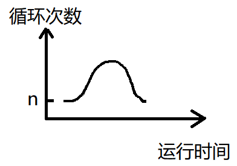
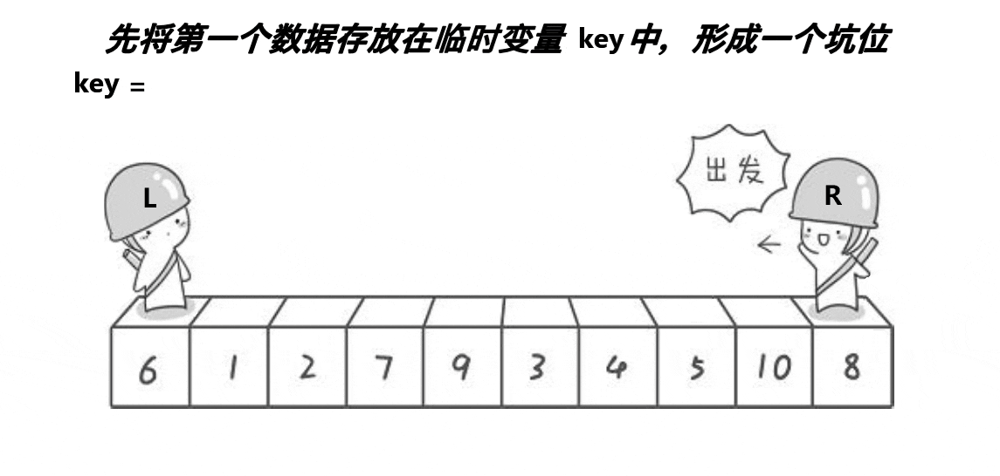
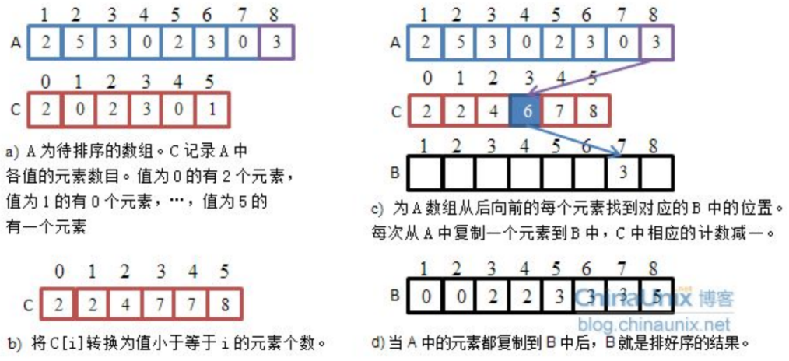

## 7. 排序

### 7.1 排序的概念及其运用

**排序**：所谓排序，就是使一串记录，按照其中的某个或某些关键字的大小，递增或递减的排列起来的操作。

**稳定性**：假定在待排序的记录序列中，存在多个具有相同的关键字的记录，若经过排序，这些记录的**相对次序保持不变**，即在原序列中，`r[i]==r[j]`，且`r[i]`在`r[j]`之前，而在排序后的序列中，`r[i]`仍在`r[j]`之前，则称这种排序算法是稳定的；否则称为不稳定的。

> 举个例子，同一张试卷，分数相同的情况下，谁先交卷，谁排在前面。
>
> 或者总分相同，谁的语文成绩更好，谁排在前。此时对这种特殊需求，排序算法的稳定性就很有必要。

**内部排序**：数据元素全部放在内存中的排序。（下文也称内排序）

**外部排序**：数据元素太多不能同时放在内存中，根据排序过程的要求不能在内外存之间移动数据的排序。（下文也称外排序）

> 例如 $1G==1024^3 byte$，一个int型整数4byte，100亿（$10^{10}$）个int型整数占用空间为37G左右，针对这100亿个数据的排序已无法用常见的排序算法去操作。

排序的算法先考虑可行性，再考虑效率。

排序要掌握的点：

1. 不同排序算法的**时间复杂度和空间复杂度**。
2. 排序的**思想**。
3. 排序的**实现**。

排序主要学习这几种：


如果是参加算法竞赛，则只需要学习堆排序、快速排序和归并排序即可，遇到竞赛题除非有特殊需求，否则一律用STL的库函数sort解决。

### 7.2 选择排序算法——直接选择排序

#### 选择排序基本思想：

每一次从待排序的数据元素中选出最小（或最大）的一个元素，存放在序列的起始位置，直到全部待排序的数据元素排完 。

#### 直接选择排序

##### 选择排序原理

* 在元素集合`array[i]`--`array[n-1]`中选择关键码最大(小)的数据元素。

* 若它不是这组元素中的最后一个(第一个)元素，则将它与这组元素中的最后一个（第一个）元素交换。

* 在剩余的`array[i]`--`array[n-2]`（`array[i+1]`--`array[n-1]`）集合中，重复上述步骤，直到集合剩余1个元素。

排序动图示例：


参考示例：

```c
初 始 关键字 [49 38 65 97 76 13 27 49]
第一趟排序后 13［38 65 97 76 49 27 49］
第二趟排序后 13 27［65 97 76 49 38 49］
第三趟排序后 13 27 38 [97 76 49 65 49]
第四趟排序后 13 27 38 49 [76 97 65 49]
第五趟排序后 13 27 38 49 49 [97 65 76]
第六趟排序后 13 27 38 49 49 65 [97 76]
第七趟排序后 13 27 38 49 49 65 76 [97]
最后排序结果 13 27 38 49 49 65 76  97 
```


##### 参考程序

以升序排序为例。

根据原理分析，得到的未优化选择排序：

```c
typedef int Datatype;
//选择排序，因为传递的是指针，要另外传递元素个数 
void selectSort(Datatype a[],int n) {
	int i=0,j=0,k=0;
	for(i=0;i<n;i++) {
		k=i;//每次更新第一个（或最后一个）元素的位置 
		for(j=i+1;j<n;j++)
			if(a[j]<a[k])//遍历寻找最小值
				k=j;
		if(k!=i) {//找到的最小值没有放在第一个位置
			int temp=a[k];
			a[k]=b[i];
			a[i]=temp;
		}
	}
}
```

尝试优化：我们在每次遍历数据时，同时找到最大值和最小值的位置并分别放在开头和结尾，还能再减少一半的整体遍历次数。这个思路需要两个起到指针作用的变量分别标记开头和结尾。

这个思路很像双指针，但并不是，只是用到了双指针的思路进行优化。

在实现时我们先看一组样例：

```c
int a[]={7,4,3,6,5,2,3};
```

我们发现，最大值7和开头位置重合。若按照思路进行枚举，则交换最小值到开头时，数据变化：

```c
(7) 4 3 6 5 (2) 3  ==>  (2) 4 3 6 5 (7) 3
```

此时2莫名其妙的被判断成最大值和3进行交换。

```c
(2) 4 3 6 5 (7) 3  ==>  3 4 3 6 5 (7) (2)
```

到这里可以看出，排序没能使数组有序。

解决方法：优化方案会进行两次数据交换，在第一次交换时判断找到的最值是否与开头、结尾重叠，重叠的话进行修正即可。

**优化后的选择排序参考程序**：

```c
typedef int Datatype;
//经优化的选择排序，每次同时选出最小的和最大的
void selectSortplus(Datatype* a, int n) {
	int begin = 0, end = n - 1;//起标记作用的两个变量
	while (begin < end) {//能不能加等于，取决于交换数据时用的方法
		int maxi = begin, mini = begin;
		for (int i = begin; i <= end; i++) {
			if (a[i] > a[maxi])
				maxi = i;
			if (a[i] < a[mini])
				mini = i;
		}
		Swap(&a[begin], &a[mini]);//交换两个变量的数据
		if (begin == maxi)//处理begin和maxi重叠时的情况
			maxi = mini;
		Swap(&a[end], &a[maxi]);
		++begin;//双指针思路
		--end;
	}
}
```


##### 如何交换数据

在优化的选择排序中，有提到为啥这句能不能用`<=`取决于交换数据的方法。

程序设计语言进行交换数据的方法有3种：

1. **设置中间变量**

这个是最基础、最常用的方法。但会额外开一个临时变量的空间。若交换的数据比较庞大的话可能需要将庞大的数据分成若干份分别进行交换。

```c
void Swap(Datatype* a,Datatype* b){
    int tmp = *a;
    *a = *b;
    *b = tmp;
}
```

2. **三次异或**

我们知道，c语言有一个按位异或操作符`^`，而异或操作的真值表：


尽管按位异或是针对二进制位的操作，但如果是两个相同的数据进行异或操作，结果是0。例如：`3^3==0`的结果为真，因为两个3在内存中存储的二进制形式完全相同，这就使得每一个bit位进行异或时的结果都是0，得到的补码也是0，对应的真实数据自然也是0。

利用这个特点，我们也可以设计出一种不用额外申请空间的数据交换方式：

```c
void Swap(Datatype* a,Datatype* b){
    Datatype aa=*a,bb=*b;//先进行演示，后进行优化
    //交换a、b的数据
    *a=aa^bb^aa;
    *b=aa^bb^bb;
}
```

其中`aa^bb`我们可以用另一个变量进行存储：

```c
void Swap(Datatype* a,Datatype* b){
    Datatype aa=*a,bb=*b;//先进行演示，后进行优化
    //交换a、b的数据
    Datatype tmp=aa^bb;
    *a=tmp^aa;
    *b=tmp^bb;
}
```

我们将tmp更换成aa也没关系，因为此时bb还没发生变化，即使aa的值变成了`aa^bb`，我们还可以再通过`aa^bb^bb`的方式重新拿回aa的数据。

```c
void Swap(Datatype* a,Datatype* b){
    Datatype aa=*a,bb=*b;
    aa=aa^bb;
    *b=aa^bb;
    *a=aa^*b;//运行到这里时，*b已经变成了*a的样子
}
```

> 第3行：此时aa存储的数据是*a^*b
>
> 第4行：此时bb还未发生改变，aa存储的数据是`*a^*b`，因此=右边的表达式相当于是`*a^*b^*b`。`*b`已经变成了`*a`的样子。
>
> 第5行：`*b`的内容已经变成了`*a`的数据，而aa存储的数据依旧是`*a^*b`，所以`*a`变成了`*b`。

到这里，其实aa和bb作为中间变量的功能已经可以被取代。所以我们得到了一个新的交换数据的方式：

```c
void Swap(Datatype* a,Datatype* b){
    *a=*a^*b;
    *b=*a^*b;
    *a=*a^*b;
}
```

> 第2行：`*a`自己作为中间变量存储`*a^*b`的数据
>
> 第3行：运行完这一句后，`*b`存储了`*a`的数据
>
> 第4行：`*a`存储的数据依旧是`*a^*b`的值，而`*b`存储的是`*a`的数据，所以`*a`存储的数据也变成了`*b`的值。

例如：

```c
void f00(){
    int a=3,b=4;
    printf("%d %d\n",a,b);
    a=a^b;b=a^b;a=a^b;
    printf("%d %d\n",a,b);
}
```

输出：

```c
3 4
4 3
```
因为是按位异或，所以任何数和0异或还是它本身。所以即使是相同的两个数进行这种方式的数据交换也是可以的。
例如：

```c
int main() {
	int a = 2, b = 2;
	printf("%d %d\n", a, b);
	a = a ^ b;
	printf("%d %d\n", a, b);
	b = a ^ b;
	printf("%d %d\n", a, b);
	a = a ^ b;
	printf("%d %d\n", a, b);
	return 0;
}
```

输出：
```
2 2
0 2
0 2
2 2
```


3. **作差**

利用数值都有大小的特点，我们可以通过作差得到两数差的部分，再将这部分填到另一部分，这样也能做到交换数据的目的：

```c
void f01(int a,int b){
    a=a-b;//获得差值
    b=a+b;//差值填给a
    a=b-a;//b已变成a，砍掉差值变成b
}
```

这种交换方式不能用于a和b都代表同一空间的情况，否则数据会丢失（这也是为什么`while(begin<end)`不加等号的原因，但没多少人会用这种方式进行数据交换，加不加取决于个人爱好）。此外不清楚比较规则的自定义类型也不能用这种数据交换方式。

例如：

```c
void f02(int x){
    int* a=&x,*b=&x;
    printf("%d\n",*a,*b);
    *a=*a-*b;
    *b=*a+*b;
    *a=*b-*a;
    printf("%d\n",*a,*b);
}
```

输出：

```c
6 6
0 0
```

##### 直接选择排序的特性总结：

1. 直接选择排序思考非常好理解，但是效率不是很好。实际中很少使用

2. 时间复杂度：$O(N^2)$（两层循环）

3. 空间复杂度：$O(1)$

4. 稳定性：不稳定（要与当前的第一个和最后一个数据进行数据交换，即使是相同的数据也不知道会被移动到哪里）。

例如这个样例：`[5,5,3]`，第一次选择最小数的3时候，不可避免的和第1个5进行交换，这时数组变成了`[3,5,5]`。

我们还可以通过下列代码测试稳定性。只要找到值相同但次序不同的数的位置即可发现算法是否稳定。

```c
#include<stdio.h>

typedef struct Num {
	int x;
	int i;
}Num;
typedef Num DataType;

void Swap(DataType* a, DataType* b) {
	DataType t = *a;
	*a = *b;
	*b = t;
}

void selectSort(DataType b[],int n) {
	int i=0,j=0,k=0;
	for(i=0;i<n;i++) {
		k=i;//每次更新第一个（或最后一个）元素的位置 
		for(j=i+1;j<n;j++)
			if(b[j].x<b[k].x)//遍历寻找最小值
				k=j;
		if(k!=i) {//找到的最小值没有放在第一个位置
			DataType temp=b[k];
			b[k]=b[i];
			b[i]=temp;
		}
	}
}

//经优化的选择排序，每次同时选出最小的和最大的
void selectSortplus(DataType* a, int n) {
	int begin = 0, end = n - 1;//起标记作用的两个变量
	while (begin < end) {//能不能加等于，取决于交换数据时用的方法
		int maxi = begin, mini = begin;
		int i=0;
		for (i = begin; i <= end; i++) {
			if (a[i].x > a[maxi].x)
				maxi = i;
			if (a[i].x < a[mini].x)
				mini = i;
		}
		Swap(&a[begin], &a[mini]);
		if (begin == maxi)//处理begin和maxi重叠时的情况
			maxi = mini;
		Swap(&a[end], &a[maxi]);
		++begin;//双指针思路
		--end;
	}
}

void f() {
	srand((size_t)time(0));//随机数的种子
	Num a[30] = { {0,0} },b[30] = { {0,0} };
	int i=0;
	for (i = 0; i < 30; i++) {
		a[i].x = rand()%100+1;
		a[i].i = i + 1;
		b[i] = a[i];
	}
	for (i = 0; i < 30; i++)
		printf("%d %d,",a[i].x,a[i].i);
	printf("\n\n");

	selectSort(a, 30);
	selectSortplus(b, 30);
	
	for (i = 0; i < 30; i++)
		printf("%d %d,", a[i].x, a[i].i);
	printf("\n\n");
	for (i = 0; i < 30; i++)
		printf("%d %d,", b[i].x, b[i].i);
}

int main(){
    f();
    return 0;
}
```


### 7.3选择排序算法——堆排序

在学堆排序前，需要先理解什么是堆，怎么建堆。我也厚脸皮地推荐自己的博客：

[二叉树的顺序结构和堆的概念及结构-CSDN博客](https://blog.csdn.net/m0_73693552/article/details/143698158?spm=1001.2014.3001.5501) 

[用数组实现两种堆_数组构建堆-CSDN博客](https://blog.csdn.net/m0_73693552/article/details/143720137?spm=1001.2014.3001.5501)  

#### 堆排序的实现

堆排序即利用堆的思想来进行排序。

堆排序有两种实现方法：

1. 新开辟一个数组，将堆顶拷贝进数组，拷贝一次删一次堆顶。因为空间负责度为$O(n)$，因此不考虑。除非实在想不起来第2种方法怎么实现。
2. 将数组作为完全二叉树，通过向上调整或向下调整**改造成堆**，再**交换堆顶和最后一个元素**，并逐步**缩小可操作的结点数**（即范围）。

这里讨论第2个方法，第1个方法直接给出参考程序即可。总共分为两个步骤：

1. **建堆**

想要得到**升序**的数组：**建大堆**进行排序。

想要得到**降序**的数组：**建小堆**进行排序。

> 若升序但建的却是小堆，或者说降序但建的是大堆，则无法将排序进行下去。

2. **利用堆删除思想来进行排序**

建堆和堆删除中都用到了向下调整，因此掌握了向下调整，就可以完成堆排序。

向下调整算法参考（大堆）：

```c
void adjustDown(Datatype* a,int n,int parent){
    //Datatype是数据类型，由程序员指定
    int child=parent*2+1;
    while(child<n){
        if(child+1<n)
            if(a[child]<a[child+1])
                ++child;
        if(a[child]>a[parent]){
            int tmp=a[child];
            a[child]=a[parent];
            a[parent]=tmp;
            parent=child;
            child=parent*2+1;
        }
        else break;
    }
}
```

堆排序的思路：将数组作为完全二叉树，通过向上调整或向下调整**改造成堆**，再**交换堆顶和最后一个元素**，并逐步**缩小可操作的结点数**（即范围）。

例如，这是一个大堆，我们通过这种思路将这个大堆变成升序数组：


#### 堆排序参考程序

以建大堆生成升序数组为例的堆排序：

```c
void adjustDown(Datatype* a,int n,int parent){
    //Datatype是数据类型，由程序员指定
    int child=parent*2+1;
    while(child<n){
        if(child+1<n)
            if(a[child]<a[child+1])
                ++child;
        if(a[child]>a[parent]){
            int tmp=a[child];
            a[child]=a[parent];
            a[parent]=tmp;
            parent=child;
            child=parent*2+1;
        }
        else break;
    }
}

void heapSort(Datatype* a,int n){
    int i=0;
    for(i=(n-1-1)/2;i>=0;i--)//向下调整建堆，从倒数第一个父结点开始
        adjustDown(a,n,i);
    int end=n-1;
    while(end>0){
        int tmp=a[0];
        a[0]=a[end];
        a[end]=tmp;
        adjustDown(a,end,0);
        --end;
    }
}
```

还可以通过不断取出堆顶的方式进行排序。

自定义类型的堆的各种功能参考[用数组实现两种堆-CSDN博客](https://blog.csdn.net/m0_73693552/article/details/143720137)   

```c
void heapSortCopy(int* a, int n) {//2*N*logN
	HP hp; int i;
	HeapInit(&hp);//建堆会额外开辟空间
    
	for (i = 0; i < n; ++i)//将数据全部放进堆中
		HeapPush(&hp, a[i]);

	while (!HeapEmpty(&hp)) {//因为堆顶始终是最值，所以是选择排序跳过寻找最值的环节
		int top = HeapTop(&hp);
		a[i++] = top;
		HeapPop(&hp);
	}
	HeapDestroy(&hp);
}
```


#### 堆排序复杂度及稳定性分析

1. 时间复杂度：$O(NlogN)$

这里先分析这个算法。

```c
void adjustDown(Datatype* a,int n,int parent){
    //Datatype是数据类型，由程序员指定
    int child=parent*2+1;
    while(child<n){
        if(child+1<n)
            if(a[child]<a[child+1])
                ++child;
        if(a[child]>a[parent]){
            int tmp=a[child];
            a[child]=a[parent];
            a[parent]=tmp;
            parent=child;
            child=parent*2+1;
        }
        else break;
    }
}

void heapSort(Datatype* a,int n){
    int i=0;
    for(i=(n-1-1)/2;i>0=;i--)//向下调整建堆，从倒数第一个父结点开始
        adjustDown(a,n,i);
    int end=n-1;
    while(end>0){
        int tmp=a[0];
        a[0]=a[end];
        a[end]=tmp;
        adjustDown(a,end,0);
        --end;
    }
}
```

首先是建堆。根据[用数组实现两种堆-CSDN博客](https://blog.csdn.net/m0_73693552/article/details/143720137?spm=1001.2014.3001.5501) 中的描述，向下调整建堆的时间复杂度为$O(n)$。而要完成整个数组的排序，需要不停地置换堆顶和最后一个元素，每置换一次就缩小一次范围，直到堆顶成为最后一个元素为止。

置换过程可以看成将堆顶的数据放在数组最后一位（**想想选择排序是不是也这么干**），直到将最后一层结点给填满，每一次置换都要调整，最坏的情况是调整$h-1$次。所以填满最后一层的调整次数为$2^{h-1}\times (h-1)$。同理铺满倒数第二层的调整次数为$2^{h-2}\times(h-2)$，以此类推，直到只剩根结点和第二层时调整次数为$2^1\times 1$。总的调整次数加起来：

$2^{h-1}\times(h-1)+2^{h-2}\times(h-2)+\cdots +2^1\times 1$

$=2^h\times h-2\times2^h+2$

其中，我们知道二叉树的树高$h=log_{2}(n+1)$，$n$是这个堆的结点数。

所以总的调整次数为$(n+1)log_{2}(n+1)-2n$。

因此严格来说堆排序的循环次数为$(n+1)log_{2}(n+1)-2n+n$，时间复杂度为$O(nlogn)$。


对于这个用空间换时间的算法：

```c
void heapSortCopy(int* a, int n) {//2*N*logN
	HP hp; int i;
	HeapInit(&hp);//建堆会额外开辟空间
    
	for (i = 0; i < n; ++i)//将数据全部放进堆中
		HeapPush(&hp, a[i]);

	while (!HeapEmpty(&hp)) {//因为堆顶始终是最值，所以是选择排序跳过寻找最值的环节
		int top = HeapTop(&hp);
		a[i++] = top;
		HeapPop(&hp);
	}
	HeapDestroy(&hp);
}
```

因为建堆过程同样涉及堆的调整，用的还是插入数组的最后一个元素后，再用向上调整算法进行调整这个方法。所以建堆的时间复杂度为$O(nlogn)$，为向上调整建堆的时间复杂度。

之后不停地弹出的过程时间复杂度也是$O(nlogn)$，因为弹出也是交换堆顶和数组最后一个元素再向下调整，每个结点都试一次的话总的调整次数为
$2^{h-1}\times(h-1)+2^{h-2}\times(h-2)+\cdots +2^1\times 1$。根据上面的结果，这个数学表达式的和是$nlogn$。

虽然是双倍的$nlogn$，但时间复杂度会忽略系数，所以总的**时间复杂度**还是$O(nlogn)$，但经过这一分析，很明显看出这个方法在细节上明显不如上面的方法。更不用说另外建堆还得开辟空间。

2. **空间复杂度**：

$O(1)$（对数组进行建堆）；

$O(n)$（额外建堆）

3. **稳定性**：不稳定

例如，我们有这样一个数组：`[5,5,3]`，这个数组开始时可以看成大堆。但当我们进行堆排序时，不可避免的将第1个5和最后1个3进行置换使堆变成`[3,5,5]`。之后无论怎么调整第1个5始终在第2个5后面。所以根据排序的稳定性，排序算法是不稳定的，不稳定的原因是堆排序在堆顶元素和最后一个元素交换时并不考虑数据出现的顺序。

我们还可以通过别的样例来观察。这些样例中很多都存在类似`a[i]==a[j],i>j`的若干对数据，在交换后有的发生了交换，而有的并没有。

```c
#include<stdio.h>
#include<assert.h>
#include<stdbool.h>
#include<stdlib.h>
#include<time.h>

typedef struct Data {
	int x; int i;
}Data;

typedef Data HPDataType;//堆的定义
typedef struct Heap {
	HPDataType* _a;
	int _size;
	int _capacity;
}Heap;

void Swap(HPDataType* a, HPDataType* b) {
	HPDataType t = *a;
	*a = *b;
	*b = t;
}

//大堆的向下调整
void adjustMaxDown(HPDataType* a, int n, int parent) {
	int child = parent * 2 + 1;
	while (child < n) {
		if (child + 1 < n)
			if (a[child].x < a[child + 1].x)
				++child;
		if (a[child].x > a[parent].x) {
			Swap(&a[child], &a[parent]);
			parent = child;
			child = parent * 2 + 1;
		}
		else break;
	}
}

//小堆向下调整
void adjustDown(HPDataType* a, int n, int parent) {
	int child = 2 * parent + 1;
	while (child < n) {
		if (child + 1 < n)//考虑数组容量，或者说右孩子不存在的情况
			if (a[child + 1].x < a[child].x)
				++child;
		if (a[child].x < a[parent].x) {
			Swap(&a[child], &a[parent]);
			parent = child;
			child = 2 * parent + 1;
		}
		else break;
	}
}

//升序堆排序
void heapSortUp(HPDataType* a, int n) {
	int i = 0;
	for (i = (n - 1 - 1) / 2; i >= 0; i--)
		adjustMaxDown(a, n, i);
	int end = n - 1;
	while (end > 0) {
		Swap(&a[0], &a[end]);//因为这里的设计，交换时并不考虑数字原来的位置 
		adjustMaxDown(a, end, 0);
		end--;
	}
}

//降序堆排序
void heapSortDown(HPDataType* a, int n) {
	int i = 0;
	for (i = (n - 1 - 1) / 2; i >= 0; i--)
		adjustDown(a, n, i);
	int end = n - 1;
	while (end > 0) {
		Swap(&a[0], &a[end]);
		adjustDown(a, end, 0);
		end--;
	}
}

void f1(){
	srand((size_t)time(0));//随机数的种子
	HPDataType a[30] = { {0,0} },b[30] = { {0,0} };
	int i=0;
	for (i = 0; i < 30; i++) {
		a[i].x = rand()%100+1;
		a[i].i = i + 1;
		b[i] = a[i];
	}
	for (i = 0; i < 30; i++)
		printf("%d %d,",a[i].x,a[i].i);
	printf("\n\n");

	heapSortUp(a, 30);
	heapSortDown(b, 30);
	
	for (i = 0; i < 30; i++)
		printf("%d %d,", a[i].x, a[i].i);
	printf("\n\n");
	for (i = 0; i < 30; i++)
		printf("%d %d,", b[i].x, b[i].i);
} 

int main(){
	f1();
	return 0; 
} 
```

输出结果：


### 7.4 插入排序——直接插入排序

#### 插入排序基本思想：

直接插入排序是一种简单的插入排序法，其基本思想是：

**把待排序的记录按其关键码值的大小逐个插入到一个已经排好序的有序序列中，直到所有的记录插入完为止，得到一个新的有序序列** 。

实际中我们玩扑克牌时，就用了插入排序的思想。


#### 直接插入排序

当插入第$i(i\geq1)$个元素时，前面的`array[0]`,`array[1]`,…,`array[i-1]`已经排好序，此时用`array[i]`的排序码与`array[i-1]`,`array[i-2]`,…的排序码顺序进行比较，找到插入位置即将`array[i]`插入，原来位置上的元素顺序后移。

如下面动图所示：


以及这个样例：

```c
8
36 25 48 12 65 43 20 58
第0步:[36] 25 48 12 65 43 20 58
第1步:[25 36] 48 12 65 43 20 58
第2步:[25 36 48] 12 65 43 20 58
第3步:[12 25 36 48] 65 43 20 58
第4步:[12 25 36 48 65] 43 20 58
第5步:[12 25 36 43 48 65] 20 58
第6步:[12 20 25 36 43 48 65] 58
第7步:[12 20 25 36 43 48 58 65]
```

根据分析的信息，给出两种参考程序，他们的思路是一样的。

#### 参考程序

参考程序1：

```c
typedef int Datatype;
void insertSort(Datatype* a, int n) {
	for (int i = 0, j, k, temp; i < n; i++) {
		for (j = i - 1; j >= 0; j--)//这里只找不往后挪，浪费了时间
			if (a[j] < a[i])
				break;
		if (j != i - 1) {
			temp = a[i];
			for (k = i - 1; k > j; k--)
				a[k + 1] = a[k];
			a[k + 1] = temp;
		}
	}
}
```

参考程序2：

```c
typedef int Datatype;
void insertSortPlus(Datatype* a, int n) {
	for (int i = 0; i < n - 1; ++i) {
		// [0, end] 有序，插入tmp依旧有序
		int end = i;
		int tmp = a[i + 1];

		while (end >= 0) {
			if (a[end] > tmp) {
				a[end + 1] = a[end];
				--end;
			}
			else
				break;
		}
		a[end + 1] = tmp;
	}
}
```


#### 直接插入排序的特性总结

1. 元素集合**越接近有序**，直接插入排序算法的**时间效率越高**

2. 时间复杂度：$O(N^2)$（两层for循环，尽管存在剪枝但不影响整体效率低）

3. 空间复杂度：$O(1)$，

4. 它是一种稳定的排序算法，因为在排序过程中，它是将未排序元素插入到已排序序列的合适位置。尽管我们能通过修改判断关键字大小的判断原理来使得它不稳定，但不影响这种交换机制使得直接插入排序是稳定的。


### 7.5 插入排序——希尔排序

#### 概念和思路

> 我们都知道，直接插入排序的时间复杂度为$O(n^2)$，但当数据无限接近有序或本身就是有序的时候，插入排序的时间复杂度能来到$O(n)$。
>
> 希尔排序就是诞生于这个背景下。

希尔排序法又称缩小增量法。希尔排序法的基本思想是：

**先选定一个整数d，把待排序文件中所有记录分成若干个组，所有距离为d的记录分在同一组内，并对每一组内的记录进行排序。然后，取d的缩小值，再重复上述分组和排序的工作。当到达d=1时，所有记录在统一组内排好序**。

根据基本思想，得出希尔排序的思路：

> 1. 预排序，使局部有序。
> 2. 插入排序。

步骤：

> 1. 数据间隔gap分为一组，总计分为gap组。
> 2. 预排序：对gap组数据分别进行插入排序。
> 3. 逐渐缩小gap的大小，当gap为1时，希尔排序和插入排序无任何差别。

gap的取法并不固定。从希尔排序这个排序算法被发明以来，人们一直都在寻找最合适的gap的取值。目前比较成熟的方法是，将gap和n绑定在一起。

推荐gap和n的关系为gap的初始值为n，之后gap通过表达式`gap=f(gap)+1`来缩小gap的大小，即$gap<f(gap)+1$。`f(gap)`是数学表达式，一般常用$f(gap)=\frac{gap}{2}$，或$f(gap)=[gap/3]$。官方更喜欢用`gap=gap/3+1`，虽然它的预排序次数不如`gap=gap/2`。

根据上述描述，画出草图：


#### 参考程序

```c
void shellSort(Datatype* a, int n) {
	int gap = n;
	while (gap > 1) {
		gap = gap / 2;//缩小增量
		int i = 0;
		for (i = 0; i < n - gap; ++i) {//插入排序
			int end = i;
			int tmp = a[end + gap];
			while (end >= 0) {
				if (a[end] > tmp) {
					a[end + gap] = a[end];
					end -= gap;
				}
				else break;
			}
			a[end + gap] = tmp;
		}
	}
}
```

gap的表达式可以更换：

```c
void shellSort(Datatype* a, int n) {
	int gap = n;
	while (gap > 1) {
		gap = gap / 3 + 1;//+1可以保证最后一次一定是1
		int i = 0;
		for (i = 0; i < n - gap; ++i) {//插入排序
			int end = i;
			int tmp = a[end + gap];
			while (end >= 0) {
				if (a[end] > tmp) {
					a[end + gap] = a[end];
					end -= gap;
				}
				else break;
			}
			a[end + gap] = tmp;
		}
	}
}
```


#### 希尔排序的特性总结

1. 希尔排序是对直接插入排序的优化。

2. 当`gap > 1`时都是预排序，目的是让数组更接近于有序。当`gap == 1`时，数组已经接近有序的了，遍历就会很快。整体而言，对比插入排序可以达到可观的优化的效果。后续会进行对比。


##### 复杂度

希尔排序的时间复杂度不好计算，因为gap的取值方法很多，导致很难去计算，因此目前给出的希尔排序的时间复杂度都不固定。

我们可以尝试计算这里写的希尔排序的时间复杂度。不想看的可直接翻到后面记结论，这里只是推理的思路。

```c
void shellSort(Datatype* a, int n) {
	int gap = n;
	while (gap > 1) {
		gap = gap / 3 + 1;//+1可以保证最后一次一定是1
		int i = 0;
		for (i = 0; i < n - gap; ++i) {//插入排序
			int end = i;
			int tmp = a[end + gap];
			while (end >= 0) {
				if (a[end] > tmp) {
					a[end + gap] = a[end];
					end -= gap;
				}
				else break;
			}
			a[end + gap] = tmp;
		}
	}
}
```

当`gap=gap/3+1`时，设x为for循环的次数，则$n=3^x$（1是常数，对最后的时间复杂度没有影响），所以$x=log_3n$。

同理当`gap=gap/2`时可得$x=log_2n$。

之后gap组数据进行的预排序因为gap的大小会变，最后只能确认gap最大或最小时都是$O(n)$：

例如：$gap=\frac{n}{3}$，每组3个，合计$\frac{n}{3}$组，每组最坏比较$(1+2+3)=6$次。

所以循环次数为$\frac{n}{3}\times6=2n$。

当$gap==1$时，经过之前的预排序，数据已经十分有序，循环相当于检查一遍，所以这一步的时间复杂度为$O(n)$。

随着中间gap的变化运行次数也发生变化：



中间部分的时间复杂度（或者说循环次数）据说需要用复变函数和扎实的数学基础才能算出大概，以自己目前的数学功底无法算出希尔排序的复杂度，以后有机会的话再来看看。

算到这里，虽然我们无法算出，但可以借鉴别人的成果：

时间复杂度为$O(n^{1.3})$，当$n\rightarrow+\infty$时，时间复杂度为$O(n(log_2n)^2)$（按增量为$gap=gap/3+1$来算）。但就整体而言，记结论$O(n^{1.3})$会更轻松。


下面的介绍摘自《数据结构（C语言版）》，作者严蔚敏。


还有一段介绍摘自《数据结构-用面向对象方法与C++描述》，作者殷人昆


这里的gap是按照Knuth提出的方式取值的，而且Knuth进行了大量的试验统计，如果继续用这个gap取值方式的希尔排序的话，暂时就按照时间复杂度在$O(n^{1.25})$到$O(1.6n^{1.26})$来算。

简记的话记**时间复杂度**为$O(n^{1.3})$即可。

由于希尔排序并没有额外开辟空间，所以**空间复杂度**为$O(1)$。


##### 稳定性

希尔排序在不同的间隔（增量）序列下，相同元素的相对位置可能会改变。

例如，数组`[4,4,1]`，假设`gap==2`，则第一次比较并产生交换的是第一个4和1，交换后数组变成`[1,4,4]`，此时两个4的位置发生了变化。所以**希尔排序是不稳定的排序算法**。

除了这个，还可以通过这个参考程序来证明。这里我们用结构体来同时存储数据和这个数据在原来的数组中的位置。对结构体数组排序后，可观察他们的顺序变化。

```c
#include<stdio.h>
#include<stdlib.h>
#include<time.h>

typedef struct Datatype {
	int x; int i;
}Datatype;

void shellSort(Datatype* a, int n) {
	int gap = n;
	while (gap > 1) {
		gap = gap / 3 + 1;//可以试着自己更换不同的增量
		int i = 0;
		for (i = 0; i < n - gap; ++i) {//插入排序
			int end = i;
			Datatype tmp = a[end + gap];
			while (end >= 0) {
				if (a[end].x > tmp.x) {
					a[end + gap] = a[end];
					end -= gap;
				}
				else break;
			}
			a[end + gap] = tmp;
		}
	}
}

void f() {
	srand((size_t)time(0));
	Datatype a[30] = { 0 };
	int i = 0;
	for (i = 0; i < 30; i++) {
		a[i].x = rand() % 100 + 1;
		a[i].i = i;
		printf("%d %d,", a[i].x,a[i].i);
	}
	shellSort(a, 30);
	printf("\n");
	for (i = 0; i < 30; i++)
		printf("%d %d,", a[i].x, a[i].i);
}

int main() {
	f();
	return 0;
}

```

### 7.6 交换排序——冒泡排序

交换排序基本思想：所谓交换，就是根据序列中两个记录键值的比较结果来对换这两个记录在序列中的位置，交换排序的特点是：将键值较大的记录向序列的尾部移动，键值较小的记录向序列的前部移动。

#### 冒泡排序概念

冒泡排序便是交换排序的一种。

冒泡排序的思想（忘了从哪本书摘抄的了，凑合着看吧）


例如有6个元素需要排序：
`6 5 3 4 1 2`
第1轮：
```
[5 6] 3 4 1 2
5 [3 6] 4 1 2
5 3 [4 6] 1 2
5 3 4 [1 6] 2
5 3 4 1 [2 6]//第1轮结束，数组中最大值固定
```
第2轮：
```
[3 5] 4 1 2 6
3 [4 5] 1 2 6
3 4 [1 5] 2 6
3 4 1 [2 5] 6//第2轮结束，数组中第二大的值固定
```

第3轮：

```
[3 4] 1 2 5 6
3 [1 4] 2 5 6
3 1 [2 4] 5 6//第3轮结束，数组中第三大的值固定
```

第4轮：

```
[1 3] 2 4 5 6
1 [2 3] 4 5 6//第4轮结束，排序完成
```

动图加深理解。


#### 参考程序

任何初学编程语言的人，只要会玩数组和循环，冒泡排序都会玩。

不经思考的无脑写法：

```c
void Swap(Datatype* a,Datatype* b){
    Datatype t=*a;
    *a=*b;
    *b=t;
}

void bubbleSort(Datatype* a,int n){
    int i=0,j=0;
    for(i=0;i<n;i++)
        for(j=0;j<n-1;j++)
            if(a[j]>a[j+1])
                Swap(&a[j],&a[j+1]);
}
```

尝试优化：每轮冒泡都会选出一个最值放在后面，所以我们可以进行适当剪枝，出去多余的循环。以及冒泡排序可能没进行完数据就已经有序，所以需要另外做判断。

```c
void bubbleSort(Datatype* a, int n) {
	int i = 0, j = 0;
	for (i = 0; i < n; i++) {//表示这是第i+1轮排序
		int judg = 0;
		for (j = 1; j < n - i; j++)//表示正在比较的数据
			if (a[j - 1] > a[j]) {
				Swap(&a[j - 1], &a[j]);
				judg = 1;//judg=1表示冒泡排序发生了交换
			}
		if (judg == 0) break;
	}
}
```


冒泡排序的特性总结：

1. 冒泡排序是一种非常容易理解的排序。也是我目前了解的排序算法里耗时最长的排序算法。若在面试时面试官问冒泡排序，则面试官很大可能对你失去了兴趣，随便问点东西打发面试时间满足公司和其他机构的要求。
   冒泡排序并不是没有意义，它用来教学就有意义。也就是当做其他排序算法的反面教材。

2. 时间复杂度：$O(N^2)$

3. 空间复杂度：$O(1)$

4. 稳定性：稳定

因为冒泡排序进行两两比较的方式，除非修改真值判断方式，否则相同的两个数据不会发生交换。


### 7.7 交换排序——快速排序

#### 快速排序概念

快速排序是Hoare于1962年提出的一种二叉树结构的**交换排序**方法（下文简称快排），其基本思想为：任取待排序元素序列中的某元素作为**基准值**，按照该排序码将待排序集合**分割成两子序列**，**左子序列**中所有元素均**小于**基准值，**右子序列**中所有元素均**大于**基准值，然后最左、右子序列分别重复该过程，直到所有元素都排列在相应位置上为止。

> 虽然快排是Hoare发明的，但Hoare并没有用自己的名字去给这个算法命名，而是用快速来对这个排序命名，用于彰显这个排序算法的特点：快。

例如我们设基准值为div，则排序的目的是为了完成这个目标：


这个是二叉树结构的交换排序，所以div左边和div右边的区间还要分别重复这个过程。

#### c语言的库函数qsort

c语言中就有一个库函数qsort：

```c
void qsort( void *base, 
           size_t num, 
           size_t width, 
           int (__cdecl *compare )(const void *elem1, const void *elem2 ) );
```

它的4个参数表示的含义：

* base：被用来排序的数组的**数组名**或数组的首元素地址。
* num：数组的**元素个数**。
* width：数组的**单个元素占用的内存大小**。
* compare：程序员**自定义的比较函数**。

用户自定义的比较函数需要返回两个元素之间的差值。这很大程度上局限了这个函数的玩法（比如实现自定义类型数组的排序可能会比较麻烦）。但这个函数的底层实现就是快排，比一般的排序算法的速度要快。

应用实例：

```c
#include<stdio.h>
#include<stdlib.h>
#include<time.h>
#include<stdlib.h>
#include<stdbool.h>

typedef int Datatype;

//用户自定义的比较函数
int cmp(const void* a, const void* b) {//升序排序
	return (*(Datatype*)a) - (*(Datatype*)b);//这个函数通过差值判断是否交换
}

void f() {
	srand((size_t)time(0));//随机数的种子
	Datatype a[30] = { 0 };
	int i = 0;
	for (i = 0; i < 30; i++) {
		a[i] = rand() % 100 + 1;//生成随机数
		printf("%d ", a[i]);
	}
	printf("\n");
	//四个形参分别是数组名，要排序的元素个数，单个元素的大小，程序员自定义的比较函数
	qsort(a, sizeof(a)/sizeof(a[0]), sizeof(Datatype), cmp);
	for (i = 0; i < 30; i++)
		printf("%d ", a[i]);
}

int main() {
	f();
	return 0;
}
```

#### 快速排序框架quickSort

```c
// 假设按照升序对array数组中[left, right)区间中的元素进行排序
void quickSort(Datatype* a, int left, int right)
{
	if (right - left <= 0)//区间只有1个值或区间不存在时没必要继续分
		return;

	// 按照基准值对array数组的 [left, right)区间中的元素进行划分
	int keyi = partSort(a, left, right);

	// 划分成功后以keyi为边界形成了左右两部分 [left, keyi) 和 [keyi+1, right)
	// 递归排[left, keyi)
	quickSort(a, left, keyi - 1);

	// 递归排[keyi+1, right)
	quickSort(a, keyi + 1, right);
}
```

上述为**快速排序递归实现的主框架**，发现与二叉树**前序遍历**规则非常像，我们在写递归框架时可想想二叉树前序遍历规则即可快速写出来，后序只需分析如何按照基准值来对区间中数据进行划分的方式即可。

虽然快速排序性能很优异，但并不是所有情况快排都是最优选。甚至数据量小的情况比如10个数据，快排对这10个数据排序，耗时说不定比插入排序慢。我们学习排序是为了能判断所有情况，并根据情况选择合适的排序算法来处理数据。

> 10个数据组成的数组看成完全二叉树就是4层，递归的话还要多调用3次函数，每次调用函数都要向内存申请空间，加大时间和空间的成本。
>
> 若使用插入排序来处理这种数量比较小的数据，则减少了多余的递归调用。能使排序完成时间缩短。
>
> 可以通过高精度计时库来计算10个元素时两种排序的耗时。参考程序如下（c++程序）：
>
> ```c
> #include<stdio.h>
> #include<stdlib.h>
> #include<time.h>
> #include<stdlib.h>
> #include<stdbool.h>
> #include<chrono>
> #include<iostream>
> using namespace std;
> 
> typedef int Datatype;
> 
> 
> int cmp(const void* a, const void* b) {
> 	return (*(Datatype*)a) - (*(Datatype*)b);
> }
> 
> void insertSort(Datatype* a, int n) {
> 	int i = 0;
> 	for (i = 0; i < n - 1; i++) {
> 		int end = i;
> 		int tmp = a[i + 1];
> 		while (end >= 0)
> 			if (a[end] > tmp) {
> 				a[end + 1] = a[end];
> 				--end;
> 			}
> 			else break;
> 		a[end + 1] = tmp;
> 	}
> }
> 
> void f() {
> 	srand((size_t)time(0));
> 	Datatype a[10], b[10];
> 	int i = 0;
> 	for (i = 0; i < 10; i++) {
> 		a[i] = rand() % 1000 + 1;
> 		b[i] = a[i];
> 	}
> 
> 	auto begin = std::chrono::high_resolution_clock::now();
> 	qsort(a, 10, 4, cmp);//用快排对10个数据进行排序
> 	auto end = std::chrono::high_resolution_clock::now();
> 	std::chrono::duration<double> time1 = end - begin;
> 	std::cout << time1.count() << endl;
> 
> 	auto begin2 = std::chrono::high_resolution_clock::now();
> 	insertSort(b, 10);//用插入排序对10个数据进行排序
> 	auto end2 = std::chrono::high_resolution_clock::now();
> 	std::chrono::duration<double> time2 = end2 - begin2;
> 	std::cout << time2.count() << endl;
> 
> 	//如果快排用时比插入排序用时长，则输出1，否则输出0
> 	cout << (time1.count() - time2.count() > 1e-15) << endl;
> }
> 
> int main() {
> 	f();
> 	return 0;
> }
> 
> ```
>
> `chrono` 库的 `high_resolution_clock` 可以提供高精度的时间点，通过计算两个时间点的差值来得到代码执行的时间间隔， `duration<double>` 用于以秒为单位表示时间间隔， `count()` 函数返回该时间间隔的值。
>
> 用大量数据时表现不好，小量数据时表现优异的算法处理这种小规模数据的优化方式，有人称作小区间优化。这种优化的本质是一种锦上添花的行为，无法改变算法本身的弊端。

到这里为冒泡排序惋惜1秒钟，我确实没遇到过最适合冒泡排序的应用场景。

#### 单趟排序partSort的实现

要实现完整的快速排序，需要将框架`quickSort`和子函数`partSort`放在一起进行编译。

下文均以升序为目标的排序问题做分析，并将`keyi`标记基准值的下标，`key`标记基准值的值。

将区间按照基准值`key`划分为左右两半部分的常见方式有三个版本：

##### hoare版本单趟排序

hoare版本是hoare研究出来的单趟排序。这个版本的单趟排序有很多细节上的陷阱。

###### 陷阱1 原理以及死循环和越界风险

动图：


对动图分析：


由上面的演示知hoare版本是将key放在第1个（key也可以是最后1个）。

根据演示，这里先给出hoare版本的测试程序（不一定正确）：


left和right表示数组的下标，起到一部分指针的作用。所以下文暂时称呼他们为指针。

这个代码存在逻辑上的陷阱。

1. 某些情况hoare版本存在死循环，例如数据和key一样大时，若代码不处理这种情况会死循环。和key相等的值在key左、右都无所谓。


这个陷阱可以通过将`>`和`<`符号更换为`>=`和`<=`解决。但加上等于的话又会出现新的问题。

2. key为数据中最小（或最大）的一个时，left、right两个指针中的一个指针会存在越界风险。


所以还得加上`left<right`的限制。而且还要先判断是否越界，再去判断数据的大于小于。

> c语言/c++的越界都是一种抽查行为，即越界了不一定有反馈。这一点STL的vector就考虑到。

hoare版本就像一个简单的前序二叉树，只是单趟排序是为了确定一个key。不用担心key没法放在合适的位置，因为第一轮排序时就将比key大的数放在了右边。

> 尝试手撕：
>
> 
>
> 所以只是递归的过程画图的话很像二叉树，虽然后续的计算和二叉树有关，但其实和二叉树没关系。因为原数组的首元素地址做形参，所以操作的始终是同一数组。


###### 陷阱2 key和指针left开局不合

我们在学习的时候，若条件允许，尽可能多想想极端场景。例如这个样例：

> `keyi==left`（最左边的起始指针），若`keyi+1==left`，则无法处理`key`为最小（大）元素时的情况，因为`right`会一路无阻与`left`相遇，相遇后与`key`交换时数据不再有序。
>
> 
>
> 

###### 陷阱3 指针相遇位置比key大

相遇位置一定比key要小（升序的情况下）。如何保证相遇位置比key小？先说结论（都是以最终的数据是升序为目标）：

1. 若左边的第1个数据做key，则要右边先走，才能保证相遇位置比key小；

2. 若右边的第1个数据做key，则要左边先走，才能保证相遇位置比key大。


以左边的第1个数据做key为例，举最后几步L和R谁先走的正、反例。用L和R分别代表左、右两个指针。

L和R相遇的两种情况：L遇到R（用高中物理的比喻是在相遇之前R相对地面静止，L相对R在移动）或R遇到L。

1. L遇到R，R是停下来的，L先动，L走到R的位置（即`L==R`），而R停下来的位置一定比key大（在上一轮R和L完成了一次数据交换），若`key`和L、R相遇位置的数据交换，则`key`左边的数据会有一个比`key`大，数组将不再有序。

2. 若是R先动，则R停下来的位置一定比key小（或一直没找到比key小的数，直到和L相遇），此时L再走，若L没遇到比key大的数据，则L、R相遇时的数据一定比key小，此时key和L、R相遇位置再交换，则完成了单趟排序的目标。


右边的第1个数据做key的情况略，和上面的情况是一样的。不同的是L和R做了角色置换。

###### 避开所有陷阱后的最终参考程序

hoare版本的单趟快排的**最终参考程序**：

```c
typedef int Datatype;
int partSortHoare(Datatype* a, int left, int right) {
	int keyi = left;//keyi记录下标, key记录值。
	while (left < right) {//相遇时结束循环
		// 右边找小，因为key是最左端，所以右边先走（陷阱3）
		while (left < right && a[right] > a[keyi])//利用c语言的短路特性去判断
			--right;//当right<left时没必要再找（陷阱2）
		// 左边找大
		while (left < right && a[left] <= a[keyi])//至少有一个用于判断=（陷阱1）
			++left;
		Swap(&a[left], &a[right]);
	}
	Swap(&a[keyi], &a[left]);//相遇了就交换
	return left;
}
```

根据陷阱1的分析，被嵌套的两个while循环至少要有一个包含`=`，否则当`key`和中间某个数据相等时将陷入死循环。

hoare版本单趟排序因为要遍历整个数组，所以时间复杂度为$O(n)$。


##### 挖坑法单趟排序

hoare大佬发明的单趟排序存在如此之多的陷阱，肯定会有别的大佬不满意。这里就有人提出了一个更通俗易懂的单趟排序。

###### 原理

1. 将第1个数据另存（仍记`key`），并将`key`的位置置空（心理上的置空）。
2. 右指针找小于`key`的数填在原来的坑，右指针在的位置变新坑。
3. 左指针再找大于`key`的数填在第2步留下的坑。
4. 重复2、3，直到左右指针相遇，将`key`归位（左指针同样要从一开始`key`的位置出发）。

动图：



样例分析：


挖坑法除了比hoare版本好理解，并没有比hoare版本多出什么优势。时间复杂度也是$O(n)$。

###### 参考程序

```c
//挖坑法单趟排序
int partSortHole(Datatype* a, int left, int right) {
	Datatype key = a[left];
	int hole = left;//坑
	while (left < right) {
		// 右边找小
		while (left < right && a[right] > key)
			--right;

		a[hole] = a[right];
		hole = right;//找到数据后就交换，形成新坑

		// 左边找大
		while (left < right && a[left] <= key)
			++left;

		a[hole] = a[left];
		hole = left;
	}
	a[hole] = key;//相遇位置即为最后一个坑的位置
	return hole;
}
```

##### 前后指针单趟排序

官方并没有准确的名字，是民间大佬根据它的特点和思想将它命名为前后指针。下面都是创造升序数组进行演示。

###### 原理


样例展示：


描述细节：

1. 最开始`prev`和`cur`相邻的。
2. `cur`指针找小的数（`a[cur]<key`），若找不到，则`++cur`；若找到了，则`++prev`，交换`prev`和`cur`的位置（从人的视角来看是将大的翻滚式往右边推同时把小的换到左边）。
3. 当`cur`走到终点时，将交换`prev`和`key`的位置。

可能需要注意的点：

1. 若`prev==cur`，自己和自己交换没有意义。虽然并不影响。
2. 当`prev`和`cur`拉开距离后（或当`cur`遇到比`key`大的值后），它们的间隔间都是比`key`大的值。
3. prev和cur不能初始化为0,1，而是`left`，`left+1`，因为快排伴随递归，不一定从0、1开始单趟排序。

###### 参考程序

```c
int partSortDPoint(Datatype* a, int left, int right) {
	int prev = left;
	int cur = left + 1;
	int keyi = left;
	while (cur <= right) {
		if (a[cur] < a[keyi] && ++prev != cur)//prev和cur相等时无意义
			Swap(&a[prev], &a[cur]);  
		++cur;
	} 
	Swap(&a[prev], &a[keyi]);
	//keyi = prev; return keyi;
    return prev;
}
```


三种单趟排序在效率上没有差别，也就是说前后指针的时间复杂度也是$O(n)$。只是实现方式的不同。平时用的话哪种都行，但参加面试的话三个都要会，防止面试官多问。


#### 快速排序的优化

这篇优化围绕这个测试OJ展开。

[912. 排序数组 - 力扣（LeetCode）](https://leetcode.cn/problems/sort-an-array/) 

这个测试OJ在早期用快排还能过。但现在用快排不能过了。


因为这个OJ针对快排加了一些样例使得快排不能过这个OJ。针对这一点，下文给出优化方案。

##### 小区间优化

**小区间优化针对需要产生递归的排序算法**。也就是说归并排序也能用。

学习排序是为了能判断所有情况，并根据情况选择合适的排序算法来处理数据。

不是所有情况快排都是最优选。数据量小的情况比如10个数据，快排对这10个数据排序，耗时说不定比插入排序慢。

10个数据组成的数组看成完全二叉树就是4层，递归的话还要多调用3次函数，每次调用函数都要向内存申请空间，加大时间和空间的成本。

若使用插入排序来处理这种数量比较小的数据，则减少了多余的递归调用。能使排序完成时间缩短。

以10个数据的满二叉树为例子，最底层占$50\%$的结点，后层数网上逐级减半，减少3层的递归调用，优化效率$50\%+25\%+12.5\%=87.5\%$。

我们可以通过高精度计时库`chrono`库的库函数和类来计算10个元素时两种排序的耗时。参考程序如下（c++程序）：

```c
#include<stdio.h>
#include<stdlib.h>
#include<time.h>
#include<stdlib.h>
#include<stdbool.h>
#include<chrono>
#include<iostream>
using namespace std;

typedef int Datatype;

//用的是c语言的库函数qsort
int cmp(const void* a, const void* b) {
	return (*(Datatype*)a) - (*(Datatype*)b);
}

//插入排序
void insertSort(Datatype* a, int n) {
	int i = 0;
	for (i = 0; i < n - 1; i++) {
		int end = i;
		int tmp = a[i + 1];
		while (end >= 0)
			if (a[end] > tmp) {
				a[end + 1] = a[end];
				--end;
			}
			else break;
		a[end + 1] = tmp;
	}
}

void f() {
	srand((size_t)time(0));
	Datatype a[10], b[10];
	int i = 0;
	for (i = 0; i < 10; i++) {
		a[i] = rand() % 1000 + 1;//随机数生成数据
		b[i] = a[i];
	}
    
    //高精度计时
	auto begin = std::chrono::high_resolution_clock::now();
	qsort(a, sizeof(a)/sizeof(a[0]), sizeof(a[0]), cmp);//用快排的库函数对10个数据进行排序
	auto end = std::chrono::high_resolution_clock::now();
	std::chrono::duration<double> time1 = end - begin;
	std::cout << time1.count() << endl;

	auto begin2 = std::chrono::high_resolution_clock::now();
	insertSort(b, 10);//用插入排序对10个数据进行排序
	auto end2 = std::chrono::high_resolution_clock::now();
	std::chrono::duration<double> time2 = end2 - begin2;
	std::cout << time2.count() << endl;

	//如果快排用时比插入排序用时长，则输出1，否则输出0
	cout << (time1.count() - time2.count() > 1e-15) << endl;
}

int main() {
	f();
	return 0;
}

```

`chrono` 库的 `high_resolution_clock` 可以提供高精度的时间点，通过计算两个时间点的差值来得到代码执行的时间间隔， `duration<double>` 用于以秒为单位表示时间间隔， `count()` 函数返回该时间间隔的值。

 

用大量数据时表现不好，小量数据时表现优异的算法处理这种小规模数据的优化方式，有人称这种优化方式为**小区间优化**。这种优化的本质是一种锦上添花的行为，无法改变算法本身的弊端。

到这里为冒泡排序惋惜1秒钟，结束冒泡排序时至少还要枚举一遍，所以即使是小区间优化也上不了冒泡排序。

##### 三数取中

三数取中优化可使快排的效率相对于直接用快排排序有序数据快。

三数取中即头、尾、中间取不是最差（大）也不是最好（小）的情况。三数取中优化只是对数组做一个简单的预处理，它并没有改变快排的缺陷，而是规避，使快排在排序过程中尽可能**取相对中间接近中位数的值**。

虽然不如直接取中位数，但直接找中位数更麻烦。要排序找，还要返回下标。

三数取中写法不固定，只要能返回取样的中间值即可。

这里给个参考程序：

```c
//三数取中，为优化快排
//选尽可能靠近中位数的值
int GetMidIndex(int* a, int left, int right) {
	int mid = (left + right) / 2;
	if (a[left] < a[mid]) {
		if (a[mid] < a[right])
			return mid;
		else if (a[left] < a[right])
			return right;
		else
			return left;
	}
	else { // a[left] > a[mid] 
		if (a[mid] > a[right])
			return mid;
		else if (a[left] > a[right])
			return right;
		else
			return left;
	}
}
```

三数取中优化可以放在快排的框架做**数组的预处理**，也可以放在单趟排序开头做预处理。

但即使是这样，上面的OJ[912. 排序数组 - 力扣（LeetCode）](https://leetcode.cn/problems/sort-an-array/) 依旧针对这种小计俩给了针对样例。

秉持道高一尺，魔高一丈的原则，我们可以尝试改进三数取中：**用随机数代替中间的那个数**。这个做法其实也没有比原来的三数取中做的多好，更多的是像开盲盒。也就是说依旧有一定几率抽中无法通关的数。

参考程序：

```c
//三数取中，因为leetcode上有一题针对三数取中做出了对策样例，
//所以采取随机数取中。
int GetMidIndexRand(int* a, int left, int right) {
	srand((size_t)time(0));//随机数的种子
	int mid = left + (rand() % (right - left));
	if (a[left] < a[mid]) {
		if (a[mid] < a[right])
			return mid;
		else if (a[left] < a[right])
			return right;
		else
			return left;
	}
	else{// a[left] > a[mid]
		if (a[mid] > a[right])
			return mid;
		else if (a[left] > a[right])
			return right;
		else
			return left;
	}
}
```


##### 三路划分优化

三种单趟排序方案都没能很好地处理存在大量重复元素的情况。所以快排无论怎么优化都无法在规定时间内通过有大量重复数据的数据组。

三路划分是快排的众多优化方式中的一种。在数据量不大的情况下，未优化的快排反而比其他排序慢。且有序的情况系更慢。但全是随机的情况快排显著更优。这个OJ就针对快排放了一些特殊的测试样例。

[912. 排序数组 - 力扣（LeetCode）](https://leetcode.cn/problems/sort-an-array/) 

这个测试样例中很多测试样例是针对快排设计的。比如某个测试样例里有个测试数据全部是2。于是就有人改进快排使得快排能应对这些场景。

若数据相等，且快排中的判断符为`>=`或`<=`，则会一路运行下去产生大量的无效递归。我们之前的三种单趟排序其实都是二路划分。所以有人提出了三路划分的优化方案。

三路划分将要排序的数据分成三路：


递归时只需要解决不等于`key`的部分即可，等于`key`的不用递归。三路划分可以认为hoare版本单趟排序和前后指针单趟排序的结合。

三路划分的本质为小的排左边，大的排右边，和key相等的值排中间。

样例展示：


根据样例，给出3种情况来判断：

1. `if(a[c]<key) Swap(&a[c],&a[l]), ++l, ++c;`
2. `if(a[c]>key) Swap(&a[c],&a[r]), --r;`
3. `if(a[c]==key), ++c`

参考程序：

```c
//三数取中，因为leetcode上有一题针对三数取中做出了对策样例，
//所以采取随机数取中。
int GetMidIndexRand(int* a, int left, int right) {
	srand((size_t)time(0));//随机数的种子
	int mid = left + (rand() % (right - left));
	if (a[left] < a[mid]) {
		if (a[mid] < a[right])
			return mid;
		else if (a[left] < a[right])
			return right;
		else
			return left;
	}
	else{// a[left] > a[mid]
		if (a[mid] > a[right])
			return mid;
		else if (a[left] > a[right])
			return right;
		else
			return left;
	}
}

//快排的三路划分优化方案
//针对大量重复数据的优化
//这个方案独立于已有的快排框架
void quickSortTRoute(int* a, int begin, int end) {
	if (begin >= end)
		return;
    
	int left = begin;
	int right = end;
	int cur = left + 1;
	int key = a[left];

	while (cur <= right) {
		if (a[cur] < key) {
			Swap(&a[cur], &a[left]);
			++left;
			++cur;
		}
		else if (a[cur] > key) {
			Swap(&a[cur], &a[right]);
			--right;
		}
		else
			++cur;
	}

	////至此，数组被划分成3个部分：
	////            c
	////[...,......,...]
	////     l    r
	////[l,r]为同一个数key，[left,l-1]比key小
	////[r+1,right]比key大

	quickSortTRoute(a, begin, left - 1);
	quickSortTRoute(a, right + 1, end);
}
```

即使是三路优化，依旧存在这样的样例无法用快排进行排序：无法准确找到中位数，也无法找到哪个数重复最多，特别是找三数全是最小的或最大的（三数取中的针对设计样例）。

即使是这样，依旧可以设计新的三数取中：用随机数代替中间的那个数。详细见上文的三数取中。

三路划分只是针对复杂情况做的对策，实际效率比快排本体慢，平时用正常的快排就行。

而无论那种预排，当key选中中位数时效率最高，此时相当于二分算法。除了这种极其好运抽到中位数的情况，快排少部分情景用别的排序更优，更多场景快排几乎是最优。弄清排序的意义是极端情况下有多重选择，可以设计出达到预期的排序算法（除了某冒泡排序实在救不回来）。

到这里，给出OJ[912. 排序数组 - 力扣（LeetCode）](https://leetcode.cn/problems/sort-an-array/) 的快排解法：

```c
//快排的三路划分再优化方案
//因为leetcode上有一题针对三数取中做出了对策样例，
//所以采取随机数取中。
void quickSortTRoute(int* a, int begin, int end)
{
	if (begin >= end)
		return;
    //这里省略小区间优化，是因为不加这个优化也能过
    
	int left = begin;
	int right = end;
	int cur = left + 1;
    
    //针对leetcode的三数取中对策做的下策：随机数取中
	int midi = GetMidIndexRand(a, begin, end);
	Swap(&a[midi], &a[left]);
    
	int key = a[left];

	while (cur <= right) {
		if (a[cur] < key) {
			Swap(&a[cur], &a[left]);
			++left;
			++cur;
		}
		else if (a[cur] > key) {
			Swap(&a[cur], &a[right]);
			--right;
		}
		else {
			++cur;
		}
	}
	quickSortTRoute(a, begin, left - 1);
	quickSortTRoute(a, right + 1, end);
}
```

其他快排的单趟排序partSort依旧可以用随机数取中开盲盒，但是并不能通过这个OJ。


#### 快速排序非递归实现

无论什么算法，用递归肯定存在栈溢出的风险，需要转化为非递归。如快排，快排进行非递归变化的其实是**处理区间**，且都是在同一数组上进行操作。因此可节省函数栈的开销将区间的代表数值仅栈。


关于快排的非递归细节：

将数组的两端下标先入栈，再取出来进行一趟排序；后分割为2个区间，每个区间都有2个端点值，再将他们压栈，顺序不影响。后重复一样的操作。

也就是每次从栈里面拿出一段区间，单趟分割处理左、右子区间入栈。

当两个数不构成区间（`left>=right`）时停止本次操作。

例如一种区间划分：


也可以使用队列。但只有栈才能模拟递归的效果，队列是处理抽象树一层一层的对象。

两种分别代表深度优先(dfs)和广度优先(bfs)的思路，在不同场景有不同用途。

> Linux线程32位的一个栈只有8MB空间，足够日常使用，但极端情况下递归深度太深扛不住。$8MB=8\times1024\times1024\ byte$。
>
> 堆则是以GB为单位，空间相对比原生栈大。所以无论是windows还是Linux，向堆区申请空间，可以申请数量可观的内存。
>
> 此外，快排的每次递归相当于二叉树，这里的实现方式又是将每个区间的端点值入栈，
> 原则上只要在快排的递归深度$log_2(n+1)$的基础上乘2即可满足快排对栈容量的全部需求。
> 但经过测试还有没发现的不确定因素使得空间复杂度乘2依旧不够开销，所以乘3，
> 但其实就算乘3，开辟的空间数也非常小，随着n的增大到一定的量，依旧会越界访问。
>
> 但如果栈的空间开到n，则不会出现这种问题。

参考程序：

```c
//快排的非递归实现
void quickSortNonR(Datatype* a, int left, int right) {
	int* st = (int*)malloc(
		sizeof(int) * 200//floor(log(right - left + 1) / log(2)) * 3
	);
    //栈开200个空间后就能处理平时99%的数据排列
	if (st == NULL) {
		printf("栈空间申请失败\n");
		return;
	}
	int top = 0;//一个栈顶变量和一个数组构成的简易栈
	st[top++] = right;
	st[top++] = left;

	while (top != 0) {
		int l = st[top - 1];
		--top;
		int r = st[top - 1];
		--top;
		int keyi = partSortDPoint(a, l, r);//单趟排序
		if (keyi + 1 < r) {
			st[top++] = r;//右边先入栈
			st[top++] = keyi + 1;
		}
		if (l < keyi - 1) {
			st[top++] = keyi - 1;//左边后入栈
			st[top++] = l;
		}
	}
	free(st);
}
```

关于这里的栈空间的大小：空间的大小取决于快速排序的空间复杂度。

快排的排序过程可看成一个二叉树，而区间划分的深度也就是二叉树的高度，所以栈空间的大小开到$[log_2n]$就足够大部分情况使用，这个非递归快排因为区间分开存储，所以需要乘2。最坏的情况是数据在排序之前便已有序，或每次都选最值作为基准值，此时需要为每个数据开一个栈空间，这个时候空间复杂度便来到$O(n)$。

因为对数的特性，当我们的栈开到200个单位时，通过普通计算器理论能排序的数据已经来到$10^{30}$。因为$log_2{10^{30}}=30log_2{10}\approx99.66$，也就是说，$10^{30}$个数据进行快排时的递归深度最多有100层，如果是存储区间的端点值的话则需要200层。

实际测试过在栈开出200个空间的情况下完成了$10^9$个数据的排序。这样庞大的数据一般放在文件中，排序在文件中的数据用外排序。

但无论怎么样，开辟的空间为$(right-left)*2$个单位时，快速排序都能通过。

测试用的程序：

```c
#include<stdio.h>
#include<stdlib.h>
#include<time.h>
#include<stdlib.h>
#include<stdbool.h>
#include<math.h>


typedef int Datatype;

int sortJudg(Datatype* a, int n) {//判断数组是否升序
	int i = 0;
	for (i = 0; i < n - 1; i++) {
		if (a[i] > a[i + 1])
			break;
	}
	return i == n - 1;
}

void Swap(Datatype* a, Datatype* b) {
	int tmp = *a;
	*a = *b;
	*b = tmp;
}

int partSortHoare(Datatype* a, int left, int right) {
	int keyi = left;//这里规定keyi记录下标, key记录值。
	while (left < right) {//相遇时结束循环
		// 右边找小
		while (left < right && a[right] >= a[keyi])//利用c语言的短路特性去判断
			--right;
		// 左边找大
		while (left < right && a[left] <= a[keyi])//这里还有问题
			++left;
		Swap(&a[left], &a[right]);
	}
	Swap(&a[keyi], &a[left]);//相遇了就交换
	return left;
}

int partSortHole(Datatype* a, int left, int right) {
	int key = a[left];
	int hole = left;//坑
	while (left < right) {
		// 右边找小
		while (left < right && a[right] >= key)
			--right;

		a[hole] = a[right];
		hole = right;

		// 左边找大
		while (left < right && a[left] <= key)
			++left;

		a[hole] = a[left];
		hole = left;
	}
	a[hole] = key;
	return hole;
}

int partSortDPoint(Datatype* a, int left, int right) {
	int prev = left;
	int cur = left + 1;
	int keyi = left;
	while (cur <= right) {
		if (a[cur] < a[keyi] && ++prev != cur)
			Swap(&a[prev], &a[cur]);
		++cur;
	}
	Swap(&a[prev], &a[keyi]);
	return prev;
}

//快排的非递归实现
void quickSortNonR(Datatype* a, int left, int right) {
	int* st = (int*)malloc(
		sizeof(int) * 200//floor(log(right - left + 1) / log(2)) * 3
	);
	if (st == NULL) {
		printf("栈空间申请失败\n");
		return;
	}
	int top = 0;//一个栈顶变量和一个数组构成的简易栈
	st[top++] = right;
	st[top++] = left;

	while (top != 0) {
		int l = st[top - 1];
		--top;
		int r = st[top - 1];
		--top;
		int keyi = partSortDPoint(a, l, r);//单趟排序，三个版本都可以
		if (keyi + 1 < r) {
			st[top++] = r;//右边先入栈
			st[top++] = keyi + 1;
		}
		if (l < keyi - 1) {
			st[top++] = keyi - 1;//左边后入栈
			st[top++] = l;
		}
	}
	free(st);
}

void f() {
	srand((size_t)time(0));
#define NUM 1000000000
	Datatype* a = (Datatype*)malloc(sizeof(Datatype) * NUM);
	if (a == NULL) {
		printf("数组空间申请失败\n");
		return;
	}
	int i = 0;
	for (i = 0; i < NUM; i++) {
		a[i] = rand()*rand() + 1;//rand的返回值最大只有32767(0x7fff)，于是相乘使数据范围扩大减少重复数据
	}
	quickSortNonR(a, 0,NUM-1);

	printf("%d\n", sortJudg(a, NUM));//判断数据是否升序
	free(a);
}

int main() {
	f();
	return 0;
}

```

实际实现时也可以使用链式栈，可以在计算机能承受的范围内不用考虑栈溢出的情况。

#### 快速排序的特性总结

1. 快速排序整体的综合性能和使用场景都是比较好的，所以才敢叫**快速**排序

2. 时间复杂度：$O(N*logN)$

> 当快排的`key`选中位数时，第一轮的单趟是处理$n$个数，
>
> 第二轮的两轮递归总共处理$n$个数，
>
> 依次类推，最后一次每次递归处理1个数，总共处理的层数为$log_2(N+1)$，$N$为递归申请的函数调用次数（这种情况和二分十分接近）。
>
> 所以最好的情况为$nlog_2(N+1)$，即每层处理$n$个数据，总共有$[log_2(N+1)]$层。
>
> 而每次递归又存在一个`key`，最后一层递归相当于每个数都当选一轮`key`，因为之前每轮递归选出一个中位数排好，所以每层实际上都是接近$n$次处理。
>
> 所以每个数都当一次中位数，也就有$n=2^h-1$，$h=log_2(n+1)$，
>
> > 即每次递归选1个数据排好，剩下的递归再选各自的中间数，每个数都当选1次中间数，将每次递归当成二叉树的结点，n就是结点数。
>
> 所以$N$可近似看做$n$，
>
> 时间复杂度为$O(nlogn)$。
>
> 当数组有序时，快排效率最低，是$O(n^2)$。
>
> 若数组有序，每次选`key`时都是选第1个（按hoare版本思路分析），
>
> 因为左区间和右区间肯定有一个不存在，每轮选`key`的时候相当于缩小排序的范围，这点和冒泡排序十分相似。
>
> 之后递归时，因为每次都是一个区间不存在，另一个区间都是上一层递归处理的数据数少1，进行多次排列后，每层递归的排列次数为$n,n-1,n-2,\cdots,3,2,1$，这是等差数列，求和的话排列次数还是$n^2$。
>
> 如何解决?
>
> 1. 随机数选key，即不再只选固定位为key。
> 2. 三路划分。
>
> 而且部分情况还需要两个方案一起用。
>
> 尽管快排对这种有序或接近有序的数据十分乏力，但对全是随机数的数据依旧有可观的效率。

3. 空间复杂度：$O(logN)$，最坏情况为$O(N)$。

> 函数栈最多申请$h$层，而$n=2^h-1$，所以$h=log_2(n+1)$，空间复杂度即为$O(logn)$。
>
> 最坏的情况是数据在排序之前便已有序，或每次都选最值作为基准值，此时需要为每个数据开一个栈空间，这个时候空间复杂度便来到$O(n)$。

4. 稳定性：不稳定

> 因为快排存在左、右区间的数交换，所以不稳定。
>
> 例如这个例子：`[6,6,3]`，快排无论哪种方案,，只要key为6，排列结果可能为`[3,6,6]`，原本两个6的相对位置发生了变化。
>
> 除了举例，还可以通过定义存储数据和自己原来的位置的自定义变量，通过对这种自定义类型的数组进行排序，来观察该排序算法是否稳定。代码参考之前的排序算法。


### 7.8 内排序中的归并排序

#### 原理

归并排序（MERGE-SORT）是建立在归并操作上的一种有效的排序算法,该算法是采用分治法（Divide and Conquer）的一个非常典型的应用。将已有序的子序列合并，得到完全有序的序列；即先使每个子序列有序，再使子序列段间有序。若将两个有序表合并成一个有序表，称为二路归并。 归并排序核心步骤：


动图演示：


根据以上信息，可以得到归并排序的操作步骤：

1. 将数组根据下标分成两个区间，子区间又再次分成两个更小的子区间，一直分，直到只剩一个元素无法再分。这一过程可用递归实现。
2. 递归结束后必定有回溯，回溯后得到的是两个有序的区间（1个数据也是有序）。将两个区间的数按大小合并为一个区间并拷贝到临时数组。
3. 将临时数组的这两个区间的数拷贝回原数组。
4. 重复1到3，直到所有的递归函数都结束。

#### 参考程序

```c
typedef int Datatype;
//归并排序本体
void _mergeSort(Datatype* a, int begin, int end, Datatype* tmp) {
	if (begin >= end)
		return;
	//不可能出现begin>end的情况
	//除非c语言的除法运算是向上取整

	//// 小区间优化，整体优化效率在10%~20%
	//if (end - begin + 1 < 10) {//区间选择[8,15]最佳
	//	insertSort(a + begin, end - begin + 1);
	//	return;
	//}

	int mid = (begin + end) / 2;
	//将这组数据分成两个区间： [begin, mid] [mid+1, end]
	_mergeSort(a, begin, mid, tmp);
	_mergeSort(a, mid + 1, end, tmp);

	// 归并两个区间
	int begin1 = begin, end1 = mid;
	int begin2 = mid + 1, end2 = end;
	int i = begin;
	while (begin1 <= end1 && begin2 <= end2) {//合并区间
		if (a[begin1] < a[begin2])
			tmp[i++] = a[begin1++];
		else
			tmp[i++] = a[begin2++];
	}
    
    //将剩余的数接在临时数组的尾部
    //理论上下面这两个while循环只有一个能进行
	while (begin1 <= end1)
		tmp[i++] = a[begin1++];

	while (begin2 <= end2)
		tmp[i++] = a[begin2++];

    //i的取值范围为[begin,end]，所以这里使用不影响
	for (i = begin; i <= end; i++)
		a[i] = tmp[i];
}

//归并函数只负责提供辅助数组，不负责递归
//因为递归涉及传参
void mergeSort(Datatype* a, int n) {
	Datatype* tmp = (Datatype*)malloc(sizeof(Datatype) * n);

	_mergeSort(a, 0, n - 1, tmp);

	free(tmp);
}
```

关于快排和归并，当只剩很少的元素时，再通过递归调用函数会拖慢效率（例如8个数据，按照递归函数管理的数据量分4、2、1三次递归）。

此时可用其他排序优化。这种思路称**小区间优化**，当然仅限递归。

首先排除冒泡排序（无论如何都要遍历一遍），在选择排序、插入排序中选择，最合适的是插入排序，在不挪动全部数据的情况下可完成小数量的排序。

#### 归并排序的非递归实现

归并的非递归并不好用栈解决问题：

数据归并二层后，即原递归向下进行到最后，回来还要和另一半区间进行归并操作，但栈并不好区分是哪2个区间合并。

而递归可很好地获取两个区间。要做到这一步，需要额外开栈。

虽然通过栈的方式无法实现归并排序的非递归，但我们可以从归并的原理出发：

归并的终点是只有1个数据，再回归后2个数据归并，再回溯后4个数据2个区间进行归并，一直这样下去，直到一个数组的2个区间都有序后再合并为一个有序数组，这一过程可通过操控循环的运行次数实现。

> 即递归是深度优先，则归并的非递归是广度优先，且先从1个数据（或者说二叉树最底层）开始。

从归并原理图出发。


我们设`[begin1, end1]`和`[begin2, end2]`两个区间的两组数据需要进行归并操作。开始时从一个数据就是一个区间开始进行归并，之后两个区间内的数据个数翻倍，再进行归并，重复这样的操作，直到最后只剩两个区间后，再归并即可完成排序。

> 用二叉树做对比，相当于先处理最后一层的结点，再依次处理上层，直到处理到根结点时任务完成。

既然决定了使用循环实现归并排序的非递归实现，就需要考虑出现奇数的情况。

即归并分组时出现奇数的情况很容易越界。

越界分3种情况：

1. `end1`, `begin2`,`end2`全部越界，这种是第一个区间就已经将所有数据都囊括在内，直接跳出循环将数组拷贝回去即可。
2. `begin2`, `end2` 越界，和1一样的情况。
3. `end2`越界，两个区间的数据还没进行归并，只需要修正第二个区间的右边界即可。


针对这三种越界情况的处理，还有一个问题：是边归并边拷贝，还是归并完全部数据后一次性拷贝。根据这个问题，得出两种参考程序。

参考程序1：归并一组，拷贝一组。

```c
//归并非递归实现第一种选择
//归并一组，拷贝一组
typedef int Datatype;
void MergeSortNonR(Datatype* a, int n) {
	Datatype* tmp = (Datatype*)malloc(sizeof(Datatype) * n);
	if (tmp == NULL)
		return;

	//通过控制每组要合并的数据个数控制排序本体
	//gap是每组的数据个数，可以是1，2，4，....，n/2
	int gap = 1;
	while (gap < n) {
		int j = 0, i = 0;

		//每次循环跳过两个区间
		for (i = 0; i < n; i += 2 * gap) {
			int begin1 = i, end1 = i + gap - 1;//这样一个区间的数据个数为gap个
			int begin2 = i + gap, end2 = i + 2 * gap - 1;
			//int j = i;//若j放在for循环内，则要初始化为i。也就是最左边区间的左边界

			// 修正奇数分组归并时区间1囊括所有数据的情况
			if (end1 >= n || begin2 >= n)
				break;

			//修正奇数分组归并时区间2的数据不够导致右区间越界的情况
			if (end2 >= n)
				end2 = n - 1;

			//之后就是正常的归并排序
			while (begin1 <= end1 && begin2 <= end2)
				if (a[begin1] < a[begin2])
					tmp[j++] = a[begin1++];
				else
					tmp[j++] = a[begin2++];

			while (begin1 <= end1)
				tmp[j++] = a[begin1++];

			while (begin2 <= end2)
				tmp[j++] = a[begin2++];

			// 归并一组，拷贝一组
			//将所有参与归并的数据进行拷贝
			// 参与归并的区间为[i,end2]
			//memcpy(a + i, tmp + i, sizeof(int) * (end2 - i + 1));
            
            //这里j的取值范围是[i,end2]，所以这里不影响
			for (j = i; j <= end2; j++)
				a[j] = tmp[j];
		}
		//memcpy(a, tmp, sizeof(int) * n);
		//有用break阻止后续归并，一次性拷贝一层无法处理越界的情况，

		gap *= 2;
	}
	free(tmp);
}
```

参考程序2：归并完后整组拷贝。

```c
//归并非递归实现第二种情况
//归并完成后统一拷贝
void MergeSortNonR2(int* a, int n) {
	int* tmp = (int*)malloc(sizeof(int) * n);
	if (tmp == NULL)
		return;

	int gap = 1;
	while (gap < n) {
		int j = 0, i = 0;
		for (i = 0; i < n; i += 2 * gap) {
			int begin1 = i, end1 = i + gap - 1;
			int begin2 = i + gap, end2 = i + 2 * gap - 1;

			if (end1 >= n) {//情况1和情况2
				end1 = n - 1;

				// 不存在区间，即不阻止循环，而是设计无法进行的条件
				begin2 = n;
				end2 = n - 1;
			}
			else if (begin2 >= n) {//情况1和情况2
				begin2 = n;
				end2 = n - 1;
			}
			else if (end2 >= n)//针对情况3，正常修正区间2的右边界
				end2 = n - 1;

			//正常归并，因为有的区间被设计成无法参与归并，会很快结束循环直接进行拷贝
			while (begin1 <= end1 && begin2 <= end2)
				if (a[begin1] <= a[begin2])
					tmp[j++] = a[begin1++];
				else
					tmp[j++] = a[begin2++];

			while (begin1 <= end1)
				tmp[j++] = a[begin1++];

			while (begin2 <= end2)
				tmp[j++] = a[begin2++];
		}
		for (i = 0; i < n; i++)
			a[i] = tmp[i];
		gap *= 2;
	}

	free(tmp);
}
```

因为gap的取值范围是$[-2^{31},2^{31}-1]$（32位的设备，其他设备可能存在差异），其中$2^{31}=2147483648$，所以这种归并排序最多能排序的数据量为$2^{31}$，但实际测试中只成功完成过$2^{29}(5亿)$个数据的排序。这个数量级的数据已经无法用静态数组存储，要向堆区申请空间，或者通过文件保存。

平常生活中这么大的数据量通常是保存在文件中的，涉及文件中的数据排序通常用外排序。

#### 归并排序的特性总结

1. 归并的缺点在于需要$O(N)$的空间复杂度，归并排序的思考更多的是解决在磁盘中的外排序问题。

2. 时间复杂度：$O(N*logN)$

> 每次都将n个数据分成2个区间进行递归，每次递归可看成二叉树的结点，则二叉树的树高$h=log_2(n+1)$，
>
> 每个结点的归并操作（即比较+放到临时数组+拷贝回原数组），每个数据各执行一次，每层操作n个数据。
>
> 则运行次数为$nlog_2n$，时间复杂度$O(nlogn)$。
>

3. 空间复杂度：$O(N)$

> 其实是$O(N+logN)$，$logN$由递归产生。随着$N$增加，$logN$的增长速度远不及$N$可忽略，所以是$O(N)$。

4. 稳定性：稳定

> 两段数据进行归并，相同的情况下，第一段先放进临时数组，所以归并排序稳定。
>
> 同样可以通过对归并排序的赋值顺序做特殊处理使得排序不稳定。

#### 通过归并排序求逆序对

逆序对：设a为一个有n个数字的有序集（$n>1$），其中所有数字各不相同。如果存在正整数i, j使得$1\leq i<j\leq n$而且`a[i]>a[j]`，则`<a[i],a[j]>`这个有序对称为a的一个逆序对，也称作逆序数。

例如，数组`[3,1,4,5,2]`的逆序对有(3,1), (3,2), (4,2), (5,2)共4个。

我们可以通过归并排序来求数组中逆序对的数量。

在进行升序排序的归并排序算法中，我们知道，参与归并的两段区间，我们暂时称呼为左区间和右区间。这两个区间在递归过程中已经排列好，各自都是有序的。

左区间的下标都是小于右区间的，所以只要右区间出现任何一个数比左区间的其中一个数小，归并时会优先将右区间的小的数放到临时数组。

此时左区间的这个大的数右边有多少个数，就有多少个逆序对。例如这个例子，7的下标为`end1`，3的下标为`begin1`，则和2有关联得逆序对的数量为`end1-begin1+1`。

归并排序每次都是选取原数组的两个小区间进行归并，所以即使归并后的两个区间有序，左区间的数原来的位置依然都在右区间的左边。


根据以上描述，我们可以在归并排序的基础上做出改进。

```c
typedef int Datatype;
//归并排序本体
void _mergeSort(Datatype* a, int begin, int end, int* tmp, int* num) {
	if (begin >= end)
		return;

	int mid = (begin + end) / 2;
	_mergeSort(a, begin, mid, tmp, num);
	_mergeSort(a, mid + 1, end, tmp, num);
    
	int begin1 = begin, end1 = mid;
	int begin2 = mid + 1, end2 = end;
	int i = begin;
	while (begin1 <= end1 && begin2 <= end2)
		if (a[begin1] <= a[begin2])//求逆序对，这里要用<=筛选
			tmp[i++] = a[begin1++];
		else {
			tmp[i++] = a[begin2++];
			*num = *num + end1 - begin1 + 1;//求逆序对的核心
		}

	while (begin1 <= end1)
		tmp[i++] = a[begin1++];

	while (begin2 <= end2)
		tmp[i++] = a[begin2++];

	for (i = begin; i <= end; i++)
		a[i] = tmp[i];
}

int mergeSort(Datatype* a, int n) {
	int num = 0;
	int* tmp = (int*)malloc(sizeof(int) * n);
	_mergeSort(a, 0, n - 1, tmp, &num);
	free(tmp);
	return num;
}
```

mergeSort函数的返回值就是数组的逆序对个数。


### 7.9 非比较排序——计数排序

计数排序又称为鸽巢原理。

#### 思路

1. 遍历数据找出最小值和最大值。
2. 根据最小值和最大值之间的范围申请数组。
3. 统计下标为$(data-最小值)$的数的个数。（$(data-最小值)$和data是一种相对映射的关系）
4. 再遍历一遍计数用的数组即可。



#### 参考程序

```c
// 计数排序
// 缺陷1：依赖数据范围，适用于范围集中的数组
// 缺陷2：只能用于整型数据
typedef int Datatype;
void countSort(Datatype* a, int n) {
	Datatype min = a[0], max = a[0];
    int i=0;
	for (i = 0; i < n; i++) {
		if (a[i] < min)
			min = a[i];
		if (a[i] > max)
			max = a[i];
	}
	int range = max - min + 1;//求数据的范围
	Datatype* countA = (Datatype*)malloc(sizeof(Datatype) * range);
	memset(countA, 0, sizeof(Datatype) * range);//计数数组

	// 统计次数
	for (i = 0; i < n; i++)
		countA[a[i] - min]++;

	// 排序
	int k = 0,j = 0;
	for (j = 0; j < range; j++)
		while (countA[j]--)
			a[k++] = j + min;
}
```

计数排序主要是利用它的思想，这个排序虽然能做到效率非常快，但局限性也很大。

#### 计数排序的特性总结

1. 计数排序在数据范围集中时，效率很高，但是适用范围及场景有限。

> 依赖数据范围，适用于范围集中的数组。且只能用于整型数据。

2. 时间复杂度：$O(N+范围)$（范围小于$N$的话是$O(N)$，否则就是$O(范围)$）。

3. 空间复杂度：$O(范围)$

> 这使得这个排序的内存开支非常大。

4. 稳定性：稳定

> 在计数排序的最后一步，当我们把原始数组中的元素依次放回目标排序数组时，是从原始数组的末尾开始往前遍历的。对于值相同的元素，由于后出现的元素在遍历中更晚被处理，而累积频次的递减顺序保证了后出现的相同元素会被放置在更靠后的位置，所以相等元素的先后顺序得以维持。


### 7.10 迄今为止的排序算法总结

#### 复杂度和稳定性

<!DOCTYPE html> <html>  <body>    <table border="1">     <tr>       <th>排序算法</th>       <th>平均情况</th>       <th>最好情况</th>       <th>最坏情况</th>       <th>稳定性</th>       <th>空间复杂度</th>     </tr>     <tr>       <td>选择排序</td>       <td>O(n^2)</td>       <td>O(n^2)</td>       <td>O(n^2)</td>       <td>不稳定（有的书或资料说稳定，以自己的资料为准）</td>       <td>O(1)</td>     </tr>     <tr>       <td>堆排序</td>       <td>O(nlogn)</td>       <td>O(nlogn)</td>       <td>O(nlogn)</td>       <td>不稳定</td>       <td>O(1)（新开辟堆来处理数据的堆排序为O(n)）</td>     </tr>     <tr>       <td>直接插入排序</td>       <td>O(n^2)</td>       <td>O(n)</td>       <td>O(n^2)</td>       <td>稳定</td>       <td>O(1)</td>     </tr>     <tr>       <td>希尔排序</td>       <td>O(nlogn)~O(n^{2})</td>       <td>O(n^{1.3})</td>       <td>O(n^{2})</td>       <td>不稳定</td>       <td>O(1)</td>     </tr>     <tr>       <td>冒泡排序</td>       <td>O(n^2)（这里的所有排序算法里效率最差的）</td>       <td>O(n)</td>       <td>O(n^2)（这里的所有排序算法里效率最差的）</td>       <td>稳定</td>       <td>O(1)</td>     </tr>     <tr>       <td>快速排序</td>       <td>O(nlogn)</td>       <td>O(nlogn)</td>       <td>O(n^2)</td>       <td>不稳定</td>       <td>O(logn)~O(n)</td>     </tr>     <tr>       <td>归并排序</td>       <td>O(nlogn)</td>       <td>O(nlogn)</td>       <td>O(nlogn)</td>       <td>稳定（主要取决于比较规则，若是数据大小，则要用>=或<=）</td>       <td>O(n)</td>     </tr>     <tr>       <td>计数排序</td>       <td>O(n+Range)（理论上所有排序算法中最快的，但局限性非常大）</td>       <td>O(n+Range)（理论上所有排序算法中最快的，但局限性非常大）</td>       <td>O(n+Range)（理论上所有排序算法中最快的，但局限性非常大）</td>       <td>稳定</td>       <td>O(Range)（取决于数据中的极端值）</td>     </tr>   </table>  </body>  </html>


#### 时间复杂度测试程序

这是一套用于测试在10个数据到100000个数据的情况下，不同排序算法（包括他们的优化版本、未优化版本）的用时的c++的代码。计时用的是chrono库的高精度计时，输出的单位是秒。使用的IDE为visual studio 2019的Release模式。

##### sortAlgorithm.h

```c
#pragma once

#include<stdio.h>
#include<stdlib.h>
#include<time.h>
#include<stdlib.h>
#include<stdbool.h>
#include<string.h>


typedef int Datatype;

//直接选择排序
void selectSort(Datatype a[], int n);

//经优化的选择排序，每次同时选出最小的和最大的
void selectSortplus(Datatype* a, int n);

//堆排序
void heapSort(Datatype* a, int n);

//拷贝方式的堆排序
void heapSortCopy(Datatype* a, int n);

//直接插入排序未优化
void insertSort(Datatype* a, int n);

//直接插入排序小优化
void insertSortPlus(Datatype* a, int n);

//希尔排序，gap=gap/2
void shellSort(Datatype* a, int n);

//希尔排序，gap=gap/3+1
void shellSort2(Datatype* a, int n);

//冒泡排序，因为性能实在太差，只上优化版本
void bubbleSort(Datatype* a, int n);

//快速排序，hoare版本
void quickSortHoare(Datatype* a, int left, int right);

//快速排序，挖坑法
void quickSortHole(Datatype* a, int left, int right);

//快速排序，前后指针
void quickSortDPoint(Datatype* a, int left, int right);

//快速排序，三路划分优化
void quickSortTRoute(int* a, int begin, int end);

//快排的非递归实现，Hoare版本
void quickSortNonRHoare(Datatype* a, int left, int right);

//快排的非递归实现，挖坑法
void quickSortNonRHole(Datatype* a, int left, int right);

//快排的非递归实现，前后指针
void quickSortNonRDPoint(Datatype* a, int left, int right);

//归并排序，无小区间优化
void mergeSort(Datatype* a, int n);

//归并排序，小区间优化
void mergeSortPlus(Datatype* a, int n);

//归并排序，非递归
void mergeSortNonR(Datatype* a, int n);

//计数排序
void countSort(Datatype* a, int n);
```

##### sortAlgorithm.cpp

```c
#define _CRT_SECURE_NO_WARNINGS 1

#include"sortAlgorithm.h"

//交换函数
void Swap(Datatype* a, Datatype* b) {
	Datatype t = *a;
	*a = *b;
	*b = t;
}

//直接选择排序
void selectSort(Datatype a[], int n) {
	int i = 0, j = 0, k = 0;
	for (i = 0; i < n; i++) {
		k = i;//每次更新第一个（或最后一个）元素的位置 
		for (j = i + 1; j < n; j++)
			if (a[j] < a[k])//遍历寻找最小值
				k = j;
		if (k != i) {//找到的最小值没有放在第一个位置
			int temp = a[k];
			a[k] = a[i];
			a[i] = temp;
		}
	}
}

//经优化的选择排序，每次同时选出最小的和最大的
void selectSortplus(Datatype* a, int n) {
	int begin = 0, end = n - 1;//起标记作用的两个变量
	while (begin < end) {//能不能加等于，取决于交换数据时用的方法
		int maxi = begin, mini = begin;
		for (int i = begin; i <= end; i++) {
			if (a[i] > a[maxi])
				maxi = i;
			if (a[i] < a[mini])
				mini = i;
		}
		Swap(&a[begin], &a[mini]);
		if (begin == maxi)//处理begin和maxi重叠时的情况
			maxi = mini;
		Swap(&a[end], &a[maxi]);
		++begin;//双指针思路
		--end;
	}
}

//大堆向下调整
void adjustMaxDown(Datatype* a, int n, int parent) {
	int child = parent * 2 + 1;
	while (child < n) {
		if (child + 1 < n)
			if (a[child] < a[child + 1])
				++child;
		if (a[child] > a[parent]) {
			Swap(&a[child], &a[parent]);
			parent = child;
			child = parent * 2 + 1;
		}
		else break;
	}
}

//堆排序，
void heapSort(Datatype* a, int n) {
	int i = 0;
	//向下调整建堆，从倒数第一个父结点开始
	for (i = (n - 1 - 1) / 2; i >= 0; i--)
		adjustMaxDown(a, n, i);

	int end = n - 1;
	while (end > 0) {
		int tmp = a[0];
		a[0] = a[end];
		a[end] = tmp;
		adjustMaxDown(a, end, 0);
		--end;
	}
}

//拷贝方式的堆排序
void heapSortCopy(Datatype* a, int n) {//2*N*logN
	//创建一个临时的堆
	Datatype* hp = (Datatype*)malloc(sizeof(Datatype) * n);
	if (hp == NULL)
		return;
	int i = 0;
	for (i = 0; i < n; i++)
		hp[i] = a[i];
	for (i = (n - 1 - 1) / 2; i >= 0; i--)
		adjustMaxDown(hp, n, i);
	int cnt = 0, hpCap = n;
	for (i = n - 1; i >= 0; i--) {
		a[i] = hp[0];
		Swap(&hp[0], &hp[hpCap - 1]);
		hpCap--;
		adjustMaxDown(hp, hpCap, 0);
	}
	free(hp);
}

//直接插入排序未优化
void insertSort(Datatype* a, int n) {
	for (int i = 0, j, k; i < n; i++) {
		for (j = i - 1; j >= 0; j--)//这里并没有挪动操作，所以是浪费了部分时间
			if (a[j] < a[i])
				break;
		if (j != i - 1) {
			Datatype temp = a[i];
			for (k = i - 1; k > j; k--)
				a[k + 1] = a[k];
			a[k + 1] = temp;
		}
	}
}

//直接插入排序小优化
void insertSortPlus(Datatype* a, int n) {
	for (int i = 0; i < n - 1; ++i) {
		// [0, end] 有序，插入tmp依旧有序
		int end = i;
		Datatype tmp = a[i + 1];

		while (end >= 0) {
			if (a[end] > tmp) {
				a[end + 1] = a[end];
				--end;
			}
			else
				break;
		}
		a[end + 1] = tmp;
	}
}

//希尔排序，gap=gap/2
void shellSort(Datatype* a, int n) {
	int gap = n;
	while (gap > 1) {
		gap = gap / 2;//缩小增量
		int i = 0;
		for (i = 0; i < n - gap; ++i) {//插入排序
			int end = i;
			int tmp = a[end + gap];
			while (end >= 0) {
				if (a[end] > tmp) {
					a[end + gap] = a[end];
					end -= gap;
				}
				else break;
			}
			a[end + gap] = tmp;
		}
	}
}

//希尔排序，gap=gap/3+1
void shellSort2(Datatype* a, int n) {
	int gap = n;
	while (gap > 1) {
		gap = gap / 3 + 1;//+1可以保证最后一次一定是1
		int i = 0;
		for (i = 0; i < n - gap; ++i) {//插入排序
			int end = i;
			Datatype tmp = a[end + gap];
			while (end >= 0) {
				if (a[end] > tmp) {
					a[end + gap] = a[end];
					end -= gap;
				}
				else break;
			}
			a[end + gap] = tmp;
		}
	}
}

//冒泡排序，因为性能实在太差，只上优化版本
void bubbleSort(Datatype* a, int n) {
	int i = 0, j = 0;
	for (i = 0; i < n; i++) {//表示这是第i+1轮排序
		int judg = 0;
		for (j = 1; j < n - i; j++)//表示正在比较的数据
			if (a[j - 1] > a[j]) {
				Swap(&a[j - 1], &a[j]);
				judg = 1;
			}
		if (judg == 0) break;
	}
}

//快排部分排序，hoare版本
int partSortHoare(Datatype* a, int left, int right) {
	int keyi = left;//keyi记录下标, key记录值。
	while (left < right) {//相遇时结束循环
		// 右边找小
		while (left < right && a[right] > a[keyi])//利用c语言的短路特性去判断
			--right;
		// 左边找大
		while (left < right && a[left] <= a[keyi])
			++left;
		Swap(&a[left], &a[right]);
	}
	Swap(&a[keyi], &a[left]);//相遇了就交换
	return left;
}

//快速排序，hoare版本
void quickSortHoare(Datatype* a, int left, int right) {
	if (right - left <= 0)//区间只有1个值或区间不存在时没必要继续分
		return;

	// 按照基准值对array数组的 [left, right)区间中的元素进行划分
	int keyi = partSortHoare(a, left, right);

	// 划分成功后以keyi为边界形成了左右两部分 [left, keyi) 和 [keyi+1, right)
	// 递归排[left, keyi)
	quickSortHoare(a, left, keyi - 1);

	// 递归排[keyi+1, right)
	quickSortHoare(a, keyi + 1, right);
}

//快排部分排序，挖坑法
int partSortHole(Datatype* a, int left, int right) {
	int key = a[left];
	int hole = left;//坑
	while (left < right) {
		// 右边找小
		while (left < right && a[right] > key)
			--right;

		a[hole] = a[right];
		hole = right;//找到数据后就交换，形成新坑

		// 左边找大
		while (left < right && a[left] <= key)
			++left;

		a[hole] = a[left];
		hole = left;
	}
	a[hole] = key;//相遇位置即为最后一个坑的位置
	return hole;
}

//快速排序，挖坑法
void quickSortHole(Datatype* a, int left, int right) {
	if (right - left <= 0)//区间只有1个值或区间不存在时没必要继续分
		return;

	// 按照基准值对array数组的 [left, right)区间中的元素进行划分
	int keyi = partSortHole(a, left, right);

	// 划分成功后以keyi为边界形成了左右两部分 [left, keyi) 和 [keyi+1, right)
	// 递归排[left, keyi)
	quickSortHole(a, left, keyi - 1);

	// 递归排[keyi+1, right)
	quickSortHoare(a, keyi + 1, right);
}

//快排部分排序，前后指针
int partSortDPoint(Datatype* a, int left, int right) {
	int prev = left;
	int cur = left + 1;
	int keyi = left;
	while (cur <= right) {
		if (a[cur] < a[keyi] && ++prev != cur)//prev和cur相等时无意义
			Swap(&a[prev], &a[cur]);
		++cur;
	}
	Swap(&a[prev], &a[keyi]);
	//keyi = prev; return keyi;
	return prev;
}

//快速排序，前后指针
void quickSortDPoint(Datatype* a, int left, int right) {
	if (right - left <= 0)//区间只有1个值或区间不存在时没必要继续分
		return;

	// 按照基准值对array数组的 [left, right)区间中的元素进行划分
	int keyi = partSortDPoint(a, left, right);

	// 划分成功后以keyi为边界形成了左右两部分 [left, keyi) 和 [keyi+1, right)
	// 递归排[left, keyi)
	quickSortHoare(a, left, keyi - 1);

	// 递归排[keyi+1, right)
	quickSortHoare(a, keyi + 1, right);
}

//快排的三路划分再优化方案。
void quickSortTRoute(Datatype* a, int begin, int end) {
	if (begin >= end)
		return;

	int left = begin;
	int right = end;
	int cur = left + 1;

	Datatype key = a[left];

	while (cur <= right) {
		if (a[cur] < key) {
			Swap(&a[cur], &a[left]);
			++left;
			++cur;
		}
		else if (a[cur] > key) {
			Swap(&a[cur], &a[right]);
			--right;
		}
		else {
			++cur;
		}
	}
	quickSortTRoute(a, begin, left - 1);
	quickSortTRoute(a, right + 1, end);
}

//快排的非递归实现，Hoare版本
void quickSortNonRHoare(Datatype* a, int left, int right) {
	int* st = (int*)malloc(
		sizeof(int) * 100 * 10//floor(log(right - left + 1) / log(2)) * 3
	);
	//栈开100个空间后就能处理平时99%的数据排列
	//开1000个是因为极端情况下越界严重
	if (st == NULL) {
		printf("栈空间申请失败\n");
		return;
	}
	int top = 0;//一个栈顶变量和一个数组构成的简易栈
	st[top++] = right;
	st[top++] = left;

	while (top != 0) {
		int l = st[top - 1];
		--top;
		int r = st[top - 1];
		--top;
		int keyi = partSortHoare(a, l, r);//单趟排序
		if (keyi + 1 < r) {
			st[top++] = r;//右边先入栈
			st[top++] = keyi + 1;
		}
		if (l < keyi - 1) {
			st[top++] = keyi - 1;//左边后入栈
			st[top++] = l;
		}
	}
	free(st);
}

//快排的非递归实现，挖坑法
void quickSortNonRHole(Datatype* a, int left, int right) {
	int* st = (int*)malloc(
		sizeof(int) * 100 * 10//floor(log(right - left + 1) / log(2)) * 3
	);
	//栈开100个空间后就能处理平时99%的数据排列
	//开1000个是因为极端情况下越界严重
	if (st == NULL) {
		printf("栈空间申请失败\n");
		return;
	}
	int top = 0;//一个栈顶变量和一个数组构成的简易栈
	st[top++] = right;
	st[top++] = left;

	while (top != 0) {
		int l = st[top - 1];
		--top;
		int r = st[top - 1];
		--top;
		int keyi = partSortHole(a, l, r);//单趟排序
		if (keyi + 1 < r) {
			st[top++] = r;//右边先入栈
			st[top++] = keyi + 1;
		}
		if (l < keyi - 1) {
			st[top++] = keyi - 1;//左边后入栈
			st[top++] = l;
		}
	}
	free(st);
}

//快排的非递归实现，前后指针
void quickSortNonRDPoint(Datatype* a, int left, int right) {
	int* st = (int*)malloc(
		sizeof(int) * 100 * 10//floor(log(right - left + 1) / log(2)) * 3
	);
	//栈开100个空间后就能处理平时99%的数据排列
	//开1000个是因为极端情况下越界严重
	if (st == NULL) {
		printf("栈空间申请失败\n");
		return;
	}
	int top = 0;//一个栈顶变量和一个数组构成的简易栈
	st[top++] = right;
	st[top++] = left;

	while (top != 0) {
		int l = st[top - 1];
		--top;
		int r = st[top - 1];
		--top;
		int keyi = partSortDPoint(a, l, r);//单趟排序
		if (keyi + 1 < r) {
			st[top++] = r;//右边先入栈
			st[top++] = keyi + 1;
		}
		if (l < keyi - 1) {
			st[top++] = keyi - 1;//左边后入栈
			st[top++] = l;
		}
	}
	free(st);
}

//归并排序本体
void _mergeSort(Datatype* a, int begin, int end, Datatype* tmp) {
	if (begin >= end)
		return;
	//不可能出现begin>end的情况
	//除非c语言的除法运算是向上取整

	//// 小区间优化，优化效率在10%~20%
	//if (end - begin + 1 < 10) {//区间选择[8,15]最佳
	//	insertSort(a + begin, end - begin + 1);
	//	return;
	//}

	int mid = (begin + end) / 2;
	//将这组数据分成两个区间： [begin, mid] [mid+1, end]
	_mergeSort(a, begin, mid, tmp);
	_mergeSort(a, mid + 1, end, tmp);

	// 归并两个区间
	int begin1 = begin, end1 = mid;
	int begin2 = mid + 1, end2 = end;
	int i = begin;
	while (begin1 <= end1 && begin2 <= end2) {//合并区间
		if (a[begin1] < a[begin2])
			tmp[i++] = a[begin1++];
		else
			tmp[i++] = a[begin2++];
	}

	//将剩余的数接在临时数组的尾部
	//理论上下面这两个while循环只有一个能进行
	while (begin1 <= end1)
		tmp[i++] = a[begin1++];

	while (begin2 <= end2)
		tmp[i++] = a[begin2++];

	for (i = begin; i <= end; i++)
		a[i] = tmp[i];
}

//归并排序，无小区间优化
void mergeSort(Datatype* a, int n) {
	Datatype* tmp = (Datatype*)malloc(sizeof(Datatype) * n);

	_mergeSort(a, 0, n - 1, tmp);

	free(tmp);
}

//小区间优化的归并排序本体
void _mergeSortPlus(Datatype* a, int begin, int end, Datatype* tmp) {
	if (begin >= end)
		return;
	//不可能出现begin>end的情况
	//除非c语言的除法运算是向上取整

	// 小区间优化，优化效率在10%~20%
	if (end - begin + 1 <= 10) {//区间选择[8,15]最佳
		insertSort(a + begin, end - begin + 1);
		return;
	}

	int mid = (begin + end) / 2;
	//将这组数据分成两个区间： [begin, mid] [mid+1, end]
	_mergeSortPlus(a, begin, mid, tmp);
	_mergeSortPlus(a, mid + 1, end, tmp);

	// 归并两个区间
	int begin1 = begin, end1 = mid;
	int begin2 = mid + 1, end2 = end;
	int i = begin;
	while (begin1 <= end1 && begin2 <= end2) {//合并区间
		if (a[begin1] < a[begin2])
			tmp[i++] = a[begin1++];
		else
			tmp[i++] = a[begin2++];
	}

	//将剩余的数接在临时数组的尾部
	//理论上下面这两个while循环只有一个能进行
	while (begin1 <= end1)
		tmp[i++] = a[begin1++];

	while (begin2 <= end2)
		tmp[i++] = a[begin2++];

	for (i = begin; i <= end; i++)
		a[i] = tmp[i];
}

//归并排序，小区间优化
void mergeSortPlus(Datatype* a, int n) {
	Datatype* tmp = (Datatype*)malloc(sizeof(Datatype) * n);

	_mergeSortPlus(a, 0, n - 1, tmp);

	free(tmp);
}

//归并排序非递归实现
void mergeSortNonR(Datatype* a, int n) {
	Datatype* tmp = (Datatype*)malloc(sizeof(Datatype) * n);
	if (tmp == NULL)
		return;

	//通过控制每组要合并的数据个数控制排序本体
	//gap是每组的数据个数，可以是1，2，4，....，n/2
	int gap = 1;
	while (gap < n) {
		int j = 0, i = 0;

		//每次循环跳过两个区间
		for (i = 0; i < n; i += 2 * gap) {
			int begin1 = i, end1 = i + gap - 1;//这样一个区间的数据个数为gap个
			int begin2 = i + gap, end2 = i + 2 * gap - 1;
			//int j = i;//若j放在for循环内，则要初始化为i。也就是最左边区间的左边界

			// 修正奇数分组归并时区间1囊括所有数据的情况
			if (end1 >= n || begin2 >= n)
				break;

			//修正奇数分组归并时区间2的组数不够导致右区间越界的情况
			if (end2 >= n)
				end2 = n - 1;

			//之后就是正常的归并排序
			while (begin1 <= end1 && begin2 <= end2)
				if (a[begin1] < a[begin2])
					tmp[j++] = a[begin1++];
				else
					tmp[j++] = a[begin2++];

			while (begin1 <= end1)
				tmp[j++] = a[begin1++];

			while (begin2 <= end2)
				tmp[j++] = a[begin2++];

			// 归并一组，拷贝一组
			//将所有参与归并的数据进行拷贝
			// 参与归并的区间为[i,end2]
			//memcpy(a + i, tmp + i, sizeof(int) * (end2 - i + 1));

			//这里j的最终的值和end2是一样的，即使经过这一轮拷贝
			for (j = i; j <= end2; j++)
				a[j] = tmp[j];
		}
		//memcpy(a, tmp, sizeof(int) * n);
		//有用break阻止后续归并，一次性拷贝一层无法处理越界的情况，

		gap *= 2;
	}
	free(tmp);
}

//计数排序
void countSort(Datatype* a, int n) {
	Datatype min = a[0], max = a[0];
	int i;
	for (i = 0; i < n; i++) {
		if (a[i] < min)
			min = a[i];
		if (a[i] > max)
			max = a[i];
	}
	int range = max - min + 1;//求数据的范围
	Datatype* countA = (Datatype*)malloc(sizeof(Datatype) * range);
	if (countA == NULL)
		return;
	memset(countA, 0, sizeof(Datatype) * range);//计数数组

	// 统计次数
	for (i = 0; i < n; i++)
		countA[a[i] - min]++;

	// 排序
	int k = 0, j = 0;
	for (j = 0; j < range; j++)
		while (countA[j]--)
			a[k++] = j + min;
	free(countA);
}
```

##### test.cpp

```c
#ifndef _CRT_SECURE_NO_WARNINGS
#define _CRT_SECURE_NO_WARNINGS 1
#endif

#include"sortAlgorithm.h"
#include<chrono>
#include<iostream>
using namespace std;

int sortJudg(Datatype* a, int n) {//判断数据是否升序
	int i = 0;
	for (i = 0; i < n - 1; i++)
		if (a[i] > a[i + 1])
			break;
	return i == n - 1;
}

void f0() {//测试排序算法的可行性
	srand((size_t)time(0));
#define NUM 100
	Datatype* a = (Datatype*)malloc(sizeof(Datatype) * NUM),
		* b = (Datatype*)malloc(sizeof(Datatype) * NUM);
	if (a == NULL) return;
	if (b == NULL) return;
	for (int i = 0; i < NUM; i++) {
		a[i] = rand() + 1;
		b[i] = a[i];
	}

	//函数指针数组
	void (*f[13])(Datatype*, int) = {
		selectSort,selectSortplus,
		heapSort,heapSortCopy,
		insertSort,insertSortPlus,
		shellSort,shellSort2,
		bubbleSort,
		mergeSort,mergeSortPlus,mergeSortNonR,
		countSort
	};
	void (*f2[7])(Datatype*, int, int) = {
		quickSortHoare,quickSortHole,quickSortDPoint,quickSortTRoute,
		quickSortNonRHoare,quickSortNonRHole,quickSortNonRDPoint
	};
	for (int i = 0; i < 13; i++) {
		f[i](a, NUM);
		printf("%d\n", sortJudg(a, NUM));
		for (int i = 0; i < NUM; i++) a[i] = b[i];
	}
	for (int i = 0; i < 7; i++) {
		f2[i](a, 0, NUM - 1);
		printf("%d\n", sortJudg(a, NUM));
		for (int i = 0; i < NUM; i++) a[i] = b[i];
	}

	free(a);
	free(b);
#undef NUM
}

void _f1(Datatype* a, int n,
	void (*f)(Datatype*, int), const char* st) {
	auto begin = std::chrono::high_resolution_clock::now();
	f(a, n);
	auto end = std::chrono::high_resolution_clock::now();
	std::chrono::duration<double> time1 = end - begin;
	std::cout << st << ":" << time1.count() << endl;
}

//c++的函数重载
void _f1(Datatype* a, int n,
	void (*f)(Datatype*, int, int), const char* st) {
	auto begin = std::chrono::high_resolution_clock::now();
	f(a, 0, n - 1);
	auto end = std::chrono::high_resolution_clock::now();
	std::chrono::duration<double> time1 = end - begin;
	std::cout << st << ":" << time1.count() << endl;
}

void f1() {
	srand((size_t)time(0));
	int n = 10;
	int i = 0;
	while (n <= 100000) {
		Datatype* a = (Datatype*)malloc(sizeof(Datatype) * n),
			* b = (Datatype*)malloc(sizeof(Datatype) * n);
		if (a == NULL)
			return;
		if (b == NULL)
			return;
		for (i = 0; i < n; i++) {
			a[i] = (rand()*rand())%n + 1;
			b[i] = a[i];
		}
		printf("%d个数据的情况：\n", n);

		_f1(a, n, selectSort, "selectSort选择排序");
		for (i = 0; i < n; i++) a[i] = b[i];

		_f1(a, n, selectSortplus, "selectSortplus优化的选择排序");
		for (i = 0; i < n; i++) a[i] = b[i];

		_f1(a, n, heapSort, "heapSort堆排序");
		for (i = 0; i < n; i++) a[i] = b[i];

		_f1(a, n, heapSortCopy, "heapSortCopy拷贝方式的堆排序");
		for (i = 0; i < n; i++) a[i] = b[i];

		_f1(a, n, insertSort, "insertSort插入排序");
		for (i = 0; i < n; i++) a[i] = b[i];

		_f1(a, n, insertSortPlus, "insertSortPlus优化的插入排序");
		for (i = 0; i < n; i++) a[i] = b[i];

		_f1(a, n, shellSort, "shellSort增量为gap/2的希尔排序");
		for (i = 0; i < n; i++) a[i] = b[i];

		_f1(a, n, shellSort2, "shellSort2增量为gap/3+1的希尔排序");
		for (i = 0; i < n; i++) a[i] = b[i];

		_f1(a, n, bubbleSort, "bubbleSort优化的冒泡排序");
		for (i = 0; i < n; i++) a[i] = b[i];

		_f1(a, n, quickSortHoare, "quickSortHoare快速排序Hoare版本");
		for (i = 0; i < n; i++) a[i] = b[i];

		_f1(a, n, quickSortHole, "quickSortHole快速排序挖坑法");
		for (i = 0; i < n; i++) a[i] = b[i];

		_f1(a, n, quickSortDPoint, "quickSortDPoint快速排序前后指针");
		for (i = 0; i < n; i++) a[i] = b[i];

		_f1(a, n, quickSortTRoute, "quickSortTRoute快速排序三路划分优化");
		for (i = 0; i < n; i++) a[i] = b[i];

		_f1(a, n, quickSortNonRHoare, "quickSortNonRHoare快速排序非递归Hoare版本");
		for (i = 0; i < n; i++) a[i] = b[i];

		_f1(a, n, quickSortNonRHole, "quickSortNonRHole快速排序非递归挖坑法");
		for (i = 0; i < n; i++) a[i] = b[i];

		_f1(a, n, quickSortNonRDPoint, "quickSortNonRDPoint快速排序非递归前后指针");
		for (i = 0; i < n; i++) a[i] = b[i];

		_f1(a, n, mergeSort, "mergeSort归并排序");
		for (i = 0; i < n; i++) a[i] = b[i];

		_f1(a, n, mergeSortPlus, "mergeSortPlus小区间优化的归并排序");
		for (i = 0; i < n; i++) a[i] = b[i];

		_f1(a, n, mergeSortNonR, "mergeSortNonR归并排序非递归");
		for (i = 0; i < n; i++) a[i] = b[i];

		_f1(a, n, countSort, "countSort计数排序");
		for (i = 0; i < n; i++) a[i] = b[i];

		free(a);
		free(b);
		n *= 10;
		printf("\n");
	}
}

int main() {
	//f0();//排序算法可行性分析
	f1();//测试排序耗时
	return 0;
}
```

这里只敢放10万个数据，因为个别时间复杂度为$O(n^2)$的排序算法实在太慢了。后面会对数据进行微调来测试不用的情况。

#### 时间复杂度测试结果

其中最具有代表性的是10个数据的情况和大量数据的情况。受到设备的影响，结果可能有差异，所以这里只举其中一个样例。这里的浮点数例如`3e-07`表示的是$3\times10^{-7}$，**单位是秒**。

```c
10个数据的情况：
selectSort选择排序:3e-07
selectSortplus优化的选择排序:3e-07
heapSort堆排序:2e-07
heapSortCopy拷贝方式的堆排序:1.4e-06
insertSort插入排序:5e-07
insertSortPlus优化的插入排序:1e-07
shellSort增量为gap/2的希尔排序:2e-07
shellSort2增量为gap/3+1的希尔排序:3e-07
bubbleSort优化的冒泡排序:2e-07
quickSortHoare快速排序Hoare版本:3e-07
quickSortHole快速排序挖坑法:4e-07
quickSortDPoint快速排序前后指针:2e-07
quickSortTRoute快速排序三路划分优化:2e-07
quickSortNonRHoare快速排序非递归Hoare版本:9.4e-06
quickSortNonRHole快速排序非递归挖坑法:1.2e-06
quickSortNonRDPoint快速排序非递归前后指针:5e-07
mergeSort归并排序:1.5e-06
mergeSortPlus小区间优化的归并排序:1e-06
mergeSortNonR归并排序非递归:1.2e-06
countSort计数排序:7e-07
```

可以看出，插入排序在这种小数据的情况下性能是最优的，这也是为什么**小区间优化会选择插入排序**的原因。

接下来是10w个数据的情况。可以看到时间复杂度为$O(n^2)$的排序已经吃不消了，冒泡排序直接蚌埠住了。

```c
100000个数据的情况：
selectSort选择排序:2.33834
selectSortplus优化的选择排序:4.76953
heapSort堆排序:0.007598
heapSortCopy拷贝方式的堆排序:0.0078117
insertSort插入排序:1.40021
insertSortPlus优化的插入排序:1.01885
shellSort增量为gap/2的希尔排序:0.0092835
shellSort2增量为gap/3+1的希尔排序:0.0078967
bubbleSort优化的冒泡排序:12.5423
quickSortHoare快速排序Hoare版本:0.0059992
quickSortHole快速排序挖坑法:0.0062324
quickSortDPoint快速排序前后指针:0.0053814
quickSortTRoute快速排序三路划分优化:0.0052054
quickSortNonRHoare快速排序非递归Hoare版本:0.0056889
quickSortNonRHole快速排序非递归挖坑法:0.0060092
quickSortNonRDPoint快速排序非递归前后指针:0.0055244
mergeSort归并排序:0.0084156
mergeSortPlus小区间优化的归并排序:0.0076692
mergeSortNonR归并排序非递归:0.0078911
countSort计数排序:0.001189
```

之后将$O(n^2)$的算法给注释掉，测试极端情况下各个算法排序的性能。

```c
1000000个数据的情况：
heapSort堆排序:0.13026
heapSortCopy拷贝方式的堆排序:0.110538
shellSort增量为gap/2的希尔排序:0.110277
shellSort2增量为gap/3+1的希尔排序:0.0878817
quickSortHoare快速排序Hoare版本:0.0619731
quickSortHole快速排序挖坑法:0.0621112
quickSortDPoint快速排序前后指针:0.0626821
quickSortTRoute快速排序三路划分优化:0.0657439
quickSortNonRHoare快速排序非递归Hoare版本:0.0603715
quickSortNonRHole快速排序非递归挖坑法:0.0650035
quickSortNonRDPoint快速排序非递归前后指针:0.0614942
mergeSort归并排序:0.0910861
mergeSortPlus小区间优化的归并排序:0.0814145
mergeSortNonR归并排序非递归:0.084333
countSort计数排序:0.0099003
```

再加大数据量，若设备吃不消就将所有带有递归的排序算法注释掉。

```c
1000000个数据的情况：
heapSort堆排序:0.120627
heapSortCopy拷贝方式的堆排序:0.0981598
shellSort增量为gap/2的希尔排序:0.10853
shellSort2增量为gap/3+1的希尔排序:0.0885982
quickSortHoare快速排序Hoare版本:0.0610189
quickSortHole快速排序挖坑法:0.0620915
quickSortDPoint快速排序前后指针:0.0624309
quickSortTRoute快速排序三路划分优化:0.0598833
quickSortNonRHoare快速排序非递归Hoare版本:0.0573778
quickSortNonRHole快速排序非递归挖坑法:0.0623612
quickSortNonRDPoint快速排序非递归前后指针:0.0627827
mergeSort归并排序:0.0925949
mergeSortPlus小区间优化的归并排序:0.0813032
mergeSortNonR归并排序非递归:0.084659
countSort计数排序:0.0109204

10000000个数据的情况：
heapSort堆排序:2.10575
heapSortCopy拷贝方式的堆排序:2.13692
shellSort增量为gap/2的希尔排序:1.45897
shellSort2增量为gap/3+1的希尔排序:1.21297
quickSortHoare快速排序Hoare版本:0.709032
quickSortHole快速排序挖坑法:0.707967
quickSortDPoint快速排序前后指针:0.722397
quickSortTRoute快速排序三路划分优化:0.737381
quickSortNonRHoare快速排序非递归Hoare版本:0.67186
quickSortNonRHole快速排序非递归挖坑法:0.712918
quickSortNonRDPoint快速排序非递归前后指针:0.732413
mergeSort归并排序:1.05579
mergeSortPlus小区间优化的归并排序:0.955213
mergeSortNonR归并排序非递归:0.981875
countSort计数排序:0.186116

100000000个数据的情况：
heapSort堆排序:36.246
heapSortCopy拷贝方式的堆排序:37.1502
shellSort增量为gap/2的希尔排序:21.7509
shellSort2增量为gap/3+1的希尔排序:15.2816
quickSortHoare快速排序Hoare版本:8.02444
quickSortHole快速排序挖坑法:8.03187
quickSortDPoint快速排序前后指针:8.06705
quickSortTRoute快速排序三路划分优化:8.59415
quickSortNonRHoare快速排序非递归Hoare版本:7.73268
quickSortNonRHole快速排序非递归挖坑法:8.04705
quickSortNonRDPoint快速排序非递归前后指针:8.15628
mergeSort归并排序:11.9747
mergeSortPlus小区间优化的归并排序:11.254
mergeSortNonR归并排序非递归:11.3135
countSort计数排序:2.01212
```

快排的特点是重复越多，效率越慢，而`rand`函数返回的最大值为32767，于是将数组从`(rand()*rand())%n+1`初始化为`rand()+1`增加重复数据后的测试结果：

```c
1000000个数据的情况：
heapSort堆排序:0.125364
heapSortCopy拷贝方式的堆排序:0.0987882
shellSort增量为gap/2的希尔排序:0.101419
shellSort2增量为gap/3+1的希尔排序:0.0807778
quickSortHoare快速排序Hoare版本:0.0581999
quickSortHole快速排序挖坑法:0.0564164
quickSortDPoint快速排序前后指针:0.0573074
quickSortTRoute快速排序三路划分优化:0.0507557
quickSortNonRHoare快速排序非递归Hoare版本:0.0559709
quickSortNonRHole快速排序非递归挖坑法:0.0579907
quickSortNonRDPoint快速排序非递归前后指针:0.0599797
mergeSort归并排序:0.0851142
mergeSortPlus小区间优化的归并排序:0.0757346
mergeSortNonR归并排序非递归:0.0793077
countSort计数排序:0.0021333

10000000个数据的情况：
heapSort堆排序:2.24759
heapSortCopy拷贝方式的堆排序:2.12117
shellSort增量为gap/2的希尔排序:1.30598
shellSort2增量为gap/3+1的希尔排序:1.00146
quickSortHoare快速排序Hoare版本:0.95199
quickSortHole快速排序挖坑法:0.907238
quickSortDPoint快速排序前后指针:0.937945
quickSortTRoute快速排序三路划分优化:0.451926
quickSortNonRHoare快速排序非递归Hoare版本:0.957966
quickSortNonRHole快速排序非递归挖坑法:0.944155
quickSortNonRDPoint快速排序非递归前后指针:1.25513
mergeSort归并排序:0.924772
mergeSortPlus小区间优化的归并排序:0.829453
mergeSortNonR归并排序非递归:0.840171
countSort计数排序:0.0152691

100000000个数据的情况：
heapSort堆排序:36.7218
heapSortCopy拷贝方式的堆排序:37.2099
shellSort增量为gap/2的希尔排序:18.0202
shellSort2增量为gap/3+1的希尔排序:11.9737
quickSortHoare快速排序Hoare版本:43.443
quickSortHole快速排序挖坑法:43.1915
quickSortDPoint快速排序前后指针:43.775
quickSortTRoute快速排序三路划分优化:4.53998
quickSortNonRHoare快速排序非递归Hoare版本:44.4785
quickSortNonRHole快速排序非递归挖坑法:44.8309
quickSortNonRDPoint快速排序非递归前后指针:76.4588
mergeSort归并排序:10.0113
mergeSortPlus小区间优化的归并排序:9.30271
mergeSortNonR归并排序非递归:8.84138
countSort计数排序:0.151026
```

可以看到重复数据增加对快排的影响。

到这个应该用外排序来操作的数据量，这些算法能兼职足够说明**它们都很优秀**。我们能做的是根据平时的情况选择合适的排序算法来进行数据排序。


### 7.11 外排序中的归并排序

**外部排序**：数据元素太多不能同时放在内存中，根据排序过程的要求不能在内外存之间移动数据的排序。（下文也称外排序）

> 例如 $1G==1024^3 byte$，一个int型整数4byte，100亿（$10^{10}$）个int型整数占用空间为37G左右，针对这100亿个数据的排序已无法用常见的排序算法去操作。因为内存无法容纳如此庞大的数据，这些数据必定是保存在磁盘中。
>
> 归并排序是将数据分割成若干个细小的单位，再将这些细小的单位合并成一个整体，合并的时候按照某种排序规则进行。所以归并排序不仅可以做内排序，还能充当外排序的重要角色。

#### 相关基础知识

外排序是针对文件操作的，所以需要掌握和文件相关的函数和命令。

测试环境是windows 11，所以命令以windows 11适用为主。

可能用到的：

1. `int scanf(const char* format[,argument]...);`

**scanf**能将从键盘上读取的数据存放进变量。

2. `int fscanf(FILE* stream , const char* format[, argument ]...);`

**fscanf**功能和scanf类似，但不同的是fscanf可以指定操作文件也就是形参stream。当stream为stdin（标准输入流）时和scanf几乎无区别。

3. `int sscanf(const char* buffer,const char* format[,argument] ...);`

**sscanf**将数据读取对象从文件变成了指定字符串。

4. `int printf(const char* format [,argument*]*... );`

**printf**能将数据以字符串的形式打印在终端控制台（windows叫cmd）。

5. `int fprintf(FILE* stream,const char* format[,argument*]*...);`

**fprintf**能将数据以字符串的形式打印在指定文件。当stream为stdout（标准输出流）时和printf几乎无区别。

6. ``int sprintf(const char* buffer,const char* format[,argument*]*...);``

**sprintf**将数据输出的对象从文件变成了字符串。

7. `FILE* fopen(const char* filename,const char* mode);`

返回文件filename的操作模式为mode的文件指针。

8. `int system(const char* command);`

**system**能调用命令行让cmd执行各种操作。

9. `int snprintf(char* s,size_t n,const char *format,...);`

和**sprintf**相比，它能指定输出n个字符到字符串s，并返回成功输出的字符数。于是我们可以这样操作：`int name_len = snprintf(NULL,0,"midFile_%d_%d.txt",level,fnum);`，这个函数可以**返回文件名的长度**，因为是指定输出0个字符到NULL地址处的“字符串”，所以函数内部并没有产生实质性的指针调用操作。

10. windows OS，cmd的命令：

	1. `move src dis` 将src路径的某文件改名并移动到dis路径。
	2. `del file` 删除file文件。
	3. `md route` 创建路径（目录）。
	4. `rd route` 删除路径（目录）。

#### 原理

1. 将数据存放在一个可读的文本文件中（其他的拓展名应该也行，关键是程序和自己都能识别）。
2. 读取这个文件的数据，读完一段数据之后，用内排序处理，将处理完的数据输出为中间文件。

> 中间文件的命名不唯一，我选择的格式是`midFile_level_num.txt`，level是级别，num是文件的编号，这样一来，每个`level`级的中间文件都是由`level-1`级的文件合并而来。
>
>  
>
> 中间文件最好放在一个文件夹中统一保存。

3. 将所有的中间文件两两归并，生成更高一级的中间文件，并删除参与归并的低一级的文件（磁盘容量充裕的话可忽略）。

> 偶数个中间文件归能全部归并完成并删除，奇数个中间文件会留一个，那个文件改名成高一级的中间文件即可。

4. 重复3的操作，直到只剩最后一个文件，那个文件即为排序好的数据。

也可不用生成高一级的文件，因为频繁的文件打开和关闭操作会使得实际耗时更长。这里仅作为一次个人能力的体现，后续如果有机会再优化。

原理其实和归并排序差不多，但有磁盘作为存储数据的介质，可操作空间非常大。


#### 最终参考程序

测试环境windows 11，visual studio 2019和vscode（gcc版本8.1.0）。

`fileSort.h`

```c
#pragma once

#include<stdio.h>
#include<stdlib.h>
#include<time.h>

typedef int Datatype;

//创造数据
void createData(int num);

//判断数据是否有序
int judgSort(Datatype* a, int n);

//用归并算法将文件中的数据进行排序
void mergeSortFile(const char* st);

```

`fileSort.c`

```c
#define _CRT_SECURE_NO_WARNINGS 1

#include"fileSort.h"

//交换函数
void Swap(Datatype* a, Datatype* b) {
	Datatype t = *a;
	*a = *b;
	*b = t;
}

//创造数据
void createData(int num) {
	srand((size_t)(0));
	char st[] = "beforeSortData.txt";
	FILE* fout = fopen(st, "w");
	int i = 0;
	for (i = 0; i < num; i++)
		fprintf(fout, "%d\n", rand() * rand() + 1);
	fclose(fout);
}

//判断数据是否有序
int judgSort(Datatype* a, int n) {
	int i = 0;
	for (i = 0; i < n - 1; i++)
		if (a[i] > a[i + 1])
			break;
	return i == n - 1;
}

//插入排序
void insertSort(Datatype* a, int n) {
	int i = 0;
	for (i = 0; i < n - 1; ++i) {
		int end = i;
		int tmp = a[i + 1];

		while (end >= 0) {
			if (a[end] > tmp) {
				a[end + 1] = a[end];
				--end;
			}
			else
				break;
		}
		a[end + 1] = tmp;
	}
}

//生成中间文件
void buyMidFile(Datatype* a, int n, int level, int* fnum) {
	int nlen = 64;//中间文件名字最大长度
	char* midFileName = (char*)malloc(sizeof(char) * nlen);
	if (midFileName == NULL) {
		printf("buyMidFile malloc 1");
		perror("");
		exit(-1);
	}

	//生成1个文件数，计数变量增加
	(*fnum)++;
	//文件名长度
	int flen = snprintf(NULL, 0,
		".\\sub\\midFile_%d_%d.txt", level, *fnum);
	while (flen > nlen) {
		char* tmp = (char*)realloc(midFileName, nlen * 2 * sizeof(char));
		if (tmp == NULL) {
			printf("buyMidFile realloc 2");
			perror("");
			exit(-1);
		}
		midFileName = tmp;
		nlen *= 2;
	}

	flen = sprintf(midFileName,
		".\\sub\\midFile_%d_%d.txt", level, *fnum);
	FILE* fout = fopen(midFileName, "w");
	if (fout == NULL) {
		system("md sub");//可能是文件夹不存在的情况
		fout = fopen(midFileName, "w");
		if (fout == NULL) {
			printf("%s打开失败", midFileName);
			exit(-1);
		}
	}

	int i = 0;
	for (i = 0; i < n; i++)
		fprintf(fout, "%d\n", a[i]);


	free(midFileName);
	fclose(fout);
}

//切割文件
int inciseFile(const char* st) {
	//打开源文件
	FILE* srcData = fopen(st, "r");
	if (srcData == NULL) {
		printf("%s打开失败", st);
		exit(-1);
	}

	//申请数组
	Datatype* a = (Datatype*)malloc(sizeof(Datatype) * 10);
	if (a == NULL) {
		printf("inciseFile malloc 1");
		perror("");
		exit(-1);
	}
	int ai = 0;//和a配套的指针变量
	int srcp = 0;//文件阅读进度标记
	int tnum = 0;//临时变量
	int fnum = 0;//生成的文件数
	while (srcp = fscanf(srcData, "%d", &tnum), srcp != EOF) {
		a[ai++] = tnum;
		if (ai == 10) {//读满10就排序
			insertSort(a, ai);
			buyMidFile(a, ai, 1, &fnum);
			ai = 0;
		}
	}
	if (ai != 0) {
		insertSort(a, ai);
		buyMidFile(a, ai, 1, &fnum);
		ai = 0;
	}
	return fnum;
}

//归并文件
int mergeFile(int level, int last_num) {
	int this_num = 0;//记录这一层生成的文件数
	FILE* file1 = NULL, * file2 = NULL;//参与归并的两个文件

	int fnlen = 64;//文件名的最大长度
	char* file_name = (char*)malloc(sizeof(char) * fnlen);
	if (file_name == NULL) {
		printf("mergeFile malloc 1");
		perror("");
		exit(-1);
	}

	int i = 1;
	int n1 = 0, n2 = 0, p1 = 0, p2 = 0;//临时变量n，文件阅读追踪变量p
	for (i = 1; i < last_num; i += 2) {//枚举上一层的文件
		int name_len =
			snprintf(NULL, 0,
				"sub\\midFile_%d_%d.txt", level - 1, i);

		//扩容兼检查容量
		while (fnlen < name_len) {
			char* tmp = (char*)realloc
			(file_name, fnlen * 2 * sizeof(char));
			if (tmp == NULL) {
				printf("mergeFile realloc 2");
				perror("");
				exit(-1);
			}
			file_name = tmp;
			fnlen *= 2;
		}

		//打开三个要操作的文件
		sprintf(file_name, "sub\\midFile_%d_%d.txt", level - 1, i);
		file1 = fopen(file_name, "r");
		if (file1 == NULL) {
			printf("%s打开失败", file_name);
			exit(-1);
		}

		sprintf(file_name, "sub\\midFile_%d_%d.txt", level - 1, i + 1);
		file2 = fopen(file_name, "r");
		if (file2 == NULL) {
			printf("%s打开失败", file_name);
			exit(-1);
		}

		sprintf(file_name, "sub\\midFile_%d_%d.txt", level, ++this_num);
		FILE* final_file = fopen(file_name, "w");
		if (final_file == NULL) {
			printf("%s打开失败", file_name);
			exit(-1);
		}

		//文件归并
		p1 = fscanf(file1, "%d", &n1);
		p2 = fscanf(file2, "%d", &n2);
		while (p1 != EOF && p2 != EOF) {
			if (n1 < n2) {
				fprintf(final_file, "%d\n", n1);
				p1 = fscanf(file1, "%d", &n1);
				//读完最后一个数后file1表示文件结束，
				//下次读入数据时是EOF
			}
			else {
				fprintf(final_file, "%d\n", n2);
				p2 = fscanf(file2, "%d", &n2);
			}
		}
		while (p1 != EOF) {
			fprintf(final_file, "%d\n", n1);
			p1 = fscanf(file1, "%d", &n1);
		}
		while (p2 != EOF) {
			fprintf(final_file, "%d\n", n2);
			p2 = fscanf(file2, "%d", &n2);
		}

		fclose(file1);
		fclose(file2);
		file1 = file2 = NULL;
		fclose(final_file);

		//删除上一级的中间文件
		sprintf(file_name, "del .\\sub\\midFile_%d_%d.txt", level - 1, i);
		system(file_name);
		sprintf(file_name, "del .\\sub\\midFile_%d_%d.txt", level - 1, i + 1);
		system(file_name);
	}

	//处理奇数个中间文件的情况
	if (i == last_num) {
		int name_len = snprintf(NULL, 0, 
			"move .\\sub\\midFile_%d_%d.txt .\\sub\\midFile_%d_%d.txt",
			level - 1, i, level, ++this_num);
		while (fnlen < name_len) {
			char* tmp = (char*)realloc
			(file_name, fnlen * 2 * sizeof(char));
			if (tmp == NULL) {
				printf("mergeFile realloc 2");
				perror("");
				exit(-1);
			}
			file_name = tmp;
			fnlen *= 2;
		}

		sprintf(file_name,
			"move .\\sub\\midFile_%d_%d.txt .\\sub\\midFile_%d_%d.txt",
			level - 1, i, level, this_num);
		system(file_name);
	}

	free(file_name);
	return this_num;
}

//用归并算法将文件中的数据进行排序
void mergeSortFile(const char* st) {
	//1、将文件分割10个为1组的多个小文件。
	int last_num = inciseFile(st);//last num

	//2、两个文件归并成一个，归并后删除子文件。
	int level = 2;//这一层的文件数，等级
	while (last_num > 1) {
		last_num = mergeFile(level, last_num);//归并生成的等级，上层文件数
		++level;
	}
	//3、归并到最后一个，再将文件改名
	int len = snprintf(NULL, 0, 
		"move .\\sub\\midFile_%d_1.txt .\\afterSortData.txt", level - 1);
	char* tmp = (char*)malloc(sizeof(char) * len);
	if (tmp == NULL) {
		printf("mergeSortFile malloc 1");
		perror("");
		exit(-1);
	}
	sprintf(tmp, 
		"move .\\sub\\midFile_%d_1.txt .\\afterSortData.txt", 
		level - 1);
	system(tmp);
	system("rd sub");
	printf("beforeSortData.txt排序成功\n");
}
```

test.c

```c
#ifndef _CRT_SECURE_NO_WARNINGS
#define _CRT_SECURE_NO_WARNINGS 1
#endif

#include"FileSort.h"

void f0() {//生成随机数文件
	createData(114514);
}

void f1() {//文件归并
	mergeSortFile("beforeSortData.txt");//归并排序
}

int main()
{
	f0();//生成随机数文件
	f1();//文件归并
	return 0;
}
```

## 选择题


