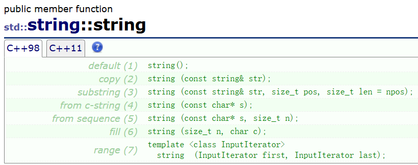
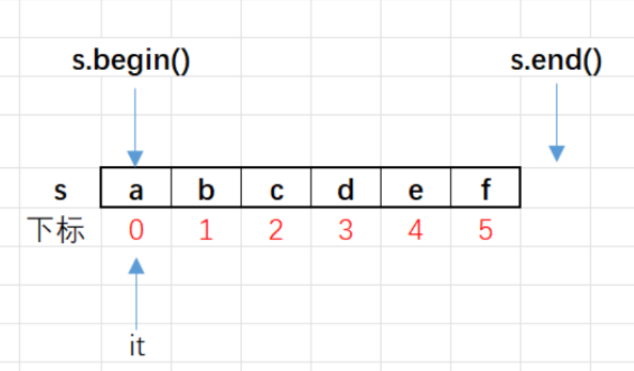
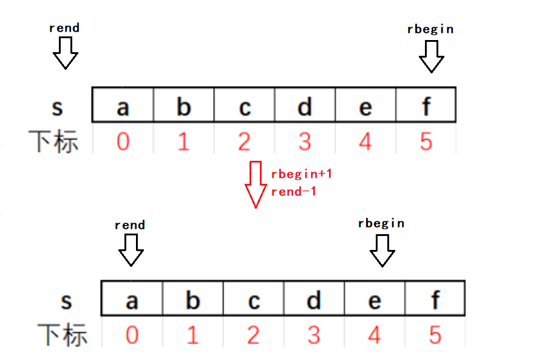
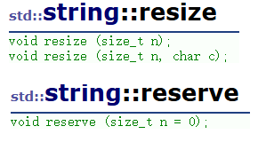
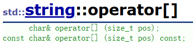
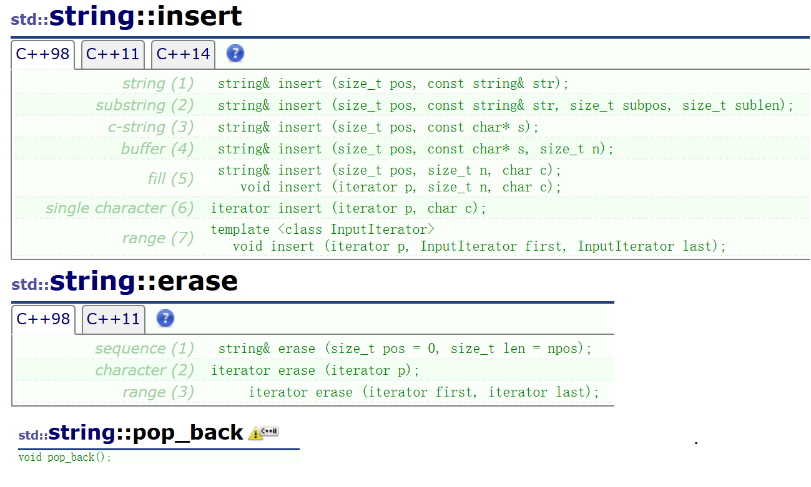
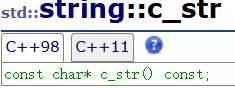
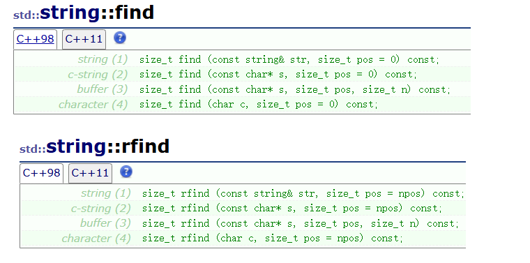

# string的使用

`string`类用于处理字符串。

> `string`严格来说属于标准库，因为`string`的产生比STL早（可以理解为STL还没出的时候`string`就已经被加进c++的标准库）。但`string`的实现和`STL`的工具具有很大的相似性。

`string`的调用需要调用头文件`string`和`namespace std`（或加前缀`std::`指定域名）。

> c++为了避免和c语言的库产生冲突，没有加 .h 的拓展名。
>
> 学习`string`时主要遵循二八原则：学习主要学习常用的，在运用熟练的过程中拓展即可。
>
> 因为计算机起源于欧美，所以从事计算机有关的工作，尽量看英文文档。

学习`string`主要参考[string - C++ Reference](https://legacy.cplusplus.com/reference/string/string/?kw=string)。这里只做简单的翻译工作和补充。

`string`设置的成员函数特别多，很多都没有必要。这里写的相对详细，但很多其实没什么用，更多是翻译隔壁网站的信息。若是我的话，我会看另一篇常用的成员函数总结：[string在算法竞赛中的使用_算法竞赛string-CSDN博客](https://blog.csdn.net/m0_73693552/article/details/145135093)。


`typedef basic_string<char> string`表明`string`也是通过模板的实例化实现，但底层已经用了`char`类型。

> 尝试翻译：字符串是表示（管理）字符序列的对象。
>
> 标准字符串类为这类对象提供支持，其接口（API，个人理解是在c/c++阶段，函数的声明信息，包括给的形参、函数名和返回值）类似于标准字节容器，但添加了专门为处理单字节字符字符串而设计的特性。
>
> 字符串类是`basic_string`类模板的一个实例化，它使用`char`（即字节符）作为其字符类型，并带有默认的 `char_traits` 和分配器类型（有关该模板的更多信息，请参见 `basic_string` ）。
>
> 请注意，这个类独立于所使用的编码来处理字节：如果用于处理多字节或可变长度字符（如 UTF - 8）序列，该类的所有成员（如 `length` 或 `size`）以及其迭代器，仍将以字节（而非实际编码的字符）为单位进行操作。

`string`用于管理字符数组，在设计时因为没有类似STL的工具作为参考，加了一百多个成员函数，而且很多函数接口显得很多余。

借助顺序表的视角看，`string`的底层存在3个私有变量：

```cpp
char* _str;
size_t _size;
size_t _capacity;
```

但不一定叫这个名，取决于c++的版本。

## string写成类模板的原因

日常存储字符串时，用的最多的编码是ASCII编码。这个是美国的编码，用于存储本国用到的符号或许足够。

但全球又不止美国的文字，因此为了推广，要建立二进制的值和各种符号的映射关系。

编码表：值和符号的一一映射表。比如ASCII表。

> 计算机起源于美国，最初用于军事。后来战争逐渐减少，为了赚钱，美国将计算机的一系列科技做成商用。
>
> 后来为了将计算机推广到全世界，在各国和美国计算机协会的互相妥协下，逐渐将标准进行拓展。这其中因为各国都开发自己的编码表，有时会造成乱码的现象。乱码即文字的存储方式和解读方式对应不上，具体详见[锟斤拷�⊠是怎样炼成的——中文显示“⼊”门指南【柴知道】_哔哩哔哩_bilibili](https://www.bilibili.com/video/BV1cB4y177QR/?spm_id_from=333.337.search-card.all.click)。
>
> 其中Unicode编码（万国码）取得了很大的进步。以汉语为例，2个字节足够将常见的汉字收录，太过冷门的汉字则用3个字节、4个字节来添加，所以这个可以理解为一种变长编码。
>
> 例如Linux操作系统喜欢用UTF-8（万国码的一种）。但Unicode不一定能够适合汉语，于是我国自己也搞了一套GBK编码（国标）。windows用的就有GBK。
>
> 而且不同的编码之间也可以转换。

在c++11没出现时有一种字符类型`wchar_t`（word char），一个`wchar_t`占两个字节。c++11觉得这种方式不规范，于是又给出了`char16_t`和`char32_t`。

所以`string`这个类写成模板的形式。`basic_string`有4种类模板：


这里仅作为简单了解，后续有机会再讨论。

## string的版本举例

目前已知的`string`的版本：

* MSVC常用：

```cpp
class string{
public:
    const static size_t npos;
private:
    char _buff[16];
    char* _str;
    size_t _size;
    size_t _capacity;
}
const size_t string::npos=-1;
```

这样做可以避免内存碎片的问题（比如大量定义长度小的字符串，使得内存中很多大的空间被分割成小的空间，类比的话就是河水中含有未沉底的泥沙使得水看起来不那么清澈），而且静态数组处理比动态数组快。

2. g++，特别是Linux OS适用的g++：

```cpp
class string{
public:
    const static size_t npos;
private:
    char* _str;
}
const size_t string::npos=-1;
```

g++的`string`类只有一个指针，这个指针的前段部分用于存储元素数量、容量的信息（类似c语言的柔性数组）。


## 构造、析构函数和赋值重载

这里主要以c++98的接口函数为例。部分情况会提及c++11。

### 构造函数和析构函数

`string`提供了这些构造函数的接口。利用这些接口可以初始化`string`的对象。



```cpp
//用string内部的缺省值初始化string对象
string();

//用str对新对象进行拷贝构造
string (const string& str);

//用str的从下标pos开始的len个字符初始化新对象
string (const string& str, size_t pos, size_t len = npos);

//用c风格字符串初始化新对象
string (const char* s);

//用c风格字符串的前n个字符初始化新对象
string (const char* s, size_t n);

//初始化对象为n个字符c
string (size_t n, char c);

//通过其他对象的迭代器进行初始化
template <class InputIterator>
  string  (InputIterator first, InputIterator last);
```

`npos`原型是`static const size_t npos = -1;`，是`string`类的静态成员变量，它的值是-1，十六进制的补码是`0xffffffff`，放在`size_t`也就是`unsigned int`中时就是最大值。

这里想表示的意思是成员的缺省参数默认是最大，表示
`string (const string& str, size_t pos, size_t len = npos);`这个函数如果不上传`len`，则将新的对象用`str`的从`pos`开始的字符串初始化。


用这些接口初始化`string`对象：

```cpp
#ifndef _CRT_SECURE_NO_WARNINGS
#define _CRT_SECURE_NO_WARNINGS 1
#endif

#include<iostream>
#include<string>
using namespace std;

void f1() {
    //string();
    string st1;
    ////不建议这样写，编译器不知道
    // 这是函数声明还是调用构造函数
    //string st2();
}

void f2() {
    //string (const char* s);
    string st3 = "abcdef";
    char st[] = { "abc12345" };
    string st3_1 = st, st3_2(st);
    //库里的类大都有将operator<<和operator>>设为友元
    cout << st3 << endl << st3_1 << endl << st3_2 << endl << endl;
}

void f3() {
    string st3 = "abcdef";
    //string(const string & str);
    string st4 = st3, st5(st3);//调用拷贝构造函数
    cout << st4 << endl << st5 << endl << endl;
}

void f4() {
    string st3 = "abcdef";
    ////用指定长度的字符串初始化
    //string (const string& str, size_t pos, size_t len = npos);
    string st6(st3, 2, 2);
    cout << st6 << endl << endl;
}

void f5() {
    ////用前n个字符初始化
    //string (const char* s, size_t n);
    string st7("abcdef", 3);
    cout << st7 << endl << endl;
}

void f6() {
    //string (size_t n, char c);
    string st8(6, 'x');
    cout << st8 << endl << endl;
}

void f7() {
    string st3 = "abcdef";
    ////迭代器初始化
    //template <class InputIterator>
    //string(InputIterator first, InputIterator last);
    string st9(st3.begin() + 2, st3.end());
    cout << st9 << endl << endl;
}

int main() {
    //f1();
    //f2();
    //f3();
    //f4();
    //f5();
    //f6();
    f7();
    return 0;
}
```

这些构造函数中最常用的还是`string();`，`string(const string& str);`和`string(const char* s);`。

析构函数的作用是释放`string`底层向堆区申请的空间。从平时使用的角度看可不用关心底层的机制。

### operator=

`string`对象的`operator=`：


```cpp
//将str的内容赋值给*this
string& operator= (const string& str);

//将c风格字符串s的内容赋值给*this
string& operator= (const char* s);

//将字符c赋值给*this
string& operator= (char c);
```

所以`string`对象还支持用单个字符赋值给`string`对象。

```cpp
#include<iostream>
#include<string>
using namespace std;

int main() {
    string st;
    st = 66;//B
    cout << st << endl;
    st = 'c';
    cout << st << endl;
    return 0;
}
```


## Iterators迭代器

在**初学**的时候，**迭代器**可以想象为**指针**。用法看上去很像指针。


STL和`string`的迭代器都是在类中定义，所以需要加`类名::`。

### begin和end

```cpp
      iterator begin();
const_iterator begin() const;
      iterator end();
const_iterator end() const;
```

`begin`和`end`都有加`const`和不加`const`的两种版本，用于应对`string`的有关函数对形参的不同需求。

`string`的`begin`和`end`给的位置：



所以一般可认为迭代器是左闭右开的区间。迭代器的使用：

```cpp
#include<iostream>
#include<string>
using namespace std;

int main() {
    string st = "abcdef";
    string::iterator it = st.begin();
    while (it != st.end()) {
        cout << *it;
        ////string的迭代器支持++，--，和+\-整数
        //it++;
        it += 1;
    }
    cout << endl;
    it = st.end()-1;
    cout << *(st.end() - 3) << endl;
    while (it != st.begin()) {
        cout << *it;
        --it;
    }
    return 0;
}
```

通过迭代器，可以使用c++11的范围`for`简化枚举：

```cpp
#include<iostream>
#include<string>
using namespace std;

int main() {
    string st="abcdef";
    
    //底层实现是迭代器
    for (auto x : st)//x是st的单位元素的临时拷贝
        cout << x;
    cout << endl;
    for (char x : st)
        cout << x;
    cout << endl;
    for (auto &x : st)//x是st的单位元素的别名
        cout << x;
    return 0;
}
```

范围`for`循环的底层实现是迭代器，即：

```c
for(auto it=st.begin();it!=st.end();it++){
    x=*it;
    //各种操作
}
```

将`*it`赋值给`x`，利用`x`进行各种操作。

范围`for`要求类至少有普通版本和`const`版本的`begin()`和`end()`（迭代器但凡更换一个名字都不支持，例如`Begin`，范围`for`就不支持），并且这些迭代器能正常访问，以及解引用（`*`）、前置递增（`++`）以及相等比较（`==`）和不等比较（`!=`）。

范围`for`不支持逆向枚举。可以对比迭代器的编译器转换成的的汇编语句。

> 个人理解，很多编译器对c++的编译行为都能通过汇编代码来了解写编译器的人的思考。

虽然`string`的迭代器支持用`>`、`<`、`>=`、`<=`，但最好还是用`!=`。因为STL的很多工具都有迭代器，那个工具在逻辑上不一定支持这些符号，比如链表`list`（链表结点存储不连续）。

`string`还可以用`algorithm`库的函数`sort`进行排序。

```cpp
#ifndef _CRT_SECURE_NO_WARNINGS
#define _CRT_SECURE_NO_WARNINGS 1
#endif

#include<iostream>
#include<string>
#include<algorithm>
using namespace std;

int main() {
    string st = "asdfghhjkl";
    sort(st.begin(), st.end());
    cout << st << endl;
    st = "qwertyyuiop";
    sort(st.begin() + 3, st.end());//指定要排列的区域
    cout << st << endl;
    return 0;
}
```

`sort`是STL的六大组件之一的算法，里面封装有很多函数。

```cpp
template <class RandomAccessIterator>
    void sort (RandomAccessIterator first, RandomAccessIterator last);

template <class RandomAccessIterator, class Compare>
    void sort (RandomAccessIterator first, RandomAccessIterator last, Compare comp);
```

`RandomAccessIterator`表示支持随机访问的迭代器，`Compare`表示完成比较工作的函数和重载有`operator()`并返回`bool`值的类。

### rbegin和rend

```cpp
      reverse_iterator rbegin();
const_reverse_iterator rbegin() const;
      reverse_iterator rend();
const_reverse_iterator rend() const;
```

r表示`reverse`，意思是这两个迭代器和`begin`和`end`相反，包括迭代器加、减整数的移动方式。



 ```cpp
 #include<iostream>
 #include<string>
 #include<algorithm>
 using namespace std;
 
 int main() {
     string st = "abcdef";
     string::reverse_iterator it = st.rbegin();
     while (it != st.rend()) {
         cout << *it;
         ++it;
     }
     cout << endl;
 
     // e a
     cout << *(st.rbegin() + 1) << ' ' << *(st.rend() - 1) << endl;
 
     it = st.rend()-1;
     while (it != st.rbegin()) {
         cout << *it;
         --it;
     }
     return 0;
 }
 ```

### cbegin和cend，crbegin和crend（c++11）

```cpp
const_iterator cbegin() const noexcept;
const_iterator cend() const noexcept;
const_reverse_iterator crbegin() const noexcept;
const_reverse_iterator crend() const noexcept;
```

`cbegin`和`cend`，`crbegin`和`crend`是c++11新增的迭代器，都是在原迭代器的基础上增加`const`赋予常属性。`noexcept`关键字用于指示函数是否可能抛出异常，在初学阶段暂时不用理会。

因为有的函数因为各种原因，形参的对象有用`cosnt`修饰。因此一般的迭代器无法使用，需要另外提供迭代器。

无法通过`cbegin`和`cend`，`crbegin`和`crend`修改后台的数据，只能通过它们访问。

```cpp
#ifndef _CRT_SECURE_NO_WARNINGS
#define _CRT_SECURE_NO_WARNINGS 1
#endif

#include<iostream>
#include<string>
using namespace std;

int main() {
    string st = "abcdef";
    string::const_iterator it = st.cbegin();
    while (it != st.cend()) {
        cout << *it;
        //迭代器加了常属性，无法对底层数据进行修改
        //*it = '6';
        it += 1;
    }
    cout << endl;
    it = st.cend() - 1;
    cout << *(st.cend() - 3) << endl;
    while (it != st.cbegin()) {
        cout << *it;
        --it;
    }
    return 0;
}
```

## capacity容量有关函数


函数原型：


简单介绍每个函数的用途：

`size()`和`length()`：

两个都是返回字符串的长度。因为`string`出现的比`STL`早，所以求长度时有`length`。但当`STL`出来的时候`size`用的特别多，于是`string`也加上了`size`。

`max_size()`：

早期`max_size`的设定是告诉用户`string`对象后台的字符数组最多能有多长，但实际上因为电脑一直在运行各种程序，实际内存无法达到`max_size`，而且`max_size`的返回值是固定的，这就使得这个成员函数几乎没有用途。

`reserve()`和`resize()`：

指定`string`对象要存储的数据个数。

> reserve，在英语的意思是保留；reverse，在英语的意思是反转。我在使用时曾误以为`reserve()`的意思是字符串反转，后来发现不是。
>
> 在实际应用时，一开始确定需要的容量，可以减少扩容次数，提高程序的效率。
>
> c++并没有规定`reserve()`会缩小容量。缩小容量的成本很高（比如临时开一个新空间，数据拷贝到新空间后释放旧空间），所以它们一般不会缩小容量，除非是自己写的编译器，想和别人不一样于是新加功能。

`capacity()`：
返回当前`string`对象的容量，这个容量不包括`\0`，也就是说它返回的是当前对象存储的的字符个数。这个容量可变。

`clear()`：
`clear()`用于初始化数据。`string`的`clear`并不释放空间，因为析构函数会释放。

`empty()`：
判断`string`的后台数据是否为空（判断字符串是否为空）。

`shrink_to_fit()`：
用于减小容量用于匹配当前的`size`，一般不会用，代价很大。

### 不同编译器下string的扩容机制

这是一个展示不同数据量的情况下`string`对象的扩容情况。

```cpp
#include<iostream>
#include<string>
using namespace std;

int main() {
    string s;
    size_t old = s.capacity();
    cout<<old<<endl;
    for (size_t i = 0; i < 1000; i++) {
        s.push_back('a');
		if (old != s.capacity()) {
            cout << s.capacity() << endl;
            old = s.capacity();
        }
    }
    return 0;
}
```

在MSVC编译器（cl.exe）的运行结果一般是这个（1.5倍扩容）：

```
15
31
47
70
105
157
235
352
528
792
1188
```

在g++编译器（g++.exe，2倍扩容）：

```
0
1
2
4
8
16
32
64
128
256
512
1024
```

这些都还不是固定的，会随着编译器的版本变化，底层的机制发生变化。

如果使用`resize`和`reserve`：

```cpp
#ifndef _CRT_SECURE_NO_WARNINGS
#define _CRT_SECURE_NO_WARNINGS 1
#endif

#include<iostream>
#include<string>
using namespace std;

int main() {
    string s;
    //s.reserve(100);
    s.resize(100);
	cout << s.capacity() << endl;
    return 0;
}
```

MSVC会多给一些，所以是111；g++则是按需给，所以输出100。

### resize和reserve

它们都是改变长度。



定向扩容的函数有三个接口。只有`void resize(size_t, char c);`会初始化为指定字符`c`，除此之外都是填充`\0`。

扩容测试案例：

```cpp
#include<iostream>
using namespace std;

void f1() {
    string s1("hello world");
    cout << s1 << endl;
    cout << s1.size() << endl;
    cout << s1.capacity() << endl;
}

void f2() {
    string s1("hello world");
    cout << s1 << endl;
    cout << s1.size() << endl;
    cout << s1.capacity() << endl;

    s1.resize(13);
    //s1.reserve(20);//会产生扩容行为，但size并不会发生变化
    cout << s1 << endl;
    cout << s1.size() << endl;//size发生变化
    cout << s1.capacity() << endl;
}
void f3() {
    string s1("hello world");
    cout << s1 << endl;
    cout << s1.size() << endl;
    cout << s1.capacity() << endl;
    s1.resize(20, 'x');//多出来的部分用x去填充
    //s1.resize(2, 'x');//不会用x去更新逆向扩容后的信息
    cout << s1 << endl;
    cout << s1.size() << endl;
    cout << s1.capacity() << endl;
}

void f4() {
    string s1("hello world");
    cout << s1 << endl;
    cout << s1.size() << endl;
    cout << s1.capacity() << endl;
    s1.resize(5);
    //s1.resize(14);
    cout << s1 << endl;
    cout << s1.size() << endl;
    cout << s1.capacity() << endl;
}

void f5() {
    string s1;
    cout << s1.size() << endl;
    cout << s1.capacity() << endl;
    s1.reserve(20);
    cout << s1.size() << endl;
    cout << s1.capacity() << endl;
}

void f6() {
    string s1="Hello world";
    cout << s1.size() << endl;
    cout << s1.capacity() << endl;
    s1.reserve(5);
    cout << s1.size() << endl;
    cout << s1.capacity() << endl;
}

int main() {
    //f1();//使用size和capacity查看对象信息
    //f2();//扩容13个单位，小于原本的capacity，于是只填充\0
    //f3();//扩容20个单位，填充指定字符，大于capacity，所以发生类似realloc的行为
    f4();//逆向扩容，实际效果是容量不变，可显示字符变少（或size减少）
    //f5();//reserve仅扩容，不调整size
    //f6();//reserve在逆向扩容时会无视请求
    return 0;
}

```

扩容的机制大致可总结为：

假设`size`和`capacity`是`string`的底层成员变量，用于监视数据个数和可用容量。

* `resize`函数在`size`$\leq$`capacity`时会填充`\0`或指定字符，否则会对`capacity`进行扩容，但无论什么情况`size`都会发生变化。

* 而`reserve`仅仅只是对`capacity`进行扩容行为，`size`并不会发生变化。

* 当利用`resize`进行缩容时，编译器仅减少`size`的值，`capacity`并不发生变化。
* 当利用`reserve`进行缩容时，`reserve`看上去会无视请求。

> 缩容需要成本。

## Element access元素通道（例如operator[]）


通过`operator[]`，`string`对象可以像字符数组一样**使用下标索引**。



这里用`const`生成`operator[]`的另一个重载，是因为一部分函数要求只读，另一部分要求能读能写。所以用了两个函数，加了`const`的那一个用于形参具有常属性的。

`string`因为生成临时对象会调用构造函数或析构函数，所以`string`对象作为实参上传时，函数的形参最好用引用，减少不必要的临时对象的生成。

`at`和`operator[]`的区别是`at`越界会抛异常，而`operator[]`会直接断言，除此之外在使用上几乎没区别。

`back`和`front`是c++11新增的内容，分别返回结尾和开头的字符。

使用案例：

```cpp
#include<iostream>
#include<string>
#include<cstdio>
using namespace std;

int main() {
    string a = "0123456789";
    printf("%c\n", a[3]);
    cout << a[4] << endl;
    cout << a.at(4) << endl;//at和[]是一样的
    cout << a.front() << ' ' << a.back() << endl;
    return 0;
}
```


## Modifiers修改用的函数


### 尾插函数operator+=，push_back，append

函数原型：


```cpp
//向*this末尾插入对象str表示的字符串
string& operator+= (const string& str);

//向*this末尾插入c风格字符串s
string& operator+= (const char* s);

//向*this末尾插入字符c
string& operator+= (char c);

//将str的内容和*this的内容拼接在一起组成改变*this
string& operator+= (const string& str);

//将c风格字符串s的内容和*this的内容拼接在一起组成改变*this
string& operator+= (const char* s);

//将字符c的内容和*this的内容拼接在一起组成改变*this
string& operator+= (char c);

//同operator+=
string& append (const string& str);

//将str从下标subpos开始的sublen个字符插入*this的尾部
string& append (const string& str, size_t subpos, size_t sublen);

//同operator+=
string& append (const char* s);

//将s的前3个字符插入*this的尾部
string& append (const char* s, size_t n);

//将n个字符c插入*this的尾部
string& append (size_t n, char c);

//通过迭代器指定某一片段插入*this
template <class InputIterator>
   string& append (InputIterator first, InputIterator last);
```

三个函数的功能都是将两个部分拼接成一个字符串。因为历史原因，这里设计的很多。实际应用最多的还是`operator+=`。

```cpp
#include<iostream>
#include<string>
using namespace std;

void f1() {
    string ss;
    ss.push_back('a');
    ss.push_back('b');
    cout << ss;
}

void f2() {
    string st("abcd");
    string st2("efg");

    //string& append (const string& str);
    st.append(st2);
    cout << st << endl;

    //string& append(const string & str, size_t subpos, size_t sublen);
    st.append(st2, 1, 1);
    cout << st << endl;

    //string& append (const char* s);
    char ch[] = { "bcdef" };
    string st3 = "a";
    cout << st3.append(ch) << endl << st3 << endl;

    //string& append (const char* s, size_t n);
    st3.append(ch, 3);
    cout << st3 << endl;

    //string& append(size_t n, char c);
    string st4 = "ab";
    st4.append(4, 'x');
    cout << st4 << endl;

    //template <class InputIterator>
    //  string& append(InputIterator first, InputIterator last);
    st4.append(st.begin(), st.end());
    cout << st4 << endl;
}

void f3() {
    string st = "abc";

    //string& operator+= (char c);
    st.operator+=('d');
    st += 'e';

    //string& operator+= (const char* s);
    st += "fg";

    //string& operator+= (const string & str);
    string st2 = "hi";
    st += st2;
    cout << st << endl;
}

int main() {
    //f1();//push_back
    //f2();//append
    f3();//operator+=
    return 0;
}
```

### 赋值assign


如同标题所言，`assign`函数有赋值的功能。但平常使用肯定是用赋值重载`operator=`。所以这个函数的功能和另一个更好用的函数重叠，造成的结果是几乎用不上。

形参的内容也是相差不多，这里简单贴一个测试案例，然后忘了这个函数，用更舒服的`operator=`。

```cpp
#include<iostream>
#include<string>

int main() {
    std::string str("xxxxxxx");
    std::string base = "The quick brown fox jumps over a lazy dog.";

    str.assign(base);
    std::cout << str << '\n';

    str.assign(base, 5, 10);
    std::cout << str << '\n';
	return 0;
}
```

### 插入insert、删除erase、pop_back和替换replace

#### insert、erase和pop_back



`insert`/`erase`/`repalce`能不用就尽量不用，因为他们都**涉及挪动数据**，效率不高，而且接口设计复杂繁多，需要时查一下文档即可。

这里给个案例简单测试基本使用。

```cpp
#include<iostream>
#include<string>
using namespace std;

void f1() {
    string st("hello world");
    string st2("abc");

    //string& insert (size_t pos, const string& str);
    st.insert(0, st2);
    cout << st << endl;
}

void f2() {
    string st("hello world");
    string st2("abc");

    //string& insert (size_t pos, const string& str, size_t subpos, size_t sublen);
    st.insert(1, st2, 1, 2);
    cout << st << endl;
}

void f3() {
    string st("hello world");
    string st2("abc");

    //string& insert (size_t pos, const char* s);
    st.insert(5, "xxx");//在下标5和下标4之间插入字符串xxx
    cout << st << endl;

}

void f4() {
    string st("hello world");
    string st2("abc");

    //string& insert (size_t pos, const char* s, size_t n);
    st.insert(7, "636666", 4);
    cout << st << endl;
}

void f5() {
    string st("hello world");
    //string& insert (size_t pos, size_t n, char c);
    cout << st.insert(4, 4, '#') << endl;
}

void f6() {
    string st("hello world");

    //void insert(iterator p, size_t n, char c);//c++98有的，插入n个字符c
    st.insert(st.begin() + 2, 4, '+');
    cout << st << endl;
}

void f7() {
    string st("hello world");

    //iterator insert (const_iterator p, size_t n, char c);//c++11新增的
    //旧版本的Devc++5.11无法使用完整的c++11，因此可能无法使用 
    cout << st.insert(st.cbegin() + 2, 4, '+')-st.begin() << endl;
    cout << st << endl;
}

void f8() {
    string st("hello world");
    string st2("abc");
    //iterator insert (iterator p, char c);
    //在指定迭代器之前插入字符c并返回被插入的字符c所在的位置的迭代器
    cout << *st.insert(st.begin() + 2, '-') << endl;
    cout << st << endl;
}

void f9() {
    string st("hello world");
    string st2("abc");
    //template <class InputIterator>
    //  void insert(iterator p, InputIterator first, InputIterator last);
    //在指定迭代器处插入迭代器表示的范围
    //反向迭代器表示逆向插入
    st.insert(st.begin() + 2, st2.rbegin(), st2.rend());
    cout << st << endl;
}

void f10() {
    string st("hello world");
    //string& erase (size_t pos = 0, size_t len = npos);
    //删除从下标pos开始的len个字符，并返回整个字符串的引用。
    //len默认为-1，表示一直到结尾
    cout << st.erase(2, 3) << endl;
}

void f11() {
    string st("hello world");
    //iterator erase (iterator p);
    //删除指定迭代器的字符并返回p处的迭代器
    cout << *st.erase(st.begin() + 7) << endl;
    cout << st << endl;
}

void f12() {
    string st("hello world");
    //iterator erase (iterator first, iterator last);
    //删除指定区域后拼接，并返回first处的迭代器
    cout << *st.erase(st.begin() + 3, st.begin() + 6)<<endl;
    cout << st << endl;
}

int main() {
    //f1();
    //f2();
    //f3();
    //f4();
    //f5();
    //f6();
    f7();
    //f8();
    //f9();
    //f10();
    //f11();
    //f12();
    return 0;
}
```

c++11新增`pop_back`函数用于弹出字符串的结尾。

#### replace

`replace`用于替换指定片段的字符为新的字符。


根据上文的经验，这里的含义也大都能猜出来，这里省略若干个使用示例。

```cpp
#include<iostream>
#include<string>
using namespace std;

int main() {
    //替换从下标5开始的3个字符
    //替换的数据相同的话还好，但凡多一个或少一个
    //都得移动字符
    string s1("hello world");
    s1.replace(5, 3, "]]20");
    cout << s1 << endl;
	return 0;
}
```

如果涉及多个地方的替换，可以用这种空间换时间的方式：

```cpp
#include<iostream>
#include<string>
using namespace std;

int main() {
    // 空格替换为20%
    //比replace高效的替换方式
    string s2("The quick brown fox jumps over a lazy dog.");
    string s3;
    for (auto ch : s2) 
        if (ch != ' ') 
            s3 += ch;
        else
            s3 += "20%";
	return 0;
}
```

### 交换swap

在命名空间`std`中还有一个函数模板`swap`。


这个函数模板会生成临时对象，会生成3次深拷贝（一次构造，两次赋值）。

而`string`自带的`swap`则会交换`string`的**底层字符数组的地址**。所以更建议用成员函数`swap`。

```cpp
#include<iostream>
#include<string>
using namespace std;

int main() {
    string s2("The quick brown fox jumps over a lazy dog.");
    string s3("The20%quick20%brown20%fox20%jumps20%over20%a20%lazy20%dog.");
    //s2 = s3;
    //s2.assign(s3);
    //swap(s2, s3);
    s2.swap(s3);//严格来说都不如这个高效
    cout << s3;
	return 0;
}
```

可通过查看`c_str()`直观感受地址交换。

但`string`还有一个现成的非成员函数`swap`，有现成的`swap`就不会生成函数模板，以至于`string`永远不会调用函数模板，所以看起来即使是用`void swap(string&,string&);`，产生的效果也和`void swap(string&);`一样。


```cpp
#include<iostream>
#include<string>
using namespace std;

int main() {
    string s2("The quick brown fox jumps over a lazy dog.");
    string s3("The20%quick20%brown20%fox20%jumps20%over20%a20%lazy20%dog.");
    printf("%p\n", s2.c_str());
    printf("%p\n", s3.c_str());
    //s2.swap(s3);
    swap(s2, s3);//看上去两个似乎没区别
    printf("%p\n", s2.c_str());
    printf("%p\n", s3.c_str());
	return 0;
}
```

输出结果之一：

```cpp
0148C850
01490AB8
01490AB8
0148C850
```


## string operations字符串操作


`copy`：

`size_t copy (char* s, size_t len, size_t pos = 0) const;`，将`string`对象的内容拷贝给c语言风格的字符数组`s`，返回拷贝的值。几乎不用。

`compare`用于比较`string`对象和字符串之间的字典序。这个由比较运算符重载就能完成，因此几乎不用。

`get_allocator()` 主要用于获取 `string` 对象所使用的分配器（或者说内存）。在初学时用不上，后续会补充。

### c_str和data

c++毕竟是建立在c语言的基础之上，很多c语言的东西`string`类也要支持。比如c语言的函数`fopen`，文件名只能用c语言的字符串，比如mysql只提供c语言的接口。

所以`string`额外提供了`c_str()`返回c风格的字符串数组的首指针。

尽管可以通过`c_str`修改`string`的后台数据，但**不会调用构造函数和析构函数**，很容易发生错误。



`data`和`c_str`是一样的，但出于历史原因，`c_str`被保留。

### substr

`substr`用于获取`string`对象中的一部分作为子串。

函数原型：

`string substr (size_t pos = 0, size_t len = npos)const;`。

使用案例：

```cpp
#include<iostream>
#include<string>
using namespace std;

int main() {
    string s1("test.cpp.tar.zip");
    cout << s1.substr(5, 3) << endl;//分离出cpp
    cout << s1.substr(5) << endl;//切除前5个字符后剩下的字符
	return 0;
}
```

### find和rfind

`find`系列函数大致用于在主串中寻找匹配串出现的位置。`rfind`和`find`功能差不多，但不同的是从字符串末尾（迭代器`end`的前一个字符）往字符串开头找。

> 比如主串`ababacb`中，匹配串`bac`出现的位置是下标3开始的3个字符。



`find`和`rfind`案例：

```cpp
#include<iostream>
#include<string>
using namespace std;

int main() {
    string s1("test.cpp.tar.zip");
    size_t i = s1.find('.');//返回第一次找到的位置的下标，否则返回npos(-1)
    cout << i << endl;
    i = s1.rfind('.');//和find相比，逆向寻找
    cout << i << endl;

    string s2 = s1.substr(i);//切除前size()-i个字符后将子串赋值给s2
    cout << s2 << endl;
	return 0;
}
```

应用之一：分离网站成分。

> 网站大都分几个部分：协议（https）、域名（什么什么.com，例如legacy.cplusplus.com）、资源名（例如：reference/string/string/substr）。
>
> 计算机想要连接互联网（Internet），需要遵守别人划定的规定（指TCP/IP协议，当然有其他的），也可以自己搭建网络，自己写协议，让自己那个圈子的人连接。

```cpp
#include<iostream>
#include<string>
using namespace std;

int main() {
    //分离网址的成分
    //string s3("https://legacy.cplusplus.com/reference/string/string/rfind/");
    string s3("ftp://www.baidu.com/?tn=65081411_1_oem_dg");

    string sub1, sub2, sub3;
    size_t i1 = s3.find(':');
    if (i1 != string::npos)//npos实际是-1，用无符号整数存储是最大的数，正常字符串不会这么长
        sub1 = s3.substr(0, i1);
    else
        cout << "没有找到i1" << endl;

    size_t i2 = s3.find('/', i1 + 3);//跳过://
    if (i2 != string::npos)
        sub2 = s3.substr(i1 + 3, i2 - (i1 + 3));
    else
        cout << "没有找到i2" << endl;

    sub3 = s3.substr(i2 + 1);

    cout << sub1 << endl;
    cout << sub2 << endl;
    cout << sub3 << endl;
	return 0;
}
```


### 其他find

其他`find`即`find_first_of`、`find_last_of`、`find_first_not_of`、`find_last_not_of`都是查找对象中，形参内的字符的位置。

但这个查找可以用计数排序（或哈希表）的思路代替。比如开所有字符的计数数组`vis[256]`，将匹配串中的字符标记，之后再遍历主串，凡是找到被`vis`标记过的字符就记录下标，这样时间复杂度可以降到$O(m+n)$。

也就是说，这些看上去和`find`有关的函数算是历史遗留的史(bushi)。


#### find_first_of

```cpp
size_t find_first_of (const string& str, size_t pos = 0) const;
size_t find_first_of (const char* s, size_t pos = 0) const;
size_t find_first_of (const char* s, size_t pos, size_t n) const;	
size_t find_first_of (char c, size_t pos = 0) const;
```

`find_first_of`，是底层标记匹配串`str`或`s`（或字符`c`）在主串中`pos`后出现的位置的位置，一般需要用一个变量来接收。

> 从名字看不出来这个函数到底有啥用，算是设计得很失败的那几个。
>
> 而且平时也不怎么用的上，遇到了就查文档。所以学的时候有个印象即可。

例如，找到`{a,e,i,o,u}`的其中之一后换成`*`：

```cpp
#include<iostream>
#include<string>
using namespace std;

int main() {
    std::string str("Please, replace the vowels in this sentence by asterisks.");
    //找到{a,e,i,o,u}在str中第1个出现的位置。
    std::size_t found = str.find_first_of("aeiou");
    while (found != std::string::npos)
    {
        str[found] = '*';
        found = str.find_first_of("aeiou", found + 1);
    }
    std::cout << str << '\n';
	return 0;
}
```

输出：

```cpp
Pl**s*, r*pl*c* th* v*w*ls *n th*s s*nt*nc* by *st*r*sks.
```


#### find_last_of

```cpp
size_t find_last_of (const string& str, size_t pos = npos) const;
size_t find_last_of (const char* s, size_t pos = npos) const;
size_t find_last_of (const char* s, size_t pos, size_t n) const;
size_t find_last_of (char c, size_t pos = npos) const;
```

`find_last_of`和`find_last_of`的区别是从尾迭代器开始逆向查找。

```cpp
// string::find_last_of
#include <iostream>       // std::cout
#include <string>         // std::string
#include <cstddef>         // std::size_t

void SplitFilename(const std::string& str)
{
	//输出待分隔开的字符串
	std::cout << "Splitting: " << str << '\n';

	//从后往前查找字符串str中出现\或/出现的位置
	std::size_t found = str.find_last_of("/\\");
	std::cout << " path: " << str.substr(0, found) << '\n';
	std::cout << " file: " << str.substr(found + 1) << '\n';
}

int main()
{
	std::string str1("/usr/bin/man");
	std::string str2("c:\\windows\\winhelp.exe");

	SplitFilename(str1);
	SplitFilename(str2);

	return 0;
}
```

输出：

```cpp
Splitting: /usr/bin/man
 path: /usr/bin
 file: man
Splitting: c:\windows\winhelp.exe
 path: c:\windows
 file: winhelp.exe
```


#### find_first_not_of 和find_last_not_of

```cpp
size_t find_first_not_of (const string& str, size_t pos = 0) const;
size_t find_first_not_of (const char* s, size_t pos = 0) const;
size_t find_first_not_of (const char* s, size_t pos, size_t n) const;
size_t find_first_not_of (char c, size_t pos = 0) const;

size_t find_last_not_of (const string& str, size_t pos = npos) const;
size_t find_last_not_of (const char* s, size_t pos = npos) const;
size_t find_last_not_of (const char* s, size_t pos, size_t n) const;
size_t find_last_not_of (char c, size_t pos = npos) const;
```

这2个和不加`not`的函数完全相反，是只保留形参内的字符。


```cpp
#include<iostream>
#include<string>
using namespace std;

int main() {
    std::string str("Please, replace the vowels in this sentence by asterisks.");
    //找到不属于集合{a,e,i,o,u}的字符，在str中第1个出现的位置。
    std::size_t found = str.find_first_not_of("aeiou");
    while (found != std::string::npos)
    {
        str[found] = '*';
        found = str.find_first_not_of("aeiou", found + 1);
    }
    std::cout << str << '\n';
    return 0;
}
```

输出：

```cpp
**ea*e***e**a*e***e**o*e***i****i***e**e**e****a**e*i****
```


## 非成员函数


其中流插入`>>`和流提取`<<`支持`cin`和`cout`对`string`的对象进行操作。

通过`cin`和`>>`可以对`string`对象输入字符串，但不接受空格和换行符。

通过`cout`和`<<`可以将字符串输出。

### operator+

根据[类和对象——运算符重载-CSDN博客](https://blog.csdn.net/m0_73693552/article/details/145499735?spm=1001.2014.3001.5501)，`operator+`返回临时对象的拷贝，而`operator+=`会对原本的对象进行修改。这两个加在`string`的含义是拼接字符串组成新的字符串。


`operator+`不属于`string`的成员函数，是为了确保顺序。和`operator<<`和`operator>>`一样是`string`的友元函数。


> `operator+`因为传值返回，会调用很多可优化的拷贝构造，不建议多用，而是更建议用`operator+=`。

### relational operators比较运算符和字典序

字典序解释：2个字符串`s1`，`s2`，从前向后一个一个字符进行比较。遇到第`i`个不相同时，结果就是`s1[i]`和`s2[i]`的大小关系。如果一直相等，有一个字符串结束，则长的大，一样长的话，则2个字符串相等。

字典序比较有两种方式。
1. 比较运算符：`<`、`<=`、`==`、`>=`、`>`和`!=`。比如：
```cpp
if(s1>s2)
    cout<<s1;
else
    cout<<s2;
```
2. `compare()`函数，最常见的方式是`s1.compare(s2)`。`s1`和`s2`相等时返回0；`s1`字典序小于`s2`时返回值小于0；`s1`字典序大于`s2`时返回值大于0。

只看c++98的话，比较运算符的形参都差不多，只需保证至少1个形参是`string`的对象即可。


其中整数的比较和字典序相比不同的是，长度长的数字大，一样长则逐一比较，直到第一个不相同的数字，它们的大小关系就是两个大整数的大小关系。

### getline

```cpp
//获取字符串直到读取到字符delim
istream& getline (istream& is, string& str, char delim);
//获取一行字符串
istream& getline (istream& is, string& str);
```

使用示例：

```cpp
#include<iostream>
#include<string>
using namespace std;

void f1() {
    string st;
    getline(cin, st);
    cout << st << endl;
}

void f2() {
    string st;
    getline(cin, st, 'p');
    cout << st << endl;
}


void f3() {
    string st;
    int n;
    cin >> n;//这里会留下一个换行符，使st无法读取数据
    getline(cin, st);
    cout << st << endl;
}

void f4() {
    string st;
    int n;
    (cin >> n).get();//用get()吸收
    //getline(cin, st);//多次重复读取
    //getchar();//用getchar吸收
    getline(cin, st);
    cout << st << endl;
}

int main() {
    //f1();//读取指定字符停下
    //f2();//读取一行
    //f3();//getline和cin搭配时的读取异常
    f4();//getline和cin搭配时的读取异常解决方案
    return 0;
}
```

## c++11新增处理数字的函数

这里只列举`basic_string<char>`使用的。

```cpp
//获取str中的浮点数
double stod (const string&  str, size_t* idx = 0);
float stof (const string&  str, size_t* idx = 0);
long double stold (const string&  str, size_t* idx = 0);

//获取str中的整数，默认转换为10进制
int stoi (const string&  str, size_t* idx = 0, int base = 10);
long stol (const string&  str, size_t* idx = 0, int base = 10);long long stoll (const string&  str, size_t* idx = 0, int base = 10);
unsigned long stoul (const string&  str, size_t* idx = 0, int base = 10);
unsigned long long stoull (const string&  str, size_t* idx = 0, int base = 10);

//将数字转换为string对象
string to_string (int val);
string to_string (long val);
string to_string (long long val);
string to_string (unsigned val);
string to_string (unsigned long val);
string to_string (unsigned long long val);
string to_string (float val);
string to_string (double val);
string to_string (long double val);
```

应用举例（浮点数）：

```cpp
#include <iostream>
#include <string>
using namespace std;

int main() {
	string st="3.14159";
	size_t i=0;
	cout<<stod(st)<<endl; 
	cout<<stod(st,&i)<<endl;
	cout<<i<<endl<<endl;
	
	st="3.14159abcdef";
	cout<<stod(st)<<endl; 
	cout<<stod(st,&i)<<endl;
	cout<<i<<endl<<endl;
	
	st="3.14cdef159ab";
	cout<<stod(st)<<endl; 
	cout<<stod(st,&i)<<endl;
	cout<<i<<endl<<endl;
	
	st="3.cdef14159ab";
	cout<<stod(st)<<endl; 
	cout<<stod(st,&i)<<endl;
	cout<<i<<endl<<endl;
	
	st="3cdef.14159ab";
	cout<<stod(st)<<endl; 
	cout<<stod(st,&i)<<endl;
	cout<<i<<endl<<endl;
	
//	st="c3def.14159ab";//要以数字开头 
//	cout<<stod(st)<<endl; 
	
	st="3.141592653589793";
	cout<<stod(st)<<endl; 
	cout<<stod(st,&i)<<endl;
	cout<<i<<endl;
	return 0;
}
```

应用举例（整数）：

```cpp
#include <iostream>
#include <string>
#include <cstdio>
using namespace std;

int main() {
	string st="3a3f3f3f";
	size_t i=0;
	printf("%d\n",stoi(st,&i,11));//3+10*11+3*121=3+110+363=476
	cout<<i<<endl<<endl;
	
	printf("%x\n",stoi(st,&i,16));
	cout<<i<<endl<<endl;
	
	printf("%d\n",stoi(st,&i,8));
	cout<<i<<endl<<endl;
	
	return 0;
}
```

应用举例（`to_string`）:

```cpp
#include <iostream>
#include <string>
using namespace std;

int main() {
	int int_max=2e32-1;
	string Int_max=to_string(int_max);
	cout<<Int_max<<endl;
	
	return 0;
}
```


## 引用计数和写时拷贝

引用计数用来记录资源使用者的个数，可以理解为编译器在编译代码时额外开一个变量进行计数。

写时拷贝可以先看[C++ STL string的Copy-On-Write（写时拷贝）技术 | 酷 壳 - CoolShell](https://coolshell.cn/articles/12199.html)，这里只做简单解释。

在构造时，将资源的计数给成1，每**增加一个对象使用该资源**，就给**计数增加**1，当某个**对象被销毁**时，先给**该计数减**1，然后再**检查**是否需要释放资源，如果计数为1，说明该对象时资源的最后一个使用者，将该资源释放；否则就不能释放，因为还有其他对象在使用该资源。

引用计数在`string`中的应用是优化浅拷贝问题。

> 浅拷贝问题归纳起来就是2点：
>
> 1. 析构函数调用2次。若析构函数存在释放空间的行为，则会产生重复释放的情况。
> 2. 修改一个对象对另一个对象造成影响。

优化即多个对象如果在不修改的情况下，它们可以**共同管理**堆区中的**同一个字符串数组**。

当其中一个对象销毁时，空间不会立即被释放，而是根据引用计数变量来判断是否需要释放申请的空间。

若计数变量变成0，说明已经没有对象使用这片空间，可以释放空间。

> 写时拷贝本质就是一种延迟拷贝，即我可以现在拷贝，但我为了效率选择不拷贝，用尽可能少的空间创造最大的价值。

若**某个对象要修改字符串数组**，则**另外申请新的空间**进行修改，这就是**写时拷贝**（全称是引用计数写时拷贝）。


windows OS下的MSVC（Visual Studio 2019）的`string`类是直接拷贝（据说Visual Studio 2022和最新版也引入了引用计数和写时拷贝，但我没用过也就没测试），Linux 操作系统下的g++则是引用计数和写时拷贝。

在操作系统中也有子进程和主进程共用同一进程空间的情况，这也是引用计数作为一种优化方案的应用之一。

至于引用计数写时拷贝怎么实现，可以参考c++另一个重要的概念：[智能指针](https://blog.csdn.net/m0_73693552/article/details/150302779?spm=1001.2014.3001.5502)。

# 其他人眼中的string

这里贴一些链接。毕竟自己也是站在巨人的肩膀上。

[C++的std::string的“读时也拷贝”技术！ | 酷 壳 - CoolShell](https://coolshell.cn/articles/1443.html) 

[C++面试中string类的一种正确写法 | 酷 壳 - CoolShell](https://coolshell.cn/articles/10478.html) 

[STL 的string类怎么啦？_string 截取复杂度 c++-CSDN博客](https://blog.csdn.net/haoel/article/details/1491219) 

# 练习使用string的OJ

## 415. 字符串相加 - 力扣

[415. 字符串相加 - 力扣（LeetCode）](https://leetcode.cn/problems/add-strings/description/)

高精度加法。参考程序：

```cpp
class Solution {
public:
    string addStrings(string num1, string num2) {
        if(num1.size()<num2.size())
            num1=string(num2.size()-num1.size(),'0')+num1;
        if(num1.size()>num2.size())
            num2=string(num1.size()-num2.size(),'0')+num2;

        for(size_t i=num1.size()-1,w=0,tmp;i!=-1;i--){
            tmp=(num1[i]-'0')+(num2[i]-'0')+w;
            w=tmp/10;
            tmp%=10;
            num1[i]=char(tmp+'0');
            if(i==0&&w)
                num1=to_string(w)+num1;
        }
        return num1;

    }
};
```

## 917. 仅仅反转字母 - 力扣

[917. 仅仅反转字母 - 力扣（LeetCode）](https://leetcode.cn/problems/reverse-only-letters/)

双指针模拟，每次交换都连续移动直到找到下一对字母。

```cpp
class Solution {
public:
    string reverseOnlyLetters(string s) {
        if(s.empty())
            return s;
        int l=0,r=s.size()-1;
        while(l<s.size()&&!isalpha(s[l]))
            l++;
        while(r<s.size()&&!isalpha(s[r]))
            r--;
        while(l<r){
            swap(s[l++],s[r--]);
            while(l<s.size()&&!isalpha(s[l]))
                l++;
            while(r<s.size()&&!isalpha(s[r]))
                r--;
        }
        return s;
    }
};
```


## 387. 字符串中的第一个唯一字符 - 力扣

[387. 字符串中的第一个唯一字符 - 力扣（LeetCode）](https://leetcode.cn/problems/first-unique-character-in-a-string/description/)

计数排序。

```cpp
class Solution {
public:
    int firstUniqChar(string s) {
        int a[26]={0};
        for(auto&x:s)
            a[x-'a']++;
        for(size_t i=0;i<s.size();i++){
            if(a[s[i]-'a']==1)
                return i;
        }
        return -1;
    }
};
```


## 最后一个单词的长度

[字符串最后一个单词的长度_牛客题霸_牛客网](https://www.nowcoder.com/practice/8c949ea5f36f422594b306a2300315da?tpId=37&&tqId=21224&rp=5&ru=/activity/oj&qru=/ta/huawei/question-ranking)

连续输入单词即可。

```cpp
#include <iostream>
using namespace std;

int main() {
    string st;
    size_t ans;
    while(cin>>st)
        ans=st.size();
    cout<<ans;
    return 0;
}
```


## 125. 验证回文串 - 力扣

[125. 验证回文串 - 力扣（LeetCode）](https://leetcode.cn/problems/valid-palindrome/)

```cpp
class Solution {
public:
    bool isPalindrome(string s) {
        string st;
        for(auto&x:s){
            if((x>='A'&&x<='Z')||(x>='a'&&x<='z')||(x>='0'&&x<='9')){
                if(x<'a')
                    st+=char(x+32);
                else
                    st+=x;
            }
        }
        int l=0,r=st.size()-1;
        while(l<r){
            if(st[l++]!=st[r--])
                return 0;
        }
        return 1;
    }
};
```


## 541. 反转字符串 II - 力扣

[541. 反转字符串 II - 力扣（LeetCode）](https://leetcode.cn/problems/reverse-string-ii/description/)

将字符串每`k`个一组分别存放，之后对符合要求的组进行逆序处理，最后再拼接即可。

```cpp
class Solution {
public:
    string reverseStr(string s, int k) {
        if(s.size()<k){
            int l=0,r=s.size()-1;
            while(l<r)
                swap(s[l++],s[r--]);
            return s;
        }
        else if(s.size()<2*k){
            int l=0,r=k-1;
            while(l<r)
                swap(s[l++],s[r--]);
            return s;
        }

        vector<string>tmp(1,"");
        int p=0;
        for(size_t i=0;i<s.size();i++){
            if(tmp[p].size()<k)
                tmp[p].push_back(s[i]);
            else{
                if(p%2==0){
                    int l=0,r=k-1;
                    while(l<r)
                        swap(tmp[p][l++],tmp[p][r--]);
                }
                tmp.push_back("");
                ++p;
                tmp[p].push_back(s[i]);
            }
        }
        if(p%2==0){
            int l=0,r=tmp[p].size()-1;
            while(l<r)
                swap(tmp[p][l++],tmp[p][r--]);
        }
        
        s.clear();
        for(auto&x:tmp)
            s+=x;
        return s;
    }
};
```


## 557. 反转字符串中的单词 III - 力扣

[557. 反转字符串中的单词 III - 力扣（LeetCode）](https://leetcode.cn/problems/reverse-words-in-a-string-iii/)

```cpp
class Solution {
public:
    string reverseWords(string s) {
        size_t l=0,r=0;
        for(size_t i=0;i<s.size();i++){
            if(s[i]==' '){
                r=i-1;
                while(l<r)
                    swap(s[l++],s[r--]);
                l=i+1;
            }
        }
        r=s.size()-1;
        while(l<r)
            swap(s[l++],s[r--]);
        return s;
    }
};
```


## 43. 字符串相乘 - 力扣

[43. 字符串相乘 - 力扣（LeetCode）](https://leetcode.cn/problems/multiply-strings/)

高精度乘法。

```cpp
class Solution {
public:
    string multiply(string num1, string num2) {
        string &a=num1,&b=num2,c(a.size()+b.size(),'0');
        for(size_t j=b.size()-1,w=0,tmp;j!=-1;j--){
            w=0;
            for(size_t i=a.size()-1;i!=-1;i--){
                tmp=(c[i+j+1]-'0')+(a[i]-'0')*(b[j]-'0')+w;
                w=tmp/10;
                tmp%=10;
                c[i+j+1]=tmp+'0';
            }
            c[j]+=w;
        }
        while(c.size()>1&&c[0]=='0')
            c.erase(0,1);
        return c;
    }
};
```


## 第一个只出现一次的字符

[找出字符串中第一个只出现一次的字符_牛客题霸_牛客网](https://www.nowcoder.com/practice/e896d0f82f1246a3aa7b232ce38029d4?tpId=37&&tqId=21282&rp=1&ru=/activity/oj&qru=/ta/huawei/question-ranking)

```cpp
#include <bits/stdc++.h>
using namespace std;

int main() {
    int a[26]={0};
    string st;
    cin>>st;
    for(auto&x:st)
        a[x-'a']++;
    for(auto&x:st)
        if(a[x-'a']==1){
            cout<<x;
            return 0;
        }
    cout<<-1;
    return 0;
}
// 64 位输出请用 printf("%lld")
```

## LCR 192. 把字符串转换成整数 (atoi) - 力扣

[LCR 192. 把字符串转换成整数 (atoi) - 力扣（LeetCode）](https://leetcode.cn/problems/ba-zi-fu-chuan-zhuan-huan-cheng-zheng-shu-lcof/description/)

首先清理在前缀的空格，然后判断符号并标记。

之后枚举每个字符，是数字就统计，不是就停止，就这样截取11位。

若真截取到11位，则根据是否是负数返回`-unsigned(-1)`和`2e32-1`。

若只截取到10位，和`2e32-1`做比较，大于的话则根据是否是负数返回`-unsigned(-1)`和`2e32-1`。

否则转换成数字再返回。

```cpp
class Solution {
public:
    int myAtoi(string str) {
        size_t p=0;
        while(p<str.size()&&str[p]==' ')
            ++p;
        bool flag=0;

        if(str[p]=='+')
            ++p;
        else if(str[p]=='-'){
            ++p;
            flag=1;
        }
        else if(str[p]<'0'||str[p]>'9'){
            return 0;
        }

        string ans;
        while(ans.size()<11&&p<str.size()
            &&str[p]>='0'&&str[p]<='9'){
                ans+=str[p++];
                while(ans.size()>1&&ans[0]=='0')
                    ans.erase(0,1);
        }
        if(ans.size()==11){
            if(flag)
                return -2147483648;
            else
                return 2147483647;
        }
        if(ans.size()==10&&ans>"2147483647"){
            if(flag)
                return -2147483648;
            else
                return 2147483647;
        }
        int num=0;
        for(auto&x:ans)
            num=num*10+(x-'0');
        if(flag)
            return -num;
        else
            return num;
    }
};
```

## 344. 反转字符串 - 力扣

[344. 反转字符串 - 力扣（LeetCode）](https://leetcode.cn/problems/reverse-string/description/)

无脑双指针。

```cpp
class Solution {
public:
    void reverseString(vector<char>& s) {
        int l=0,r=s.size()-1;
        while(l<r){
            swap(s[l++],s[r--]);
        }
    }
};
```

## 387. 字符串中的第一个唯一字符 - 力扣

[387. 字符串中的第一个唯一字符 - 力扣（LeetCode）](https://leetcode.cn/problems/first-unique-character-in-a-string/)

计数排序。

```cpp
class Solution {
public:
    int firstUniqChar(string s) {
        int a[26]={0};
        for(auto&x:s)
            a[x-'a']++;
        for(size_t i=0;i<s.size();i++){
            if(a[s[i]-'a']==1)
                return i;
        }
        return -1;
    }
};
```


