# string的模拟实现

建议先看[c++STL-string的使用-CSDN博客](https://blog.csdn.net/m0_73693552/article/details/147881146?spm=1001.2014.3001.5502)

这里的模拟实现是帮助自己更好地理解`string`。不排除以后觉得库里的`string`不好用，自己亲自写一个更好的。

并且c++的标准并没有规定怎么实现，而是给定了指标，程序员达到这个标准即可。

这里贴一个功能文档，后期自己想复习了，就照着这个文档搓一遍`string`。

## string的模拟线性表的实现

这里参考[顺序表的概念和实现-CSDN博客](https://blog.csdn.net/m0_73693552/article/details/143248390)：

```cpp
class string{
public:
    //const static size_t npos=-1;//特例，不建议用特例
    const static size_t npos;
private:
    char* _str;
    size_t _size;
    size_t _capacity;
}
const size_t string::npos=-1;
```

`_size`表示`\0`的位置。

`_capacity`表示数组的大小。数组需要预留1个空间给`\0`，因此`_capacity`会比实际情况小1。

> `const`静态整型变量可以给缺省值。类的成员变量给的缺省值是给**初始化列表**使用，但静态成员变量不会通过构造函数的初始化列表，所以按照标准应该是不可以的。
>
> 猜测写c++语法的人或写编译器的人为了个人方便，为`const`静态整型变量开了一个特例，甚至只能是整型，别的类型比如`double`不允许。


因为`string`的成员函数很多而且功能大都是重复的，所以只选几个重要的功能模拟实现。

也不做`basic_string`的类模板，就只做`basic_string<char>`。

不确定的功能也可以用库中的作对比。

### 构造函数

对比`string`的构造函数接口：

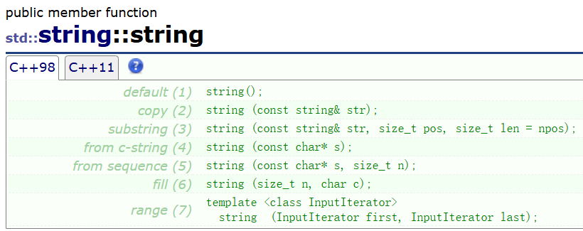

这里选择形参为`char*`的构造函数来模拟实现。

```cpp
#include<iostream>
#include<string>
using namespace std;

int main() {
    string st;
    cout << st;//调用默认构造函数也不会越界
    string st2("abc");
    cout << st2;
    return 0;
}
```

所以构造函数满足不给初始值也不会越界（即至少有1个`\0`）。

目前能想到的方案是**构造函数的形参给全缺省**，用全缺省的形参去初始化成员变量，用全缺省的形参也能省去无参构造函数的定义。

几种常见的不合理的构造函数：

```cpp
//1
//成员指针_str可修改，str经过const修饰不可通过str修改内存
//_str也不能加const修饰。
string(const char* str)
    :_str(str)//
    ,_size(strlen(str))
{
    //拷贝字符串
}

//2
//初始化列表按照成员变量在类中声明的顺序。
//所以_capacity
string(const char* str)
    :_size(strlen(str))
    ,_capacity(strlen(str))
    ,_str(new char[_capacity+1])
{
    //拷贝字符串
}
```


### 析构函数

析构函数如果不在意效率，可以按照顺序表的方式去释放空间。如果在意效率，后文会介绍引用计数和写时拷贝。


### 获取长度（size）和获取容量（capacity）

```cpp
size_t size() const;
size_t capacity() const;
```


获取长度：返回`_size`，并保证不会修改`*this`。

获取容量：返回`_capacity`，并保证不会修改`*this`。

这样可以方便查看对象的情况。


### 访问 [] 和c_str

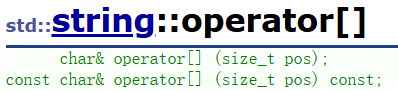

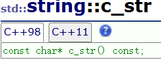

重载`operator[]`，返回类型`char&`。需要注意判断下标是否合理。

要提供2个`[]`，一个不加`const`，另一个返回值和`this`指针都加`const`。

`c_str`返回`_str`的地址。

### 迭代器（iterator）

```cpp
      iterator begin();
const_iterator begin() const;
      iterator end();
const_iterator end() const;
```


迭代器的功能和指针类似，但不一定是指针。在模拟实现阶段用指针代替。

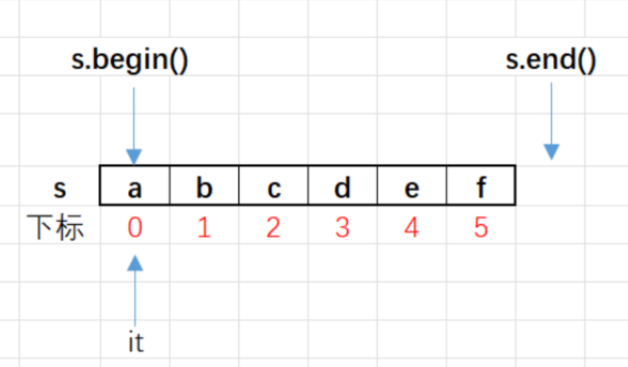

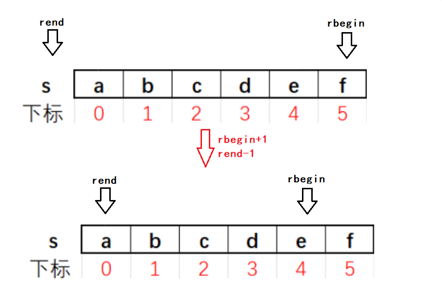

其中范围`for`要求类至少有普通版本和`const`版本的`begin()`和`end()`（迭代器但凡更换一个名字都不支持，例如`Begin`，范围`for`就不支持），并且这些迭代器能正常访问，以及解引用（`*`）、前置递增（`++`）以及相等比较（`==`）和不等比较（`!=`）。

对于内置类型的数组来说，指针本身就可以作为迭代器使用，因为指针支持这些操作。

其中迭代器使用基础的`begin`和`end`即可，反向迭代器需要用到适配器模式，在初学阶段暂时用不上。但可以通过其他迭代器类间接调用已有的`begin`和`end`，以及相关的操作来实现。

### 交换swap

两个`string`对象完全可以只交换成员变量的值，这样可以减少多余的拷贝带来的额外开销。

### 拷贝构造函数

* 用另一个对象初始化`*this`，需要另外开辟空间。

* 还可以利用形参的`_str`去调用构造函数来**初始化临时对象**，之后`*this`和临时对象交换`_str`的地址即可。但需要注意的是，**新生成的临时对象**不会去调用原始的构造函数，因此**需要额外初始化**。
  之后临时对象调用析构函数，和`*this`没有关系。

毕竟也是构造函数，需要对成员变量进行初始化。

拷贝构造函数还会面临另外的问题：浅拷贝问题。

浅拷贝问题是因为类的默认成员函数会自动运行做一些可能出问题的事（比如两个对象中的指针同时指向堆区的某块内存，连续进行两次释放的行为）。如果能花费较小的代价阻止默认成员函数的部分行为，则可以让浅拷贝成为一种优化方式。详细见**引用计数**和**写时拷贝**。


### 赋值重载（=）

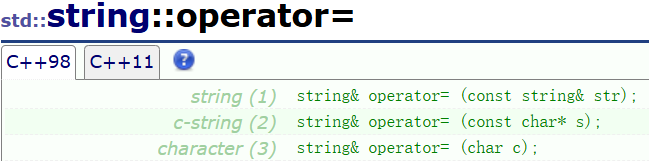

`char*`可以通过调用构造函数间接实现，因此只需要再实现一个`char`为形参的即可。

进行赋值重载前先进行容量检测（`reserve`）。

* 先进行判断，防止自己给自己赋值做多余的工作。

  后检查容量，容量不够时需要扩容，否则直接拷贝即可。

* 还可以利用形参的`_str`去调用构造函数来初始化临时对象，之后`*this`和临时对象交换`_str`的地址即可。

* 甚至还可以用传值传参，系统自己调用拷贝构造函数，再交换数据即可。

> 赋值重载也会涉及浅拷贝问题。详细见引用计数和写时拷贝

三种选择都可以，更推荐后面两个。

### 扩容（reserve和resize）

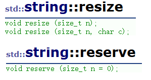

`string`的操作中，增加字符串中的内容需要扩容。因此推荐先实现扩容。

首先实现`reserve`。检测容量是否足够，不够的话扩容，`size`不变。同时注意初始`capacity`。

如果是缩容，`reserve`什么也不做。

> c++尽量不用`realloc`扩容，而是另外`new`另一个空间，因为要扩容的空间可能是自定义类型，需要调用其他类的构造函数和析构函数。

如果是`resize`：

* `_size`小于要扩容的大小，则在`reserve`的基础上更改`_size`的值，并用指定的符号去填充即可。
* `_size`大于要扩容的大小，则相当于缩容，只需要更改`_size`的值并赋值`\0`即可。

> 根据实际经验，MSVC和mingw64的扩容方式不同（MSVC是1.5倍，mingw64是2倍扩容）。
>
> 用哪个都可以。

扩容时统一使用新开空间。虽然可以使用`realloc`，但很多时候`realloc`也是开辟新空间，释放旧空间。


### 插入（insert）

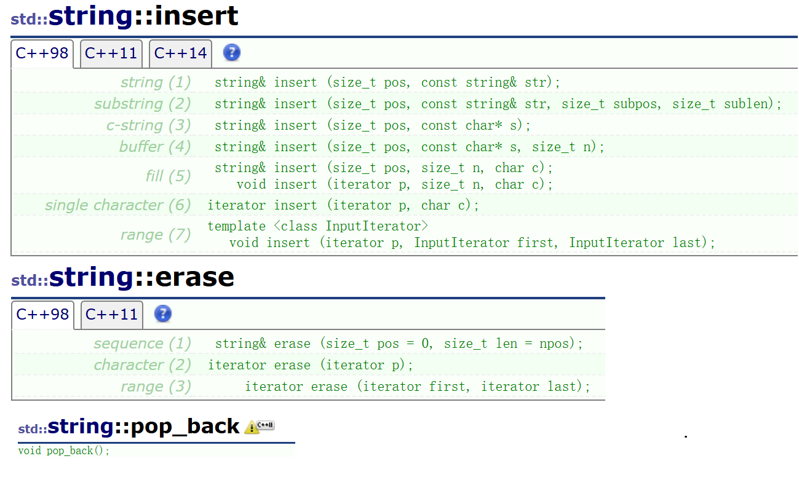

插入函数选择形参是`(size_t,string&)`的实现即可。

首先先检查容量是否支持插入新的字符。

然后下标`pos`后的字符串整体后移若干个单位，并在`pos`处插入一个字符（串）。可能涉及扩容。

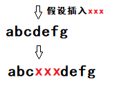

而且需要特别注意**头插和尾插**的情况。若用于表示下标的整型用的是无符号（`size_t`），则要注意在无符号数的情况下负数的情况。特别是 -1 反而是最大值的情况。


### 尾插（push_back、+=、append）

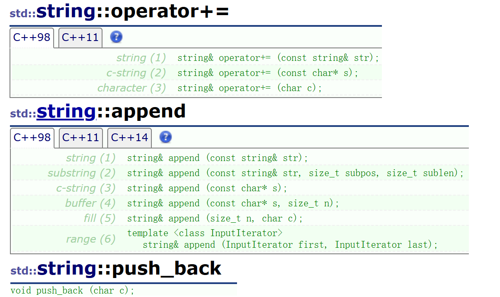

因为原版的`string`，`append`的设计和`+=`的功能重复。因此仅实现`append`和`+=`其中之一，另一个用代码复用即可。

也可以只实现`insert`，之后凡是和插入有关的都复用`insert`即可。

往字符串结尾插入字符，如果容量不够需要扩容。`push_back`是插入1个，`+=`可以插入1个，也可以插入整个字符串。

扩容需要留意`_capacity`是否为0。可以用c语言自带的`strcpy`，将`\0`顺带拷贝回去。

而且有必要的话需要提供形参为`const`的另一个版本的成员函数。


### 比较运算符重载

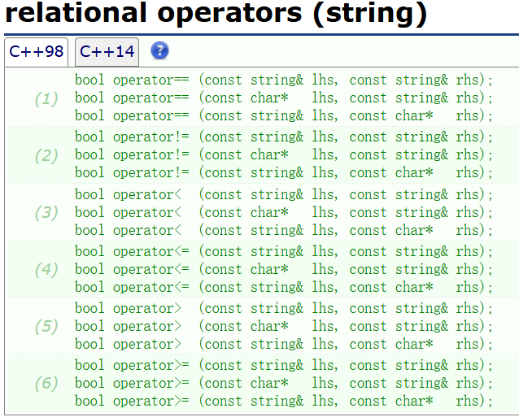

比较运算符重载有两个操作数，可以做成全局函数，将这些比较运算符设置为友元，或直接通过`operator[]`访问。

可以用c语言的库函数`strcmp`代替。但为了增强代码的独立性，尽量选择尽量不使用`c`语言自带的库函数。

而且在这个地方函数复用会很多，需要注意形参的权限。比如`const`修饰的形参不可作为实参上传给非`const`修饰的形参的函数（权限放大）。

### 删除（erase）

```cpp
string& erase(size_t pos = 0, size_t len = npos);
```

从下标`pos`开始删除长度为`len`的字符。

若`pos>=_size`则应阻止删除。

若`_size<=pos+len`（或`len==npos`），则`_str[pos]='\0'`，更新`_size`即可。

若`_size>pos+len`，则需要挪动数据并更新`size`。

### 清空（clear）

将首字符设置为空字符`\0`并修改`_size;`为0即可。

可以释放空间，但没必要。

### 流插入（operator<<）和流提取（operator>>）

这里的**流插入**不一定要写成友元。`string`还可以通过访问`operator[]`来访问数据。

若流插入的形参用`const`修饰，则流插入调用的一些相关的函数比如迭代器也需要用`const`修饰`this`。

**流提取**的形参不能用`const`修饰，因为流提取需要修改后台的数据。

输入的内容通过流提取尾插到`string`对象中，需要注意的是系统自带的流提取（`cin`和`operator`）**默认将空格和换行作为不同数据的分界**，所以需要将所有的字符包括空格和换行符也读取。

> 读取所有字符的方法：`scanf("%c",&st[i]);`、`istream::get()`、`getchar()`。
>
> 既然选择了c++，所以更推荐用`istream::get`。

在读取之前先将`string`对象**清空**（**clear**）。

流提取还可以用申请在函数作用**域内的数组优化**，将数组通过`operator+=`尾插给对象。这样做可以减少扩容次数。

### 查找（find）

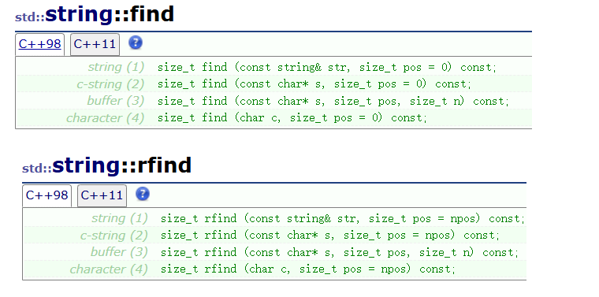

实现的时候可以用暴力查找，时间复杂度为$O(n\times m)$。如果觉得找匹配串的效率太低还可以尝试kmp算法（理论效率很高，实际效率看情况）或字符串BM算法。

如果是从某个位置开始找，则用`_str+pos`即可。

### 取字符串（substr）

```cpp
string substr (size_t pos = 0, size_t len = npos)const;
```


因为要返回临时对象，所以需要先实现拷贝构造函数。

生成临时对象，再从`*this`中取指定长度尾插给临时对象，最后返回临时对象（不能串引用返回）。

如果要取的长度为`npos`或大于`_size`，则一直取到尾即可。

取字符串的时候需要注意浅拷贝问题。

## string模拟参考程序

模拟实现时将自己的`string`放在另一个命名空间`mystd`里，这样想用库里的`string`就可以加域名`std::`，想用自己的`string`就加域名`mystd::`。

最终参考程序（无反向迭代器）的某 .h 文件：

```cpp
#pragma once
#include<cassert>
#include<iostream>
using std::ostream;
using std::istream;

namespace mystd {
    template<class T>
    void swap(T& a, T& b) {
        T tmp = a;
        a = b;
        b = tmp;
    }

    class string {
    public:
        const static size_t npos;

        //构造函数
        string(const char* s = "") {
            //求s的长度
            size_t len = 0;
            const char* tmps = s;
            while (*tmps) {
                ++len;
                ++tmps;
            }
            //初始化长度、容量等信息
            _size = len;
            _capacity = len;
            _str = new char[_capacity + 1]{ '\0' };

            //拷贝
            tmps = s;
            char* tmps2 = _str;
            while (*tmps2++ = *tmps++);
        }

        //析构函数
        ~string() {
            delete[] _str;
            _str = nullptr;
            _size = _capacity = 0;
        }

        //返回c风格字符串的地址
        const char* c_str() const {
            return _str;
        }

        //用[]进行索引访问
        char& operator[](size_t pos) {
            assert(pos < _size);
            return _str[pos];
        }
        const char& operator[](size_t pos) const {
            assert(pos < _size);
            return _str[pos];
        }

        //返回当前字符串的长度
        size_t size()const {
            return _size;
        }

        //返回容量
        size_t capacity()const {
            return _capacity;
        }

        //迭代器
        typedef char* iterator;
        typedef const char* const_iterator;

        iterator begin() {
            return _str;
        }

        iterator end() {
            return _str + _size;
        }

        const_iterator begin() const {
            return _str;
        }

        const_iterator end() const {
            return _str + _size;
        }

        //交换，独立于namespace std中的swap
        void swap(string& a) {
            //两个对象：*this,a
            mystd::swap(_str, a._str);
            mystd::swap(_size, a._size);
            mystd::swap(_capacity, a._capacity);
        }

        //拷贝构造函数
        string(const string& str)
            :_str(nullptr)//临时对象不经过构造函数会产生随机数
            , _size(0)
            , _capacity(0) {
            string tmp(str._str);//生成第2个临时对象
            mystd::string::swap(tmp);
        }

        //赋值重载：
        string& operator=(string tmp) {
            mystd::string::swap(tmp);
            return *this;
        }
        string& operator=(char c) {
            char ch[2] = { c,'\0' };
            string tmp(ch);
            mystd::string::swap(tmp);
            return *this;
        }


        //扩容
        void reserve(size_t n = 0) {
            if (n > _capacity) {
                char* tmp = new char[n + 1]{ '\0' };
                char* aa = tmp, * bb = _str;
                while (*aa++ = *bb++);
                delete[]_str;
                _str = tmp;

                _capacity = n;
            }
        }

        void resize(size_t n, char ch = '\0') {
            if (n <= _size) {
                _str[n] = '\0';
                _size = n;
                while (n < _capacity)
                    _str[n++] = '\0';
                return;
            }
            reserve(n);
            while (_size < n) {
                _str[_size] = ch;
                ++_size;
            }
        }

        //插入
        string& insert(size_t pos, const string& s) {
            assert(pos <= _size);
            reserve(_size + s._size);

            size_t end = _size - 1;
            while (end >= pos && end != -1) {
                _str[end + s._size] = _str[end];
                --end;
            }

            for (size_t i = 0; i < s._size; i++) {
                _str[pos + i] = s[i];
            }
            _size += s._size;
            return *this;
        }

        //尾插
        string& operator+=(const string& s) {
            insert(_size, s);
            _str[_size] = '\0';
            return *this;
        }

        string& operator+=(char s) {
            push_back(s);
            return *this;
        }

        void push_back(char c) {
            char ch[2] = { c,'\0' };
            insert(_size, ch);
        }

        //比较运算符重载
        bool operator==(const string& s) const {
            if (_size != s._size)
                return 0;
            for (size_t i = 0; i < s._size; i++) {
                if (_str[i] != s._str[i]) {
                    return 0;
                }
            }
            return 1;
        }

        bool operator<(const string& s) const {
            for (size_t i = 0; i < s._size && i < _size; i++) {
                if (_str[i] > s._str[i]) {
                    return 0;
                }
            }
            if (_size > s._size)
                return 0;
            return 1;
        }

        bool operator>(const string& s) const {
            return !(*this == s || *this < s);
        }
        bool operator>=(const string& s) const {
            return !(*this < s);
        }
        bool operator<=(const string& s) const {
            return !(*this > s);
        }
        bool operator!=(const string& s) const {
            return !(*this == s);
        }

        //删除
        string& erase(size_t pos = 0, size_t len = npos) {
            assert(pos < _size);
            if (len == npos || pos + len >= _size) {
                _str[pos] = '\0';
                _size = pos;
                return *this;
            }
            while (pos + len < _size) {
                _str[pos] = _str[pos + len];
                ++pos;
            }
            _str[pos] = '\0';
            _size -= len;
            return *this;
        }

        //清空
        void clear() {
            _str[0] = '\0';
            _size = 0;
        }

        //查找
        size_t find(const string& s, size_t pos = 0)const {
            for (size_t i = 0, ti; i <= _size - s._size; i++) {
                ti = i;
                for (size_t j = 0; j < s._size; j++) {
                    if (s[j] == _str[ti])
                        ++ti;
                    else
                        break;
                }
                if (ti == i + s._size)
                    return i;
            }
            return npos;
        }
        size_t find(char c, size_t pos = 0)const {
            for (size_t i = 0; i < _size; i++) {
                if (_str[i] == c)
                    return i;
            }
            return npos;
        }

        //提取片段
        string substr(size_t pos = 0, size_t len = npos)const {
            string tmp;
            if (len == npos || pos + len > _size) {
                while (tmp += _str[pos++], pos < _size);
                return tmp;
            }

            while (tmp += _str[pos++], tmp._size < len);
            return tmp;
        }

    private:
        char* _str;
        size_t _size;
        size_t _capacity;
    };
    const size_t string::npos = -1;
    ostream& operator<<(ostream& out, const string& st) {
        for (const auto& x : st)
            out << x;
        return out;
    }
    istream& operator>>(istream& in, string& s) {
        s.clear();

        char buff[129];
        size_t i = 0;

        char ch;
        //连同空格一起接收
        while (ch = in.get(), ch != ' ' && ch != '\n') {
            buff[i++] = ch;
            if (i == 128) {
                buff[i] = '\0';
                s += buff;
                i = 0;
            }
        }

        if (i != 0) {
            buff[i] = '\0';
            s += buff;
        }

        return in;
    }
}
```


