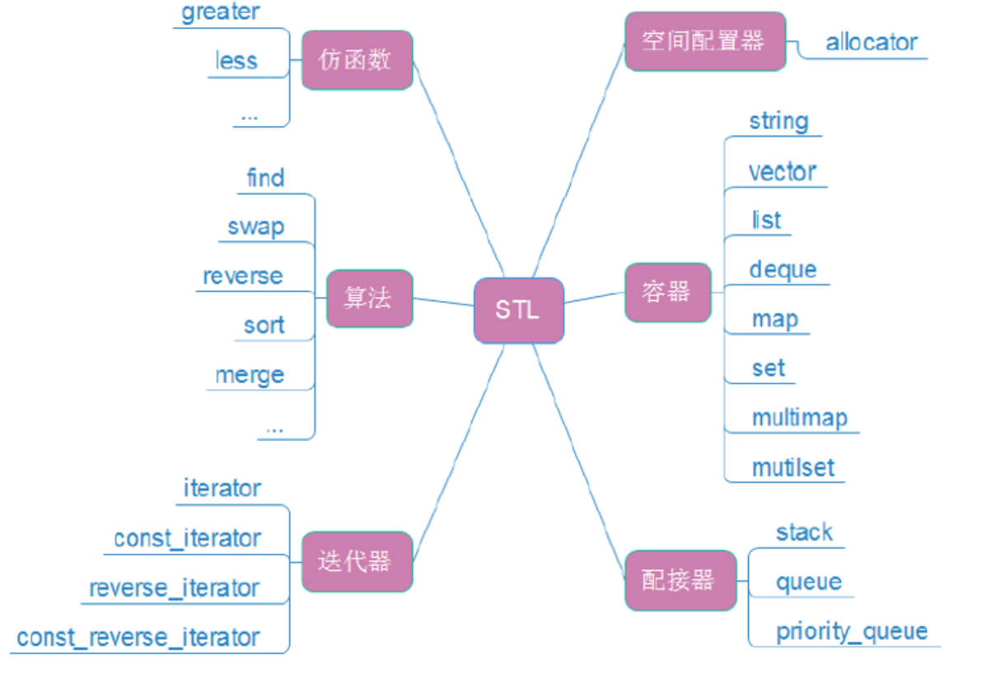
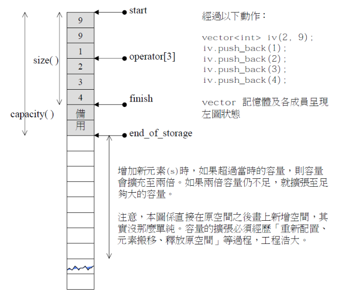
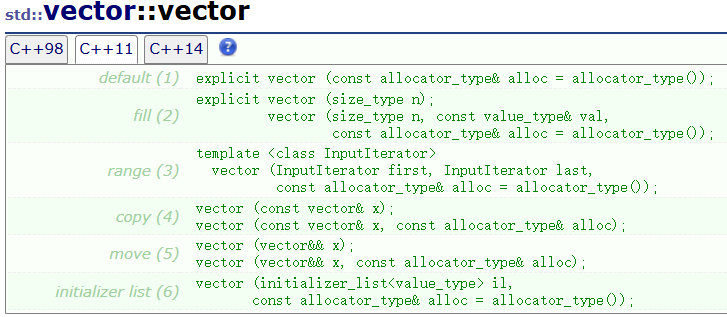
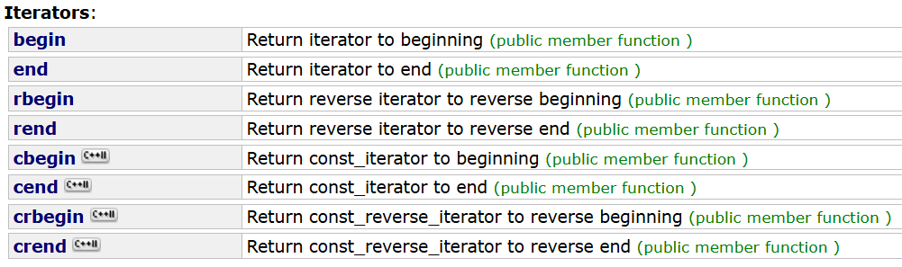
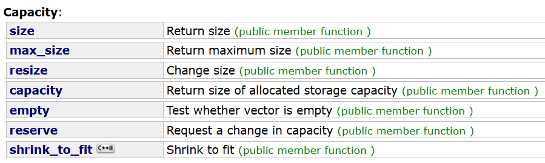
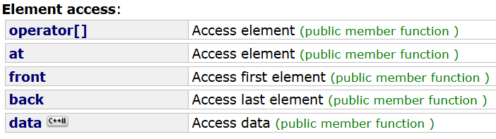
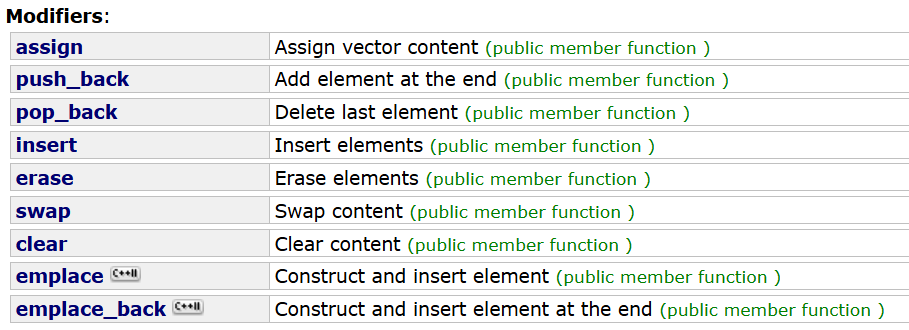
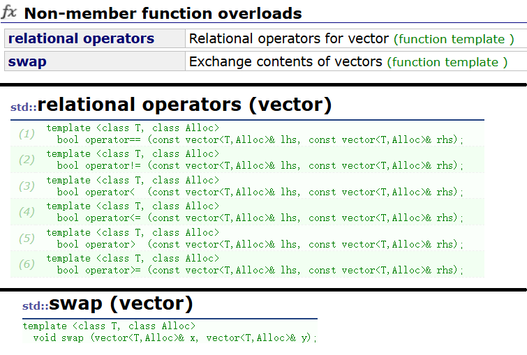

# STL简介

STL(standard template libaray-标准模板库)：是c++标准库的重要组成部分，不仅是一个可复用的组件库，而且是一个包罗数据结构与算法的软件框架。

学习STL的三个境界：

能用：熟练使用STL。

明理：能手搓STL。

能扩展 。

在大学期间最多只能到明理阶段，能扩展需要积累海量的工程代码的经验（如果是大学就开始解决现实的工程问题就可以）。

## STL版本

* 原始版本（惠普版本）
  Alexander Stepanov、Meng Lee 在**惠普实验室**完成的原始版本，本着开源精神，他们声明允许任何人任意运用、拷贝、修改、传播、商业使用这些代码，无需付费。唯一的条件就是也需要向原始版本一样做开源使用。 HP 版本--所有STL实现版本的始祖。
  惠普是一个比较有名的电脑版本，还有惠普打印机，虽然现在在国内正在慢慢被国产替代。
* P.J.版本
  由P. J. Plauger开发，继承自HP版本，被Windows Visual C++（visual studio系列产品）采用，不能公开或修改，缺陷：可读性比较低，符号命名比较怪异（vs背后的公司，微软的工程师改的）。
  现在vs的STL版本改了很多（每出一个版本的vs都进行优化），但优化的不好的地方是不允许查看后台的STL源码（可以找到vs后台的 include 目录）。
* RW版本
由Rouge Wage公司开发，继承自HP版本，被 C++ Builder 采用（这个编译器被vs占领市场，后来没落了），不能公开或修改，可读性一般。
* SGI版本
由Silicon Graphics Computer Systems，Inc公司开发，继承自HP版本。被G++(Linux)采用，可移植性好，可公开、修改甚至贩卖，从命名风格和编程风格上看，阅读性非常高。我学习STL要阅读部分源代码，主要参考的就是这个版本。
* 还有一种clang的版本，但那个是苹果公司用的。

所以用的比较多的STL有 P.J 版本，SGI版本和clang版本，其中前两种传播的比较广。

## STL的六大组件

SGI 版本的 STL 通常分为以下六大组件：



### 容器（Containers）

容器其实就是**数据结构的实例化**（容纳数据的容器的意思）。

- **序列容器**：如`vector`（动态数组）、`list`（双向链表）、`deque`（双端队列）、`array`（固定大小数组）、`forward_list`（单向链表）等，以线性排列存储数据，不自动对元素按值排序。
- **关联容器**：像`map`（键值对集合，键唯一）、`set`（元素唯一的集合）、`multimap`（键可重复的键值对集合）、`multiset`（元素可重复的集合）等，以键值对形式存储，会根据键值大小默认升序排序。

### 算法（Algorithms）

是对数据进行操作的方法，如查找、排序、复制、修改等，例如`sort`（排序）、`find`（查找）、`copy`（复制）、`for_each`（对每个元素执行操作）等函数，这些算法通过迭代器来操作容器中的元素。

### 迭代器（Iterators）

用于在容器的元素上进行遍历，是容器和算法之间的桥梁，类似于指针，支持`*`（解引用）、`->`（访问成员）、`++`（向后移动）、`--`（向前移动）、`==`（比较相等）等操作，每种容器都有自己专属的迭代器，如`begin`迭代器指向第一个元素，`end`迭代器指向最后一个元素的下一个位置。

### 仿函数（Functors）

也叫函数对象，是使一个类的使用看上去像一个函数，通过在类中实现`operator()`来实现，按照操作数个数可分为一元和二元仿函数，按功能可分为算法运算、关系运算、逻辑运算三大类，相比一般函数更灵活，有类型识别，执行速度也可能更快。

常用的仿函数常用的有`less`，重载的`operator()`的功能：`return a<b;`，以及`greater`，重载的`operator()`的功能：`return a>b;`。

例如仿函数`less`的原型：

```cpp
template <class T> 
struct less : binary_function <T,T,bool> {
    bool operator() (const T& x, const T& y) const {
        return x<y;
    }
};
```


### 适配器（配接器，Adapters）

部分资料的翻译不同，Adapters可以翻译成适配器，也可翻译成配接器。类比平时的手机充电器的对电压进行转换来适配手机，适配器是用来转换的。

适配器是间接管理数据，即在其他容器的基础上进行数据管理。例如栈`stack`、队列`queue`。

- **容器适配器**：用来扩展基本容器，与顺序容器结合构成栈、队列和优先队列容器。
- **迭代器适配器**：包括反向迭代器、插入迭代器、IO 流迭代器等。
- **函数适配器**：有函数对象适配器、成员函数适配器、普通函数适配器等，可用来修改容器、迭代器或仿函数的接口。

### 空间配置器（Allocators）

就是内存池，STL给自己专门提供的内存池。

负责管理容器的内存分配与释放，SGI-STL 的空间配置器有一级空间配置器和二级空间配置器，一级空间配置器是对 c 语言的`malloc`和`free`简单封装，二级空间配置器涉及小块内存管理，运用了内存池技术，在 SGI-STL 中默认使用二级空间配置器。

## STL的缺陷

1. STL库的更新慢。上一版靠谱是c++98，中间的c++03基本一些修订。c++11出来已经相隔了13年，STL才进一步更新。
2. STL现在都没有支持线程安全。并发环境下需要我们自己加锁。且锁的粒度是比较大的。
3. STL极度的追求效率，导致内部比较复杂。比如类型萃取，迭代器萃取。
4. STL的使用会有代码膨胀的问题，比如使用`vector<vector<vector<int> > > >`这样会生成多份代码，当然这是模板语法本身导致的。

# 序列容器vector

`vector`在感觉上就是顺序表用c++的面向对象思想和模板实现。

建议先看[c++STL-string的使用-CSDN博客](https://blog.csdn.net/m0_73693552/article/details/147881146?spm=1001.2014.3001.5501)。

## 了解vector

`vector`是STL的工具，在编译器中可以查看源码。在初学时如果查看编译器深处的源码，很容易从还没入门就入土。建议先积累代码量到一定水平再去查看源码。

如果作为水平很有限的萌新，想要看源码：

1. 先**熟悉**源码表示的**工具的功能**。
2. 看源码，先对一个类有一个**成员变量** + **成员函数**的初步认识。不能一行一行地看，而是带着已经熟悉的功能去理解。
3. 不能一上来就死磕细节而是**先学整体框架**。
4. 理解的时候连蒙带猜后再**验证猜测**（先根据英文语义理解和推测变量、函数名的含义）。 

> 现实中从事计算机相关的工作，第一件事是看别人写的代码。
>
> 大多数人其实不喜欢写注释，这就使得只能用上述的方法去猜。

某个版本的`vector`的核心成员变量（大部分）：

```cpp
template<class T, class Alloc = alloc>
class vector {
public:
    typedef T value_type;
	typedef value_type* iterator;
	typedef const value_type* const_iterator;
private:
	iterator _start;
	iterator _finish;
	iterator _endofstorage;
};
```

这个版本的`vector`可以这样猜：一次性申请整个容量的空间，之后用两个指针维护，通过指针间的运算来完成下标索引、插入、删除、修改等一系列数组的操作。



`Alloc`是STL的六大组件之一的空间配置器，本质是内存池。在学习怎么使用`vector`的阶段不用理会。后期若觉得STL给的空间配置器不合适，可以自己设计。

`vector`的很多函数和`string`有很多相似的地方。

`vector`主要参考[vector - C++ Reference](https://legacy.cplusplus.com/reference/vector/vector/?kw=vector)，这里只是做简单的翻译工作。其中很多功能和`string`类似，所以会省略部分描述。

`vector`是类模板实现，和`string`不同的是可以自己选类型。

```cpp
template < class T, class Alloc = allocator<T> >
    class vector; // generic template
```

`vector`是一个可以动态实现的顺序容器。像顺序表，不过是通过类来实现。它比`string`使用简单，准确的说比`string`设计的合理，`string`因为各种历史包袱，设置了很多功能重叠的函数。

这里的使用同样是c++98为主，c++11为辅。

## 构造函数和赋值重载

构造函数用c++11，是因为c语言支持用初始化列表来初始化数组，这个初始化的方法个人用的比较多。但c++98不支持用初始化列表初始化`vector`。

### c++11的构造函数



凡是`alloc`都是和空间配置器有关，在初学使用的阶段可以不理会。

`explicit`关键字会禁止构造函数（特别是单形参的构造函数）的隐式转换，也就是说带`explicit`的构造函数要按它给定的形参列表来调用。

```cpp
//这个相当于无参构造函数
explicit vector (const allocator_type& alloc = allocator_type());

//初始化为n个空间
explicit vector (size_type n);

//用n个val去初始化
vector (size_type n, const value_type& val,
        const allocator_type& alloc = allocator_type());

//迭代器初始化
template <class InputIterator>
  vector (InputIterator first, InputIterator last,
          const allocator_type& alloc = allocator_type());
//拷贝构造
vector (const vector& x);
vector (const vector& x, const allocator_type& alloc);

//c++11新增的模板的可变参数和右值引用的移动，初学vector不用理会
//将右值引用的vector对象的资源转移给新创建的vector对象
vector (vector&& x);
vector (vector&& x, const allocator_type& alloc);

//允许vector使用初始化列表进行初始化。例如：{1,2,3}
vector (initializer_list<value_type> il,
       const allocator_type& alloc = allocator_type());
```

构造函数初始化的应用：

```cpp
#include<iostream>
#include<vector>
using namespace std;

vector<int> f() {
    vector<int>a = { 1,2,3,4 };
    return a;
}

void f1() {
    //explicit vector (const allocator_type& alloc = allocator_type());
    vector<int>a1;//容量、数量都为0
}

void f2() {
    //explicit vector (size_type n);
    //vector(size_type n, const value_type & val,
        //const allocator_type & alloc = allocator_type());
    vector<int>a2(5);//初始化为5个空间
    vector<int>a3(6, 1);//初始化为6个1
}

void f3() {
    vector<int>a3(6, 1);//初始化为6个1

    //template <class InputIterator>
    //vector(InputIterator first, InputIterator last,
    //    const allocator_type & alloc = allocator_type());
    //只要类型匹配什么迭代器都可以，因为这里形参是模板
    //string严格来说数据不匹配，但底层有大量的隐式类型转换
    vector<int>a4(a3.begin(), a3.end());

    //哪怕是反向迭代器
    string st("Tig tap");
    vector<int>a5(st.rbegin(), st.rend());
    for (size_t i = 0; i < st.size(); i++)
        cout << a5[i] << ' ';
}

void f4() {
    vector<int>a3(6, 1);//初始化为6个1
    vector<int>a4(a3.begin(), a3.end());
    //vector(const vector & x);
    //vector(const vector & x, const allocator_type & alloc);
    vector<int>a6(a4);//拷贝构造初始化
}

void f5() {
    //vector(vector && x);
    //vector(vector && x, const allocator_type & alloc);
    //c++11新增的移动构造函数，f()的vector对象被销毁了但空间还在
    vector<int>a7 = f();
}

void f6() {
    //vector(initializer_list<value_type> il,
    //    const allocator_type & alloc = allocator_type());
    //初始化列表
    vector<int>a8 = { 1,2,3 };
    vector<int>a9({ 2,4,5,6 });
}

int main() {
    //f1();
    //f2();
    //f3();
    //f4();
    //f5();
    f6();
    return 0;
}
```

析构函数的作用还是回收空间。涉及空间置配器，这里不做研究。

### 赋值重载

```cpp
//c++98自带的用vector对象进行拷贝构造
vector& operator= (const vector& x);

//c++11新增的将右值引用的vector对象的资源转移给新创建的vector对象
vector& operator= (vector&& x);

//用初始化列表初始化
vector& operator= (initializer_list<value_type> il);
```

赋值重载的应用

```cpp
#include<iostream>
#include<vector>
using namespace std;

vector<int> f() {
    vector<int>a = { 1,2,3,4 };
    return a;
}

int main() {
    vector<int>a1 = { 1,2,3,4 };
    vector<int>a2,a3,a4;

    //vector& operator= (const vector & x);
    a2 = a1;
	
    //c++11新增
    //vector& operator= (vector&& x);
    a3 = f();

    //vector& operator= (initializer_list<value_type> il);
    //c++11新增
    a4 = { 1,2,3,4 };

    return 0;
}
```

### vector定义多维数组

`vector`的原型是一个类模板，也就是说模板的类型也可以是`vector`本身。利用这个特性，可以用哪个`vector`实现多维数组，而且每一维的长度可以不相同。

```cpp
#include<iostream>
#include<vector>
using namespace std;

int main() {
	//二维数组
    //部分编译器会将>>识别为流提取，所以习惯上给个空格隔开
    vector<vector<int> >a2;

    //二维数组用匿名对象初始化
    vector<vector<int> >a2_1(4, vector<int>(4, 0));

    //三维数组
    vector<vector<vector<int> > >b3;
    vector<vector<vector<int> > >b3_1(5,vector<vector<int> >(5,vector<int>(5)));

    return 0;
}
```

以二维数组为例，和指针数组申请的二维数组的区别：指针数组的`[]`是解引用，`vector`的`[]`是函数`operator[]`。


## 迭代器（Iterator）

`vector`同样支持迭代器访问。迭代器还是那8个，功能和`string`一样。

其他STL的迭代器也是通用的。



所以这里不过多讨论，重点介绍迭代器失效问题。

### 迭代器失效

迭代器的主要作用就是让算法能够不用关心底层数据结构，其底层实际就是一个指针，或者是对指针进行了封装，比如：`vector`的迭代器就是原生态指针`T* `。

因此迭代器失效，实际就是迭代器底层对应**指针所指向的空间被销毁**了，而**使用一块已经被释放的空间**，造成的后果是程序崩溃。即如果继续使用已经失效的迭代器，程序可能会崩溃，类似数组越界。

如果迭代器失效了，就不能再使用这个迭代器，如果使用了，结果未定义（比如，迭代器变成野指针）。

造成迭代器失效的原因：

1. 会引起其底层空间改变的操作，都有可能是迭代器失效，比如：`resize`、`reserve`、`insert`、`assign`、`push_back`等。若形参也是迭代器，则很容易出现异地扩容后（c++不用`realloc`，所以可以认为c++的扩容都是异地扩容），但形参没来的及改变。

例如：

```cpp
#include<iostream>
#include<vector>
using namespace std;

int main() {
    vector<int>a(5, 3);
    vector<int>::iterator it = a.begin()+2;
    cout << (void*)(&(*it)) << endl;
    //a.reserve(16);
    a.resize(16);
    it = a.begin() + 2;
    cout << (void*)(&(*it)) << endl;
    return 0;
}
```

结果之一：

```
0128A650
01288B30
```

同样是`begin()+2`，前后迭代器指向的地址发生了变化，若`it`不及时改变会有访问无权限的空间的风险。

2. 指定位置元素的删除操作——`erase`。

例如：

```cpp
#include<iostream>
#include<vector>
using namespace std;

int main() {
    vector<int>a(5, 3);
    vector<int>::iterator it = a.end() - 1;
    cout << (void*)(&(*it)) << endl;
    a.erase(a.end() - 1);
    it = a.end() - 1;
    cout << (void*)(&(*it)) << endl;
    return 0;
}
```

输出结果之一：

```
0064AAA8
0064AAA4
```


### 迭代器失效案例：删除数组中的偶数

最典型的应用，删除数组中的偶数。

因为`erase`删除某处的数据后，会将后续的数据整体往前挪。

```cpp
#include<iostream>
#include<vector>
using namespace std;

int main() {
	vector<int> v;
	v.push_back(1);
	v.push_back(2);
	v.push_back(3);
	v.push_back(4);
	v.push_back(5);
	//v.push_back(6);

	for (auto e : v)
		cout << e << " ";
	cout << endl;

	auto it = v.begin();
	while (it != v.end()){
		// vs2019进行强制检查，erase以后认为it失效了，不能访问，访问就报错
		if (*it % 2 == 0)
			v.erase(it);
		++it;
	}

	for (auto e : v)
		cout << e << " ";
	cout << endl;
	return 0;
}
```

首先是g++的情况。

`{1,2,3,4,5}`是正常的，但只是个巧合。

`{1,2,3,4,5,6`会崩溃，因为结尾删了之后越界（迭代器大于`end()`）。

`{2,2,3,4,5}`结果不对，会漏一个2。连续的偶数会漏。

这个还是在g++编译下，MSVC（Visual Studio 2019）会强制阻止。因为MSVC会进行强制检查（MSVC有用类去封装迭代器的指针做到强制检查），`erase`以后认为`it`失效了，不能访问，访问就报错。

> 比如`it`运行`{1,2,3,4,5}`，删除2之后，无法再`++it`，即若`erase`产生了删除迭代器的行为，但迭代器自身的值没有发生变化（哪怕是形式上的变化），MSVC都会阻止那个迭代器进行操作。
>
> 因为`erase`一次后，除了挪动数据，`_endofstorage`（表示容量的迭代器）会进行自减操作，这就使得`it>_endofstorage`。

因为之前的逻辑是在删迭代器之后，后面的数据整体向前挪动1个单位，按理说`it`不应该跳到下一个位置，但上文的代码还是跳了。

```cpp
	auto it = v.begin();
	while (it != v.end()){
		// vs2019进行强制检查，erase以后认为it失效了，不能访问，访问就报错
		if (*it % 2 == 0)
			v.erase(it);
		++it;
	}
```

所以更改底层逻辑，每次`it`做2个选择：需要删数据就接收`erase`返回的迭代器，不需要才后移。

```cpp
#include<iostream>
#include<vector>
using namespace std;

int main() {
	vector<int> v;
	v.push_back(1);
	v.push_back(2);
	v.push_back(3);
	v.push_back(4);
	v.push_back(5);
	//v.push_back(6);

	for (auto e : v)
		cout << e << " ";
	cout << endl;

	auto it = v.begin();
	while (it != v.end()) {
		// vs2019进行强制检查，erase以后认为it失效了，不能访问，访问就报错
		if (*it % 2 == 0)
			it=v.erase(it);
		else
			++it;
	}

	for (auto e : v)
		cout << e << " ";
	cout << endl;
	return 0;
}
```

与`vector`类似，`string`在插入加扩容操作，再进行`erase`之后，迭代器也会失效。

库里的`erase`和`insert`都针对迭代器失效的情况做了处理：返回被删除位置的迭代器，因此用哪个迭代器作为形参时，就需要用那个迭代器接收返回值。

## 容量（capacity）有关



```cpp
size_type size() const;
size_type max_size() const;
void resize (size_type n, value_type val = value_type());
size_type capacity() const;
bool empty() const;
void reserve (size_type n);
void shrink_to_fit()
```

根据`string`的经验，`size`返回数组的元素个数。

`max_size`返回数组能开的最大值。这个返回值没有什么参考意义，因为不同编译器的设置不同。

`capacity`返回当前的最大容量。

`empty`返回空。

`shrink_to_fit`会尝试使数组缩容至`size`。所以可以用这样的组合技：先`clear`，再`shrink_to_fit`，使得数组真正的初始化。

`resize`和`reserve`能指定数组开辟空间，`reserve`在初始化空间时不会改变`size`。`resize`在开辟空间时还支持初始化。

这些简单贴一个使用样例即可：

```cpp
#include<iostream>
#include<vector>
using namespace std;

int main() {
    vector<char>a;
    cout << a.max_size() << endl;
    cout << a.empty() << endl;
    a = { 0,1,2,3,4,5,6,7,8,9 };
    cout << a.size() << endl;
    cout << a.capacity() << endl;

    //扩容
    a.reserve(101);
    cout << a.size() << endl;
    cout << a.capacity() << endl;

    //缩容，指让capacity变得和size一样的大小
    a.shrink_to_fit();
    cout << a.size() << endl;
    cout << a.capacity() << endl;
    
    return 0;
}
```

### 面向对象的理解加深

```cpp
void resize (size_type n, value_type val = value_type());
```

`value_type`实际就是`template<class T>`中的`T`，表示数据类型。

缺省值用`T()`是因为`T`不一定是内置类型，于是用匿名对象。

`const`引用会延长匿名对像的声明周期。而且如果是`T& val=T()`，则具有常属性的匿名对象用不具有常属性的对象`val`作为别名，很明显的权限放大，编译器不给过，于是加`cosnt`。

在有了模板的概念之后，内置类型可以认为是有构造函数的。

比如：

```cpp
int a=int(3);
double b=4.0;
a=int(b);//类似c语言的强制类型转换但和类调用构造函数反而更像。
```

只有内置类型也有构造函数，逻辑上才能合理。这是c++的作者为了编译器能支持模板而设计的。

所以c++也可以理解成是万物皆对象，只是为了要支持c语言，看起来像是面向对象和面向过程的混合产物。

c语言不能用类似的`int(3)`这种功能，因为不支持。

### vector的扩容机制

通过这个代码来测试`vector`的扩容机制。

```cpp
#ifndef _CRT_SECURE_NO_WARNINGS
#define _CRT_SECURE_NO_WARNINGS 1
#endif

#include<iostream>
#include<vector>
using namespace std;

int main() {
	size_t sz;
	vector<int> v;
	sz = v.capacity();
	cout << "making v grow:" << sz << endl;;
	for (int i = 0; i < 1000; ++i) {
		v.push_back(i);
		if (sz != v.capacity()) {
			sz = v.capacity();
			cout << "capacity changed: " << sz << '\n';
		}
	}
    return 0;
}
```

MSVC（Visual Studio 2019）的运行结果：

```
making v grow:0
capacity changed: 1
capacity changed: 2
capacity changed: 3
capacity changed: 4
capacity changed: 6
capacity changed: 9
capacity changed: 13
capacity changed: 19
capacity changed: 28
capacity changed: 42
capacity changed: 63
capacity changed: 94
capacity changed: 141
capacity changed: 211
capacity changed: 316
capacity changed: 474
capacity changed: 711
capacity changed: 1066
```

g++：

```
making v grow:0
capacity changed: 1
capacity changed: 2
capacity changed: 4
capacity changed: 8
capacity changed: 16
capacity changed: 32
capacity changed: 64
capacity changed: 128
capacity changed: 256
capacity changed: 512
capacity changed: 1024
```

和`string`一样，vs2019的`vector`的扩容方式大致是原来的1.5倍（），而g++的`vector`则是原来的2倍。

### resize和reserve

这俩的区别：

```cpp
#include<iostream>
#include<vector>
using namespace std;

int main() {
	vector<int>a;
	//a.reserve(100);//用这个，空间开出来了，但size不会变化，for循环不会进
	a.resize(100);
	for (int i = 0; i < a.size(); i++)
		a[i] = i;
	for (auto& i : a)
		cout << i << ' ';
    return 0;
}
```

所以`resize`让`size`和`capacity`都变成100，而`reserve`只让`capacity`变成100。

## 元素通道（element access）



```cpp
      reference operator[] (size_type n);
const_reference operator[] (size_type n) const;

      reference at (size_type n);
const_reference at (size_type n) const;

      reference front();
const_reference front() const;

      reference back();
const_reference back() const;

//c++11新增，和string的c_str和data类似的功能
      value_type* data() noexcept;
const value_type* data() const noexcept;
```

根据`string`的经验，`operator[]`和`at`的功能都是实现类似数组的下标访问，区别是`operator[]`越界时会断言，而`at`是抛异常，而且断言在`release`下不起作用。

`front`和`back`是返回数组的首、尾元素。

`data`的作用是返回`vector`后台的数组下标。

只有`string`会提供流插入和流提取，因为设计者没有设计，而且除了字符串，大多数情况这么做没意义。

## 修改(modifiers)

`vector`作为STL里的容器，在设计上相比`string`优化很多，但依旧存在函数的功能重复。



```cpp
//对*this进行赋值
template <class InputIterator>
  void assign (InputIterator first, InputIterator last);
void assign (size_type n, const value_type& val);

//尾插、尾删
void push_back (const value_type& val);
void pop_back();

//在position插入val
iterator insert (iterator position, const value_type& val);

//在position插入n个val
void insert (iterator position, size_type n, const value_type& val);

//在position插入另一个对象的迭代器
template <class InputIterator>
    void insert (iterator position, InputIterator first, InputIterator last);

//删除指定位置的迭代器表示的
iterator erase (iterator position);
iterator erase (iterator first, iterator last);

//交换*this和x
void swap (vector& x);

//清空数组
void clear();

//在position插入直接构造的元素
template <class... Args>
iterator emplace (const_iterator position, Args&&... args);

//尾插
template <class... Args>
  void emplace_back (Args&&... args);
```

`...`是c++11的新增内容：模板的可变参数。

`Args&&`也是c++11的新增内容，是右值引用的移动语义。

这些在初学时可以不用理会，先把c++98的接口学会使用。

`emplace`、`emplace_back`和`insert`、`push_back`的功能是一样的，在部分情况后者会优于前者。对这些特殊情况有机会再谈。

使用参考：

```cpp
#include<iostream>
#include<vector>
using namespace std;
//因为使用了初始化列表，需要使用c++11标准

void print(vector<int>&a) {
    for (auto& x : a)
        cout << x << ' ';
    cout << endl;
}

void f1() {
    vector<int>a = { 0,1,2,3,4,5 };
    vector<int>b = { 1,1,4,5,1,4 };
    ////对*this进行赋值
    //template <class InputIterator>
    //void assign (InputIterator first, InputIterator last);

    //遵循左闭右开
    a.assign(b.begin(), b.begin() + 6);
    print(a);
}

void f2() {
    vector<int>a = { 0,1,2,3,4,5 };
    vector<int>b = { 1,1,4,5,1,4 };
    ////对*this进行赋值
    //void assign(size_type n, const value_type & val);

    //遵循左闭右开
    a.assign(10,6);
    print(a);
}

void f3() {
    vector<int>a = { 0,1,2,3,4,5 };
    vector<int>b = { 1,1,4,5,1,4 };

    //尾插
    //void push_back(const value_type & val);
    //void pop_back();
    b.push_back(9);
    print(b);

    //尾删
    //void pop_back();
    b.pop_back();
    print(b);
}

void f4() {
    vector<int>a = { 1,1,4,5,1,4 };
    //在position插入val
    //iterator insert(iterator position, const value_type & val);
    vector<int>::iterator it = a.insert(a.begin() + 2, 66);
    cout << *it << endl;
    print(a);

}

void f5() {
    vector<int>a = { 1,1,4,5,1,4 };
    ////在position插入n个val
    //void insert(iterator position, size_type n, const value_type & val);
    auto it = a.insert(a.begin() + 1, 9, 6);
    cout << *it << endl;
    print(a);
}

void f6() {
    vector<int>a = { 1,1,4,5,1,4 };
    vector<int>b = { 0,7,2,1 };
    ////在position插入另一个对象的迭代器
    //template <class InputIterator>
    //void insert(iterator position, InputIterator first, InputIterator last);
    auto it = a.insert(a.begin() + 2, b.begin(), b.end());
    cout << *it << endl;
    print(a);
}

void f7() {
    vector<int>a = { 1,1,4,5,1,4,0,7,2,1 };
    ////删除指定位置的迭代器表示的
    //iterator erase(iterator position);
    auto it = a.erase(a.begin() + 6);
    cout << *it << endl;
    print(a);

    //iterator erase(iterator first, iterator last);
    //删除的是闭区间
    it = a.erase(a.begin() + 6, a.begin() + 8);
    cout << *it << endl;
    print(a);
}

void f8() {
    vector<int>a = { 1,1,4,5,1,4,0,7,2,1 };
    vector<int>b = { 0,7,2,1 };
    //交换*this和x
    //void swap(vector & x);

    a.swap(b);
    print(a);

    ////清空数组
    //void clear();
    a.clear();
    cout << a.size() << endl;
    cout << a.capacity() << endl;
}

void f9() {
    vector<int>b = { 0,7,2,1 };

    //在指定迭代器构造元素，形式上和insert类似
    //template <class... Args>
    //iterator emplace(const_iterator position, Args&&... args);
    b.emplace(b.begin() + 1, 2);
    print(b);
}

void f10() {
    vector<int>b = { 0,7,2,1 };

    //结果上类似尾插
    //template <class... Args>
    //void emplace_back(Args&&... args);
    b.emplace_back(9);
    print(b);
}

int main() {
    //f1();
    //f2();
    //f3();
    //f4();
    //f5();
    //f6();
    //f7();
    //f8();
    //f9();
    f10();
    return 0;
}
```


## 非成员函数



比较运算符重载和`string`的差不多。

`swap`是为了避免不必要的深拷贝，自己写一个现成的。原理还是交换指针。

算法库`algorithm`写有一个`find`，所有带迭代器的容器都能用。区间是左闭右开。

注意到`vector`并没有设置流插入`<<`和流提取`>>`，主要是类型会变化，设置流插入也不知怎么用，通过`[]`也能访问底层。


# vector使用有关的OJ

这个说法不准确，在我的另一个专栏里有大量的使用。所以应该是小部分OJ。

## 260. 只出现一次的数字 III - 力扣

[260. 只出现一次的数字 III - 力扣（LeetCode）](https://leetcode.cn/problems/single-number-iii/)

计数排序或哈希表。这里用哈希表。

```cpp
class Solution {
public:
    vector<int> singleNumber(vector<int>& nums) {
        unordered_map<int,int>mp;//哈希表，可以用键值对map代替
        for(auto&x:nums)
            mp[x]++;
        vector<int>ans;
        for(auto&x:nums)
            if(mp[x]==1)
                ans.push_back(x);
        return ans;
    }
};
```


## 数组中出现次数超过一半的数字

[数组中出现次数超过一半的数字_牛客题霸_牛客网](https://www.nowcoder.com/practice/e8a1b01a2df14cb2b228b30ee6a92163?tpId=13&&tqId=11181&rp=1&ru=/activity/oj&qru=/ta/coding-interviews/question-ranking)

哈希表。

```cpp
class Solution {
public:
    /**
     * 代码中的类名、方法名、参数名已经指定，请勿修改，直接返回方法规定的值即可
     *
     * 
     * @param numbers int整型vector 
     * @return int整型
     */
    int MoreThanHalfNum_Solution(vector<int>& numbers) {
        // write code here
        unordered_map<int,int>mp;
        for(auto&x:numbers){
            mp[x]++;
            if(mp[x]>numbers.size()/2)
                return x;
        }
        //凑数用，不给这个nowcoder不给编译通过
        return 0;
    }
};
```

## 136. 只出现一次的数字 - 力扣

[136. 只出现一次的数字 - 力扣（LeetCode）](https://leetcode.cn/problems/single-number/description/)

无脑异或就完了，0异或任何数的结果为那个数，两个相同的数异或为0，异或支持交换律。

```cpp
class Solution {
public:
    int singleNumber(vector<int>& nums) {
        int a=0;
        for(size_t i=0;i<nums.size();i++)
            a^=nums[i];
        return a;
    }
};
```

## 118. 杨辉三角 - 力扣

[118. 杨辉三角 - 力扣（LeetCode）](https://leetcode.cn/problems/pascals-triangle/description/)

要求开每维长度都不相同的二维数组，除了需要特别注意越界访问的问题，其他的都是填格子。

```cpp
class Solution {
public:
    vector<vector<int>> generate(int numRows) {
        vector<vector<int>>a;
        for(int i=0;i<numRows;i++){
            a.push_back(vector<int>(i+1,1));
            if(i){
                for(int j=0;j<a[i].size();j++){
                    int l=j-1<0?0:a[i-1][j-1],
                    r=j>=a[i-1].size()?0:a[i-1][j];
                    a[i][j]=l+r;
                }
            }
        }
        return a;
    }
};
```


## 26. 删除有序数组中的重复项 - 力扣

[26. 删除有序数组中的重复项 - 力扣（LeetCode）](https://leetcode.cn/problems/remove-duplicates-from-sorted-array/description/)

可以用双指针，这里为了练习使用`vector`，使用`vector`自带的函数解决。

```cpp
class Solution {
public:
    int removeDuplicates(vector<int>& nums) {
        for(auto it=nums.begin();it!=nums.end();it++){
            while(it!=nums.end()-1&&*it==*(it+1))
                it=nums.erase(it);
        }
        return nums.size();
    }
};
```

## 137. 只出现一次的数字 II - 力扣

[137. 只出现一次的数字 II - 力扣（LeetCode）](https://leetcode.cn/problems/single-number-ii/description/)

从二进制的角度看，每位都是32位，因为重复的数都是3位，因此重复的数在某个bit位上贡献的1的数量肯定是3的倍数。

所以可以枚举32个bit位，若那个bit位的1的数量不是3的倍数，则说明只出现1次的那个数字在当前bit位贡献了1个1。将这些1组合起来就是只出现1次的那个数字。

```cpp
class Solution {
public:
    int singleNumber(vector<int>& nums) {
        int cnt,tmp;
        int ans=0;
        for(int i=0;i<32;i++){
            cnt=0;
            tmp=1<<i;
            for(auto&x:nums)
                if(x&tmp)
                    ++cnt;
            if(cnt%3)
                ans|=tmp;
        }
        return ans;
    }
};
```


## 17. 电话号码的字母组合 - 力扣

[17. 电话号码的字母组合 - 力扣（LeetCode）](https://leetcode.cn/problems/letter-combinations-of-a-phone-number/description/)

深度优先搜索。递归枚举数字，递归内枚举数字表示的格子。

```cpp
class Solution {
public:
    typedef vector<string> VS;
    typedef string Str;
    void dfs(VS&alp,VS&ans,Str&digits,Str&st,int dep){
        if(dep==digits.size()){
            ans.push_back(st);
            return;
        }
        size_t len=alp[digits[dep]-'0'].size();
        for(size_t i=0;i<len;i++){
            st+=alp[digits[dep]-'0'][i];
            dfs(alp,ans,digits,st,dep+1);
            if(st.size())
                st.pop_back();
        }
    }
    vector<string> letterCombinations(string digits) {
        VS alp=
        {"","","abc","def",
        "ghi","jkl","mno",
        "pqrs","tuv","wxyz"};
        VS ans;
        Str st;
        if(digits.empty())
            return ans;
        dfs(alp,ans,digits,st,0);
        return ans;
    }
};
```

