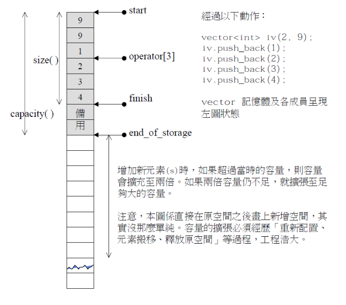

# vector的模拟实现

建议先看[c++STL-string的模拟实现-CSDN博客](https://blog.csdn.net/m0_73693552/article/details/147881347?spm=1001.2014.3001.5501)。

`string`的模拟实现用的是顺序表的模板。

这里的模拟实现模仿某个STL版本的`vector`。


## 基本信息

库中的`vector`用的是定位`new`和内存池。这里的模拟实现不涉及内存池的概念，所有信息采用1个数组表示，用原始的堆模拟内存池。

```cpp
template<class T>
class vector {
public:
	typedef T* iterator;//typedef会受到访问限定符影响
	typedef const T* const_iterator;
private:
	iterator _start;
	iterator _finish;
	iterator _endofstorage;
};
```



`vector`的很多函数和`string`类似。

模板类在类中可以不用写全类型。比如这里：

```cpp
template<class T>
class vector {
    ...
    vector f(vector& x){}
};
```

原本应该是`vector<T>`，但这里不推荐去掉。

### 构造函数

`vector`的拷贝构造需要用户实现，否则默认拷贝构造只会给浅拷贝。

这里选择三个构造函数接口进行模拟实现：

```cpp
//无参构造函数
explicit vector (const allocator_type& alloc = allocator_type());

//用n个val去初始化
vector (size_type n, const value_type& val,
        const allocator_type& alloc = allocator_type());

//迭代器初始化
template <class InputIterator>
  vector (InputIterator first, InputIterator last,
          const allocator_type& alloc = allocator_type());
```

首先将全体指针初始化为`nullptr`，然后根据构造对象用的形参填充数据。也就是说这里给出至少2个构造函数，只给指针初始化为`nullptr`的，和用指定数据填充的。

其他构造函数根据[vector - C++ Reference](https://legacy.cplusplus.com/reference/vector/vector/?kw=vector)自行实现即可。

在类里面能写模板函数。构造函数用函数模板是为了能用不同类型的迭代器初始化。但如果两个的参数类型相同，可能会自动选择最匹配的

比如：

```cpp
template<T>
class vector{
public:
    template<InputIterator>
    vector(InputIterator first,InputIterator second){
        ...
    }
    vector(size_t n, T value=T()){
        ...
    }
}

void f(){
    vector<int>a(10,0);
}
```

我们肯定希望`vector<int>a(10,0)`走的是`vector(size_t n, T value=T())`，但编译器却为它匹配了`vector(InputIterator first,InputIterator second)`。

所以针对这种情况，只能加一个`vector(int n, const T& value=T())`的函数重载。

### 析构函数

直接`delete[] _start;`即可。不用`free`是因为`T`可能是类。


### 返回容量（capacity）

返回`_endofstorage-_start`即可。


### 返回元素个数（size）

返回`_finish-_start`即可。


### 扩容（reserve和resize）

扩容时用`new`，不用`realloc`，原因是`T`可能是类，需要调用构造函数。扩容时如果初始容量为0，需要给个非0值作为初始容量。

既然不用`realloc`，那等于是每次扩容都是异地扩容，需要特别注意三个迭代器指向的空间，**防止旧空间的迭代器和新空间的迭代器进行计算**。

而且原来的数据可能不为空，所以需要将原来的数据深拷贝给新开的空间。不要用`memcpy`拷贝数据，如果自己选的数据类型是自定义类型，会导致深层次的浅拷贝问题导致错误初始化。

> 即扩容时因为是异地扩容，所以需要将之前的数据拷贝到新数组，用`memcpy`的话只会将原数组存储的地址拷贝到新数组而不会调用构造函数，实际它们管理的还是原来的空间，当释放就空间时，新数组存储的地址就无效。
>
> 所以需要用循环来深拷贝。
>
> 除非使用计数变量，或知道数据的位置。

`reserve`：

判断是否有扩容的必要，即请求的容量大于初始容量时才进行扩容。

1. 对象刚创建，经过构造函数初始化列表后指针全体为`nullptr`。这里给1个初始空间，实际上给不给都无所谓。
2. 对象并非刚创建。则`_start`非空，需要将原来的数据拷贝给现在的数据，同时容量按2倍增速扩大。

`resize`：

`resize`是在`reserve`的基础上将数据初始化为指定内容，在初始化时允许改变`_finish`的值。

### 访问（[]）

返回具体下标即可。

需要加两个，一个可读可写，一个只读。


### 迭代器（**iterator**）

初学时用指针实现即可。

`begin()`和`end()`要给两个版本：只读（加`const`修饰）和可读可写。


### 尾插（push_back）

* 插入前先检查是否需要扩容。扩容后尾指针赋值并自增1即可。
* 或先实现插入（`insert`），调用`insert`间接实现即可。

和`string`不同，因为用的是迭代器而不是`size_t`，指针几乎不可能是0，所以头插可以不用特别注意。

但`vector`的形参用的迭代器，一旦发生扩容，形参表示的**迭代器会失效**。所以需要**记录偏移量**，方便调整。

迭代器实参不能用引用，因为形参可能是函数。

### 插入（insert）

单个元素的插入：

* 插入前先判断插入的位置是否在两个指针之间，在的话再尝试扩容，否则越界访问。
* 之后挪动数据，将数据插入后，尾指针自增1。

多个元素的插入：

* 插入前先判断插入的位置是否在两个指针之间，在的话再尝试扩容，否则越界访问。
* 之后挪动合适数量的数据，将数据插入后，调整尾指针。

但无论是哪个，都要返回迭代器，防止迭代器失效的问题。

原容器没有指定下标插入，这里为了方便使用了下标标记。


### 删除（erase）

```cpp
//删除指定位置的迭代器表示的
iterator erase (iterator position);
iterator erase (iterator first, iterator last);
```


需要先检查数组中是否还有元素。

后通过挪动数据覆盖即可。每次挪动完成后将尾指针自减。

迭代器实参不能用引用，因为形参可能是函数。

而且`erase`同样有可能使迭代器失效。

### 拷贝构造

形参为引用。

当调用拷贝构造时，编译器生成一个新的临时对象，用形参的引用对象的数据赋值给新的临时对象。

因此拷贝构造函数需要进行深拷贝。

### 交换（swap）

因为是一个用三个指针指向空间的不同位置来实现，所以交换两个对象，交换它们的三个指针即可。

### 赋值重载（operator=）

```cpp
//c++98自带的用vector对象进行拷贝构造
vector& operator= (const vector& x);
```

赋值重载的形参不用引用，使传参过程中会调用拷贝构造来生成形参的临时对象。

之后形参的临时对象和`*this`，两个对象交换（`swap`）成员指针即可，临时对象变成了`*this`，并以`*this`的面目活下去，而原`*this`变成了临时对象调用析构函数。

## 参考程序

```cpp
#pragma once
#include<cassert>

namespace mystd {
	template<class T>
	void swap(T& a, T& b) {
		T tmp = a;
		a = b;
		b = tmp;
	}

	template<class T>
	class vector {
	public:
		typedef T* iterator;
		typedef const T* const_iterator;

		//构造函数
		vector<T>()
			:_start(nullptr)
			, _finish(nullptr)
			, _endofstorage(nullptr)
		{}

		vector<T>(size_t n, const T& val = T())
			: _start(nullptr)
			, _finish(nullptr)
			, _endofstorage(nullptr) {
			reserve(n);
			_finish = _start + n;
			for (size_t i = 0; i < n; i++) {
				_start[i] = val;
			}
		}

		//析构函数
		~vector<T>() {
			delete[]_start;
			_start = _finish = _endofstorage = nullptr;
		}

		//获取容量信息
		size_t capacity() const {
			return _endofstorage - _start;
		}

		//获取数量
		size_t size() const {
			return _finish - _start;
		}

		//扩容
		void reserve(size_t n) {
			while (n > capacity()) {
				size_t sz = size();
				size_t new_c = capacity();
				new_c = new_c == 0 ? n : new_c * 2;

				T* tmp = new T[new_c]{ T() };
				if (_start != nullptr) {
					for (size_t i = 0; i < sz; i++) {
						tmp[i] = _start[i];
					}
				}

				_start = tmp;
				_finish = tmp + sz;
				_endofstorage = tmp + new_c;
			}
		}

		void resize(size_t n, const T& val) {
			reserve(n);
			for (size_t i = size(); i < n; i++)
				_start[i] = val;
			_finish = _start + n;
		}

		//访问
		T& operator[](size_t pos) {
			assert(pos < size());
			return _start[pos];
		}
		const T& operator[](size_t pos) const {
			assert(pos < size());
			return _start[pos];
		}

		//迭代器
		iterator begin() {
			return _start;
		}

		iterator end() {
			return _finish;
		}

		const_iterator begin() const {
			return _start;
		}

		const_iterator end() const {
			return _finish;
		}

		//插入
		//单个元素
		iterator insert(iterator pos, const T& val) {
			assert(pos >= begin());
			assert(pos <= end());
			size_t sz = pos - begin();//计算偏移量
			reserve(size() + 1);
			pos = begin() + sz;

			auto End = end();
			while (End > pos) {
				*End = *(End - 1);
				--End;
			}
			*End = val;
			_finish++;
			return pos;
		}


		//尾插
		void push_back(const T& val) {
			insert(end(), val);
		}

		//删除
		//删除指定迭代器
		iterator erase(iterator pos) {
			assert(pos >= begin());
			assert(pos < end());
			auto tmp = pos;
			while (tmp < _finish) {
				*tmp = *(tmp + 1);
				++tmp;
			}
			--_finish;
			return pos;
		}

		//删除区域的迭代器
		//左闭右开
		iterator erase(iterator Begin, iterator End) {
			assert(Begin >= begin());
			assert(End <= end());
			assert(Begin <= End);

			size_t sz = size_t(End - Begin);
			iterator tmp = Begin;
			while (tmp + sz < end()) {
				*tmp = *(tmp + sz);
				++tmp;
			}
			_finish = tmp;
			return Begin;
		}

		//尾删
		void pop_back() {
			erase(end() - 1);
		}

		//拷贝构造
		vector<T>(const vector<T>& a)
			:_start(nullptr)
			, _finish(nullptr)
			, _endofstorage(nullptr) {
			reserve(capacity());
			for (auto& x : a)
				push_back(x);
		}

		//交换
		void swap(vector<T>& b) {
			vector<T>& a = *this;
			mystd::swap(a._start, b._start);
			mystd::swap(a._finish, b._finish);
			mystd::swap(a._endofstorage, b._endofstorage);

		}

		//赋值重载
		vector<T>& operator=(vector<T> tmp) {
			swap(tmp);
			return *this;
		}

	private:
		iterator _start;
		iterator _finish;
		iterator _endofstorage;
	};
}
```