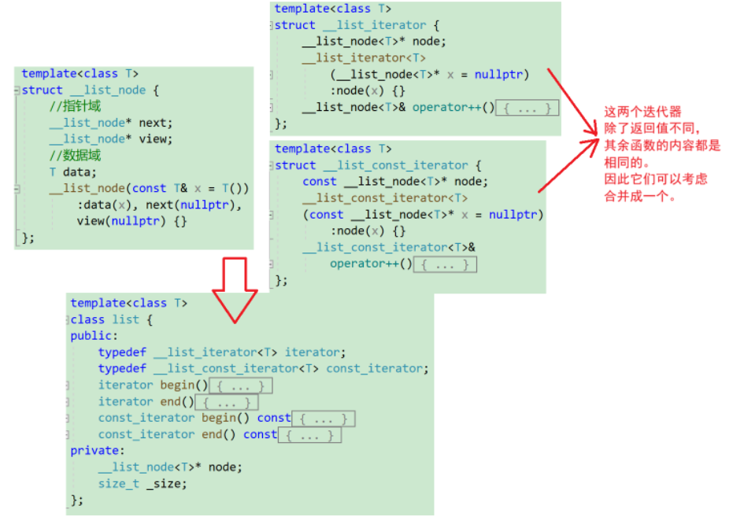
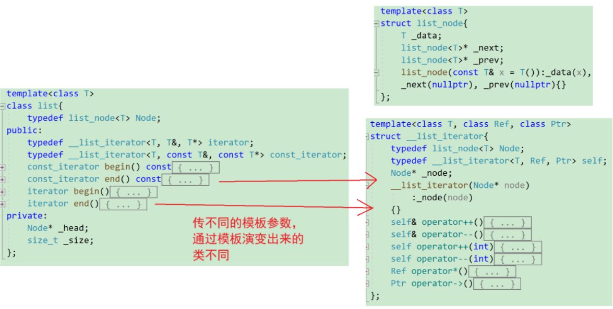
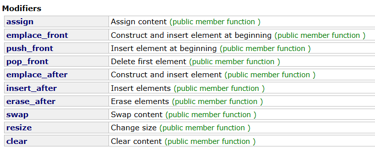
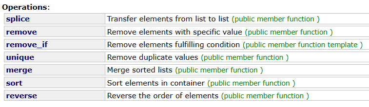
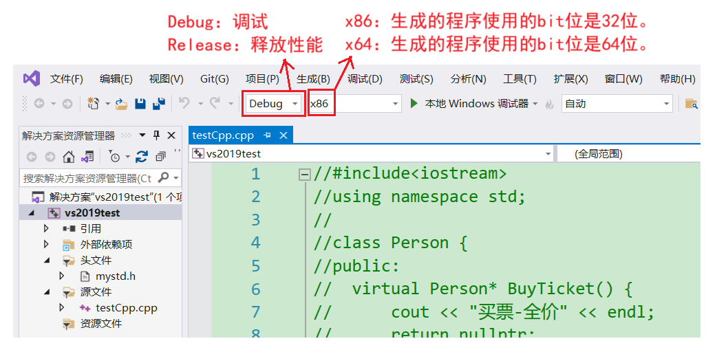
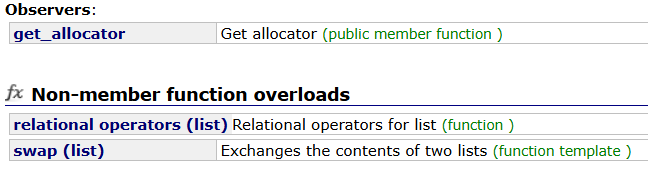

# 序列容器list

建议先看[c++STL-string的使用-CSDN博客](https://blog.csdn.net/m0_73693552/article/details/147881146?spm=1001.2014.3001.5501)和[c++STL-string的模拟实现-CSDN博客](https://blog.csdn.net/m0_73693552/article/details/147881347?spm=1001.2014.3001.5501)。

`list`是序列式容器的一种，底层是[带头双向循环链表](https://blog.csdn.net/m0_73693552/article/details/143253733)。这个结构的链表也是很多链表的参考。

原型：

```cpp
template < class T, class Alloc = allocator<T> >
    class list;
```

`list`是可以在时间复杂度为$O(1)$内在任意位置进行插入和删除的**序列式容器**，并且该容器可以前后双向迭代。

`list`的底层是**双向链表结构**，双向链表中每个元素存储在互不相关的独立节点中，在节点中通过指针指向其前一个元素和后一个元素。

除了带头双向循环链表，STL还有单链表`forward_list`。`list`与`forward_list`非常相似：最主要的不同在于`forward_list`是单链表，只能朝前迭代，已让其更简单高效。

`list`和`forward_list`不支持任意位置的随机访问，比如：要访问`list`的第6个元素，必须从已知的位置（比如头部或者尾部）迭代到该位置，在这段位置上迭代需要线性的时间开销；`list`还需要一些额外的空间，以保存每个节点的相关联信息。

和`string`、`vector`一样，简单看看`list`的使用即可开始模拟实现。同样是c++98为主，c++11为辅。

## 构造函数

个人觉得比较好用的构造函数：

```cpp
explicit list (const allocator_type& alloc = allocator_type());
explicit list (size_type n, const value_type& val = value_type(),
                const allocator_type& alloc = allocator_type());
template <class InputIterator>
  list (InputIterator first, InputIterator last,
         const allocator_type& alloc = allocator_type());
list (const list& x);

//初始化列表需要编译器支持c++11
list (initializer_list<value_type> il,
       const allocator_type& alloc = allocator_type());
```

凡是`alloc`都是和空间配置器有关，在初学使用的阶段可以不理会。

`explicit`关键字会禁止构造函数（特别是单形参的构造函数）的隐式转换，也就是说带`explicit`的构造函数要按它给定的形参列表来调用。

简单使用：

```cpp
#include<iostream>
#include<list>
using namespace std;

void print(list<int>& a) {
	for (auto& x : a)
		cout << x << ' ';
	cout << endl;
}

void f1() {
	//explicit list (const allocator_type& alloc = allocator_type());
	//可以理解为什么参数都不用给
	list<int>a;
}

void f2() {
	//explicit list (size_type n, const value_type& val = value_type(),
	//const allocator_type& alloc = allocator_type());
	//用n个数据val初始化list
	list<int>b(3, 6);
	print(b);
}

void f3() {
	//template <class InputIterator>
	//list(InputIterator first, InputIterator last,
	//	const allocator_type & alloc = allocator_type());
	//迭代器初始化
	list<int>b(3, 6);
	list<int>c(b.begin(), b.end());
	print(c);
}

void f4() {
	////初始化列表需要编译器支持c++11
	//list(initializer_list<value_type> il,
	//	const allocator_type & alloc = allocator_type());
	list<int>d{ 0,1,2,3,4,5 };
	list<int>e = { 0,1,2,3 };
	print(d);
}

int main() {
	//f1();
	//f2();
	//f3();
	f4();
	return 0;
}
```

## 析构函数

`list`的结点不连续，因此先释放非哨兵卫结点的内存，再释放哨兵卫结点。

## 赋值重载

```cpp
list& operator= (const list& x);

//初始化链表需要编译器支持c++11
list& operator= (initializer_list<value_type> il);
```

简单使用：

```cpp
#include<iostream>
#include<list>
using namespace std;

void print(list<int>& a) {
	for (auto& x : a)
		cout << x << ' ';
	cout << endl;
}

void f1() {
	list<int>a = { 1,1,4,5,1,4 };
	list<int>b;
	b = a;
	print(b);
}

void f2() {
	list<int>a;
	a = { 0,7,2,1 };
	print(a);
}

int main() {
	//f1();
	f2();
	return 0;
}
```

## 细说STL的迭代器（Iterator）

`list`还是那几个迭代器，但迭代器的内容和以往有很大的不同。

```cpp
      iterator begin() noexcept;
const_iterator begin() const noexcept;
      iterator end() noexcept;
const_iterator end() const noexcept;
      reverse_iterator rbegin() noexcept;
const_reverse_iterator rbegin() const noexcept;
      reverse_iterator rend() nothrow;
const_reverse_iterator rend() const nothrow;
//带c的迭代器加了const关键字进行修饰，需要编译器支持c++11
const_iterator cbegin() const noexcept;
const_iterator cend() const noexcept;
const_reverse_iterator crbegin() const noexcept;
const_reverse_iterator crend() const noexcept;
```

`list`的迭代器不再是原生指针，而是和`list`类伴生的类。

STL和`string`的迭代器的分类：

* 迭代器在功能上有分类：

1. 正向。
2. 反向。
3. `const`。

* 迭代器在性质上分类（由容器的底层实现决定）：

1. 单向：特点是只支持`++`。经典的有单链表（`forward_list`）、哈希表（`unordered_map`）的迭代器。
2. 双向：特点是除了支持`++`，还支持`--`。经典的有这次的双向链表（`list`）、红黑树（`map`和`set`）。
3. 随机：特点是支持`++`、`--`、`+`、`-`，经典的有`vector`，`string`，双端队列`deque`。

随机迭代器算一种双向迭代器。前者有的特征后者没有。

双向是一种特殊的单向。`vector`支持算法库里的随机迭代器和双向迭代器，这些迭代器之间是类的继承关系。


库里有的函数，需要容器内的工具支持某种特定的迭代器才能使用。

例如`list`自带的赋值函数`assign`，`InputIterator`指的就是单向迭代器。

```cpp
template <class InputIterator>
  void assign (InputIterator first, InputIterator last);
```

例如算法库（`algorithm`）的`sort`，`RandomAccessIterator`指的就是随机迭代器。

```cpp
template <class RandomAccessIterator>
  void sort (RandomAccessIterator first, RandomAccessIterator last);
template <class RandomAccessIterator, class Compare>
  void sort (RandomAccessIterator first, RandomAccessIterator last, Compare comp);
```

再例如`list`自带的成员函数`unique`，`BinaryPredicate`指的就是双向迭代器。

```cpp
template <class BinaryPredicate>
  void unique (BinaryPredicate binary_pred);
```


### list的迭代器

`list`因为底层的数据结构是双向循环链表，因此迭代器必不可能用原生指针代替。因为结点的含义丰富，例如解引用`*`能访问的数据有前驱、后继和数据，需要支持`++`后跳转到下一结点、`--`后跳转到前一个结点等功能。

因此`list`的迭代器至少是个结构体（类），才能重载如此丰富的功能。

而且迭代器最重要的作用是封装，屏蔽底层差异和实现细节，提供了统一的访问修改方式。比如链表、数组、二叉树、哈希表等，无论底层的数据结构再怎么复杂，都能用统一的迭代器完整遍历。

`list`的迭代器模拟指针的行为。但若使用自定义类型的链表，`->`会有两个，编译器不做处理的话会有2个，处理后只有1个。这点在模拟实现时会特别说明。

### 用模板简化const修饰的迭代器

迭代器是模拟指针，通过对迭代器解引用可得到数据。

普通迭代器是可读可写，`const`修饰的迭代器是只读。

> 且不能对迭代器对象本身加`const`修饰，这样迭代器不能修改，而迭代器还要完成遍历的功能。即迭代器对象的类型须是`const T*`，不能是`T* const`。
>
> 所以只读迭代器是`typedef const T* const_iterator;`。这样，只读迭代器和原始迭代器又是不同的类型，需要加单独的类。
>
> 且`*`和`->`两个解引用都有可能修改迭代器指向的内容，因此对只读迭代器，需要对`this`加`const`修饰，并将原结点的指针强制转化成`const T*`再返回。

但若是加`const`和不加`const`的迭代器都来一份，则会显得代码很冗余。例如这里的两个迭代器类，它们之间的成员函数除了返回值几乎都是一样的。



同一个类模板，只要实例化的参数不同，就是完全不同的类型。

因此可以通过两个不同的模板参数`{T,T&,T*}`和`{T,const T&,const T*}`来区分`iterator`和`const_iterator`。`list`底层的迭代器就是这样设计的：

```cpp
template<class T, class Ref, class Ptr>
struct __list_iterator {
	typedef __list_iterator<T, T&, T*>             iterator;
	typedef __list_iterator<T, const T&, const T*> const_iterator;
	typedef __list_iterator<T, Ref, Ptr>           self;
//...这里截取库中的一部分
	typedef Ptr pointer;
	typedef Ref reference;
    
	reference operator*() const { return (*node).data; }
//...
	pointer operator->() const { return &(operator*()); }
    //...
};

template <class T, class Alloc = alloc>
class list {
public:
	//...
	typedef __list_iterator<T, T&, T*>             iterator;
	typedef __list_iterator<T, const T&, const T*> const_iterator;
	//...
	iterator begin() { return (link_type)((*node).next); }
	const_iterator begin() const { return (link_type)((*node).next); }
	iterator end() { return node; }
	const_iterator end() const { return node; }
};
```

`Ref`是`reference`也就是引用的缩写，另一个`Ptr`是`point`也就是指针的缩写。

`iterator`和`const_iterator`的模板参数不同，不是同一类型。在使用迭代器时，`list`会上传不同的模板参数，生成两个不同的迭代器类，这样就实现了同一个迭代器类根据模板参数演变成两种不同的类。




## 容量（Capacity）

`list`的和容量有关的成员函数只有2个。

```cpp
bool empty() const noexcept;
size_type max_size () const noexcept;
```

根据`string`的经验，很容易了解到它们的功能：`empty`用于表示`list`是否为空，`max_size`用于表示能申请的结点的最大值。

简单使用：

```cpp
#include<iostream>
#include<list>
using namespace std;

int main() {
	list<int>a;
	cout << a.empty() << endl;
	//生成匿名对象调用成员函数
	cout << list<int>().max_size() << endl;
	cout << list<char>().max_size() << endl;
	return 0;
}
```

在x86（32位）环境下输出（测试环境：Devcpp5.11、MSVC）：

```cpp
1
357913941
357913941
```

在x64（64位）环境下输出：

```cpp
1
768614336404564650
768614336404564650
```

说明`list`能申请的最大结点数和类型无关，和编译环境有关。

## 元素通道（Element access）

```cpp
      reference front();
const_reference front() const;
      reference back();
const_reference back() const;
```

`reference`在某个版本的STL中的定义：

```cpp
template <class T, class Alloc = alloc>
class list {
    //...
    typedef T value_type;
    typedef value_type& reference;
    typedef const value_type& const_reference;
    //...
}
```

所以`reference`就是结点的数据域的引用。

简单使用`front`和`back`：

```cpp
#include<iostream>
#include<list>
using namespace std;

int main() {
	list<int>a = { 1,1,4,5,1,4,0,7,2 };
	cout << a.front()<<endl;//输出1
	cout << a.back()<<endl;//输出2
	return 0;
}
```

链表的遍历可以支持下标访问，但效率会特别慢，这个是由链表的性质决定。

## 修改（Modifiers）



可以根据`string`的迭代器来猜测它们的作用：

### assign 赋值

`assign`是赋值，需要编译器支持c++11。

```cpp
#include<iostream>
#include<list>
#include<string>
using namespace std;

void f1() {
	list<int>a;
	string st = "Railgun";

	//template <class InputIterator>
	//void assign(InputIterator first, InputIterator last);
	a.assign(st.begin(), st.end());
	for (auto& x : a)
		cout << x << ' ';
}

void f2() {
	list<int>a;
	//void assign (size_type n, const value_type& val);
	a.assign(3,6);
	for (auto& x : a)
		cout << x << ' ';
}

void f3() {
	list<int>a;

	//赋值初始化列表
	//void assign (initializer_list<value_type> il);
	a.assign({2,0,2,5,5,6});
	for (auto& x : a)
		cout << x << ' ';
}

int main() {
	//f1();
	//f2();
	f3();
	return 0;
}
```

### 头插 push_front、emplace_front

```cpp
template <class... Args>
  void emplace_front (Args&&... args);
void push_front (const value_type& val);
void push_front (value_type&& val);
```

在初学阶段暂时将它们当成单结点的头插使用。

`emplace_front`需要编译器支持c++11。

```cpp
#include<iostream>
#include<list>
using namespace std;

void f1() {
	list<int>a;
	a.push_front(1);
	a.push_front(2);
	a.emplace_front(3);
	for (auto& x : a)
		cout << x << ' ';
	cout << endl;
}

int main() {
	f1();
	return 0;
}
```

### 尾插 push_back、emplace_back

```cpp
void push_back (const value_type& val);
//以下函数需要编译器支持c++11
void push_back (value_type&& val);
template <class... Args>
  void emplace_back (Args&&... args);
```

在初学阶段暂时将它们当成单结点的尾插使用。

`emplace_back`需要编译器支持c++11。

```cpp
#include<iostream>
#include<list>
using namespace std;

void f1() {
	list<int>a;
	a.emplace_back(1);
	a.push_back(2);
	a.push_back(3);
	for (auto& x : a)
		cout << x << ' ';
	cout << endl;
}

int main() {
	f1();
	return 0;
}
```

### 头删pop_front和尾删pop_back

```cpp
void pop_front();
void pop_back();
```

双向链表的头删、尾删。

```cpp
#include<iostream>
#include<list>
using namespace std;

void f1() {
	list<int>a = { 0,1,2,3,4,5,6 };
	a.pop_back();
	for (auto& x : a)
		cout << x << ' ';
	cout << endl;
	a.pop_front();
	for (auto& x : a)
		cout << x << ' ';
	cout << endl;
}

int main() {
	f1();
	return 0;
}
```

### 指定插入 emplace和insert

```cpp
iterator insert (iterator position, const value_type& val);
    void insert (iterator position, size_type n, const value_type& val);
template <class InputIterator>
    void insert (iterator position, InputIterator first, InputIterator last);

//以下函数需要编译器支持c++11
iterator insert (const_iterator position, initializer_list<value_type> il);
template <class... Args>
  iterator emplace (const_iterator position, Args&&... args);
```

使用：

```cpp
#include<iostream>
#include<list>
#include<vector>
using namespace std;

void print(list<int>& a) {
	for (auto& x : a)
		cout << x << ' ';
	cout << endl;
}

void f1() {
	list<int>a = { 0,1,2,3,4,5,6 };
	//iterator insert (iterator position, const value_type& val);
	//list的迭代器不支持 + 整数
	auto it = a.insert(++a.begin(), 99);
	cout << *it << endl;
	print(a);
}

void f2() {
	list<int>a = { 0,1,2,3,4,5,6 };
	//iterator insert (iterator position, const value_type& val);
	//list的迭代器不支持 + 整数
	auto it = a.insert(++a.begin(), 3,99);
	cout << *it << endl;//insert返回被插入的位置的迭代器
	print(a);
}

void f3() {
	list<int>a = { 0,1,2,3,4,5,6 };
	vector<int>x = { 0,1,1,4,5,1,4 };
	int y[] = { 0,7,2,1 };
	//template <class InputIterator>
	//void insert(iterator position, InputIterator first, InputIterator last);
	auto it = a.begin();
	for (int i = 0; i < 3; i++)
		++it;
	a.insert(it, x.begin(), x.end());
	print(a);
	//静态数组的指针也能当迭代器使用
	a.insert(it, y, y + 4);
	print(a);
}

void f4() {
	list<int>a = { 0,1,2,3,4,5,6 };
	//iterator insert(const_iterator position, initializer_list<value_type> il);
	auto it = a.begin();
	for (int i = 0; i < 5; i++)
		++it;
	a.insert(it, {3,1,4,1,5,9});
	print(a);
}

void f5() {
	list<int>a = { 0,1,2,3,4,5,6 };
	//template <class... Args>
	//iterator emplace(const_iterator position, Args&&... args);
	auto it = a.begin();
	for (int i = 0; i < 4; i++)
		++it;
	a.emplace(it, 9);
	print(a);
}

int main() {
	//f1();
	//f2();
	//f3();
	//f4();
	f5();
	return 0;
}
```

### 删除erase、交换swap、清空clear

这些无论哪个标准，使用方式都是一样的。

```cpp
iterator erase (const_iterator position);
iterator erase (const_iterator first, const_iterator last);

void swap (list& x);

void clear() noexcept;
```

使用：

```cpp
#include<iostream>
#include<list>
#include<vector>
using namespace std;

void print(list<int>& a) {
	for (auto& x : a)
		cout << x << ' ';
	cout << endl;
}

void f1() {
	list<int>a = { 0,1,2,3,4,5,6 };
	auto it = ++a.begin();
	for (int i = 0; i < 3; i++)
		++it;

	//iterator erase (const_iterator position);
	//删除指定迭代器表示的结点
	//erase会导致迭代器失效，需要重新赋值
	it=a.erase(it);
	print(a);

	//iterator erase (const_iterator first, const_iterator last);
	//删除指定迭代器表示的结点
	it=a.erase(a.begin(),it);
	print(a);
}

void f2() {
	list<int>a = { 0,1,2,3 };
	list<int>b = { 0,7,2,1 };
	//void swap (list& x);
	print(a);
	a.swap(b);
	print(a);

	//void clear() noexcept;
	b.clear();
	print(b);//打印不出东西，因为已经被清空的只剩哨兵卫结点
}

int main() {
	//f1();
	f2();
	return 0;
}
```

### resize

```cpp
void resize (size_type n, const value_type& val);

//这个需要编译器支持c++11
void resize (size_type n);
```

相比于`string`和`vector`的`resize`。`list`的`resize`是再次插入结点，因此放在了`modified`。

使用：

```cpp
#include<iostream>
#include<list>
#include<vector>
using namespace std;

void print(list<int>& a) {
	for (auto& x : a)
		cout << x << ' ';
	cout << endl;
}

void f1() {
	list<int>a = { 0,1,2,3,4,5,6 };

	//void resize (size_type n, const value_type& val);
	//相当于扩容，用val填充
	print(a);
	a.resize(9, 9);
	print(a);
	//缩容时第2个形参无用
	a.resize(5, 6);
	print(a);

	//这个需要编译器支持c++11
	// 啥都不填默认填充0
	//void resize(size_type n);
	a.resize(15);
	print(a);
}

int main() {
	f1();
	return 0;
}
```

## 操作Operations



这些函数相比于`vector`和`string`多了很多新东西。

### sort

最适合链表的排序算法是归并排序。因此`list`的`sort`的底层是归并排序。

```cpp
void sort();
template <class Compare>
  void sort (Compare comp);
```

链表的`sort`默认支持升序。内部有默认升序的仿函数（STL的六大组件）。比如升序用的仿函数是`less`，降序是`greater`。

但这个`sort`因为链表的空间访问的原因（指结点交换方式），使得效率很低，完全可以将链表中的数据**提取到数组**中，对**数组排序后再插入回链表**，比直接调用这个成员函数要快。

而且算法库的`sort`是随机迭代器，`list`的迭代器不支持，因此不能用算法库里的`sort`对`list`进行排序。

但无论是什么原因，都使得这个成员函数很少用。

`debug`性能下，递归、循环会加很多调试信息，很多优化也没开。因此测试性能最好还是在`release`下。



### 转移splice、移除remove、remove_if

```cpp
void splice (const_iterator position, list& x);

void splice (const_iterator position, list& x, const_iterator i);

void splice (const_iterator position, list& x,
             const_iterator first, const_iterator last);
void remove (const value_type& val);
template <class Predicate>
  void remove_if (Predicate pred);

//以下函数需要编译器支持c++11
void splice (const_iterator position, list&& x);
void splice (const_iterator position, list&& x, const_iterator i);
void splice (const_iterator position, list&& x,
             const_iterator first, const_iterator last);
```

`splice`有结合、粘贴的意思，但在`list`中的应用却是转移，即将另一个链表的一部分转移到当前链表之前。

`list`自带`remove`是去除指定值的结点。涉及仿函数的问题。`remove`不上传形参，啥都不做。

`remove_if`则是满足`pred`的结点会被移除。`pred`可以是仿函数，可以是回调函数。

使用：

```cpp
#include<iostream>
#include<list>
#include<vector>
using namespace std;

void print(list<int>& a) {
	for (auto& x : a)
		cout << x << ' ';
	cout << endl;
}

void f1() {
	list<int>a = { 0,1,1,2,3,4,3,5,6,7,7,8,8,8,8,8,9 };
	list<int>b = { 3,14,1,5 };

	//void splice (const_iterator position, list& x);
	//将x内嵌到a中指定位置
	a.splice(++a.begin(), b);
	print(a);
	print(b);//b内的结点被转移

	b = { 2,71,8,2,8 };

	//void splice (const_iterator position, list& x, const_iterator i);
	//将x中指定迭代器表示的结点移动到主链中
	a.splice(++a.begin(), b, ++b.begin());
	print(a);
	print(b);

	//void splice (const_iterator position, list& x,
	//const_iterator first, const_iterator last);
	//将指定区域迭代器内的结点转移
	b.splice(++b.begin(), a, ++a.begin(), --a.end());
	print(a);
	print(b);
}

void f2() {
	list<int>a = { 0,1,2,3,3,3,4,5,6,7,8,9,3,10 };

	//void remove (const value_type& val);
	a.remove(3);
	print(a);
}

bool f3_1(int a) {
	return a % 2 == 0;
}

void f3() {
	list<int>a = { 0,1,2,3,4,5,6,7,8,9,10 };

	//template <class Predicate>
	//void remove_if(Predicate pred);
	a.remove_if(f3_1);//移除偶数
	print(a);
}

int main() {
	//f1();
	//f2();
	f3();
	return 0;
}
```


### 去重unique，归并merge，翻转reverse

```cpp
void unique();
template <class BinaryPredicate>
  void unique (BinaryPredicate binary_pred);

void merge (list& x);
template <class Compare>
  void merge (list& x, Compare comp);

void reverse() noexcept;

//以下函数需要编译器支持c++11
void merge (list&& x);
template <class Compare>
  void merge (list&& x, Compare comp);
```

`unique`会针对连续位置上的链表进行去重。例如`{1,1,2,3,2}`，`unique`会将链表变成`{1,2,3,2}`。

而且还能上传比较器，这个比较器可以是回调函数，也可以是仿函数。

`merge`能按指定比较器将两条链表合并在一起，不上传比较器的话默认按照升序的方式归并。

`reverse`能将链表整个翻转。

使用：

```cpp
#include<iostream>
#include<list>
#include<vector>
using namespace std;

void print(list<int>& a) {
	for (auto& x : a)
		cout << x << ' ';
	cout << endl;
}

void f1() {
	list<int>a = { 0,1,1,2,3,4,3,5,6,7,7,8,8,8,8,8,9 };
	print(a);
	//void unique();
	a.unique();
	print(a);
}

bool f2_1(int a, int b) {
	return a == b - 1;
}

void f2() {
	list<int>a = { 0,1,2,3,4,5,6,7,8,9,10 };
	print(a);

	//template <class BinaryPredicate>
	//void unique(BinaryPredicate binary_pred);
	a.unique(f2_1);
	print(a);
}

void f3() {
	list<int>a = { 0,1,2,3,4,5,6,7,8,9,10 };
	list<int>b = { 1,1,4,5 };
	print(a);
	//void merge(list & x);
	a.merge(b);
	print(a);

	//void reverse() noexcept;
	a.reverse();
	print(a);
}

int main() {
	//f1();
	//f2();
	f3();
	return 0;
}
```

## 其他



`get_allocate`是分配空间配置器，后期再谈。

`relational operator`是比较操作符，对比`string`即可。

`swap`和类的成员函数`swap`基本相同。

这些不过多描述。


