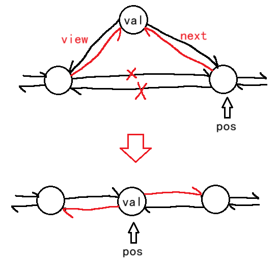

# list源码剖析

建议先看[c++STL-list的使用和迭代器-CSDN博客](https://blog.csdn.net/m0_73693552/article/details/147914305?spm=1001.2014.3001.5501)。

STL中某版本的`list`的结点原型：

```cpp
template <class T>
struct __list_node{
    typedef void* void_pointer;
    void_pointer next;
    voie_pointer prev;
    T data;
}
```

`void `后期还需要强转。

定义结点用`struct`，可以换成`class`，但要另一个类将这个类封装成友元，因为`class`默认私有。

`__list_node`：`__`表示内部的实现，算是项目上的约定。

之后`list`类的成员：

```cpp
template <class T, class Alloc = alloc>
class list {
protected:
    typedef void* void_pointer;
    
    //结点类型
    typedef __list_node<T> list_node;
    
    //空间配置器
    typedef simple_alloc<list_node, Alloc> list_node_allocator;
public:
    //类型
    typedef T value_type;
    
    //类型指针
    typedef value_type* pointer;
    typedef const value_type* const_pointer;
    
    //类型引用
    typedef value_type& reference;
    typedef const value_type& const_reference;
    
    typedef list_node* link_type;
    
    //结点数和引用数
    typedef size_t size_type;
    typedef ptrdiff_t difference_type;
    
    //迭代器
    typedef __list_iterator<T, T&, T*>             iterator;
    typedef __list_iterator<T, const T&, const T*> const_iterator;
    //...
protected:
    link_type node;
}
```

看代码（容器）先看构造函数，初始化决定初始结构是什么样的。

```cpp
template<class T>
class list {
	list() { empty_initialize(); }

	//空结点初始化
	//证明链表在生成时会先
	//生成哨兵卫结点
	void empty_initialize() {
		node = get_node();
		node->next = node;
		node->prev = node;
	}

	link_type get_node() { return list_node_allocator::allocate(); }

	link_type create_node(const T& x) {
		link_type p = get_node();
		__STL_TRY{
			//调用定位new
			construct(&p->data, x);
		}
		__STL_UNWIND(put_node(p));
		return p;
	}

	void put_node(link_type p) { list_node_allocator::deallocate(p); }

	iterator begin() { return (link_type)((*node).next); }
	iterator end() { return node; }
};
```

`allocate`是空间配置器，也就是说`get_node`是获取一个新的结点。

`list`的迭代器功能比`string`和`vector`复杂，因此库里的`list`将迭代器封装成了一个类，通过模板参数的不同来区分不同类型的迭代器。

```cpp
//Ref,即reference，引用
//Ptr,即pointer，指针
//表示引用类型和指针类型也作为模板参数的一部分
template<class T, class Ref, class Ptr>
struct __list_iterator {
    typedef __list_iterator<T, T&, T*>             iterator;
    typedef __list_iterator<T, const T&, const T*> const_iterator;
    typedef __list_iterator<T, Ref, Ptr>           self;

    typedef bidirectional_iterator_tag iterator_category;
    typedef T value_type;
    typedef Ptr pointer;
    typedef Ref reference;
    typedef __list_node<T>* link_type;
    typedef size_t size_type;
    typedef ptrdiff_t difference_type;

    link_type node;

    __list_iterator(link_type x) : node(x) {}
    __list_iterator() {}
    __list_iterator(const iterator& x) : node(x.node) {}

    bool operator==(const self& x) const { return node == x.node; }
    bool operator!=(const self& x) const { return node != x.node; }
    reference operator*() const { return (*node).data; }

#ifndef __SGI_STL_NO_ARROW_OPERATOR
    pointer operator->() const { return &(operator*()); }
#endif /* __SGI_STL_NO_ARROW_OPERATOR */

    self& operator++() {
        node = (link_type)((*node).next);
        return *this;
    }
    self operator++(int) {
        self tmp = *this;
        ++* this;
        return tmp;
    }
    self& operator--() {
        node = (link_type)((*node).prev);
        return *this;
    }
    self operator--(int) {
        self tmp = *this;
        --* this;
        return tmp;
    }
};
```

`end()`是尾结点的迭代器，`begin()`是`end()->next`。


# list模拟实现

`list`的本质是封装加运算符重载。

因此`list`由三部分组成：

1. 结点类`__list_node`。
2. 迭代器类`__list_iterator`。
3. 链表本体`list`。

`__list_node`，考虑到库中的结点给的前驱和后缀都是`void*`，正式使用时还要强制转换，于是这里尝试做改进：

```cpp
template<class T>
struct __list_node {
    //指针域
	typedef __list_node* pointer;
	pointer next;
	pointer view;
    //数据域
	T data;
};
```

为了能做到迭代器重载`const`修饰和非`const`修饰的迭代器，参考库中的`__list_iterator`，需要设计成三个模板参数的类模板，自己改进了看起来比较冗余的部分：

```cpp
template<class T, class Ref, class Ptr>
struct __list_iterator {
	typedef __list_iterator<T, T&, T*> iterator;
	typedef __list_iterator<T, const T&, const T*> const_iterator;
	typedef __list_iterator<T, Ref, Ptr> self;
    typedef __list_node<T>* link_node;
	link_node node;
};
```

最后是`list`本体：

```cpp
class list {
public:
	typedef __list_iterator<T, T&, T*> iterator;
	typedef __list_iterator<T, const T&, const T*> const_iterator;
    typedef __list_node<T> Node;
    //...
private:
	Node* node;
};
```


## list构造函数

构造函数选择这几个常用的实现：

```cpp
list ();

list (size_t n, const T& val = T());

template <class InputIterator>
  list (InputIterator first, InputIterator last);

list (const list& x);

```

默认构造函数用于生成哨兵卫结点。

要使用`list (InputIterator first, InputIterator last);`，则需要再加上一个
`list (int n, const T& val = T());`，防止整型被识别成迭代器。

## 拷贝构造函数

同样可以创造新的头结点，并遍历链表（范围`for`）进行尾插。

## 赋值重载

* 清理链表，保留头结点，之后遍历形参的链表即可。
* 同样可以交换哨兵卫结点。

## 迭代器 iterator

迭代器用3个模板参数的模板类封装。

```cpp
template<class T, class Ref, class Ptr>
struct __list_iterator {
	typedef __list_iterator<T, T&, T*> iterator;
	typedef __list_iterator<T, const T&, const T*> const_iterator;
	typedef __list_iterator<T, Ref, Ptr> self;
    typedef __list_node<T>* link_node;
	link_node node;
};
```

迭代器需要支持的操作：

1. 构造能指向指定结点的构造函数。
2. 拷贝构造函数。
3. 解引用操作`*`，返回迭代器指向的结点的数据域。要求数据域能读、能写。
4. 解引用操作`->`，返回迭代器指向的结点的数据域，当数据域也是自定义类型时，返回指针。
5. `==`，用于判断两个迭代器指向的结点是否相等。
6. `!=`，用于判断两个迭代器指向的结点是否不等。
7. `++`，当前迭代器指向后继结点。
8. `--`，当前迭代器指向前驱结点。
9. `begin()`，返回哨兵卫结点的后一个结点。
10. `end()`，返回哨兵卫结点。


## 访问结点数size和判空

返回除哨兵卫结点外的结点数`_size`。

判断`_size`是否为0，或哨兵卫的两个指针是否都指向自己。

## 尾插 push_back

```cpp
void push_back(const T& val);
```

在`end()`前插入结点即可。可以另外实现，也可以复用`insert`。


## 头插 push_front

```cpp
void push_front(const T& val);
```

在`begin()`前插入结点即可。可以另外实现，也可以复用`insert`。


## 尾删pop_back

删除`--end()`结点即可。


## 头删pop_front

删除`begin()`结点即可。


## 插入 insert

```cpp
iterator insert(iterator pos, const T& val);
```

在迭代器`pos`前插入以`val`为数据的新结点。



这样在`end()`前插入结点相当于是尾插，在`begin()`前插入结点相当于是头插。

链表的迭代器不受扩容的影响，不会出现迭代器失效的问题，给不给返回值都可以。这里选择给。

## 删除 erase

```cpp
iterator erase(iterator pos);
```

删除`pos`迭代器指向的结点。

删除后`pos`迭代器必定失效，因此需要返回下一个结点的迭代器。


## 清空clear和析构函数

```cpp
void clear();
```

删除除哨兵卫结点外的所有结点。

析构函数在`clear`的基础上，进一步清理哨兵卫结点。


## 访问结点

用一个队首`front`和队尾`back`访问头、尾结点即可。

需要注意`end()`在这里设定为哨兵卫结点，一般情况下不可访问。


# 参考程序

某.h文件：

```cpp
#pragma once
#include<cassert>

namespace mystd {
	template<class Type>
	void swap(Type& a, Type& b) {
		Type tmp = a;
		a = b;
		b = tmp;
	}

	template<class T>
	struct __list_node {
		//指针域
		typedef __list_node* pointer;
		pointer next;
		pointer view;
		//数据域
		T data;
		__list_node(const T& x = T())
			:data(x)
			, next(nullptr)
			, view(nullptr) {}
	};

	//三个模板参数分别为：存储的数据类型
	//存储的数据的引用、存储的数据空间的地址类型
	template<class T, class Ref, class Ptr>
	struct __list_iterator {
		typedef __list_iterator<T, Ref, Ptr> self;
		typedef __list_node<T>* link_node;

		link_node node;

		__list_iterator<T, Ref, Ptr>(link_node x = nullptr)
			:node(x) {}

		__list_iterator<T, Ref, Ptr>(const self& x)
			: node(x.node) {}

		Ref operator*() {
			return node->data;
		}

		//为了支持T为自定义类型的情况
		//返回迭代器指向的结点的数据域的地址
		Ptr operator->() {
			return &node->data;
		}

		bool operator==(const self& x) const{
			return node == x.node;
		}

		bool operator!=(const self& x) const {
			return node != x.node;
		}

		self& operator++() {
			node = node->next;
			return *this;
		}

		self& operator--() {
			node = node->view;
			return *this;
		}

		self operator++(int) {
			self tmp(*this);
			node = node->next;
			return tmp;
		}

		self operator--(int) {
			self tmp(*this);
			node = node->view;
			return tmp;
		}

	};

	template<class T>
	class list {
	public:
		typedef __list_iterator<T, T&, T*> iterator;
		typedef __list_iterator<T, const T&, const T*> const_iterator;
		typedef __list_node<T> Node;

		//默认构造函数
		list<T>() {
			node = get_node();
			node->next = node->view = node;
			_size = 0;
		}

		//构造函数
		list<T>(int n, const T& val = T()) {
			node = get_node();
			node->next = node->view = node;
			size_t tmp = n;
			for (size_t i = 0; i < tmp; i++)
				push_back(val);
		}

		list<T>(size_t n, const T& val = T()) {
			node = get_node();
			node->next = node->view = node;
			size_t tmp = n;
			for (size_t i = 0; i < tmp; i++)
				push_back(val);
		}

		template<class Inputiterator>
		list<T>(Inputiterator first, Inputiterator second) {
			node = get_node();
			node->next = node->view = node;
			while (first != second) {
				push_back(*first);
				first++;
			}
		}

		//拷贝构造函数
		list<T>(const list<T>& obj) {
			node = get_node();
			node->next = node->view = node;
			for (const auto& x : obj)
				this->push_back(x);
		}

		//赋值重载
		list<T>& operator=(list<T>obj) {
			mystd::swap(this->node, obj.node);
			mystd::swap(this->_size, obj._size);
			return *this;
		}

		//析构函数
		~list() {
			clear();
			delete node;
		}

		//迭代器
		iterator begin() {
			return iterator(node->next);
		}

		iterator end() {
			return iterator(node);
		}

		const_iterator begin() const {
			return const_iterator(node->next);
		}

		const_iterator end() const {
			return const_iterator(node);
		}

		//结点数
		size_t size()const {
			return _size;
		}

		//判断是否为空
		bool empty()const {
			return this->node->next == this->node
				&& this->node->view == this->node;
		}

		//头插
		void push_front(const T& val) {
			insert(begin(), val);
		}

		//尾插
		void push_back(const T& val) {
			insert(end(), val);
		}

		//尾删
		void pop_back() {
			erase(--end());
		}

		//头删
		void pop_front() {
			erase(begin());
		}

		//插入
		iterator insert(iterator pos, const T& val) {
			Node* cur = pos.node->view;
			Node* newnode = get_node(val);

			newnode->next = cur->next;
			newnode->view = cur;

			cur->next = newnode;
			newnode->next->view = newnode;

			++_size;
			return iterator(newnode);
		}

		//删除
		iterator erase(iterator pos) {
			assert(pos != end());
			Node* del = pos.node, * cur = pos.node->next;
			del->view->next = del->next;
			del->next->view = del->view;

			delete del;
			--_size;
			return iterator(cur);
		}

		//清空
		void clear() {
			auto it = begin();
			while (it != end()) {
				it = erase(it);
			}
		}

		//访问
		T& front() {
			return node->next->data;
		}

		T& back() {
			return node->view->data;
		}
	private:
		Node* get_node(const T& x = T()) {
			Node* tmp = new Node(x);
			tmp->next = tmp->view = nullptr;//这里建议赋值tmp
			return tmp;
		}

		template<class Type>
		friend void mystd::swap(Type&, Type&);

		Node* node;//哨兵卫
		size_t _size;//结点数
	};
}
```

