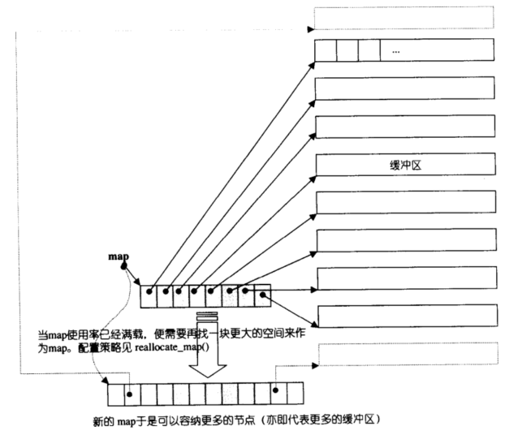

# 栈stack和空间适配器

`stack`是STL的工具，用于模拟数据结构栈。

```cpp
template <class T, class Container = deque<T> > class stack;
```

`Container`是有缺省值的**模板参数**，可更改。

`stack`是**空间适配器**，为了保证栈的特性，没有设计迭代器。

空间适配器相当于是**容器的二次封装**，将内存管理的功能从容器中分离，使得容器可以更专注于数据结构的实现。它能控制底层的容器。

这里的容器可以塞`vector`，`list`和`deque`，只要能通过`stack`的成员函数操作底层容器即可。

`stack`的接口：


其中重要的接口：

```cpp
//判空和返回元素数，判空可由size替换
bool empty() const;
size_type size() const;

//返回栈顶元素
      value_type& top();
const value_type& top() const;

//元素入栈
void push (const value_type& val);

//弹出栈顶元素
void pop();
```


简单使用栈：

```cpp
#include<iostream>
#include<queue>
#include<stack>
#include<list>
using namespace std;

void f1() {
    //底层容器为list
    stack<int, list<int> >sk;
    sk.push(1);
    sk.push(2);
    sk.push(3);
    sk.push(4);
    sk.push(5);
    cout << sk.size() << endl;
    while (!sk.empty()) {
        cout << sk.top() << endl;
        sk.pop();
    }
}


void f2() {
    //底层容器为deque
    stack<int>sk;
    stack<int, deque<int> >sk2;
    sk.push(1);
    sk.push(2);
    sk.push(3);
    sk.push(4);
    sk.push(5);
    sk2 = sk;//底层容器相同时可以拷贝

    cout << sk.size() << endl;
    while (!sk.empty()) {
        cout << sk.top() << endl;
        sk.pop();
    }

    cout << endl;
    cout << sk2.size() << endl;
    while (!sk2.empty()) {
        cout << sk2.top() << endl;
        sk2.pop();
    }
}

int main() {
    //f1();
    f2();
    return 0;
}

```

栈的模拟实现关键在，需要底层容器支持这些操作：

```cpp
template <class T, class Sequence = deque<T> >
class stack {
	//...
	//省略若干库中的友元函数
public:
	//...
	//省略若干库中没必要的typedef
protected:
	Sequence c;
public:
	bool empty() const { return c.empty(); }
	size_t size() const { return c.size(); }
	T& top() { return c.back(); }
	const T& top() const { return c.back(); }
	void push(const T& x) { c.push_back(x); }
	void pop() { c.pop_back(); }
};
```


# 队列queue

STL的队列`queue`和`stack`一样，也是**空间适配器**。只要容器支持这个适配器调用的接口，就能上传。

```cpp
template <class T, class Container = deque<T> > class queue;
```

但要注意，`vector`没有成员函数`pop_front`，所以`queue`不支持`vector`做底层容器。

`queue`的接口：


其中重要的接口：

```cpp
bool empty() const;
size_type size() const;

      value_type& front();
const value_type& front() const;
      value_type& back();
const value_type& back() const;

void push (const value_type& val);
void pop();
```

简单使用：

```cpp
#include<iostream>
#include<queue>
#include<list>
using namespace std;

void f1() {
    //底层容器为list
    queue<int, list<int> >sk;
    sk.push(1);
    sk.push(2);
    sk.push(3);
    sk.push(4);
    sk.push(5);
    cout << sk.size() << endl;
    while (!sk.empty()) {
        cout << sk.front() << ' ';
        cout << sk.back() << endl;
        sk.pop();
    }
}


void f2() {
    //底层容器为deque
    queue<int>sk;
    queue<int, deque<int> >sk2;
    sk.push(1);
    sk.push(2);
    sk.push(3);
    sk.push(4);
    sk.push(5);
    sk2 = sk;//底层容器相同时可以拷贝

    cout << sk.size() << endl;
    while (!sk.empty()) {
        cout << sk.front() << ' ';
        cout << sk.back() << endl;
        sk.pop();
    }

    cout << endl;
    cout << sk2.size() << endl;
    while (!sk2.empty()) {
        cout << sk2.front() << ' ';
        cout << sk2.back() << endl;
        sk2.pop();
    }
}

int main() {
    f1();
    //f2();
    return 0;
}
```

`queue`和`stack`一样，模拟实现关键在，需要底层容器支持这些操作：

```cpp
template <class T, class Sequence = deque<T> >
class queue {
    //...
    //省略若干友元函数
public:
    //...
    //省略若干不重要的typedef
protected:
    Sequence c;
public:
    bool empty() const { return c.empty(); }
    size_t size() const { return c.size(); }
    T& front() { return c.front(); }
    const T& front() const { return c.front(); }
    T& back() { return c.back(); }
    const T& back() const { return c.back(); }
    void push(const T& x) { c.push_back(x); }
    void pop() { c.pop_front(); }
};

```


# 双端队列deque

```cpp
template < class T, class Alloc = allocator<T> >
    class deque;
```

`deque`是一种双开口的"连续"空间的数据结构（也就是**容器**），双开口的含义是：可以在头尾两端进行插入和删除操作，且时间复杂度为$O(1)$，与`vector`比较，头插效率高，不需要搬移元素；与`list`比较，空间利用率比较高。


## deque和vector与list比较

`deque`可以看成`list`和`vector`的集合体，`list`和`vector`能做的事，`deque`都能做（比如数组的下标访问，链表的随机插入），但实际做的并不比`list`和`vector`好。

因为`deque`的底层由一段段连续的小空间拼接而成的，实际`deque`类似于一个动态的二维数组。用一个例子表示`deque`的底层现状：

```cpp
#include<cstdio>

int main() {
	int a[3] = { 2,3,4 }, b[3] = { 2,6,4 }, c[3] = { 2,3,4 };
	int* p[] = { a,b,c };//用指针数组实现类似二维数组的效果
	for (int i = 0; i < 3; i++) {
		for (int j = 0; j < 3; j++)
			printf("%d ", p[i][j]);
		printf("\n");
	}
    return 0;
}
```

对比`vector`和`list`：

* `vector`用的是连续的物理空间，
  
  1. 优点是机制高效的下标随机访问。
  1. 缺点是扩容慢，中间和头部的插入、删除效率低。
  
* `list`用的是不连续的空间，

  1. 优点是任意位置的插入、删除效率高。资源能按需申请释放。

  2缺点是不支持下标随机访问。

与`vector`比较，`deque`的优势是：头部插入和删除时，不需要搬移元素，效率高，而且在扩容时，也不需要搬移大量的元素，因此其效率是必`vector`高的。

与`list`比较，其底层是连续空间，空间利用率比较高，不需要存储额外字段。

但是，`deque`有一个致命缺陷：**不适合遍历**。

在遍历时，`deque`的迭代器要频繁的去检测其是否移动到某段小空间的边界，导致效率低下，而序列式场景中，可能需要经常遍历。

因此在实际中，需要线性结构时，大多数情况下优先考虑`vector`和`list`，`deque`的应用并不多，而目前能看到的一个应用就是，STL用其作为容器适配器`stack`和`queue`的底层数据结构。

## deque的底层实现

`deque`的底层实现是给一个**中控数组**，这个数组的类型可以认为是**指针数组或二级指针**，这个中控数组**存的是若干个子数组的地址**。

子数组严格来说是一段**连续性空间**（一维数组），称为**缓冲区**。

缓冲区的大小固定，从最后一个元素开始使用，为了使头插效率加强。每个缓冲区能存储的数据大小看具体的STL版本。



而且就算是中控数组，也是从**中间开始计数**，为了适应可能的头插、尾插大量数据的的需要。

中控数组满了也能扩容，代价很低（指申请新的指针数组，将地址拷贝给新数组）。缓冲区也能扩容。

尾插是在最后一个子数组，若子数组满了，则增加新的子数组。头插则是在第1个子数组。


若选择子数组的中间位置插入数据，看需要牺牲什么。

* 若每个缓冲区的大小一样大，则用`[]`访问也能很快。访问方式：

  假设每个子数组的大小是10，访问位置是`pos`，则子数组序号`x=pos/10`，在子数组中的位置`y=pos%10`，因此返回的位置是`[pos/10][posS%10]`（参考数据结构位图）此时中间位置插入数据，只能整体挪动。

* 若每个缓冲区都不一样大，则中间位置的插入只能扩大子数组，用`[]`访问就很不方便。

所以`deque`的双端插入、删除和访问的效率还行（略优于`vector`），但中间插入效率不高高。

若对`deque`的操作效率排名，则 头插尾插$>$`[]`$>>$中间删除。

## deque的迭代器

`deque`的迭代器是随机访问迭代器。也就是说，`deque`可以支持`algorithm`库里的`sort`。但追求效率的话，还是将`deque`内的数据拷贝到`vector`或静态数组，排序完后再拷贝回`deque`。

迭代器的大致结构：


对绝大多数情况，`deque`作为被封装的工具，直接拿来用即可，底层实现可以有个印象，后期对c++的了解更深后再了解（比如需要写编译器的情况）。

## stack和queue用deque作底层容器的原因

`stack`是一种后进先出的特殊线性数据结构，因此只要具有`push_back()`和`pop_back()`操作的线性结构，都可以作为`stack`的底层容器，比如`vector`和`list`都可以。

`queue`是先进先出的特殊线性数据结构，只要具有

`push_back`和`pop_front`操作的线性结构，都可以作为`queue`的底层容器，比如`list`。但是STL中对`stack`和`queue`默认选择`deque`作为其底层容器，主要是因为：

1. `stack`和`queue`不需要遍历(因此`stack`和`queue`没有迭代器)，只需要在固定的一端或者两端进行操作。

2. 在`stack`中元素增长时，`deque`比`vector`的效率高(扩容时不需要搬移大量数据)；`queue`中的元素增长时，`deque`不仅效率高，而且内存使用率高。

综上，栈和队列结合了`deque`的优点，而完美的避开了其缺陷。因此`stack`和`queue`的底层容器默认选`deque`。

因双端队列的底层相对复杂，底层的操作也没有特别亮眼的地方，因此只对底层做简单了解，会用即可，模拟实现就省略。


# OJ

## 155. 最小栈 - 力扣

[155. 最小栈 - 力扣（LeetCode）](https://leetcode.cn/problems/min-stack/description/)

以空间换时间的思路：另外开一个栈，称为最小栈，则用于存储数据的栈称之为主栈。主栈每插入一个数据都和最小栈的栈顶做对比，比最小栈的栈顶小或相等就更新栈顶。

出栈时，若主栈的栈顶和最小栈的栈顶相同，则最小栈也要出栈，否则只有主栈出栈。

若数据有大量的重复，可以考虑最小栈的类型用两个变量的结构体或键值对。

键值对`pair`：

```cpp
class MinStack {
public:
    stack<int>sk;
    stack<pair<int,int> >mn;
    MinStack() {}
    
    void push(int val) {
        sk.push(val);
        if(mn.empty()){
            mn.push({val,1});
        }
        else if(mn.top().first==val){
            mn.top().second++;
        }
        else if(mn.top().first>val){
            mn.push({val,1});
        }
    }
    
    void pop() {
        if(mn.top().first==sk.top()){
            mn.top().second--;
            if(mn.top().second==0)
                mn.pop();
        }
        sk.pop();
    }
    
    int top() {
        return sk.top();
    }
    
    int getMin() {
        return mn.top().first;
    }
};

/**
 * Your MinStack object will be instantiated and called as such:
 * MinStack* obj = new MinStack();
 * obj->push(val);
 * obj->pop();
 * int param_3 = obj->top();
 * int param_4 = obj->getMin();
 */
```


## 栈的压入、弹出序列 - 牛客

[栈的压入、弹出序列_牛客题霸_牛客网](https://www.nowcoder.com/practice/d77d11405cc7470d82554cb392585106?tpId=13&&tqId=11174&rp=1&ru=/activity/oj&qru=/ta/coding-interviews/question-ranking)

1. 无论什么情况，入栈序列先入栈。
2. 栈顶数据和出栈序列比较。
   * 若匹配，出栈序列`++`，弹出栈顶元素，继续比较，直到栈空为止。
   * 或者不匹配，再执行1。

入栈序列枚举完成就结束，若出栈序列走到尾或栈空就匹配，否则不匹配。

```cpp
class Solution {
public:
    /**
     * 代码中的类名、方法名、参数名已经指定，请勿修改，直接返回方法规定的值即可
     *
     * 
     * @param pushV int整型vector 
     * @param popV int整型vector 
     * @return bool布尔型
     */
    bool IsPopOrder(vector<int>& pushV, vector<int>& popV) {
        // write code here
        stack<int>sk;
        vector<int>&a=pushV,&b=popV;
        int ai=0,bi=0;

        while(ai<a.size()){
            sk.push(a[ai++]);
            while(sk.size()&&sk.top()==b[bi]){
                sk.pop();
                ++bi;
            }
        }
        return sk.empty();
    }
};
```


## 150. 逆波兰表达式求值 - 力扣

[150. 逆波兰表达式求值 - 力扣（LeetCode）](https://leetcode.cn/problems/evaluate-reverse-polish-notation/description/)

对只包含运算符和数字，且运算符安插在数字之间的数学表达式叫中缀表达式。

例如：`1 + 2 * 3`。这种表达式人用肉眼来看都要区分优先级才能做，更不用说计算机。

于是有人通过递归或栈的原理，将中缀表达式转换成后缀表达式，这个后缀表达式又叫逆波兰表达式。

后缀表达式求解：遍历数字和字符，若是数字则入栈，若是数字则取出两个数字进行计算。

```cpp
class Solution {
public:
    int evalRPN(vector<string>& tokens) {
        stack<string>sk;
        for (auto& x : tokens) {
            if ((x[0] >= '0' && x[0] <= '9')
                ||(x[0]=='-'&&x.size()>1))
                sk.push(x);
            else {
                int b = stoi(sk.top());
                sk.pop();
                int a = stoi(sk.top());
                sk.pop();
                switch (x[0]) {
                case '+':
                    sk.push(to_string(a + b));
                    break;
                case '-':
                    sk.push(to_string(a - b));
                    break;
                case '*':
                    sk.push(to_string(a * b));
                    break;
                case '/':
                    sk.push(to_string(a / b));
                    break;
                }
            }
        }
        return stoi(sk.top());
    }
};
```

## 224. 基本计算器 - 力扣

[224. 基本计算器 - 力扣（LeetCode）](https://leetcode.cn/problems/basic-calculator/)

将中缀表达式转换成后缀表达式，再通过后缀表达式进行计算。

中缀表达式转换成后缀表达式：

借助一个栈和一个其他容器（比如数组）。

持续枚举中缀表达式，会出现以下情况：

1. 若是操作数，则存到栈里。
2. 若是操作符，有2种情况。
   1. 栈为空，则操作符存入栈。
   2. 和栈顶操作符比较，优先级比栈顶操作符高，则入栈。
   3. 和栈顶操作符比较，优先级比栈顶操作符低或相等，则将栈顶操作符取出插入到其他容器，直到不满足3为止（栈空和比栈顶操作符的优先级高）。
3. 遇到括号，则新建立一个栈（或新建一个递归），将括号内的中缀表达式按照1、2进行操作。进行完成后将子后缀表达式插入。

这样容器内的数据即为后缀表达式。


## 232. 用栈实现队列 - 力扣

[232. 用栈实现队列 - 力扣（LeetCode）](https://leetcode.cn/problems/implement-queue-using-stacks/description/)


## 225. 用队列实现栈 - 力扣

[225. 用队列实现栈 - 力扣（LeetCode）](https://leetcode.cn/problems/implement-stack-using-queues/description/)


## 215. 数组中的第K个最大元素 - 力扣

[215. 数组中的第K个最大元素 - 力扣（LeetCode）](https://leetcode.cn/problems/kth-largest-element-in-an-array/description/)

利用大堆存储相反数，可以当成小堆使用。

因此先存`k`个数据，然后用剩下的`nums.size-k`个数据和堆顶进行比较，比堆顶的绝对值大的就进行替换。

当遍历完整个数组之后，堆中的元素即为`nums`数组中最大的那`k`个，而堆顶就是最小的第`k`个。

```cpp
class Solution {
public:
    int findKthLargest(vector<int>& nums, int k) {
        priority_queue<int>pq;
        for(size_t i=0;i<k;i++){
            pq.push(-nums[i]);
        }
        for(size_t i=k;i<nums.size();i++){
            if(nums[i]>-pq.top()){
                pq.pop();
                pq.push(-nums[i]);
            }
        }
        return -pq.top();
    }
};
```


