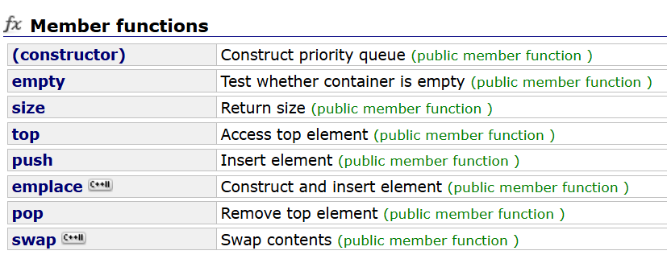

# 优先队列priority_queue

```cpp
template <class T, class Container = vector<T>,
  class Compare = less<typename Container::value_type> >
class priority_queue;
```

优先队列是优先级队列，即传统的队列中优先级高的先被取出。

优先级队列也是容器适配器，底层容器是`vector`。

尽管底层是数组，但底层的实现是[堆也就是一种特殊的完全二叉树](https://blog.csdn.net/m0_73693552/article/details/143720137)（区分结点等级的**完全二叉树**）。

优先队列也是**容器适配器**，默认生成的构造函数会去调用容器的构造函数，析构函数同理，因此不需要刻意去实现。

三个模板参数：

`T`：**数据类型**。

`Container`：**底层容器**，默认是STL的容器`vector`。

`Compare`：**仿函数**，负责完成比较功能，默认是`less`。即若存的数据只是数字，则优先队列的底层是大根堆。

c++98中对`less`的定义：

```cpp
template <class T>
struct less : binary_function <T,T,bool> {
    bool operator() (const T& x, const T& y) const {
        return x<y;
    }
};
```

优先队列的底层就是`vector`改装成的完全二叉树。将[这里也就是堆的内容](https://blog.csdn.net/m0_73693552/article/details/143720137)移植过来也能使用。

# 仿函数

仿函数是模板类，它需要重载`()`，即`operator()`，用这个`()`作为比较器。因为是模板类，所以实际运行效率比普通函数要低（进行同样的业务比普通函数慢）。

优先级队列中的默认仿函数是`less`，在`less`下堆默认是大堆。

`less`的底层：

```cpp
template <class T>
struct less : binary_function <T,T,bool> {
    bool operator() (const T& x, const T& y) const {
        return x<y;
    }
};
```

`less : binary_function `表示`less`继承自类`binary_function`，继承方式是公有（`public`）继承。

## 仿函数的直接使用

仿函数有时称作函数对象，是因为它能像函数一样调用。

```cpp
#include<iostream>
//直接调用仿函数需要展开头文件functional
#include<functional>
using namespace std;

int main() {
    less<int> le;
    cout << le(2, 3) << endl;//2>3，输出1
    cout << le.operator()(3,3)<< endl;//3不大于3，输出0
    return 0;
}
```

仿函数的出现是为了**替代函数指针**。

因为函数指针的声明复杂，且函数指针不能在模板参数上传（指针变量不能作为类型上传模板参数），于是c++用类的对象来代替，即在容器或容器适配器中配置仿函数类的对象，通过对象间接调用和比较有关的操作符来完成各种操作。

例如某个STL的空间配置器`stl_alloc.h`中的函数指针：

```cpp
static void (* set_malloc_handler(void (*f)()))() {
    void (* old)() = __malloc_alloc_oom_handler;
    __malloc_alloc_oom_handler = f;
    return(old);
}
```

若c语言功底不够都无法看出它是什么，将它拆解成这样就能表达它的意思：

```cpp
static void(*)() set_malloc_handler(void(*)() f){
    
}
//将void(*)()类比成int就能理解这个函数
static int set_malloc_handler(int f){
    
}
```

## 仿函数作为形参或模板参数

`algorithm`库里很多工具比如`sort`是函数模板，需要上传仿函数（匿名）对象，而`priority_queue`是类模板，`<>`内的模板参数上传的是类型。

```cpp
#include<iostream>
#include<queue>
using namespace std;

int main() {
    int a[] = { 1,1,4,5,1,4,0,7,2,1 };
    priority_queue<int, vector<int>, less<int> >pq;
    sort(a, a + 10, less<int>());//上传仿函数的匿名对象

    //还是范围for，但类型固定为int
    for (int x : a) { //上传less时是降序
        pq.push(x);
        cout << x << ' ';
    }
    cout << endl;

    //依次取出优先队列（完全二叉树）的堆顶
    while (!pq.empty()) {
        cout << pq.top() << ' ';
        pq.pop();
    }
    return 0;
}
```

仿函数可以自己写，使得容器能更好地处理用户给的自定义类型。

```cpp
#include<iostream>
#include<queue>
using namespace std;

struct mycmp {
    bool operator()(int& a, int& b) {
        return a > b;
    }
};

int main() {
    int a[] = { 1,1,4,5,1,4,0,7,2,1 };
    priority_queue<int, vector<int>, mycmp>pq;
    sort(a, a + 10, mycmp());//上传自定义仿函数的匿名对象

    for (int x : a) { //升序
        pq.push(x);
        cout << x << ' ';
    }
    cout << endl;

    //依次取出优先队列（完全二叉树）的堆顶
    while (!pq.empty()) {
        cout << pq.top() << ' ';
        pq.pop();
    }
    return 0;
}
```

# 模拟优先队列

参考c++98的接口：



以及[c++STL-string的模拟实现](https://blog.csdn.net/m0_73693552/article/details/147881347)、[c++STL-vector的模拟实现](https://blog.csdn.net/m0_73693552/article/details/147901714)即可。

因为模板不方便进行声明和定义分明，所以将它们放一起。

```cpp
#pragma once
#include<vector>
#include<functional>
using std::vector;
using std::less;
using std::swap;

//这里偷懒，使用库里的容器和仿函数
template<class T,class Container=vector<T>,
	class Compare=less<T> >
class mypriority_queue {
public:
	//构造函数
	mypriority_queue() { }
	template<class InputIterator>
	mypriority_queue(InputIterator first, InputIterator last) {
		for (auto x = first; x != last; x++)
			push(*first);
	}
	//析构函数
	~mypriority_queue() { }
	//判空
	bool empty()const {
		return container.size() == 0;
	}
	//优先队列元素个数
	size_t size()const {
		return container.size();
	}
	//返回堆顶
	T top()const {
		return container[0];
	}
	//插入元素
	void push(const T& x) {
		container.push_back(x);
		adjustUp(container.size() - 1);
	}
	//弹出堆顶
	void pop() {
		swap(container[0], container[container.size() - 1]);
		container.pop_back();
		adjustDown(0);
	}
private:
	//堆的向下调整算法
	void adjustDown(int parent) {
		int child = parent * 2 + 1;
		while (child < (int)container.size()) {
			if (child + 1 < (int)container.size())
				if (compare(container[child + 1] , container[child]))
					++child;
			//优先队列中更像是前者和后者满足什么条件就进行交换
			if (compare(container[child] , container[parent])) {
				swap(container[child], container[parent]);
				parent = child;
				child = parent * 2 + 1;
			}
			else
				break;
		}
	}
	//堆的向上调整算法
	void adjustUp(int child) {
		int parent = (child - 1) / 2;
		while (child > 0) {
			if (compare(container[child] , container[parent])) {
				swap(container[child], container[parent]);
				child = parent;
				parent = (child - 1) / 2;
			}
			else
				break;
		}
	}
	Container container;
	Compare compare;
};

```

# 优先队列有关OJ

堆在[贪心算法](https://blog.csdn.net/m0_73693552/article/details/144020981)中有很广泛的应用，且本身和堆排序有很强的关联性。

## 373. 查找和最小的 K 对数字 - 力扣

[373. 查找和最小的 K 对数字 - 力扣（LeetCode）](https://leetcode.cn/problems/find-k-pairs-with-smallest-sums/description/?envType=study-plan-v2&envId=top-interview-150)

很容易想到，遍历2个数组，组成`k`个符合条件的数对即可（详细见[堆的应用——topk问题-](https://blog.csdn.net/m0_73693552/article/details/143725855)）。

2个数组`nums1`和`nums2`的数据量是$10^5$，2层循环进行枚举的话会超时。

因为2个数组都是有序的，所以可以用一个监测变量`cnt`，若事先准备好的优先队列有更新则修改`cnt`，否则不做处理，当循环检测到`cnt`没有发生变化时直接跳出循环。

```cpp
typedef pair<int,int>pii;

class Greate{
public:
    bool operator()(pii a,pii b){
        return a.first+a.second<b.first+b.second;
    }
};

class Solution {
public:
    vector<vector<int>> kSmallestPairs(vector<int>& nums1, vector<int>& nums2, int k) {
        priority_queue<pii,vector<pii>,Greate>q;
        for(auto&x:nums1){
            int cnt=0;
            for(auto&y:nums2)
                if(q.size()<k){
                    q.push({x,y});
                    ++cnt;
                }
                else if(x+y<q.top().first+q.top().second){
                    ++cnt;
                    q.pop();
                    q.push({x,y});
                }
            if(cnt==0)
                break;
        }
        vector<vector<int> >ans;
        while(q.size()){
            ans.push_back({q.top().first,q.top().second});
            q.pop();
        }
        return ans;
    }
};
```

