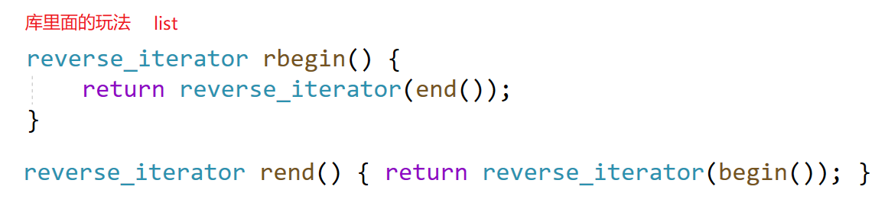

# 反向迭代器原理

建议先看[c++STL-string的使用-CSDN博客](https://blog.csdn.net/m0_73693552/article/details/147881146?spm=1001.2014.3001.5501)、[c++STL-list的使用和迭代器-CSDN博客](https://blog.csdn.net/m0_73693552/article/details/147914305?spm=1001.2014.3001.5501)。

可以用正向迭代器适配出反向迭代器。

```cpp
//三个模板参数分别是
//迭代器，有效数据的引用，有效数据的地址类型
template<class Iterator, class Ref, class Ptr>
class reverse_iterator{
    //...
};
```

`Iterator`是其他容器的正向迭代器，但没说是哪一个的。

反向迭代器需要用正向迭代器来构造。

之后反向迭代器的`++`，通过调用正向迭代器的`--`来实现。反向迭代器的`--`，也通过调用正向迭代器的`++`实现。

```cpp
reverse_iterator<Iterator, Ref, Ptr>& operator++() {
    --it;
	return *this;
}
```

用`rbegin()`和`rend()`来表示反向迭代器。但它们其实是上传原迭代器通过反向迭代器类进行封装：

```cpp
typedef T* iterator;
typedef const T* const_iterator;

typedef reverse_iterator<iterator, T&, T*> reverse_iterator;
typedef reverse_iterator<const_iterator, const T&, const T*> const_reverse_iterator;

reverse_iterator rbegin(){
	return reverse_iterator(end() - 1);
}

reverse_iterator rend(){
	return reverse_iterator(begin() - 1);
}

const_reverse_iterator rbegin() const{
	return const_reverse_iterator(end() - 1);
}

const_reverse_iterator rend() const{
	return const_reverse_iterator(begin() - 1);
}
```

反向迭代器的`operator*`是调用正向迭代器的`*`，因此返回值的类型需要通过模板参数来确定。

这种实现方式的类也可以叫迭代器适配器，即反向迭代器底层用正向迭代器来适配。

适配的前提：很多功能是重叠的才能去适配。例如`stack`和`list`、`vector`、`deque`的功能重叠，因此可以适配。

这个反向迭代器理论上也能适配`list`、`vector`、`deque`以及其他支持正向迭代器的容器。

# 易错情况：临时对象的常属性

这里假设`vector`的迭代器依旧用指针代替，`list`的迭代器通过类模板实现。

因为临时对象的常属性，因此在生成反向迭代器对象时，常量不能`--`，编译器报错说只能对左值操作。


临时对象具有常属性，但这里`--end()`的含义不同，按理来说无论是内置类型还是自定义类型，这里生成的临时对象都具有常属性，按理来说都不能`--end()`，但只有内置类型迭代器的`vector`报错了，另一个自定义类型迭代器的`list`没有。

解决方法是用`end()-1`作为形参上传给反向迭代器。这样临时拷贝不会修改原迭代器的返回值。

此外，匿名对象也具有常属性：

```cpp
class A{
    void print(){
        cout<<"A::print()\n";
    }
};

A& r=A();//不允许
A& r=A(1);//不允许

const A& r = A(1);//允许
r.print();//具有常属性的对象可以调用非const修饰的函数，案例来说应该不可以

```

再比如：

```cpp
--10;//不允许
10-1;//允许
```

使用类似`end()-1`的操作都是为了拿到这个位置。


因此上传`end()-1`，一样能拿到这个位置的值，用这个值再去调用反向迭代器的构造函数生成反向迭代器。

# 库里的反向迭代器



库里采用了对称的设计，反向迭代器的`rbegin`就是`rend`。

按照之前的设计，这样的迭代器会少枚举元素。

但库里的`*it`访问的是前一个位置：

```cpp
reference operator(*) const{
    Iterator tmp=current;
    return *--tmp;
}
```


例如通过`rbegin`访问4，先`--`自身再访问。

后续的模拟实现主要参考库里的实现。也不能说之前的分析没用，而是学习时可以大胆猜想，再去看看自己想的和大佬的差距在哪里。

# 反向迭代器需要支持的功能

总结起来就这几个功能：

1. `++`，表示正向迭代器的`--`。
2. `--`，表示正向迭代器的`++`。
3. `operator*`，表示解引用。访问迭代器指向的数据的前一个位置。
4. `operator->`，表示解引用。
5. `!=`，表示迭代器的不等于。
6. `==`，表示迭代器的等于。
7. 需要使用反向迭代器的容器，类的内部加上这几句代码（`T`是正向迭代器指向的数据的数据类型）：

```cpp
typedef reverse_iterator<iterator, T&, T*> reverse_iterator;
typedef reverse_iterator<const_iterator, const T&, const T*> const_reverse_iterator;

//反向迭代器
reverse_iterator rbegin() {
    return reverse_iterator(end());
}

reverse_iterator rend() {
    return reverse_iterator(begin());
}

const_reverse_iterator rbegin() const {
    return const_reverse_iterator(end());
}

const_reverse_iterator rend() const {
    return const_reverse_iterator(begin());
}
```

这里什么也没有做，而是复用了原容器的正向迭代器，用正向迭代器来模拟反向迭代器的功能。

# 通用反向迭代器模板参考程序

反向迭代器通用模板类：

```cpp
//三个模板参数分别是
//迭代器，有效数据的引用，有效数据的地址类型
template<class Iterator, class Ref, class Ptr>
class reverse_iterator {
public:
	typedef reverse_iterator<Iterator, Ref, Ptr> self;

	reverse_iterator<Iterator, Ref, Ptr>(Iterator _it)
		:it(_it) {}

	self& operator++() {
		--it;
		return *this;
	}

	self& operator--() {
		++it;
		return *this;
	}

	self operator++(int) {
		Iterator tmp = it--;
		return self(tmp);
	}

	self operator--(int) {
		Iterator tmp = it++;
		return self(tmp);
	}

    //参考库里的反向迭代器，访问前一个位置
	Ref operator*() {
		Iterator tmp = it;
		return *(--tmp);
	}
    
    //获得数据的地址
	Ptr operator->() {
		return &(operator*());
	}

	bool operator==(const self& x) const {
		return it == x.it;
	}

	bool operator!=(const self& x) const {
		return it != x.it;
	}

private:
	Iterator it;
};
```

只要容器类增加反向迭代器的接口作为成员函数，并重载有`++`、`--`、`*`、`->`、`==`和`!=`即可使用。

测试用的命名空间`mystd.h`：

```cpp
#pragma once
#include<cassert>
#include<queue>
#include<iostream>
using std::ostream;
using std::istream;

namespace mystd {
    template<class T>
    void swap(T& a, T& b) {
        T tmp = a;
        a = b;
        b = tmp;
    }

    //反向迭代器类模板
    //三个模板参数分别是
    //迭代器，有效数据的引用，有效数据的地址类型
    template<class Iterator, class Ref, class Ptr>
    class reverse_iterator {
    public:
        typedef reverse_iterator<Iterator, Ref, Ptr> self;

        reverse_iterator<Iterator, Ref, Ptr>(Iterator _it)
            :it(_it) {}

        self& operator++() {
            --it;
            return *this;
        }

        self& operator--() {
            ++it;
            return *this;
        }

        self operator++(int) {
            Iterator tmp = it--;
            return self(tmp);
        }

        self operator--(int) {
            Iterator tmp = it++;
            return self(tmp);
        }

        //参考库里的反向迭代器，访问前一个位置
        Ref operator*() {
            Iterator tmp = it;
            return *(--tmp);
        }

        //获得数据的地址
        Ptr operator->() {
            return &(operator*());
        }

        bool operator==(const self& x) const {
            return it == x.it;
        }

        bool operator!=(const self& x) const {
            return it != x.it;
        }

    private:
        Iterator it;
    };

    class string {
    public:
        const static size_t npos;

        //构造函数
        string(const char* s = "") {
            //求s的长度
            size_t len = 0;
            const char* tmps = s;
            while (*tmps) {
                ++len;
                ++tmps;
            }
            //初始化长度、容量等信息
            _size = len;
            _capacity = len;
            _str = new char[_capacity + 1]{ '\0' };

            //拷贝
            tmps = s;
            char* tmps2 = _str;
            while (*tmps2++ = *tmps++);
        }

        //析构函数
        ~string() {
            delete[] _str;
            _str = nullptr;
            _size = _capacity = 0;
        }

        //返回c风格字符串的地址
        const char* c_str() const {
            return _str;
        }

        //用[]进行索引访问
        char& operator[](size_t pos) {
            assert(pos < _size);
            return _str[pos];
        }
        const char& operator[](size_t pos) const {
            assert(pos < _size);
            return _str[pos];
        }

        //返回当前字符串的长度
        size_t size()const {
            return _size;
        }

        //返回容量
        size_t capacity()const {
            return _capacity;
        }

        //迭代器
        typedef char* iterator;
        typedef const char* const_iterator;
        //模板参数的类型要对齐，
        //例如const_iterator要对应const_reverse_iterator，
        //则模板参数的迭代器要上传const_iterator
        typedef mystd::reverse_iterator<iterator, char&, char*> reverse_iterator;
        typedef mystd::reverse_iterator<const_iterator, const char&, const char*> const_reverse_iterator;

        iterator begin() {
            return _str;
        }

        iterator end() {
            return _str + _size;
        }

        const_iterator begin() const {
            return _str;
        }

        const_iterator end() const {
            return _str + _size;
        }


        //反向迭代器
        reverse_iterator rbegin() {
            return reverse_iterator(end());
        }

        reverse_iterator rend() {
            return reverse_iterator(begin());
        }

        const_reverse_iterator rbegin() const {
            return const_reverse_iterator(end());
        }

        const_reverse_iterator rend() const {
            return const_reverse_iterator(begin());
        }

        //交换，独立于namespace std中的swap
        void swap(string& a) {
            //两个对象：*this,a
            mystd::swap(_str, a._str);
            mystd::swap(_size, a._size);
            mystd::swap(_capacity, a._capacity);
        }

        //拷贝构造函数
        string(const string& str)
            :_str(nullptr)//临时对象不经过构造函数会产生随机数
            , _size(0)
            , _capacity(0) {
            string tmp(str._str);//生成第2个临时对象
            mystd::string::swap(tmp);
        }

        //赋值重载：
        string& operator=(string tmp) {
            mystd::string::swap(tmp);
            return *this;
        }
        string& operator=(char c) {
            char ch[2] = { c,'\0' };
            string tmp(ch);
            mystd::string::swap(tmp);
            return *this;
        }


        //扩容
        void reserve(size_t n = 0) {
            if (n > _capacity) {
                char* tmp = new char[n + 1]{ '\0' };
                char* aa = tmp, * bb = _str;
                while (*aa++ = *bb++);
                delete[]_str;
                _str = tmp;

                _capacity = n;
            }
        }

        void resize(size_t n, char ch = '\0') {
            if (n <= _size) {
                _str[n] = '\0';
                _size = n;
                while (n < _capacity)
                    _str[n++] = '\0';
                return;
            }
            reserve(n);
            while (_size < n) {
                _str[_size] = ch;
                ++_size;
            }
        }

        //插入
        string& insert(size_t pos, const string& s) {
            assert(pos <= _size);
            reserve(_size + s._size);

            size_t end = _size - 1;
            while (end >= pos && end != -1) {
                _str[end + s._size] = _str[end];
                --end;
            }

            for (size_t i = 0; i < s._size; i++) {
                _str[pos + i] = s[i];
            }
            _size += s._size;
            return *this;
        }

        //尾插
        string& operator+=(const string& s) {
            insert(_size, s);
            _str[_size] = '\0';
            return *this;
        }

        string& operator+=(char s) {
            push_back(s);
            return *this;
        }

        void push_back(char c) {
            char ch[2] = { c,'\0' };
            insert(_size, ch);
        }

        //比较运算符重载
        bool operator==(const string& s) const {
            if (_size != s._size)
                return 0;
            for (size_t i = 0; i < s._size; i++) {
                if (_str[i] != s._str[i]) {
                    return 0;
                }
            }
            return 1;
        }

        bool operator<(const string& s) const {
            for (size_t i = 0; i < s._size && i < _size; i++) {
                if (_str[i] > s._str[i]) {
                    return 0;
                }
            }
            if (_size > s._size)
                return 0;
            return 1;
        }

        bool operator>(const string& s) const {
            return !(*this == s || *this < s);
        }
        bool operator>=(const string& s) const {
            return !(*this < s);
        }
        bool operator<=(const string& s) const {
            return !(*this > s);
        }
        bool operator!=(const string& s) const {
            return !(*this == s);
        }

        //删除
        string& erase(size_t pos = 0, size_t len = npos) {
            assert(pos < _size);
            if (len == npos || pos + len >= _size) {
                _str[pos] = '\0';
                _size = pos;
                return *this;
            }
            while (pos + len < _size) {
                _str[pos] = _str[pos + len];
                ++pos;
            }
            _str[pos] = '\0';
            _size -= len;
            return *this;
        }

        //清空
        void clear() {
            _str[0] = '\0';
            _size = 0;
        }

        //查找
        size_t find(const string& s, size_t pos = 0)const {
            for (size_t i = 0, ti; i <= _size - s._size; i++) {
                ti = i;
                for (size_t j = 0; j < s._size; j++) {
                    if (s[j] == _str[ti])
                        ++ti;
                    else
                        break;
                }
                if (ti == i + s._size)
                    return i;
            }
            return npos;
        }
        size_t find(char c, size_t pos = 0)const {
            for (size_t i = 0; i < _size; i++) {
                if (_str[i] == c)
                    return i;
            }
            return npos;
        }

        //提取片段
        string substr(size_t pos = 0, size_t len = npos)const {
            string tmp;
            if (len == npos || pos + len > _size) {
                while (tmp += _str[pos++], pos < _size);
                return tmp;
            }

            while (tmp += _str[pos++], tmp._size < len);
            return tmp;
        }

    private:
        char* _str;
        size_t _size;
        size_t _capacity;
    };
    const size_t string::npos = -1;
    ostream& operator<<(ostream& out, const string& st) {
        for (const auto& x : st)
            out << x;
        return out;
    }
    istream& operator>>(istream& in, string& s) {
        s.clear();

        char buff[129];
        size_t i = 0;

        char ch;
        //连同空格一起接收
        while (ch = in.get(), ch != ' ' && ch != '\n') {
            buff[i++] = ch;
            if (i == 128) {
                buff[i] = '\0';
                s += buff;
                i = 0;
            }
        }

        if (i != 0) {
            buff[i] = '\0';
            s += buff;
        }

        return in;
    }

    template<class T>
    class vector {
    public:

        //构造函数
        vector<T>()
            :_start(nullptr)
            , _finish(nullptr)
            , _endofstorage(nullptr)
        {}

        vector<T>(size_t n, const T& val = T())
            : _start(nullptr)
            , _finish(nullptr)
            , _endofstorage(nullptr) {
            reserve(n);
            _finish = _start + n;
            for (size_t i = 0; i < n; i++) {
                _start[i] = val;
            }
        }

        //析构函数
        ~vector<T>() {
            delete[]_start;
            _start = _finish = _endofstorage = nullptr;
        }

        //获取容量信息
        size_t capacity() const {
            return _endofstorage - _start;
        }

        //获取数量
        size_t size() const {
            return _finish - _start;
        }

        //扩容
        void reserve(size_t n) {
            while (n > capacity()) {
                size_t sz = size();
                size_t new_c = capacity();
                new_c = new_c == 0 ? n : new_c * 2;

                T* tmp = new T[new_c]{ T() };
                if (_start != nullptr) {
                    for (size_t i = 0; i < sz; i++) {
                        tmp[i] = _start[i];
                    }
                }

                _start = tmp;
                _finish = tmp + sz;
                _endofstorage = tmp + new_c;
            }
        }

        void resize(size_t n, const T& val) {
            reserve(n);
            for (size_t i = size(); i < n; i++)
                _start[i] = val;
            _finish = _start + n;
        }

        //访问
        T& operator[](size_t pos) {
            assert(pos < size());
            return _start[pos];
        }
        const T& operator[](size_t pos) const {
            assert(pos < size());
            return _start[pos];
        }

        //迭代器
        typedef T* iterator;
        typedef const T* const_iterator;
        typedef mystd::reverse_iterator<iterator, T&, T*> reverse_iterator;
        typedef mystd::reverse_iterator<const_iterator, const T&, const T*> const_reverse_iterator;

        iterator begin() {
            return _start;
        }

        iterator end() {
            return _finish;
        }

        const_iterator begin() const {
            return _start;
        }

        const_iterator end() const {
            return _finish;
        }

        //反向迭代器
        reverse_iterator rbegin() {
            return reverse_iterator(end());
        }

        reverse_iterator rend() {
            return reverse_iterator(begin());
        }

        const_reverse_iterator rbegin() const {
            return const_reverse_iterator(end());
        }

        const_reverse_iterator rend() const {
            return const_reverse_iterator(begin());
        }

        //插入
        //单个元素
        iterator insert(iterator pos, const T& val) {
            assert(pos >= begin());
            assert(pos <= end());
            size_t sz = pos - begin();//计算偏移量
            reserve(size() + 1);
            pos = begin() + sz;

            auto End = end();
            while (End > pos) {
                *End = *(End - 1);
                --End;
            }
            *End = val;
            _finish++;
            return pos;
        }


        //尾插
        void push_back(const T& val) {
            insert(end(), val);
        }

        //删除
        //删除指定迭代器
        iterator erase(iterator pos) {
            assert(pos >= begin());
            assert(pos < end());
            auto tmp = pos;
            while (tmp < _finish) {
                *tmp = *(tmp + 1);
                ++tmp;
            }
            --_finish;
            return pos;
        }

        //删除区域的迭代器
        //左闭右开
        iterator erase(iterator Begin, iterator End) {
            assert(Begin >= begin());
            assert(End <= end());
            assert(Begin <= End);

            size_t sz = size_t(End - Begin);
            iterator tmp = Begin;
            while (tmp + sz < end()) {
                *tmp = *(tmp + sz);
                ++tmp;
            }
            _finish = tmp;
            return Begin;
        }

        //尾删
        void pop_back() {
            erase(end() - 1);
        }

        //拷贝构造
        vector<T>(const vector<T>& a)
            :_start(nullptr)
            , _finish(nullptr)
            , _endofstorage(nullptr) {
            reserve(capacity());
            for (auto& x : a)
                push_back(x);
        }

        //交换
        void swap(vector<T>& b) {
            vector<T>& a = *this;
            mystd::swap(a._start, b._start);
            mystd::swap(a._finish, b._finish);
            mystd::swap(a._endofstorage, b._endofstorage);

        }

        //赋值重载
        vector<T>& operator=(vector<T> tmp) {
            swap(tmp);
            return *this;
        }

    private:
        iterator _start;
        iterator _finish;
        iterator _endofstorage;
    };

    template<class T>
    struct __list_node {
        //指针域
        typedef __list_node* pointer;
        pointer next;
        pointer view;
        //数据域
        T data;
        __list_node(const T& x = T())
            :data(x)
            , next(nullptr)
            , view(nullptr) {}
    };

    //list专用迭代器类模板
    //三个模板参数分别为：存储的数据类型
    //存储的数据的引用、存储的数据空间的地址类型
    template<class T, class Ref, class Ptr>
    struct __list_iterator {
        typedef __list_iterator<T, Ref, Ptr> self;
        typedef __list_node<T>* link_node;

        link_node node;

        __list_iterator<T, Ref, Ptr>(link_node x = nullptr)
            :node(x) {}

        __list_iterator<T, Ref, Ptr>(const self& x)
            : node(x.node) {}

        Ref operator*() {
            return node->data;
        }

        //为了支持T为自定义类型的情况
        //返回迭代器指向的结点的数据域的地址
        Ptr operator->() {
            return &node->data;
        }

        bool operator==(const self& x) const {
            return node == x.node;
        }

        bool operator!=(const self& x) const {
            return node != x.node;
        }

        self& operator++() {
            node = node->next;
            return *this;
        }

        self& operator--() {
            node = node->view;
            return *this;
        }

        self operator++(int) {
            self tmp(*this);
            node = node->next;
            return tmp;
        }

        self operator--(int) {
            self tmp(*this);
            node = node->view;
            return tmp;
        }

    };

    template<class T>
    class list {
    public:
        typedef __list_node<T> Node;

        //默认构造函数
        list<T>() {
            node = get_node();
            node->next = node->view = node;
            _size = 0;
        }

        //构造函数
        list<T>(int n, const T& val = T()) {
            node = get_node();
            node->next = node->view = node;
            size_t tmp = n;
            for (size_t i = 0; i < tmp; i++)
                push_back(val);
        }

        list<T>(size_t n, const T& val = T()) {
            node = get_node();
            node->next = node->view = node;
            size_t tmp = n;
            for (size_t i = 0; i < tmp; i++)
                push_back(val);
        }

        template<class Inputiterator>
        list<T>(Inputiterator first, Inputiterator second) {
            node = get_node();
            node->next = node->view = node;
            while (first != second) {
                push_back(*first);
                first++;
            }
        }

        //拷贝构造函数
        list<T>(const list<T>& obj) {
            node = get_node();
            node->next = node->view = node;
            for (const auto& x : obj)
                this->push_back(x);
        }

        //赋值重载
        list<T>& operator=(list<T>obj) {
            mystd::swap(this->node, obj.node);
            mystd::swap(this->_size, obj._size);
            return *this;
        }

        //析构函数
        ~list() {
            clear();
            delete node;
        }

        //迭代器
        typedef __list_iterator<T, T&, T*> iterator;
        typedef __list_iterator<T, const T&, const T*> const_iterator;
        typedef mystd::reverse_iterator<iterator, T&, T*> reverse_iterator;
        typedef mystd::reverse_iterator<const_iterator, const T&, const T*> const_reverse_iterator;

        iterator begin() {
            return iterator(node->next);
        }

        iterator end() {
            return iterator(node);
        }

        const_iterator begin() const {
            return const_iterator(node->next);
        }

        const_iterator end() const {
            return const_iterator(node);
        }

        //反向迭代器
        reverse_iterator rbegin() {
            return reverse_iterator(end());
        }

        reverse_iterator rend() {
            return reverse_iterator(begin());
        }

        const_reverse_iterator rbegin() const {
            return const_reverse_iterator(end());
        }

        const_reverse_iterator rend() const {
            return const_reverse_iterator(begin());
        }

        //结点数
        size_t size()const {
            return _size;
        }

        //判断是否为空
        bool empty()const {
            return this->node->next == this->node
                && this->node->view == this->node;
        }

        //头插
        void push_front(const T& val) {
            insert(begin(), val);
        }

        //尾插
        void push_back(const T& val) {
            insert(end(), val);
        }

        //尾删
        void pop_back() {
            erase(--end());
        }

        //头删
        void pop_front() {
            erase(begin());
        }

        //插入
        iterator insert(iterator pos, const T& val) {
            Node* cur = pos.node->view;
            Node* newnode = get_node(val);

            newnode->next = cur->next;
            newnode->view = cur;

            cur->next = newnode;
            newnode->next->view = newnode;

            ++_size;
            return iterator(newnode);
        }

        //删除
        iterator erase(iterator pos) {
            assert(pos != end());
            Node* del = pos.node, * cur = pos.node->next;
            del->view->next = del->next;
            del->next->view = del->view;

            delete del;
            --_size;
            return iterator(cur);
        }

        //清空
        void clear() {
            auto it = begin();
            while (it != end()) {
                it = erase(it);
            }
        }

        //访问
        T& front() {
            return node->next->data;
        }

        T& back() {
            return node->view->data;
        }
    private:
        Node* get_node(const T& x = T()) {
            Node* tmp = new Node(x);
            tmp->next = tmp->view = nullptr;
            return tmp;
        }

        template<class Type>
        friend void mystd::swap(Type&, Type&);

        Node* node;//哨兵卫
        size_t _size;//结点数
    };

    //stack和queue都是容器适配器，即靠适配器和容器组合生成的STL工具，
    //这里是部分模拟实现。
    template <class T, class Sequence = deque<T> >
    class stack {
        //...
        //省略若干库中的友元函数
    public:
        //...
        //省略若干库中没必要的typedef
    protected:
        Sequence c;
    public:
        bool empty() const { return c.empty(); }
        size_t size() const { return c.size(); }
        T& top() { return c.back(); }
        const T& top() const { return c.back(); }
        void push(const T& x) { c.push_back(x); }
        void pop() { c.pop_back(); }
    };

    template <class T, class Sequence = deque<T> >
    class queue {
        //...
        //省略若干友元函数
    public:
        //...
        //省略若干不重要的typedef
    protected:
        Sequence c;
    public:
        bool empty() const { return c.empty(); }
        size_t size() const { return c.size(); }
        T& front() { return c.front(); }
        const T& front() const { return c.front(); }
        T& back() { return c.back(); }
        const T& back() const { return c.back(); }
        void push(const T& x) { c.push_back(x); }
        void pop() { c.pop_front(); }
    };
}
```


