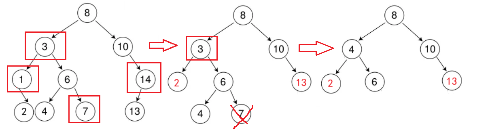
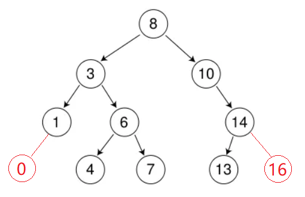
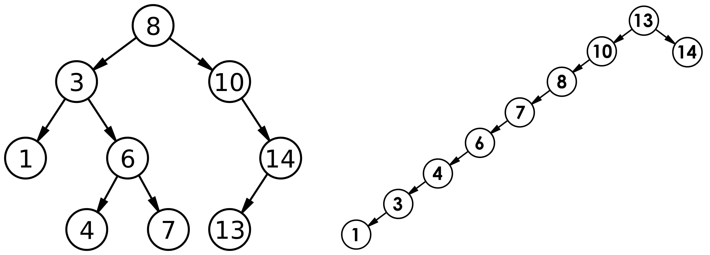

# 二叉搜索树概念

**二叉搜索树**又称**二叉排序树**，它或者是一棵**空树**，或者是具有以下性质的二叉树:

* 若它的左子树不为空，则**左子树**上所有**节点的键值都小于根节点的值**。

* 若它的右子树不为空，则右子树上所有节点的键值都**大于**根节点的值。

* 它的**左右子树也分别为二叉搜索树**。

> 这里的键值指结点间用于产生大小和顺序关系的数据。
>
> 键值不一定是数字，只要能按照某个规则区分真、假，并能用于排序（遵守全序关系，离散数学的概念），就能用于作为二叉搜索树的值。比如按照字典序排序的字符串。
>
> 反例比如`{剪刀，石头，布}`，虽然能区分大小，但不能用大小进行排序，所以不能作为二叉搜索树的值。
>
> 当然也可以**左子树**上所有**节点的键值都大于根节点的键值**，右子树上所有节点的键值都**小于**根节点的键值。可以通过修改比较规则实现。


# 二叉搜索树的应用

1. K模型：K模型即只有`Key`作为关键码，结构中只需要存储`Key`即可，关键码即为需要搜索到的值。应用时需要查找关键码`key`是否存在。

   比如：给一个单词word，判断该单词是否拼写正确，具体方式如下：以词库中所有单词集合中的每个单词作为`key`，构建一棵二叉搜索树。在二叉搜索树中检索该单词是否存在，存在则拼写正确，不存在则拼写错误。或门禁系统，都是K模型。

2. KV模型：每一个关键码key，都有与之对应的值Value，即`<Key, Value>`的键值对。该种方式在现实生活中非常常见：

   比如英汉词典就是英文与中文的对应关系，通过英文可以快速找到与其对应的中文，英文单词与其对应的中文`<word, chinese>`就构成一种键值对；

   再比如统计单词次数，统计成功后，给定单词就可快速找到其出现的次数，单词与其出现次数就是`<word, count>`就构成一种键值对。

接下来将通过模拟实现来完善二叉搜索树的操作。

# 二叉搜索树的模拟实现

二叉树的类由2个类进行交互（组合）实现：结点类和管理树的操作的类。

## K模型参考

K模型只有1个关键码`key`，可通过仿函数规定比较方式。

参考原型：

```cpp
#pragma once
#include<functional>
#include<iostream>
using std::less;
using std::swap;

template<class K>
struct Node {
	Node<K>* left;
	Node<K>* right;
	K key;

	BSTreeNode(const K& key)
		:left(nullptr)
		, right(nullptr)
		, key(key) {}
};

template<class K, class Compare = less<K> >
class BSTree {
public:
	typedef Node<K*> node;
private:
	Node<K>* root;
};
```

### 查找指定键值的结点

1. 二叉搜索树的查找

   a、从**根开始**比较，查找，键`key`比根**大则往右**边走查找，比根**小则往左**边走查找。

   b、最多查找高度次，走到到空，还没找到，这个值不存在。

有2种实现方式：递归和非递归。

非递归可根据比较器返回真还是假确定根结点迭代的方向。若找不到指定键值的结点，则一定会走到空子树。

递归实现则要设计子问题和边界条件。边界条件是遍历到空节点，子问题是遍历每个根结点的左子树和右子树。


### 插入

2. 二叉搜索树的插入

   a. 树为空，则直接新增节点，赋值给`root`指针。

   b. 树不为空，按二叉搜索树性质查找插入位置，插入新节点。搜索时不忘标记父结点。二叉搜索树不应该出现键值相同的结点，在实现时可进行规避，也可新增一个用于计数的成员进行计数。


递归思路：将根节点的左、右节点用同样的函数进行递归，相当于是将**问题转换成子问题**。**边界条件**是结点不存在或找到了。

无论是哪一个，首先要**先查找节点是否存在**，若**存在则没必要插入**，因为这里规定二叉搜索树需要避免同键值的数出现。也可以不做规定，取决于实际需要解决的问题。查找时需要标记结点的父结点。

一般情况下当前键值的结点不存在，所以可以根据**要插入结点的键值**，和**父结点的键值**进行比较来决定插入位置。递归可将父结点的左、右指针的引用传递，而非递归需要随时标记父结点。


### 删除

首先**查找键值**是否在二叉搜索树中，如果不存在，则返回。否则要删除的结点可能分下面四种情况：

 a. 要删除的结点无孩子结点。

 b. 要删除的结点只有左孩子结点。

 c. 要删除的结点只有右孩子结点。

 d. 要删除的结点有左、右孩子结点。

看起来有待删除节点有4中情况，实际情况 a 可以与情况 b 或者 c 合并起来或直接删，因此真正的删除过程：

情况 b：删除该结点，若该结点是整个树的**根结点**，则将自身的左孩子结点**更新**成**新的根结点**；否则使被删除节点的**双亲结点指向**被删除节点的**左孩子结点**。情况 a 因为无孩子结点，双亲结点指向空也不影响。

情况 c：删除该结点，若该结点是整个树的**根结点**，则将自身的右孩子结点**更新**成**新的根结点**；否则使被删除节点的**双亲结点指向**被删除结点的**右孩子结点**。

情况 d：在它的**右子树**中**寻找中序**下的**关键码最小的结点**（根据二叉搜索树的特性，这个结点即为**最左节点**），或**左子树**中**寻找中序**下的**关键码最大的结点**（**最右节点**），用它的**键值填补**到被删除节点中，再来处理该结点的删除问题。严格来说2种方式都可以。




这里删除 3 这个结点被转换成了删除 4 这个结点，相当于将情况 d 转换成情况a、b、c。

递归思路：和查找的递归结构类似，但找到后要分情况讨论：

1. 情况 b、c 的操作相对容易。将仅剩的子树接在父结点上即可。
2. 情况 d 找到**右树最左**和**左树最右**后，可以将右子树或左子树进行递归，相当于将问题又**转化成了子问题**。

所以递归实现只需要将问题分给从左子树还是从右子树中找到并删除结点就行了，而非递归要考虑的就多了，比如要删的结点刚好就是根结点，迭代时随时标记当前结点的父结点。


### 遍历和析构函数

二叉搜索树如果按照中序遍历（左根右）可以得到有序的序列。销毁二叉搜索树（析构函数）和销毁普通二叉一样借助后序遍历（左右根）。后序遍历建议使用递归实现。

例如这个二叉搜索树：




遍历参考：

```cpp
#include<iostream>
using namespace std;

struct BSTNode {
	BSTNode(const int& data = 0):left(nullptr),
		right(nullptr),data(data){}
	BSTNode* left;
	BSTNode* right;
	int data;
};

BSTNode* tree() {//现场搓一个二叉搜索树
	BSTNode* root = new BSTNode(8);
	BSTNode* t3 = new BSTNode(3);
	BSTNode* t10 = new BSTNode(10);
	BSTNode* t1 = new BSTNode(1);
	BSTNode* t6 = new BSTNode(6);
	BSTNode* t14 = new BSTNode(14);
	BSTNode* t0 = new BSTNode(0);
	BSTNode* t4 = new BSTNode(4);
	BSTNode* t7 = new BSTNode(7);
	BSTNode* t13 = new BSTNode(13);
	BSTNode* t16 = new BSTNode(16);
	root->left = t3; root->right = t10;
	t3->left = t1; t3->right = t6;
	t1->left = t0;
	t6->left = t4; t6->right = t7;
	t10->right = t14;
	t14->left = t13;t14->right = t16;
	return root;
}

void search(BSTNode* root) {//中序遍历（左根右）
	if (!root)
		return;
	if (root->left)
		search(root->left);
	cout << root->data << ' ';
	if (root->right)
		search(root->right);
}

void search_non(BSTNode* root) {//反中序遍历（右根左）
	if (!root)
		return;
	if (root->right)
		search_non(root->right);
	cout << root->data << ' ';
	if (root->left)
		search_non(root->left);
}
//后序遍历
void Delete(BSTNode* root) {
	if (!root)
		return;
	if (root->left)
		Delete(root->left);
	if (root->right)
		Delete(root->right);
	delete root;
}

int main() {
	BSTNode* t = tree();
	search(t);
	cout << endl;
	search_non(t);
	Delete(t);//用完就删，养成习惯
	return 0;
}
```

输出：

```cpp
0 1 3 4 6 7 8 10 13 14 16
16 14 13 10 8 7 6 4 3 1 0
```

二叉搜索树的遍历也可以迭代实现。详细见[二叉树链式结构及简单实现](https://blog.csdn.net/m0_73693552/article/details/143675229)。

也可以根据需要新增其他遍历方式比如层序遍历。

### 构造函数和赋值重载

构造函数分拷贝构造函数和普通构造函数。

普通构造函数个人建议实现：通过上传容器的迭代器，遍历容器并插入即可。也可以使用初始化列表，那个属于c++11的内容，后期有机会再模拟。

> 小知识，`类名()=default;`可以强制生成啥都不做的默认构造函数。`default`是c++11对已有的关键字新增新功能。

拷贝构造函数：构造函数可委托给另一个`copy(Node<K>* root)`实现，`copy`函数通过递归遍历二叉树来实现对二叉树的深拷贝。

赋值重载：根据之前的经验，赋值重载的形参可以不用引用，此时为生成形参必定会调用拷贝构造函数，这时交换根结点和当前结点即可。

### 参考实现

参考实现根据上方文档进行模拟。某 .h 文件如下：

```cpp
#pragma once
#include<functional>
#include<iostream>
using std::less;
using std::swap;
using std::cout;

//K模型
template<class K>
struct Node {
	Node<K>* left;
	Node<K>* right;
	K key;

	Node<K>(const K& key = K())
		:left(nullptr)
		, right(nullptr)
		, key(key) {}
};

template<class K, class Compare = less<K> >
class BSTree {
public:
	typedef Node<K> node;
	//查找，非递归实现
	node* find(const K& key) {
		node* p = root;
		while (p) {
			if (key == p->key)
				return p;
			else if (compare(key, p->key))//默认比较器是less，即key<p->key
				p = p->left;
			else
				p = p->right;
		}
		return nullptr;
	}

	//查找，递归实现
	node* findR(const K& key) {
		return _findR(key, root);
	}

	//插入，非递归实现
	bool insert(const K& key) {
		if (!root) {
			root = new node(key);
			return true;
		}
		node* parent = nullptr, * p = root;
		while (p) {
			parent = p;
			if (key == p->key)
				return false;
			else if (compare(key, p->key))
				p = p->left;
			else
				p = p->right;
		}
		if (compare(key, parent->key))
			parent->left = new node(key);
		else
			parent->right = new node(key);
		return true;
	}

	//插入，递归实现
	bool insertR(const K& key) {
		return _insertR(key, root);
	}

	//删除结点，非递归实现
	bool erase(const K& key) {
		node* p = root;
		node* parent = nullptr;
		while (p) {
			if (key == p->key) {
				if (!p->left) {
					if (p == root)
						root = root->right;
					else {
						//判断待删结点p的身份
						if (parent->left == p)
							parent->left = p->right;
						else
							parent->right = p->right;
					}
					delete p;
				}
				else if (!p->right) {
					if (p == root)
						root = root->left;
					else {
						//判断待删结点p的身份
						if (parent->left == p)
							parent->left = p->left;
						else
							parent->right = p->left;
					}
					delete p;
				}
				else {
					//左、右都不为空
					parent = p;
					node* limLeft = p->right;//找右子树的最左节点
					while (limLeft->left) {
						parent = limLeft;
						limLeft = limLeft->left;
					}
					swap(p->key, limLeft->key);//交换键值
					if (limLeft == parent->left)//判断待删结点p的身份
						parent->left = limLeft->right;
					else
						parent->right = limLeft->right;
					delete limLeft;
				}
				return true;
			}
			else if (compare(key, p->key)) {
				parent = p;
				p = p->left;
			}
			else {
				parent = p;
				p = p->right;
			}
		}
		return false;
	}

	//删除结点，递归实现
	bool eraseR(const K& key) {
		return _eraseR(key, root);
	}

	//构造函数
	BSTree<K, Compare>() :root(nullptr) {}

	//构造函数，遍历迭代器
	template<class InputIterator>
	BSTree<K, Compare>(InputIterator first, InputIterator last)
		: root(nullptr) {
		for (auto x = first; x != last; x++)
			insert(*x);
	}

	//拷贝构造函数
	BSTree<K, Compare>(const BSTree<K, Compare>& bst) {
		root = _copyR(bst.root);
	}

	//赋值重载
	BSTree<K, Compare> operator=(BSTree<K, Compare> tmp) {
		swap(tmp.root, this->root);
		return *this;
	}

	//析构函数
	~BSTree<K, Compare>() {
		Destroy(root);
	}
	//中序遍历
	void print() {
		printR(root);
	}


private:
	//查找函数递归实现本体
	node* _findR(const K& key, node* root) {
		if (!root)
			return nullptr;
		if (key == root->key)
			return root;
		if (compare(key, root->key))
			return _findR(key, root->left);
		else
			return _findR(key, root->right);
	}

	//插入
	bool _insertR(const K& key, node*& root) {
		if (!root) {
			root = new node(key);
			return true;
		}
		if (key == root->key)
			return false;
		else if (compare(key, root->key))
			return _insertR(key, root->left);
		else
			return _insertR(key, root->right);
	}

	//遍历
	void printR(node* root) {
		if (!root)
			return;
		printR(root->left);
		cout << root->key << ' ';
		printR(root->right);
	}

	//销毁
	void Destroy(node* root) {
		if (!root)
			return;
		Destroy(root->left);
		Destroy(root->right);
		delete root;
	}

	//删除
	bool _eraseR(const K& key, node*& root) {
		if (!root)
			return false;
		if (key == root->key) {
			if (!root->left) {
				node* del = root;
				root = root->right;
				delete del;
				return true;
			}
			else if (!root->right) {
				node* del = root;
				root = root->left;
				delete del;
				return true;
			}
			else {
				//找右子树的最左结点
				node* limLeft = root->right;
				while (limLeft->left)
					limLeft = limLeft->left;
				swap(root->key, limLeft->key);
				return _eraseR(key, root->right);//递归遍历右子树
			}
		}
		else if (compare(key, root->key))
			return _eraseR(key, root->left);
		else
			return _eraseR(key, root->right);

	}

	//拷贝
	node* _copyR(node* root) {
		if (!root)
			return nullptr;
		node* L = nullptr, * R = nullptr, * tmp = new node(root->key);
		L = _copyR(root->left);
		R = _copyR(root->right);
		tmp->left = L; tmp->right = R;
		return tmp;
	}

	Node<K>* root;
	Compare compare;
};
```

测试用的 .cpp，这里贴一个，感觉没什么用。

```cpp
#include<iostream>
#include<map>
#include<functional>
#include<vector>
#include<ctime>
#include"BSTree.h"
using namespace std;

int main() {
	vector<int>a = { 83,43,92,9,60,91,100,35,78,89 };
	BSTree<int> tree(a.begin(), a.end());
	tree.print(); cout << endl;
	tree.insert(93);
	tree.insertR(59);
	tree.print(); cout << endl;
	auto p=tree.find(60);
	auto q=tree.findR(60);
	if (p == q) {
		if(!p)
			cout << p->key << endl;
	}
	else {
		cout << "异常";
	}
	tree.erase(60);
	tree.print(); cout << endl;
	tree.eraseR(100);
	tree.print(); cout << endl;

	BSTree<int> ntree(tree);
	ntree.print(); cout << endl;
	tree.insert(110);
	ntree = tree;
	ntree.print(); cout << endl;

	return 0;
}
```


## KV模型参考

KV模型实际上就是K模型多了一个不参与修改树的值`value`。

只需要在K模型的基础上增加模版参数，将所有的`new`和部分函数的形参全部改成2个参数即可。

参考程序（某 .h 文件）：

```cpp
#pragma once
#include<functional>
#include<iostream>
using std::less;
using std::swap;
using std::cout;

//KV模型，在K模型的基础上增加了模板参数V和衍生类型
template<class K,class V>
struct Node {
	Node<K,V>* left;
	Node<K,V>* right;
	K key;
	V value;

	Node<K,V>(const K& key = K(),const V& value = V())
		:left(nullptr)
		, right(nullptr)
		, key(key) 
		, value(value){}
};

template<class K,class V, class Compare = less<K> >
class BSTree {
public:
	typedef Node<K,V> node;
	//查找，非递归实现
	//因为键值唯一，所以目前也仅支持通过键值进行查找
	node* find(const K& key) {
		node* p = root;
		while (p) {
			if (key == p->key)
				return p;
			else if (compare(key, p->key))//默认比较器是less，即key<p->key
				p = p->left;
			else
				p = p->right;
		}
		return nullptr;
	}

	//查找，递归实现
	node* findR(const K& key) {
		return _findR(key, root);
	}

	//插入，非递归实现
	bool insert(const K& key,const V& value) {
		if (!root) {
			root = new node(key,value);
			return true;
		}
		node* parent = nullptr, * p = root;
		while (p) {
			parent = p;
			if (key == p->key)
				return false;
			else if (compare(key, p->key))
				p = p->left;
			else
				p = p->right;
		}
		if (compare(key, parent->key))
			parent->left = new node(key, value);
		else
			parent->right = new node(key, value);
		return true;
	}

	//插入，递归实现
	bool insertR(const K& key, const V& value) {
		return _insertR(key, value, root);
	}

	//删除结点，非递归实现
	bool erase(const K& key) {
		node* p = root;
		node* parent = nullptr;
		while (p) {
			if (key == p->key) {
				if (!p->left) {
					if (p == root)
						root = root->right;
					else {
						//判断待删结点p的身份
						if (parent->left == p)
							parent->left = p->right;
						else
							parent->right = p->right;
					}
					delete p;
				}
				else if (!p->right) {
					if (p == root)
						root = root->left;
					else {
						//判断待删结点p的身份
						if (parent->left == p)
							parent->left = p->left;
						else
							parent->right = p->left;
					}
					delete p;
				}
				else {
					//左、右都不为空
					parent = p;
					node* limLeft = p->right;//找右子树的最左节点
					while (limLeft->left) {
						parent = limLeft;
						limLeft = limLeft->left;
					}
					swap(p->key, limLeft->key);//交换键值
					if (limLeft == parent->left)//判断待删结点p的身份
						parent->left = limLeft->right;
					else
						parent->right = limLeft->right;
					delete limLeft;
				}
				return true;
			}
			else if (compare(key, p->key)) {
				parent = p;
				p = p->left;
			}
			else {
				parent = p;
				p = p->right;
			}
		}
		return false;
	}

	//删除结点，递归实现
	bool eraseR(const K& key) {
		return _eraseR(key, root);
	}

	//构造函数
	BSTree<K,V, Compare>() :root(nullptr) {}

	//构造函数，遍历迭代器
	template<class InputIterator>
	BSTree<K,V, Compare>(InputIterator first, InputIterator last)
		: root(nullptr) {
		for (auto x = first; x != last; x++)
			insert((*x).first, (*x).second);//先解引用得到键值对，再插入
			//insert(x->first, x->second);
	}

	//拷贝构造函数
	BSTree<K,V, Compare>(const BSTree<K,V, Compare>& bst) {
		root = _copyR(bst.root);
	}

	//赋值重载
	BSTree<K,V, Compare> operator=(BSTree<K,V, Compare> tmp) {
		swap(tmp.root, this->root);
		return *this;
	}

	//析构函数
	~BSTree<K,V, Compare>() {
		Destroy(root);
	}
	//中序遍历
	void print() {
		printR(root);
	}


private:
	//查找函数递归实现本体
	node* _findR(const K& key, node* root) {
		if (!root)
			return nullptr;
		if (key == root->key)
			return root;
		if (compare(key, root->key))
			return _findR(key, root->left);
		else
			return _findR(key, root->right);
	}

	//插入
	bool _insertR(const K& key, const V& value,node*& root) {
		if (!root) {
			root = new node(key, value);
			return true;
		}
		if (key == root->key)
			return false;
		else if (compare(key, root->key))
			return _insertR(key, value, root->left);
		else
			return _insertR(key, value, root->right);
	}

	//遍历
	void printR(node* root) {
		if (!root)
			return;
		printR(root->left);
		cout << '<' << root->key << ',' << root->value << '>';
		printR(root->right);
	}

	//销毁
	void Destroy(node* root) {
		if (!root)
			return;
		Destroy(root->left);
		Destroy(root->right);
		delete root;
	}

	//删除
	bool _eraseR(const K& key, node*& root) {
		if (!root)
			return false;
		if (key == root->key) {
			if (!root->left) {
				node* del = root;
				root = root->right;
				delete del;
				return true;
			}
			else if (!root->right) {
				node* del = root;
				root = root->left;
				delete del;
				return true;
			}
			else {
				//找右子树的最左结点
				node* limLeft = root->right;
				while (limLeft->left)
					limLeft = limLeft->left;
				swap(root->key, limLeft->key);
				return _eraseR(key, root->right);//递归遍历右子树
			}
		}
		else if (compare(key, root->key))
			return _eraseR(key, root->left);
		else
			return _eraseR(key, root->right);

	}

	//拷贝
	node* _copyR(node* root) {
		if (!root)
			return nullptr;
		node* L = nullptr, * R = nullptr, * tmp = new node(root->key);
		L = _copyR(root->left);
		R = _copyR(root->right);
		tmp->left = L; tmp->right = R;
		return tmp;
	}

	Node<K,V>* root;
	Compare compare;
};
```

测试用：

```cpp
#include<iostream>
#include<map>
#include<functional>
#include<vector>
#include<ctime>
#include"BSTree.h"
using namespace std;

int main() {
	vector<pair<string, int> >a = {
		{"sakura",1},
		{"yuko",2},
		{"mokona",2},
		{"asuna",1}
	};
	BSTree<string, int>tree(a.begin(),a.end());
	tree.print(); cout << endl;
	tree.insert("tomoyo",2);
	tree.print(); cout << endl;
	tree.erase("mokona");
	tree.print(); cout << endl;
	auto p = tree.find("sakura");
	cout << p->key << endl;
	return 0;
}
```


# 二叉搜索树的性能分析

插入和删除操作都必须先查找，查找效率代表了二叉搜索树中各个操作的性能。

对有n个结点的二叉搜索树，若每个元素查找的概率相等，则二叉搜索树平均查找长度是结点在二叉搜索树的深度的函数，即结点越深，则比较次数越多。

但对于同一个关键码集合，如果各关键码插入的次序不同，可能得到不同结构的二叉搜索树：




最优情况下，二叉搜索树为完全二叉树(或者接近完全二叉树)，其平均比较次数为：$\log_2{N}$。

最差情况下，二叉搜索树退化为单支树(或者类似单支)，其平均比较次数为：$\frac{N}{2}$。

如果退化成单支树，二叉搜索树的性能就失去了。此时需要将二叉搜索树改造为平衡树（AVL树）和红黑树。

平衡树和红黑树本质都是为了尽量避免二叉搜索树变成单支树。


# 可能有关的OJ

## 606. 根据二叉树创建字符串 - 力扣（LeetCode）

[606. 根据二叉树创建字符串 - 力扣（LeetCode）](https://leetcode.cn/problems/construct-string-from-binary-tree/description/)

首先通过前序遍历建立字符串，然后摘除叶结点多出来的`()()`和右空树的`()`。这也是最笨的办法。

```cpp
/**
 * Definition for a binary tree node.
 * struct TreeNode {
 *     int val;
 *     TreeNode *left;
 *     TreeNode *right;
 *     TreeNode() : val(0), left(nullptr), right(nullptr) {}
 *     TreeNode(int x) : val(x), left(nullptr), right(nullptr) {}
 *     TreeNode(int x, TreeNode *left, TreeNode *right) : val(x), left(left), right(right) {}
 * };
 */
class Solution {
public:
    string rtree(TreeNode* root){
        if(!root)
            return ")";
        string st;
        st+=to_string(root->val);
        st+='('+rtree(root->left);
        st+='('+rtree(root->right);
        return st+')';
    }
    string tree2str(TreeNode* root) {
        if(!root->left&&!root->right)
            return to_string(root->val);
        string st= rtree(root);
        st.pop_back();
        //排除叶结点
        size_t p=st.find("()()");
        while(p!=-1){
            st.erase(p,4);
            p=st.find("()()",p+1);
        }
        //排除右空树
        p=st.find("()");
        while(p!=-1){
            if(st[p-1]==')')
                st.erase(p,2);
            p=st.find("()",p+1);
        }
        return st;
    }
};
```

也可以只做前序遍历，在之前的基础上做一些判断：

因为题意要求对左子树空，右子树非空的结点，表示左子树的括号保留，所以在递归遍历左子树时可用或运算进行判断：`root->left||root->right`。

右子树为空则不用加括号。或者直接不进行递归。

```cpp
/**
 * Definition for a binary tree node.
 * struct TreeNode {
 *     int val;
 *     TreeNode *left;
 *     TreeNode *right;
 *     TreeNode() : val(0), left(nullptr), right(nullptr) {}
 *     TreeNode(int x) : val(x), left(nullptr), right(nullptr) {}
 *     TreeNode(int x, TreeNode *left, TreeNode *right) : val(x), left(left), right(right) {}
 * };
 */
class Solution {
public:
    TreeNode* firstroot;
    void rtree(string&ans,TreeNode* root){
        if(!root){
            ans+=')';
            return;
        }
        ans+=to_string(root->val);
        if(root->left||root->right){
            ans+='(';
            rtree(ans,root->left);
        }
        if(root->right){
            ans+='(';
            rtree(ans,root->right);
        }
        if(root!=firstroot)//当递归回溯到根结点时不用补充)
            ans+=')';
    }
    string tree2str(TreeNode* root) {
        firstroot=root;
        string ans;
        rtree(ans,root);
        return ans;
    }
};
```


## 102. 二叉树的层序遍历 - 力扣（LeetCode）

[102. 二叉树的层序遍历 - 力扣（LeetCode）](https://leetcode.cn/problems/binary-tree-level-order-traversal/description/)

给2个变量`lr`和`nlr`，分别表示当前层的最右节点和下一层的最右结点。进行bfs时，每次结点入队时都更新下一行的最右结点。若当前结点被判断出是`lr`，则将已更新过的`nlr`赋值给`lr`。

```cpp
/**
 * Definition for a binary tree node.
 * struct TreeNode {
 *     int val;
 *     TreeNode *left;
 *     TreeNode *right;
 *     TreeNode() : val(0), left(nullptr), right(nullptr) {}
 *     TreeNode(int x) : val(x), left(nullptr), right(nullptr) {}
 *     TreeNode(int x, TreeNode *left, TreeNode *right) : val(x), left(left), right(right) {}
 * };
 */
class Solution {
public:
    vector<vector<int>> levelOrder(TreeNode* root) {
        vector<vector<int>>ans;
        if(!root)
            return ans;
        queue<TreeNode*>q;
        q.push(root);
        TreeNode* lr=root,*nlr=nullptr;//next last right，下一层的最右结点
        vector<int>a;
        while(!q.empty()){
            TreeNode* tmp=q.front();
            a.push_back(tmp->val);
            q.pop();
            if(tmp->left){
                nlr=tmp->left;
                q.push(tmp->left);
            }
            if(tmp->right){
                nlr=tmp->right;
                q.push(tmp->right);
            }
            if(tmp==lr){
                ans.push_back(a);
                a.clear();
                lr=nlr;
            }
        }
        return ans;
    }
};
```


## 107. 二叉树的层序遍历 II - 力扣（LeetCode）

[107. 二叉树的层序遍历 II - 力扣（LeetCode）](https://leetcode.cn/problems/binary-tree-level-order-traversal-ii/description/)

在“102. 二叉树的层序遍历 - 力扣（LeetCode）”的基础上，将最后的数组进行逆置即可。

```cpp
/**
 * Definition for a binary tree node.
 * struct TreeNode {
 *     int val;
 *     TreeNode *left;
 *     TreeNode *right;
 *     TreeNode() : val(0), left(nullptr), right(nullptr) {}
 *     TreeNode(int x) : val(x), left(nullptr), right(nullptr) {}
 *     TreeNode(int x, TreeNode *left, TreeNode *right) : val(x), left(left), right(right) {}
 * };
 */
class Solution {
public:
    vector<vector<int>> levelOrderBottom(TreeNode* root) {
        vector<vector<int>>ans;
        if(!root)
            return ans;
        queue<TreeNode*>q;
        q.push(root);
        TreeNode* lr=root,*nlr=nullptr;//next last right，下一层的最右结点
        vector<int>a;
        while(!q.empty()){
            TreeNode* tmp=q.front();
            a.push_back(tmp->val);
            q.pop();
            if(tmp->left){
                nlr=tmp->left;
                q.push(tmp->left);
            }
            if(tmp->right){
                nlr=tmp->right;
                q.push(tmp->right);
            }
            if(tmp==lr){
                ans.push_back(a);
                a.clear();
                lr=nlr;
            }
        }
        // int l=0,r=ans.size()-1;
        // while(l<r)
        //     swap(ans[l++],ans[r--]);
        reverse(ans.begin(),ans.end());
        return ans;
    }
};
```


## 236. 二叉树的最近公共祖先 - 力扣

[236. 二叉树的最近公共祖先 - 力扣（LeetCode）](https://leetcode.cn/problems/lowest-common-ancestor-of-a-binary-tree/description/)

对父子结点，题目认为最近公共祖先是父结点。

对这个题有这几种场景：

1. 俩结点中有一个是根结点，此时直接返回根结点即可。
2. 俩结点一个在左子树，一个在右子树，此时`root`也就是根结点即为最近公共祖先。
3. 都在左子树，或都在右子树，则进行递归处理。

对所有场景进行讨论即可。但讨论前需要先实现一个函数，判断结点在哪个子树。这也是最笨的办法，相当于先遍历了一遍左、右子树，然后再递归处理，对部分节点进行了重复处理，能过OJ但效率比较低。

```cpp
/**
 * Definition for a binary tree node.
 * struct TreeNode {
 *     int val;
 *     TreeNode *left;
 *     TreeNode *right;
 *     TreeNode(int x) : val(x), left(NULL), right(NULL) {}
 * };
 */
class Solution {
public:
    bool isTree(TreeNode* root,TreeNode*x){//暴力查找dfs
        if(!root)
            return false;
        if(root==x)
            return true;
        return isTree(root->left,x)||isTree(root->right,x);
    }
    TreeNode* lowestCommonAncestor(TreeNode* root, TreeNode* p, TreeNode* q) {
        if(root==p||root==q)//p、q是父子关系
            return root;
        bool pInLeft=isTree(root->left,p);
        bool pInRight=!pInLeft;//p、q均在树中为前提条件
        
        bool qInLeft=isTree(root->left,q);
        bool qInRight=!qInLeft;

        //一个在左，一个在右
        if((pInLeft&&qInRight)||(qInLeft&&pInRight)){
            return root;
        }

        //在同侧
        if(pInLeft&&qInLeft){
            return lowestCommonAncestor(root->left,p,q);
        }
        if(pInRight&&qInRight){
            return lowestCommonAncestor(root->right,p,q);
        }
        return nullptr;
    }
};
```


可以尝试从路径入手：

利用前序遍历，找到根结点到`p`、`q`的路径，找到2个路径的最后一个相交点即可。其中找结点位置时可进行剪枝：若找到结点，则没有必要再进行递归函数。

```cpp
/**
 * Definition for a binary tree node.
 * struct TreeNode {
 *     int val;
 *     TreeNode *left;
 *     TreeNode *right;
 *     TreeNode(int x) : val(x), left(NULL), right(NULL) {}
 * };
 */
class Solution {
public:
    bool dfs(TreeNode* root,TreeNode*p,stack<TreeNode*>&sk){
        if(!root)
            return false;
        sk.push(root);
        if(root==p)
            return true;
        if(dfs(root->left,p,sk))
            return true;
        if(dfs(root->right,p,sk))
            return true;
        sk.pop();
        return false;
    }
    TreeNode* lowestCommonAncestor(TreeNode* root, TreeNode* p, TreeNode* q) {
        
        stack<TreeNode*>sp,sq;
        dfs(root,p,sp);
        dfs(root,q,sq);
        while(sp.size()!=sq.size()){
            while(sp.size()>sq.size())
                sp.pop();
            while(sp.size()<sq.size())
                sq.pop();
        }
        while(sp.size()&&sp.top()!=sq.top()){
            sq.pop();
            sp.pop();
        }
        return sq.top();
    }
};
```


## 二叉搜索树与双向链表 牛客网

[二叉搜索树与双向链表_牛客题霸_牛客网](https://www.nowcoder.com/practice/947f6eb80d944a84850b0538bf0ec3a5?tpId=13&&tqId=11179&rp=1&ru=/activity/oj&qru=/ta/coding-interviews/question-ranking)

首先是最笨的办法：先通过中序遍历得到每个指针在连续数组中的位置，再遍历整个数组进行调整。

这个方法其实是不符合要求的，因为开了额外的数组，空间复杂度是$O(n)$。在这个OJ能过，但若真遇到现实问题时可能不能用。

```cpp
/*
struct TreeNode {
	int val;
	struct TreeNode *left;
	struct TreeNode *right;
	TreeNode(int x) :
			val(x), left(NULL), right(NULL) {
	}
};*/
class Solution {
public:
	vector<TreeNode*>a;
	void dfs(TreeNode* root){
		if(!root)
			return;
		dfs(root->left);
		a.push_back(root);
		dfs(root->right);
	}
    TreeNode* Convert(TreeNode* pRootOfTree) {
		if(!pRootOfTree)
			return nullptr;
        dfs(pRootOfTree);
		for(int i=0;i<a.size();i++){
			if(i==0)
				a[i]->right=a[i+1];
			else if(i==a.size()-1)
				a[i]->left=a[i-1];
			else{
				a[i]->left=a[i-1];
				a[i]->right=a[i+1];
			}
		}
		return a[0];
    }
};

```

其他解法：

首先回想二叉搜索树的性质，找找看有没有能用的。

比如中序遍历可以得到有序的序列。若在中序遍历（递归）的途中，将上一个结点传回当前层的递归，即可对当前结点和前一个结点的成员指针进行操作。

传回过程可通过引用实现，左子树发生的一切和后续节点的递归无关。如此便完成了二叉搜索树的改造。寻找头结点可通过双向链表的特性去寻找。

```cpp
/*
struct TreeNode {
	int val;
	struct TreeNode *left;
	struct TreeNode *right;
	TreeNode(int x) :
			val(x), left(NULL), right(NULL) {
	}
};*/
class Solution {
public:
	TreeNode* head=nullptr;
	void dfs(TreeNode* root,TreeNode*&ref){
		if(!root)
			return;
		dfs(root->left,ref);
		root->left=ref;
		if(ref)
			ref->right=root;
		ref=root;
		dfs(root->right,ref);
	}
	
    TreeNode* Convert(TreeNode* pRootOfTree) {
		if(!pRootOfTree)
			return nullptr;
		TreeNode* p=nullptr;
		dfs(pRootOfTree,p);
		while(pRootOfTree->left)
			pRootOfTree=pRootOfTree->left;
		return pRootOfTree;
    }
};

```

理解这个代码需要画图理解。


## 105. 从前序与中序遍历序列构造二叉树 - 力扣

[105. 从前序与中序遍历序列构造二叉树 - 力扣（LeetCode）](https://leetcode.cn/problems/construct-binary-tree-from-preorder-and-inorder-traversal/description/)

前序序列的首元素为二叉树的根结点，因此可以这样做：

1. 在中序序列中找到根结点的位置（下标索引）。

2. 根据位置判断出左子树的结点数，进行递归，递归函数返回根结点。

3. 根据位置判断出右子树的结点数，进行递归，递归函数返回根结点。
4. 生成根结点，进行链接后当前递归函数返回根结点。

整体呈后序遍历的结构。

```cpp
/**
 * Definition for a binary tree node.
 * struct TreeNode {
 *     int val;
 *     TreeNode *left;
 *     TreeNode *right;
 *     TreeNode() : val(0), left(nullptr), right(nullptr) {}
 *     TreeNode(int x) : val(x), left(nullptr), right(nullptr) {}
 *     TreeNode(int x, TreeNode *left, TreeNode *right) : val(x), left(left), right(right) {}
 * };
 */
class Solution {
public:
    TreeNode* head=nullptr;
    TreeNode* dfs(vector<int>&a,vector<int>&b,int l1,int r1,int l2,int r2){
        int pl=find(b.begin(),b.end(),a[l1])-b.begin();
        TreeNode*L=nullptr,*R=nullptr;
        if(pl>l2)
            L=dfs(a,b,l1+1,l1+pl-l2,l2,pl-1);//从2个数组中分离出左子树
        if(pl<r2)
            R=dfs(a,b,l1+pl-l2+1,r1,pl+1,r2);//从2个数组中分离出右子树
        TreeNode*tmp=new TreeNode(a[l1]);
        tmp->left=L;tmp->right=R;
        return tmp;
    }

    TreeNode* buildTree(vector<int>& preorder, vector<int>& inorder) {
        return dfs(preorder,inorder,0,preorder.size()-1,0,inorder.size()-1);
    }
};
```


## 106. 从中序与后序遍历序列构造二叉树 - 力扣

[106. 从中序与后序遍历序列构造二叉树 - 力扣（LeetCode）](https://leetcode.cn/problems/construct-binary-tree-from-inorder-and-postorder-traversal/description/)

和 “105. 从前序与中序遍历序列构造二叉树 - 力扣” 一样的原理，但不同的是后序遍历的根是子树的最后一个结点。

```cpp
/**
 * Definition for a binary tree node.
 * struct TreeNode {
 *     int val;
 *     TreeNode *left;
 *     TreeNode *right;
 *     TreeNode() : val(0), left(nullptr), right(nullptr) {}
 *     TreeNode(int x) : val(x), left(nullptr), right(nullptr) {}
 *     TreeNode(int x, TreeNode *left, TreeNode *right) : val(x), left(left), right(right) {}
 * };
 */
class Solution {
public:
    TreeNode* dfs(vector<int>&b,vector<int>&c,
    int l1,int r1,
    int l2,int r2){
        //使用算法库algorithm中的工具find
        int pl=find(b.begin(),b.end(),c[r2])-b.begin();
        TreeNode* L=nullptr,*R=nullptr;
        if(pl>l1)
            L=dfs(b,c,l1,pl-1,l2,l2+pl-l1-1);
        if(pl<r1)
            R=dfs(b,c,pl+1,r1,l2+pl-l1,r2-1);
        TreeNode*tmp=new TreeNode(c[r2]);
        tmp->left=L;tmp->right=R;
        return tmp;
    }
    TreeNode* buildTree(vector<int>& inorder, vector<int>& postorder) {
        return dfs(inorder,postorder, 0,inorder.size()-1, 0,postorder.size()-1);
    }
};
```

无法通过前序和后续遍历序列构建唯一二叉树，因为左、右子树无法确定。除非前序遍历序列和后序遍历序列给出空节点的信息。

## 144. 二叉树的前序遍历 - 力扣

[144. 二叉树的前序遍历 - 力扣（LeetCode）](https://leetcode.cn/problems/binary-tree-preorder-traversal/description/)

递归实现。

```cpp
/**
 * Definition for a binary tree node.
 * struct TreeNode {
 *     int val;
 *     TreeNode *left;
 *     TreeNode *right;
 *     TreeNode() : val(0), left(nullptr), right(nullptr) {}
 *     TreeNode(int x) : val(x), left(nullptr), right(nullptr) {}
 *     TreeNode(int x, TreeNode *left, TreeNode *right) : val(x), left(left), right(right) {}
 * };
 */
class Solution {
public:
    void preOrder(TreeNode* root,vector<int>&a){
        if(!root) return;
        a.push_back(root->val);
        preOrder(root->left,a);
        preOrder(root->right,a);
    }
    vector<int> preorderTraversal(TreeNode* root) {
        vector<int>a;
        preOrder(root,a);
        return a;
    }
};
```

非递归实现：

```cpp
/**
 * Definition for a binary tree node.
 * struct TreeNode {
 *     int val;
 *     TreeNode *left;
 *     TreeNode *right;
 *     TreeNode() : val(0), left(nullptr), right(nullptr) {}
 *     TreeNode(int x) : val(x), left(nullptr), right(nullptr) {}
 *     TreeNode(int x, TreeNode *left, TreeNode *right) : val(x), left(left), right(right) {}
 * };
 */
class Solution {
public:
    void preOrder(TreeNode* root,vector<int>&a){
        if(!root) return;
        stack<TreeNode*>sk;
        TreeNode* p=root;
        while(p||sk.size()){
            while(p){
                a.push_back(p->val);
                sk.push(p);//根
                p=p->left;//左
            }
            p=sk.top(); sk.pop();//模拟回溯
            p=p->right;//右
        }
    }
    vector<int> preorderTraversal(TreeNode* root) {
        vector<int>a;
        preOrder(root,a);
        return a;
    }
};
```


## 94. 二叉树的中序遍历 - 力扣

[94. 二叉树的中序遍历 - 力扣（LeetCode）](https://leetcode.cn/problems/binary-tree-inorder-traversal/description/)

递归实现：

```cpp
/**
 * Definition for a binary tree node.
 * struct TreeNode {
 *     int val;
 *     TreeNode *left;
 *     TreeNode *right;
 *     TreeNode() : val(0), left(nullptr), right(nullptr) {}
 *     TreeNode(int x) : val(x), left(nullptr), right(nullptr) {}
 *     TreeNode(int x, TreeNode *left, TreeNode *right) : val(x), left(left), right(right) {}
 * };
 */
class Solution {
public:
    void inOrder(TreeNode* root,vector<int>&a){
        if(!root) return;
        inOrder(root->left,a);
        a.push_back(root->val);
        inOrder(root->right,a);
    }
    vector<int> inorderTraversal(TreeNode* root) {
        vector<int>a;
        inOrder(root,a);
        return a;
    }
};
```

非递归实现

```cpp
/**
 * Definition for a binary tree node.
 * struct TreeNode {
 *     int val;
 *     TreeNode *left;
 *     TreeNode *right;
 *     TreeNode() : val(0), left(nullptr), right(nullptr) {}
 *     TreeNode(int x) : val(x), left(nullptr), right(nullptr) {}
 *     TreeNode(int x, TreeNode *left, TreeNode *right) : val(x), left(left), right(right) {}
 * };
 */
class Solution {
public:
    vector<int> inorderTraversal(TreeNode* root) {
        vector<int>a;
        stack<TreeNode*>sk;
        TreeNode* p=root;
        while(p||sk.size()){
            while(p){
                sk.push(p);
                p=p->left;
            }
            p=sk.top();sk.pop();
            a.push_back(p->val);
            p=p->right;
        }
        return a;
    }
};
```


## 145. 二叉树的后序遍历 - 力扣

[145. 二叉树的后序遍历 - 力扣（LeetCode）](https://leetcode.cn/problems/binary-tree-postorder-traversal/description/)

递归实现

```cpp
/**
 * Definition for a binary tree node.
 * struct TreeNode {
 *     int val;
 *     TreeNode *left;
 *     TreeNode *right;
 *     TreeNode() : val(0), left(nullptr), right(nullptr) {}
 *     TreeNode(int x) : val(x), left(nullptr), right(nullptr) {}
 *     TreeNode(int x, TreeNode *left, TreeNode *right) : val(x), left(left), right(right) {}
 * };
 */
class Solution {
public:
    void postOrder(TreeNode* root,vector<int>&a){
        if(!root) return;
        postOrder(root->left,a);
        postOrder(root->right,a);
        a.push_back(root->val);
    }
    vector<int> postorderTraversal(TreeNode* root) {
        vector<int>a;
        postOrder(root,a);
        return a;
    }
};
```

非递归实现：

个人思路：在每个根结点需要回溯2次后才能出栈。于是对每个入栈的结点附加一个访问次数标记的变量，当回溯次数达到2次后出栈。

```cpp
/**
 * Definition for a binary tree node.
 * struct TreeNode {
 *     int val;
 *     TreeNode *left;
 *     TreeNode *right;
 *     TreeNode() : val(0), left(nullptr), right(nullptr) {}
 *     TreeNode(int x) : val(x), left(nullptr), right(nullptr) {}
 *     TreeNode(int x, TreeNode *left, TreeNode *right) : val(x), left(left), right(right) {}
 * };
 */
class Solution {
public:
    struct treeNode{
        TreeNode* p;//组合，也可以用继承
        int times;
        treeNode(TreeNode* _p=nullptr,int _times=0){
            p=_p;times=_times;
        }
    };
    vector<int> postorderTraversal(TreeNode* root) {
        vector<int>a;
        if(!root)
            return a;
        stack<treeNode>sk;
        TreeNode*p=root;
        while(p||sk.size()){
            while(p){
                sk.push({p,0});
                p=p->left;
            }
            p=sk.top().p; sk.top().times++;
            while(sk.top().times>1){
                a.push_back(sk.top().p->val); sk.pop();
                if(sk.empty()) break;
                p=sk.top().p; sk.top().times++;
            }
            if(sk.empty()) break;
            p=p->right;
        }
        return a;
    }
};
```

还有一种思路：

每个结点第2次回溯时都有2个特点：

1. 回溯的结点的右子树为空。
2. 上一个访问的结点是当前结点的右节点。

于是引进新的变量`prev`表示上次访问的结点。当遍历左子树到尽头时进行判断，若满足上述2个特点就出栈，否则继续遍历右子树。

```cpp
/**
 * Definition for a binary tree node.
 * struct TreeNode {
 *     int val;
 *     TreeNode *left;
 *     TreeNode *right;
 *     TreeNode() : val(0), left(nullptr), right(nullptr) {}
 *     TreeNode(int x) : val(x), left(nullptr), right(nullptr) {}
 *     TreeNode(int x, TreeNode *left, TreeNode *right) : val(x), left(left), right(right) {}
 * };
 */
class Solution {
public:
    vector<int> postorderTraversal(TreeNode* root) {
        vector<int>a;
        if(!root)
            return a;
        stack<TreeNode*>sk;
        //prev用于标记上个访问的结点
        TreeNode*p=root,*prev=nullptr;
        while(p||sk.size()){
            while(p){
                sk.push(p);
                p=p->left;
            }
            //出栈停止回溯的2个条件：右子树不存在或上个访问的结点即为右子树
            if(!sk.top()->right||sk.top()->right==prev){
                a.push_back(sk.top()->val);
                prev=sk.top();
                sk.pop();
            }
            else
                p=sk.top()->right;
        }
        return a;
    }
};
```


