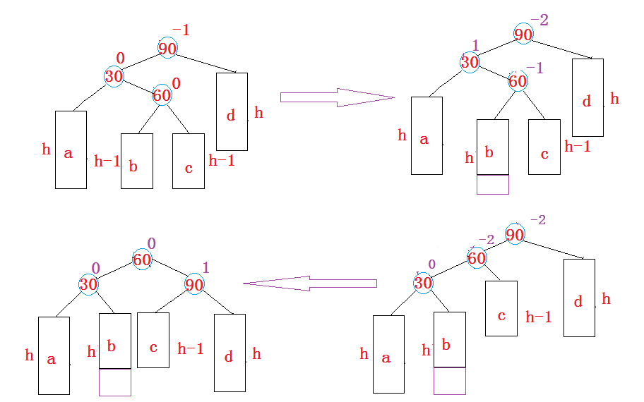
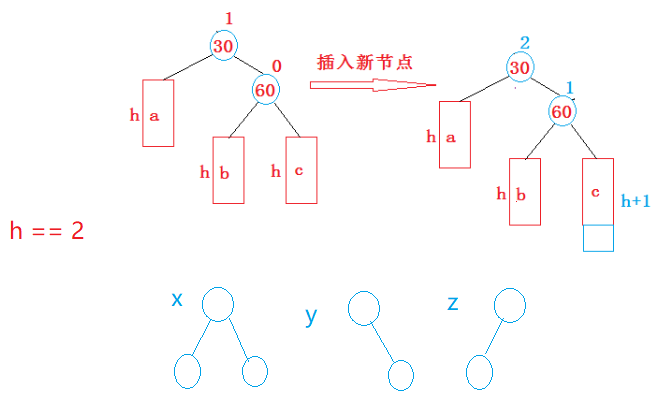

# AVL树的概念

二叉搜索树虽可以缩短查找的效率，但如果**数据有序**或**接近有序**二叉搜索树将**退化为单支树**，查找元素相当于在顺序表中搜索元素，效率低下。

因此，两位俄罗斯的数学家G.M.Adelson-Velskii和E.M.Landis在1962年发明了一种解决上述问题的方法：当向二叉搜索树中插入新结点后，如果能保证每个结点的**左右子树高度之差的绝对值不超过**1（需要对树中的结点进行调整，高度差为0无法表示所有情况），即可降低树的高度，从而减少平均搜索长度，所以就有了AVL树（AVL取自2位俄罗斯数学家的姓氏首字母）。

一棵AVL树或者是空树，或者是具有以下性质的二叉搜索树：

* 它的左右子树都是AVL树

* 左右子树高度之差（简称**平衡因子**）的绝对值不超过1。
  
  平衡因子可以是`{-1,0,1}`，
  计算方式为 **右子树树高** $-$ **左子树树高**，也可以为左子树树高 $-$ 右子树树高，本文以第1种方式模拟实现。需要注意的是平衡因子只是实现方式并不是必须。


如果一棵二叉搜索树是高度平衡的，它就是AVL树。如果它有n个结点，其高度可保持在

$\text{O}(\log_2 n)$，搜索时间复杂度$\text{O}(\log_2 n)$。


# 模拟实现AVL树

AVL树就是在**二叉搜索树**的基础上**引入了平衡因子**，因此AVL树也可以看成是二叉搜索树。那么AVL树的插入过程可以分为两步：

1. 按照二叉搜索树的方式插入新节点。

2. 调整节点的平衡因子。

这里以AVL树的K模型为例进行实现。

参考原型：

```cpp
//AVL树K模型
template<class K>
struct Node {
	Node<K>* left;
	Node<K>* right;
	Node<K>* parent;
	K key;
	int bf;//在二叉搜索树的基础上引入平衡因子

	Node<K>(const K& key = K())
		:left(nullptr)
		, right(nullptr)
		, parent(nullptr);
		, key(key) 
		, bf(0) {}
};

template<class K, class Compare = less<K> >
class AVLTree {
public:
	typedef Node<K> node;
private:
    node* root;
	Compare compare;
};
```


## 继承二叉搜索树

AVL树也是二叉搜索树的一种，因此很多功能可以直接继承二叉搜索树。

例如：查找指定键值的结点、遍历、析构函数、构造函数、赋值重载，甚至是K模型还是KV模型。

详细参考[二叉搜索树](https://blog.csdn.net/m0_73693552/article/details/149392031?spm=1001.2014.3001.5501)，这里重点介绍AVL树的插入、删除结点的部分。


##  AVL树的插入

首先是二叉搜索树的插入模式：

1. 检查最开始的根结点是否为空，为空则新插入的结点即为根结点。
2. 根据键值找到最合适的子树根结点。
3. 根据键值插入结点。若是平衡树，则还要指定父结点。

新节点插入后，需要**更新平衡因子并检查**AVL树的平衡性是否遭到破坏。

> 因为**新增结点可能会影响祖先的平衡因子**。此时就需要**更新父结点和祖先的平衡因子**，并**检测**是否破坏了AVL树的平衡性。

在插入之前，父结点的平衡因子分为三种情况：$\{-1,0,1\}$, 分以下两种情况：

1. 如果结点插入到父结点的**左侧**，只需给父结点的**平衡因子减**1即可。
2. 如果结点插入到父结点的**右侧**，只需给父结点的**平衡因子加**1即可。

插入结点后，父结点的平衡因子可能变成三种情况：0，$\pm 1$， $\pm 2$。

* 如果父结点的平衡因子为0，说明插入之前父结点的平衡因子开始为$\pm 1$，插入后被调整成0，此时满足AVL树的性质，插入成功，可直接结束插入函数。
* 如果父结点的平衡因子为$\pm 1$，说明插入前父结点的平衡因子开始一定为0，插入后被更新成$\pm 1$，此时以父结点为根的树的高度增加，需要**继续向上更新**。
* 如果父结点的平衡因子为$\pm 2$，则父结点的平衡因子违反平衡树的性质，需要对其进行旋转处理。

所以旋转的目的：1、从不平衡，变成平衡子树；2、旋转本质也降低了高度（最好将平衡因子变成0）。旋转完成后不必再更新。

根据结点的插入位置，可分成4种情况。

### 高左子树左侧：右单旋

如果在一棵原本是平衡的AVL树中插入一个新节点，可能造成不平衡，此时必须调整树的结构，使之平衡化。根据节点插入位置的不同，AVL树的旋转分为四种：

1. 新节点插入**较高左子树**的左侧——左左：右单旋。


上图的AVL树在插入前是平衡的，新节点**插入**到30的**左子树**（注意：此处不是左孩子）中，30左子树增加了一层，导致以60为根的二叉树**不平衡**，要让60平衡，只能将60这个**不平衡的结点的左子树**的高度**减少一层**，**右子树增加一层**。

即将**左子树往上提**，这样60转下来，因为60比30大，只能将其放在30的右子树，而如果30有右子树，右子树根的值一定大于30，小于60，只能将其放在60的左子树，**旋转完成**后，**更新节点的平衡因子**即可。在旋转过程中，有以下几种情况需要考虑：

1. 30节点的右孩子可能存在，也可能不存在。即$h=0$的情况，这种情况需要考虑。

2. 60可能是根节点，也可能是子树

   如果是根节点，旋转完成后，要更新根节点

   如果是子树，可能是某个节点的左子树，也可能是右子树

总结：


右单旋思路总结：

0. 平衡因子为 -2 的结点，左子树根为 -1 的结点，说明左子树过高，需要进行右单旋。

1. 平衡因子为 -2 的结点（权值为60的结点），它的左子树（权值为30的结点）的右子树（b子树）变成它的左子树。
2. 平衡因子为 -2 的结点，变成它的左子树的右子树。原平衡因子为2的结点的父结点更新。

3. 原平衡因子为 -2 的结点，因为接入了高度和右子树相等的左子树，平衡因子变成0。
4. 原平衡因子为 -2 的结点的左节点（权值为30的结点），因平衡因子为2的结点变成了它的右子树，自身的平衡因子也变成了0。
5. 旋转完成后不必再往上更新。

之后的操作只有类似的总结，不再具体分析。

### 高右子树右侧：左单旋

新节点插入较高右子树的右侧---右右：左单旋


左单旋思路总结：

0. 平衡因子为 2 的结点，右子树根为 1 的结点，说明右子树过高，需要进行右单旋。
1. 平衡因子为 2 的结点（权值为30的结点），它的右子树（权值为60的结点）的左子树（b子树）变成它的右子树。
2. 平衡因子为 2 的结点，变成它的右子树的左子树。树的根发生变换。
3. 原平衡因子为 2 的结点，因为接入了高度和左子树相等的右子树，平衡因子变成 0。
4. 原平衡因子为 2 的结点的右节点，因平衡因子为2的结点变成了它的左子树，自身的平衡因子也变成了 0。


### 高左子树的右侧：先左单旋再右单旋

新节点插入**较高左子树的右侧**——左右：先左单旋再右单旋。

而且会在权值为60结点的左、右子树之一（即b子树或c子树）新增结点，此时都可以总结成以下抽象图。



若$h=0$，则$b$、$c$不可能都是平衡因子为 -1 的情况下，还是同一个结点的子节点，因此$h=0$时，权值为60的结点实际上就是新增的结点，因为这个结点导致树不平衡，在实现旋转函数时需要做额外判断。

先左后右思路总结：

0. 平衡因子为 -2 的结点（权值为90的结点），左子树根为 1 ，说明左子树过高，且还是在左子树的右子树插入了新结点。
1. 先对平衡因子为 -2 的结点的左子树（权值为30的结点）进行左单旋。
2. 后对原平衡因子为 -2 的结点进行右单旋。
3. 根据插入结点的位置更新被标记的3个结点的平衡因子。可提前预设一个变量用于存储平衡因子为 -2 的结点的左子树的右子树的平衡因子（权值为60的结点），根据此点的平衡因子判断结点插入在 b 子树还是 c 子树。


### 高右子树的左侧：先右单旋再左单旋

新节点插入较高右子树的左侧——右左：先右单旋再左单旋


先左后右思路总结：

0. 平衡因子为 2 的结点（权值为30的结点），右子树根为 -1 ，说明右子树过高，且还是在右子树的左子树插入了新结点。
1. 先对平衡因子为 2 的结点的右子树（权值为90的结点）进行右单旋。
2. 后对原平衡因子为 2 （权值为30的结点）的结点进行左单旋。
3. 根据插入结点的位置更新被标记的3个结点的平衡因子。可提前预设一个变量用于存储平衡因子为 -2 的结点的左子树的右子树的平衡因子（权值为60的结点），根据此点的平衡因子判断结点插入在 b 子树还是 c 子树。

### 非重点：不平衡的情况讨论

> 这里是道听途说和自己的分析，不是重点，可跳过。

以对这种情况的AVL树，在右子树插入结点进行讨论，$h={0,1}$时的情况相对比较好确认。


但$h=2$时，情况就变得复杂。如图所示。



首先$c$这个子树只能是$x$，因为只有$c$子树的结构是$x$，插入任一结点，才能使30这个节点的平衡因子变成2。

然后$a$、$b$因为不插入新结点，只需满足子树高为2即可，所以可$a$、$b$可以是$\{x,y,z\}$之一。

根据乘法原理，当$a$、$b$、$c$的树高为$2$时，AVL树有$3\times3=9$种，在$c$有4种插入结点的方法，总的不平衡情况有 36 种。

若$h=3$，情况只会更复杂，按照$h=2$的分析方式分析，$h=3$的满二叉树有4个叶结点，缺叶结点的情况总共有$\sum\limits_{i=0}^{3}C_4^i=15$种，而用于插入结点的 $c$ 子树只能是满二叉树，否则插入结点后树高不能是$h+1$，无法打破平衡。

因此$h=3$时总共有$15\times15\times4=900$种不平衡的情况。这还是右单旋和左单旋的场景，进行2次旋转的场景的情况还要更多。

$h=4$、$h=5$的情况更复杂就不分析，


## AVL树的验证

AVL树是在二叉搜索树的基础上加入了平衡性的限制，因此要验证AVL树，可以分两步：

1. 验证其为二叉搜索树

   如果中序遍历可得到一个有序的序列，就说明为二叉搜索树。

2. 验证其为平衡树

   每个节点子树高度差的绝对值不超过1(注意节点中如果没有平衡因子)节点的平衡因子是否计算正确。

## AVL树的删除

因为AVL树也是二叉搜索树，可按照二叉搜索树的方式将节点删除。

若是析构函数的设计，可直接通过后序遍历实现。但若只删一个结点，则删完后还要保证树还是AVL树。

所以还要再从被删除的结点的父结点开始更新祖先的平衡因子，只不过与插入不同的是，删除节点后的平衡因子更新，最差情况下一直要调整到根节点的位置。

当发现平衡因子为2的场景时，需要对二叉树进行旋转。但毕竟不是插入的场景，删除结点时无法对所有情况进行比较好的归纳总结。例如如下的AVL树在删除结点后各结点的平衡因子变化，可以发现不能和插入时一样根据结点的具体平衡因子数值进行判断。


因为旋转的目的是降低高度，所以当出现平衡因子为$\pm 2$的结点时，需要使这个结点的平衡因子降低。

这里直接说所有情况的结论：

1. 若某结点的平衡因子为  2，它的右子树的平衡因子 $\geq 0$，则进行左单旋。


2. 若某结点的平衡因子为 -2，它的左子树的平衡因子 $\leq 0$，则进行右单旋。上图就是这种情况。


3. 若某结点的平衡因子为  2，它的右子树的平衡因子 $< 0$，则先进行右单旋，再进行左单旋。


4. 若某结点的平衡因子为 -2，它的左子树的平衡因子 $> 0$，则先进行左单旋，再进行右单旋。


而且删除的同时还要更新参与旋转的节点的平衡因子，因为情况很多，不方便找类似插入结点那样的旋转规律，于是采用最原始的办法计算：计算树高，右树 $-$ 左树。


## 模拟实现参考程序

AVL树也是二叉搜索树，所以可以选择继承二叉搜索树，也可以直接在其基础上进行修改。

这里的模拟实现参考[二叉搜索树](https://blog.csdn.net/m0_73693552/article/details/149392031?spm=1001.2014.3001.5501)和上文分析。经测试可适配大量随机数的插入和极端场景下的随机删除。但程序可能有我也不知道的缺陷，很多设计也十分冗余，只能留到以后再修改。

```cpp
#pragma once
#include<functional>
#include<iostream>
#include<cassert>
using std::less;
using std::swap;
using std::cout;
using std::max;

//AVL树K模型
template<class K>
struct Node {
	Node<K>* left;
	Node<K>* right;
	Node<K>* parent;
	K key;
	int bf;//在二叉搜索树的基础上引入平衡因子

	Node<K>(const K& key = K(),const int& bf=int())
		:left(nullptr)
		, right(nullptr)
		, parent(nullptr)
		, key(key) 
		, bf(bf) {}
};

template<class K, class Compare = less<K> >
class AVLTree {
public:
	typedef Node<K> node;

	//查找，非递归实现
	node* find(const K& key) {
		node* p = root;
		while (p) {
			if (key == p->key)
				return p;
			else if (compare(key, p->key))//默认比较器是less，即key<p->key
				p = p->left;
			else
				p = p->right;
		}
		return nullptr;
	}

	//查找，递归实现
	node* findR(const K& key) {
		return _findR(key, root);
	}

private:
	//查找函数递归实现本体
	node* _findR(const K& key, node* root) {
		if (!root)
			return nullptr;
		if (key == root->key)
			return root;
		if (compare(key, root->key))
			return _findR(key, root->left);
		else
			return _findR(key, root->right);
	}

public:
	//插入，非递归实现
	bool insert(const K& key) {
		if (!root) {
			root = new node(key);
			return true;
		}
		node* parent = nullptr, * p = root;
		while (p) {
			parent = p;
			if (key == p->key)
				return false;
			else if (compare(key, p->key))
				p = p->left;
			else
				p = p->right;
		}

		p=new node(key);
		if (compare(key, parent->key)) 
			parent->left = p;
		else 
			parent->right = p;
		p->parent=parent;//插入结点时更新自带父结点

		checkQues(parent, p);
		return true;
	}

	//插入，递归实现
	bool insertR(const K& key) {
		return _insertR(key, root, nullptr);
	}

private:
	//插入
	bool _insertR(const K& key, node*& root, node* parent) {
		if (!root) {
			root = new node(key);
			root->parent = parent;
			checkQues(parent, root);
			return true;
		}
		if (key == root->key)
			return false;
		else if (compare(key, root->key))
			return _insertR(key, root->left, root);
		else
			return _insertR(key, root->right, root);
	}

	//修正插入过程中带来的不平衡
	void checkQues(node* parent, node* p) {
		while (parent) {
			if (parent->left == p) //插入左侧
				parent->bf -= 1;
			else//插入右侧
				parent->bf += 1;

			if (!parent->bf)
				break;
			else if (parent->bf == 1 || parent->bf == -1) {
				p = parent;
				parent = parent->parent;
			}
			//AVL树遭到破坏，需要进行旋转操作，此时需要分情况讨论
			//这种根据结论推导的结点平衡因子只适用于插入结点
			else if (parent->bf == 2 || parent->bf == -2) {
				//高左子树左侧：右单旋
				if (parent->bf == -2 && p->bf == -1)
					_rotateR(parent);
				//高右子树右侧：左单旋
				else if (parent->bf == 2 && p->bf == 1)
					_rotateL(parent);
				//高左子树的右侧：先左单旋再右单旋
				else if (parent->bf == -2 && p->bf == 1)
					_rotateLR(parent);
				//高右子树的左侧：先右单旋再左单旋
				else if (parent->bf == 2 && p->bf == -1)
					_rotateRL(parent);
				break;
			}
			else
				assert(false);
		}
	}

	//插入函数配套右单旋
	void _rotateR(node* parent) {
		node* lkid = parent->left;//left kid，左孩子
		node* lrkid = lkid->right;//left right kid，左孩子的右孩子

		parent->left = lrkid;
		lkid->right = parent;

		node* grandpa = parent->parent;
		parent->parent = lkid;

		//要判断h==0的情况
		if (lrkid)
			lrkid->parent = parent;
		//原parent可能是根结点
		if (this->root == parent) {
			this->root = lkid;
			lkid->parent = nullptr;
		}
		else {
			if (grandpa->left == parent)
				grandpa->left = lkid;
			else
				grandpa->right = lkid;
			lkid->parent = grandpa;
		}
		//更新平衡因子
		parent->bf = lkid->bf = 0;
	}

	//插入函数配套左单旋
	void _rotateL(node* parent) {
		node* rkid = parent->right;//left kid，右孩子
		node* rlkid = rkid->left;//left right kid，右孩子的左孩子

		parent->right = rlkid;
		rkid->left = parent;

		node* grandpa = parent->parent;
		parent->parent = rkid;

		//要判断h==0的情况
		if (rlkid)
			rlkid->parent = parent;
		//原parent可能是根结点
		if (this->root == parent) {
			this->root = rkid;
			rkid->parent = nullptr;
		}
		else {
			if (grandpa->left == parent)
				grandpa->left = rkid;
			else
				grandpa->right = rkid;
			rkid->parent = grandpa;
		}
		//更新平衡因子
		parent->bf = rkid->bf = 0;
	}

	//插入函数配套先左单旋，再右单旋
	void _rotateLR(node* parent) {
		node* lkid = parent->left;
		node* lrkid = lkid->right;
		int tbf = lrkid->bf;

		_rotateL(lkid);
		_rotateR(parent);
		//lrkid自己就是新增的结点
		if (!tbf)
			parent->bf = lkid->bf = lrkid->bf = 0;
		else if (tbf == 1) {
			parent->bf = lrkid->bf = 0;
			lkid->bf = -1;
		}
		else if (tbf == -1) {
			lkid->bf = lrkid->bf = 0;
			parent->bf = 1;
		}
		else
			assert(false);
	}

	//插入函数配套先右单旋，再左单旋
	void _rotateRL(node* parent) {
		node* rkid = parent->right;
		node* rlkid = rkid->left;
		int tbf = rlkid->bf;

		_rotateR(rkid);
		_rotateL(parent);
		//同理rlkid自己可能就是新增结点
		if (!tbf)
			parent->bf = rkid->bf = rlkid->bf = 0;
		else if (tbf == 1) {
			rkid->bf = rlkid->bf = 0;
			parent->bf = -1;
		}
		else if (tbf == -1) {
			parent->bf = rlkid->bf = 0;
			rkid->bf = 1;
		}
		else
			assert(false);
	}

public:
	//删除结点，非递归实现
	bool erase(const K& key) {
		node* p = root;
		node* parent = nullptr;
		while (p) {
			if (key == p->key) {
				if(!p->left||!p->right){
					node* child = (!p->left) ? p->right : p->left;
					if (p == this->root) {
						this->root = child;
						if (child)
							child->parent = nullptr;
						delete p;
						return true;
					}
					if (p == parent->left)
						parent->left = child;
					else
						parent->right = child;
					if (child)
						child->parent = parent;
					delete p;
					p = parent;//从父节点开始检查平衡
				}
				else {//结点有2个子结点
					node* limLeft = p->right;
					parent = p;
					while (limLeft->left) {
						parent = limLeft;
						limLeft = limLeft->left;
					}
					swap(limLeft->key, p->key);
					if (limLeft == parent->left)
						parent->left = limLeft->right;
					else
						parent->right = limLeft->right;
					if (limLeft->right)
						limLeft->right->parent = parent;
					delete limLeft;
					p = parent;
				}
				checkQuesdel(p);
				return true;
			}
			else if (compare(key, p->key)) {
				parent = p;
				p = p->left;
			}
			else {
				parent = p;
				p = p->right;
			}
		}
		return false;
	}

	//删除结点，递归实现
	bool eraseR(const K& key) {
		return _eraseR(key, root);
	}

private:
	//删除
	bool _eraseR(const K& key, node* root) {
		if (!root)
			return false;
		if (key == root->key) {
			node* p = root;
			node* parent = p->parent;
			if (!p->left || !p->right) {
				node* child = (!p->left) ? p->right : p->left;
				if (p == this->root) {
					this->root = child;
					if (child)
						child->parent = nullptr;
					delete p;
					return true;
				}
				if (p == parent->left)
					parent->left = child;
				else
					parent->right = child;
				if (child)
					child->parent = parent;
				delete p;
				checkQuesdel(parent);//从父节点开始检查平衡
			}
			else {//结点有2个子结点
				node* limLeft = p->right;
				parent = p;
				while (limLeft->left) {
					parent = limLeft;
					limLeft = limLeft->left;
				}
				swap(limLeft->key, p->key);
				return _eraseR(key, root->right);
			}
			return true;
		}
		else if (compare(key, root->key))
			return _eraseR(key, root->left);
		else
			return _eraseR(key, root->right);
		return false;
	}

	//修正删除过程中带来的不平衡
	void checkQuesdel(node* parent) {
		while (parent) {
			parent->bf = _height(parent->right) - _height(parent->left);
			if (parent->bf == 2 || parent->bf == -2) {
				if (parent->bf == 2) {
					if (parent->right->bf >= 0)
						rotateL(parent);
					else
						rotateRL(parent);
				}
				else {
					if (parent->left->bf <= 0)
						rotateR(parent);
					else
						rotateLR(parent);
				}
				parent = parent->parent;
				continue;
			}
			if (parent->bf == 1 || parent->bf == -1)
				break;
			parent = parent->parent;
		}
	}

	//删除配套更新平衡因子
	void updateBf(node* a, node* b, node* c) {
		if (a)
			a->bf = _height(a->right) - _height(a->left);
		if (b)
			b->bf = _height(b->right) - _height(b->left);
		if (c)
			c->bf = _height(c->right) - _height(c->left);
	}

	//删除配套右单旋
	void rotateR(node* parent) {
		node* lkid = parent->left;//left kid，左孩子
		node* lrkid = lkid->right;//left right kid，左孩子的右孩子

		parent->left = lrkid;
		lkid->right = parent;

		node* grandpa = parent->parent;
		parent->parent = lkid;

		//要判断h==0的情况
		if (lrkid)
			lrkid->parent = parent;
		//原parent可能是根结点
		if (this->root == parent) {
			this->root = lkid;
			lkid->parent = nullptr;
		}
		else {
			if (grandpa->left == parent)
				grandpa->left = lkid;
			else
				grandpa->right = lkid;
			lkid->parent = grandpa;
		}
		//更新平衡因子
		updateBf(parent, lkid, lrkid);
	}

	//删除配套左单旋
	void rotateL(node* parent) {
		node* rkid = parent->right;//left kid，右孩子
		node* rlkid = rkid->left;//left right kid，右孩子的左孩子

		parent->right = rlkid;
		rkid->left = parent;

		node* grandpa = parent->parent;
		parent->parent = rkid;

		//要判断h==0的情况
		if (rlkid)
			rlkid->parent = parent;
		//原parent可能是根结点
		if (this->root == parent) {
			this->root = rkid;
			rkid->parent = nullptr;
		}
		else {
			if (grandpa->left == parent)
				grandpa->left = rkid;
			else
				grandpa->right = rkid;
			rkid->parent = grandpa;
		}
		//更新平衡因子
		updateBf(parent, rkid, rlkid);
	}

	//删除配套先左单旋，再右单旋
	void rotateLR(node* parent) {
		node* lkid = parent->left;
		node* lrkid = lkid->right;
		rotateL(lkid);
		rotateR(parent);
		updateBf(parent, lkid, lrkid);
	}

	//删除配套先右单旋，再左单旋
	void rotateRL(node* parent) {
		node* rkid = parent->right;
		node* rlkid = rkid->left;
		rotateR(rkid);
		rotateL(parent);
		//更新平衡因子
		updateBf(parent, rkid, rlkid);
	}

public:
	//构造函数
	AVLTree<K, Compare>() :root(nullptr) {}

	//构造函数，遍历迭代器
	template<class InputIterator>
	AVLTree<K, Compare>(InputIterator first, InputIterator last)
		: root(nullptr) {
		for (auto x = first; x != last; x++)
			assert(insert(*x));
	}

	//拷贝构造函数
	AVLTree<K, Compare>(const AVLTree<K, Compare>& bst) {
		root = _copyR(bst.root);
	}

private:
	//拷贝
	node* _copyR(node* root) {
		if (!root)
			return nullptr;
		node* L = nullptr, * R = nullptr, * tmp = new node(root->key);
		L = _copyR(root->left);
		R = _copyR(root->right);
		tmp->left = L; tmp->right = R;
		return tmp;
	}

public:
	//赋值重载
	AVLTree<K, Compare> operator=(AVLTree<K, Compare> tmp) {
		swap(tmp.root, this->root);
		return *this;
	}

	//析构函数
	~AVLTree<K, Compare>() {
		Destroy(root);
	}

private:
	//销毁
	void Destroy(node* root) {
		if (!root)
			return;
		Destroy(root->left);
		Destroy(root->right);
		delete root;
	}

public:
	//遍历
	void print() {
		printR(root);
		cout << "\n";
		Inorder(root);
		cout << "\n";
	}

private:
	//中序遍历
	void printR(node* root) {
		if (!root)
			return;
		printR(root->left);
		cout << root->key << ' ';
		printR(root->right);
	}

	//前序遍历
	void Inorder(node* root) {
		if (!root)
			return;
		cout << root->key << ' ';
		Inorder(root->left);
		Inorder(root->right);
	}

public:
	//递归检查整个树是否平衡
	bool isbalance() {
		return _isbalance(root);
	}

private:
	//测量树高
	int _height(node* root) {
		if (!root)
			return 0;
		int L = _height(root->left);
		int R = _height(root->right);
		return max(L, R) + 1;
	}

	//检查整个树是否平衡
	bool _isbalance(node* root) {
		if (!root)
			return true;
		int L = _height(root->left);
		int R = _height(root->right);
		if (R - L != root->bf) {
			cout << root->key << "：平衡因子异常\n";
			print(); cout << "\n";
			assert(false);
		}
		return abs(R - L) < 2 &&
			_isbalance(root->left) && _isbalance(root->right);
	}

	node* root;
	Compare compare;
};
```

测试用的参考程序：

```cpp
#include<iostream>
#include<map>
#include<functional>
#include<vector>
#include<ctime>
#include"AVLTree.h"
using namespace std;

void frand() {
	srand(size_t(time(0)));
	AVLTree<int> tree;
	vector<int>a;
	for (int i = 0; i < 5000; i++) {
		int tmp = rand() + i;
		bool flag = false;
		if (rand() % 2)
			flag=tree.insert(tmp);
		else
			flag = tree.insertR(tmp);
		if(flag)
			a.push_back(tmp);
		if(flag)
		//cout << "insert:" << i << endl;
		assert(tree.isbalance());
	}
	cout << "插入完成" << endl;
	for (int i = 0,anums=a.size(); i < anums; i++) {
		int tmp = rand() % a.size();
		int num = a[tmp];
		a.erase(a.begin() + tmp);
		if (rand() % 2) {
			tree.erase(num);
		}
		else {
			tree.eraseR(num);
		}
		assert(tree.isbalance());
	}
	cout << "删除完成" << endl;
}

int main() {
	frand();
	return 0;
}
```


# AVL树的性能

AVL树是一棵绝对平衡的二叉搜索树，其要求每个节点的左右子树高度差的绝对值都不超过1，这样可以保证查询时高效的时间复杂度，即$\log_2 (N)$。但对一个高度为 $h$ 的 AVL 树，它的结点个数为$n$，则插入一个新结点的时间是$\text{O}(h)$。而 $h$ 和 $n$ 也有数学上的关系。

> 参考殷人昆老师的《数据结构 用面向对象方法与C++语言描述 第3版》。

若设 $N_h$ 是高度为 $h$ 的 AVL 树的最小结点数。根据平衡性要求，在最差情况下，根的一棵子树的高度为 $h-1$，另一棵子树的高度为 $h-2$，这两棵子树也是高度平衡的。因此有

$N_0 = 0 \quad (\text{空树}), \quad N_1 = 1 \quad (\text{仅有根结点}), \quad N_h = N_{h-1} + N_{h-2} + 1, \quad h > 1$

注意，$N_h$ 的这个递归定义与斐波那契数列 $F_0 = 0, \, F_1 = 1, \, F_n = F_{n-1} + F_{n-2}$ 有关似性。事实上，可以证明，对于 $h \geq 1$，有 $N_h = F_{h+2} - 1$ 成立（数学归纳法）。


另外，斐波那契数满足公式  
$F_{h+2} = \frac{1}{\sqrt{5}} \left[ \left( \frac{1 + \sqrt{5}}{2} \right)^{h+2} - \left( \frac{1 - \sqrt{5}}{2} \right)^{h+2} \right] > \frac{1}{\sqrt{5}} \left( \frac{1 + \sqrt{5}}{2} \right)^{h+2} - 1$  

由此可得  

$N_h > \frac{1}{\sqrt{5}} \left( \frac{1 + \sqrt{5}}{2} \right)^{h+2} - 2$

整理得  

$\Phi^{h+2} < \sqrt{5} (N_h + 2), \quad \Phi = \frac{1 + \sqrt{5}}{2}$ 

两边取对数得  

$h + 2 < \log_{\Phi} \sqrt{5} + \log_{\Phi} (N_h + 2)$ 

由换底公式  

$\log_{\Phi} X = \frac{\log_2 X}{\log_2 \Phi}$及 $\log_2 \Phi = 0.694$

可得  

$h + 2 < \frac{\log_2 \sqrt{5}}{\log_2 \Phi} + \frac{\log_2 (N_h + 2)}{\log_2 \Phi} = 1.6723 + 1.4404 \times \log_2 (N_h + 2)$

有 $n$ 个结点的 AVL 树的高度不超过 $h$，所以 AVL 树在插入结点时的时间复杂度为$\text{O}(h)$，因为插入时要维护其绝对平衡，旋转的次数也不少。

在 AVL 树删除一个结点并做平衡化旋转所需时间也为 $\text{O}(\log_2 n)$。这就导致在删除时性能非常低下，因为有可能一直要让旋转持续到根的位置。更不用说插入结点。

因此：如果需要一种查询高效且有序的数据结构，而且数据的个数为静态的(即不会改变)，可以考虑AVL树，但一个**结构经常修改**，AVL树就**不太适合**，需要使用其他数据结构比如红黑树。


