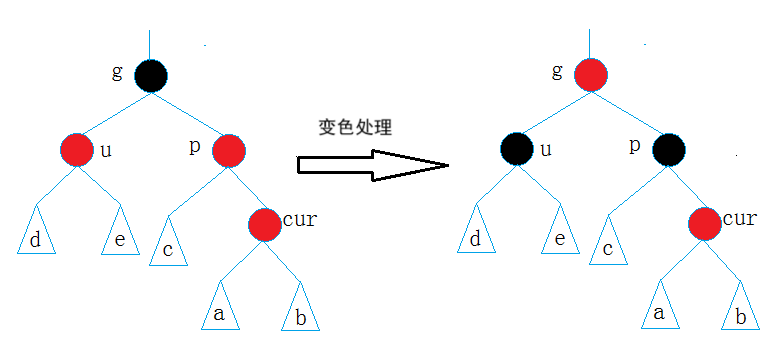

# 红黑树的概念

红黑树，是一种**二叉搜索树**，但在每个结点上增加一个存储位表示结点的颜色，可以是
`Red`或`Black`。 通过对任何一条从根到叶子的路径上各个结点着色方式的限制，红黑树确保**没有一条路径会比其他路径长出俩倍**，因而是**接近平衡**的。


红黑树的性质：

1. 每个结点**非红即黑**，不是红色就是黑色 。

   > 个人认为颜色只是状态，所有节点可以是全黑。这个状态可以用`bool`值或其他概念代替。用颜色是因为可视化友好（人话看着舒服）。

2. **根节点是黑色**的。

3. 如果一个**节点是红**色的，则它的**两个孩子结点是黑**色的。

   > 表示树里不能出现连续的红色结点，父子结点的颜色可以是双黑、黑红或红黑。

4. 对于每个结点，从该**结点到其所有后代叶结点**的简单路径上，均包含**相同数目的黑结点**。

   > 路径也可以是从根结点到任一叶结点经过的结点。

5. 每个**叶结点都是黑**色的。

   > 此处的叶子结点指的是空结点NIL。

红黑树的5个性质，最核心的是第3条和第4条。最短路径全是黑色结点，最长路径在最短路径的基础上多加的只有红结点。假设每条路径都有N个黑色结点，则每条路径的结点数量在`[N,2*N]`之间。且大多数时候最短路径和最长路径不一定存在。

这也是为什么红黑树最长路径中节点个数不会超过最短路径节点个数的两倍。

> AVL树是严格平衡，它的左、右二叉树的高度之差的绝对值不超过1。
>
> 而红黑树是近似平衡，它的最长路径不超过最短路径的2倍。
>
> 红黑树的整体运行效率比AVL树慢，但也慢不到哪里去。若同样是100w个结点，AVL树的高度估计是20层（$6\log_2{10}\approx 20$），而红黑树的高度在20层到40层之间。
>
> 这点高度差对计算机，对CPU来说也只是慢几毫秒，这点时间对人来说几乎可以忽略不计，但红黑树的实现比AVL树相对容易。在[AVL树的模拟实现](https://blog.csdn.net/m0_73693552/article/details/149487486?spm=1001.2014.3001.5501)时可知为了保证严格平衡浪费了很多时间，但因为红黑树的建立比AVL树快，红黑树反而比AVL树更适用，STL的工具`map`、`set`、`multimap`、`multiset`以及其他语言的键值对、集合的底层也都是红黑树。
>
> 这种运行时速度快但构建时速度慢的情况个人认为并不是特例，比如Python，因为语言简洁，自带的库和第三方库十分丰富，尽管最终成品的效率不如C++，但因出色的开发效率，很多人工智能的开发首选都是Python，而不是C++（当然还有Python更容易实现向量化等原因）。


# 红黑树的模拟实现

二叉搜索树有2种模型：Key模型和Key - Value模型，2种模型对应着2种STL的工具：`map`和`set`。`map`和`set`的底层实现都是红黑树。

> 查源码stl_tree.h可知，`_STL_BEGIN_NAMESPACE`表示STL命名空间的宏。

参考源码中的`set`：

```cpp
template <class Key, class Compare = less<Key>, class Alloc = alloc>
class set {
public:
	typedef Key key_type;
	typedef Key value_type;
	typedef Compare key_compare;
	typedef Compare value_compare;
private:
	typedef rb_tree<key_type, value_type,
		identity<value_type>, key_compare, Alloc> rep_type;
	rep_type t;  // red-black tree representing set
    //...省略若干
};
```

参考源码中的`map`：

```cpp
template <class Key, class T, class Compare = less<Key>, class Alloc = alloc>
class map {
public:
    typedef Key key_type;
    typedef T data_type;
    typedef T mapped_type;
    typedef pair<const Key, T> value_type;
    typedef Compare key_compare;

    class value_compare
        : public binary_function<value_type, value_type, bool> {
        friend class map<Key, T, Compare, Alloc>;
    protected:
        Compare comp;
        value_compare(Compare c) : comp(c) {}
    public:
        bool operator()(const value_type& x, const value_type& y) const {
            return comp(x.first, y.first);
        }
    };

private:
    typedef rb_tree<key_type, value_type,
        select1st<value_type>, key_compare, Alloc> rep_type;
    rep_type t;  // red-black tree representing map
    //...省略若干
}
```

可知，`map`和`set`都实例化同一个有5个模板参数的红黑树类模板。

所以可以通过模板将2种模型进行统一。即`map`和`set`可以通过模板对同一个红黑树类模板进行推演。

因此参考库中的红黑树设计的定义：

```cpp
enum Color {
	RED,
	BLACK
};

//红黑树结点
template<class Type>
struct Node {//结点
	Node<Type>* left;
	Node<Type>* right;
	Node<Type>* parent;
	Type data;
	Color color;

	Node<Type>(const Type& data = Type(), Color color = RED)
		:left(nullptr)
		, right(nullptr)
		, parent(nullptr)
		, data(data)
		, color(color) {}
};

template<class Key, class Type, class KeyOfType, class Compare = less<Key> >
class RBTree {
public:
	typedef Node<Type> node;
	RBTree(): root(nullptr){}
private:
	node* root;
    node* head;
	Compare compare;
	KeyOfType kot;
};
```

对`RBTree`类的模板参数进行分析：

`key`：用于比较的键的数据类型。

`Type`：红黑树要存储的数据类型。第3个模板参数也可以从这里获取要比较的键信息。

`KeyOfType`：从`Type`类型的对象中获取键的仿函数。

`Compare`：比较器仿函数，用于对从`keyOfType`中获取的键进行比较。默认是库函数中的`less` 即 `<`。

对`RBTree`类的成员变量进行分析：

`root`：红黑树的头结点。

`head`：红黑树的外置头结点，主要用于配合迭代器工作。

`compare`：比较器

`kot`：从`Type`型变量中获取`Key`型数据的仿函数对象。


## 红黑树的插入

红黑树是在二叉搜索树的基础上加上其平衡限制条件，因此红黑树的插入可分为两步：

1. 按照**二叉搜索树的规则插入**新节点。
2. **检查**新节点插入后，红黑树的性质是否造到破坏。

**新插入的节点的默认颜色是红色**，因为红黑树每个路径都有一样数量的黑结点，再插入黑结点会使当前路径的黑结点数增加，导致整个树被破坏，而**插入红结点只会影响父结点**（指父结点和自身不能同为红色）。

也正因为如此：

* 如果其**父节点的颜色是黑色**，**没有违反**红黑树任何性质，则**不需要调整**；
* 但当新插入节点的**父节点颜色为红**色时，就违反了性质 3 不能有连在一起的红色节点，此时需要对红黑树分情况来处理。


> 红黑树的情况同样多而且复杂。例如一红黑树，每条路径的黑结点数为2（不包括空节点）：
>
> 
>
> 第1个红黑树，最底层的8个红色结点可任意去掉，所以情况数实际是$\sum\limits_{i=0}^{8}C_8^i$；
> 第2个只有2个红结点，所以情况数是$4\times 2$；
>
> 第3个则是$\sum\limits_{i=0}^{4}C_4^i$。
>
> 总的情况数是3个表达式的结果加起来。已经可以感觉到情况的数量庞大。
>
> 但无论是哪种情况，插入结点时可能产生违反规则的结点。红黑树为了维护那几条规则，对违反规则的结点，通常先把结点（特指父结点）变色，只有变颜色无法处理时才进行旋转。有时还要进行旋转加变色。


### 情况1：uncle存在且为红

这里记要检查的结点为`cur`，则在这种出现问题的情况下，`cur`结点为红，`p`（parent）为红，`g`（grandpa）为黑，`u`（uncle）存在且为红。情况1如图所示，`cur`和`p`均为红，违反性质 3。


且这种情况的树的`g`节点，可能是根结点，也可能只是某个子树根结点。

解决方式：将`p`, `u`改为黑，`g`改为红，然后把`g`当成`cur`，继续向上调整。若`g`不是根结点，还要继续向上调整；否则把根结点`g`的颜色改为黑。

> 这里`g`变红，`p`、`u`变黑是为了保持黑结点的数量一致。之后的策略包括删除结点都是为了使整个二叉树满足红黑树的所有性质。

情况1还有一个**镜像情况**：`p`结点是`g`结点的右结点。这种情况的处理方式是一样的。



在情况 1 中，结点插入后要看`u`结点的颜色，其他几个结点的颜色相对固定。即`cur`新插入时是红色，`p`若是黑色则可以结束插入，但这里有问题才拿出来讨论，所以`p`是红色。`g`的颜色要和`p`不同，只有`u`有多种变化。

而且即使是`g`、`p`、`cur`在抽象图上**不共线**，只要`u`是红色，则依旧按照情况1进行处理。

不只是情况1，红黑树几乎所有情况都要关注这个父结点的兄弟结点，也就是 `uncle` 。

### 尝试分析情况1的所有可能

红黑树和AVL树一样有很多种情况，需要将部分归为一类，按照指定方法去处理。


尝试对情况1的`{a,b,c,d,e}`5个子树的不同情况进行分析：

* `{a,b,c,d,e}`很可能是空节点，此时`cur`就是新增结点。


* 也有可能`{c,d,e}`是各自路径的含1个黑结点的子树，这样的子树有4种情况；`{a,b}`是各自路径上的红色结点。`cur`也不是一开始就是`cur`，而是向上调整的过程中出现异常的旧结点。


`cur`是新增结点经过调整后，在向上调整过程中即将被修改的。


根据计数原理，`{c,d,e}`的形状组合有$4\times 4\times 4$种，`{a,b}`能提供的插入位置有4个，所以合计的组合共 257 种。

所以基本不可能画出所有情况，需要使用抽象图来代表1类情况。


### 情况2：uncle不在或为黑

`cur`为红，`p`为红，`g`为黑，`u`不存在或`u`存在且为黑。


思路：

若`p`为`g`的左孩子，`cur`为`p`的左孩子，则对`g`进行右单旋；


若`p`为`g`的右孩子，`cur`为`p`的右孩子，则对`g`进行左单旋（镜像情况）；


旋转完成后，`p`、`g`变色——`p`变黑，`g`变红。注意情况2旋转完成后就完成了结点的插入，而不是像情况1那样继续向上检查。

> 
>
> 对左边的情况数进行大概分析：`c` 至少包含1个黑结点，有4种情况（见上方分析情况1的所有可能）。此时 `cur` 之前应该是黑的，经过调整后变红。
>
> `d`、`e`是空或1个红结点，总的情况数$C_2^2+C_2^1+C_2^0=4$（2个都空，2个有1个红，全红）。
>
> 而新增结点可能插入在`a`、`b`提供的4个位置，所以有4种情况。
>
> 合计有$4^3=64$种情况。
>
> 若`d`、`e`也是至少一个黑结点的红黑树，则`c`是2个黑结点的红黑树，这个组合的数量更恐怖（指一条路径有3个黑结点的红黑树的所有情况）。但还好，都能总结成情况2进行处理。
>
> 为什么说`u`结点要么不存在，要么为黑？
>
> 1. 如果`u`节点不存在，则`cur`一定是新插入节点，因为如果`cur`不是新插入节点，则`cur`和`p`一定有一个节点的颜色是黑色，就不满足性质4：每条路径黑色节点个数相同。
>
>    
>
> 2. 如果`u`节点存在，则其一定是黑色的，那么`cur`节点原来的颜色一定是黑色的，现在看到其是红色的原因是因为`cur`的子树在调整的过程中将`cur`节点的颜色由黑色改成红色。
>
>    即使`u`开始是红色的，因为`cur`和`p`的颜色冲突，`p`和`u`必然变黑（见情况1）。
>
>    

### 情况3：gpc不共线，uncle不在或为黑

`cur`为红，`p`为红，`g`为黑，`u`不存在或`u`存在且为黑。

解决方案：`p`为`g`的左孩子，但`cur`为`p`的右孩子（即抽象图中，`g`、`p`、`cur`三结点不共线），则针对`p`做左单旋，后针对`g`进行右单旋，并将`cur`的颜色改为黑，`g`的颜色改为红；


`p`为`g`的右孩子，但`cur`为`p`的左孩子，则针对`p`做右单旋，后针对`g`进行左单旋，并将`cur`的颜色改为黑，`g`的颜色改为红；


注意情况3旋转完成后就完成了结点的插入，而不是像情况1那样继续向上检查。


其他解决方案（指转换成情况2）：

`p`为`g`的左孩子，但`cur`为`p`的右孩子，则针对`p`做左单旋，并交换`p`和`cur`指代的结点；


`p`为`g`的右孩子，但`cur`为`p`的左孩子，则针对`p`做右单旋，并交换`p`和`cur`指代的结点。


则转换成了情况2。


## 红黑树的验证

红黑树的检测分为两步：

1. 检测其是否满足二叉搜索树(中序遍历是否为有序序列)。

2. 检测其是否满足红黑树的性质：
   * 根结点是黑的。
   * 不存在父子都是红结点。为方便检查，可先从子结点查起。
   * 每个路径的黑色结点数量相同。可参考最近公共祖先（见[二叉搜索树的相关OJ和模拟实现-CSDN博客](https://blog.csdn.net/m0_73693552/article/details/149392031?spm=1001.2014.3001.5501)），找到一条路径的黑节点数后，再用这个数量给其他路径进行判断。

## 红黑树的删除

参考[红黑树 - 删除_哔哩哔哩_bilibili](https://www.bilibili.com/video/BV16m421u7Tb/?spm_id_from=333.337.search-card.all.click&vd_source=34ca6b96395dd31c5a689792493d3268)。其中双黑结点的概念无非就是删除黑结点后，那1条路径少1个黑结点，于是这里简化为将这个结点预删除，将树进行调整至即使删除预删除的结点也不影响平衡的情况。

> 殷人昆老师的《数据结构 用面向对象方法与C++语言描述 第3版》中描述的只有单子结点的情况。被删除结点的唯一的子女可能存在，也可能不存在。
>
> 若不存在则是下面讨论的情况中删除叶结点的情况。
>
> 若存在且被删结点为黑，则参考[红黑树 - 删除_哔哩哔哩_bilibili](https://www.bilibili.com/video/BV16m421u7Tb/?spm_id_from=333.337.search-card.all.click&vd_source=34ca6b96395dd31c5a689792493d3268)只会存在2种情况。因为这个局部的另一个子树为空，这就意味着以被删结点为根结点，所有的路径都只有1个黑结点，所以另一个子树必定是红且只是叶结点。

红黑树也是一种二叉搜索树，所以红黑树的结点删除：

1. 若是析构函数，则直接通过后序遍历进行删除即可。
2. 若是删除单个结点，则按照二叉搜索树的方法删除一个结点后，再根据红黑树的性质对（可能）被破坏的红黑树进行调整。

二叉搜索树删除结点的方法严格来说只有2种：**删除叶结点**和**删除单子结点**。因为删除2个孩子的结点，最后都会转换成这2种情况，所以只对这2种情况进行讨论。

在实际测试过程中遇到一个问题：这个红黑树的结点存储的数据，其中的键很可能带有常属性例如`Type data`可能定义成`pair<const Key,Value>`或`const Key`，这时无法通过正常渠道交换2个结点的`data`，因为不可修改。

但实际上没必要完全交换，而是**交换不具有常属性的其他成员以及关系**（类似交换2个结点的社会关系，而不是交换核心数据），因为我们需要的是抽象的红黑树数据结构的应用，并不关心它们在电脑中的物理位置。很巧合的是，STL特别是`map`和`set`在惠普实验室设计时也考虑到了这点。

```cpp
__node_swap(a, b) {
    swap(a->parent, b->parent);
    swap(a->left, b->left);
    swap(a->right, b->right);
    // ...
}
```


### 情况1 删除单子的结点

若删除的结点只有左子树或只有右子树，直接**用子树根结点替换**，并将**用来替换的结点的颜色变黑**即可。

因为红黑树的性质限制，这种情况只有2种，待删除结点是黑，子结点是红，子结点是待删除结点的左或右结点。


因为插入第3个结点时，会出现异常情况：

1. 插入红色结点，会违反父子不为红的性质，必定发生旋转操作。
2. 插入黑色结点，会违反所有路径同数量黑结点的性质。
3. 往另一个子树去加结点，则不再是情况1。

此外待删除结点不能是红，否则它的子结点必定是黑。这样的子树放在红黑树的任意位置，都会违反所有路径同数量黑结点的性质。

同时还要留意待删除结点是黑结点的情况。

### 情况2 删除无子的结点

即删除叶结点。若这个叶结点是红色，则删除后对整个树无任何影响，不需要调整。

但若这个叶结点是黑色，则删除这个结点，会使经过这个结点的路径的黑节点数少1个，需要分情况进行讨论，根据不同的情况来进行一系列的调整。

这时**兄弟结点**的重要性就出来了。

记待删除的节点`cur`，其父结点是`parent`，`bro`是`cur`的兄弟结点，`brol`是`bro`的左子树根结点，`bror`是` bro`的右子树根结点。

#### cur是右子，brol为红

若`cur`是`parent`的右子树的根，`brol`是红色结点，则：

* 先进行变色：`brol`变成`bro`的颜色，`bro`变成`parent`的颜色，`parent`变黑色。
* 再对`parent`进行右旋。
* 最后删除结点。结束调整。


因为删除`cur`之后，`parent`的右结点少1个黑结点，这个部分的子树将不再满足性质4。于是将同样是黑结点的`parent`右旋，使得这部分的子树在`cur`被删之后也能满足性质4。下面的情况也是同理。

#### cur是右子，bror为红

若`bror`是红色，但`brol`不是，即在抽象图中，pbr不共线（严格来说是不在同侧），则：

* 先进行变色：`bror`变成`parent`的颜色，`parent`变成黑色。
* 对`bro`进行左旋。
* 对`parent`进行右旋。删除结点后结束调整。


#### cur是右子，bro全黑

若兄弟的孩子都是黑色（兄弟无子结点，空节点也被认为是黑色），则：

* 兄弟结点变成红色。
* 将研究对象转换成它们的父结点，根据父结点的兄弟结点的情况判断是哪一种情况。
* 重复同样的步骤，直到研究对象是红结点或根结点为止（）。若更换研究对象时因研究对象是红结点，则要改为黑。


——例如这种情况就是研究8，8是左子树根结点，根据18和它的右孩子的颜色判断出，需要对15进行左旋（见情况`cur`是左子，`brol`为红）。


——例如这种情况因25是红色，所以停止调整。

#### cur是右子，bro是红

若兄弟结点是红结点，则：

* 兄父换色。
* 父结点朝着被删除结点的方向进行旋转。
* 重新对被删除的结点进行研究（因为兄弟已经变更）。


——例如这个案例中，21的兄弟从15变成了17，则17按照兄弟为黑且无红子的特征，变红后更换研究对象为18。此时变成情况`cur`是右子，`bro`为黑的情况。

#### cur是左子，bror为红

`cur`是`parent`的左子树。

若`bror`是红色结点，则：

* 先进行变色：`bror`变成`bro`的颜色，`bro`变成`parent`的颜色，`parent`变黑色。再对`parent`进行左旋。
* 最后删除结点。结束调整。


#### cur是左子，brol为红

若`brol`是红色结点，而`bror`不是，则：

* 先进行变色：`bror`变成`parent`的颜色，`parent`变成黑色。
* 对`bro`进行左旋。
* 对`parent`进行右旋。删除结点后结束调整。


#### 其他情况

其他情况即

1. `cur`是左子，但`bro`和它的子结点都是黑色的。


2. `cur`是左子，但`bro`是红节点。


这2种情况就是`cur`是右子树根结点时的情况的镜像情况。策略和之前的策略一致，这里不再细述。


## 红黑树的迭代器

### 迭代器的理论实现

STL有规定，`begin()`与`end()`代表的是一段前闭后开的区间，而对红黑树进行中序遍历后，可以得到一个有序的序列。

因此：`begin()`可以放在红黑树中最小节点（即最左侧节点）的位置，`end()`放在最大节点（最右侧节点）的下一个位置。

因为对`end()`位置的迭代器进行 `--` 操作，必须要能找最后一个元素，因此最好的方式是将`end()`放在头结点`head`的位置，这也是为什么红黑树的模拟实现需要多一个头结点`head`。


因此红黑树和迭代器各自添加一个头结点`head`，`head->left`指向键最小的结点，`head->right`指向键最大的结点，`head->parent`可闲置，也可指向红黑树根结点`root`。

若红黑树无结点，则`head->left=head->right=head`，也可以通过`head`的状态来判断树是否为空，如此便避免判空时还要进行递归。

```cpp
template<class Type>
struct RBTreeIterator {
	typedef RBTreeIterator<Type> self;
	typedef Node<Type> node;
	node* root;
	node* head;
};
```

之后在类似`--end()`的操作时，可直接将`head->right`抬出来。

以及若`begin()`采用`head->left`实现时，需要判断红黑树中结点数。

对于带常属性的对象调用的迭代器，参考[c++STL-list的模拟实现-CSDN博客](https://blog.csdn.net/m0_73693552/article/details/147914422)，可通过上传模版参数实现。相关的调用也可先强制转换为不带`const`的`this`调用普通函数，再强制转换回来进行实现。例如`find`。

### ++、--、==操作

`==`操作只需判断 2 个迭代器的`root`指代的结点是否为同一个即可（比较2个指针变量存储的地址）。

`++`操作找的是中序遍历中表示的结点的下一个。所以`++`的实现思路：

1. 若结点有右子树，则下一个结点就是右子树的最左节点。这在删除结点时经常用到。
2. 若结点无右子树，则说明当前结点代表的子树遍历完，继续向上寻找2个祖先，这2个祖先是父子关系，若这对父子结点的关系不是根和右子树，而是**根和左子树**，则父结点即为下一个迭代器指代的结点。

需要注意的是，`++`需要对`end`迭代器进行防越界检测。

`--`操作找的是中序遍历中表示的结点的上一个。所以`--`的实现思路：

1. 若结点有左子树，则下一个结点就是左子树的最右节点。
2. 若结点无左子树，则说明当前结点代表的子树遍历完，继续向上寻找 2 个祖先，这 2 个祖先是父子关系，若这对父子结点的关系不是根和左子树，而是**根和右子树**，则父结点即为下一个迭代器指代的结点。

需要注意的是，`--`需要对`begin`迭代器进行防越界检测。


## 模拟实现参考程序

这里的红黑树实现了3个类：`Node`类（结点类），`RBTreeIterator`类（迭代器类）和`RBTree`类，和库中的红黑树有差异，而且设计上有很多冗余（比如左旋、右旋的某些步骤可以分离出来）。

后续若有机会，会对这个模拟实现做进一步优化。

RBTree.h ：

```cpp
#pragma once
#include<functional>
#include<iostream>
#include<cassert>
using std::less;
using std::swap;
using std::cout;
using std::max;
using std::pair;
using std::make_pair;

enum Color {
	RED,
	BLACK
};

//红黑树结点
template<class Type>
struct Node {//结点
	Node<Type>* left;
	Node<Type>* right;
	Node<Type>* parent;
	Type data;
	Color color;

	Node(const Type& data = Type(), Color color = RED)
		:left(nullptr)
		, right(nullptr)
		, parent(nullptr)
		, data(data)
		, color(color) {}

	//这个拷贝构造没什么用，但这里选择保留
	Node(const Node<Type>& cur)
		:left(cur.left)
		, right(cur.right)
		, parent(cur.parent)
		, data(cur.data)
		, color(cur.color) {}
};

//红黑树的迭代器
template<class Type, class nodeptr, class Ref, class Ptr>
struct RBTreeIterator {
	typedef RBTreeIterator<Type,nodeptr,Ref,Ptr> self;
	nodeptr root;
	nodeptr head;
	RBTreeIterator(nodeptr root = nullptr, nodeptr head = nullptr)
		:root(root)
		, head(head) {}

	RBTreeIterator(const self& x)
		: root(x.root)
		, head(x.head) {}

	self& operator=(const self& x) {
		root = x.root;
		head = x.head;
		return *this;
	}

	Ref operator*() {
		if (!root)//防止访问尾迭代器
			assert(false);
		return root->data;
	}

	Ptr operator->() {
		if (!root)//防止访问尾迭代器
			assert(false);
		return &root->data;
	}

	self& operator++() {
		if (!root)//防止++end()
			assert(false);
		if (root->right) {
			// 下一个就是右子树的最左节点
			nodeptr cur = root->right;
			while (cur->left)
				cur = cur->left;
			root = cur;
		}
		else {
			nodeptr cur = root;
			nodeptr parent = cur->parent;
			while (parent && parent->right == cur) {
				cur = parent;
				parent = parent->parent;
			}
			root = parent;
		}
		return *this;
	}

	self operator++(int) {
		self tmp(*this);
		++(*this);
		return tmp;
	}

	self& operator--() {
		if (!root) {//--end()
			root = head->right;
			return *this;
		}
		if (root == head->left)//防止--begin()
			assert(false);
		if (root->left) {
			// 下一个就是左子树的最右节点
			nodeptr cur = root->left;
			while (cur->right)
				cur = cur->right;
			root = cur;
		}
		else {
			nodeptr cur = root;
			nodeptr parent = cur->parent;
			while (parent && parent->left == cur) {
				cur = parent;
				parent = parent->parent;
			}
			root = parent;
		}
		return *this;
	}

	self operator--(int) {
		self tmp(*this);
		--(*this);
		return tmp;
	}

	bool operator==(const self& x) {
		return this->root == x.root;
	}

	bool operator!=(const self& x) {
		return this->root != x.root;
	}
};

//Key:键的类型; Type:存储数据的类型; 
// KeyOfType:从Type中抽取用于比较的键
//Compare:比较器，默认是库函数中的less
//红黑树类
template<class Key, class Type, class KeyOfType, class Compare = less<Key> >
class RBTree {
public:
	typedef Node<Type> node;
	typedef RBTree<Key, Type, KeyOfType, Compare> rbtree;
	//构造函数
	RBTree()
		: root(nullptr)
		, head(nullptr) {
		head = new node;
		head->left = head->right = head;
		head->parent = root;
	}
	RBTree(const rbtree& tree)
		:kot(tree.kot)
		, compare(tree.compare) {
		head = new node;
		head->left = head->right = head;
		this->root = _copy(tree.root);
		if (this->root)
			updateHead();
	}
	template<class InputIterator>
	RBTree(InputIterator first, InputIterator last)
		: root(nullptr){
		head = new node;
		head->left = head->right = head;
		for (auto it = first; it != last; ++it)
			insert(*it);
	}
private:
	//递归深拷贝
	node* _copy(node* root) {
		if (!root)
			return nullptr;
		node* L, * R, * tmp;
		L = _copy(root->left);
		R = _copy(root->right);
		tmp = new node(root->data, root->color);
		tmp->left = L; tmp->right = R;
		if (L)
			L->parent = tmp;
		if (R)
			R->parent = tmp;
		return tmp;
	}

public:
	//迭代器
	typedef RBTreeIterator<Type,Node<Type>*,Type&,Type*> iterator;
	typedef RBTreeIterator<Type,const Node<Type>*, const Type&, const Type*> const_iterator;

	iterator begin() {
		if (head->left != head)
			return iterator(head->left, head);
		return end();
	}
	iterator end() {
		return iterator(nullptr, head);
	}
	const_iterator begin() const {
		if (head->left != head)
			return const_iterator(head->left, head);
		return end();
	}
	const_iterator end() const {
		return const_iterator(nullptr, head);
	}

	//查找
	iterator find(const Key& val) {
		node* cur = root;
		while (cur) {
			if (val == kot(cur->data))
				return iterator(cur, head);
			else if (compare(val, kot(cur->data)))
				cur = cur->left;
			else
				cur = cur->right;
		}
		return end();
	}

	const_iterator find(const Key& val) const{
		iterator it = const_cast<RBTree*>(this)->find(val);
		return const_iterator(it.root, it.head);
	}

	//返回树的节点数
	size_t size() const {
		return _size(root);
	}
private:
	//返回树的节点数
	size_t _size(node* root) const {
		if (!root)
			return 0;
		size_t l = _size(root->left);
		size_t r = _size(root->right);
		return l + r + 1;
	}
public:
	//判空
	bool empty()const {
		return head->left == head;
	}
	//格式化
	void clear() {
		head->left = head->right = head;
		Destroy(root);
		root = nullptr;
	}

public:
	//插入结点
	pair<iterator, bool> insert(const Type& data) {
		if (!root) {
			root = new node(data);
			root->color = BLACK;
			updateHead();
			return make_pair(iterator(root, head), true);
		}
		node* parent = nullptr;
		node* cur = root;
		while (cur) {
			parent = cur;
			if (kot(data) == kot(cur->data))
				return make_pair(iterator(cur, head), false);
			else if (compare(kot(data), kot(cur->data)))
				cur = cur->left;
			else
				cur = cur->right;
		}

		cur = new node(data);
		if (compare(kot(data), kot(parent->data)))
			parent->left = cur;
		else
			parent->right = cur;
		cur->parent = parent;
		checkQues(parent, cur);
		updateHead();
		return make_pair(iterator(cur, head), true);
	}

	////正常情况带const的红黑树不能修改，因此不可插入
	//pair<const_iterator, bool> insert(const Type& data) const{
	//	pair<iterator, bool>it = const_cast<RBTree*>(this)->insert(data);
	//	const_iterator ans(it.first.root, it.first.head);
	//	return pair<const_iterator, bool>(ans, it.second);
	//}

private:
	//检查并修正插入过程中带来的不平衡
	void checkQues(node* parent, node* cur) {
		node* grandpa = nullptr;
		node* uncle = nullptr;
		while (parent && parent->color == RED) {
			grandpa = parent->parent;
			if (parent == grandpa->left) {
				uncle = grandpa->right;
				//uncle存在且为红，情况1
				//     g
				//   p   u
				// c
				if (uncle && uncle->color == RED) {
					parent->color = uncle->color = BLACK;
					grandpa->color = RED;
					cur = grandpa;
					parent = cur->parent;
				}
				//uncle不存在或为黑
				else {
					//gpc共线（个人说法，专业的话应该是同侧），情况2
					if (cur == parent->left) {
						// 单旋
						//     g
						//   p
						// c
						rotateR(grandpa);
						grandpa->color = RED;
						parent->color = BLACK;
					}
					//gpc不共线，情况3
					else {
						// 双旋
						//     g
						//   p
						//     c
						rotateL(parent);
						rotateR(grandpa);
						cur->color = BLACK;
						grandpa->color = RED;
					}
					break;
				}
			}
			else {//parent == grandpa->right
				uncle = grandpa->left;
				//uncle存在且为红，情况1
				if (uncle && uncle->color == RED) {
					//     g
					//   u   p 
					//          c
					//
					parent->color = uncle->color = BLACK;
					grandpa->color = RED;
					cur = grandpa;
					parent = cur->parent;
				}
				//uncle不存在或为黑
				else {
					if (cur == parent->right) {//gpc共线，情况2
						//     g
						//       p 
						//          c
						//
						rotateL(grandpa);
						grandpa->color = RED;
						parent->color = BLACK;
					}
					//gpc不共线，情况3
					else {
						//     g
						//   u   p 
						//     c
						//
						rotateR(parent);
						rotateL(grandpa);
						cur->color = BLACK;
						grandpa->color = RED;
					}
					break;
				}
			}
		}
		root->color = BLACK;
	}

	//更新头结点
	void updateHead() {//更新头结点
		head->parent = root;
		if (!root) {
			head->left = head->right = head;
			return;
		}
		node* cur = root;
		while (cur && cur->left)
			cur = cur->left;
		head->left = cur;
		cur = root;
		while (cur && cur->right)
			cur = cur->right;
		head->right = cur;
	}

	//右单旋
	void rotateR(node* parent) {
		node* lkid = parent->left;//left kid，左孩子
		node* lrkid = lkid->right;//left right kid，左孩子的右孩子

		parent->left = lrkid;
		lkid->right = parent;

		node* grandpa = parent->parent;
		parent->parent = lkid;

		//要判断h==0的情况
		if (lrkid)
			lrkid->parent = parent;
		//原parent可能是根结点
		if (this->root == parent) {
			this->root = lkid;
			lkid->parent = nullptr;
		}
		else {
			if (grandpa->left == parent)
				grandpa->left = lkid;
			else
				grandpa->right = lkid;
			lkid->parent = grandpa;
		}
	}

	//左单旋
	void rotateL(node* parent) {
		node* rkid = parent->right;//left kid，右孩子
		node* rlkid = rkid->left;//left right kid，右孩子的左孩子

		parent->right = rlkid;
		rkid->left = parent;

		node* grandpa = parent->parent;
		parent->parent = rkid;

		//要判断h==0的情况
		if (rlkid)
			rlkid->parent = parent;
		//原parent可能是根结点
		if (this->root == parent) {
			this->root = rkid;
			rkid->parent = nullptr;
		}
		else {
			if (grandpa->left == parent)
				grandpa->left = rkid;
			else
				grandpa->right = rkid;
			rkid->parent = grandpa;
		}
	}
public:
	//删除结点
	bool erase(const Key& data) {
		bool ans = _erase(data);
		updateHead();
		return ans;
	}
private:
	bool _erase(const Key& data) {
		node* cur = root;
		node* parent = nullptr;
		node* child = nullptr;
		while (cur) {//查找节点
			if (data == kot(cur->data)) {
				if (!cur->left || !cur->right)//结点只有1个子结点或无子
					break;
				else {//结点有2个子结点
					node* limLeft = cur->right;
					parent = cur;
					while (limLeft->left) {
						parent = limLeft;
						limLeft = limLeft->left;
					}

					//交换2个结点的社会性地位
					_swapNode(limLeft, cur);

					//仅交换数据，在封装时不适用
					//swap(limLeft->data, cur->data);
					//cur = limLeft;//转换成单子结点或叶结点
					continue;
				}
			}
			else if (compare(data, kot(cur->data))) {
				parent = cur;
				cur = cur->left;
			}
			else {
				parent = cur;
				cur = cur->right;
			}
		}
		if (!cur)//没找到
			return false;

		parent = cur->parent;
		child = !cur->left ? cur->right : cur->left;
		if (child) {//只有一个子结点，且只能是cur黑child红
			if (cur == root) {//cur是根结点的情况
				root = child;
				root->parent = nullptr;
				root->color = BLACK;
				delete cur;
				return true;
			}
			if (parent->left == cur)
				parent->left = child;
			else
				parent->right = child;
			child->color = BLACK;
			child->parent = parent;
			delete cur;
			return true;
		}
		else {//无子结点
			if (cur == root) {//可能删除根结点
				delete cur;
				root = nullptr;
				head->left = head->right = head;
				head->parent = nullptr;
				return true;
			}
			if (cur->color == RED) {//待删除的叶结点为红
				if (cur == parent->left)
					parent->left = nullptr;
				else
					parent->right = nullptr;
				delete cur;
				return true;
			}
			//待删除结点为黑
			node* del = cur;//标记待删除的结点
			node* bro = nullptr;//兄弟结点
			node* brol = nullptr, * bror = nullptr;//兄弟的左孩子、右孩子
			while (cur != root && cur->color != RED) {
				bro = parent->left == cur ? parent->right : parent->left;
				brol = bro ? bro->left : nullptr;
				bror = bro ? bro->right : nullptr;
				if (cur == parent->left) {
					//cur是左子，bror为红（共线）
					if (bror && bror->color == RED) {
						bror->color = bro->color;
						bro->color = parent->color;
						parent->color = BLACK;
						rotateL(parent);
						break;
					}
					//cur是左子，brol为红（不共线）
					else if (brol && brol->color == RED) {
						brol->color = parent->color;
						parent->color = BLACK;
						rotateR(bro);
						rotateL(parent);
						break;
					}
					//cur是左子，兄弟一家全黑
					else if (!bro || bro->color == BLACK) {
						if (bro)
							bro->color = RED;
						cur = parent;
						parent = cur->parent;
						if (cur->color == RED) {
							cur->color = BLACK;
							break;
						}
						continue;
					}
					//cur是左子，兄弟为红
					else {
						swap(bro->color, parent->color);
						rotateL(parent);//朝研究对象的结点旋转
						continue;//兄弟变更，继续研究
					}
				}
				else {
					//cur是右子，brol为红（共线）
					if (brol && brol->color == RED) {
						brol->color = bro->color;
						bro->color = parent->color;
						parent->color = BLACK;
						rotateR(parent);
						break;
					}
					//cur是右子，bror为红（不共线）
					else if (bror && bror->color == RED) {
						bror->color = parent->color;
						parent->color = BLACK;
						rotateL(bro);
						rotateR(parent);
						break;
					}
					//cur是右子，兄弟一家全黑
					else if (!bro || bro->color == BLACK) {
						if (bro)
							bro->color = RED;
						cur = parent;
						parent = cur->parent;
						if (cur->color == RED) {
							cur->color = BLACK;
							break;
						}
						continue;
					}
					//cur是右子，兄弟是红
					else {
						swap(bro->color, parent->color);
						rotateR(parent);
						continue;
					}
				}
			}
			//调整完成后，清理结点
			child = !del->left ? del->right : del->left;
			parent = del->parent;
			if (del == parent->left)
				parent->left = child;
			else
				parent->right = child;
			delete del;
			root->color = BLACK;//根结点始终为黑
			return true;
		}
		return false;
	}

	//交换2个结点的社会性地位
	void _swapNode(node*& limLeft, node*& cur) {
		bool flag = 0;
		if (limLeft == cur->right) {//一次循环都没进，则它们还有关系。
			swap(limLeft->color, cur->color);
			swap(limLeft->left, cur->left);
			swap(limLeft->right, cur->right);
			swap(limLeft->parent, cur->parent);
			swap(limLeft->right, cur->parent);//矫正父子关系
			if (cur->left)
				cur->left->parent = cur;
			if (cur->right)
				cur->right->parent;
			if (limLeft->left)
				limLeft->left->parent = limLeft;
			if (limLeft->parent) {
				if (limLeft->parent->left == cur)
					limLeft->parent->left = limLeft;
				else
					limLeft->parent->right = limLeft;
			}
			else
				root = limLeft;
			return;
		}
		//否则它们没关系
		swap(limLeft->color, cur->color);
		swap(limLeft->left, cur->left);
		swap(limLeft->right, cur->right);
		swap(limLeft->parent, cur->parent);
		if (limLeft->left)
			limLeft->left->parent = limLeft;
		if (limLeft->right)
			limLeft->right->parent = limLeft;

		if (cur->left)
			cur->left->parent = cur;
		if (cur->right)
			cur->right->parent = cur;
		if (limLeft->parent) {
			if (limLeft->parent->left == cur)
				limLeft->parent->left = limLeft;
			else
				limLeft->parent->right = limLeft;
		}
		else
			root = limLeft;
		if (cur->parent) {
			if (cur->parent->left == limLeft)
				cur->parent->left = cur;
			else
				cur->parent->right = cur;
		}
		else
			root = cur;
	}
public:
	//检查树是否是红黑树
	bool isbalance() {
		if (!root)
			return true;
		if (root->color == RED)
			return false;

		//单路径黑结点数
		int pbn = 0;//path black num
		node* cur = root;
		while (cur) {
			if (cur->color == BLACK)
				++pbn;
			cur = cur->left;
		}
		int bn = 0;//black num
		return _isbalance(root, bn, pbn);
	}
private:
	//递归检查树是否是红黑树
	bool _isbalance(node* root, int bn, const int& pbn) {
		if (!root) {
			if (bn != pbn) {
				cout << "出现黑结点数量异常的路径：\n";
				return false;
			}
			return true;
		}
		if (root->parent && root->color == RED && root->parent->color == RED) {
			cout << "出现连续的红色结点：" <<
				kot(root->data) << ' ' << kot(root->parent->data) << "\n";
			return false;
		}
		if (root->color == BLACK)
			++bn;
		return _isbalance(root->left, bn, pbn)
			&& _isbalance(root->right, bn, pbn);
	}

public:
	//查找指定键的数量
	size_t count(const Key& val) {
		return _count(val, root);
	}

	////调用中序遍历
	//void print() {
	//	Inorder(root);
	//	cout << "\n";
	//}

private:
	//查找指定键的数量
	size_t _count(const Key& val, node* root) {
		if (!root)
			return 0;
		if (val == kot(root->data)) {
			return 1 + _count(val, root->left)
				+ _count(val, root->right);//相同键值依旧有旋转的可能
		}
		if (compare(val, kot(root->data)))
			return _count(val, root->left);
		return _count(val, root->right);
	}

	////测试用的中序遍历
	//void Inorder(node* root) {
	//	if (!root)
	//		return;
	//	Inorder(root->left);
	//	cout << kot(root->data) << ' ';
	//	Inorder(root->right);
	//}
public:
	//析构函数，调用后序遍历
	~RBTree() {
		delete head;
		Destroy(root);
	}
private:
	//后序遍历销毁整个树
	void Destroy(node* root) {
		if (!root)
			return;
		Destroy(root->left);
		Destroy(root->right);
		delete root;
	}

private:
	node* root;
	node* head;
	Compare compare;
	KeyOfType kot;
};
```

用过的红黑树测试（其中抗压测试运行完需要较长时间）：

```cpp
#include<iostream>
#include<ctime>
#include<vector>
#include<set>
#include"RBTree.h"
using namespace std;

template<class Key>
struct Test {
	//建议operator()的this指针加上const修饰
	const Key& operator()(const Key& t) const{
		return t;
	}
};

//数万个随机数种子的抗压训练
void f1(size_t num) {
	srand(num);
	RBTree<int, int, Test<int>>tree;
	vector<int>a, b;
	for (int i = 0; i < 2000; i++) {
		int tmp = rand() + 1;
		if (tree.insert(tmp).second) {
			a.push_back(tmp);
		}
		if (!tree.isbalance()) {
			cout << "插入结点出现不平衡" << endl;
			for (auto& x : a)
				cout << x << ' ';
			return;
		}
	}
	b = a;
	vector<int>c;
	while (a.size()) {
		int tmp = rand() % a.size();
		c.push_back(a[tmp]);
		tree.erase(a[tmp]);
		if (!tree.isbalance()) {
			cout << "删除结点出现不平衡：" << a[tmp] << endl;
			for (auto& x : b)
				cout << x << ' ';
			cout << endl;
			for (auto& x : c)
				cout << x << ' ';
			cout << endl;
			return;
		}
		a.erase(a.begin() + tmp);
	}
}

//排查错误用
void f2() {
	vector<int>test_insert = { 49,197,95,92,32,178,103,104,18,169,10,34,24,
		153,179,200,64,26,90,119,55,199,165,183,99,132,72,100,137,98,50,33,
		66,9,162,64,180,94,194,149,46,109,155,60,195,193,1,48,66,41,17,126,
		93,125,136,80,114,74,190,142,87,1,115,122,97,175,16,83,30,1,177,21,
		137,150,25,167,158,185,39,5,142,167,48,54,21,150,92,193,179,87,165,
		164,72,21,182,125,140,86,49,164
	};
	vector<int>a;
	RBTree<int, int, Test<int>>tree;
	for (auto& x : test_insert) {
		if (tree.insert(x).second) {
			a.push_back(x);
		}
		if (!tree.isbalance())
			assert(false);
	}
	vector<int>b = a;
	vector<int>c;
	while (a.size()) {
		//因为没有给随机数的种子，所以这里顺序其实是固定的
		int tmp = rand() % a.size();
		c.push_back(a[tmp]);
		if (tree.size() == 2) {//错误可能发生在只剩2个结点的情况
			int xxx = 33;
		}
		tree.erase(a[tmp]);
		if (!tree.isbalance()) {
			cout << "删除结点出现不平衡：" << a[tmp] << endl;
			for (auto& x : b)
				cout << x << ' ';
			cout << endl;
			for (auto& x : c)
				cout << x << ' ';
			cout << endl;
			return;
		}
		a.erase(a.begin() + tmp);
	}
	cout << a.empty() << endl;
}

//迭代器测试
void f3() {
	vector<int>a = { 23,73,88,33,88,51,57,19,28,58,34,51,28,42,48 };
	RBTree<int, int, Test<int>>tree(a.begin(), a.end());
	for (auto x : tree)
		cout << x << ' ';
	cout << endl;
	cout << (*tree.find(34)) << endl;;

	auto it = ++tree.begin();
	cout << (*it) << endl;
	auto it2 = --tree.end();
	it = it2;
	cout << (*it) << endl;

	const RBTree<int, int, Test<int>>ctree(a.begin(), a.end());
	for (auto x : ctree)
		cout << x << ' ';
	cout << endl;
	cout << (*ctree.find(57)) << endl;;

	auto it3 = ++ctree.begin();
	cout << (*it3) << endl;
	auto it4 = --ctree.end();
	it3 = it4;
	cout << (*it3) << endl;
	//严格来说带const的红黑树对象无法修改
	//ctree.insert(99);
	//for (auto x : ctree)
	//	cout << x << ' ';
	//cout << endl;
}

int main() {
	//for (size_t i = 0; i < 32767; i++)
	//	f1(i);
	//f2();
	f3();
	return 0;
}
```

