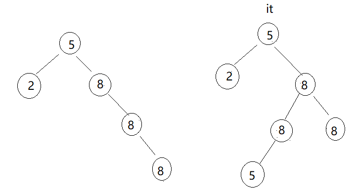
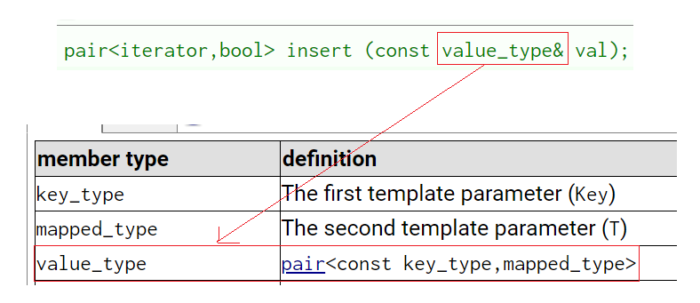

# 关联式容器简介

`vector`、`list`、`deque`、`forward_list`(C++11)等，这些容器统称为**序列式容器**，因为其底层为**线性序列的数据结构**，里面存储的是元素本身。

**关联式容器**也是用来存储数据的，与序列式容器不同的是，其里面存储的是`<key, value>`结构的**键值对**，在数据检索时比序列式容器效率更高。

## 键值对pair

键值对用来表示具有一一**对应关系**的一种结构，该结构中一般只包含两个成员变量`key`和`value`，`key`代表键值，`value`表示与`key`对应的信息。

比如：现在要建立一个英汉互译的字典，那该字典中必然有英文单词与其对应的中文含义，而且，英文单词与其中文含义是一一对应的关系，即通过该应该单词，在词典中就可以找到与其对应的中文含义。

SGI-STL中关于键值对的定义：

```cpp
template <class T1, class T2>
struct pair {
	typedef T1 first_type;
	typedef T2 second_type;
	T1 first;
	T2 second;
	pair() : first(T1()), second(T2()){}
	pair(const T1& a, const T2& b) 
		: first(a), second(b){}
};
```

键值对有对比较运算符进行重载。

```cpp
template <class T1, class T2>
bool operator== (const pair<T1, T2>& lhs, const pair<T1, T2>& rhs) {
	return lhs.first == rhs.first && lhs.second == rhs.second;
}

template <class T1, class T2>
bool operator!= (const pair<T1, T2>& lhs, const pair<T1, T2>& rhs){
	return !(lhs == rhs);
}

template <class T1, class T2>
bool operator<  (const pair<T1, T2>& lhs, const pair<T1, T2>& rhs){
	return lhs.first < rhs.first || (!(rhs.first < lhs.first) && lhs.second < rhs.second);
}

template <class T1, class T2>
bool operator<= (const pair<T1, T2>& lhs, const pair<T1, T2>& rhs){
	return !(rhs < lhs);
}

template <class T1, class T2>
bool operator>  (const pair<T1, T2>& lhs, const pair<T1, T2>& rhs){
	return rhs < lhs;
}

template <class T1, class T2>
bool operator>= (const pair<T1, T2>& lhs, const pair<T1, T2>& rhs){
	return !(lhs < rhs);
}
```


## 树形结构的关联式容器

根据应用场景的不同，STL总共实现了两种不同结构的管理式容器：树型结构与哈希结构。树型结构的关联式容器主要有四种：`map`、`set`、`multimap`、`multiset`。

这四种容器的共同点是：使用平衡搜索树(即**红黑树**)作为其底层数据结构，容器中的元素是一个有序的序列。

# 容器set

[set - C++ Reference](https://legacy.cplusplus.com/reference/set/set/?kw=set)

```cpp
template < class T,                 // set::key_type/value_type
    class Compare = less<T>,        // set::key_compare/value_compare
    class Alloc = allocator<T>      // set::allocator_type
> 
class set;
```

大致翻译文档中的重点：

1. `set`是按照一定次序存储元素的容器。

2. 在`set`中，元素的`value`也标识它(`value`就是`key`，类型为`T`)，并且每个`value`必须是唯一的。`set`中的元素不能在容器中修改(元素总是`const`)，但是可以从容器中插入或删除它们。

3. 在内部，`set`中的元素总是按照其内部比较对象(类型比较)所指示的特定严格弱排序准则进行排序。

4. `set`容器通过`key`访问单个元素的速度通常比`unordered_set`容器慢，但它们允许根据顺序对子集进行直接迭代。

5. `set`在底层是用二叉搜索树(红黑树)实现的。

从之前[模拟实现二叉搜索树](https://blog.csdn.net/m0_73693552/article/details/149392031?spm=1001.2014.3001.5501)时可以了解到：

1. `set`属于Key模型。

2. 内部的`key`不存在相同的元素，所以`set`可以当成**满足互异性的集合**（见高中数学），本身就可以当成很方便的去重工具，二叉搜索树的特性也让存、取数据相对方便。

`set`不支持修改内部元素，这也能理解，作者不希望用户修改底层的二叉搜索树，防止破坏树的完整性。

和之前的[string](https://blog.csdn.net/m0_73693552/article/details/147881146)、[vecto](https://blog.csdn.net/m0_73693552/article/details/147901502)等一样，简单介绍`set`的成员函数。

## 构造函数

```cpp
//c++98支持的接口
//可初始化仿函数比较器
explicit set (const key_compare& comp = key_compare(),
              const allocator_type& alloc = allocator_type());
//通过迭代器初始化
template <class InputIterator>
  set (InputIterator first, InputIterator last,
       const key_compare& comp = key_compare(),
       const allocator_type& alloc = allocator_type());
//拷贝构造函数
set (const set& x);

//c++11中个人用的最多的初始化列表
set (initializer_list<value_type> il,
     const key_compare& comp = key_compare(),
     const allocator_type& alloc = allocator_type());
```

简单试用：

```cpp
#include<iostream>
#include<set>
#include<functional>
#include<vector>
using namespace std;

template<class T>
struct Greater {
	bool operator()(const T& x, const T& y) {
		return x > y;
	}
};

void f1() {
	set<int>a;//只给类型的普通集合
	set<int, Greater<int> >b;//给类型和仿函数比较器的集合
}

void f2() {
	vector<int>arr = { 1,1,4,5,1,4 };
	//可上传其他容器的迭代器和仿函数实例化对象
	//仿函数实例化对象可省略
	set<int>a(arr.begin(), arr.end(),less<int>());
	//构造函数
	set<int>b(a);
	//c++11支持初始化列表
	set<int>c = { 1,2,3,4,5,3,2,5,25,5, };
}

int main() {
	f1();
	return 0;
}
```

## 迭代器Iterator

> 不得不感叹，发明STL的人将数据结构做成容器，对所有容器都能用统一的迭代器进行遍历，是一个很实用的发明。

和`string`、`vector`等容器的迭代器一样，通过容器可遍历集合内的元素。

```cpp
#include<iostream>
#include<set>
#include<functional>
#include<vector>
using namespace std;

void f1() {
	set<int>a = {1,1,4,5,1,4,3,1,4,1,5,9};
	for (set<int>::iterator it = a.begin(); it != a.end(); it++)
		cout << *it << ' ';
	cout << endl;
	//支持迭代器也就意味着支持范围for
	for (auto it : a)
		cout << it << ' ';
	cout << endl;
	for (set<int>::reverse_iterator it = a.rbegin(); 
		it != a.rend(); it++)
		cout << *it << ' ';
}

int main() {
	f1();
	return 0;
}
```

输出：

```
1 3 4 5 9
1 3 4 5 9
9 5 4 3 1
```

## 容量有关Capacity

```cpp
//判断容器是否为空
bool empty() const;
//返回容器数
size_type size() const;//typedef size_type size_t
//返回容器能存储的最大数据量
size_type max_size() const;
```

不同平台或实现对`size_t`的定义不同，有的是`typedef unsigned int size_t`，有的是`typedef unsigned long long size_t`，为隐藏细节增加`size_type`。

这些函数在其他STL容器也都有，属于很常见的接口。

```cpp
#include<iostream>
#include<set>
#include<functional>
#include<vector>
using namespace std;

void f1() {
	set<int>a = {1,1,4,5,1,4,3,1,4,1,5,9};
	set<int>b;
	cout << a.empty() << ' ' << b.empty() << endl;
	cout << a.size() << ' ' << b.size() << endl;
	//max_size会随着系统位数变化
	//32位系统是INT_MAX
	cout << a.max_size() << ' ' << b.max_size() << endl;
}

int main() {
	f1();
	return 0;
}
```

## 修改modifiers

这里列举c++98支持的函数。

### insert

```cpp
pair<iterator,bool> insert (const value_type& val);
iterator insert (iterator position, const value_type& val);
template <class InputIterator>
  void insert (InputIterator first, InputIterator last);
void insert (initializer_list<value_type> il);
```

第1个`insert`无论是否成功都会返回一个键值对，插入成功的话，键值对的`first`是**新增的**元素的迭代器，`second`为`true`；插入失败的话，键值对的`first`是**已有的**元素的迭代器，`second`为`false`。

第2个`insert`直接返回迭代器，同样是插入成功就返回迭代器，失败就返回已有的元素的迭代器。

* 形参的`position`是建议程序从指定迭代器处上传用于提升效率，也可以直接上传`begin()`，但插入效率可能从$O(1)$退化到$O(\log n)$。
* 但无论怎么样，最后的底层结构依旧是完整的红黑树，不会随着`position`的不同而不同，其他的例如`multiset`、`map`、`multimap`也是如此。

第3个`insert`则是遍历其他容器的迭代器插入集合。

第4个`insert`则是插入初始化列表。

```cpp
#include<iostream>
#include<set>
#include<functional>
#include<vector>
#include<ctime>
using namespace std;

void f1() {
	//pair<iterator,bool> insert (const value_type& val);
	srand(size_t(time(0)));
	set<int>a = { 1,1,4,5,1,4,3,1,4,1,5,9 };
	pair<set<int>::iterator, bool> pr = a.insert(rand() % 100 + 1);
	cout << *pr.first << ' ' << pr.second << endl;
	pr = a.insert(3);
	cout << *pr.first << ' ' << pr.second;
}

void f2() {
	set<int>a = { 1,3,4,5,9 };
	pair<set<int>::iterator, bool> pr = a.insert(6);
	for (auto x : a)
		cout << x << ' ';
	cout << endl;
	//iterator insert(iterator position, const value_type & val);
	cout << *a.insert(pr.first, 2) << endl;
	for (auto x : a)
		cout << x << ' ';
	cout << endl;
}

void f3() {
	set<int>a = { 1,3,4,5,9 };
	//template <class InputIterator>
	//void insert(InputIterator first, InputIterator last);
	set<int>b(a.begin(), a.end());
	for (auto x : b)
		cout << x << ' ';
}

int main() {
	//f1();
	//f2();
	f3();
	return 0;
}
```

### erase、clear和swap

```cpp
void erase (iterator position);
size_type erase (const value_type& val);//成功返回1，失败返回0
void erase (iterator first, iterator last);
```

`erase`比起`insert`相对好懂，即删除指定迭代器。

但上传不可被删除的迭代器时会触发断言。

```cpp
#include<iostream>
#include<set>
#include<functional>
#include<vector>
#include<ctime>
using namespace std;

template<class T>
void print(T& a) {
	for (auto x : a)
		cout << x << ' ';
	cout << endl;
}

void f1() {
	set<int>a = { 1,2,3,4,5,6,7,8,9,0 };
	//void erase (iterator position);
	a.erase(++a.begin());
	print(a);
	//size_type erase (const value_type& val);
	//删除成功返回1，失败返回0
	cout << a.erase(5) << ' ' << a.erase(11) << endl;
	print(a);
	a = { 1,2,3,4,5,6,7,8,9,0 };
	//void erase (iterator first, iterator last);
	a.erase(a.insert(a.begin(),3), a.insert(a.begin(), 7));
	print(a);
}

void f2() {
	set<int>a = { 1,2,3,4,5,6,7,8,9,0 };
	//上传不可删除的迭代器，会触发断言
	//a.erase(a.end());
}

int main() {
	//f1();
	f2();
	return 0;
}
```

`clear`和`swap`：

```cpp
void clear();
void swap (set& x);
```

简单使用：

```cpp
#include<iostream>
#include<set>
#include<functional>
#include<vector>
#include<ctime>
using namespace std;

template<class T>
void print(T& a) {
	for (auto x : a)
		cout << x << ' ';
	cout << endl;
}

void f1() {
	set<int>a = { 1,2,3,4,5,6,7,8,9,0 };
	//void erase (iterator position);
	a.erase(++a.begin());
	print(a);
	//size_type erase (const value_type& val);
	//删除成功返回1，失败返回0
	cout << a.erase(5) << ' ' << a.erase(11) << endl;
	print(a);
	a = { 1,2,3,4,5,6,7,8,9,0 };
	//void erase (iterator first, iterator last);
	a.erase(a.insert(a.begin(),3), a.insert(a.begin(), 7));
	print(a);
}

void f2() {
	set<int>a = { 1,2,3,4,5,6,7,8,9,0 };
	//上传不可删除的迭代器，会触发断言
	//a.erase(a.end());
	set<int>b = { 3,1,4,5,9,2 };
	print(b);
	a.swap(b);
	print(b);
	b.clear();
	cout << "b.clear()后：" << b.size();
}

int main() {
	//f1();
	f2();
	return 0;
}
```


## 观察（仿函数比较器）Observers

```cpp
key_compare key_comp() const;
value_compare value_comp() const;
```

`key_comp`函数会返回适用于`key`值的仿函数比较器，若`set`的对象没有指明比较器，则默认返回`less`。

`value_comp`函数会返回适用于`value`值的仿函数比较器，若`set`的对象没有指明比较器，则默认返回`less`。

但这2个公式在`set`这个K模型的容器本质是一样的。

```cpp
#include<iostream>
#include<set>
#include<functional>
#include<vector>
using namespace std;

void f1() {
	set<int>a = { 1,1,4,5,1,4,3,1,4,1,5,9 };
	set<int>::key_compare mycmp = a.key_comp();
	less<int>x = mycmp;
	cout << x(3, 4) << ' ' << mycmp(4, 3) << endl;
	cout << x(4, 3) << ' ' << mycmp(3, 4) << endl;
}

void f2() {
	set<int>a = { 1,1,4,5,1,4,3,1,4,1,5,9 };
	set<int>::value_compare mycmp = a.value_comp();
	less<int>x = mycmp;
	cout << x(3, 4) << ' ' << mycmp(4, 3) << endl;
	cout << x(4, 3) << ' ' << mycmp(3, 4) << endl;
}

int main() {
	//f1();
	f2();
	return 0;
}
```


## 操作operation

`set`最主要的用途是查找数据在与不在，并不需要多的操作。所以`set`的操作函数都是和查找有关的。

```cpp
iterator find (const value_type& val) const;
size_type count (const value_type& val) const;
iterator lower_bound (const value_type& val) const;
iterator upper_bound (const value_type& val) const;
pair<iterator,iterator> equal_range (const value_type& val) const;
```

`find`：查找值为`val`的元素，返回迭代器。

`count`：返回元素中值为`val`的元素个数。因为`set`的互异性，它的返回值只有1和0。

`lower_bound`返回大于等于`val`的元素的迭代器。

`upper_bound`返回大于`val`的元素的迭代器。

`lower_bound`和`upper_bound`，和二分算法有很强的关联。

`equal_range`是查找恰好等于`val`的数据的范围，范围区间是左闭右开。若找不到则返回大于等于`val`到大于`val`的范围的值。这个函数对`set`没啥意义，但对`multiset`有很大意义。

使用示例；

```cpp
#include<iostream>
#include<set>
#include<functional>
#include<vector>
#include<ctime>
using namespace std;

template<class T>
void print(T& a) {
	for (auto x : a)
		cout << x << ' ';
	cout << endl;
}

void f1() {
	set<int>a = { 1,2,3,4,5,6,7,8,9,0 };
	//iterator find (const value_type& val) const;
	//查找已有的值
	set<int>::iterator it=a.find(3);
	cout << *it << endl;
	//size_type count (const value_type& val) const;
	cout << a.count(4) << endl;
	//查找没有的值
	it = a.find(44);//找不到返回end迭代器
	cout << a.count(44) <<' '<<(it==a.end())<< endl;
}

void f2() {
	set<int>a = { 1,2,3,4,5,6,7,8,9,0 };
	//iterator lower_bound(const value_type & val) const;
	//iterator upper_bound(const value_type & val) const;3
	set<int>::iterator start = a.lower_bound(3);//找到3
	set<int>::iterator fnl = a.upper_bound(7);//找到8
	for (set<int>::iterator it = start; it != fnl; it++)
		cout << *it << ' ';
	a = { 1,3,5,7,9,11 };
	start = a.lower_bound(4);//找到5
	fnl = a.upper_bound(7);//找到8
	cout << endl;
	for (set<int>::iterator it = start; it != fnl; it++)
		cout << *it << ' ';
}

void f3() {
	set<int>a = { 1,2,3,4,5,6,7,8,9,0 };
	//pair<iterator,iterator> equal_range (const value_type& val) const;
	pair<set<int>::iterator, set<int>::iterator> 
		pr = a.equal_range(3);
	for (auto it = pr.first; it != pr.second; it++)
		cout << *it << ' ';
	cout << endl;

	a = { 1,2,4,5,6,7,8,9,0 };
	pr = a.equal_range(3);
	if (pr.first == pr.second)
		cout << "*pr.first=" << *pr.first << endl;
}

int main() {
	//f1();
	//f2();
	f3();
	return 0;
}
```


# 容器multiset

[multiset - C++ Reference](https://legacy.cplusplus.com/reference/set/multiset/?kw=multiset)

大致翻译：

1. `multiset`是按照特定顺序存储元素的容器，其中**元素是可以重复**的。

2. 在`multiset`中，元素的`value`也会识别它(因为`multiset`中本身**存储**的就是
   `<value, value>`组成的**键值对**，因此`value`本身就是`key`，`key`就是`value`，类型为`T`)。
   `multiset`**元素的值不能在容器中进行修改**(因为元素总是`const`的)，但**可以**从容器中**插入或删除**。

3. 在内部，`multiset`中的元素总是按照其内部比较规则(类型比较)所指示的特定严格弱排序准则进行排序。

4. `multiset`容器通过`key`访问单个元素的速度通常比`unordered_multiset`容器慢，但当使用**迭代器遍历**时会得到一个**有序序列**。

5. `multiset`底层结构为二叉搜索树(红黑树)。

和`set`相比，底层依旧是二叉搜索树，但支持元素重复。这意味着在`multiset`中找某个元素，时间复杂度为$O(\log_2 N)$。

`multiset`和`set`的成员函数是一样的。`multiset`因为不去重，可用于作为二分算法的部分情况，例如频繁插入和删除以及二分查找的情景可用`multiset`代替数组进行二分算法。

例如[P4774 [NOI2018\] 屠龙勇士 - 洛谷](https://www.luogu.com.cn/problem/P4774)，有一个选择屠龙的剑的过程，就用到了二分算法，但因为频繁插入和删除，用普通数组模拟会特别不方便，使用`multiset`就是很不错的选择。

因为是二叉搜索树，所以相同的数据，`multiset`可能会安排在逻辑上不相邻的位置，但依旧可通过对二叉搜索树进行中序遍历来找到相同的值。



因为`multiset`和`set`的成员函数基本一致，所以将`set`的测试代码中，`set`改成`multiset`一样能运行，这里就不做过多介绍，而是提几个不一样的地方。

## insert和set的不同

```cpp
//set的insert
pair<iterator,bool> insert (const value_type& val);
iterator insert (iterator position, const value_type& val);
template <class InputIterator>
  void insert (InputIterator first, InputIterator last);
void insert (initializer_list<value_type> il);

//multiseet的insert
iterator insert (const value_type& val);
iterator insert (iterator position, const value_type& val);
template <class InputIterator>
  void insert (InputIterator first, InputIterator last);
void insert (initializer_list<value_type> il);
```

可以看到，`multiset`的插入单个元素的返回值不是键值对。在使用时需要注意。

## erase和set的不同

`multiset`的`erase`是删除所有值为`val`的元素。

```cpp
#include<iostream>
#include<set>
#include<functional>
#include<vector>
#include<ctime>
using namespace std;

template<class T>
void print(T& a) {
	for (auto x : a)
		cout << x << ' ';
	cout << endl;
}

int main() {
	multiset<int>a = { 1,2,3,3,3,4,4,5,6 };
	a.erase(3);
	print(a);
	return 0;
}
```

## 操作operator

`multiset`因为元素重复，`find`查找的是第1个元素并返回迭代器，`count`也能发挥它的计数功能。

`lower_bound`返回大于等于`val`的元素的迭代器。`upper_bound`返回大于`val`的元素的迭代器。尽管功能依旧没变，但已经可以胜任二分算法的功能。

`equal_range`尽管查找的范围指代的迭代器的机制一样（返回的键值对，`first`找第1个大于等于值的元素的迭代器，`second`找第1个大于值的元素的迭代器），但数量不再是1个。


# 容器map和容器multimap

`map`对应[二叉搜索树](https://blog.csdn.net/m0_73693552/article/details/149392031?spm=1001.2014.3001.5501)中的KV模型。`multimap`和`map`相比，支持键`key`重复，但不支持通过`key`查找`value`。

[map - C++ Reference](https://legacy.cplusplus.com/reference/map/map/?kw=map)

```cpp
template < class Key,// map::key_type
           class T,// map::mapped_type
           class Compare = less<Key>,// map::key_compare
           class Alloc = allocator<pair<const Key,T> >// map::allocator_type
           >
class map;
```

大致翻译：

1. `map`是关联容器，它按照特定的次序(按照`key`来比较)存储由键值`key`和值`value`组合而成的元素。
2. 在`map`中，**键**值`key`通常用于**排序**和**惟一地标识元素**，而值`value`中存储与此键值`key`关联的内容。
   键值`key`和值`value`的类型可能不同，并且在`map`的内部，`key`与`value`通过成员类型`value_type`绑定在一起，为其取别名称为`pair`:
   `typedef pair<const key, T> value_type;`

3. 在内部，`map`中的元素总是按照键值`key`进行比较排序的。

4. `map`中通过键值访问单个元素的速度通常比`unordered_map`容器慢，但`map`允许根据顺序对元素进行直接迭代(即对`map`中的元素进行迭代遍历时，可以得到一个有序的序列)。

5. `map`**支持下标访问符**，即在[]中放入`key`，就可以找到与`key`对应的`value`。

6. `map`通常被实现为**二叉搜索树**(更准确的说：平衡二叉搜索树(**红黑树**))。

## 构造函数、迭代器和赋值重载

`map`作为容器，同样支持迭代器。所以可支持迭代器遍历和范围`for`。

迭代器会模仿指针，重载的`->`在数据是自定义类型时可用。

`it->operator()->first`：`it->operator()`表示函数调用，返回`pair*`。在实际应用时可通过一个`->`简化。

使用范围`for`对`map`对象进行枚举时，键值对的键不可修改，是因为`map`定义`size_type`时给键加`const`修饰。

`map`的构造函数：

```cpp
//c++98
//指定比较器
explicit map (const key_compare& comp = key_compare(),
              const allocator_type& alloc = allocator_type());
//通过其他容器的迭代器进行初始化
template <class InputIterator>
  map (InputIterator first, InputIterator last,
       const key_compare& comp = key_compare(),
       const allocator_type& alloc = allocator_type());
//拷贝构造函数
map (const map& x);
//c++11支持的初始化列表
map (initializer_list<value_type> il,
     const key_compare& comp = key_compare(),
     const allocator_type& alloc = allocator_type());

//赋值重载
map& operator= (const map& x);
```

需要注意的是，比较器只能按`key`进行插入，要想容器综合考虑`key`和`value`，需要容器设置成
`pair<pair<type(key),type(value)>,type(value)>`。具体使用见后文OJ。

简单使用：

```cpp
#include<iostream>
#include<map>
#include<functional>
#include<vector>
#include<ctime>
using namespace std;

template<class T>
void print(T& a) {
	for (auto x : a)
		cout << '<' << x.first << ',' << x.second << '>' << ' ';
	cout << endl;
}

void f1() {
	//explicit map (const key_compare& comp = key_compare(),
	//const allocator_type& alloc = allocator_type());
	map<string, int>mp1;
}

void f2() {
	vector<pair<string, int> >a = { {"alpha",1},{"beta",2},
		{"gamma",3} };
	//template <class InputIterator>
	//map(InputIterator first, InputIterator last,
	//	const key_compare & comp = key_compare(),
	//	const allocator_type & alloc = allocator_type());
	map<string, int>mp2(a.begin(), a.end());
	print(mp2);
	//map (const map& x);
	map<string, int>mp3(mp2);
	print(mp3);
}

void f3() {
	////c++11支持的初始化列表
	//map(initializer_list<value_type> il,
	//	const key_compare & comp = key_compare(),
	//	const allocator_type & alloc = allocator_type());
	map<string, int>mp = 
	{ {"sakura",1} ,{"yuzu",2},{"himari",1} };//value可以相同
	print(mp);
	map<string, int>mp2 = { {"kirito",1},{"asuna",1},{"yuuki",2} };
	print(mp2);
	//赋值重载
	mp2 = mp;
	print(mp2);
}

int main() {
	//f1();
	//f2();
	f3();
	return 0;
}
```

## 容量有关Capacity

看过`string`、`vector`、`list`、`set`和`multiset`后，对容量的3个函数应该不陌生。

```cpp
bool empty() const;
size_type size() const;
size_type max_size() const;
```

简单使用：

```cpp
#include<iostream>
#include<map>
#include<functional>
#include<vector>
#include<ctime>
using namespace std;

template<class T>
void print(T& a) {
	for (auto x : a)
		cout << '<' << x.first << ',' << x.second << '>' << ' ';
	cout << endl;
}

int main() {
	map<string, int>a;
	map<string, int>b =
	{ {"kirito",1},{"lisyaoran",1},{"wakamuki",2}};
	cout << a.empty() << ' ' << b.empty() << endl;
	cout << a.size() << ' ' << b.size() << endl;
	cout << a.max_size() << ' ' << b.max_size() << endl;
	//max_size的大小和系统位数以及键值对占用的内存有关
	//32位系统，键值对占用 4 byte 时最大容量为MAX_INT
	map<short, short>c = { {1,1},{2,1},{3,1} };
	cout << c.max_size() << endl;
	return 0;
}
```

## 修改modifiers

之前的翻译：键值`key`和值`value`的类型可能不同，并且在`map`的内部，`key`与`value`通过成员类型`value_type`绑定在一起，为其取别名称为`pair`:
`typedef pair<const key, T> value_type;`



在这里将会派上大的用场。

### insert和make_pair

```cpp
//前提typedef pair<const key, T> value_type;
//c++98支持
pair<iterator,bool> insert (const value_type& val);
iterator insert (iterator position, const value_type& val);
template <class InputIterator>
  void insert (InputIterator first, InputIterator last);
//c++11支持的初始化列表
void insert (initializer_list<value_type> il);

//c++98支持的make_pair
template <class T1, class T2>
  pair<T1,T2> make_pair (T1 x, T2 y);
```

这些函数和`set`的函数都大差不差，就不过多介绍。这里的`const value_type& val`尽管是引用，但内部会根据键值重新生成二叉树的结点，所以数据可直接上传。

因为`pair`有一个（可以是拷贝也可以不是的）构造函数是2个模版参数的函数模板，也就是说只要插入的值可调用模版参数的拷贝构造，类型可以不相同。

```cpp
template<class U, class V> pair (const pair<U,V>& pr);
```

所以`pair`可以使用匿名函数提供临时的`pair`对象。但因为`pair`还要上传2个参数，若这2个参数的类型过长，可能会使`pair`的模版参数急剧拉长。

`make_pair`则是尽量避免`pair`的匿名对象在使用上的缺陷。

在c++98，`make_pair`的原型：

```cpp
template <class T1, class T2>
pair<T1, T2> make_pair(T1 x, T2 y) {
	return (pair<T1, T2>(x, y));
}
```

所以本质还是生成匿名对象。

简单使用：

```cpp
#include<iostream>
#include<map>
#include<functional>
#include<vector>
#include<ctime>
using namespace std;

template<class T>
void print(T& a) {
	for (auto x : a)
		cout << '<' << x.first << ',' << x.second << '>' << ' ';
	cout << endl;
}

void f1() {
	map<int, int>mp;
	mp.insert(pair<int, int>(1, 1));
	mp.insert(make_pair(2, 1));//使用make_pair能减少代码长度
}

void f2() {
	map<string, string>mp;
	//底层识别为pair<string,string>还是
	// pair<const char*,const char*>
	//都不重要
	mp.insert(make_pair("insert", "插入"));
	//c++支持通过构造函数间接达成隐式类型转换
	mp.insert(pair<const char*, const char*>("delete", "删除"));
	print(mp);
}

int main() {
	f2();
	return 0;
}
```

如注释所言，c++支持（通过构造函数间接支持）隐式类型转换，因此类型不相同，只要支持构造键值对`pair`内部的键值对象就能使用。

`c++11`新增的`emplace`则是通过在函数内部直接构造`pair`来增加生成`pair`的效率。

### erase、swap和clear

STL容器的老三件。

```cpp
//c++98
void erase (iterator position);
size_type erase (const key_type& k);
void erase (iterator first, iterator last);


//c++11
iterator  erase (const_iterator position);
size_type erase (const key_type& k);
iterator  erase (const_iterator first, const_iterator last);

//标准通用
void swap (map& x);
void clear();
```

`erase`：c++11比起c++98，会返回删除的结点的后一个迭代器。

回忆二叉搜索树的删除结点的流程可知：若底层选用的是将待删除结点和它的右子树的最左结点进行交换并删除，在中序遍历时会直接访问被代替删除的结点的父结点。所以看上去像是返回被删除的结点的后一个结点，实际上2个结点除了在一个树上，没有太大关系。

```cpp
#include<iostream>
#include<map>
#include<functional>
#include<vector>
#include<ctime>
using namespace std;

int main() {
	map<int, int>mp = {
		{1,2},{2,3},{3,3},{4,2}
	};
	//需要编译器支持c++11
	map<int,int>::iterator it=mp.erase(++mp.begin());
	cout << it->first << ' ' << it->second;
	//mp.erase(mp.end());//上传不可被删除的迭代器会触发断言
	return 0;
}
```

## 下标访问Element access

`map`支持下标访问。`multimap`和`map`相比，支持键`key`重复，但不支持通过`key`查找`value`。这也能理解，因为`multimap`允许重复，指定下标查找的话不知道要找哪一个。

```cpp
mapped_type& operator[] (const key_type& k);
      mapped_type& at (const key_type& k);
const mapped_type& at (const key_type& k) const;
```

官方文档对这个下标文档访问的定义大致可以理解成这样：

```cpp
mapped_type& operator[] (const key_type& k){
    return 
    (*((this->insert(make_pair(k,mapped_type()))).first)).second;
}

```

所以`operator[]`和这个`insert`有很大联系：

```cpp
pair<iterator,bool> insert (const value_type& val);
```

对这个返回的式子进行逆拆解：

```cpp
(*((this->insert(make_pair(k,mapped_type()))).first)).second;

(*((                                        ).first)).second;
    this->insert(make_pair(k,mapped_type()))

```

所以方括号的本质是尝试插入键值对`make_pair(k,mapped_type())`，无论是否插入失败，都能得到键`k`对应的元素的键值对`<iterator, bool>`，此时只需返回`iterator`的`second`的引用，即可实现对`k`键在容器中的值进行操作。

`at`是c++11新增的和`operator[]`功能类似的函数，平时多用`[]`，不怎么用`at`，这里便不再介绍。

简单使用`[]`：

```cpp
#include<iostream>
#include<map>
#include<functional>
#include<vector>
#include<ctime>
using namespace std;

template<class T>
void print(T& p) {
	for (auto& x : p)
		cout << '<' << x.first << ',' << x.second << '>' << ' ';
	cout << endl;
}

int main() {
	map<string, int> ma;

	//ma[first]=second;[]内填与first类型一致的量
	ma["apple"] = 1;//访问ma中的apple，没有则添加apple
	ma["banana"] = 2;
	ma["lemon"] = 3;
	ma["tomato"] = 4;
	ma["tomato"] = 5;
	cout << ma["tomato"] << endl;//访问存在的元素
	print(ma);
	cout << ma["pear"] << endl;//访问不存在的元素
	print(ma);

	//若不想过多插入无关的键值对，只想知道在不在，
	//可统计次数
	if (ma.count("lemon"))
		cout << "lemon" << endl;
	else
		cout << "no lemon" << endl;
	print(ma);
	return 0;
}
```


## 仿函数比较器Observe和操作Operation

功能和`set`、`multiset`都差不多，就不过多介绍。

```cpp
//返回键的比较器
key_compare key_comp() const;
//还是返回键的比较器
value_compare value_comp() const;

//查找指定键的元素的迭代器，找不到返回end()迭代器
      iterator find (const key_type& k);
const_iterator find (const key_type& k) const;

//统计指定键的元素个数并返回
size_type count (const key_type& k) const;

//返回第1个键大于等于k的元素的迭代器
      iterator lower_bound (const key_type& k);
const_iterator lower_bound (const key_type& k) const;

//返回第1个键大于k的元素的迭代器
      iterator upper_bound (const key_type& k);
const_iterator upper_bound (const key_type& k) const;

//获取[大于等于k,大于k)这样一个范围的元素的迭代器，找不到则返回
//[大于k,大于k]的迭代器
pair<const_iterator,const_iterator> equal_range (const key_type& k) const;
pair<iterator,iterator>equal_range (const key_type& k);
```


# map和set的模拟实现

# 容器map和容器set的模拟实现

这2个工具实际上是对应的二叉搜索树的Key模型和Key-Value模型。因此可通过给对应的模板参数实现对上述红黑树的不同推演。

其中的红黑树参考[红黑树的模拟实现（含删除结点）-CSDN博客](https://blog.csdn.net/m0_73693552/article/details/149614728?spm=1001.2014.3001.5501)。

## set

```cpp
#pragma once
#include"RBTree.h"

namespace mystd {
	template<class Type, class Compare = less<Type> >
	class set {
	public:
		typedef Type Key;
		//获取键值的仿函数
		struct setKeyOfType {
			const Type& operator()(const Type& key) const {
				return key;
			}
		};

		//构造函数
		set() {}
		set(const set& st)
			:tree(st.tree) {}
		template<class InputIterator>
		set(InputIterator first, InputIterator last) {
			for (auto it = first; it != last; ++it)
				insert(*it);
		}

		//迭代器
		typedef typename RBTree<Type, const Type, setKeyOfType>::iterator iterator;
		typedef typename RBTree<Type, const Type, setKeyOfType>::const_iterator const_iterator;
		iterator begin() {
			return tree.begin();
		}
		iterator end() {
			return tree.end();
		}
		const_iterator begin() const {
			return tree.begin();
		}
		const_iterator end() const {
			return tree.end();
		}

		//插入
		pair<iterator, bool> insert(const Type& val) {
			return pair<iterator, bool>(tree.insert(val));
		}

		//删除
		bool erase(const Type& val) {
			return tree.erase(val);
		}

		//返回存储的元素个数
		size_t size()const {
			return tree.size();
		}

		//判空
		bool empty() const {
			return tree.empty();
		}

		//清空
		void clear() {
			tree.clear();
		}

		//查找
		iterator find(const Type& val) {
			return tree.find(val);
		}
		const_iterator find(const Type& val) const{
			return tree.find(val);
		}

		//计数
		size_t count(const Key& val) {
			return tree.count(val);
		}

	private:
		//底层红黑树
		RBTree<Type, const Type, setKeyOfType> tree;
	};

	void f4() {
		vector<int>a = { 23,73,88,33,88,51,57,19,28,58,34,51,28,42,48 };
		mystd::set<int>st(a.begin(), a.end());
		for (auto& x : st)
			cout << x << ' ';
		cout << endl;
		cout << *st.find(88) << endl;

		const mystd::set<int>cst(a.begin(), a.end());
		for (auto& x : cst)
			cout << x << ' ';
		cout << endl;
		cout << *cst.find(33) << endl;
	}
}
```


## map

```cpp
#pragma once
#include"RBTree.h"

namespace mystd {
	template<class Key, class Type, class Compare = less<Type> >
	class map {
	public:
		typedef pair<const Key, Type> val_type;
	public:
		//获取键值的仿函数
		struct mapKeyOfType {
			const Key& operator()(const val_type& key) const {
				return key.first;
			}
		};
	private:
		RBTree<Key, pair<const Key, Type>, mapKeyOfType> tree;
	public:
		//构造函数
		map() {}
		map(const map& st)
			:tree(st.tree) {}
		template<class InputIterator>
		map(InputIterator first, InputIterator last) {
			for (auto it = first; it != last; ++it)
				insert(*it);
		}

		//迭代器
		typedef typename
			RBTree<Key, pair<const Key, Type>, mapKeyOfType>::iterator iterator;
		typedef typename
			RBTree<Key, pair<const Key, Type>, mapKeyOfType>::const_iterator const_iterator;
		iterator begin() {
			return tree.begin();
		}
		iterator end() {
			return tree.end();
		}
		const_iterator begin() const {
			return tree.begin();
		}
		const_iterator end() const {
			return tree.end();
		}

		//插入
		pair<iterator, bool> insert(const val_type& val) {
			return pair<iterator, bool>(tree.insert(val));
		}

		//[]访问
		Type& operator[](const Key& key) {
			//照搬库里的写法
			return (*(
				insert(make_pair(key, Type()))
				.first)).second;
		}

		//删除
		bool erase(const Key& val) {
			return tree.erase(val);
		}

		//返回存储的元素个数
		size_t size()const {
			return tree.size();
		}

		//判空
		bool empty() const {
			return tree.empty();
		}

		//清空
		void clear() {
			tree.clear();
		}

		//查找
		iterator find(const Key& val) {
			return tree.find(val);
		}
		const_iterator find(const Key& val) const {
			return tree.find(val);
		}

		//计数
		size_t count(const Key& val) {
			return tree.count(val);
		}

	};

	void f5() {
		vector<pair<string, string>>a = {
			{"set","集合"},
			{"map","映射"},
			{"insert","插入"},
			{"erase","删除"}
		};
		mystd::map<string, string>mp(a.begin(), a.end());
		for (auto& x : mp)
			cout << "[" << x.first << ':' << x.second << "]";
		cout << endl;
		cout << (*mp.find("map")).second << endl;

		const mystd::map<string, string>cmp(a.begin(), a.end());
		for (auto& x : cmp)
			cout << "[" << x.first << ':' << x.second << "]";
		cout << endl;
		cout << (*cmp.find("map")).second << endl;

	}
}
```


# OJ试水

## 692. 前K个高频单词 - 力扣（LeetCode）

[692. 前K个高频单词 - 力扣（LeetCode）](https://leetcode.cn/problems/top-k-frequent-words/)

先统计单词次数。之后就有很多解决办法，例如使用优先队列辅助。这里使用`multimap`$+$自定义仿函数。

```cpp
class Solution {
public:
    struct cmp0{
        bool operator()(const pair<int,string>&a,
        const pair<int,string>&b) const{
        if(a.first>b.first)
            return true;
        if(a.first<b.first)
            return false;
        if(a.second<b.second)
            return true;
        return false;
        }
    };
    vector<string> topKFrequent(vector<string>& words, int k) {
        map<string,int>mp;
        for(auto&x:words)//统计个数
            mp[x]++;
        //键值对的模版参数，仿函数
        multimap<pair<int,string>,string,cmp0>mp2;
        for(auto&x:mp)
            mp2.insert(
    make_pair(make_pair(x.second,x.first),x.first)
    );
        vector<string>ans;
        for(auto&x:mp2)
            if(ans.size()<k)
                ans.push_back(x.second);
            else break;
        return ans;
    }
};
```

## 349. 两个数组的交集 - 力扣（LeetCode）和自动备份原理

[349. 两个数组的交集 - 力扣（LeetCode）](https://leetcode.cn/problems/intersection-of-two-arrays/description/)

先对2个数组去重，然后枚举其中一个数组，查找元素是否在另一个数组，在的话就统计。

```cpp
class Solution {
public:
    vector<int> intersection(vector<int>& nums1, vector<int>& nums2) {
        vector<int>ans;
        set<int>st1,st2;
        for(auto&x:nums1)
            st1.insert(x);
        for(auto&x:nums2)
            st2.insert(x);
        for(auto&x:st2)//不追求效率，怎么方便怎么来
            if(st1.count(x))
                ans.push_back(x);
        return ans;
    }
};
```

也可以用2个迭代器模仿归并操作，相等就统计，不相等谁小谁前进。即若元素是差集，则2个迭代器中的一个前进；若元素是交集，则同时前进。

```cpp
class Solution {
public:
    vector<int> intersection(vector<int>& nums1, vector<int>& nums2) {
        vector<int>ans;
        set<int>st1,st2;
        for(auto&x:nums1)
            st1.insert(x);
        for(auto&x:nums2)
            st2.insert(x);
        for(auto it1=st1.begin(),it2=st2.begin();
            it1!=st1.end()&&it2!=st2.end();){
            if(*it1<*it2)
                ++it1;
            else if(*it1>*it2)
                ++it2;
            else{
                ans.push_back(*it1);
                *it1++;
                *it2++;
            }
        }
        return ans;
    }
};
```

第2个同步的算法在自动备份和网盘同步时有很大的用处。

例如自动备份，例如我在写了一个项目后，我想让在自己电脑上（客户端）的代码或项目自动备份到我提前准备好的服务器（服务段）上，这时可以使用自动备份。自动目录就需要一个同步算法。

例如本地电脑的目录：

```cpp
aaa
bbb
ccc
ddd
```

服务器的目录：

```
bbb
ccc
eee
```

首先用2个类似`set`的工具将两个目录的文件名和文件时间保存自来，然后找并集和差集。

若是差集，本地有服务器没有，需要将本地文件通过文件读写通过网络拷贝到服务器，例如aaa、ddd；若是本地没有服务器有，则本地电脑发起一个删除请求删除eee（两边同步以本地为主，备份盘的话，可能会出现本地没有，服务器依旧会将文件给传输过来）或网络下载eee到本地。

若是交集，则对比最后的修改时间，看本地是否修改。若本地产生了修改则将本地文件上传覆盖。

