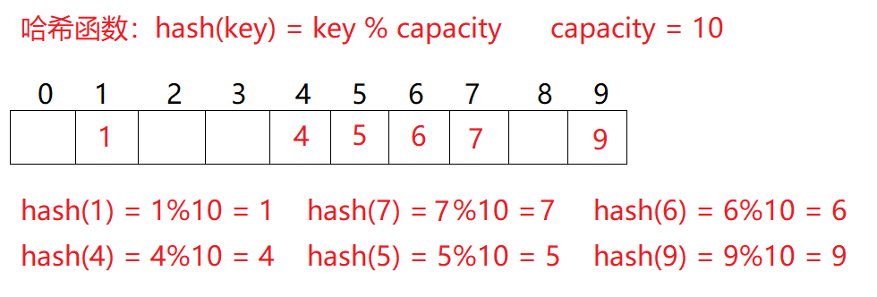
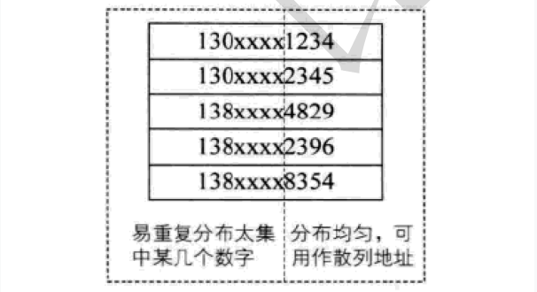
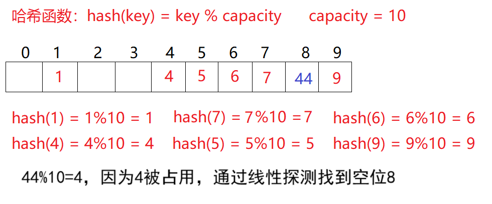
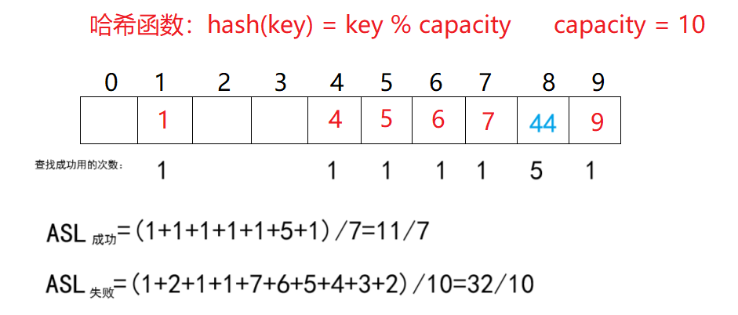
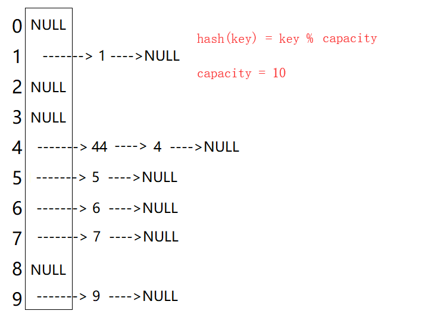
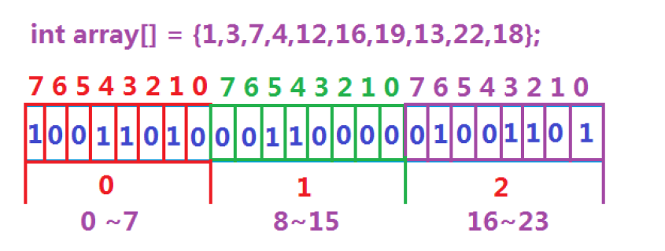
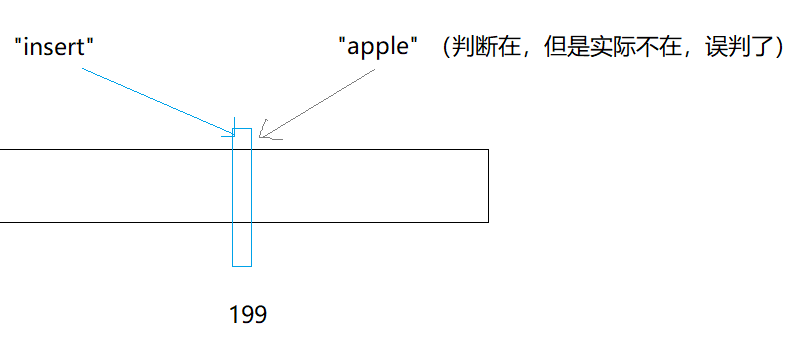
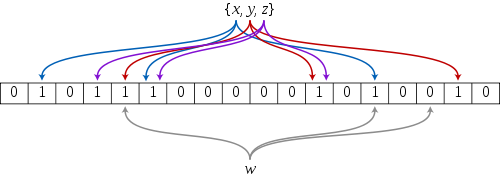

# 哈希概念

> 顺序结构以及平衡树中，元素关键码与其存储位置之间没有对应的关系，因此在查找一个元素时，必须要经过关键码的多次比较。顺序查找时间复杂度为$O(N)$，平衡树中为树的高度，即$O(\log_2 N)$，搜索的效率取决于搜索过程中元素的比较次数。

理想的搜索方法：可以不经过任何比较，一次直接从表中得到要搜索的元素。

如果构造一种存储结构，通过某种函数（hashFunc）使**元素的存储位置**与它的**关键码**之间能够建立**一一映射**的关系，那么在查找时通过该函数可以很快找到该元素。

当向该结构中**插入元素**：

* 根据待插入元素的关键码，以此函数计算出该元素的存储位置并按此位置进行存放。

当向该结构中**搜索元素**：

* 对元素的关键码进行同样的计算，把求得的函数值当做元素的存储位置，在结构中按此位置取元素比较，若关键码相等，则搜索成功。

该方式即为哈希（散列）方法，哈希方法中使用的转换函数称为哈希（散列）函数，构造出来的结构称为哈希表（Hash Table，或者称散列表）。因此哈希更像是一种算法思想，类似贪心、分治等，哈希表是用这个思想实现的一种数据结构。


# 常见的哈希

## 其他哈希

1. 直接定址法

取关键字的某个线性函数为散列地址：$\text{Hash}(\text{Key})= \text{A}\times \text{Key + B}$。

优点是简单、均匀，缺点是需要事先知道关键字的分布情况。

使用场景：适合查找比较小且连续的情况。

例如`{2,5,3,99,33,99999,888,34}`，因为最大值和最小值差距过大，用直接定址会浪费大量的空间。

2. **除留余数法**

设散列表中允许的地址数为`m`，取一个不大于`m`，但最接近或者等于`m`的质数`p`作为除数。

按照哈希函数：$\text{Hash(key) = key}\% p(p\leq m)$，将关键码转换成哈希地址。

但容易出现哈希冲突（或哈希碰撞）：不同的值的哈希值相同。

例如：数据集合`{1，7，6，4，5，9}`；哈希函数设置为：$\text{hash(key) = key} \% \text{capacity}$; `capacity`为存储元素底层空间总的大小。



用该方法进行搜索不必进行多次关键码的比较，因此搜索的速度比较快。除留取余法也是学习的重点。

可以通过数学证明，当`p`或`capacity`为质数时，产生冲突的概率最小。

3. 平方取中法(了解)

假设关键字为1234，对它平方就是1522756，抽取中间的3位227作为哈希地址；再比如关键字为4321，对它平方就是18671041，抽取中间的3位671(或710)作为哈希地址。

平方取中法比较适合：不知道关键字的分布，而位数又不是很大的情况。

因为用的比较少，就只简单提及。

4. 折叠法(了解)

折叠法是将关键字从左到右分割成位数相等的几部分(最后一部分位数可以短些)，然后将这几部分叠加求和，并按散列表表长，取后几位作为散列地址。

折叠法适合事先不需要知道关键字的分布，适合关键字位数比较多的情况。

因为用的比较少，就只简单提及。

5. 随机数法(了解)

选择一个随机函数，取关键字的随机函数值为它的哈希地址，即$\text{H(key) = random(key)}$，其中 $\text{random}$ 为随机数函数。通常应用于关键字长度不等时采用此法。

因为用的比较少，就只简单提及。

6. 数学分析法(了解)

设有`n`个`d`位数，每一位可能有 `r` 种不同的符号，这 `r` 种不同的符号在各位上出现的频率不一定相同，可能在某些位上分布比较均匀，每种符号出现的机会均等，在某些位上分布不均匀只有某几种符号经常出现。可根据散列表的大小，选择其中各种符号分布均匀的若干位作为散列地址。例如：




假设要存储某家公司员工登记表，如果用手机号作为关键字，那么极有可能前7位都是 相同的，那么我们可以选择后面的四位作为散列地址，如果这样的抽取工作还容易出现 冲突，还可以对抽取出来的数字进行反转(如1234改成4321)、右环位移(如1234改成4123)、左环移位、前两数与后两数叠加(如1234改成12+34=46)等方法。

数字分析法通常适合处理关键字位数比较大的情况，如果事先知道关键字的分布且关键字的若干位分布较均匀的情况。

因为用的比较少，就只简单提及。

## 字符串哈希（算法竞赛常用）

在算法竞赛中，有时会对长度为$m$字符串进行这样的处理：

选取 2 个互质常数 `b` 和 `h` ，`b < h`，设字符串$C=c_1c_2\cdots c_m$，则可定义哈希函数

$H(C)=(c_1b^{m-1}+c_2b^{m-2}+\cdots +c_mb^0)\bmod h$。

这个定义和进制数很像，在某种意义上也可以把$H(C)$看作是 $b$ 进制数。和进制数类似就意味着这个表达式可以通过递推实现：

$H(C_{k+1})=H(C_k)\times b+c_{k+1}$，$0\leq k\leq m$。

在实际应用中，最常见的做法是 hash 值用无符号数存储，这样就可以省略对 hash 值取模的操作（无符号数溢出自动取模）。所以字符串哈希实质就是将字符串用一个整数来表示。举个例子，$\text{C=abcd}$，

$H(C_0)=97$，97是 $a$ 的 ASCII 码值，也可以使用序号0、1表示。
$H(C_1)=H(C_0)\times b+98=97b+98$，
$H(C_2)=H(C_1)\times b+99=H(C_0)\times b^2+98b+99=97b^2+98b+99$，
$H(C_3)=H(C_2)\times b+100=97b^3+98b^2+99b+100$。

字符串哈希主要解决字符串匹配问题：寻找长度为 $n$ 的主串 $S$ 中的匹配串 $T$ （假设长度为 $m$）的**出现次数**或**出现位置**。尽管 c++ 的`string`自带`find`函数，STL工具里也有类似的工具，但那些工具的实现方式是暴力匹配（Brute Force）算法，时间复杂度$O(n\times m)$，在主串和匹配串的长度乘积数量级超过$10^8$时就有超时的风险（指大多数OJ运行时长限制为 1 秒）。

字符串哈希的准备工作的时间复杂度是$O(n+m)$，查询匹配串的时间复杂度为$O(n-m)$。具体查询方法：

例如匹配串$\text{T=bc}$，查询$T$在$C$中的位置时，有
$H(T)=H(C_{0+2})-H(C_0)\times b^2=97b^2+98b+99-97b^2=98b+99$。

通用的查询公式：
$H(T)=H(C_{i+len})-H(C_i)\times b^{len}$。（下标从0开始计数）

查询匹配串时，需要计算不同长度的字符串的哈希值存储在数组中。之后从开头遍历到$n-m$，利用公式进行判断即可。

且通过字符串哈希算法可将字符串转换成数字时，也可以通过直接定址法或除留取余法存入哈希表。只需要对库中的获取哈希值的仿函数做一个字符串的特化即可。但无论质数如何取，都无法完全避免哈希冲突。

## 字符串哈希OJ

### P3370 【模板】字符串哈希 - 洛谷

[P3370 【模板】字符串哈希 - 洛谷](https://www.luogu.com.cn/problem/P3370)

模板题，将所有字符串的哈希值计算出来，放入`set`或`unordered_set`中去重即可。

```cpp
#include<bits/stdc++.h>
using namespace std;
typedef unsigned long long ULL;
set<ULL>a;
ULL b = 37;

//计算字符串的哈希值
void get_hash(string& st) {
	ULL hash = 0;
	for (auto&x:st)
		hash = hash * b + x;
	a.insert(hash);
}

int main() {
	int n; cin >> n;
	string st;
	while (n--) {
		cin >> st;
		get_hash(st);
	}
	cout << a.size() << endl;
	return 0;
}
```

### P10468 兔子与兔子 - 洛谷

[P10468 兔子与兔子 - 洛谷](https://www.luogu.com.cn/problem/P10468)

题目涉及频繁的区间查询，因此需要计算不同长度的字符串的哈希值，和不同质数次幂存储起来，用以方便查询。

需要注意的是，测试样例是按照字符串首字符的下标为1进行计算的，因此计算哈希值时需要先做预处理。

之后就是通过公式`Hash[i]=Hash[i-1]*P+st[i]`计算哈希值（`st[i]-'a'`也不影响，因为字符串只有小写字母）。

查询时按照公式`Hash[r]-Hash[l-1]*pm[r-l+1]`获取指定字符串的哈希值。

```cpp
#include <bits/stdc++.h>
using namespace std;
typedef unsigned long long ULL;
ULL Hash[1000010];
ULL pm[1000010] = { 1,31 };
int P = 31;

int main() {
	string st;
	cin >> st;
	st = '_' + st;
	Hash[1] = st[1] - 'a';
	for (size_t i = 2; i < st.size(); i++) {
		Hash[i] = Hash[i - 1] * P + st[i]-'a';
		pm[i] = pm[i - 1] * P;
	}
	int T; cin >> T;
	while (T--) {
		int l1, r1, l2, r2;
		cin >> l1 >> r1 >> l2 >> r2;
		if (r1 >= st.size() || r2 >= st.size()) {
			cout << "No\n";
			continue;
		}
		if (Hash[r1] - Hash[l1 - 1] * pm[r1 - l1 + 1] ==
			Hash[r2] - Hash[l2 - 1] * pm[r2 - l2 + 1])
			cout << "Yes\n";
		else
			cout << "No\n";
	}
	return 0;
}
```


# 哈希冲突

对于两个数据元素的关键字 $k_i$ 和 $k_j\ (i != j)$，有 $k_i$ != $k_j$ ，但有：
$\text{Hash}(k_i) = \text{Hash}(k_j)$，即：**不同关键字通过相同的哈希函数计算出相同的哈希地址**，该种现象称为**哈希冲突**（或哈希碰撞）。

把具有不同关键码而具有相同哈希地址的数据元素称为 “同义词”。

引起哈希冲突的一个原因可能是：**哈希函数设计不够合理**。例如直接定址法的哈希函数$\text{Hash}(\text{Key})= \text{A}\times \text{Key + B}$，虽然不会产生哈希冲突的问题，但占用空间会变的很大，因此一般的哈希函数设计不合理可能是在某些方面做了牺牲导致存在哈希冲突的可能。

## 哈希函数设计原则

哈希函数设计原则：

1. 哈希函数的定义域必须**包括需要存储的全部关键码**，而如果散列表允许有`m`个地址时，其值域必须在`0`到`m-1`之间。

2. 哈希函数计算出来的**地址能均匀分布**在整个空间中。
3. 哈希函数应该比较简单。

哈希函数设计的越精妙，产生哈希冲突的可能性就越低，但是无法避免哈希冲突。

解决哈希冲突两种常见的方法是：**闭散列**和**开散列**。

## 哈希冲突解决方法—闭散列

闭散列也叫**开放定址法**，当**发生哈希冲突**时，如果哈希表未被装满，说明在哈希表中必然还有空位置，那么可以把 `key` **存放到冲突位置中的下一个空位**置中去。如何寻找下一个空位是要解决的问题。

### 闭散列的线性探测

比如之前的除留取余法场景，现在需要插入元素44，先通过哈希函数计算哈希地址，`hashAddr` 为4，因此44理论上应该插在该位置，但是该位置已经放了值为4的元素，即发生哈希冲突。

于是从发生冲突的位置开始，依次向后探测（若后续空位置没有了，则从0开始），直到寻找到下一个空位置为止。显然在这个哈希表中找到下标为8的位置为空。这种解决哈希冲突的办法叫**线性探测**。



线性探测的操作：

* 插入
  * 通过哈希函数获取待插入元素在哈希表中的位置。即**获取哈希地址**。
  * 如果该位置中**没有元素则直接插入**新元素。
  * 如果该位置中有元素**发生哈希冲突**，使用**线性探测找到下一个空位**置，插入新元素。只要负载因子不是1，就一定能找到。

* 删除
  * 采用闭散列处理哈希冲突时，不能随便物理删除哈希表中已有的元素，若直接删除元素会影响其他元素的搜索。

    比如删除元素4，如果直接删除掉，44查找起来可能会受影响。因此线性探测**采用标记的伪删除法**来删除一个元素。这种伪删除法在[栈的c语言实现 - CSDN博客](https://blog.csdn.net/m0_73693552/article/details/143463685)中有提到，但栈是通过栈顶指针来控制元素是否被删除，在哈希表的话需要用其他标志（比如`enum`定义3个枚举常量表示状态）来记录。
  
* 扩容

  哈希表的扩容和载荷因子有关。

  散列表的载荷因子（有的资料称负载因子，它们都是同一概念的中文翻译）定义为：
  $\alpha$ = 填入表中的元素个数 $\div$ 散列表的长度
  
  $\alpha$ 是散列表装满程度的标志因子。由于表长是定值，$\alpha$ 与“填入表中的元素个数”成正比。
  
  所以，$\alpha$ 越大，表明填入表中的元素越多，产生冲突的可能性就越大；
  反之，$\alpha$ 越小，标明填入表中的元素越少，产生冲突的可能性就越小。
  
  实际上，散列表的平均查找长度是载荷因子的函数，只是不同处理冲突的方法有不同的函数。

> 对于开放定址法，荷载因子是特别重要因素，应严格限制在0.7或0.8以下。超过0.8，查表时的CPU缓存不命中（cache missing）按照指数曲线上升。因此，一些采用开放定址法的 hash 库，如 Java 的系统库限制了荷载因子为0.75，超过此值将`resize`（扩容）散列表。
>
> 研究表明：当表的长度为质数且表装载因子 $\alpha$ 不超过0.5时，新的表项一定能够插入，而且任何一个位置都不会被探查两次。因此只要表中有一半的空位置，就不会存在表满的问题。在搜索时可以不考虑表装满的情况，但在插入时必须确保表的装载因子 $\alpha$ 不超过0.5**，**如果超出必须考虑增容。

ASL（Average Search Length），即平均查找长度，用于衡量散列表的效率的属性。在查找成功的情况下，
$ASL_{成功}=\frac{\sum 查找次数}{元素个数}$。其中每个元素的查找次数为从计算出的哈希地址开始比较，到找到当前数据总共的比较次数。$\frac{1}{元素个数}$也可以叫查找概率，或每个关键字的权重。

查找失败的前提是查找到空位置，例如映射到下标1的元素，需要查找到空位2才算查找失败，所以需要查找1次才能确定查找失败。而空位置同样需要做至少1次比较，所以查找次数为1次。

$ASL_{失败}=\frac{\sum 查找次数}{p}$，$p$是除留取余法的模数，也可以是空间大小。



线性探测优点是实现非常简单，缺点也很明显，一旦发生哈希冲突，所有的冲突连在一起，容易产生数据“堆积”，即：不同关键码占据了可利用的空位置，使得寻找某关键码的位置需要许多次比较，导致搜索效率降低。

### 闭散列的二次探测

线性探测的缺陷是产生冲突的数据堆积在一块，这与其找下一个空位置的方法有关系，因为找空位置的方式就是挨着往后逐个去找。

因此二次探测为了避免该问题，找下一个空位置的方法为按照$+1^2, -1^2, +2^2, -2^2, \dots$的顺序进行探测，具体按照函数$H_i = (H_0 + i^2 )\% m$, 或者：$H_i = (H_0 - i^2 )\% m$去查找。其中：$i = 1,2,3,\dots$。

但二次探测意味着走更大的步长，尽管比起一次探测减少了冲突聚集和同负载因子下冲突概率低于一次探测，但仍然会带来**二次聚集**（即哈希冲突造成的聚集依旧会出现，只是出现得更晚）。

且步长增加可能导致无法找到空位，且负载因子越大，因为**找不到空位**陷入死循环的风险越高。有研究证明，哈希表的表长为$4k+3(k\in N^*)$的素数时一定可以探测到，详细证明见[开放定址法——平方探测(Quadratic Probing) - 仪式黑刃 - 博客园](https://www.cnblogs.com/hongshijie/p/9432838.html)。

闭散列无论是哪种探测，对哈希表的每个位置都要设置3种状态例如`EMPTY`、`DELETE`、`EXIST`。默认情况表是`EMPTY`，有数据插入时修改为`EXIST`，删除数据时修改为`DELETE`。这样做是为了避免删除数据后造成`EMPTY`位影响查找。

综上，无论是线性探测还是二次探测，闭散列最大的缺陷就是空间利用率比较低，这同样也是哈希的缺陷。但闭散列也并非不能用，在数据量小但操作频率高的场景，闭散列的性能也略优于其他解决方法（回忆[交换排序——快速排序3 针对LeetCode某OJ的优化-CSDN博客](https://blog.csdn.net/m0_73693552/article/details/143896556)中的小区间优化）。


## 哈希冲突解决方法—开散列

开散列是哈希的学习重点。

### 开散列概念

**开散列法**又叫**链地址法**（**开链法**、**拉链法**），首先对关键码集合用散列函数计算散列地址，具有**相同地址的关键码归于同一子集合**，每一个子集合称为一个桶，各个桶中的元素通过一个（单）链表链接起来，各链表的头结点存储在哈希表中。对这个抽象出来的桶有的资料称**哈希桶**。



从上图可以看出，**开散列中每个桶中放的都是发生哈希冲突的元素**。

### 开散列增容

桶的个数是固定的，随着元素的不断插入，每个桶中元素的个数不断增多，极端情况下，可能会导致一个桶中链表节点非常多，会影响的哈希表的性能。

主流的解决方法有二：

* 链表换成红黑树。或红黑树和链表一起使用（需要注意红黑树一般不允许修改键值，实现上会比较麻烦）。
* 对哈希表进行增容。

而且很多时候都是 2 个解决方法一起使用。

开散列最好的情况是：每个哈希桶中刚好挂一个节点，再继续插入元素时，每一次都会发生哈希冲突，因此，在元素个数刚好等于桶的个数时，可以给哈希表增容。

ASL对开散列同样适用。但其中空指针的查找失败的情况有的资料算作0，而有的算作1。

**开散列与闭散列比较**：

应用链地址法处理溢出，需要增设链接指针，似乎增加了存储开销。事实上：由于开放定址法必须保持大量的空闲空间以确保搜索效率，如二次探查法要求装载因子$a \leq 0.7$，而表项所占空间又比指针大的多，所以使用链地址法反而比开地址法节省存储空间。

## 哈希算法的时间复杂度计算

哈希表的时间复杂度主要取决于**哈希函数质量**、**冲突解决策略**、**负载因子**（Load Factor） 等因素，因此只能做大致估算。

在开散列中，可通过平均查找长度（ASL - Average Search Length）来确定。即找每个元素需要查找的次数加起来，除以总的元素个数，结果的数量级即为时间复杂度。

在闭散列中，查找任何元素都有可能进行若干次一次探测或二次探测，不同的数据集合可能造成探测的平均次数不同，比起开散列更难估计。

但无论如何，哈希的平均复杂度是$O(1)$。但在开散列中，某个哈希桶的长度太长会降低哈希表的性能，有的工具为解决这个问题，会将哈希桶也设置成红黑树。


# 哈希的应用

## c++STL-unordered系列

`unordered`系列工具指`unordered_map`、`unordered_multimap`、`unordered_set`、`unordered_multiset`，这些工具都是在C++11标准中添加，使用它们需要编译器支持C++11。详细参考[ - C++ Reference](https://legacy.cplusplus.com/reference/unordered_map/)。

```cpp
//unordered_set
template < class Key, // unordered_set::key_type/value_type
           class Hash = hash<Key>,//unordered_set::hasher
           class Pred = equal_to<Key>, //unordered_set::key_equal
           class Alloc = allocator<Key>//unordered_set::allocator_type
           > class unordered_set;
//unordered_multiset
template < class Key,//unordered_multiset::key_type/value_type
           class Hash = hash<Key>,
           class Pred = equal_to<Key>,
           class Alloc = allocator<Key> 
           > class unordered_multiset;

//unordered_map
template < class Key,
           class T,
           class Hash = hash<Key>,
           class Pred = equal_to<Key>,
           class Alloc = allocator< pair<const Key,T> >
           > class unordered_map;
//unordered_multimap
template < class Key,
           class T,
           class Hash = hash<Key>,
           class Pred = equal_to<Key>,
           class Alloc = allocator< pair<const Key,T> >
           > class unordered_multimap;
```

> 严格来说，之前的`map`、`set`是通过红黑树实现的，而`unordered`系列则是通过哈希表实现的。
>
> STL设计开始的时候，可能因为调研等各种原因，没考虑引入哈希，而是直接设计了红黑树为基础的`map`和`set`，这就导致后期引入哈希的`map`和哈希的`set`时不能用原来的名字，于是就改用`unordered`。
>
> `unordered`中文翻译大致为无序，可能是想暗示存储方式是无序的（红黑树通过中序遍历得到的数据也是有序的序列）。
>
> 但这些历史的工具，我们仅需学习即可。而且它们的使用和`map`和`set`在绝大部分场合无区别。

这些工具和`map`、`set`的使用方法几乎一致，详细见[c++STL-map和set的模拟实现-CSDN博客](https://blog.csdn.net/m0_73693552/article/details/149635563)。这里挑重点讲。

### 红黑树和哈希表的插入特点

红黑树因为二叉搜索树的特性，插入其中的数据再遍历时是有序的，但哈希表无序。

```cpp
#include<set>
#include<unordered_set>
#include<vector>
#include<iostream>
using namespace std;

template<class T>
void print(T& c) {
	for (auto& x : c)
		cout << x << ' ';
	cout << endl;
}

template<class T>
void Insert(T& c) {
	vector<int>a = { 11,4,18,61,19,5,68,64 };
	for (auto& x : a)
		c.insert(x);
}

int main() {
	set<int>tree;
	unordered_set<int>ht;
	Insert(tree);
	print(tree);
	Insert(ht);
	print(ht);
	return 0;
}
```

在MSVC编译器（IDE是VS2019）运行结果：

```
4 5 11 18 19 61 64 68
19 11 68 4 18 5 61 64
```

在g++编译器（IDE是Dev-c++ 5.11）运行结果：

```
4 5 11 18 19 61 64 68
64 68 5 19 61 18 4 11
```

在2个编译器下，同一代码的输出不同的根本原因是不同编译器对底层哈希表的实现方式不同，包括哈希函数设计、哈希冲突解决策略、扩容机制等。这里不过多细究。

### 红黑树和哈希表的效率对比

首先是无序，且重复较少的情况。

```cpp
#include<set>
#include<unordered_set>
#include<vector>
#include<iostream>
#include<ctime>
using namespace std;
vector<int>nums(100000);

template<class T>
size_t Insert(T& c) {
	size_t start = 0, finish = 0;
	//测试插入
	start = clock();
	for (auto& x : nums)
		c.insert(x);
	finish = clock();
	return finish - start;
}

template<class T>
size_t Find(T& c) {
	size_t start = 0, finish = 0;
	//测试插入
	auto ans = c.find(*c.begin());
	start = clock();
	for (auto& x : nums)
		ans = c.find(x);
	finish = clock();
	return finish - start;
}

template<class T>
size_t Erase(T& c) {
	size_t start = 0, finish = 0;
	//测试插入
	start = clock();
	for (auto& x : nums)
		c.erase(x);
	finish = clock();
	return finish - start;
}

int main() {
	srand(size_t(time(0)));
	for (size_t i = 0; i < nums.size(); i++)
		nums[i] = rand() * rand();
	set<int>tree;
	unordered_set<int>ht;
	cout << "set insert: " << Insert(tree) << endl;
	cout << "unordered_set insert: " << Insert(ht) << endl;
	cout << "set 成功插入数量：" << tree.size() << endl;
	cout << "unordered_set 成功插入数量：" << ht.size() << endl;
	cout << "set find: " << Find(tree) << endl;
	cout << "unordered_set find: " << Find(ht) << endl;
	cout << "set erase: " << Erase(tree) << endl;
	cout << "unordered_set erase: " << Erase(ht) << endl;
	return 0;
}
```

输出结果之一（VS2019，32位，Debug模式）：

```cpp
set insert: 249
unordered_set insert: 185
set 成功插入数量：99948
unordered_set 成功插入数量：99948
set find: 155
unordered_set find: 68
set erase: 259
unordered_set erase: 56
```

然后是有序的情况。

```cpp
int main() {
	for (size_t i = 0; i < nums.size(); i++)
		nums[i] = i;
	set<int>tree;
	unordered_set<int>ht;
	cout << "set insert: " << Insert(tree) << endl;
	cout << "unordered_set insert: " << Insert(ht) << endl;
	cout << "set 成功插入数量：" << tree.size() << endl;
	cout << "unordered_set 成功插入数量：" << ht.size() << endl;
	cout << "set find: " << Find(tree) << endl;
	cout << "unordered_set find: " << Find(ht) << endl;
	cout << "set erase: " << Erase(tree) << endl;
	cout << "unordered_set erase: " << Erase(ht) << endl;
	return 0;
}
```

输出结果之一（VS2019，32位，Debug模式）：

```cpp
set insert: 273
unordered_set insert: 175
set 成功插入数量：100000
unordered_set 成功插入数量：100000
set find: 129
unordered_set find: 62
set erase: 208
unordered_set erase: 52
```

更极端的情况：

```cpp
int main() {
	for (size_t i = 0; i < nums.size() / 2; i++)
		nums[i] = 666;
	for (size_t i = nums.size() / 2; i < nums.size(); i++)
		nums[i] = 999;
	set<int>tree;
	unordered_set<int>ht;
	cout << "set insert: " << Insert(tree) << endl;
	cout << "unordered_set insert: " << Insert(ht) << endl;
	cout << "set 成功插入数量：" << tree.size() << endl;
	cout << "unordered_set 成功插入数量：" << ht.size() << endl;
	cout << "set find: " << Find(tree) << endl;
	cout << "unordered_set find: " << Find(ht) << endl;
	cout << "set erase: " << Erase(tree) << endl;
	cout << "unordered_set erase: " << Erase(ht) << endl;
	return 0;
}
```

输出结果之一（VS2019，32位，Debug模式）：

```cpp
set insert: 62
unordered_set insert: 55
set 成功插入数量：2
unordered_set 成功插入数量：2
set find: 43
unordered_set find: 56
set erase: 42
unordered_set erase: 10
```

这里差距不明显的原因是VS2019的哈希表的底层实现有用红黑树优化。若使用单链表，或其他哈希函数则可能做不到这种优势。

但可以肯定的是，在有序的情况下，红黑树比哈希表有优势，因为红黑树的平衡调节机制能避免直接比较所有函数。

但数据无序时，很多时候看上去是哈希表对红黑树的全面碾压。

### 哈希表特有的成员函数

`unordered_map`、`unordered_set`、`unordered_multimap`、`unordered_multiset`都有的：

```cpp
//Buckets
size_type bucket_count() const noexcept;
size_type max_bucket_count() const noexcept;
size_type bucket_size ( size_type n ) const;
size_type bucket ( const key_type& k ) const;
//Hash policy
float load_factor() const noexcept;
float max_load_factor() const noexcept;
void max_load_factor ( float z );
void rehash ( size_type n );
void reserve ( size_type n );
//Observers
hasher hash_function() const;//hasher是第3个模板参数
key_equal key_eq() const;
allocator_type get_allocator() const noexcept;
```

`bucket_count`：返回当前哈希表中桶（bucket）的数量。

`max_bucket_count()`：返回哈希表能支持的最大桶数（由系统和实现限制）。

`bucket_size( size_type n )`：返回第 `n` 个桶中的元素数量。

`bucket ( const key_type& k )`：返回键 `k` 所在的桶的索引。

`load_factor`：返回当前负载因子，即 $\frac{元素数量}{桶数量}$。

`float max_load_factor()`：返回哈希表的最大允许负载因子（默认通常为 1.0）。

`void max_load_factor`：设置最大负载因子为 `z`。`z` 为正数，建议在 `0.1 ~ 1.0` 之间。

`rehash( size_type n )`：将桶数量调整为至少 `n`，并重新哈希所有元素。

`reserve( size_type n )`：预留至少能容纳 `n` 个元素的桶空间。

`hash_function`：返回哈希表使用的哈希函数对象。

`key_eq`：返回哈希表使用的键比较函数对象（默认是 `std::equal_to<key_type>`）。

`get_allocator`：返回哈希表的内存分配器。

`noexcept`关键字会使函数不会抛出异常，主要用于优化函数性能。若使用了`noexcept`关键字修饰函数，但函数依旧抛出了异常，则程序会调用`std::terminate`强行终止程序（断言）。

学习了这么多容器，相信这些函数看一眼就知道怎么玩，就不给使用示例了。

### 可能有关的OJ

#### 961. 在长度 2N 的数组中找出重复 N 次的元素 - 力扣

[961. 在长度 2N 的数组中找出重复 N 次的元素 - 力扣（LeetCode）](https://leetcode.cn/problems/n-repeated-element-in-size-2n-array/)

```cpp
class Solution {
public:
    int repeatedNTimes(vector<int>& nums) {
        unordered_map<int,int>hash;
        for(auto&x:nums)
            hash[x]++;
        for(auto&x:hash)
            if(x.second>1)
                return x.first;
        return 0;
    }
};
```

#### 350. 两个数组的交集 II - 力扣

[350. 两个数组的交集 II - 力扣（LeetCode）](https://leetcode.cn/problems/intersection-of-two-arrays-ii/description/)

```cpp
class Solution {
public:
    vector<int> intersect(vector<int>& nums1, vector<int>& nums2) {
        sort(nums1.begin(),nums1.end());
        sort(nums2.begin(),nums2.end());
        int p1=0,p2=0;
        vector<int>ans;
        while(p1<nums1.size()&&p2<nums2.size()){
            if(nums1[p1]<nums2[p2])
                ++p1;
            else if(nums1[p1]>nums2[p2])
                ++p2;
            else{
                ans.push_back(nums1[p1++]);
                p2++;
            }
        }
        return ans;
    }
};
```

#### 217. 存在重复元素 - 力扣

[217. 存在重复元素 - 力扣（LeetCode）](https://leetcode.cn/problems/contains-duplicate/description/)

```cpp
class Solution {
public:
    bool containsDuplicate(vector<int>& nums) {
        unordered_map<int,int>mp;
        for(auto&x:nums)
            mp[x]++;
        for(auto&x:mp)
            if(x.second>1)
                return true;
        return false;
    }
};
```

#### 884. 两句话中的不常见单词 - 力扣

[884. 两句话中的不常见单词 - 力扣（LeetCode）](https://leetcode.cn/problems/uncommon-words-from-two-sentences/description/)

```cpp
class Solution {
public:
    vector<string> uncommonFromSentences(string s1, string s2) {
        unordered_map<string,int>mp;
        vector<string>ans;
        size_t p=0;
        for(size_t i=s1.find(" ",0);
        i!=-1;i=s1.find(" ",i+1)){
            mp[s1.substr(p,i-p)]++;
            p=i+1;
        }
        if(p<s1.size())
            mp[s1.substr(p)]++;
        p=0;
        for(size_t i=s2.find(" ",0);
        i!=-1;i=s2.find(" ",i+1)){
            mp[s2.substr(p,i-p)]++;
            p=i+1;
        }
        if(p<s2.size())
            mp[s2.substr(p)]++;
        for(auto&x:mp)
            if(x.second==1)
                ans.push_back(x.first);
        return ans;
    }
};
```


## 位图bitset

面试题（背景）：给40亿个不重复的无符号整数，没排过序。给一个无符号整数，如何快速判断一个数是否在这40亿个数中。【腾讯】

方法：

1. 遍历，时间复杂度$O(N)$。首先排除。

2. 排序（$O(N\log N)$)，利用二分查找: $\log N$。

   理论查找次数：$\log_2{4\times 10^9}\approx 9\log_2{10}\approx 32$，即最多查找32次。

   现在的问题是，内存中没有这么多的空间存储这么多数，更不用说对这么多数进行排序。

3. 位图解决。

数据是否在给定的整形数据中，结果是在或者不在，刚好是两种状态，那么可以使用一个二进制比特位来代表数据是否存在的信息，如果二进制比特位为1，代表存在，为0代表不存在。比如小端存储的设备：



所谓位图，就是用每一位 bit 位来存放某种状态，适用于海量数据，数据无重复的场景。通常是用来**判断某个数据存不存在的**。位图实质上是**直接定址法的哈希**，在STL中也有对应的工具，属于位序列容器，详见[bitset - C++ Reference](https://legacy.cplusplus.com/reference/bitset/bitset/?kw=bitset)。

但这个`bitset`的底层是静态数组，在编译时确认容量，因此`bitset`是直接在栈上分配内存，在函数内部申请栈空间不够用，推荐放全局使用。

**位图的应用**：

1. 快速查找某个数据是否在一个集合中。

2. 排序 + 去重。

3. 求两个集合的交集、并集等。

4. 操作系统中磁盘块标记。

### 构造函数

```cpp
bitset();
bitset (unsigned long val);
template<class charT, class traits, class Alloc>
  explicit bitset (const basic_string<charT,traits,Alloc>& str,
    typename basic_string<charT,traits,Alloc>::size_type pos = 0,
    typename basic_string<charT,traits,Alloc>::size_type n =
      basic_string<charT,traits,Alloc>::npos);
```

第3个构造函数：

`basic_string`实际就是标准库里的`string`，这里写全是因为这个位图可能使用`wstring`或其他的。

剩下的3个形参就是从下标0开始的`n`和字符。

```cpp
#include <iostream>
//使用STL的位图需要展开头文件
#include <bitset>
using namespace std;

int main() {
	bitset<8>bt1(0xaa);
	bitset<8>bt2(0xBB);
	bitset<8>bt3("10101010");
	//需要指出用的是哪个basic_string
	bitset<8>bt4(string("10111100"), 3, 3);
	bitset<8>bt5;
	//bitset<8>bt6("g8sad41");//字符串只能包含0和1，否则会产生未定义行为
	//位图有重载operator<<
	cout << bt1 << endl;
	cout << bt2 << endl;
	cout << bt3 << endl;
	cout << bt4 << endl;
	cout << bt5 << endl;
	return 0;
}
```

输出：

```
10101010
10111011
10101010
00000111
00000000

```

位图支持几乎所有的关系运算符。

```cpp
//member functions	成员函数
bitset& operator&= (const bitset& rhs);
bitset& operator|= (const bitset& rhs);
bitset& operator^= (const bitset& rhs);
bitset& operator<<= (size_t pos);
bitset& operator>>= (size_t pos);
bitset operator~() const;
bitset operator<<(size_t pos) const;
bitset operator>>(size_t pos) const;
bool operator== (const bitset& rhs) const;
bool operator!= (const bitset& rhs) const;

//non-member functions	 非成员函数
template<size_t N>
bitset<N> operator& (const bitset<N>& lhs, const bitset<N>& rhs);
template<size_t N>
bitset<N> operator| (const bitset<N>& lhs, const bitset<N>& rhs);
template<size_t N>
bitset<N> operator^ (const bitset<N>& lhs, const bitset<N>& rhs);

//iostream inserters/extractors 支持流插入和流提取的关键	
template<class charT, class traits, size_t N>
basic_istream<charT, traits>&
operator>> (basic_istream<charT,traits>& is, bitset<N>& rhs);
template<class charT, class traits, size_t N>
basic_ostream<charT, traits>&
operator<< (basic_ostream<charT,traits>& os, const bitset<N>& rhs);
```

### 函数接口Bit access

```cpp
     bool operator[] (size_t pos) const;
reference operator[] (size_t pos);
size_t count() const;
size_t size() const;
bool test (size_t pos) const;
bool any() const;
bool none() const;
bool all() const noexcept;//需要编译器支持c++11
```

`[]`：返回第`pos`位的值，不检查越界，即给的值超过初始化范围会造成越界访问，行为未定义。`reference`是引用，也就是说位图支持下标修改。

`test`：返回第`pos`位的值，会检查越界，若越界会抛出异常`std::out_of_range`。和`[]`功能有重叠。

`count`：返回存储的1的总位数。

`size`：返回模板参数`N`即总位数。

`any`：检查位图是否至少有1个1。

`none`：检查是否全为0。

`all`：检查是否全为1。

```cpp
#include <iostream>
#include <bitset>
using namespace std;

int main() {
	try {
		bitset<32>bt;
		cout << bt.size() << endl;
		cout << bt.none() << endl;
		bt[3] = 1;
		cout << bt.test(3) << endl;
		cout << bt.count() << endl;
		cout << bt.any() << endl;
		cout << bt.all() << endl;
		bt = 0xffffffff;//赋值unsigned(-1)
		cout << bt.all() << endl;
		//bt[34] = 1;//越界访问且不会被异常捕获
		auto nn=bt.test(34);//越界访问且会被异常捕获
	}
	catch (const exception& e) {
		cout << e.what() << endl;
	}
	return 0;
}
```

### 比特位操作Bit operations

```cpp
bitset& set();
bitset& set (size_t pos, bool val = true);
bitset& reset();
bitset& reset (size_t pos);
bitset& flip();
bitset& flip (size_t pos);
template <class charT, class traits, class Alloc>
  basic_string<charT,traits,Alloc> to_string() const;
unsigned long to_ulong() const;
unsigned long long to_ullong() const;
```

`set`：啥参数都不给就全变1，给参数就变指定位为`val`。

`reset`：啥参数都不给就全变0，给参数就变指定位为0。

`flip`：啥都不给时将所有位取反，否则就将第`pos`位取反。

剩下的`to_string`是根据位图存储的数据返回字符串，`to_ulong`是返回`unsigned long`，`to_ullong`是返回`unsigned long long`型整数。

### 模拟实现位图

回顾之前的问题：给40亿个不重复的无符号整数，没排过序。给一个无符号整数，如何快速判断一个数是否在这40亿个数中。【腾讯】

在c语言中，一个`int`有32个bit位，存储`N`个数，开`N/32+1`个`int`的空间即可满足存储这么多数据在与不在的信息。

所以40亿个整数需要42亿+的比特位（方便计算），约为1 3421 7728个`int`型变量的数组，换算成内存是 0.5 GB，内存可以容纳。若是用`bitset`，则需要将`bitset`放在全局，函数内部无法存放这么多的数据。

位图的底层可以用`vector<int>`代替，即动态数组。因此可以自己设计一个位图。

位图的操作可以先设计3个函数：

1. `set`函数。
2. `reset`函数。
3. `test`函数。

也可以加别的函数，这里设计3个就足够解决绝大部分大数据查找问题。

操纵 bit 位最常用的方式是通过1左移多少位来操作。左移指在内存中将所有1往高位移，无论是大端还是小端存储。例如想让第4个 bit 位变成1：

```cpp
void f(int& aim){
	aim|=(1<<4);
}
```

即1先左移4位，再和`aim`进行或运算，因为`1<<4`转换成`int`后其他位全是0，与`aim`进行或运算，除了指定 bit 位，其他位不受影响。

模拟实现参考：

```cpp
namespace mystd {
	// N是需要多少比特位
	template<size_t N>
	class bitset {
	public:
		bitset() {
			_bits.resize(N/32+1, 0);
			//_bits.resize((N>>5) + 1, 0);//可以使用位运算计算需要多少空间 
		}

		void set(size_t x) {//将bit位设置为1 
			size_t i = x / 32;//查找数据在第几个整型 
			size_t j = x % 32;//查找数据在一个整型中的第几位 
			_bits[i] |= (1 << j);
		}

		void reset(size_t x) {//将bit位设置成0 
			size_t i = x / 32;
			size_t j = x % 32;
			_bits[i] &= ~(1 << j);//1左移多少位，再按位取反，和指定整数做与运算 
		}

		bool test(size_t x) {//查询指定数据是否存在 
			size_t i = x / 32;
			size_t j = x % 32;
			return _bits[i] & (1<<j);//查询指定bit位是否为1
		}
	private:
		vector<int> _bits;
	};
}
```


**位图实战**：

1. 给定100亿个整数，设计算法找到只出现一次的整数？问题变形：1个文件有100亿个int，1G内存，设计算法找到出现次数不超过2次的所有整数。

   首先这个整数的大小有限，最多42亿。每个位图只能表示数是否存在，根据二进制的原理，2个位图即可用2个 bit 位来统计每个数的出现次数，找出只出现1次的整数完全足够，所以可以用2个位图表示每个数的出现次数。
   
   参考程序：

```cpp
#pragma once
#include<iostream>
using std::cout;
using std::endl;

namespace mystd {
	// N是需要多少比特位
	template<size_t N>
	class bitset {
	public:
		bitset() {
			_bits.resize(N/32+1, 0);
			//_bits.resize((N>>5) + 1, 0);//可以使用位运算计算需要多少空间 
		}

		void set(size_t x) {//将bit位设置为1 
			size_t i = x / 32;//查找数据在第几个整型 
			size_t j = x % 32;//查找数据在一个整型中的第几位 
			_bits[i] |= (1 << j);
		}

		void reset(size_t x) {//将bit位设置成0 
			size_t i = x / 32;
			size_t j = x % 32;
			_bits[i] &= ~(1 << j);//1左移多少位，再按位取反，和指定整数做与运算 
		}

		bool test(size_t x) {//查询指定数据是否存在 
			size_t i = x / 32;
			size_t j = x % 32;
			return _bits[i] & (1<<j);//查询指定bit位是否为1
		}
	private:
		vector<int> _bits;
	};

	//将2个位图进行封装，统计每个数的出现次数 
	template<size_t N>
	class twobitset {
	public:
		void set(size_t x) {
			//00表示之前没出现过，现在出现了，需要记录01 
			if (_bs1.test(x) == false && _bs2.test(x) == false)
				_bs2.set(x);
			//01表示之前出现过1次，现在出现第2次 
			else if (_bs1.test(x) == false && _bs2.test(x) == true) {
				_bs1.set(x);
				_bs2.reset(x);
			}
			//10表示之前已经出现2次，这是第3次出现 
			else if (_bs1.test(x) == true && _bs2.test(x) == false) {
				_bs1.set(x);
				_bs2.set(x);
			}
		}

		void Print() {
			for (size_t i = 0; i < N; i++)
				//只出现过1次的数 
				if (_bs1.test(i) == false && _bs2.test(i) == true)
					cout <<"1->" << i << endl;
				//出现过2次的数 
				else if (_bs1.test(i) == true && _bs2.test(i) == false)
					cout <<"2->" << i << endl;
			cout << endl;
		}

	private:
		bitset<N> _bs1;//每个值占用2个位图中的2个位。 
		bitset<N> _bs2;
	};
}
```


2. 给两个文件，分别有100亿个整数，我们只有1G内存，如何找到两个文件交集？

   2个文件的数各自映射在2个位图上，逐位比较是否同时为1即可。这里就不再给具体实现。

> 梳理迄今为止学过的搜索：
>
> 1. 暴力查找，数据量大时效率低。
> 2. 排序 + 二分，问题：(1)排序有代价，特别是空间资源方面(2)不方便增删
> 3. 搜索树 `->` AVL树和红黑树。很稳定，也比常规的数组、链表快，但还不够快。
> 4. 哈希，虽然确实很快，但极端场景下效率会下降，例如某个哈希函数值映射有很多个数据。
>
>  若处理整型的在与不在问题：使用位图以及变形，相比与上文节省空间。非整型也可通过哈希函数抓换成整型，也可以使用布隆过滤器。


## 布隆过滤器

我们在使用新闻客户端看新闻时，它会给我们不停地推荐新的内容，它每次推荐时要去重，去掉那些已经看过的内容。

新闻客户端推荐系统用服务器记录了用户看过的所有历史记录，当推荐系统推荐新闻时会从每个用户的历史记录里进行筛选，过滤掉那些已经存在的记录，用这种方式实现推送去重。 

如何快速查找呢？

1. 用哈希表存储用户记录，缺点：浪费空间。

2. 用位图存储用户记录，缺点：位图一般只能处理整形，如果内容编号是字符串，就无法处理了。无法处理指多个不同的字符串，转换为哈希值映射到位图上的位置一样，这会导致判断字符串在不在集合中时容易出现误判（指之前已有哈希值占据了某个位置，后来不在的字符串根据这个位置的0、1状态来判断在与不在）。

   

3. 将哈希与位图结合，即布隆过滤器。

布隆过滤器是由布隆（Burton Howard Bloom）在1970年提出的一种数据结构，特点是高效地插入和查询，可以用来告诉你 “**某样东西一定不存在或者可能存在**”，它是用多个哈希函数，将一个数据映射到位图结构中。此种方式不仅可以提升查询效率，也可以节省大量的内存空间。例如下图$x$就通过 3 种哈希函数映射到第2、第6和第14个bit位。



布隆过滤器查找$w$是否存在于集合中，也只需通过这3种哈希函数计算哈希地址即可。

[详解布隆过滤器的原理，使用场景和注意事项 - 知乎](https://zhuanlan.zhihu.com/p/43263751/)

### 布隆过滤器的查找

布隆过滤器的思想是将**一个元素用多个哈希函数映射到一个位图**中，因此被映射到的位置的比特位一定为1。

所以可以按照以下方式进行查找：分别计算每个哈希值对应的比特位置存储的是否为零，只要有一个为零，代表该元素一定不在哈希表中，否则可能在哈希表中。

注意：布隆过滤器**判断某个元素不存在**时，该元素**一定不存在**；**判断该元素存在**时，该元素**可能存在**，因为**有些哈希函数存在一定的误判**，多个哈希函数只能做到降低误判的概率。

比如：在布隆过滤器中查找"alibaba"时，假设3个哈希函数计算的哈希值为：1、3、7，刚好和其他元素的比特位重叠，此时布隆过滤器告诉该元素存在，但实该元素是不存在的。

**布隆过滤器的使用场景需要能接受误判**。例如在网页上注册时，想判断一个昵称是否被用过，没有用过则提示没用过。这时可以将服务器中的昵称都放在布隆过滤器中，无论某个昵称是否被误判，对用户来说都能 ”接受“ ，反正更换一个昵称的事。


> 服务器温度较高时，发生火灾的概率相对较低，真正严重的问题是热衰减。热衰减问题是个常见的现象，手机温度过高时打游戏会掉帧，电脑温度过高时可能会卡。
>
> 为了避免热衰减，很多公司将服务器建在贵州省的大山中，把山挖空后服务器放里面。这就不得不避免数据需要经过很多中介转换，因此布隆过滤器等能快速确定某个数据在与不在的工具应用十分广泛。
>
> 在数据库中，用户刻意将名称弄成很长的字节，这时查找字符串在不在时，数据库比较字符串时需要一个一个ascll码去比。为了解决这个问题，就在数据库中多建一个哈希列，将已存有的昵称转换成哈希值。之后再查找时先比较哈希值，相等的话再查找是否在不在。通过哈希值查找本身就相当于过滤。
>
> 同样的场景还有：若数据存放在多台服务器中的一台，这时需要通过某种哈希查找数据在哪一台，然后在那一台仔细搜查即可。
>
> 哈希还有一致性哈希。因为服务器增加类比到哈希中的概念就是扩容，一台服务器内的数据特别庞大，将它们全部通过哈希函数进行二次计算不现实，因此在原来的哈希的基础上还有一致性哈希。还有负载均衡：很多人来连接同一台服务器，服务器该如何处理。

### 布隆过滤器删除

布隆过滤器不能直接支持删除工作，因为在删除一个元素时，可能会影响其他元素。

比如：删除上图中"tencent"元素，如果直接将该元素所对应的二进制比特位变成0，“baidu”元素也被删除了，因为这两个元素在多个哈希函数计算出的比特位上刚好有重叠。

一种支持删除的方法：引用计数。即将布隆过滤器中的每个比特位扩展成一个小的计数器，插入元素时给`k`个计数器（`k`个哈希函数计算出的哈希地址）加 1 ，删除元素时，给`k`个计数器减 1 ，通过多占用几倍存储空间的代价来增加删除操作。


### 布隆过滤器优点和缺陷

优点：

1. 增加和查询元素的时间复杂度为:$O(K)$, ($K$为哈希函数的个数，一般比较小)，与数据量大小无关。

2. 哈希函数相互之间没有关系，方便硬件并行运算。

3. 布隆过滤器不需要存储元素本身，在某些对保密要求比较严格的场合有很大优势。

4. 在能够承受一定的误判时，布隆过滤器比其他数据结构有这很大的空间优势。

5. 数据量很大时，布隆过滤器可以表示全集，其他数据结构不能。

6. 使用同一组散列函数的布隆过滤器可以进行交、并、差运算。

布隆过滤器缺陷

1. 有误判率，即存在假阳性(False Position)，即不能准确判断元素是否在集合中（补救方法：再建立一个白名单，存储可能会误判的数据）。

2. 不能获取元素本身。

3. 一般情况下不能从布隆过滤器中删除元素。

4. 如果采用计数方式删除，可能会存在计数回绕问题。

### 布隆过滤器的模拟实现

哈希函数的选择参考：[各种字符串Hash函数 - clq - 博客园](https://www.cnblogs.com/-clq/archive/2012/05/31/2528153.html)

参考：

```cpp
#pragma once
#include<string>
#include<iostream>
#include<vector>
#include<cstdlib>
using std::vector;
using std::string;
using std::cout;
using std::endl;

namespace mystd {
	//自制位图，库里的位图底层为静态数组不适合开大量空间
	template<size_t N>
	class bitset {
	public:
		bitset() {
			_bits.resize(N / 32 + 1, 0);
			//_bits.resize((N>>5) + 1, 0);//可以使用位运算计算需要多少空间 
		}

		void set(size_t x) {//将bit位设置为1 
			size_t i = x / 32;//查找数据在第几个整型 
			size_t j = x % 32;//查找数据在一个整型中的第几位 
			_bits[i] |= (1 << j);
		}

		void reset(size_t x) {//将bit位设置成0 
			size_t i = x / 32;
			size_t j = x % 32;
			_bits[i] &= ~(1 << j);//1左移多少位，再按位取反，和指定整数做与运算 
		}

		bool test(size_t x) {//查询指定数据是否存在 
			size_t i = x / 32;
			size_t j = x % 32;
			return _bits[i] & (1 << j);//查询指定bit位是否为1
		}
	private:
		vector<int> _bits;
	};

	struct BKDRHash {
		size_t operator()(const string& key) {
			// BKDR
			size_t hash = 0;
			for (auto e : key)
			{
				hash *= 31;
				hash += e;
			}

			return hash;
		}
	};

	struct APHash
	{
		size_t operator()(const string& key)
		{
			size_t hash = 0;
			for (size_t i = 0; i < key.size(); i++)
			{
				char ch = key[i];
				if ((i & 1) == 0)
				{
					hash ^= ((hash << 7) ^ ch ^ (hash >> 3));
				}
				else
				{
					hash ^= (~((hash << 11) ^ ch ^ (hash >> 5)));
				}
			}
			return hash;
		}
	};

	struct DJBHash
	{
		size_t operator()(const string& key)
		{
			size_t hash = 5381;
			for (auto ch : key)
			{
				hash += (hash << 5) + ch;
			}
			return hash;
		}
	};

	//布隆过滤器
	template<size_t N,
		class K = string,
		class HashFunc1 = BKDRHash,
		class HashFunc2 = APHash,
		class HashFunc3 = DJBHash>
		class BloomFilter {
	public:
		void Set(const K& key) {
			size_t hash1 = HashFunc1()(key) % N;
			size_t hash2 = HashFunc2()(key) % N;
			size_t hash3 = HashFunc3()(key) % N;

			_bs.set(hash1);
			_bs.set(hash2);
			_bs.set(hash3);
		}

		// 一般不支持删除
		//void Reset(const K& key);

		bool Test(const K& key) {
			// 判断不存在是准确的
			size_t hash1 = HashFunc1()(key) % N;
			if (_bs.test(hash1) == false)
				return false;

			size_t hash2 = HashFunc2()(key) % N;
			if (_bs.test(hash2) == false)
				return false;

			size_t hash3 = HashFunc3()(key) % N;
			if (_bs.test(hash3) == false)
				return false;

			// 存在误判的
			return true;
		}

	private:
		mystd::bitset<N> _bs;
	};

	void fbf1() {
		BloomFilter<100> bf;
		bf.Set("柯南");
		bf.Set("步美");
		bf.Set("光彦");
		bf.Set("胖虎");

		cout << bf.Test("柯南") << endl;
		cout << bf.Test("步美") << endl;
		cout << bf.Test("光彦") << endl;
		cout << bf.Test("小夫") << endl;
		cout << bf.Test("胖虎1") << endl;
		cout << bf.Test("胖虎2") << endl;
		cout << bf.Test("胖虎 ") << endl;
		cout << bf.Test("沉睡的小五郎") << endl;
	}

	void fbf2() {
		srand(size_t(time(0)));
		const size_t N = 10000;//可以通过增大空间的方式降低误判率 
		BloomFilter<N * 100> bf;

		std::vector<std::string> v1;
		std::string url = "https://www.bilibili.com/";
		//std::string url = "静野孔文";

		//字符串经过处理后放入布隆过滤器
		for (size_t i = 0; i < N; ++i) 
			v1.push_back(url + std::to_string(i));
		for (auto& str : v1) 
			bf.Set(str);

		// v2跟v1是相似字符串集（前缀一样），但是不一样
		std::vector<std::string> v2;
		for (size_t i = 0; i < N; ++i) {
			string urlstr = url;
			urlstr += std::to_string(9999999 + i);
			v2.push_back(urlstr);
		}

		size_t n2 = 0;
		for (auto& str : v2)
			if (bf.Test(str))// 统计误判的个数
				++n2;
		cout << "相似字符串误判率:" << (double)n2 / (double)N << endl;

		// 不相似字符串集
		std::vector<std::string> v3;
		for (size_t i = 0; i < N; ++i) {
			string url = "九蓝一金";
			url += std::to_string(i + rand());
			v3.push_back(url);
		}

		size_t n3 = 0;
		for (auto& str : v3) 
			if (bf.Test(str)) 
				++n3; 
		cout << "不相似字符串误判率:" << (double)n3 / (double)N << endl;
	}
}

```


## 哈希切割

* 给一个超过100G大小的 log file , log 中存着 IP 地址, 设计算法找到出现次数最多的 IP 地址？与上题条件相同，如何找到 top K的 IP ？

log file 内部的数据不用想也是字符串。100G的大文件可以切分成若干个小文件，例如切分成100个；然后对大文件中每个IP地址通过函数$i=\text{Hash(query)}\% 100$ 计算出这个IP应该存放在哪个小文件。

之所以这么做，是因为相同的IP一定会进入同一个文件。

这样切分后，对每个小文件通过STL的工具`map`或`unordered_map`统计次数即可。小文件太大时再进行二次切分、三次切分即可。

统计 top K 可以先将`map`中的数据导出文件，然后再在内存中建堆，再将从`map`中读出的数据重新读回替换即可（详见[堆的应用——topk问题-CSDN博客](https://blog.csdn.net/m0_73693552/article/details/143725855)）。

这种利用哈希算法的特性对文件进行切割的方法称**哈希切割**。具体代码实现以后有机会再做总结。

**哈希切割的其他应用**：

* 给两个文件，分别有100亿个`query`（查询请求，本质还是字符串），我们只有1G内存，如何找到两个文件交集？分别给出精确算法和近似算法。

近似算法就是布隆过滤器。但布隆过滤器的误判，会导致一些非交集的`query`也被算进去。

> 粗略计算：假设平均一个`query`有 50 byte, 100亿就是5000亿，约等于500G，所以内存肯定是存不下的（不排除有超级计算机能存）。所以直接排除哈希表、红黑树等一众依赖内存的数据结构。

还可以把1个大文件分成若干个小文件，例如分成500个小文件。然后读取每个`query`，对每个`query`通过函数$i=\text{Hash(query)}\% 500$确定这个`query`存放在哪个文件中，$\text{Hash(x)}$是某种字符串哈希。

将2个大文件分成2组小文件后，对2组小文件中编号相同的小文件找交集即可。

但还有一种极端情况：某个小文件的`query`太多，导致文件太大，无法装进内存。这种小文件有2种情况：

1. 这个小文件中大多都是某1个`query`。
2. 这个小文件，有很多不同的`query`。

这时不管文件大小，直接读到内存的`set`中。若是情况1，则重复的`query`都插入失败，有可能全部插入`set`。若是情况2，则插入`set`中时会触发异常，这时需要更换另一个哈希函数堆小文件进行二次切分甚至三次切分，然后逐一和另一个文件找交集。

具体代码实现以后有机会再做总结。

