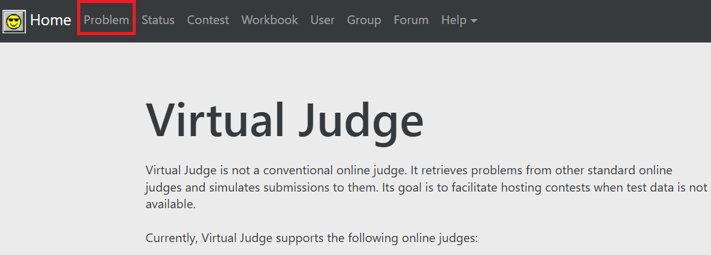
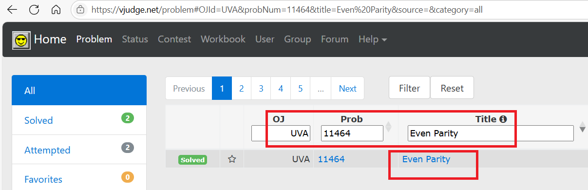
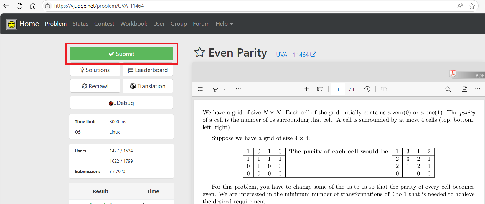
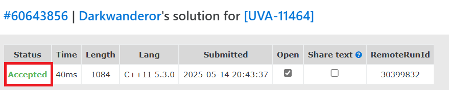

# 枚举

顾名思义，就是把所有情况全都罗列出来，然后找出符合题目要求的那一个。因此，枚举是一种纯暴力的算法。 

一般情况下，枚举策略都是会超时的。此时要先根据题目的数据范围来判断暴力枚举是否可以通过。如果不行的话，就要用各种算法来进行优化（比如二分，双指针，前缀和与差分等）。

 使用枚举策略时，重点思考枚举的对象（枚举什么），枚举的顺序（正序还是逆序），以及枚举的方式（普通枚举？递归枚举？二进制枚举）。 

## NOIP 2011 提高组 铺地毯

[P1003 [NOIP 2011 提高组\] 铺地毯 - 洛谷](https://www.luogu.com.cn/problem/P1003)

将所有地毯的信息保存在数组中，逆向枚举数组，当坐标在数组表示的地毯范围内时，编号即为答案。

否则输出`-1`。

```cpp
#include<bits/stdc++.h>
using namespace std;

void ac() {
	int n; cin >> n;
	vector<int>a, b, g, k;
	for (int i = 0; i < n; i++) {
		int q, w, e, r;
		cin >> q >> w >> e >> r;
		a.push_back(q);
		b.push_back(w);
		g.push_back(e);
		k.push_back(r);
	}
	int x, y;
	cin >> x >> y;
	for (size_t i = a.size() - 1; i != -1; i--) {
		if (a[i] <= x && a[i] + g[i] >= x && b[i] <= y && b[i] + k[i] >= y) {
			cout << i+1;
			return;
		}
	}
	cout << -1;
}

int main() {
	int T = 1;
	//cin >> T;
	while (T--)
		ac();
	return 0;
}

```


## P2327 [SCOI2005] 扫雷

[P2327 [SCOI2005\] 扫雷 - 洛谷](https://www.luogu.com.cn/problem/P2327)

最初思路：

1. 所有标3的格子，附近一定是雷，方法数1；
2. 和3有贴贴的2，以及最两端的格子，方法数1；
3. 其他2，通过已知的2推，1同理。

但无法证明思路是否正确，而且只能找到填法，不能找到方法数。若是平时，我可能想到了就会一头陷进去。

解法：

发现，每个格子有0、1个雷两种状态，因此可以先确定第1个格子的状态，根据第1个格子的状态去推下一个格子的状态，直到枚举完。

当枚举的地雷数小于0，说明欠地雷；大于1，说明多地雷。此时第1个格子的这个状态，无法安排雷。

而且要枚举到第`n+1`个格子，因为会出现第`n`个第2列填3的非法情况，需要进一步检测。

```cpp
#include<bits/stdc++.h>
using namespace std;
const int N = 1e4 + 10;
short l1[N], l2[N];//l1表示第1列
int n;

int cnt(bool s) {
	l1[1] = s;
	for (int i = 2; i <= n + 1; i++) {
		l1[i] = l2[i - 1] - l1[i - 1] - l1[i - 2];
		if (l1[i] < 0 || l1[i]>1)
			return 0;
	}
	if (l1[n + 1] == 0)
		return 1;
	return 0;
}

void ac() {
	cin >> n;
	for (int i = 1; i <= n; i++)
		cin >> l2[i];
	cout << cnt(0) + cnt(1) << endl;
}

int main() {
	int T = 1;
	//cin >> T;
	while (T--)
		ac();
	return 0;
}
```


## 蓝桥真题 猜年龄

[6.猜年龄 - 蓝桥云课](https://www.lanqiao.cn/problems/718/learning/?page=1&first_category_id=1&status=2) 

纯枚举，这个数学王子很年轻，所以年龄不会很大。

```c
#include<stdio.h>
int main() {
	int cnt[10]={0};//count，计数用 
	int i=0;
	for(i=11;i<=36;i++){
		int a=i*i*i;//立方 
		int b=a*i;//四次方
		 
		//统计每一位 
		while(a!=0){
			cnt[a%10]++;
			a/=10; 
		}
		while(b!=0){
			cnt[b%10]++;
			b/=10; 
		}
		
		//cnt全是1，则i即为正确答案 
		int j=0;
		for(j=0;j<10;j++){
			if(cnt[j]==1)
				continue;
			else
				break;
		}
		if(j==10){
			printf("%d",i);
			return 0;
		}
		for(j=0;j<10;j++){
			cnt[j]=0;
		}
	}
	//printf("18");//其实可以把次方数输出，肉眼观察 
	return 0;
}
```

这是一道填空题，唯一的测试用例是18。

# 二进制枚举

二进制枚举：用一个数二进制表示中的 0/1 表示两种状态，从而达到枚举各种情况。 

利用二进制枚举时，会用到一些位运算的技巧。

关于用二进制中的 0/1 表示状态这种方法，会在动态规划中的状态压缩 dp 中继续使用到。

二进制枚举的方式也可以用递归实现。 

## 常用的技巧整理

1. 求某个整数的二进制位。也能用于统计整数的二进制中1的数量。

```cpp
int cnt(int x){
    for(int i=0;i<sizeof(x)*8;i++){
        cout<<(x>>i)&1;
    }
}
```

2. 想要指定的bit位为1。通过或运算实现。

```cpp
void get(int& x){
    int place=0;
    cin>>place;//想要x的第place位的bit位为1
    x|=(1<<place);
}
```

3. 以`n==3`为例，`[0,(1<<3)-1]`之间所有的数的二进制：

```
0 0000 []
1 0001 [1]
2 0010 [2]
3 0011 [1,2]
4 0100 [3]
5 0101 [1,3]
6 0110 [2,3]
7 0111 [1,2,3]
8 1000
```

所以枚举`[1,8)`，对每个数提取二进制位，可以得到所有子集。

4. 求某数的二进制中1的个数的其他玩法：

```cpp
int calc(int x){
    int cnt=0;
    while(x){
        ++cnt;
        x&=x-1;
    }
    return cnt;
}
```

这个玩法的巧妙之处在于，它能将最整数`x`最低位的1清理掉。

例如`5&4=4`等价于`0101&0100=0100`，`4&3==0`等价于`0100&0011=0`，进行了2步运算，正好是5的二进制数汇中1的个数。

## 子集 - 力扣

[78. 子集 - 力扣（LeetCode）](https://leetcode.cn/problems/subsets/description/)

法1：深度优先搜索。

枚举递归深度，根据这个递归深度来搜索子集。

搜索子集的过程中进行剪枝，排除等效冗余。

```cpp
class Solution {
public:
    typedef vector<vector<int>> vvi;
    typedef vector<int> vi;
    typedef vector<bool> vb;
    void dfs(int max_dep,int dep,vi& nums,vvi& ans,vi&tmp,vb&vis,
    int last){
        if(dep==max_dep+1){
            ans.push_back(tmp);
            return;
        }
        //剪枝：通过last排除等效冗余
        for(int i=last;i<nums.size();i++){
            if(vis[i])
                continue;
            vis[i]=1;
            tmp.push_back(nums[i]);
            dfs(max_dep,dep+1,nums,ans,tmp,vis,i+1);
            vis[i]=0;
            tmp.pop_back();
        }
    }

    vector<vector<int>> subsets(vector<int>& nums) {
        sort(nums.begin(),nums.end());
        vvi ans(1,vi());
        vi tmp;
        vb vis(nums.size(),0);
        //给定递归深度，进行深搜
        for(int i=1;i<=nums.size();i++){
            dfs(i,1,nums,ans,tmp,vis,0);
        }
        return ans;
    }
};
```

法2：二进制枚举

用0表示不选某一bit位的数，1表示选。

1. 枚举`[0,1<<n-1]`之间所有的数。
2. 枚举1范围内的数中，bit位为1的位置，将这个位置对应的数选出。

发现按`[1,7]`的bit位为1的选，正好就是答案。所有bit位都不选，则选出了一个空集，

```cpp
class Solution {
public:
	vector<vector<int>> subsets(vector<int>& nums) {
		vector<vector<int>> ret;
		int n = nums.size();

		// 枚举所有的状态
		for (int st = 0; st < (1 << n); st++) {
			// 根据 st 的状态，还原出要选的数
			vector<int> tmp; // 从当前选的⼦集
			for (int i = 0; i < n; i++) {
				if ((st >> i) & 1) tmp.push_back(nums[i]);
			}
			ret.push_back(tmp);
		}
		return ret;
	}
};
```


## P10449 费解的开关

[P10449 费解的开关 - 洛谷](https://www.luogu.com.cn/problem/P10449)

根据题目得到3条性质：
1. 重复按同一个开关没意义。

2. 按法确定后，最终结果和按的顺序无关。

3. 第1行的按法确定后，整个按法都确定。因为目标是让所有灯都亮，所以第1行按完后，第2行的目标是使第1行全亮，第3行的目标是使第2行全亮，于是按法固定。

根据性质得到解法：

1. 利用二进制的特性，枚举第1行的按法。范围`[1,1<<5-1]`，这样就能枚举所有bit位的情况。
2. 按灯。
   1. 存灯的状态，可以用二维数组，这里用具体的整数。但需要将状态换一下，1表示灯灭，0表示全亮。这样只需要看最后一行是否全为0即可。这样用二进制的特性去按的时候会很好处理。
   2. 按灯时，根据1给的按法，将第`i`层的状态`a[i]`
      进行异或处理：`a[i]^ push ^ (push >> 1) ^ (push << 1)`。
      根据性质2可以证明即使将按法按照bit位拆分开来，和不拆分没区别。
   3. 按完之后最边缘的1可能会对其他无关 bit 位造成影响，进而影响最终结果。例如按法`10000`，初始状态`000000`，按完后最终状态`111000`，最高位的1会影响最终结果，需要变成`11000`，才能正确表达最终结果。
      因此需要进行操作`a[i]&=(1<<5)-1`抵消影响。
   4. 下一行的灯直接`^=push`即可。

3. 根据上一次按灯的结果，确定下一行的按法。

   下一行的目标是这一行的灯全亮，因此按法也就是当前行的按法。到这里就体现了状态转换的好处：1表示灯灭，也能表示下一行的按法，此时确定下一行的按法时直接复制当前行的状态即可。

4. 重复1、2、3。当出现按的次数小于6的情况时就是答案。

```cpp
#include<bits/stdc++.h>
using namespace std;

//求int型数据的32位bit位中，1的数量
int calc(int x) {
	int cnt = 0;
	for (int i = 0; i < 32; i++) {
		if ((x >> i) & 1)
			++cnt;
	}
	return cnt;
}

void ac() {
	vector<int>a(6, 0), b;
	for (int i = 0; i < 5; i++) {
		for (int j = 4; j >=0; j--) {
			char ch; cin >> ch;
			if (ch == '0')
				a[i] |= 1 << j;//更换状态，1表示灯灭
		}
	}
	b = a;//备份
	int res = 2e9;
	for (int i = 0; i < (1 << 5); i++) {
		int cnt = 0;//当前按法的步数。
		a = b;//还原状态测试新方法
		int push = i;//按法
		for (int j = 0; j < 5; j++) {
			cnt += calc(push);//统计按的次数
			a[j] = a[j] ^ push ^ (push >> 1) ^ (push << 1);//按当前行
			a[j] &= ((1 << 5) - 1);//抵消最高位造成的影响
			a[j + 1] ^= push;//按下一行
			push = a[j];//更新按法
		}
		if (a[4] == 0)//当前按法能达到目标
			res = min(res, cnt);
	}
	if (res > 6)
		cout << -1;
	else
		cout << res;
	cout << endl;
}

int main() {
	int T = 1;
	cin >> T;
	while (T--)
		ac();
	return 0;
}
```


## UVA11464 Even Parity

[UVA11464 Even Parity - 洛谷](https://www.luogu.com.cn/problem/UVA11464)

这是一道UVA的题，UVA是国外的OJ网站，只有先在UVA注册账号，并绑定洛谷账号才能在洛谷上提交。

如果无法注册，可以在[Virtual Judge](https://vjudge.net/)注册，通过这里来提交。

### 通过Virtual Judge提交代码

以这题为例，首先在Vjg中点击Problem。



找到OJ，并输入题号Prob和题目Title。



点击标蓝的题目标题Even Party即可跳转到页面。



后点击Submit提交代码。选择语言（Language），将代码拷贝到Solution处的文本框中，再点击右下角的Submit，vjg后台会用它们的账号提交到UVA的后台服务器。


当页面显示Accepted后，说明代码正确。



### 正解

[UVA11464 Even Parity - 洛谷](https://www.luogu.com.cn/problem/UVA11464)

例如这个矩阵：

```
0 1 0
1 0 1
0 1 0
```

它的每个元素的周围的元素之和：

```cpp
2 0 2
0 4 0
2 0 2
```

所以这是一个符合要求的矩阵。

根据题意，可总结出3个性质：

1. 每个0只有变1次或不变2种情况。
2. 决定改变哪些0后，改变的顺序不影响最终结果。
3. 第1行的最终结果确定后，后续行的最终结果也跟着确定（和费解的开关十分类似）。

根据性质得出的解法：

0. 输入数据时，将矩阵中的1与进数组`a[i]`，用一个数表示原始状态。根据题意，还得知道`a[i-1]`。所以数组需要从下标1开始计数。

1. 利用二进制的特性，**枚举第一行的所有可能得最终状态**。

枚举`[0,(1<<n)-1]`。

2. 判断最终状态是否合法

一层循环，判断第`i`行的状态`a[i]`的最终状态是否合法（将原始结果和最终结果进行比对）：

* 0变1合法，搞一个变量`sum`记录改变次数。
* 1变0非法，返回-1即可。之后统计最小改变次数时无视当前循环的结果。

3. 判断合法后，推导出下一行的最终状态，重复2、3过程。

首先累加0的改变次数。

例如这种情况：

```
_ x _
y _ z//当前行
_ ? _//下一行
```

要推导`?`这个bit位的值，同时为了让上一行的每个数都符合条件，则`x+y+z+?`为偶数，则`{x,y,z,?}`中1的个数为偶数，0的个数也是偶数。

所以求这4个位置的和是否满足条件看`x^y^z^?==0`。即`x^y^z==?`。

至于如何求`x^y^z^?==0`，可以这样做：`after=a[i-1]^(a[i]<<1)^(a[i]>>1)`。`after`是暂定改变之后的结果。

和费解的开关一样，边缘行的1同样会对无关的bit位造成影响，需要将最终结果再进行操作
`after&=((1<<n)-1)`。

4. 直到推导到最后一行。

更新结果即可。

```cpp
#include<bits/stdc++.h>
using namespace std;

int CNT;
int n;
int ope(int start, int end) {
	int sum = 0;
	for (int i = 0; i < n; i++) {
		if (((start >> i) & 1) == 0 && (((end >> i) & 1) == 1))
			++sum;
		if (((start >> i) & 1) == 1 && (((end >> i) & 1) == 0)) {
			return -1;
		}
	}
	return sum;
}

int solve(vector<int> &a) {
	int res = 2e9;
	vector<int>b = a;
	for (int i = 0; i < (1 << n); i++) {
		int after = i;
		int cnt = 0;
		a = b;
		bool flag = 1;

		for (int j = 1; j <= n; j++) {
			int times = ope(a[j], after);
			if (times == -1) {
				flag = 0;
				break;
			}
			cnt += times;
			a[j] = after;
			after = a[j - 1] ^ (a[j] << 1) ^ (a[j] >> 1);
			after &= ((1 << n) - 1);
		}
		if (flag) {
			res = min(res, cnt);
		}
	}
	if (res == 2e9)
		return -1;
	return res;
}

void ac() {
	cin >> n;
	vector<int>a(n + 2, 0);
	for (int i = 1; i <= n; i++) {
		for (int j = n - 1; j >= 0; j--) {
			int tmp; cin >> tmp;
			if (tmp)
				a[i] |= (1 << j);
		}
	}
	printf("Case %d: %d\n", ++CNT, solve(a));

}

int main() {
	int T = 1;
	cin >> T;
	while (T--)
		ac();
	return 0;
}
```

# 日期枚举

公元纪年的日期的性质：

1. 一年有12个月，每月的天数不同，我记得有这么个口诀：
   一月大，二月平，三月大，四月小，五月大，六月小，七月大，八月大，九月小，十月大，十一月小，十二月大。
   大表示这个月有31天，小表示这个月有30天，平表示2月随平年和闰年发生变化。
2. 闰年：年份能整除4，不能整除100，或能整除400的年份就是闰年。在闰年，2月有29天，否则平年有28天。
   因为地球绕太阳公转的时间是365.2422天，每4年会比实际季节滞后约 1 天（0.2422×4≈1天），长期积累会导致季节错乱（比如几百年后夏季可能出现在日历的冬季）。

日期常用的数组：

```cpp
int month[13]={0,31,28,31,30,31,30,31,31,30,31,30,31};
```


## 蓝桥真题 跑步

[2.跑步 - 蓝桥云课](https://www.lanqiao.cn/problems/2271/learning/?page=2&first_category_id=1&second_category_id=3&tags=语法,日期问题,单位换算,数学&tag_relation=union) 

枚举日期，判断是否符合条件即可。

参考程序：

```c
#include<stdio.h> 

int y=2022,m=1,d=1;
int week=6;
int month[13]={0,31,28,31,30,31,30,31,31,30,31,30,31};

int judg(){
	if(d%10==1||week==6||week==7)
		return 1;
	return 0;
}

void f() {
	int cnt=0;
	while(y!=2023){
		++d;++week;
		if(d>month[m]){
			m++;d=1;
			if(m>12){
				y++;m=1;
			}
		}
		if(week>7){
			week=1;
		}
		cnt+=judg();
	} 
	printf("%d",cnt);
}

int main() {
	//f();
    printf("138");
	return 0;
}
```

本题是一道填空题，唯一的测试用例是138。

## NOIP 2016 普及组 回文日期

[P2010 [NOIP 2016 普及组\] 回文日期 - 洛谷](https://www.luogu.com.cn/problem/P2010)

因为是回文日期，可以枚举日、月，转换成日期后，看这个日期是否在给定的两个年份之间，在的话则统计。

```cpp
#include<bits/stdc++.h>
using namespace std;

inline void turn(string& tmp, int x, int len) {
	tmp = to_string(x);
	while (tmp.size() < len)
		tmp = '0' + tmp;
}

void ac() {
	size_t cnt = 0;
	int month[13] = { 0,31,29,31,30,31,30,31,31,30,31,30,31 };
	int x, y;
	cin >> x >> y;
	for (int i = 1; i <= 12; i++) {
		for (int j = 1; j <= month[i]; j++) {
			int t1 = j % 10 * 1000 + j / 10 * 100 + i % 10 * 10 + i / 10;
			int t2 = t1 * 10000 + i * 100 + j;
			if (x <= t2 && t2 <= y)
				++cnt;
		}
	}
	cout << cnt << endl;
}

int main() {
	int T = 1;
	//cin >> T;
	while (T--)
		ac();
	return 0;
}
```


## 日期统计

[19.日期统计 - 蓝桥云课](https://www.lanqiao.cn/problems/3492/learning/?page=1&first_category_id=1&status=2)

八个循环的无脑枚举。

```cpp
#include <iostream>
using namespace std;
int main()
{
    int num[] = { 5,6,8,6,9,1,6,1,2,4,9,1,9,8,2,3,6,4,7,7,
				  5,9,5,0,3,8,7,5,8,1,5,8,6,1,8,3,0,3,7,9,
				  2,7,0,5,8,8,5,7,0,9,9,1,9,4,4,6,8,6,3,3,
				  8,5,1,6,6,3,4,6,7,0,7,8,2,7,6,8,9,5,6,5,
				  6,1,4,0,1,0,0,9,4,8,0,9,1,2,8,5,0,2,5,3,3 };
    int mouth[] = { 0,31,28,31,30,31,30,31,31,30,31,30,31 };
    bool flag[13][32] = { 0 };
    int ans = 0;
    for (int a = 0; a < 100; a++)
    {
        if (num[a] == 2)
            for (int b = a + 1; b < 100; b++)
            {
                if (num[b] == 0)
                    for (int c = b + 1; c < 100; c++)
                    {
                        if (num[c] == 2)
                            for (int d = c + 1; d < 100; d++)
                            {
                                if (num[d] == 3)
                                    for (int e = d + 1, m = 0, d = 0; e < 100; e++)
                                    {
                                        for (int f = e + 1; f < 100; f++)
                                        {
                                            m = num[e] * 10 + num[f];
                                            if (m > 0 && m < 13)
                                                for (int g = f + 1; g < 100; g++)
                                                {
                                                    for (int h = g + 1; h < 100; h++)
                                                    {
                                                        d = num[g] * 10 + num[h];
                                                        if (1 <= d && d <= mouth[m])
                                                        {
                                                            if (!flag[m][d])
                                                            {
                                                                ans++;
                                                                //cout<<2023<<(m*100+d)<<'\n';
                                                                flag[m][d] = 1;
                                                            }

                                                        }
                                                        d = 0;
                                                    }
                                                }
                                            m = 0;
                                        }
                                    }
                            }
                    }
            }
    }
    cout << ans;
    return 0;
}
```

