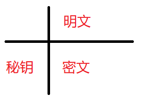
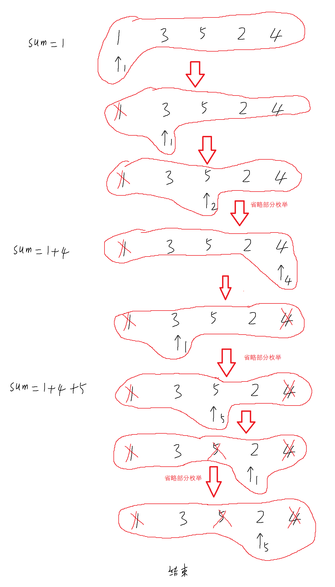

# 模拟

模拟，顾名思义，就是题目让你做什么你就做什么，考察的是**将思路转化成代码的代码能力**。 

这类题一般较为简单，属于竞赛里面的签到题，我们在学习语法阶段接触的题，大多数都属于模拟题。

但是，万事无绝对，也有可能会出现让人非常难受的模拟题，比如基于机器学习的交通模拟（根据已有的交通路线数据来预测可能出现的交通事故，据说是某个论文的主题）。

 ## NOIP 2009 普及组 多项式输出

[P1067 [NOIP 2009 普及组\] 多项式输出 - 洛谷](https://www.luogu.com.cn/problem/P1067)

模拟加分类讨论。分三个部分输出：

1. 系数的正、负号。
2. $a_i$。
3. 指数。

* 系数的正、负号。
  * 负号，直接输出`-`。
  * 正号，
    * 最高次数项，不输出。
    * 不是最高次数项，输出`+`。
* $a_i$。首先求绝对值。
  * 是1，
    * 最后一项指数为0的项，输出1。
    * 不是最后一项，不输出。
  * 不是1，
    * 非0，正常输出。
    * 0，不输出。
* 指数。
  * 是0，不输出。
  * 是1，输出$x$。
  * 其他正常输出。

参考程序：

```cpp
#include <bits/stdc++.h>
using namespace std;

int main() {
	int n; cin >> n;
	for (int i = n; i >= 0; i--) {
		int ai; cin >> ai;

		//系数为0直接跳过
		if (ai == 0)
			continue;

		//符号
		if (ai < 0)
			cout << '-';
		else if (i != n)
			cout << '+';

		//系数
		ai = abs(ai);
		if (ai == 1) {
			if (i == 0)
				cout << 1;
		}
		else
			cout << ai;

		//指数
		if (i != 0) {
			if (i == 1)
				cout << "x";
			else
				cout << "x^" << i;
		}
	}
	return 0;
}

```

py参考程序：

```py
n = int(input())
a = list(map(int, input().split()))
for i in range(n, -1, -1):
    # 系数为0直接跳过
    if a[n-i]==0:
        continue
    # 符号
    if a[n-i] < 0:
        print('-', end='')
    elif i != n:
        print('+', end='')
    # 系数
    a[n-i]=abs(a[n-i])
    if a[n-i] == 1:
        if i==0:
            print(1, end='')
    elif a[n-i]!=0:
        print(a[n-i],end='')
    # 指数
    if i == 1:
        print("x", end='')
    elif i!=0:
        print("x^%d"%i, end='')

```


## 洛谷P5731 蛇形方阵

[P5731 【深基5.习6】蛇形方阵 - 洛谷](https://www.luogu.com.cn/problem/P5731)

可以设置两个状态量$x$和$y$，以及处理矩阵有关问题都很好用的方向数组`dx`和`dy`。

方向数组为了能模拟状态的移动方式，需要这样设计：

```cpp
int dx[]={0,1,0,-1};
int dy[]={1,0,-1,0};
```

通过叠加$x$和`dx`，$y$和`dy`来模拟从一个格子走到下一个格子，当遇到2种情况就调转方向：

1. 越界。
2. 走到已经填的格子上。

状态更替方式：`x+dx[p]`和`y+dy[p]`。`p`表示前进方向。

方向统一更换：`p=(p+1)%4;`。

这种方式也可用于二维数组描述的地图中，状态的转移。

参考程序：

```cpp
#include <bits/stdc++.h>
using namespace std;
int dx[] = { 0,1,0,-1 };
int dy[] = { 1,0,-1,0 };
int a[11][11];

int main() {
	int n; cin >> n;
	int x = 1, y = 1;
	int times = n * n;//模拟的步数
	int cnt = 0;//要填的数
	int p = 0;//方向
	while (times--) {
		a[x][y] = ++cnt;//填数
		int nx = x + dx[p], ny = y + dy[p];

		//若越界则更换方向
		if (nx > n || nx<1 || ny>n || ny < 1 || a[nx][ny]) {
			p = (p + 1) % 4;
			x = x + dx[p];
			y = y + dy[p];
		}
		else
			x = nx, y = ny;
	}
	for (int i = 1; i <= n; i++) {
		for (int j = 1; j <= n; j++)
			printf("%3d", a[i][j]);//场宽3格
		cout << endl;
	}
	return 0;
}

```

py参考程序：

```py
n = int(input())
a = [[0 for i in range(n)] for i in range(n)]
dx = [0, 1, 0, -1]
dy = [1, 0, -1, 0]
px = 0; py = 0
tmp = 0

for i in range(n * n):
    a[px][py] = i + 1
    nx = px + dx[tmp]
    ny = py + dy[tmp]
    if nx > n-1 or nx < 0 or ny > n-1 or ny < 0 or a[nx][ny] != 0:
        tmp = (tmp + 1)% 4
        px = px + dx[tmp]
        py = py + dy[tmp]
    else:
        px = nx
        py = ny
    
for i in range(n):
    for j in range(n):
        print("%3d"%a[i][j], end='')
    print()

```


## NOIP 2007 提高组 字符串的展开

[P1098 [NOIP 2007 提高组\] 字符串的展开 - 洛谷](https://www.luogu.com.cn/problem/P1098)

和多项式输出一样，需要仔细审题，并分类讨论。

根据题意，这个题的思路：

准备两个字符串`ans`和`st`，输入字符串给`st`，遍历`st`。遇到的情况：

1. 不是`'-'`，则尾插给`ans`。
2. 是`'-'`：
   1. `st[i-1]>=st[i+1]`或`i==0`或`i==st.size()-1`，将`'-'`尾插给`ans`。
   2. `st[i-1]+1==st[i+1]`，跳过当前符号。
   3. 给定临时字符串`tmp`，若两边不全是数字或不全是字母，则`tmp="-"`。
      否则：
      1. `p1==3`先判断，是的话`tmp+=string(p2,'*');`。
      2. `p1==1`或两边都是数字，按要求插入字符。
      3. `p1==2`，插入大写字母。
   4. 若`p3==2`，将`tmp`翻转。
   5. 将`tmp`尾插进`ans`。

参考程序：

```cpp
#include<bits/stdc++.h>
using namespace std;

inline bool isnum(char c) {
	return c >= '0' && c <= '9';
}
inline bool issml(char c) {
	return c >= 'a' && c <= 'z';
}

void ac() {
	int p1, p2, p3;
	cin >> p1 >> p2 >> p3;
	string st; cin >> st;
	string ans;
	for (size_t i = 0; i < st.size(); i++) {
		if (st[i] != '-') {
			ans += st[i];
		}
		else {
			if (i == 0 || i + 1 == st.size() ||
				(st[i - 1] >= st[i + 1])) {
				ans += st[i];
				continue;
			}
			if (st[i - 1] + 1 == st[i + 1])
				continue;

			string tmp;
			if ((isnum(st[i - 1]) && isnum(st[i + 1])) ||
				(issml(st[i - 1]) && issml(st[i + 1]))) {
				if (p1 == 3) {
					for (char c = st[i - 1] + 1; c < st[i + 1]; c++) {
						tmp += string(p2, '*');
					}
				}
				else if (isnum(st[i - 1]) || p1 == 1) {
					for (char c = st[i - 1] + 1; c < st[i + 1]; c++) {
						tmp += string(p2, c);
					}
				}
				else if (p1 == 2) {
					for (char c = st[i - 1] + 1; c < st[i + 1]; c++) {
						tmp += string(p2, c - 'a' + 'A');
					}
				}
			}
			else
				tmp = "-";
			if (p3 == 2) {
				int l = 0, r = tmp.size() - 1;
				while (l < r) {
					swap(tmp[l++], tmp[r--]);
				}
			}
			ans += tmp;
		}
	}
	cout << ans;
}

int main() {
	int T = 1;
	//cin >> T;
	while (T--)
		ac();
	return 0;
}
```

py参考程序：

```py
p1, p2, p3 = map(int, input().split())
st = input()

def isnum(ch):
    return ch>='0' and ch<='9'

def isalp(ch):
    return ch>='a' and ch<='z'

ans = ""
for i in range(len(st)):
    if st[i] != '-':
        ans += st[i]
    else:
        if (st[i-1] >= st[i+1]) or (i==0) or (i==len(st)-1):
            ans += '-'
            continue
        if ord(st[i-1])+1==ord(st[i+1]):
            continue
        tmp=""
        #  用\续行
        if (isnum(st[i-1]) and isnum(st[i+1]))\
            or (isalp(st[i-1]) and isalp(st[i+1])):
            if p1==3:
                for i in range(ord(st[i-1])+1, ord(st[i+1])):
                    tmp += '*'*p2  # 将p2个 * 尾插进tmp
            elif isnum(st[i-1]) or p1==1:
                for j in range(ord(st[i-1])+1, ord(st[i+1])):
                    tmp += chr(j)*p2  # 
            else:
                for j in range(ord(st[i-1])+1, ord(st[i+1])):
                    tmp += chr(j-ord('a')+ord('A'))*p2
        else:
            tmp += '-'
        if p3==2:
            ans += tmp[::-1]
        else:
            ans += tmp
print(ans)

```


## 密码学 维吉尼亚密码

[NOIP2012 提高组\] Vigenère 密码 - 洛谷 | 计算机科学教育新生态](https://www.luogu.com.cn/problem/P1079) 

参考程序1：对着表查

这里放张贴图，防止有人不知道怎么看这张表：



```c
#include<stdio.h>
#include<string.h>

int main(){
	//生成维吉尼亚表
	// 维吉尼亚表的实质：table[秘钥][密文] = 明文 
	char table[26][26]={'\0'};
	int i=0,j=0;
	for(i=0;i<26;i++){
		for(j=0;j<26;j++){
			table[i][j]=(char)((i+j)%26+'a');
		}
	}
	
	char key[2001]={'\0'},sec[2001]={'\0'},//秘钥，密文 
		ans[101]={'\0'},tmp2[1001]={'\0'};
		
	scanf("%s",key);
	scanf("%s",sec);
	strcpy(ans,key);
	int lkey=strlen(key),lsec=strlen(sec);
	
	//补全秘钥长度 
	while(lkey<lsec){
		strcat(key,ans);
		lkey=strlen(key);
	}
	
	//翻译时统一用小写，并记录密文哪个位置是大写 
	for(i=0;i<lkey;i++)
		if(key[i]<'a'){
			key[i]+='a'-'A';
		}
	for(i=0;i<lsec;i++)
		if(sec[i]<'a'){
			sec[i]+='a'-'A';
			tmp2[i]='a'-'A';
		}
	
	//查表
	for(i=0;i<lsec;i++)
		for(j=0;j<26;j++)
			if(table[key[i]-'a'][j]==sec[i]){
				printf("%c",j+'a'-tmp2[i]);
				break;
			}
	return 0;
}
```

参考程序2：找规律

样例输入:

```
CompleteVictory
Yvqgpxaimmklongnzfwpvxmniytm
```

样例输出:
```
Wherethereisawillthereisaway
```

vigenere的实质：
`Y=Y-(C-A)=Y-2=W`（y往前挪动2个单位） 
`v=v-(o-a)=v-14=h`
`q=q-(m-a)=q-12=e `
`r=g-(p-a)=g-16=a-9`，需要加一个26让它重回正轨（相当于是绕回来转一圈）。所以是
`r=g-(p-a)+26=g-16+26=a-9+26=a+17=r `

```c
#include<stdio.h>
#include<string.h> 

int main(){
	char key[2002]={'\0'},sec[2002]={'\0'},tmp[1001]={'\0'};
	scanf("%s%s",key,sec);
	int lkey=strlen(key),lsec=strlen(sec);
	
	//加长key 
	strcpy(tmp,key);
	while(lkey<lsec){
		strcat(key,tmp);
		lkey=strlen(key);
	}
	
	//转换时字母统一小写 
	int i=0;
	for(i=0;i<lkey;i++){
		if(key[i]<'a'){
			key[i]+='a'-'A';
		}
	}
	//标记密文的大写字母 
	for(i=0;i<lsec;i++){
		if(sec[i]<'a'){
			sec[i]+='a'-'A';
			tmp[i]='a'-'A';
		}
		else tmp[i]='\0';
	}
	
	for(i=0;i<lsec;i++)
		printf("%c",(sec[i]-key[i]+'a'<'a'?
		sec[i]-key[i]+'a'+26
		:sec[i]-key[i]+'a')-tmp[i]);
	
	return 0;
}
```

## 蓝桥杯 2016 国 C\] 赢球票

[蓝桥杯 2016 国 C\] 赢球票 - 洛谷 | 计算机科学教育新生态](https://www.luogu.com.cn/problem/P8641) 

读题：

1、约瑟夫环的变种。
2、取走一张牌后从下一个位置重新数
3、重复规则2，直到再也无法取到牌。也就是说，每次从任意位置开始取，都是不同的情况。 

以一种情况为例，假如从1开始枚举：



这种模拟题最怕的还是读不懂题，无法完成程序模拟。

AC参考程序：

```c
#include<cstdio>
#include<iostream>
using namespace std;

int main(){
    int n;
    int a[101]={0};
    cin>>n;
    for(int i=1;i<=n;i++)
        cin>>a[i];
    int sum=0;
    for(int i=1;i<=n;i++){//每次从不同位置进行枚举，彼此独立，找最优解
    	bool vis[101]={0};//标记符合要求的牌
    	int cnt=1;
		int pos=i;//pos表示枚举的位置，cnt表示到当前位置为止的序号
		int num=0;//已抽出的卡牌数
		int res=0;
		while(cnt<=n&&num<n){
			for(int j=1;vis[pos]&&j<=n;j++){//跳转到下一张没被抽过的牌
				++pos;if(pos>n)pos=1;
			}
			if(a[pos]==cnt){//判断这张牌是否符合条件，符合就抽出，从下一张牌开始枚举
				res+=a[pos];
				vis[pos]=1;
				++num;
				cnt=1;
				for(int j=1;vis[pos]&&j<=n;j++){
					++pos;if(pos>n)pos=1;
				}
				continue;
			}
			++pos;
			++cnt;
			for(int j=1;vis[pos]&&j<=n;j++){
				++pos;if(pos>n)pos=1;
			}
			if(pos>n)pos=1;
		}
		sum=max(sum,res);
    }
    cout<<sum;
    return 0;
}
```


