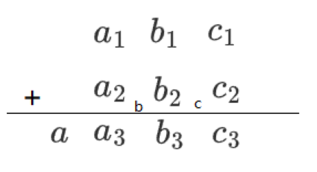
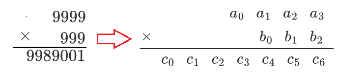

c++的内置类型的位数都很小（`int`能存储的最大值是2147483847，也只有10位），所以为了更高位数的计算，可以尝试利用数组来存储很大的数，两个数组的元素之间的运算来达到整体运算的效果。

所以可以尝试实现四则运算的高精度计算，再逐步拓展。

高精度计算的本质还是模拟，比如四则运算的高精度就是模拟小学时学过的竖式算术。

数组这里选择`string`。因为`string`相比传统的数组更加灵活，可以方便管理。

# 大整数加法

[1168：大整数加法](http://ybt.ssoier.cn:8088/problem_show.php?pid=1168) 

[P1601 A+B Problem（高精） - 洛谷](https://www.luogu.com.cn/problem/P1601)

高精度加法原理：



a，b，c 都可以用数组表示。这些都是基于c语言的算术运算符形成的运算。

$c_3=(c_1+c_2)\%10$ 

$c=(c_1+c_2)/10$ 

$b_3=(b_1+b_2+c)\%10$ 

$b=(b_1+b_2+c)/10$ 

$a_3=(a_1+a_2+b)\%10$ 

$a=(a_1+a_2+b)/10$ 

这题虽然不考虑负数的情况，但这个参考程序还是考虑了都为负数的情况。正数和负数相加实际上是减法的范畴。

支持同符号相加的参考程序：

```c
#ifndef _CRT_SECURE_NO_WARNINGS
#define _CRT_SECURE_NO_WARNINGS 1
#endif
#include<iostream>
#include<string>
using namespace std;
string add(string& a, string& b) {
	int up = 0;
	bool flag = 0;

	//符号不同时跳转减法

	//负数加负数
	if (a[0] == '-' && b[0] == '-') {
		a.erase(0, 1); b.erase(0, 1);
		flag = 1;
	}
	string c(max(a.size(), b.size()), '0');

	//补齐长度
	if (a.size() < b.size())
		a = string(b.size() - a.size(), '0') + a;
	if (b.size() < a.size())
		b = string(a.size() - b.size(), '0') + b;

	//加法核心
	for (size_t i = a.size() - 1; i != -1; i--) {
		c[i] = char((a[i] - '0' + b[i] - '0' + up) % 10 + '0');
		up = (a[i] - '0' + b[i] - '0' + up) / 10;
	}
	while (up) {//补进位
		c = (char)(up % 10 + '0') + c;
		up /= 10;
	}

	//去除前缀0
	while (*c.begin() == '0' && c.size() > 1)
		c.erase(0, 1);
	while (*a.begin() == '0' && a.size() > 1)
		a.erase(0, 1);
	while (*b.begin() == '0' && b.size() > 1)
		b.erase(0, 1);

	//两个负数相加
	if (flag) {
		c = '-' + c;
		a = '-' + a;
		b = '-' + b;
	}
	return c;
}

int main() {
	string a, b;
	//输入ctrl+z停止输入，OJ会自动判断EOF
	while (cin >> a >> b)
		cout << add(a, b) << endl;
	return 0;
}

```

# 大整数减法

[1169：大整数减法](http://ybt.ssoier.cn:8088/problem_show.php?pid=1169)

[P2142 高精度减法 - 洛谷](https://www.luogu.com.cn/problem/P2142) 

整数减法的情况（$a>0,b>0$）：

1. 正数减正数：
   $a>b$，结果为正，绝对值为$a-b$；
   $a=b$，结果为0；
   $a<b$，结果为负，绝对值为$b-a$。

2. 负数减负数：
   $(-a)-(-b)=(b-a)$。
3. $a$和$b$符号不同，
   式子可以转化成$-(a+b)$或$(b+a)$。也就是说变成了加法。

所以除了第3种情况，都要转化为$a>b$的情况进行减法运算。

首先处理负数减负数，取出负号后，交换它们的值，变成正数减正数。

然后无论是负数减负数，还是正数减正数，只要$a<b$，最后的值一定小于0，最终结果是否为负数也只和这种情况有关。


支持同符号相减的参考程序：

```cpp
#ifndef _CRT_SECURE_NO_WARNINGS
#define _CRT_SECURE_NO_WARNINGS 1
#endif

#include <iostream>
#include <string>
using namespace std;

//a>b时返回0
inline bool cmp(string& a, string& b) {
	if (a.size() > b.size())
		return 1;
	if (a.size() == b.size())
		return a > b;
	return 0;
}

string sub(string& a, string& b) {
	//符号不同时跳转加法

	//负数减负数
	bool flag1 = 0;
	if (a[0] == '-' && b[0] == '-') {
		a.erase(0, 1); b.erase(0, 1);
		swap(a, b);
		flag1 = 1;
	}

	//排除a<b的情况
	bool flag2 = 0;
	if (cmp(b, a)) {
		swap(a, b);
		flag2 = 1;
	}

	if (b.size() < a.size())
		b = string(a.size() - b.size(), '0')+b;

	//字符串减法
	string c(a.size(), '0');
	bool ten = 0;
	for (size_t i = a.size() - 1; i != -1; i--) {
		ten = 0;
		if (a[i] < b[i]) {
			a[i - 1] -= 1;
			a[i] += 10;
			ten = 1;
		}
		c[i] = a[i] - b[i] + '0';
		if (ten)
			a[i] -= 10;
		if (i + 1 < a.size())
			if(c[i + 1] - '0' + b[i + 1] - '0' > 9)
				a[i] += 1;
	}

	while (c.size() > 1 && c[0] == '0')
		c.erase(0, 1);
	while (b.size() > 1 && b[0] == '0')
		b.erase(0, 1);

	if (flag2) {
		swap(a, b);
		c = '-' + c;
	}
	if (flag1) {
		a = '-' + a;
		b = '-' + b;
		swap(a, b);
	}
	return c;
}

int main() {
	string a, b;
	//输入ctrl+z停止输入，OJ会自动判断EOF
	while (cin >> a >> b)
		cout << sub(a, b)<<endl;
	return 0;
}

```

有了减法后，加法和减法都能支持整数域的加、减运算。

# 完整的大整数加、减法

参考程序：

```cpp
#ifndef _CRT_SECURE_NO_WARNINGS
#define _CRT_SECURE_NO_WARNINGS 1
#endif
#include<iostream>
#include<string>
using namespace std;

//a>b时返回0
inline bool cmp(string& a, string& b) {
	if (a.size() > b.size())
		return 1;
	if (a.size() == b.size())
		return a > b;
	return 0;
}
string add(string&, string&);

string sub(string& a, string& b) {
	//符号不同时跳转加法
	if (a[0] == '-' && b[0] != '-') {
		a.erase(0, 1);
		string tmp = add(a, b);
		a = '-' + a;
		return '-' + tmp;
	}
	if (a[0] != '-' && b[0] == '-') {
		b.erase(0, 1);
		string tmp = add(a, b);
		b = '-' + b;
		return tmp;
	}

	//负数减负数
	bool flag1 = 0;
	if (a[0] == '-' && b[0] == '-') {
		a.erase(0, 1); b.erase(0, 1);
		swap(a, b);
		flag1 = 1;
	}

	//排除a<b的情况
	bool flag2 = 0;
	if (cmp(b, a)) {
		swap(a, b);
		flag2 = 1;
	}

	if (b.size() < a.size())
		b = string(a.size() - b.size(), '0') + b;

	//字符串减法
	string c(a.size(), '0');
	bool ten = 0;
	for (size_t i = a.size() - 1; i != -1; i--) {
		ten = 0;
		if (a[i] < b[i]) {
			a[i - 1] -= 1;
			a[i] += 10;
			ten = 1;
		}
		c[i] = a[i] - b[i] + '0';
		if (ten)
			a[i] -= 10;
		if (i + 1 < a.size())
			if (c[i + 1] - '0' + b[i + 1] - '0' > 9)
				a[i] += 1;
	}

	while (c.size() > 1 && c[0] == '0')
		c.erase(0, 1);
	while (b.size() > 1 && b[0] == '0')
		b.erase(0, 1);

	if (flag2) {
		swap(a, b);
		c = '-' + c;
	}
	if (flag1) {
		a = '-' + a;
		b = '-' + b;
		swap(a, b);
	}
	return c;
}

string add(string& a, string& b) {
	int up = 0;
	bool flag = 0;

	//符号不同时跳转减法
	if (a[0] == '-' && b[0] != '-') {
		a.erase(0, 1);
		string tmp = sub(b, a);
		a = '-' + a;
		return tmp;
	}
	if(a[0] != '-' && b[0] == '-') {
		b.erase(0, 1);
		string tmp = sub(a, b);
		b = '-' + b;
		return tmp;
	}

	//负数加负数
	if (a[0] == '-' && b[0] == '-') {
		a.erase(0, 1); b.erase(0, 1);
		flag = 1;
	}
	string c(max(a.size(), b.size()), '0');

	//补齐长度
	if (a.size() < b.size())
		a = string(b.size() - a.size(), '0') + a;
	if (b.size() < a.size())
		b = string(a.size() - b.size(), '0') + b;

	//加法核心
	for (size_t i = a.size() - 1; i != -1; i--) {
		c[i] = char((a[i] - '0' + b[i] - '0' + up) % 10 + '0');
		up = (a[i] - '0' + b[i] - '0' + up) / 10;
	}
	while (up) {//补进位
		c = (char)(up % 10 + '0') + c;
		up /= 10;
	}

	//去除前缀0
	while (*c.begin() == '0' && c.size() > 1)
		c.erase(0, 1);
	while (*a.begin() == '0' && a.size() > 1)
		a.erase(0, 1);
	while (*b.begin() == '0' && b.size() > 1)
		b.erase(0, 1);

	//两个负数相加
	if (flag) {
		c = '-' + c;
		a = '-' + a;
		b = '-' + b;
	}
	return c;
}

int main() {
	string a, b;
	//输入ctrl+z停止输入，OJ会自动判断EOF
	while (cin >> a >> b) {
		cout << add(a, b) << endl;
		cout << sub(a, b) << endl;
	}
	return 0;
}

```


# 大整数乘法

[1307：【例1.3】高精度乘法](http://ybt.ssoier.cn:8088/problem_show.php?pid=1307)

[P1303 A*B Problem - 洛谷](https://www.luogu.com.cn/problem/P1303)

首先是 $9999\times 999=9989001$。

假设`string a="9999"`，`string b="999"`，`string c`用于存储结果，可以发现：

`c[i+j+1]=(a[i]*b[j]+w)%10`，`w`是进位。比如
`c[3+2+1]=(a[3]*b[2]+w)%10`。



也就是说，这种方式的高精度乘法可以不用对数组做任何处理。

这种方法的乘法核心：

```cpp
	//高精度乘法原理（string对象）：
	//c[i+j+1]=(c[i+j+1]-'0')+(a[i]-'0')*(b[j]-'0')+w;
	string c(a.size() + b.size(), '0');
	for (size_t j = b.size() - 1, w; j != -1; j--) {
		w = 0;
		for (size_t i = a.size() - 1; i != -1; i--) {
			c[i + j + 1] = (c[i + j + 1] - '0') + (a[i] - '0') * (b[j] - '0') + w;
			w = c[i + j + 1] / 10;
			c[i + j + 1] %= 10;
			c[i + j + 1] += '0';
		}
		c[j] = c[j] + w;
	}
```

理性讨论`c[j] = c[j] + w;`：

`c`经过扩容后变成`a.size()+b.size()`个`0`，最后的`c[j]=c[j]+w`中，能走到这一步说明很多位数乘1位的结果都已经加到`c`数组中，并且`c[j]`这个时候还是`'0'`。

而`c[j]`是一位数，`(a[i] - '0') * (b[j] - '0')`的值最多是81，也就是说`w`的值最多是`9`（例如，$99\times 99=9801$，这种情况下`a`和`b`都是至少2个9）。所以`c[j]`加到最后也只能是`9`，并不会出现溢出的情况。

完整的程序：

```cpp
#ifndef _CRT_SECURE_NO_WARNINGS
#define _CRT_SECURE_NO_WARNINGS 1
#endif

#include <iostream>
#include <string>
using namespace std;

string mul(string& a, string& b) {
	//符号相同时结果为正
	bool va = 0, vb = 0;
	if (a[0] == '-' && b[0] == '-') {
		a.erase(0, 1);
		b.erase(0, 1);
		va = 1; vb = 1;
	}


	//符号不同时结果为负数
	bool flag = 0;
	if ((a[0] == '-' && b[0] != '-') || (a[0] != '-' && b[0] == '-')) {
		if (a[0] == '-') {
			va = 1;
			a.erase(0, 1);
		}
		if (b[0] == '-') {
			vb = 1;
			b.erase(0, 1);
		}
		flag = 1;
	}

	//1位0的情况
	if ((a.size() == 1 && a[0] == '0') || (b.size() && b[0] == '0')) {
		if (va)
			a = '-' + a;
		if (vb)
			b = '-' + b;
		return "0";
	}

	//高精度乘法原理（string对象）：
	//c[i+j+1]=(c[i+j+1]-'0')+(a[i]-'0')*(b[j]-'0')+w;
	string c(a.size() + b.size(), '0');
	for (size_t j = b.size() - 1, w; j != -1; j--) {
		w = 0;
		for (size_t i = a.size() - 1; i != -1; i--) {
			c[i + j + 1] = (c[i + j + 1] - '0') + (a[i] - '0') * (b[j] - '0') + w;
			w = c[i + j + 1] / 10;
			c[i + j + 1] %= 10;
			c[i + j + 1] += '0';
		}
		c[j] = c[j] + w;
	}
	//清除占位用的0
	while (c[0] == '0' && c.size() > 1)
		c.erase(0, 1);

	if (flag)
		c = '-' + c;

	if (va)
		a = '-' + a;
	if (vb)
		b = '-' + b;

	return c;
}

int main() {
	string a, b;
	while (cin >> a >> b)
		cout << mul(a, b) << ' '<<a<<" "<<b<<endl;
	return 0;
}
```

高精度乘法也可以用倒序操作。这里省略。

# 高精度除以低精度

除法可以用连续的减法代替。因为竖式除法中，都是预判除数和谁相乘，使得被除数的一部分减去积得到不大于除数的结果。所以计算机的工作是省去多余的预判，直接一直减，直到减不动为止。

高精度除法是模仿竖式除法。计算机并不知道最高位该放在哪里，所以不断从高位取数参与运算，直到取到的数比除数大时再相减。

比如$100\div7$，取 1 不满足，接着取 0 ，凑成10大于7，于是将`10/7`的结果记录，用`10%7`的余数接着相同的运算。

即使是这个思路，依旧要判断符号。根据乘法的规则，当两个数符号相同时结果为正，不相同时结果为负，除法和乘法的规则一样。

若除数用的是正常的内置类型（c++本身就有的），则是高精度除以低精度。

若两个都是数组，则是高精度除以高精度。

```cpp
#ifndef _CRT_SECURE_NO_WARNINGS
#define _CRT_SECURE_NO_WARNINGS 1
#endif

#include <iostream>
#include <string>
using namespace std;

string div(string& a, int& b, string& rr) {//rr，remainder，余数
	bool flag = 0;
	if (b == 0) //除数不能为0
		return "nan";

	bool va = 0, vb = 0;//vis_a, vis_b
	if (a[0] == '-' && b < 0) {
		a.erase(0, 1); b = -b;
		va = 1; vb = 1;
	}

	//符号不同
	if ((a[0] == '-' && b > 0) || (a[0] != '-' && b < 0)) {
		if (a[0] == '-') {
			a.erase(0, 1);
			va = 1;
		}
		if (b < 0) {
			b = -b;
			vb = 1;
		}
		flag = 1;
	}

	string c;
	int _rr = 0;//余数
	for (auto& x : a) {//模仿竖式除法，逐位枚举
		c += (char)((_rr * 10 + x - '0') / b + '0');
		//去除占位用的0
		while (c.size() > 1 && c[0] == '0')
			c.erase(0, 1);
		_rr = (_rr * 10 + x - '0') % b;
	}
	if (flag)
		c = '-' + c;

	//c++11可用to_string
	rr.clear();
	while (_rr) {
		rr = char(_rr % 10 + '0') + rr;
		_rr /= 10;
	}
	if (va) {
		rr = '-' + rr;
		a = '-' + a;
	}
	if (vb)
		b = '-' + b;
	return c;
}

int main() {
	string a, c;
	int b;
	while (cin >> a >> b)
		cout << div(a, b, c) << ' ' << c << endl;
	return 0;
}
```

# 高精度除以高精度

[1308：【例1.5】高精除](http://ybt.ssoier.cn:8088/problem_show.php?pid=1308)

[P1480 A/B Problem - 洛谷](https://www.luogu.com.cn/problem/P1480)

高精度除以高精度和高精度除以低精度一样枚举被除数的每一位凑成合适的数，但是原本的内置除法变成连续做高精度减法，直到不能再减为止。

也可以通过一直做减法然后统计，但这种方案相当于一个数连续自加若干次，很容易超时。虽然可以通过二进制优化，但实质还是一样的。

符号和高精度除以低精度一致：同号为正，异号为负，余数符号和被除数一致。

设`a`和`b`（`a>0`，`b>0`）是参与运算的数，它们在高精度除法的关系：

1. `b`不能为0。因为`b`用`string`的对象存储，更需要准确判断。不做这一步的话需要约束个人风格。

2. `a==0`，则商为0，余数为0。

3. 正数除以正数，

   * `a>b`，正常做减法。
   * `a==b`，正常做减法，结果是0，余数也是0。
   * `a<b`，商是0，余数是`a`。

4. 正数除以负数，

   摘除除数的符号，转化为正数除以正数。

   商为0则不处理，否则结果是负数。

   余数大于等于0。

5. 负数除以正数，

   摘除被除数的符号，转化为正数除以正数。

   商为0则不处理，否则结果是负数。

   余数为0则不处理，否则小于0。

6. 负数除以负数，

   摘掉2个符号，转化为正数除以正数。

   商为0则不处理，否则结果就是正数。

   余数小于等于0。

比较有代表性的例子：

```
125001250049 25
135135135 135
```

125001250049除以25，会使结果产生大量的0，需要及时剔除，否则会对结果造成影响。

参考程序：

```cpp
#ifndef _CRT_SECURE_NO_WARNINGS
#define _CRT_SECURE_NO_WARNINGS 1
#endif

#include<iostream>
using namespace std;

//a>b时返回1
inline bool cmp(string& a, string& b) {
	if (a.size() > b.size())
		return 1;
	if (a.size() == b.size())
		return a > b;
	return 0;
}

//a==b时返回1
inline bool eq(string& a, string& b) {
	return a == b;
}

string sub(string& a, string& b) {
	//符号不同时跳转加法

	//负数减负数
	bool flag1 = 0;
	if (a[0] == '-' && b[0] == '-') {
		a.erase(0, 1); b.erase(0, 1);
		swap(a, b);
		flag1 = 1;
	}

	//排除a<b的情况
	bool flag2 = 0;
	if (cmp(b, a)) {
		swap(a, b);
		flag2 = 1;
	}

	if (b.size() < a.size())
		b = string(a.size() - b.size(), '0') + b;

	//字符串减法
	string c(a.size(), '0');
	bool ten = 0;
	for (size_t i = a.size() - 1; i != -1; i--) {
		ten = 0;
		if (a[i] < b[i]) {
			a[i - 1] -= 1;
			a[i] += 10;
			ten = 1;
		}
		c[i] = a[i] - b[i] + '0';
		if (ten)
			a[i] -= 10;
		if (i + 1 < a.size())
			if (c[i + 1] - '0' + b[i + 1] - '0' > 9)
				a[i] += 1;
	}

	while (c.size() > 1 && c[0] == '0')
		c.erase(0, 1);
	while (b.size() > 1 && b[0] == '0')
		b.erase(0, 1);

	if (flag2) {
		swap(a, b);
		c = '-' + c;
	}
	if (flag1) {
		a = '-' + a;
		b = '-' + b;
		swap(a, b);
	}
	return c;
}

string div(string& a, string& b) {
	//b为0的情况
	bool vb = 0;
	if (b[0] == '-') {
		b.erase(0, 1);
		vb = 1;
	}
	while (b.size() > 1 && b[0] == '0')
		b.erase(0, 1);
	if (b.size() == 1 && b == "0") {
		return "nan";
	}
	//a为0的情况
	bool va = 0;
	if (a[0] == '-') {
		a.erase(0, 1);
		va = 1;
	}
	while (a.size() > 1 && a[0] == '0')
		a.erase(0, 1);
	if (a.size() == 1 && a == "0") {
		return "0";
	}
	
	//正数除以正数
	string c, r;//商，余数
	for (auto& x : a) {
		r += x;
		while (r.size() > 1 && r[0] == '0')
			r.erase(0, 1);
		size_t cnt = 0;
		while (cmp(r, b)||eq(r,b)) {
			r = sub(r, b);
			++cnt;
		}
		c.push_back(char(cnt + '0'));
		while (c.size() > 1 && c[0] == '0')
			c.erase(0, 1);
	}
	//正数除以负数
	if (!va && vb) {
		b = '-' + b;
		if (c.size() == 1 && c[0] == '0')
			return c;
		c = '-' + c;
		return c;
	}
	//负数除以正数
	if (va && !vb) {
		a = '-' + a;
		if (c.size() == 1 && c[0] == '0')
			return c;
		c = '-' + c;
		if (!(r.size() == 1 && c[0] == '0'))
			r = '-' + r;
		return c;
	}
	//负数除以负数
	if (va && vb) {
		a = '-' + a;
		b = '-' + b;
		if (!(r.size() == 1 && c[0] == '0'))
			r = '-' + r;
		return c;
	}
	return c;
}

int main() {
	string a, b;
	while (cin >> a >> b)
		cout << div(a, b)<<endl;
	return 0;
}
```

求余数时将返回值更换即可。

# 阶乘

[1172：求10000以内n的阶乘](http://ybt.ssoier.cn:8088/problem_show.php?pid=1172) 

数学上的定义：

$n!=n\times (n-1)\times\cdots\times2\times1$。

这里只讨论单个 $!$ 的阶乘。可以用大整数乘法，在内存足够的情况下可以大范围的计算但效率很低（这个OJ超时）。平时常用的还是低精度值的阶乘，但结果是高精度。

一般的阶乘用整型数组存储，下标为0的单位存储总的位数。之后枚举内置整型变量到指定范围，用不同的值的整型变量去乘下标为1的单位，之后拓展进位。

`int`能存储的最大值是`2147483647`，超过这个值的话符号会溢出。所以这种思路也有尽头，但胜在处理速度快。

需要注意的是，$10000!$足足有35660位，如果是开静态数组，内存可能有些吃力。所以建议向堆区申请内存或使用STL的`vector`。

参考程序：

```cpp
#ifndef _CRT_SECURE_NO_WARNINGS
#define _CRT_SECURE_NO_WARNINGS 1
#endif

#include<iostream>
#include<vector>
using namespace std;

string fac(int& _a) {
	int capacity = 10001;
	vector<int>a(capacity, 0);
	a[0] = a[1] = 1;//a[0]是位数

	for (int i = 1, w; i <= _a; i++) {
		w = 0;//用于存储进位
		for (int j = 1; j <= a[0]; j++) {
			a[j] = a[j] * i + w;
			w = a[j] / 10;
			a[j] %= 10;
		}
		while (w) {
			if (a[0] + 1 >= capacity) {
				capacity *= 2;//空间不够时扩容
				a.resize(capacity, 0);//新空间的数据初始化为0
			}
			a[++a[0]] = w % 10;
			w /= 10;
		}
	}
	string c;
	for (int i = a[0]; i >= 1; i--)
		c += (char)(a[i] + '0');
	return c;//传string返回，方便封装，只过OJ的话可直接输出
}

int main() {
	int a;
	while (cin >> a)
		cout << fac(a) << endl;
	return 0;
}
```

# 阶乘和

阶乘和是在阶乘的基础上做加法。可以开两个数组，一个负责阶乘，一个负责加法。

阶乘算到后面每多乘一个数，位数会大量增加，之前的结果的位数比不上之后的，所以阶乘和的位数和阶乘是一样的。

```cpp
#ifndef _CRT_SECURE_NO_WARNINGS
#define _CRT_SECURE_NO_WARNINGS 1
#endif

#include<iostream>
#include<string>
#include<vector>
using namespace std;

string facsum(int& _a) {
	int capacity = 10001;
	vector<int>a(capacity, 0);//a用于求阶乘
	vector<int>b = a;//b用于求和
	a[0] = a[1] = 1;//a[0]，b[0]是位数
	a[0] = 1; b[1] = 0;

	for (int i = 1, w; i <= _a; i++) {
		w = 0;//用于存储进位
		for (int j = 1; j <= a[0]; j++) {
			a[j] = a[j] * i + w;
			w = a[j] / 10;
			a[j] %= 10;
		}
		while (w) {
			if (a[0] + 1 == capacity) {
				capacity *= 2;//空间不够时扩容
				a.resize(capacity, 0);//新空间的数据初始化为0
				b.resize(capacity, 0);
			}
			a[++a[0]] = w % 10;
			w /= 10;
		}
		b[0] = a[0];//阶乘和和阶乘的位数一样

		for (int i = 1; i <= b[0]; i++) {
			b[i] += a[i];
			if (b[i] > 9) {
				b[i] -= 10;
				if (i + 1 <= b[0])
					b[i + 1]++;
			}
		}
	}
	string c;
	for (int i = b[0]; i >= 1; i--)
		c += (char)(b[i] + '0');
	return c;//传string返回，方便封装，只过OJ的话可直接输出
}

int main() {
	int a;
	while (cin >> a)
		cout << facsum(a) << endl;
	return 0;
}

```


# 综合运用—支持高精度计算的十进制整数类

写这篇是因为做题过程中遇到了很多高精度，所以尝试将基础的数学运算进行简单的封装。

## 基本信息

成员数组用`string`，一是方便输入、输出，二是方便调试。

这个东西相当于是将`string`进行二次封装，当然有其他做法。这里选择本人最熟悉的。

这个大整数要求c++11以及之后的标准。

```cpp
class Bigint {
public:
	friend ostream& operator<<(ostream&, const Bigint&);
	friend istream& operator>>(istream&, Bigint&);
private:
	string num = "0";
};

ostream& operator<<(ostream& out, const Bigint& aim) {
	out << aim.num;
	return out;
}

istream& operator>>(istream& in, Bigint& aim) {
	in >> aim.num;
	return in;
}
```

`operator<<`和`operator<<`是为了`cin`和`cout`能识别`Bigint`类。

## 构造函数

构造函数分几种：

1. c风格字符串
2. `string`类
3. 拷贝构造
4. 函数模板，用于区分数值类型。

以后的函数都要考虑4种情况的重载。可以使用委托构造函数，需要编译器支持c++11。

还有就是用于构造对象的数据的情况：

1. 正整数、0和负整数。
2. 十六进制数和八进制数。
3. 形如`000000a`，`0114514`，`123t`。
4. `-0003`或`-000000`。
5. 浮点数。
6. 布尔值。
7. 单个负号。
8. 负号加其他符号。
9. 直接就是其他符号。
10. 空串。

参考模板：

```cpp
//构造函数
	Bigint(const string& st) {
		num.clear();
		if (st.size() == 0)//空串
			num = "0";
		else {
			for (size_t i = 0; i < st.size(); i++) {
				if (i == 0) {
					if (((st[i] < '0' || st[i]>'9') && (st[i] != '-'))//直接就是其他符号。
						|| (st[0] == '-' && st.size() == 1)//单个负号
						|| (st[0] == '-' && st.size()>1&&(st[1] < '0' || st[1]>'9'))) {//负号加其他符号。
						num = "0";
						break;
					}
					else
						num += st[0];
				}
				else if (!(st[i] < '0' || st[i]>'9'))
					num += st[i];
				else//000000g、123t
					break;
			}
			if (num[0] == '-') {//-0003或-000000
				while (num.size() > 2 && num[1] == '0')
					num.erase(1, 1);
				if (num[1] == '0') 
					num = "0";
			}
			else {
				while (num.size() > 1 && num[0] == '0')
					num.erase(0, 1);
			}
			
		}
			
	}
	//委托构造函数，c++11之后的标准才能用
	Bigint(const char* st = "0"):Bigint(string(st)) {}
	Bigint(const Bigint& st):Bigint(st.num) {}
	template<class T>
	Bigint(T st) :Bigint(to_string(st)){}
```

析构函数不用管，`Bigint`类会自动调用`string`的析构函数。

## 赋值重载

本质是字符串拷贝。借用模板函数和构造函数可以极大程度地简化

```cpp
	//赋值重载
	Bigint& operator=(const Bigint& aim) {
		if(&aim!=this)
			num = aim.num;
		return *this;
	}
	template<class T>
	Bigint& operator=(T aim) {
		return *this= Bigint(aim);
	}
```


## 比较大小

### 支持bool操作

c++的`int`可用于进行

```cpp
	//为了Bigint支持类似bool值的逻辑判断
	operator bool() {
		if (num == "0")
			return false;
		return true;
	}
```


### operator==

判断等于直接判断内部的字符串是否完全相等即可。为了能适配模板函数`max`和`min`，需要加`const`修饰`this`指针，这样加了`const`的`operator<`才能调用`==`进行判断。

```cpp
	//等于
	bool operator==(const Bigint& aim) const {
		return aim.num == num;
	}
	template<class T>
	bool operator==(T aim) const {
		return Bigint(aim) == *this;
	}
```


### operator>

同样是利用构造函数。

至于负数，对符号进行特别判断即可。

```cpp
	//大于
	bool operator>(const Bigint& aim) const {
		if (num[0] != '-' && aim.num[0] == '-')
			return 1;
		else if (num[0] == '-' && aim.num[0] != '-')
			return 0;
		if (num.size() > aim.num.size()) {
			if (num[0] == '-')
				return 0;
			return 1;
		}
		if (num.size() == aim.num.size())
			return num > aim.num;
		if (num.size() < aim.num.size()) {
			if (num[0] == '-')
				return 1;
		}
		return 0;
	}
	template<class T>
	bool operator>(T aim) const {
		return *this > Bigint(aim);
	}
```

### <、<=、>=、!=

在实现`operator>`和`operator==`之后，直接复用即可。

其中小于需要加`const`修饰`this`指针，用于支持模板函数`max`和`min`。

```cpp

	//小于
	bool operator<(const Bigint& aim) const {
		return !(*this > aim || *this == aim);
	}
	template<class T>
	bool operator<(T aim) const {
		return *this < Bigint(aim);
	}

	//小于等于
	bool operator<=(const Bigint& aim) {
		return !(*this > aim);
	}
	template<class T>
	bool operator<=(T aim) {
		return *this <= Bigint(aim);
	}

	//大于等于
	bool operator>=(const Bigint& aim) {
		return !(*this < aim);
	}
	template<class T>
	bool operator>=(T aim) {
		return *this >= Bigint(aim);
	}

	//不等于
	bool operator!=(const Bigint& aim) {
		return !(*this == aim);
	}
	template<class T>
	bool operator!=(T aim) {
		return *this != Bigint(aim);
	}
```


## 加法、减法、乘法、除法、取余

加法实现`operator+=`即可，`operator+`可以调用`+=`。

实现时只实现形参为`Bigint`的，其余的通过函数模板 + 构造函数间接调用`operator+=`。

其他的运算也是如此，取余只需要在除法的基础上更换返回值即可。


## 参考程序

某 .h文件：

```cpp
#pragma once
#include<iostream>
#include<string>
#include<cassert>
using std::ostream;
using std::istream;
using std::string;
using std::to_string;
using std::swap;
using std::max;
using std::min;

class Bigint {
public:
	//构造函数
	Bigint(const string& st) {
		num.clear();
		if (st.size() == 0)//空串
			num = "0";
		else {
			for (size_t i = 0; i < st.size(); i++) {
				if (i == 0) {
					if (((st[i] < '0' || st[i]>'9') && (st[i] != '-'))//直接就是其他符号。
						|| (st[0] == '-' && st.size() == 1)//单个负号
						|| (st[0] == '-' && st.size() > 1 && (st[1] < '0' || st[1]>'9'))) {//负号加其他符号。
						num = "0";
						break;
					}
					else
						num += st[0];
				}
				else if (!(st[i] < '0' || st[i]>'9'))
					num += st[i];
				else//000000g、123t
					break;
			}
			if (num[0] == '-') {//-0003或-000000
				while (num.size() > 2 && num[1] == '0')
					num.erase(1, 1);
				if (num[1] == '0')
					num = "0";
			}
			else {
				while (num.size() > 1 && num[0] == '0')
					num.erase(0, 1);
			}

		}

	}
	//委托构造函数，c++11之后的标准才能用
	Bigint(const char* st = "0") :Bigint(string(st)) {}
	Bigint(const Bigint& st) :Bigint(st.num) {}
	template<class T>
	Bigint(T st) : Bigint(to_string(st)) {}

	//赋值重载
	Bigint& operator=(const Bigint& aim) {
		if (&aim != this)
			num = aim.num;
		return *this;
	}
	template<class T>
	Bigint& operator=(T aim) {
		return *this = Bigint(aim);
	}

	//为了Bigint支持类似bool值的逻辑判断
	operator bool() {
		if (num == "0")
			return false;
		return true;
	}

	//等于
	bool operator==(const Bigint& aim) const {
		return aim.num == num;
	}
	template<class T>
	bool operator==(T aim) const {
		return Bigint(aim) == *this;
	}

	//大于
	bool operator>(const Bigint& aim) const {
		if (num[0] != '-' && aim.num[0] == '-')
			return 1;
		else if (num[0] == '-' && aim.num[0] != '-')
			return 0;
		if (num.size() > aim.num.size()) {
			if (num[0] == '-')
				return 0;
			return 1;
		}
		if (num.size() == aim.num.size())
			return num > aim.num;
		if (num.size() < aim.num.size()) {
			if (num[0] == '-')
				return 1;
		}
		return 0;
	}
	template<class T>
	bool operator>(T aim) const {
		return *this > Bigint(aim);
	}

	//小于
	bool operator<(const Bigint& aim) const {
		return !(*this > aim || *this == aim);
	}
	template<class T>
	bool operator<(T aim) const {
		return *this < Bigint(aim);
	}

	//小于等于
	bool operator<=(const Bigint& aim) const{
		return !(*this > aim);
	}
	template<class T>
	bool operator<=(T aim) const{
		return *this <= Bigint(aim);
	}

	//大于等于
	bool operator>=(const Bigint& aim) const{
		return !(*this < aim);
	}
	template<class T>
	bool operator>=(T aim) const{
		return *this >= Bigint(aim);
	}

	//不等于
	bool operator!=(const Bigint& aim) const{
		return !(*this == aim);
	}
	template<class T>
	bool operator!=(T aim) const{
		return *this != Bigint(aim);
	}

	//内置交换函数
	void swap(Bigint& b) {
		std::swap(this->num, b.num);
	}

	//加法
	Bigint& operator+=(const Bigint& aim) {
		int up = 0;
		bool flag = 0;
		string& a = num;
		string b = aim.num;

		//符号不同时跳转减法
		if (a[0] == '-' && b[0] != '-') {
			a.erase(0, 1);
			return *this = Bigint(b) -= *this;
		}
		if (a[0] != '-' && b[0] == '-') {
			return *this -= Bigint(aim.num.substr(1));
		}

		//负数加负数
		if (a[0] == '-' && b[0] == '-') {
			a.erase(0, 1); b.erase(0, 1);
			flag = 1;
		}
		string c(max(a.size(), b.size()), '0');

		//补齐长度
		if (a.size() < b.size())
			a = string(b.size() - a.size(), '0') + a;
		if (b.size() < a.size())
			b = string(a.size() - b.size(), '0') + b;

		//加法核心
		for (size_t i = a.size() - 1; i != -1; i--) {
			c[i] = char((a[i] - '0' + b[i] - '0' + up) % 10 + '0');
			up = (a[i] - '0' + b[i] - '0' + up) / 10;
		}
		while (up) {//补进位
			c = (char)(up % 10 + '0') + c;
			up /= 10;
		}

		//去除前缀0
		while (*c.begin() == '0' && c.size() > 1)
			c.erase(0, 1);
		while (*a.begin() == '0' && a.size() > 1)
			a.erase(0, 1);
		while (*b.begin() == '0' && b.size() > 1)
			b.erase(0, 1);

		//两个负数相加
		if (flag) {
			c = '-' + c;
			a = '-' + a;
			b = '-' + b;
		}
		a.swap(c);
		return *this;
	}
	template<class T>
	Bigint& operator+=(const T& aim) {
		return *this += Bigint(aim);
	}

	template<class T>
	Bigint operator+(const T& aim) {
		Bigint tmp = *this;
		tmp += Bigint(aim);
		return tmp;
	}

	//减法
	Bigint& operator-=(const Bigint& aim) {
		string& a = num;
		string b = aim.num;
		//符号不同时跳转加法
		if (a[0] == '-' && b[0] != '-') {
			a.erase(0, 1);
			*this += aim;
			a = '-' + a;
			return *this;
		}
		if (a[0] != '-' && b[0] == '-') {
			b.erase(0, 1);
			return *this += Bigint(b);
		}

		//负数减负数
		bool flag1 = 0;
		if (a[0] == '-' && b[0] == '-') {
			a.erase(0, 1); b.erase(0, 1);
			a.swap(b);
			flag1 = 1;
		}

		//排除a<b的情况
		bool flag2 = 0;
		if (Bigint(b)>*this) {
			a.swap(b);
			flag2 = 1;
		}

		if (b.size() < a.size())
			b = string(a.size() - b.size(), '0') + b;

		//字符串减法
		string c(a.size(), '0');
		bool ten = 0;
		for (size_t i = a.size() - 1; i != -1; i--) {
			ten = 0;
			if (a[i] < b[i]) {
				a[i - 1] -= 1;
				a[i] += 10;
				ten = 1;
			}
			c[i] = a[i] - b[i] + '0';
			if (ten)
				a[i] -= 10;
			if (i + 1 < a.size())
				if (c[i + 1] - '0' + b[i + 1] - '0' > 9)
					a[i] += 1;
		}

		while (c.size() > 1 && c[0] == '0')
			c.erase(0, 1);
		while (b.size() > 1 && b[0] == '0')
			b.erase(0, 1);

		if (flag2) {
			a.swap(b);
			c = '-' + c;
		}
		if (flag1) {
			a = '-' + a;
			b = '-' + b;
			a.swap(b);
		}
		a.swap(c);
		return *this;
	}
	template<class T>
	Bigint& operator-=(const T& aim) {
		return *this -= Bigint(aim);
	}

	template<class T>
	Bigint operator-(const T& aim) {
		Bigint tmp = *this;
		tmp -= Bigint(aim);
		return tmp;
	}

	//乘法
	Bigint& operator*=(const Bigint& aim) {
		string& a = num;
		string b = aim.num;
		//符号相同时结果为正
		bool va = 0, vb = 0;
		if (a[0] == '-' && b[0] == '-') {
			a.erase(0, 1);
			b.erase(0, 1);
			va = 1; vb = 1;
		}

		//符号不同时结果为负数
		bool flag = 0;
		if ((a[0] == '-' && b[0] != '-') || (a[0] != '-' && b[0] == '-')) {
			if (a[0] == '-') {
				va = 1;
				a.erase(0, 1);
			}
			if (b[0] == '-') {
				vb = 1;
				b.erase(0, 1);
			}
			flag = 1;
		}

		//1位0的情况
		if ((a.size() == 1 && a[0] == '0') || (b.size() && b[0] == '0')) {
			if (va)
				a = '-' + a;
			if (vb)
				b = '-' + b;
			this->num = "0";
			return *this;
		}

		//高精度乘法原理（string对象）：
		//c[i+j+1]=(c[i+j+1]-'0')+(a[i]-'0')*(b[j]-'0')+w;
		string c(a.size() + b.size(), '0');
		for (size_t j = b.size() - 1, w; j != -1; j--) {
			w = 0;
			for (size_t i = a.size() - 1; i != -1; i--) {
				c[i + j + 1] = (c[i + j + 1] - '0') + (a[i] - '0') * (b[j] - '0') + w;
				w = c[i + j + 1] / 10;
				c[i + j + 1] %= 10;
				c[i + j + 1] += '0';
			}
			c[j] = c[j] + w;
		}
		//清除占位用的0
		while (c[0] == '0' && c.size() > 1)
			c.erase(0, 1);

		if (flag)
			c = '-' + c;
		if (va)
			a = '-' + a;
		if (vb)
			b = '-' + b;
		a.swap(c);
		return *this;
	}
	template<class T>
	Bigint& operator*=(const T& aim) {
		return *this *= Bigint(aim);
	}
	template<class T>
	Bigint operator*(const T& aim) {
		Bigint tmp = *this;
		tmp *= Bigint(aim);
		return tmp;
	}

	//除法
	Bigint& operator/=(const Bigint& aim) {
		string& a = num;
		string b = aim.num;

		//b为0的情况
		bool vb = 0;
		if (b[0] == '-') {
			b.erase(0, 1);
			vb = 1;
		}
		while (b.size() > 1 && b[0] == '0')
			b.erase(0, 1);
		if (b.size() == 1 && b == "0") {
			this->num = "nan";
			return *this;
		}
		//a为0的情况
		bool va = 0;
		if (a[0] == '-') {
			a.erase(0, 1);
			va = 1;
		}
		while (a.size() > 1 && a[0] == '0')
			a.erase(0, 1);
		if (a.size() == 1 && a == "0") {
			this->num = "0";
			return *this;
		}

		//正数除以正数
		string c, r;//商，余数
		for (auto& x : a) {
			r += x;
			while (r.size() > 1 && r[0] == '0')
				r.erase(0, 1);
			size_t cnt = 0;
			Bigint tr = r, tb = b;
			while (tr>tb || tr == tb) {
				tr-=tb;
				++cnt;
			}
			c.push_back(char(cnt + '0'));
			while (c.size() > 1 && c[0] == '0')
				c.erase(0, 1);
			r.swap(tr.num);
		}
		//正数除以负数
		if (!va && vb) {
			b = '-' + b;
			if (c.size() == 1 && c[0] == '0') {
				a.swap(c);
				return *this;
			}
			c = '-' + c;
			a.swap(c);
			return *this;
		}
		//负数除以正数
		if (va && !vb) {
			a = '-' + a;
			if (c.size() == 1 && c[0] == '0') {
				a.swap(c);
				return *this;
			}
			c = '-' + c;
			if (!(r.size() == 1 && c[0] == '0'))
				r = '-' + r;
			a.swap(c);
			return *this;
		}
		//负数除以负数
		if (va && vb) {
			a = '-' + a;
			b = '-' + b;
			if (!(r.size() == 1 && c[0] == '0'))
				r = '-' + r;
			a.swap(c);
			return *this;
		}
		a.swap(c);
		return *this;
	}
	template<class T>
	Bigint& operator/=(const T& aim) {
		return *this /= Bigint(aim);
	}
	template<class T>
	Bigint operator/(const T& aim) {
		Bigint tmp = *this;
		Bigint tmp2 = Bigint(aim);
		if (tmp2.num.size() == 1 && tmp2.num[0] == '0')
			tmp.num = "nan";
		else
			tmp /= Bigint(aim);
		return tmp;
	}


	//求模
	Bigint& operator%=(const Bigint& aim) {
		string& a = num;
		string b = aim.num;

		//b为0的情况
		bool vb = 0;
		if (b[0] == '-') {
			b.erase(0, 1);
			vb = 1;
		}
		while (b.size() > 1 && b[0] == '0')
			b.erase(0, 1);
		if (b.size() == 1 && b == "0") {
			this->num = "nan";
			return *this;
		}
		//a为0的情况
		bool va = 0;
		if (a[0] == '-') {
			a.erase(0, 1);
			va = 1;
		}
		while (a.size() > 1 && a[0] == '0')
			a.erase(0, 1);
		if (a.size() == 1 && a == "0") {
			this->num = "0";
			return *this;
		}

		//正数除以正数
		string c, r;//商，余数
		for (auto& x : a) {
			r += x;
			while (r.size() > 1 && r[0] == '0')
				r.erase(0, 1);
			size_t cnt = 0;
			Bigint tr = r, tb = b;
			while (tr > tb || tr == tb) {
				tr -= tb;
				++cnt;
			}
			c.push_back(char(cnt + '0'));
			while (c.size() > 1 && c[0] == '0')
				c.erase(0, 1);
			r.swap(tr.num);
		}
		//正数除以负数
		if (!va && vb) {
			a.swap(r);
			return *this;
		}
		//负数除以正数
		if (va && !vb) {
			a = '-' + a;
			if (c.size() == 1 && c[0] == '0') {
				a.swap(c);
				return *this;
			}
			c = '-' + c;
			if (!(r.size() == 1 && c[0] == '0'))
				r = '-' + r;
			a.swap(r);
			return *this;
		}
		//负数除以负数
		if (va && vb) {
			a = '-' + a;
			b = '-' + b;
			if (!(r.size() == 1 && c[0] == '0'))
				r = '-' + r;
			a.swap(r);
			return *this;
		}
		a.swap(r);
		return *this;
	}
	template<class T>
	Bigint& operator%=(const T& aim) {
		return *this %= Bigint(aim);
	}
	template<class T>
	Bigint operator%(const T& aim) {
		Bigint tmp = *this;
		return tmp %= Bigint(aim);
	}

	friend ostream& operator<<(ostream&, const Bigint&);
	friend istream& operator>>(istream&, Bigint&);
private:
	string num = "0";
};

ostream& operator<<(ostream& out, const Bigint& aim) {
	out << aim.num;
	return out;
}

istream& operator>>(istream& in, Bigint& aim) {
	in >> aim.num;
	return in;
}

```

## 仅支持整数运算的特供版本

从比赛的角度看，OJ大多只需要支持正整数的运算即可（最多有0），而且大都只有加法和乘法。

所以另外提供一个特供版本：

```cpp
class Bigint {
public:
	//构造函数
	Bigint(const string& a) {
		num = a;
	}
	Bigint(const Bigint& a) :Bigint(a.num) { }
	Bigint(const char* a) :Bigint(string(a)) { }
	template<class T>
	Bigint(const T& a) : Bigint(to_string(a)) {}

	//赋值重载
	Bigint& operator=(const Bigint& a) {
		this->num = a.num;
		return *this;
	}
	template<class T>
	Bigint& operator=(const T& a) {
		return *this = Bigint(a);
	}

	//bool
	operator bool() {
		if (num == "0")
			return 0;
		return 1;
	}

	//==
	bool operator==(const Bigint& aim) const {
		return num == aim.num;
	}
	template<class T>
	bool operator==(const T& a) const {
		return *this == Bigint(a);
	}

	//>
	bool operator>(const Bigint& aim) const {
		const string& a = this->num;
		const string& b = aim.num;
		if (a.size() > b.size())
			return 1;
		else if (a.size() == b.size())
			return a > b;
		return 0;
	}
	template<class T>
	bool operator>(const T& a) const {
		return *this > Bigint(a);
	}

	//<
	template<class T>
	bool operator<(const T& a) const {
		return !((*this > Bigint(a)) || (*this == Bigint(a)));
	}
	//其他比较运算符
	template<class T>
	bool operator>=(const T& a) const {
		return !(*this < Bigint(a));
	}

	template<class T>
	bool operator<=(const T& a) const {
		return !(*this > Bigint(a));
	}

	template<class T>
	bool operator!=(const T& a) const {
		return !(*this == Bigint(a));
	}

	//仅支持正整数和0的加法
	Bigint& operator+=(const Bigint& aim) {
		string& a = this->num;
		string b = aim.num;

		if (a.size() < b.size())
			a = string(b.size() - a.size(), '0') + a;
		if (a.size() > b.size())
			b = string(a.size() - b.size(), '0') + b;

		for (size_t i = a.size() - 1, w = 0; i != -1; i--) {
			size_t tmp = (a[i] - '0') + (b[i] - '0') + w;
			w = tmp / 10;
			tmp %= 10;
			a[i] = tmp + '0';
			if (i == 0 && w != 0)//最后一位进行补位操作
				a = to_string(w) + a;
		}
		while (a.size() > 1 && a[0] == '0')
			a.erase(0, 1);
		return *this;
	}
	template<class T>
	Bigint& operator+=(const T& a) {
		return (*this += Bigint(a));
	}
	template<class T>
	Bigint operator+(const T& a) {
		Bigint tmp = *this;
		return tmp += Bigint(a);
	}

	Bigint& operator*=(const Bigint& aim) {
		string& a = this->num;
		const string& b = aim.num;
		string c(a.size() + b.size(), '0');

		for (size_t j = b.size() - 1, w = 0; j != -1; j--) {
			w = 0;
			for (size_t i = a.size() - 1; i != -1; i--) {
				c[i + j + 1] = (c[i + j + 1] - '0') + (a[i] - '0') * (b[j] - '0') + w;
				w = c[i + j + 1] / 10;
				c[i + j + 1] %= 10;
				c[i + j + 1] += '0';
			}
			c[j] += w;
		}

		while (c.size() > 1 && c[0] == '0')
			c.erase(0, 1);
		a = c;
		return *this;
	}
	template<class T>
	Bigint& operator*=(const T& a) {
		return (*this *= Bigint(a));
	}
	template<class T>
	Bigint operator*(const T& a) {
		Bigint tmp = *this;
		return tmp *= Bigint(a);
	}

	friend istream& operator>>(istream&, Bigint&);
	friend ostream& operator<<(ostream&, const Bigint&);
private:
	string num;
};

istream& operator>>(istream& in, Bigint& a) {
	in >> a.num;
	return cin;
}

ostream& operator<<(ostream& out, const Bigint& a) {
	out << a.num;
	return cout;
}
```


