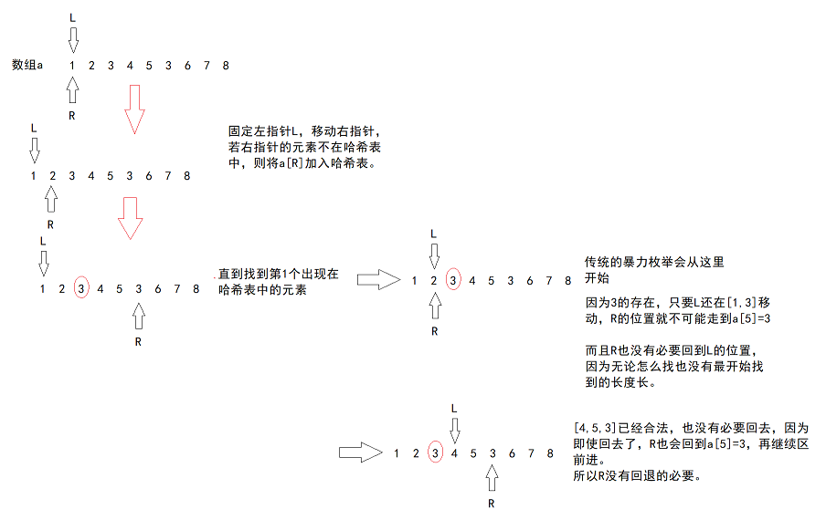
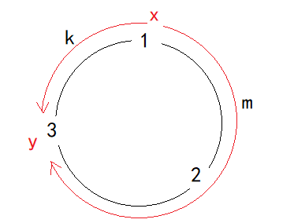
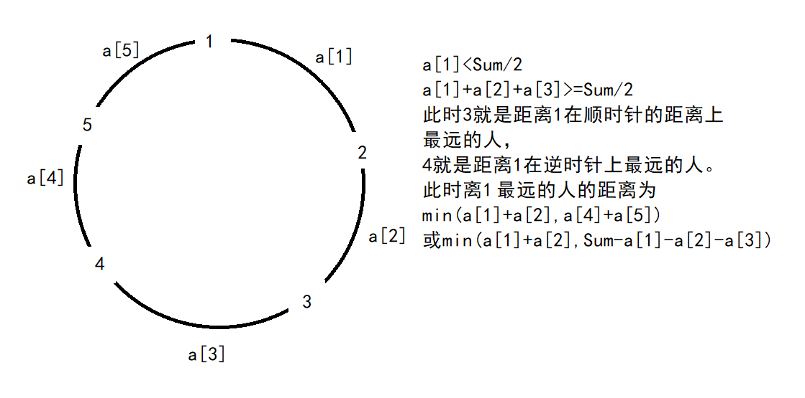
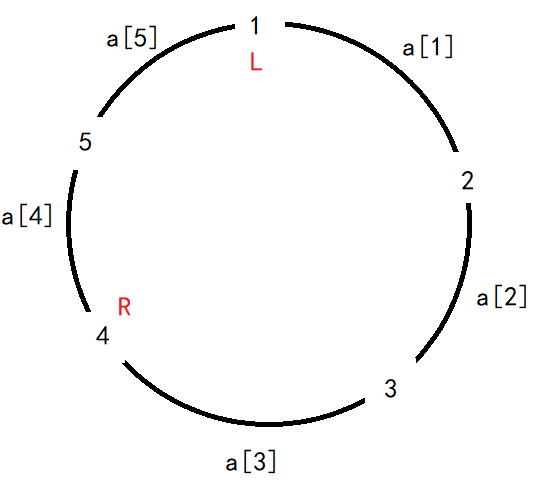

# 双指针思想

**双指针算法**有时候也叫**尺取法**、**滑动窗口**或**同向双指针**，是一种**优化暴力枚举策略**的手段。

当我们发现在两层 `for` 循环的暴力枚举过程中，**两个指针或两个起到指针作用的变量是可以不回退的**，此时我们就可以利用两个指针不回退的性质来优化时间复杂度。

因为双指针算法中，两个指针是朝着同一个方向移动的，因此也叫做同向双指针。

这个思路并不是我第一次接触，在[刷题——链表-CSDN博客](https://blog.csdn.net/m0_73693552/article/details/144950437)中有用到类似的思路，但当时并没有做总结。

## 唯一的雪花 双指针的思考过程

[UVA11572 唯一的雪花 Unique Snowflakes - 洛谷](https://www.luogu.com.cn/problem/UVA11572)

> 这是一道UVA的题，UVA是国外的OJ网站，只有先在UVA注册账号，并绑定洛谷账号才能在洛谷上提交。
>
> 如果无法注册，可以在[Virtual Judge](https://vjudge.net/)注册，通过这里来提交。
>
> 这个题的题目并不容易读懂，需要理解作者想要我们做什么。
>
> 不包含两片一样的雪花的包裹最大能有多大：注意关键词包裹，题目要求输出包裹的大小，根据题解也能看出最长的包裹是`[1,2,3]`，联想到数组的长度。
>
> 她可以在任何时候启动机器，但是一旦机器启动了，直到包裹被封上为止：选择的雪花是数组中连续的部分。

所以，这题经过二次翻译后就是：给你`T`组数据，每组数据告诉数组的长度和元素，问其中连续且两两不同的子序列的最长长度。

根据翻译，样例`[1,2,3,2,1]`可选的序列有`[1,2]`，`[3,2,1]`等，最长的是`[1,2,3]`和`[3,2,1]`。

可以尝试暴力枚举：枚举出所有符合要求的子数组，找出最长的那个。最容易想到的是两层循环，第一层固定起点位置，第二层枚举后续的所有元素来选出结尾的元素。

知道思路之后，还需要知道新加入结尾的元素是否有重复，这点可以通过哈希表或键值对来查重。每个新元素在哈希表中查不到时，便加入哈希表；若查得到，则记录当前的最大长度。

但所有的数组元素数是$10^6$，用两层循环的话循环次数是$10^{12}$，所以肯定超时，需要优化。

从枚举的原理分析：



通过对暴力枚举的研究发现**性质**：`L`和`R`两个起到下标作用的指针可以不用回退。

所以这个题可以用同向双指针。具体分析思路：

1. 初始化。
   （如何进行同向双指针的操作？）定义一个`L=0`和`R=0`两个指针，全部指向起始位置。

   （用什么结构维护窗口，即`L`到`R`之间的数据的信息？）例如这题的一个区间：`[1,2,3,4,5]`，考虑到窗口内所有元素俩俩不同，可以用双关键字的哈希表`unordered_map`，关键字这样定义：
   `<元素，元素出现的次数>`，例如当`[L,R]`维护的窗口变成`[1,2,3,4,5,3]`时，因为最后1个3加入哈希表时发现3重复，此时窗口不合法。
   所以针对这题，双指针的初始化要做的任务是给两个指针和哈希表。

2. 进窗口。
   即让`R`指向的元素进入窗口。如果是哈希表，则`mp[a[R]]++;`

3. 判断。
   即判断窗口是否合法。这里的窗口合法建立在窗口中元素俩俩互不相同，这里只有通过`R`加入窗口的元素才能造成窗口不合法，所以做判断`mp[a[R]]>1`。

4. 出窗口。
   若表达式`mp[a[R]]>1`为真，则说明窗口不合法，需要执行出窗口的操作：`L`右移，使`L`指向的元素出窗口，直到窗口合法，即`mp[a[L]]--`。
   所以这里的判断和出窗口的操作是一个完整的循环。

5. 更新结果。
   （需要根据题意判断怎样更新结果）有时更新结果是在循环的判断内，有时是出窗口的任务全部结束后再更新。
   这里是窗口合法后再更新。例如给个变量`ret`，`ret=max(ret,R-L+1)`。

> 这5个步骤是同向双指针的思考过程，具体应用时需要根据题意来设计窗口。但要先考虑一个暴力解法，再根据这个暴力解法中是否出现**性质**双指针不回推，此时才能使用同向双指针的分析思路解决问题。
>
> 为什么滑动窗口是正确的？
>
> 在指针移动的过程中，`R`无论是否回到`L`重新移动都会回到使窗口非法的位置，所以滑动窗口规避了很多没必要的枚举。例如这个OJ。
>
> 因为暴力枚举本身就是将所有可能的情况枚举一遍，只要需求和问题不是有特别大的歧义，本身就是正确的。滑动窗口作为枚举的优化，肯定也是正确的。
>
> 时间复杂度？
>
> 例如本题，看似两个循环，因为指针不回退，最差情况下两个指针`L`和`R`会各自遍历一次数组，所以枚举次数其实是$n+n$，时间复杂度其实是$O(n)$。

参考程序：

```cpp
#include<bits/stdc++.h>
//在MSVC中，哈希表并不在标准c++头文件中
#include<unordered_map>
using namespace std;

const int N = 1e6 + 10;

int n, a[N];

int main() {
    int T; cin >> T;
    while (T--) {
        cin >> n;
        for (int i = 1; i <= n; i++)
            cin >> a[i];

        //初始化
        int L = 1, R = 1;//需要根据数组的起始下标初始化
        int ret = 0;
        unordered_map<int, int>mp;//维护窗口内所有元素的出现次数
        while (R <= n) {
            //进窗口
            mp[a[R]]++;
            //判断
            while (mp[a[R]] > 1) {
                //出窗口
                mp[a[L]]--;
                L++;
            }
            //窗口合法，更新结果
            ret = max(ret, R - L + 1);
            R++;//让循环能进行
        }
        cout << ret << endl;
    }
    return 0;
}
```

做类似的题时，开始并不能知道这个题能用滑动窗口解决，如果那个题除了题干、输入和输出，其他啥都没给，能做的是利用自己的知识储备，尝试用各种已经学过的算法来解决。

例如滑动窗口，若题目出现两层循环的暴力枚举存在理论的解决问题的可能，则观察两层循环的两个指针作用的变量是否可以不回退，若满足这些条件，则可以利用滑动窗口优化。这题用的是哈希表，别的题可能是一个变量，或别的数据结构。


## 逛画展 在窗口合法的情况下寻找最优解

[P1638 逛画展 - 洛谷](https://www.luogu.com.cn/problem/P1638)

这题大概的意思是选一段连续子序列，这个子序列覆盖了`[1,m]`的所有数字。

和雪花一样，首先想到的是两层循环的暴力枚举，循环次数是$10^{12}$，铁定有样例超时。然后发现两个指针没有回退的必要，于是想到使用双指针。

双指针的思考方式：

1. 初始化
   定义`L`和`R`两个指针，用`unordered_map`定义一个哈希表`mp`，两个记录最终结果的变量`ll`和`rr`。
2. 进窗口
   让`R`指向的元素进入窗口（`mp[a[R]]++`）。
3. 判断
   首先判断`mp`是否覆盖了`[1,m]`的所有数字，若覆盖了则进行出窗口操作，试图压缩这个窗口的长度。
   这一步用了一步贪心策略：即在保证覆盖了`[1,m]`的所有数字的情况下，不断缩小窗口的长度来寻找最优解。
   也就是说，`mp`没有覆盖`m`个数字的情况下窗口都不合法，需要不停地进窗口来使窗口合法。这里的滑动窗口也和别的滑动窗口不一样，别的滑动窗口是判断不合法时才出窗口，这里是在合法的条件下通过出窗口来寻找最优解。
4. 出窗口
   同样是先判断`mp`是否覆盖了`[1,m]`的所有数字，若覆盖了则通过`mp[a[L]]--`出窗口，并使`L`指针后移。
5. 更新结果
   若窗口合法，且找到了长度更小的子序列则更新结果`ll`和`rr`。

但这题和唯一的雪花的不同点是，做判断和出窗口的前提是窗口整体合法，例如维护窗口的哈希表保存了指定数量的元素。

[P1638 逛画展 - 洛谷](https://www.luogu.com.cn/problem/P1638)参考程序：

```cpp
#include<bits/stdc++.h>
#include<unordered_map>
using namespace std;
/*
https://www.luogu.com.cn/problem/P1638
*/

int main() {
	vector<int>a;
	int n, m;
	cin >> n >> m;
	a.resize(n + 1, 0);
	for (int i = 1; i <= n; i++)
		cin >> a[i];

	//滑动窗口初始化
	int L = 1, R = 1, ll = 0, rr = 0, len = 0x3f3f3f3f;
	unordered_map<int, int>mp;
	while (R <= n) {
		//进窗口
		mp[a[R]]++;

		//判断
		while (mp.size() >= m && mp[a[L]] > 1) {
			//在窗口合法的情况下出窗口
			mp[a[L]]--;
			L++;
		}

		//窗口合法的情况下更行结果
		if (mp.size() >= m && len > R - L + 1) {
			len = R - L + 1;
			ll = L; rr = R;
		}

		//让循环能进行
		R++;
	}
	cout << ll << ' ' << rr;
	return 0;
}
```

当然，这个题方法比较多，肯定不止局限于滑动窗口。这里不再枚举。


[字符串](https://ac.nowcoder.com/acm/problem/18386)

和逛画展差不多。但窗口合法的条件是哈希表的长度是26个字母。

```cpp
#include<bits/stdc++.h>
#include<unordered_map>
using namespace std;

int main() {
	string st;
	cin >> st;
    int L=0,R=0;
    unordered_map<char,int>mp;
    int len=st.size();
    while(L<=R&&R<st.size()){
        mp[st[R]]++;
        while(mp.size()>=26&&mp[st[L]]>1){
            mp[st[L]]--;
            L++;
        }
        if(mp.size()>=26&&len>R-L+1)
            len=R-L+1;
        R++;
    }
    cout<<len;
	return 0;
}
```


## 丢手绢 无论窗口是否合法都要更新结果

[丢手绢](https://ac.nowcoder.com/acm/problem/207040)

首先，根据题意得出距离的定义：假设$x$走向$y$的顺时针上的距离为$m$，逆时针上的距离为$k$，则$x$与$y$的距离为`min(k,m)`。



针对第`i`个人，如何找出距离`i`最远的那个人，那个人和`i`的距离是多少，只要能解决这个问题，就能解决这题。

而这个人可能有两个，一个是顺时针方向的最远，另一个是逆时针方向的最远，也有可能两个方向一样远。

假设从`a[i]`号人开始顺时针看，将沿途经过的所有人的顺时针距离相加，若第一次遇到一个人`a[j]`，这个人离最开始的那个人的距离$\geq \frac{Sum}{2}$（$Sum$是所有距离的总和，也可以认为是这个环形的周长），此时可以得出结论，`a[j-1]`就是离`a[i]`在顺时针方向上最远的人。再计算`a[j]`的距离时只能用逆时针来运算（因为顺时针的距离$\geq \frac{Sum}{2}$），且`a[j]`就是离`a[i]`在逆时针方向上最远的人。



此时可以用枚举来尝试解决：暴力枚举出所有的人距离别人的最远距离，在所有情况下取`max`即可。

这时可以定义两个变量`L`和`R`，当$\Sigma_{i=L}^Ra_i\geq \frac{Sum}{2}$时，枚举停止，距离为$\min (\Sigma_{i=L}^{R-1}a_i,Sum-\Sigma_{i=L}^{R}a_i)$。所以可以用两层循环来枚举，时间复杂度为$O(n^2)$，不出意外的话肯定超时。此时需要优化暴力解法，先看有`L`和`R`是否出现回退的情况。如图所示：



根据图中的信息，当`R`走到4时`a[1]+a[2]+a[3]>=Sum/2`, 传统的暴力做法是`L`从1移动到2，`R`回退到2重新开始计算。 

但其实`R`没有回退的必要，因为 `L`从1移动到2时，`L`和`R`的顺时针方向的距离在减小， 即`L`和`R`的距离是`a[2]+a[3]`。 为了找到大于`Sum/2`的情况，`R`需要在`L`移动时通过顺时针移动来维持这个距离。 

也有可能`L`移动时距离依旧大于`Sum/2`，所以`R`有时也不移动 。

所以`R`没有回退的必要。根据这个特性，可以用滑动窗口解决。

1. 初始化
   初始化变量`L`、`R`和`dis=0`，以及记录最终结果的变量`res`。
2. 进窗口
   `dis+=a[R]`。
3. 判断
   当`2*dis>=Sum`时，此时窗口不合法，需要出窗口。判断和出窗口组成一个循环。
4. 出窗口
   `k-=a[L]`。
5. 更新结果
   窗口合法（即`2*dim<Sum`）时更新结果，此时需要用$\Sigma_{i=L}^{R}a_i$即顺时针的距离更新结果。
   而当窗口不合法时，也要用$Sum-\Sigma_{i=L}^{R}a_i$更新结果，因为从`L`到`R+1`的逆时针方向的距离也可能是最终结果。
   因此这个题更新结果需要在两个位置。

参考程序：

```cpp
#include<bits/stdc++.h>
using namespace std;
typedef long long ll;

int main(){
    int n;cin>>n;
    vector<int>a(n+1,0);
    int sum=0;
    for(int i=1;i<=n;i++){
        cin>>a[i];
        sum+=a[i];
    }
    
    //初始化
    int L=1,R=1,dis=0,res=0;
    while(L<=R&&R<=n){
        
        //进窗口
        dis+=a[R];
        
        //判断
        while(2*dis>=sum){
            //用逆时针方向的距离更新结果
            res=max(res,sum-dis);
            //出窗口
            dis-=a[L++];
        }
        //用顺时针方向的距离更新结果
        res=max(res,dis);
        R++;
    }
    cout<<res;
    return 0;
}
```

