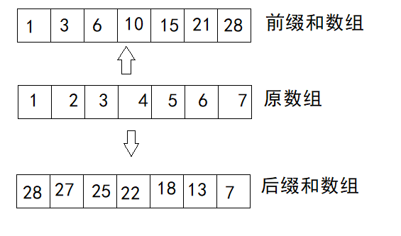
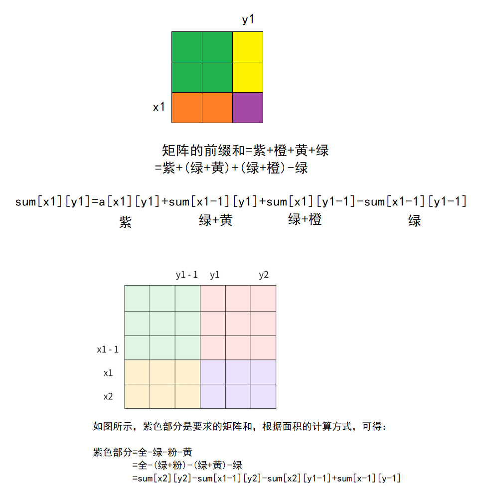
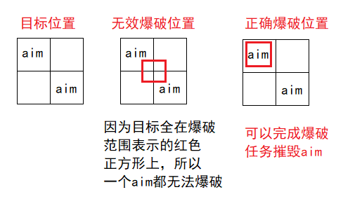
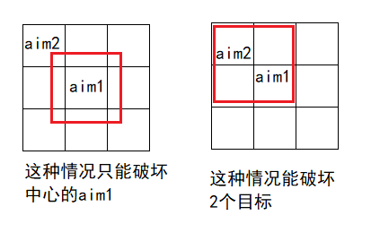
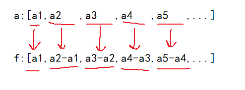
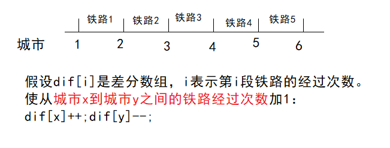
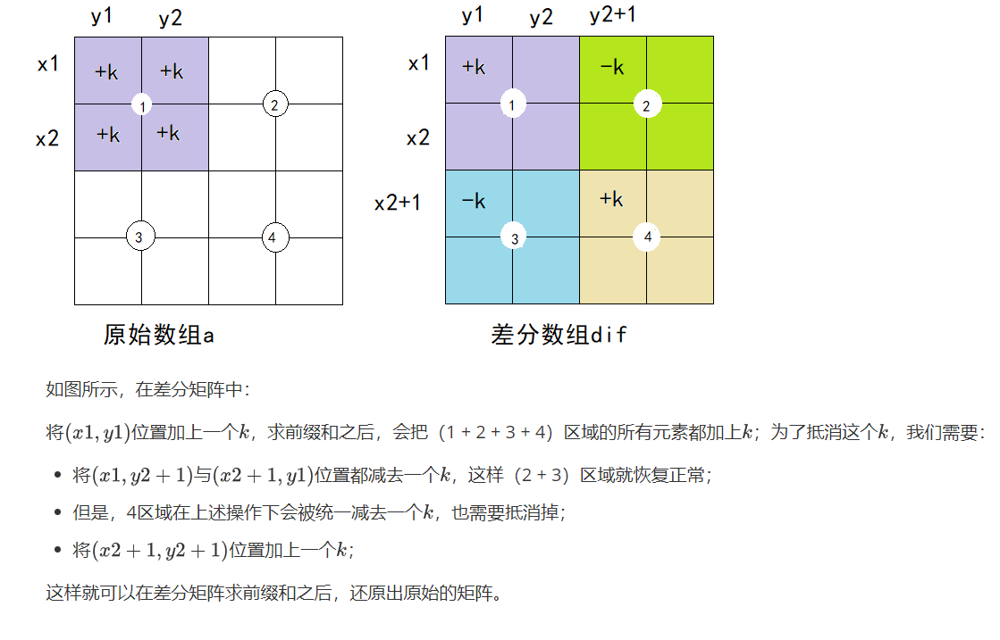

# 前缀和

前缀和通俗的讲就是在原来的数组的基础上，新开辟一个数组，这个新开辟的数组的每个元素映射到原数组上，都是同一位置之前的元素包括本身的和。

在有的题目中根据不同的需求也有后缀和，后缀和更像是将原数组翻转过来后再求前缀和。

前缀和可以在$O(1)$的时间复杂度下求出某一段区间的和（通过两个前缀和数组元素作差的形式），因为访问的方式是通过数组的下标运算进行访问，即使是用STL也可以很快。



前、后缀和（和后面的差分）本质上是**暴力枚举的优化方式**，它们可以快速地查询想要的某种结果（比如前、后缀和求的是某一段区间的和），优化时间复杂度。但因为另外开了等同的空间，所以实质是空间换时间的做法。

## 一维前缀和

一维前缀和即原始数组和前缀和数组都是一维，是最基础，也是用的最多的前缀和。

### 一维前缀和模板

[【模板】前缀和](https://ac.nowcoder.com/acm/problem/226282)

如题目所言，一维前缀和的模板题，目标是查询指定区间的和。

但需要注意数据范围是$\pm 10^9$，用`int`很容易超限导致溢出，需要用`long long`或无脑高精度。

参考程序

```cpp
#include<bits/stdc++.h>
using namespace std;

int n,q;
vector<long long>a,presum;
void init(){
    cin>>n>>q;
    a.resize(n+1,0);
    presum=a;
    for(int i=1;i<=n;i++)
        cin>>a[i];
    for(int i=1;i<=n;i++)//分开来算可以减少cpu对操作数据的切换频率，减少微观上的操作时间
    	presum[i]=presum[i-1]+a[i];//预处理前缀和数组
    
}

void ac(){
    int l,r;
    while(q--){
        cin>>l>>r;
        cout<<(presum[r]-presum[l-1])<<endl;//区间[l,r]包括端点
    }
}

int main(){
    init();
    ac();
    return 0;
}
```

### 最大子段和

[P1115 最大子段和 - 洛谷](https://www.luogu.com.cn/problem/P1115)

这个题在动态规划出现过（详见[动态规划——线性dp_洛谷 矩阵 最短路 线段树优化dp 群论-CSDN博客](https://blog.csdn.net/m0_73693552/article/details/146384726?spm=1001.2014.3001.5501)），既然在前缀和的文章出现，就用前缀和来解决这个问题。

根据dp给出的结论，这个题需要在时间复杂度$O(n)$的情况下才能AC。

因此如果用前缀和的话，可以用当前位置的前缀和，减去已遍历过的前缀和中的最小值。其中这个最小值需要实时更新。

参考程序：

```cpp
#include<bits/stdc++.h>
using namespace std;

vector<long long>a,sum;
long long ans,minsum;
int n;
void ac(){
    cin>>n;
    a.resize(n+1,0);
    sum=a;
    for(int i=1;i<=n;i++)
        cin>>a[i];
    for(int i=1;i<=n;i++)
        sum[i]=sum[i-1]+a[i];
    minsum=0;ans=-100;//第2个测试样例的答案是-100，需要安排更小的无穷小
    for(int i=1;i<=n;i++){
        ans=max(ans,sum[i]-minsum);//当前前缀和减去已知最小的前缀和
        minsum=min(minsum,sum[i]);//求ans和这个顺序不能乱
    }
    cout<<ans;
}

int main(){
    ac();
    return 0;
}
```

这里有个坑点：若数组中所有元素全部小于0，每次先预处理最小的前缀和`minsum`，即：

```cpp
for(int i=1;i<=n;i++){
    minsum=min(minsum,sum[i]);
    ans=max(ans,sum[i]-minsum);//当前前缀和减去已知最小的前缀和
}
```

会将最小的前缀和`minsum`初始化为`sum[1]`，这时答案无论再怎么减都是0，而0在全是负数的前缀和中又恰好是最大的，这样做反而干扰了最终的结果。

## 二维前缀和

二维前缀和即原始数组是二维数组的情况下，以某个格子为右下角的子矩阵的所有元素的和。

### 二维前缀和模板

[【模板】二维前缀和](https://ac.nowcoder.com/acm/problem/226333)

[1224：最大子矩阵](http://ybt.ssoier.cn:8088/problem_show.php?pid=1224)

[1282：最大子矩阵](http://ybt.ssoier.cn:8088/problem_show.php?pid=1282)

关于这三个题，在[动态规划——线性dp_洛谷 矩阵 最短路 线段树优化dp 群论-CSDN博客](https://blog.csdn.net/m0_73693552/article/details/146384726?spm=1001.2014.3001.5501)中有所涉及，这里贴一个原理图即可。




参考程序：

```cpp
#include<bits/stdc++.h>
using namespace std;
typedef long long ll;

int n,m,q;
ll sum[1001][1001];

void init(){
    cin>>n>>m>>q;
    for(int i=1;i<=n;i++)
        for(int j=1;j<=m;j++){
            ll x;
            cin>>x;
            //求二维前缀和
            sum[i][j]=sum[i-1][j]+sum[i][j-1]-sum[i-1][j-1]+x;
        }
}

void ac(){
    while(q--){
        int x1,y1,x2,y2;
        cin>>x1>>y1>>x2>>y2;
        cout<<sum[x2][y2]-sum[x1-1][y2]-sum[x2][y1-1]+sum[x1-1][y1-1]<<endl;
    }
}

int main(){
    init();
    ac();
    return 0;
}
```

### OJ激光炸弹

[P2280 [HNOI2003\] 激光炸弹 - 洛谷](https://www.luogu.com.cn/problem/P2280)

例如样例：

```
2 1
0 0 1
1 1 1
```

目标位置、无效的爆破位置和正确的爆破位置如图（红色正方形实际与对应边长的格子重叠）：



再例如这个样例：

```
2 2
0 0 1
1 1 1
```

炸弹投放到中心位置的 aim1 ，同样无法完成应有的爆破价值，所以爆破范围需要与地图上的正方形重叠。



所以这题的思路是枚举边长为`m`，也就是爆破范围的矩形，看哪个爆破范围摧毁的价值最大。为了能更快地得到当前爆破范围摧毁目标的价值，可以用二维前缀和。

枚举矩阵时可以固定左下角，根据爆破范围确定右上角。

这里还有2个细节：

1. 多个目标在同一位置上的情况。这时需要将价值叠加。
2. 有的目标的下标在`(0,0)`，这种情况不利于求前缀和，因此可以横、纵坐标同时加1。
3. 爆破范围`m`可能大于 5000 也就是地图上所有目标所在的最大的正方形的边长，这种情况可以一次性摧毁所有目标。这时需要让`m`的值为地图的边长才能进行后续的枚举。

参考程序：

```cpp
#ifndef _CRT_SECURE_NO_WARNINGS
#define _CRT_SECURE_NO_WARNINGS 1
#endif

#include <bits/stdc++.h>
using namespace std;
const int N = 5010;
int n, m;
vector<vector<int> >a(N, vector<int>(N,0)),f(a);
int main()
{
	cin >> n >> m;
	while (n--) {
		int x, y, v; cin >> x >> y >> v;
		x++, y++; //下标从1开始计数
		a[x][y] += v; //同一个位置可能有多个目标
	}
	n = 5001;
	//预处理前缀和数组
	for (int i = 1; i <= n; i++) 
		for (int j = 1; j <= n; j++) 
			f[i][j] = f[i - 1][j] + f[i][j - 1] - f[i - 1][j - 1] + a[i][j];
	
	int ret = 0;
	m = min(m, n); //处理m很大的情况
	//枚举所有边长为m的正方形
	for (int x2 = m; x2 <= n; x2++)
		for (int y2 = m; y2 <= n; y2++) {
			int x1 = x2 - m + 1, y1 = y2 - m + 1;
			ret = max(ret, f[x2][y2] - f[x1 - 1][y2] - f[x2][y1 - 1] + f[x1 -
				1][y1 - 1]);
		}
	
	cout << ret << endl;
	return 0;
}
```

# 差分

一维差分即将一维数组中每个元素的值减去前一个元素的值，这些新的值用另一个数组保存起来。



差分可以在常数时间复杂度下，完成某一区间所有元素统一加上一个数的需求。

差分和前缀和是互逆运算，若对前缀和数组做差分运算，可以还原原数组，反过来对差分数组做前缀和运算，也可以还原原数组。

## 一维差分

### 实现区间统一加、减

[【模板】差分](https://ac.nowcoder.com/acm/problem/226303)

这个题用暴力枚举，也就是他问什么范围就循环枚举什么范围，时间复杂度为$O(mn)$，循环枚举次数将来到$10^{10}$，必定超时。

用差分数组：记`f[i]=a[i]-a[i-1]`，`i>=1`。

其中差分数组的一条很重要的性质：原数组`a`的`[l,r]`区间全部元素都进行加`k`的操作，相当于在差分数组中`f[l]+=k,f[r+1]-=k`。

> 这个性质可以用数学归纳法证明。
>
> 1. 例如原数组`a`，差分数组`f`，当数组元素有限时，例如5个元素：
>
> `a:[1,2,3,4,5]`
>
> `f:[1,2-1,3-2,4-3,5-4]`
>
> 指定区间`[2,4]`增加一个数`k`：
>
> `a:[1,2+k,3+k,4+k,5]`
>
> `f:[1,2+k-1,3+k-2-k,4+k-3-k,5-4-k]`，其中$\pm k$可以互相抵消：
>
> `f:[1,2+k-1,3-2,4-3,5-4-k]`，所以这个性质在数组长度有限时是正确的。
>
> 2. 例如原数组`a`，差分数组`f`，当数组元素数无法确定时：
>
> $a:[a_1,a_2,\cdots,a_l,a_{l+1},\cdots,a_r,a_{r+1},\cdots]$
>
> $f:[a_1,a_2-a_1,\cdots,a_l-a_{l-1},a_{l+1}-a_l,\cdots,a_r-a_{r-1},a_{r+1}-a_{r},\cdots]$
>
> 指定区间$[l,r]$增加一个数$k$：
>
> $a:[a_1,a_2,\cdots,a_l+k,a_{l+1}+k,\cdots,a_r+k,a_{r+1},\cdots]$
>
> $f:[a_1,a_2-a_1,\cdots,a_l+k-a_{l-1},a_{l+1}+k-a_l-k,\cdots,a_r+k-a_{r-1}-k,a_{r+1}-a_{r}-k,\cdots]$
>
> 同样的$\pm k$相互抵消：
>
> $a:[a_1,a_2,\cdots,a_l+k,a_{l+1}+k,\cdots,a_r+k,a_{r+1},\cdots]$
>
> $f:[a_1,a_2-a_1,\cdots,a_l+k-a_{l-1},a_{l+1}-a_l,\cdots,a_r-a_{r-1},a_{r+1}-a_{r}-k,\cdots]$
>
> 可以看到，当区间的值统一加`k`时，差分数组除了`a[l]`和`a[r+1]`，其他地方都没有变化，所以证明完毕。

利用差分数组进行原数组的指定区间统一修改，并且同样的修改操作同样有很多次时，差分数组必须全部完成所有操作后，才能还原原数组。

> 因为还原操作之后的数组是对差分数组求前缀和，每次求前缀和的时间复杂度是$O(n)$也就是数组的长度。若每操作若干次，查询一次操作之后的结果，之后还会继续操作若干次，之后又继续查询，如此操作和查询进行反复操作，整体时间复杂度是$O(nq)$，`n`是数组的长度，`q`是查询次数，所以运行次数取决于`n`、`q`的最大值。
>
> 这时整体时间复杂度依旧非常高，所以为了优化，会引进更高阶的数据结构：线段树。
>
> 因此差分数组的适用范围也是比较局限。

[【模板】差分](https://ac.nowcoder.com/acm/problem/226303)参考程序：

```cpp
#include<bits/stdc++.h>
using namespace std;

void ac1(){
    int n,m;
    cin>>n>>m;
    vector<long long>a(n+2,0),f(a);
    for(int i=1;i<=n;i++){//差分数组朴素求解
        cin>>a[i];
        f[i]=a[i]-a[i-1];
    }
    while(m--){
        int l,r;
        long long k;
        cin>>l>>r>>k;
        f[l]+=k;
        if(r+1<=n)
            f[r+1]-=k;
    }
    long long x=0;
    for(int i=1;i<=n;i++){
        x+=f[i];
        cout<<x<<' ';
    }
}

void ac2(){
    int n,m;
    cin>>n>>m;
    vector<long long>f(n+2,0);
    for(int i=1;i<=n;i++){
        long long x;cin>>x;
        f[i]+=x;//利用差分的特性进行空间优化
        f[i+1]-=x;
    }
    while(m--){
        int l,r;
        long long k;
        cin>>l>>r>>k;
        f[l]+=k;
        if(r+1<=n)
            f[r+1]-=k;
    }
    long long x=0;
    for(int i=1;i<=n;i++){
        x+=f[i];
        cout<<x<<' ';
    }
}

int main(){
    ac2();
    return 0;
}
```

### OJ海底高铁

[P3406 海底高铁 - 洛谷](https://www.luogu.com.cn/problem/P3406)

读题：

1. 经过任何一段两个城市之间的铁路，都要花钱。可以买票可以刷卡。
2. 一段铁路经过多少次，就花费多少次的钱。

所以求最小花费，还需要根据所有行程的起点和终点，来计算某一段的铁路的经过次数，也就是统一改变整个区间。这里需要用到一维差分。

此时这道求最优解问题便能模拟出来：

1. 初始化一个差分数组。根据经过的两个城市来修改指定区间的铁路的经过次数。
2. 将差分数组还原，即可得到所有铁路的经过次数。
3. 根据经过次数，做贪心策略：在买票和买卡中选择花费最小的那种方式。

其中差分数组的求法：



参考程序：

```cpp
#include <bits/stdc++.h>
using namespace std;

void ac() {
	typedef long long ll;
	int n, m;
	cin >> n >> m;
	vector<int>dif(n+1,0);//difference，翻译差分
	int x, y;
	cin >> x;

	//利用差分数组，求每段铁路经过的次数
	for (int i = 2; i <= m; i++) {
		cin >> y;
		if (x < y) {
			dif[x]++;
			dif[y]--;
		}
		else {
			dif[y]++;
			dif[x]--;
		}
		x = y;
	}
	for (int i = 1; i < n; i++)
		dif[i] += dif[i - 1];

	//求每段铁路的最小花费进行叠加
	ll ans = 0,a,b,c;
	for (int i = 1; i < n; i++) {
		cin >> a >> b >> c;
		ans += min(dif[i] * a, dif[i] * b + c);
	}
	cout << ans;
}

int main() {
	ac();
	return 0;
}
```


## 二维差分

前缀和有二维，差分自然也有。但二维差分数组并不好画出示例矩阵，因此这里只根据特性陈述二维差分数组的求解方法。

### 实现子矩阵的统一加、减

[【模板】二维差分](https://ac.nowcoder.com/acm/problem/226337)

首先想到的是暴力解法4层循环遍历子矩阵，但因为数据量比较大（最终计算出的运行次数$10^{11}$），所以暴力会超时。

二维也有差分的概念，主要用于子矩阵的统一的加、减操作。二维差分数组也可以通过前缀和操作还原。因此用差分可以在极短的时间内完成要求。

求二维差分的方法：

假设`dif[i][j]`是二维数组`a[i][j]`的差分数组，则他有类似一维差分的**两个特性**：

1. 以`dif[i][j]`为右下角的差分数组的元素组成的矩阵，所有元素的和（二维矩阵的前缀和）等于`a[i][j]`。
2. 使`dif[i][j]`加上或减去某个值，再通过求二维前缀和的方式还原二维数组时，会发现以`dif[i][j]`为左上角的矩阵的全部元素都会加上（或减去）相应的值。

所以改变原数组的以$(x_1,y_1)$为左上角，$(x_2,y_2)$为右下角的矩阵时可以这样操作：

1. `dif[x1][y1]+=k`，即以`a[x1][y1]`为左上角的矩阵，全部元素都加一个`k`。
2. 为了使得其他区域的元素还原，需要减去一个`k`来抵消掉`dif[x1][y1]+=k`造成的影响。因此需要进行操作`dif[x2+1][y1]-=k`、`dif[x1][y2+1]-=k`。
3. 经过2的操作，`a[x2+1][y2+1]`为左上角的矩阵反而减少了一个`k`，因此需要加上这个`k`来还原。于是`dif[x2+1][y2+1]+=k`。

所以对差分数组进行这4步操作，即可对原数组`a[i][j]`的指定区域进行修改：

```cpp
dif[x1][y1]+=k;
dif[x2+1][y1]-=k;
dif[x1][y2+1]-=k
dif[x2+1][y2+1]+=k;
```

当$x_1=x_2$，$y_1=y_2$时，这些操作就变成了求差分数组的操作。



根据这个原理，还可以推出`dif[i][j]`和其他`a[i][j]`的关系：

假设差分数组`dif[i][j]`内的元素全是0，要把它改造成数组`a[i][j]`的差分数组，可以用`a[i][j]`减去上方和左边的数据，再加上左上角的数据。即：

```cpp
dp[i][j]=a[i][j]-a[i-1][j]-a[i][j-1]+a[i-1][j-1];
```

所以这道OJ可以先求出差分数组，再利用那4步操作修改指定子矩阵内的元素，最后通过前缀和求得原数组。

[【模板】二维差分](https://ac.nowcoder.com/acm/problem/226337)参考程序：

```cpp
#ifndef _CRT_SECURE_NO_WARNINGS
#define _CRT_SECURE_NO_WARNINGS 1
#endif

#include <bits/stdc++.h>
using namespace std;
typedef long long ll;

void ac1() {
	int n, m, q;
	cin >> n >> m >> q;
	vector<vector<ll> >dif(n + 2, vector<ll>(m + 2, 0));
    
    //求原始数组的差分数组
	ll x;
	for (int i = 1; i <= n; i++) 
		for (int j = 1; j <= m; j++) {
			cin >> x;
			dif[i][j] += x;
			dif[i + 1][j] -= x;
			dif[i][j + 1] -= x;
			dif[i + 1][j + 1] += x;
		}
    
    //修改指定子矩阵的元素
	int x1, y1, x2, y2;
	ll k;
	while (q--) {
		cin >> x1 >> y1 >> x2 >> y2 >> k;
		dif[x1][y1] += k;
		dif[x2 + 1][y1] -= k;
		dif[x1][y2 + 1] -= k;
		dif[x2+1][y2 + 1] += k;
	}
    
    //通过前缀和的方式求原数组
	for (int i = 1; i <= n; i++) {
		for (int j = 1; j <= m; j++) {
			dif[i][j] = dif[i - 1][j] + dif[i][j - 1] - dif[i - 1][j - 1] + dif[i][j];
			cout << dif[i][j] << ' ';
		}
		cout << endl;
	}
}

void ac2() {
	int n, m, q;
	cin >> n >> m >> q;
	vector<vector<ll> >dif(n + 2, vector<ll>(m + 2, 0)),a(dif);
    
    //求原始数组的差分数组
	for (int i = 1; i <= n; i++)
		for (int j = 1; j <= m; j++) {
			cin >> a[i][j];
			dif[i][j] = a[i][j] - a[i - 1][j] - a[i][j - 1] + a[i - 1][j - 1];
		}
    
    //修改指定子矩阵的元素
	int x1, y1, x2, y2;
	ll k;
	while (q--) {
		cin >> x1 >> y1 >> x2 >> y2 >> k;
		dif[x1][y1] += k;
		dif[x2 + 1][y1] -= k;
		dif[x1][y2 + 1] -= k;
		dif[x2 + 1][y2 + 1] += k;
	}
    
    //通过前缀和的方式求原数组
	for (int i = 1; i <= n; i++) {
		for (int j = 1; j <= m; j++) {
			dif[i][j] = dif[i - 1][j] + dif[i][j - 1] - dif[i - 1][j - 1] + dif[i][j];
			cout << dif[i][j] << ' ';
		}
		cout << endl;
	}
}

int main() {
	//ac1();
	ac2();
	return 0;
}
```


[P3397 地毯 - 洛谷](https://www.luogu.com.cn/problem/P3397)

二维差分的模板题。

```cpp
#include <bits/stdc++.h>
using namespace std;
typedef long long ll;

void ac() {
	int n, m;
	cin >> n >> m;
	vector<vector<int> >dif(n + 2, vector<int>(n + 2, 0));
	auto f = [&](int x1, int y1, int x2, int y2, int k) {
		dif[x1][y1] += k; dif[x2 + 1][y1] -= k;
		dif[x1][y2 + 1] -= k; dif[x2 + 1][y2 + 1] += k;
	};
	for (int i = 1, x1, x2, y1, y2; i <= m; i++) {
		cin >> x1 >> y1 >> x2 >> y2;
		f(x1, y1, x2, y2, 1);
	}
	for (int i = 1; i <= n; i++) {
		for (int j = 1; j <= n; j++) {
			dif[i][j] += dif[i - 1][j] + dif[i][j - 1] - dif[i - 1][j - 1];
			cout << dif[i][j] << ' ';
		}
		cout << endl;
	}
}

int main() {
	ac();
	return 0;
}
```

# 差分和前缀和OJ汇总

1. 前缀和

[【模板】前缀和](https://ac.nowcoder.com/acm/problem/226282)

[P1115 最大子段和 - 洛谷](https://www.luogu.com.cn/problem/P1115)

[【模板】二维前缀和](https://ac.nowcoder.com/acm/problem/226333)

[P2280 [HNOI2003\] 激光炸弹 - 洛谷](https://www.luogu.com.cn/problem/P2280)

2. 差分

[【模板】差分](https://ac.nowcoder.com/acm/problem/226303)

[P3406 海底高铁 - 洛谷](https://www.luogu.com.cn/problem/P3406)

[【模板】二维差分](https://ac.nowcoder.com/acm/problem/226337)

