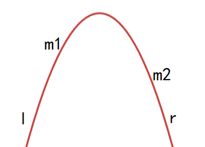

# 三分算法

三分法适用于求解**凸性函数的极值问题**，二次函数就是一个典型的单峰函数。 三分法与二分法一样，它会不断缩小答案所在的求解区间。二分法缩小区间利用的原理是函数的单调性，而三分法利用的则是**函数的单峰性**。 

## 基于函数极值的三分算法

设当前求解的区间为`[l,r]`，令`m1 =l+ (r-l)/3，m2 =r-(r-l)/3`，接着计算这两个点的函数值`f(m1),f(m2)`之后我们将两点中函数值更优的那个点称为好点（若计算最大值，则f更大的那个点 就为好点，计算最小值同理），而函数值较差的那个点称为坏点。 

我们可以证明，最优点与好点会与坏点同侧。如图所示：




 `f(m1)>f(m2)`，则`m1`是好点，而`m2`是坏点，因此最后的最优点会与`m1` 一起在`m2`的左侧，即我们的求解区间由`[l,r]`变为了`[l,m2]`。因此根据这个结论我们可以不停缩小求解区间，直至得出近似解。 与二分一样，我们可以指定三分的次数，或是根据`r-l`的值来终止算法。

以求上凸单峰函数的最大值为例，三分模板：

```cpp
double find(){
    while(r-l>dlt){
    	double m1=f(l+(r-l)/3),m2=f(r-(r-l)/3);
    	if(m1<=m2)
        	l=l+(r-l)/3;
    	else
        	r=r-(r-l)/3;
	}
    return f(r);//极值点
}
```

## 求函数极值 OJ

[1435：【例题3】曲线](http://ybt.ssoier.cn:8088/problem_show.php?pid=1435) 

一堆二次函数组合在一起的叠加函数，在`[0,1000]`可能单调递增，也可能是先单调递减，后单调递增。但不管怎么说，这个函数在`[0,1000]`都可以看做单峰函数。然后对这个单峰函数求最小值，可以尝试三分。

```cpp
#define _CRT_SECURE_NO_WARNINGS 1

#include <iostream>
#include <cstring>
#include <string>
#include<algorithm>
#include<cstdio>
#include<vector>
#include<cmath>
using namespace std;

const double dlt = 1e-11;
vector<double>a, b, c;
int n;

inline double f(double x) {
	double ans = a[1] * x * x + b[1] * x + c[1];
	for (int i = 1; i < a.size(); i++)
		ans = max(ans, a[i] * x * x + b[i] * x + c[i]);
	return ans;
}

void ac() {
	int T;
	cin >> T;
	while (T--) {
		cin >> n;
		a.resize(n + 1, 0);
		b = c = a;
		for (int i = 1; i <= n; i++)
			cin >> a[i] >> b[i] >> c[i];

		double l = 0, r = 1000.0;
		while (r - l > dlt) {
			double m1 = f(l + (r - l) / 3),
				m2 = f(r - (r - l) / 3);
			if (m1 <= m2)
				r = r - (r - l) / 3;
			else
				l = l + (r - l) / 3;
		}
		printf("%.4lf\n", f(r));
	}

}

int main() {
	ac();
	return 0;
}
```