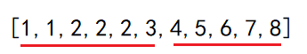
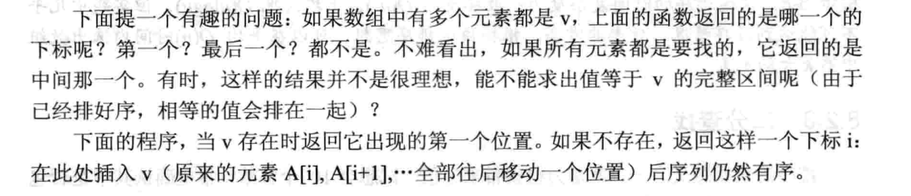
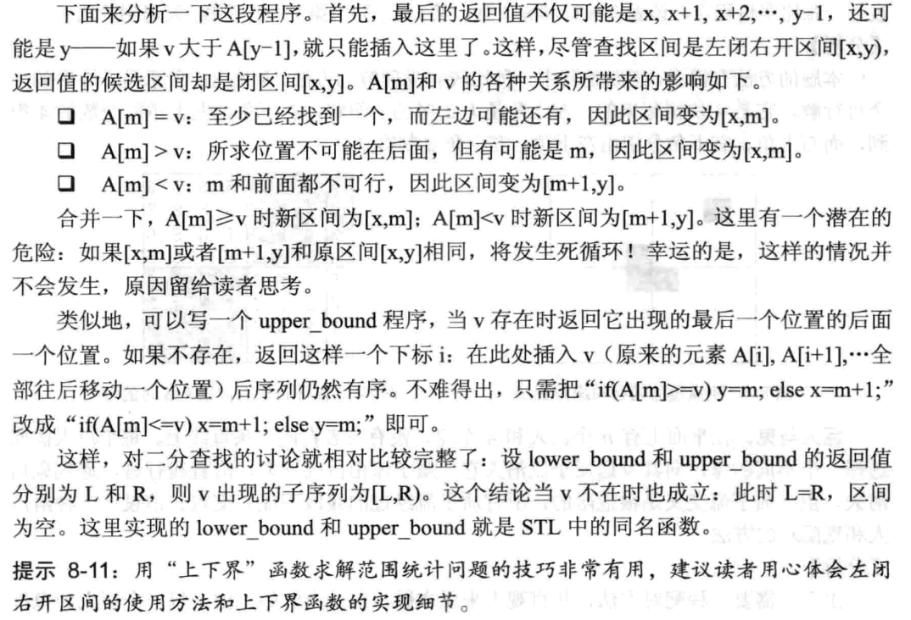

# 二分算法

二分法是在一个单调有序的集合或函数中查找一个解，每次分为左、右两个部分，判断解在哪个部分中并调整上、下界（区间的左、右端点），直到找到目标元素，每次二分后都将舍弃一半的查找空间，因此效率很高（时间复杂度$O(\log n)$）。

二分的使用前提是区间`[l,r]`内的**数据有序**（或数据存在二段性，即根据某个特定的标准比如大小能将整个区间的数据划分成两段）。

## 通过二分查找理解二分算法

二分算法的原理以及实现主要的难点在于问题中的细节问题。

[34. 在排序数组中查找元素的第一个和最后一个位置 - 力扣（LeetCode）](https://leetcode.cn/problems/find-first-and-last-position-of-element-in-sorted-array/description/)

例如`[5,7,7,8,8,10]`，`t=8`，可以找到8在`[3,4]`。

可以用暴力枚举，从前往后扫描，找到第1个`t`时标记位置，然后继续枚举，直到找完，不出意外的话肯定超时。

暴力枚举慢就慢在它并没有利用数组有序的特性。

这个题有两问：

1. 找起始位置。
2. 找最终位置。

### 找起始位置

假设数组是`[1,1,2,2,2,3,4,5,6,7,8]`，`t=2`，肉眼可以看到根据起始位置，数组可以分成两个部分：`[1,1]`和`[2,2,2,3,4,5,6,7,8]`。

> 这里可以认为找到了一种二段型。以后做题时可以认为是二分算法的使用契机。
>
> 计算机不是人，并不能一下子找到这个2在哪。所以需要利用单调性舍弃不需要的部分。

定义两个指针`l`和`r`，分别指向要查找的答案的集合（通常是区间）的**起始位置**和**终点位置**，之后**根据中点**`mid=(l+r)/2`**划分区域**，并**判断答案在哪个区域**，**在左边就舍弃右边的区域**，**在右边就舍弃左边的区域**。每次进行都会缩小一半的空间，不断**重复这个步骤**，**最终两个指针相遇的点**很大可能就是答案。

这就是二分算法的通用思路。在用二分解决问题时，可以画一条直线模拟，找到`l`和`r`的中点`mid`。

例如样例`[1,1,2,2,2,3,4,5,6,7,8]`，`t=2`按照二分算法的思路划分成了`[1,1,2,2,2,3]`和`[4,5,6,7,8]`，`l=0`，`r=10`，`mid=5`（下标从0开始）。如图所示，将样例划分成两个区域`[l,mid]`和`[mid+1,r]`：



此时有两种情况：

1. `a[mid]>=t`：例如`[1,1,2,2,2,3]`，最终答案在这个区域也就是`[l,mid]`。但计算机依旧不知道在哪，此时的策略是即舍弃`[mid+1,r]`，`r=mid`，为下一次搜寻做准备。

   在连续找两次后，样例缩小变成`[1,1,2]`。此时`l=0,r=2,mid=1`，来到第2种情况。

2. `a[mid]<t`：最终结果在`[mid+1,r]`。此时的策略是舍弃`[l,mid]`，`l=mid+1`。
3. 最后发现`l`和`r`相遇，而且相遇后的结果恰好正是答案。

这种思路可以用伪代码表示：

```cpp
l=0,r=n;
while(终止条件){
    mid=l和r的中点;
    if(区间[l,mid]符合条件)
        r=mid;
    else//区间[mid+1,r]符合条件
        l=mid+1;
}
if(l或r是答案)
    找到了;
else
    没找到;
```

此时就来到二分最难的部分，也就是细节问题：

1. `while`里的**判断怎么写**？

有两种写法：`while(l<r)`和`while(l<=r)`，即两个指针相遇之后是否继续执行同样的操作。

举个例子，数组`[2,2]`，`t=2`，`l=0,r=1`，`mid=(l+r)/2`也就是`mid==0`，`a[mid]>=t`，于是执行策略`r=mid`，此时`l==r`，再求中点时`mid=0`，一直执行`a[mid]>=t`，`r=mid`，无法终止，于是造成死循环。

所以在这里应该用`while(l<r)`。

2. **中点怎么求**？

一般情况下`mid=(l+r)/2`。

若数据量太大，加法会溢出时可用`mid=l+(r-l)/2`。因为在正整数的情况下，减法几乎不可能溢出。

> $l+\frac{r-l}{2}=\frac{2\times l}{2}+\frac{r-l}{2}=\frac{r+l}{2}$

还有另一种求法：`mid=(l+r+1)/2`。

若数据量太大，加法会溢出时可用`mid=l+(r-l+1)/2`。

> $\frac{2\times l}{2}+\frac{r-l+1}{2}=\frac{l+r+1}{2}$

两种求法的区别：

例如这个偶数个数据的样例：`[1,2,3,4]`，`l=1,r=4`，

会发现`(l+r)/2=2`，`(l+r+1)/2=3`。所以`mid=(l+r)/2`求的是靠左的中点，`mid=(l+r+1)/2`求的是靠右的中点。若是奇数个数据，则两个都是一样的。

至于用哪个取决于极端情况：例如在某种极端情况下样例`[2,2]`，`l=0,r=1`，`(l+r+1)/2=1`，满足`a[mid]>=t`，`r=mid`相当于无变化，此时进入死循环。

所以在求左边端点时用`(l+r)/2`。

3. 二分结束后，相遇点真的是答案吗？

例如`[0,1]`、`[3,4]`和`[0,0,3,3]`，`t=2`，会发现2并不在数组中，两个指针相遇后的结果并不是想要的答案。所以还需要做判断。

因此第1个问题，也就是左端点的寻找的代码：

```cpp
int find_l(vector<int>& nums, int& target){
    int l=0,r=nums.size()-1;
    while(l<r){
        int mid=(l+r)/2;
        if(nums[mid]>=target)
            r=mid;
        else
            l=mid+1;
    }
    if(nums[l]==target)//l和r相遇后，两个都可以代表最终结果
        return l;
    return -1;
}
```

### 找最终位置

和上文分析一样。

例如样例`[1,1,2,2,2,3,4,5,6,7,8]`，`t=2`经过划分后：


两种情况更换判断条件：

1. `a[mid]>t`：例如`[1,1,2,2,2,3]`，最终答案不在这个区域而是在`[1,1,2,2,2,3]`，也就是`[l,mid]`。而且`mid`也不是想要的答案，此时的策略是即舍弃`[mid,r]`，也就是`r=mid-1`，为下一次搜寻做准备。

   此时样例缩小变成`[1,1,2,2,2]`。此时`l=0,r=4,mid=2`，来到第2种情况。

2. `a[mid]>=t`：最终结果在`[mid,r]`。此时的策略是舍弃`[l,mid-1]`，`l=mid`。

   之后样例变成`[2,2,2]`，一直满足`a[mid]>=t`，因此一直执行`l=mid`，直到`l`和`r`相遇，可以知道相遇点就是右端点。

将上述分析转换成代码：

```cpp
int find_r(vector<int>& nums, int& target){
    int l=0,r=nums.size()-1;
    while(l<r){
        int mid=(l+r)/2;
        if(nums[mid]>target)
            r=mid-1;
        else
            l=mid;
    }
    if(nums[l]==target)//l和r相遇后，两个都可以代表最终结果
        return l;
    return -1;
}
```

将两个代码整合在一起，就是本题的AC参考程序：

```cpp
class Solution {
public:
    int find_l(vector<int>& nums, int& target){
        if(nums.empty())//在提交时发现居然有空数组，于是提前做判断
            return -1;
        int l=0,r=nums.size()-1;
        while(l<r){
            int mid=(l+r)/2;
            if(nums[mid]>=target)
                r=mid;
            else
                l=mid+1;
        }
        if(nums[l]==target)//l和r相遇后，两个都可以代表最终结果
            return l;
        return -1;
    }
    int find_r(vector<int>& nums, int& target){
        if(nums.empty())
            return -1;
        int l=0,r=nums.size()-1;
        while(l<r){
            int mid=(l+r+1)/2;
            if(nums[mid]>target)
                r=mid-1;
            else
                l=mid;
        }
        if(nums[l]==target)//l和r相遇后，两个都可以代表最终结果
            return l;
        return -1;
    }
    vector<int> searchRange(vector<int>& nums, int target) {
        return {find_l(nums, target),
        find_r(nums, target)};//c++11独有的用初始化列表调用构造函数
    }
};
```

### 总结

利用二分算法解决问题的思路：

1. 画直线，确定每个细节。
2. 根据3个细节选择实现方式。

其中前2个细节根据这题可以总结成模板，第3个细节总是容易忘，但很多时候只要判断逻辑正确又不怎么需要。

时间复杂度：因为每次都将数据分成2段，对这2段数据进行取舍，所以假设循环的执行次数了$x$次，则它和数据总数$n$满足关系$1=\frac{n}{2^x}$，所以$x=\log_2 n$，时间复杂度也就是$O(\log n)$。

## 整数域二分模板

模板的几个变量都是一致的：`l`、`r`和`mid`，以及`check`函数。

> 二分算法有一定的难度，虽然实现上很容易，但应用上有很多细节，和很多边界情况没有考虑。虽然会有部分调整的经验，但是能理清题目的逻辑才是最重要的。

根据[34. 在排序数组中查找元素的第一个和最后一个位置 - 力扣（LeetCode）](https://leetcode.cn/problems/find-first-and-last-position-of-element-in-sorted-array/description/)总结出两种模板如下：

### 总区间划分为[l, mid]和[mid+1, r]

区间`[l,r]`被划分成`[l,mid]`,`[mid+1,r]`两个区间。

```c
int find(int l,int r){
    while(l<r){//这里不能用等于，因为两个指针最后会相遇
        int mid=(l+r)/2;
        if(check(mid))
            l=mid+1;
        else
            r=mid;
    }
    return l;//l==r
}
```

`mid=(l+r)/2;`：放溢出可用`mid=l+(r-l)/2;`

在`check`符合题意的情况下，若找的是区间左端点，则区间内的值要求要返回假。这样，`r`才能一直收缩右边界直到和左端点重合，此时`l`才能向合适区间的左端点靠近。

也可以找右端点，如果找的是右端点的值，则区间内的值可以返回真。但很容易出现误差。

### 总区间划分为[l, mid-1], [mid, r]

区间`[l,r]`被划分成`[l,mid-1]`,`[mid,r]`两个区间。

```c
int find(int l,int r){
    while(l<r){
        int mid=(l+r+1)/2;//出现r=mid-1时用这个
        if(check(mid))
            l=mid;
        else
            r=mid-1;
    }
    return l;//循环结束时l==r
}
```

`mid=(l+r+1)/2;`：防溢出可以用`mid=(l+(r-l+1))/2`。

在`check`符合题意的情况下，`mid`属于答案所在的区间时，若`check(mid)`返回值为真，则这个模板返回合适区间的右端点；

若`check(mid)`返回值为假，则返回左端点。

但实际使用时可能存在误差。

### 通用模板

这种模板将单调数列或单调区间分成`[l,mid]`和`[mid+1,r]`两个部分或两个区间，并使双指针逐步向中间靠拢，但 `l` 和 `r `又**不离开自己原本的区域**。所以`l`和`r`最后的值是`mid`和`mid+1`。

但无论如何，都会出现这种情况：`l+2==r`，此时`l`和`r`中间夹一个中间数，这个中间数一般来说就是答案，因为`l`和`r`的其中一个到最后必定是这个值。而且一般情况下`l==mid`，`r==mid+1`。

通用模板在大多数情况可以起到一个兜底的作用，即在实现二分算法时若不知道死循环的原因，可以尝试使用通用模板。

```c
int find(int l,int r){
    while (l + 1 != r) {
		int mid = l + (r - l) / 2;//防溢出处理
    	//mid = (l + r) / 2;
    	//mid = (l + r) >> 1;//三个个都是取中间值，数据进行加法不溢出时哪个都行，溢出了就用第一个

		if (check(mid))//假设mid永远是最合适的
			l = mid;
		else
			r = mid;
    }
    return l;//一般情况l==mid
}
```

通用模板找到的`mid`取决于`check`函数：

在`check`符合题意的情况下，若对所有合适的情况，`check(mid)`都返回真，则返回的是答案所在的区间的右端点（会一直执行`l=mid`直到和循环结束）。

若对所有答案表示的区间合适的情况，`check(mid)`都返回假，则找的是答案所在的区间的左端点。

但只要`check`不合法，则可能会产生误差（比如部分情况`check`不符合要求时，正确答案比端点值多几个单位或者少几个单位，1最常见）。这种情况可以修改`check`函数使合适区间右移1个单位，但更建议修改`check`函数使算法合理。

不只是通用模板有这个问题，其他模板也有，这时只能在`check`函数的实现上多留意细节。或者通过对答案进行判断。

### 总区间划分为[l,mid-1]，[mid+1,r]

区间`[l,r]`被划分成`[l,mid-1]`和`[mid+1,r]`两个区间。

```c
int find(int l,int r){
    while(l<=r){//=不能省略
        int mid=(l+r)/2;
        if(check(mid))
            l=mid+1;
        else
            r=mid-1;
    }
    return l;//到最后l==r+1
}
```

这种二分到最后`l==r+1`。

假设`mid`属于答案所在的那个区间，且`check`函数的实现也合理，则当`check(mid)`返回真时，`r`或`l-1`是答案所在的那个区间的右端点；

当`check(mid)`返回假时，`l`或`r+1`是合适区间的左端点。

这种模板一般很少用，因为前两个模板已经能适用所有的情况，第3个模板起一个兜底的作用，显得第4种模板没什么存在感。这里也只是收录一下，后面做题的时候部分题会用到这个模板。

### 死循环的特例

有的情况会让二分陷入死循环。例如：

```c
int find(int l,int r){
    while(l<r){
        int mid=(l+r)/2;
        if(check(mid))
            l=mid;//这个地方错
        else
            r=mid+1;//这个地方错
    }
    return l;
}
```

`r`始终是`mid+1`，`l`始终是`mid`，也就是说，`l`永远比`r`小，循环无法终止。

这个看代码并举个样例就能判断出来是否会出现死循环。即只要没有任何可能出现`r<=l`的情况，这个代码就很可能出现死循环。

## STL的lower_bound和upper_bound原理

下文摘自刘汝佳的《算法竞赛入门经典》 （第2版）：




```c
//二分查找求下界
int lower_bound(int* A, int x, int y, int v){
    int m;
    while(x < y){
        m = x+(y-x)/2;
        if(A[m]>=v) y=m;
        else x=m+1;
    }
    return x;
}
```


> 不会出现死循环是因为每次执行循环时都会缩小区间的长度。


```c
//二分查找求上界
int upper_bound(int* A, int x, int y, int v){
    int m;
    while(x < y){
        m = x+(y-x)/2;
        if(A[m]>v) y=m;
        else x=m+1;
    }
    return x;
}
```

这两个函数都是区间划分为`[l,m]`和`[m+1,r]`的情况。而且利用这两个算法库的函数，部分情况可以节省时间。

例如：

```cpp
#ifndef _CRT_SECURE_NO_WARNINGS
#define _CRT_SECURE_NO_WARNINGS 1
#endif

#include<algorithm>
#include<iostream>
#include<vector>
using namespace std;

int main() {
    int a[] = { 1,1,2,2,2,3,5,6,7,8 };
    //左闭右开的区间
    cout << lower_bound(a, a + sizeof(a) / 4, 2) - &a[0] << ' ';
    cout << upper_bound(a, a + sizeof(a) / 4, 2) - &a[0] << endl;

    //静态数组的指针当做迭代器初始化vector数组
    vector<int>b(a, a + sizeof(a) / 4);
    cout << lower_bound(b.begin(), b.end(), 2) - b.begin() << ' ';
    cout << upper_bound(b.begin(), b.end(), 2) - b.begin() << endl;

    //数据不在范围内时会返回端点处的迭代器
    cout << lower_bound(b.begin(), b.end(), 9) - b.begin() << ' ';
    cout << upper_bound(b.begin(), b.end(), 10) - b.begin() << endl;

    cout << lower_bound(b.begin(), b.end(), -4) - b.begin() << ' ';
    cout << upper_bound(b.begin(), b.end(), -3) - b.begin() << endl;

    //数据在范围内但不存在，返回小于它的第1个元素的位置的迭代器
    cout << lower_bound(b.begin(), b.end(), 4) - b.begin() << ' ';
    cout << upper_bound(b.begin(), b.end(), 4) - b.begin() << endl;

    return 0;
}
```


## 二分法找合适区间端点的误差问题

合适区间只是一个个人习惯的说法，可以认为是答案所在的区间。

这里纯属个人的经验所谈，可能存在错误，不想看的或对`check`函数的设计始终抱有有自信的可以跳过。

无论是哪一个模板，遇到不同的测试样例，如果`check`的设计不符合题意，则会存在误差。

比如找合适区间的右端点，因为测试数据的原因，最后`mid`可能跳到合适区间右端点的左边或右边。

所以不想改`check`的话每次二分结束后可以尝试进行边界检查：

首先每次进行二分前对`l`和`r`进行备份，比如这里记`l`的备份是`sl`，`r`的备份是`sr`，防止边界检查时越界（即`l`小于`sl`或`r`大于`sr`）。

然后准备`check2`函数，不同于原`check`，`check2`用于判断`mid`或`l`是否正确。

假设找的是左端点，即`check2`函数在`mid`符合条件的情况下依旧返回假：

```cpp
int sl=l,sr=r;
/*
经过一轮二分查找，找到了合适区间的左端点
*/
while(check2(l)&&l>=sl)//找第一个不符合要求的点
	--l;
if(l!=sl)//为了排除特殊情况
	while(!check2(l)&&l<=sr)//先找到第1个不合格的点，再找到第1个合格的点 
		++l;
```

这里有一个特殊情况：

假如整个总区间都不符合要求（即合适区间不存在），则二分算法会一直找，直到找到总区间的左端点，此时`check(l)`依旧为假，但`l`已经是总区间的左端点。此时再去判断`!check(l)`，则会一直判断为真，会使程序陷入死循环。

假设找的是右端点：

```cpp
int sl=l,sr=r;
/*
经过一轮二分查找，找到了合适区间的右端点
*/
while(check2(l)&&l<=sr)//找第一个不符合要求的点
	++l;
if(l!=sr)//为了排除特殊情况
	while(!check2(l)&&l>=sl)//先找到第1个不合格的点，再找到第1个合格的点 
		++l;
```

但即使是这种微调，也有超时的风险。这个取决于出题人给的测试用例。所以建议能修改`check`使其符合要求才是上策。

## 实数域二分模板

因为浮点数的存储机制，实数域的二分很难做到完全相等。因此判断循环终止的条件用一个极小的浮点数`dlt`代替（比如`1e-5`，即$10^{-5}$）。当区间的长度小于`dlt`时终止二分算法。

```cpp
double find(double l, double r) {
	double mid;
	while (fabs(l - r) > dlt) {
		mid = (l + r) / 2.0;
		if (check(mid)) r = mid;
		else l = mid;
	}
	return l;//严格来说也需要做判断
}
```

## 二分查找 OJ

#### 和为给定数 查找指定的数 ybt

[1244：和为给定数](http://ybt.ssoier.cn:8088/problem_show.php?pid=1244) 

题目大意是从一组数中找到2个数，使得它们的和为指定的数`m`。

因为$n\leq 10,0000$，用两层循环枚举的话枚举次数最坏是$10^{10}$，会超时。

故尝试用二分：

先将这组数进行升序排序，之后枚举数组。

固定数对中比较小的数，通过作差找到另一较大的数，之后用二分查找看看较大的数是否存在。其中另一个数应该比第1个数大，所以枚举时从第1个数的下一个数开始进行二分。

二分查找相比其他二分，多了一步判断是否找到想要的数。而且，可能出现端点值就是想要找的数的情况，所以三个端点都要判断。

```cpp
#include<bits/stdc++.h>
using namespace std;
/*
http://ybt.ssoier.cn:8088/problem_show.php?pid=1244
二分查找
*/
vector<int>a;
int n, m;
int num = 0;

void init() {
	cin >> n;
	a.resize(n + 1, 0);
	for (int i = 1; i <= n; i++)
		cin >> a[i];
	cin >> m;
	sort(a.begin() + 1, a.end());
}

void ac1() {
	for (int i = 1; i <= n && a[i] < m; i++) {//a[i]是小的那个
		num = m - a[i];
		if (num < a[i])//当另一个数比a[i]小时，再找已没有意义
			break;
		int l = i + 1, r = n;
		while (l + 1 != r) {
			int mid = (l + r) / 2;
			//二分查找可能三个端点都是要找的数
			if (a[mid] == num || a[l] == num || a[r] == num) {
				cout << a[i] << ' ' << num;
				return;
			}
			else if (a[mid] < num)
				l = mid;
			else
				r = mid;
		}
	}
	cout << "No";
}

void ac2() {
	for (int i = 1; i <= n && a[i] < m; i++) {//a[i]是小的那个
		num = m - a[i];
		if (num < a[i])//当另一个数比a[i]小时，再找已没有意义
			break;
		int l = i + 1, r = n;
		while (l < r) {
			int mid = (l + r) / 2;
			//二分查找可能三个端点都是要找的数
			if (a[mid] == num || a[l] == num || a[r] == num) {
				cout << a[i] << ' ' << num;
				return;
			}
			else if (a[mid] < num)
				l = mid + 1;
			else
				r = mid;
		}
	}
	cout << "No";
}

void ac3() {
	for (int i = 1; i <= n && a[i] < m; i++) {//a[i]是小的那个
		num = m - a[i];
		if (num < a[i])//当另一个数比a[i]小时，再找已没有意义
			break;
		int l = i + 1, r = n;
		while (l < r) {
			int mid = (l + r + 1) / 2;
			//二分查找可能三个端点都是要找的数
			if (a[mid] == num || a[l] == num || a[r] == num) {
				cout << a[i] << ' ' << num;
				return;
			}
			else if (a[mid] < num)
				l = mid;
			else
				r = mid - 1;
		}
	}
	cout << "No";
}

void ac4() {
	for (int i = 1; i <= n && a[i] < m; i++) {//a[i]是小的那个
		num = m - a[i];
		int l = i + 1, r = n;
		while (l <= r) {
			int mid = (l + r) / 2;
			if (a[mid] == num) {//这种二分能精准定位
				cout << a[i] << ' ' << num;
				return;
			}
			else if (a[mid] < num)
				l = mid + 1;
			else
				r = mid - 1;
		}
	}
	cout << "No";
}

int main() {
	init();
	//ac1();
	//ac2();
	//ac3();
	ac4();
	return 0;
}
```

#### 牛可乐和魔法封印 查找区间长度 Nowcoder

[牛可乐和魔法封印](https://ac.nowcoder.com/acm/problem/235558)

这题查找的对象准确来说是一个窗口，这个窗口内的数据大小属于某个区间。

需要注意的细节：有可能找不到理想的窗口，比如所有数据都小于左端点或大于右端点，这种情况应该要特殊判断。

```cpp
#include<bits/stdc++.h>
using namespace std;

//找第一个大于等于的数
int findl(vector<int>&a,int x){
    int l=1,r=a.size()-1;
    while(l<r){
        int mid=(l+r)/2;
        if(a[mid]<x)
            l=mid+1; 
        else
            r=mid;
    }
    //排除所有元素都小于x的情况
    return a[l]<x?0:l;
}

////找第一个小于等于的数
int findr(vector<int>&a,int x){
    int l=1,r=a.size()-1;
    while(l<r){
        int mid=(l+r+1)/2;
        if(a[mid]<=x)
            l=mid;
        else
            r=mid-1;
    }
    //排除所有元素都大于x的情况
    return a[l]>x?0:l;
}

void ac(){
    int n;cin>>n;
    vector<int>a(n+1,0);
    for(int i=1;i<=n;i++)
        cin>>a[i];
    int q;cin>>q;
    while(q--){
        int x,y;
        cin>>x>>y;
        int l=findl(a,x),r=findr(a,y);
        if(!l||!r)//窗口不存在的情况
            cout<<0<<endl;
        else
            cout<<r-l+1<<endl;
    }
}

int main(){
    ac();
    return 0;
}
```

#### A-B 数对 查找区间长度 洛谷

[P1102 A-B 数对 - 洛谷](https://www.luogu.com.cn/problem/P1102)

这个题是查找指定区间的数的个数，用二分时需要查找左边界和右边界。也有用哈希表投机取巧的做法，即先统计`A`的个数，每个`A`再分别减去`c`变成`B`，最后统计`B`的个数即可。

```cpp
#include<bits/stdc++.h>
#include<unordered_map>
using namespace std;
typedef long long LL;

void ac1() {//哈希表
    LL n, c;
    cin >> n >> c;
    vector<LL>a(n + 1, 0);
    unordered_map<LL, LL>mp;
    for (LL i = 1; i <= n; i++) {
        cin >> a[i];
        mp[a[i]]++;
        a[i] -= c;
    }
    LL cnt = 0;
    for (LL i = 1; i <= n; i++)
        cnt += mp[a[i]];
    cout << cnt;
}

void ac2() {//二分查找边界
    LL n, c;
    cin >> n >> c;
    vector<LL>a(n + 1, 0);
    for (LL i = 1; i <= n; i++)
        cin >> a[i];
    sort(a.begin() + 1, a.end());

    //查找B的左边界
    auto findl = [&](vector<LL>& a, LL B, LL i) {//在数的左边寻找
        LL l = 1LL, r = i;
        while (l < r) {
            LL mid = l + (r - l) / 2LL;
            if (a[mid] < B)
                l = mid + 1;
            else
                r = mid;
        }
        return a[l] == B ? l : 0;
    };

    //查找B的右边界
    auto findr = [&](vector<LL>& a, LL B, LL i) {
        LL l = 1LL, r = i;
        while (l < r) {
            LL mid = l + (r - l + 1LL) / 2LL;
            if (a[mid] <= B)
                l = mid;
            else
                r = mid - 1LL;
        }
        return a[l] == B ? l : 0;
    };

    LL cnt = 0;
    //a-b=c,a-c=b,用减法不会溢出
    for (LL i = 2; i <= n; i++) {
        LL B = a[i] - c;
        LL l = findl(a, B, i - 1), r = findr(a, B, i - 1);
        if (l && r)
            cnt += r - l + 1LL;
    }
    cout << cnt;
}

void ac3() {
    LL n, c;
    cin >> n >> c;
    vector<LL>a(n + 1, 0);
    for (LL i = 1; i <= n; i++)
        cin >> a[i];
    sort(a.begin() + 1, a.end());

    LL cnt = 0;
    //a-b=c,a-c=b,用减法不会溢出
    for (LL i = 2; i <= n; i++) {
        LL B = a[i] - c;
        auto l = lower_bound(a.begin() + 1, a.begin() + i, B),
            r = upper_bound(a.begin() + 1, a.begin() + i, B);
        cnt += r - l;
    }
    cout << cnt;

}

int main() {
    //ac1();//哈希表
    //ac2();//二分查找边界
    ac3();//STL的工具查找
    return 0;
}
```


## 二分优化枚举 OJ

这类题在二分中的占比应该是最大的，而且通常都可以通过暴力枚举来解决，因为时间复杂度，不得不适用二分来优化循环。

### 最大值最小问题

#### 数列分段 洛谷

[P1182 数列分段 Section II - 洛谷 | 计算机科学教育新生态](https://www.luogu.com.cn/problem/P1182) 

这个题因为数列特别长，直接枚举子段不现实，需要通过二分来估计这个最小的最大值。

最大值最小问题可以这样理解：存在一个合适区间，要求返回左端点。这个题例如第1个测试用例：

```
5 3
4 2 4 5 1
```

按照题目的介绍，子段和在`[6,9]`时才能分成3段。其中最大值最小求的就是左端点6。

所以这个题求的是合适区间的左端点。

这里给出4个模板的AC参考程序（`check`设计有问题的情况下）。

```cpp
#ifndef _CRT_SECURE_NO_WARNINGS
#define _CRT_SECURE_NO_WARNINGS 1
#endif

#include<iostream>
#include<vector>
using namespace std;
vector<int>a;

bool check(int mid, int m) {
	int sum = 0, cnt = 1;
	for (int i = 1; i < a.size(); i++) {
		if (sum + a[i] <= mid)//保证子段和都小于等于mid
			sum += a[i];
		else {
			sum = a[i];
			++cnt;
		}
	}
	return cnt > m;//找左端点时，合适区间的值返回假
}

bool check2(int mid, int m) {
	int sum = 0, cnt = 1;
	for (int i = 1; i < a.size(); i++) {
		if (sum + a[i] <= mid)//保证子段和都小于等于mid
			sum += a[i];
		else {
			sum = a[i];
			++cnt;
		}
	}
	return cnt == m;//目的是判断mid是否正确
}

void ac1() {
	int n, m, l = 0, r = 0;
	cin >> n >> m;
	a.resize(n + 1, 0);
	for (int i = 1; i <= n; i++) {
		cin >> a[i];
		l = max(l, a[i]);
		r += a[i];
	}
	int sl = l, sr = r;//备份，防止合适区间的边界和总区间的左、右端点重合
	int mid = 0;
	//区间划分为[l,mid]和[mid+1,r]
	while (l + 1 != r) {
		mid = (r + l) / 2;
		if (check(mid, m))
			l = mid;
		else
			r = mid;
	}
	while (check2(l, m) && l >= sl)//找到合适区间左边第一个不合格的点
		--l;
	if (l != sl)//防止找到了总区间的左边界，l依旧不符合要求
		while (!check2(l, m) && l <= sr)
			++l;
	cout << l;
}

void ac2() {
	int n, m, l = 0, r = 0;
	cin >> n >> m;
	a.resize(n + 1, 0);
	for (int i = 1; i <= n; i++) {
		cin >> a[i];
		l = max(l, a[i]);
		r += a[i];
	}
	int mid = 0;
	int sl = l, sr = r;//备份，防止合适区间的边界和总区间的左、右端点重合
	//区间划分为[l,mid]和[mid+1,r]
	while (l < r) {
		mid = (r + l) / 2;
		if (check(mid, m))
			l = mid + 1;
		else
			r = mid;
	}
	while (check2(l, m) && l >= sl)//找到合适区间左边第一个不合格的点
		--l;
	if (l != sl)//防止找到了总区间的左边界，l依旧不符合要求
		while (!check2(l, m) && l <= sr)
			++l;
	cout << l;
}

void ac3() {
	int n, m, l = 0, r = 0;
	cin >> n >> m;
	a.resize(n + 1, 0);
	for (int i = 1; i <= n; i++) {
		cin >> a[i];
		l = max(l, a[i]);
		r += a[i];
	}
	int mid = 0;
	int sl = l, sr = r;//备份，防止合适区间的边界和总区间的左、右端点重合
	//区间划分为[l,mid-1]和[mid,r]
	while (l < r) {
		mid = (l + r + 1) / 2;
		if (check(mid, m))//
			l = mid;
		else
			r = mid - 1;
	}
	while (check2(l, m) && l >= sl)//找到合适区间左边第一个不合格的点
		--l;
	if (l != sl)//防止找到了总区间的左边界，l依旧不符合要求
		while (!check2(l, m) && l <= sr)
			++l;
	cout << l;
}

void ac4() {
	int n, m, l = 0, r = 0;
	cin >> n >> m;
	a.resize(n + 1, 0);
	for (int i = 1; i <= n; i++) {
		cin >> a[i];
		l = max(l, a[i]);
		r += a[i];
	}
	int mid = 0;
	int sl = l, sr = r;//备份，防止合适区间的边界和总区间的左、右端点重合
	//区间划分为[l,mid-1]和[mid+1,r]
	while (l <= r) {
		mid = (l + r) / 2;
		if (check(mid, m))
			l = mid + 1;
		else
			r = mid - 1;
	}
	while (check2(l, m) && l >= sl)//找到合适区间左边第一个不合格的点
		--l;
	if (l != sl)//防止找到了总区间的左边界，l依旧不符合要求
		while (!check2(l, m) && l <= sr)
			++l;
	cout << l;
}

int main() {
	ac1();//通用模板
	//ac2();//[l,mid][mid+1,r]
	//ac3();//[l,mid-1][mid,r]
	//ac4();//[l,mid-1][mid+1,r]
	return 0;
}
```

#### 数列分段加强版 Monthly Expense S

但后来无意中找到这个OJ题[P2884 USACO07MAR\] Monthly Expense S - 洛谷](https://www.luogu.com.cn/problem/P2884)，才知道数列分段的测试样例还是手下留情了。

因为这个测试样例：

```
10 3
1 1 1 10000 1 1 1 1 1 1
```

如果继续使用原来的`check`，会导致10000虽然被单独分到一个区间，但并不满足符合子段和都小于等于`mid`的要求。

所以修正`check`后的参考程序：

```cpp
#ifndef _CRT_SECURE_NO_WARNINGS
#define _CRT_SECURE_NO_WARNINGS 1
#endif

#include<iostream>
#include<vector>
#include<cstdio>
using namespace std;
typedef long long ll;
vector<ll>a;

bool check(ll mid, int m) {
	ll sum = 0;
	int cnt = 1;
	for (int i = 1; i < a.size(); i++) {
		if (a[i] > mid)//其中某一项大于mid时说明mid小了需要放大
			return true;
		if (sum + a[i] <= mid)//保证子段和都小于等于mid
			sum += a[i];
		else {
			sum = a[i];
			++cnt;
		}
	}
	return cnt > m;//找左端点时，合适区间内的值返回假
}

void ac1() {
	ll l = 1, r = 0;
	int n, m;
	cin >> n >> m;
	a.resize(n + 1, 0);
	for (int i = 1; i <= n; i++) {
		cin >> a[i];
		r += a[i];
	}
	ll mid = 0;
	//区间划分为[l,mid]和[mid+1,r]
	while (l + 1 != r) {
		mid = (r + l) / 2;
		if (check(mid, m))
			l = mid;
		else
			r = mid;
	}
	cout << r;//通用模型找左端点时需要返回r，暂不清楚原因
}

void ac2() {
	ll n, m, l = 0, r = 0;
	cin >> n >> m;
	a.resize(n + 1, 0);
	for (ll i = 1; i <= n; i++) {
		cin >> a[i];
		r += a[i];
	}
	ll mid = 0;
	//区间划分为[l,mid]和[mid+1,r]
	while (l < r) {
		mid = (r + l) / 2;
		if (check(mid, m))
			l = mid + 1;
		else
			r = mid;
	}
	cout << l;
}

void ac3() {
	ll n, m, l = 1, r = 0;
	cin >> n >> m;
	a.resize(n + 1, 0);
	for (ll i = 1; i <= n; i++) {
		cin >> a[i];
		r += a[i];
	}
	ll mid = 0;
	//区间划分为[l,mid-1]和[mid,r]
	while (l < r) {
		mid = (l + r + 1) / 2;
		if (check(mid, m))//
			l = mid;
		else
			r = mid - 1;
	}
	cout << l + 1;
}

void ac4() {
	ll n, m, l = 1, r = 0;
	cin >> n >> m;
	a.resize(n + 1, 0);
	for (ll i = 1; i <= n; i++) {
		cin >> a[i];
		r += a[i];
	}
	ll mid = 0;
	//区间划分为[l,mid-1]和[mid+1,r]
	while (l <= r) {
		mid = (l + r) / 2;
		if (check(mid, m))
			l = mid + 1;
		else
			r = mid - 1;
	}
	cout << l;
}

int main() {
	ac1();//通用模板
	//ac2();//[l,mid][mid+1,r]
	//ac3();//[l,mid-1][mid,r]
	//ac4();//[l,mid-1][mid+1,r]
	return 0;
}
```


### 最小值最大问题

#### 进击的奶牛、愤怒的牛 ybt/洛谷/Acwing

[4176. 愤怒的牛 - AcWing题库](https://www.acwing.com/problem/content/description/4179/) 
[P1824 进击的奶牛 - 洛谷 | 计算机科学教育新生态](https://www.luogu.com.cn/problem/P1824) 

这两个OJ同样因为数据量过大无法直接枚举，需要通过二分来猜这个最大的最小距离。最小是为了保证牛牛们不打架，最大是John想保险一点。

设`check(d)`表示怎样安排牛在哪间牛舍里时，牛与牛之间的距离不小于`d`。
`a[i]`只是表示第几间牛舍在数轴上的位置，用贪心策略的话，默认第1头牛都是放在最小的位置处。
因此可以做如下策略：

1. 将`a`进行排序。
2. 在`a[1]`处放第1头牛。
3. 之后放第i头牛时要满足`a[i]>a[i-1]+d`。如`a[2]>a[1]+d`，表示第1头牛和第2头牛的距离大于`d`。

如果对`d`从1开始**枚举**的话，$a_i$最大值可能会达到$10^9$，此时算法超时。因此需要使用二分法对样本进行压缩。

这两个OJ求的是最小值最大问题。根据数列分段的研究，这个问题一般是找合适区间的右端点。

```c
#ifndef _CRT_SECURE_NO_WARNINGS
#define _CRT_SECURE_NO_WARNINGS 1
#endif

#include<iostream>
#include<vector>
#include<algorithm>
using namespace std;
/*
http://ybt.ssoier.cn:8088/problem_show.php?pid=1433
*/
vector<int>a;

bool check(int mid, int c) {
	int cnt = 1, dis = a[1] + mid;
	for (int i = 2; i < a.size(); i++) {
		if (dis > a[i])
			continue;
		++cnt;
		dis = a[i] + mid;
	}
	return cnt >= c;//当能放的牛的数量超过指标时，说明距离找小了，需要在右区间找
}

void ac1() {
	int n, c;
	cin >> n >> c;
	a.resize(n + 1, 0);
	for (int i = 1; i <= n; i++)
		cin >> a[i];
	sort(a.begin() + 1, a.end());
	int l = 1, r = a[n], mid = 0;
	while (l + 1 != r) {
		mid = l + (r - l) / 2;
		if (check(mid, c))
			l = mid;
		else
			r = mid;
	}
	cout << l;//找右端点时可直接返回mid，猜测是因为l==mid
}

void ac2() {
	int n, c;
	cin >> n >> c;
	a.resize(n + 1, 0);
	for (int i = 1; i <= n; i++)
		cin >> a[i];
	sort(a.begin() + 1, a.end());
	int l = 1, r = a[n], mid = 0;
	int sl = l, sr = r;
	while (l < r) {
		mid = l + (r - l) / 2;
		if (check(mid, c))
			l = mid + 1;
		else
			r = mid;
	}
	cout << l - 1;//找右端点时需要返回l-1，猜测可能是l=mid+1使得l跳过了合适区间
}

void ac3() {
	int n, c;
	cin >> n >> c;
	a.resize(n + 1, 0);
	for (int i = 1; i <= n; i++)
		cin >> a[i];
	sort(a.begin() + 1, a.end());
	int l = 1, r = a[n], mid = 0;
	while (l < r) {
		mid = (l + r + 1) / 2;
		if (check(mid, c))
			l = mid;
		else
			r = mid - 1;
	}
	cout << l;//l==mid
}

void ac4() {
	int n, c;
	cin >> n >> c;
	a.resize(n + 1, 0);
	for (int i = 1; i <= n; i++)
		cin >> a[i];
	sort(a.begin() + 1, a.end());
	int l = 1, r = a[n], mid = 0;
	while (l <= r) {
		mid = l + (r - l) / 2;
		if (check(mid, c))
			l = mid + 1;
		else
			r = mid - 1;
	}
	cout << r;//程序结束后r+1==l，找右端点时返回r，或l-1
}

int main() {
	//ac1();//通用模板
	//ac2();//[l,mid][mid+1,r]
	//ac3();//[l,mid-1][mid,r]
	ac4();//[l,mid-1][mid+1,r]
	return 0;
}
```

#### 木材加工 特殊要求 洛谷

[P2440 木材加工 - 洛谷](https://www.luogu.com.cn/problem/P2440)

这题恶心的点在于，他给“均”字打了黑体，说明切出来的木头必须每段都是那个长度，多的边角料一点都不能要。

在满足“均”的情况下，还要保证切割的长度尽可能的大，使得段数尽可能的小，同时又不小于某个阈值，也就是`k`。

```cpp
#include<bits/stdc++.h>
using namespace std;
typedef long long LL;

void ac() {
    int n, k; cin >> n >> k;
    vector<int>a(n + 1, 0);
    int maxl = 0;
    LL sum = 0;
    for (int i = 1; i <= n; i++) {
        cin >> a[i];
        maxl = max(maxl, a[i]);
        sum += a[i];
    }
    //1cm也切不了的情况
    if (sum / k < 1) {
        cout << 0; return;
    }
    auto check = [&](int mid) {
        int cnt = 0;
        for (int i = 1; i <= n; i++) {
            //木头切割时不需要有边角料
            int tmp = a[i] / mid;
            cnt += tmp;
        }
        return cnt >= k;
    };
    //最小值最大问题，寻找答案所在区间的右端点
    int l = 1, r = maxl;
    while (l < r) {
        int mid = l + (r - l + 1) / 2;
        if (check(mid))
            l = mid;
        else
            r = mid - 1;
    }
    cout << l;
}

int main() {
    ac();
    return 0;
}
```


#### 砍树 洛谷

[P1873 [COCI 2011/2012 #5\] EKO / 砍树 - 洛谷](https://www.luogu.com.cn/problem/P1873)

```cpp
#include<bits/stdc++.h>
using namespace std;
typedef long long LL;

void ac() {
    LL n, m;
    cin >> n >> m;
    vector<LL>a(n + 1, 0);
    LL r = 0;
    for (LL i = 1; i <= n; i++) {
        cin >> a[i];
        r = max(r, a[i]);
    }
    auto check = [&](LL mid) {
        LL sum = 0;
        for (LL i = 1; i <= n; i++)
            sum += (a[i] > mid ? a[i] - mid : 0);
        return sum >= m;
    };
    //找答案所在区间的右端点，此时再多1m就无法满足木头需求
    //因为数据溢出一直不ac，所幸全部用LL
    LL l = 1,maxl=r;
    while (l < r) {
        LL mid = l + (r - l + 1) / 2;
        if (check(mid))
            l = mid;
        else
            r = mid - 1;
    }
    cout << l;
}

int main() {
    ac();
    return 0;
}
```

#### 跳石头 NOIP

[P2678 [NOIP 2015 提高组\] 跳石头 - 洛谷](https://www.luogu.com.cn/problem/P2678)

这题需要注意的细节是，除了起点和终点的两块石头，其余的石头都可被移走。

因此数组还需要将终点的石头记录在内，为了倒数第2块石头也有被移走的可能。否则很可能会出错。

除了这个细节需要注意，这题就是很普通的最小值最大问题。

```cpp
#ifndef _CRT_SECURE_NO_WARNINGS
#define _CRT_SECURE_NO_WARNINGS 1
#endif

#include<bits/stdc++.h>
using namespace std;
typedef long long ll;

bool check(ll mid, vector<ll>& a, ll m) {
	ll l = 0;
	ll cnt = 0;
	for (ll i = 1; i < a.size(); i++) {
		if (a[i] - l > mid)
			l = a[i];
		else {
			++cnt;
		}
	}
	return cnt <= m;
}

int main() {
	ll L, n, m;
	cin >> L >> n >> m;
	vector<ll>a(n + 1, 0);
	for (int i = 1; i <= n; i++)
		cin >> a[i];
	a.push_back(L);
	ll l = 0, r = L;
	while (l < r) {
		ll mid = l + (r - l) / 2;
		if (check(mid, a, m))
			l = mid + 1;
		else
			r = mid;
	}
	cout << l;
	return 0;
}
```

### 枚举变量的数学题（方程求解）

这类题最大的特点是某个数学变量需要去猜。

#### 一元三次方程求解 查找指定浮点数 洛谷

[P1024 一元三次方程求解 - 洛谷 | 计算机科学教育新生态](https://www.luogu.com.cn/problem/P1024) 

这个题给的范围只有200，所以可以枚举每个长度为1的区间，如果根在这个区间上，则用实数域二分缩小范围。如果根恰好是区间的端点，则输出根。

```cpp
#define _CRT_SECURE_NO_WARNINGS 1

#include <iostream>
#include <cstring>
#include <string>
#include<algorithm>
#include<iomanip>
#include<cmath>
using namespace std;

const double dlt = 1e-5;

double a, b, c, d;
inline double f(double x) {
	return a * x * x * x + b * x * x + c * x + d;
}

void ac() {
	cin >> a >> b >> c >> d;
	cout << fixed << setprecision(2);
	for (double i = -100.0; i <= 100.0; i = i + 1.0) {
		if (fabs(f(i)) < dlt)
			cout << i << ' ';
		else if (fabs(f(i + 1.0)) < dlt)//右边界是根，会变成左边界，所以跳过放重复
			continue;
		else if (f(i) * f(i + 1.0) < 0) {
			double l = i, r = i + 1.0, mid = 0;
			while (fabs(l - r) > dlt) {
				mid = (l + r) / 2.0;
				if (f(mid) * f(r) > 0)
					r = mid;
				else
					l = mid;
			}
			cout << l << ' ';
		}
	}
}

int main() {
	ac();
	return 0;
}
```

#### 膨胀的木棍 数学几何题 ybt

[1246：膨胀的木棍](http://ybt.ssoier.cn:8088/problem_show.php?pid=1246) 

如图所示，题目要求的是$x$的值。


$\stackrel{\frown}{AB}=(1+n\times C)\times L$

$=\alpha \times r$

$=\frac{\alpha\times L}{2\sin{\frac{\alpha}{2}}}$

$n$、$C$和$L$由程序给出，先计算出$\stackrel{\frown}{AB}$的值，后通过实数域二分获得$\alpha$的值（和$\stackrel{\frown}{AB}$比较长短），之后通过等式即可计算$x$的值：

$x=r-r\cos{\frac{\alpha}{2}}$

其中

$r=$$\stackrel{\frown}{AB}\times \frac{1}{\alpha}$。

参考程序：

```cpp
#ifndef _CRT_SECURE_NO_WARNINGS
#define _CRT_SECURE_NO_WARNINGS 1
#endif

#include<iostream>
#include<vector>
#include<algorithm>
#include<cmath>
using namespace std;

vector<int>a;

inline double R(double a, double L) {
	return a * L / (2 * sin(a / 2));
}

void ac1() {
	double l1, L,n,c;
	cin >> L >> n >> c;
	l1 = (1 + n * c)*L;

	//二分枚举角度
	double l = 0, r = acos(-1);//利用反三角函数求\pi
	while (r - l > 1e-8) {//当精度大于等于10^-7时第二个测试样例不给过
		double mid = (l + r) / 2.0;
		if (R(mid, L) - l1<1e-8)
			l = mid;
		else
			r = mid;
	}
	printf("%.3lf", l1 / l - l1 / l * cos(l / 2));
}


int main() {
	ac1();
	return 0;
}
```

#### Best Cow Fences G 枚举平均值 洛谷

[P10450 USACO03MAR Best Cow Fences G - 洛谷 | 计算机科学教育新生态](https://www.luogu.com.cn/problem/P10450) 

尝试所有可能的长度大于$L$的子数组，计算它们的平均值然后找最大，这样的话时间复杂度太高，对于$n=10^5$的话肯定不行。

因为平均数的最大值有一个范围，而且可能存在单调性，可以用二分法来逼近这个最大值。

假设我们猜测一个平均值`mid`，然后检查是否存在一个长度不小于L的子数组，其平均值至少为`mid`。如果可以的话，说明我们可以尝试更大的`mid`（可能不是最大的，还要找找更大的）；

否则，应该减小`mid`（太大了不是这个子段的平均数）。这样，通过二分法就能找到最大的满足条件的`mid`。

将这个问题转化为检查某个`mid`是否可行，这里可能需要将原数组进行转换。
比如，对于每个元素`a[i]`，我们减去`mid`，然后计算前缀和。这样可以不用知道子数组的长度也能估计平均值的大小。

然后，我们需要检查是否存在一个长度大于`L`的子数组，其和大于0。如果有的话，说明原数组中存在这样的子数组，其平均值大于`mid`。

参考程序：

```cpp
#define _CRT_SECURE_NO_WARNINGS 1

#include <iostream>
#include <cstring>
#include <string>
#include<algorithm>
#include<iomanip>
#include<vector>
#include<cmath>
using namespace std;

const double Bas = 1e-4;

void ac() {
	int n, L;
	cin >> n >> L;
	vector<double>a(n + 1, 0);
	double maxx = -Bas;
	for (int i = 1; i <= n; i++) {
		cin >> a[i];
		maxx = max(a[i], maxx);
	}
	double l = 0, r = maxx, mid = 0;
	vector<double>sum(n + 1, 0);
	while (r - l > Bas) {
		mid = (l + r) / 2;
		
		//检测这个平均值合不合适
		for (int i = 1; i <= n; i++)
			sum[i] = sum[i - 1] + a[i] - mid;//前缀和
		double mmin = 0, ans = -Bas;
		for (int i = L; i <= n; i++) {//枚举所有长度为L的子段，并求平均值
			mmin = min(mmin, sum[i - L]);
			ans = max(ans, sum[i] - mmin);
		}

		if (ans >= 0)
			l = mid;
		else
			r = mid;
	}
	cout << (int)(r * 1000);//这种二分找到最后r比l大，题目要求找尽可能大的，哪怕l和r可能都适合
}

int main() {
	ac();
	return 0;
}
```


### 优化两层循环中的内层

#### 烦恼的高考志愿

[P1678 烦恼的高考志愿 - 洛谷](https://www.luogu.com.cn/problem/P1678)

两层循环的暴力枚举理论上可以解决，第1层枚举考生，第2层枚举学校，找到学校分数线减去考生分数的绝对值最小的那个。

因为直接枚举所有学校会超时，所以先排序预处理，然后用二分优化第2层循环。

通过两个二分寻找某个区间的学校分数线的左、右端点，当然不是查找，而是寻找适合这个考生的学校的分数线的范围。

将绝对值最低的那个学校加进统计变量即可。

```cpp
#ifndef _CRT_SECURE_NO_WARNINGS
#define _CRT_SECURE_NO_WARNINGS 1
#endif

#include<bits/stdc++.h>
#include<unordered_map>
using namespace std;
typedef long long LL;

void ac() {
    LL n, m;
    cin >> m >> n;
    vector<LL>stu(n + 1, 0), sch(m + 1, 0);
    for (LL i = 1; i <= m; i++) cin >> sch[i];
    for (LL i = 1; i <= n; i++) cin >> stu[i];
    sort(sch.begin() + 1, sch.end());
    sort(stu.begin() + 1, stu.end());
    auto findl = [&](vector<LL>& a, LL sc) {
        LL l = 1LL, r = a.size() - 1;
        while (l < r) {
            LL mid = l + (r - l) / 2LL;
            if (a[mid] < sc)
                l = mid + 1LL;
            else
                r = mid;
        }
        return l;
    };
    auto findr = [&](vector<LL>& a, LL sc) {
        LL l = 1LL, r = a.size() - 1;
        while (l < r) {
            LL mid = l + (r - l+1) / 2LL;
            if (a[mid] <= sc)
                l = mid;
            else
                r = mid - 1LL;
        }
        return l;
    };
    LL cnt = 0;
    for (LL i = 1; i <= n; i++) {
        LL l = findl(sch, stu[i]), r = findr(sch, stu[i]);//查找左、右边界
        LL t1 = sch[l] - stu[i], t2 = sch[r] - stu[i];
        if (t1 < 0) t1 = -t1;
        if (t2 < 0) t2 = -t2;
        cnt += min(t1,t2);//将分数差值加到结果中
    }
    cout << cnt << endl;
}

int main() {
    ac();
    return 0;
}
```

