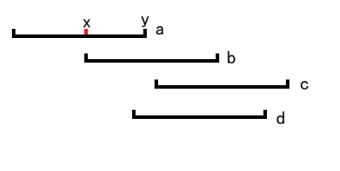
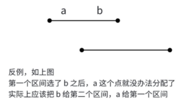

# 贪心策略

贪心算法是从问题的初始状态出发，通过若干次的贪心选择而得到的最优值（或较优值）的一种求解问题策略，即贪心策略。 

换句话说，贪心策略是一种在**每次决策时采取当前意义下最优策略的算法**，做出的选择只是在某种约束条件下的**局部最优解**或**较优解**，并不一定是全局的最优解或较优解。不过，某些特定的问题是可以利用贪心算法求得其最优解或较优解的。

> 1. 把解决问题的过程分成若干步。
> 2. 解决每一步时，都选择“当前看起来最优的”解法。
> 3.  “希望”得到全局的最优解。 

通过几个案例就能体会贪心策略的应用：

* 例子1：买东西时，用50元买了4元的商品，找零46元，有`{20,10,5,1}`的面值的货币，用最少的张数完成找零工作。

  解决这个问题，钱币肯定一张一张的选，每次根据找零的钱都选面值最大的，所以找了两张20。后还剩6，选了一张5；最后剩了1元，选了一张1，所以最优解是4张。其中每一步都用到了从当时的角度看最优的策略，最后转换成了全局最优解。

  > 尝试证明：
  >
  > 假设零钱的面值有`{20,10,5,1}`，假设最优解`{A,B,C,D}`，可以知道$B\leq 1$，$C\leq 1$，$D\leq 4$。
  >
  > 用反证法证明$B\leq 1$即最优解正确：假设$B>1$，因为有面值20的存在，所以可以用面值20的币替换。当$B$为奇数时，至少保留1张，其他都被替换；当$B$为偶数时，全部都能被替换。所以$B$只能是0和1。
  >
  > 同理$C\leq 1$，$D\leq 4$也能用反证法证明。
  >
  > 然后就是证明贪心解正确。假设面值`{20,10,5,1}`的币分别选择了`{a,b,c,d}`，接下来只需要证明`a==A`、`b==B`、`d==C`、`d==C`就能证明贪心策略。
  >
  > 证明`a==A`：假设要凑的面值是$x$，贪心策略是若能用20去凑就尽量去凑，所以$a\geq A$。
  >
  > 根据上面的推理，若B、C、D全都取最大值，则可以凑最大值19，而$a>A$表示最优解用的20比较少，贪心解用的20多，少的部分需要用$B$、$C$、$D$来凑。所以$B$、$C$、$D$无法凑出20，所以$a=A$正确。
  >
  > 同理也可证明其他三个等式。

* 例子2：

  最大路径和。找出一条路径，使其从左下角至右上角所经过的权值之和最大。

  

  若按贪心算法求解,所得路径为：$1\rightarrow3\rightarrow4\rightarrow6$。 若按动态规划求解，所得路径为：$1\rightarrow2\rightarrow10\rightarrow6$。 显然,这里用贪心算法求解,得到的并不是问题的最优解。

* 例子3：田忌赛马。这个策略也可以算是贪心策略的应用，先将对手的马和自身的马分别排序，用自身最弱的马消耗掉对手的所有比自己的马强的马，为最终的胜利做铺垫。

贪心、搜索和动态规划都是求最优解问题最常用的三个思路。很多有固定思路的算法比如图的dijistra算法（求最短路径）、最小生成树的prim算法等都用到了贪心策略。而且很多时候是间接用到贪心策略，贪心策略并不存在固定的算法思路。

但贪心类的题又都是两个极端，无论做多少道贪心的题，都有可能无法解决新的题。对这类题的建议是：

1. 平时练习时能证明设计的贪心策略正确，就尽量证明。
2. 比赛时能想出来就是赢，在保证时间富裕的情况下再尝试证明。

因为贪心算法的界限模糊，这里也只是总结某些特定问题的经验。部分结论会尝试证明。

# 若干点到某点的距离和最小问题

在做贪心策略有关的题时，很多时候都是能过就行，并不怎么关心这个贪心策略是否正确。所以后面的题很多都是能证明就证明，不能就直接记结论。

## 货仓选址 - 洛谷

[P10452 货仓选址 - 洛谷](https://www.luogu.com.cn/problem/P10452)

直接说结论：

1. 将所有商店在数轴上的位置进行排序。
2. 将货仓建在中位数即可。

[P10452 货仓选址 - 洛谷](https://www.luogu.com.cn/problem/P10452)参考程序：

```cpp
#include <bits/stdc++.h>
using namespace std;

int main() {
	int n = 0;
	cin >> n;
	vector<int>a(n + 1, 0);
	for (int i = 1; i <= n; i++) 
		cin >> a[i];
	sort(a.begin() + 1, a.end());

	unsigned long long res = 0;
	for (int i = 1; i <= n; i++) {
		res += abs(a[i] - a[(n + 1) / 2]);
	}
	cout << res << endl;
	return 0;
}
```

## 原理：绝对值三角不等式

在高中数学的不等式选修，有这样一个定理：

若$a$、$b$、$c$是实数，那么$|a-c|\leq |a-b|+|b-c|$。

具体证明用到另一个绝对值不等式$|a+b|\leq |a|+|b|$，即$|a-c|=|(a-b)+(b-c)|\leq |a-b|+|b-c|$。

这里主要关心这个不等式的几何含义：

$|a-c|$表示$a$和$c$在数轴上的距离。假设$a<c$，


所以$b$取$[a,c]$之中的任意一点时，$|a-b|+|c-b|$最小，即$a$和$c$到$b$的距离和最小。

利用绝对值三角不等式，再来看[P10452 货仓选址 - 洛谷](https://www.luogu.com.cn/problem/P10452)。

这个OJ可以转化成求$\Sigma_{i=1}^n|a_i-x|$的最小值问题，$x$是货仓的位置。

将这个等式展开：

$$\Sigma_{i=1}^n|a_i-x|=|a_1-x|+|a_2-x|+\cdots+|a_i-x|$$
$$=(|a_1-x|+|a_i-x|)+(|a_2-x|+|a_{i-1}-x|)+\cdots+(|a_{i+1-\frac{i}{2}}-x|+|a_{\frac{i}{2}}-x|)$$
$$\geq |a_1-a_i|+|a_2-a_{i-1}|+\cdots+|a_{i+1-\frac{i}{2}}-a_{\frac{i}{2}}|$$

假设$x\in [a_{i+1-\frac{i}{2}},a_{\frac{i}{2}}]$，根据绝对值三角不等式，
$(|a_{i+1-\frac{i}{2}}-x|+|a_{\frac{i}{2}}-x|)$可以取得最小值$|a_{i+1-\frac{i}{2}}-a_{\frac{i}{2}}|$。

而其他式子例如$(|a_1-x|+|a_i-x|)$，因为$x\in [a_{i+1-\frac{i}{2}},a_{\frac{i}{2}}]$，$[a_{i+1-\frac{i}{2}},a_{\frac{i}{2}}]\subset [a_1,a_i]$，所以$(|a_1-x|+|a_i-x|)$也能取得最小值$|a_1-a_i|$。其他区间也是如此。

所以可以把货仓建在所有仓库的位置的中位数，此时要求的距离和最短。

* 当$n$为偶数时，中位数有两个，取哪一个都行。

* 当$n$为奇数时，只能取中间的那个。

所以对所有情况，直接取$\frac{n+1}{2}$即可。

当然，也可以用结论

$\Sigma_{i=1}^n|a_i-x|$$\geq |a_1-a_i|+|a_2-a_{i-1}|+\cdots+|a_{i+1-\frac{i}{2}}-a_{\frac{i}{2}}|$
来计算这个最小距离和。

参考程序：

```cpp
#include <bits/stdc++.h>
using namespace std;

int main() {
	int n = 0;
	cin >> n;
	vector<int>a(n + 1, 0);
	for (int i = 1; i <= n; i++)
		cin >> a[i];
	sort(a.begin() + 1, a.end());

	unsigned long long res = 0;
	for (int i = 1, len = (n + 1) / 2; i <= len; i++) {
		res += abs(a[i] - a[n + 1 - i]);
	}
	cout << res << endl;
	return 0;
}
```

后面的贪心策略有时会忽略证明，但针对特定问题都是有各自的发挥的，所以结论直接用即可。而且在正经比赛中，想到这个策略并实现已经很不容易了，几乎没有余力去证明，所以证明一般在平时训练时培养思维即可。

## 糖果传递

[1432：糖果传递](http://ybt.ssoier.cn:8088/problem_show.php?pid=1432)

[P2512 [HAOI2008\] 糖果传递 - 洛谷](https://www.luogu.com.cn/problem/P2512)

每个人的糖果可以来自左边，也可以来自右边，也可以把自己的糖果给左边或给右边。为方便求最小代价，规定所有人都给自己右手边的人糖果。

设$\overline{v}$表示最终所有人手上有的糖果数，也就是平均数，$x_l$表示从左边的人得到的糖果数，$x_r$表示给右边的人的糖果数。则$\overline{v}=a_i+x_l-x_r$，$x_r=x_l+(a_i-\overline{v})$。

所以根据$x_r=x_l+(a_i-\overline{v})$，可以得到所有人将糖果给右手边的人的过程中付出的总代价。

因为$x_l$也表示第$i$个人从左手边的人得到的糖果数，这个糖果数也是这个左手边的人给右手边的人的糖果数，所以可以设$x_i$表示第$i$个人给右边的人的糖果数，大于0则是给予，小于0则是索取。则问题转化成求$\Sigma_{i=1}^{n}|x_i|$的最小值。

例如测试样例`{1,2,5,4}`，不难看出这组样例的$\Sigma_{i=1}^{n}|x_i|$的最小值为$|0|+|-1|+|1|+|2|=4$。

根据以上分析，得到如下递推式：

$x_1=x_n+(a_1-\overline{v})$，
$x_2=x_1+(a_2-\overline{v})$，
$\cdots$
$x_n=x_{n-1}+(a_n-\overline{v})$，

但问题出在这$n$个递推式中的$x_1$到$x_n$都是未知数，要如何通过这$n$个递推式求得最终的$\Sigma_{i=1}^{n}|x_i|$的最小值。

如果只看$x_2$到$x_n$的构成，可以发现他们和$x_1$的联系：

$x_1=x_1+0$，
$x_2=x_1+(a_2-\overline{v})$，
$x_3=x_1+(a_2-\overline{v})+(a_3-\overline{v})$，
$\cdots $
$x_n=x_1+\Sigma_{i=1}^n(a_i-\overline{v})$，

则$\Sigma_{i=1}^{n}|x_i|$又转化成了求$\{0,(a_2-\overline{v}),((a_2-\overline{v})+(a_3-\overline{v})),\cdots,\Sigma_{i=1}^n(a_i-\overline{v})\}$这个集合中的点到$x_1$的距离和（$x_1$可以为负数）。

> 数学表达式是这样的，只要拿推出来的公式去AC就可以了，但证明过程要考虑的就多了，比如上下逻辑连贯、怎么从上面推导下面。
>
> 而且最后推出来的公式怎么看都和题意没什么关系，但就是能得出正确结果。

所以这个题和货仓选址是一个题型，但麻烦的是中间的分析过程。$x_1$的值在求$\Sigma_{i=1}^{n}|x_i|$时也不再重要，因为绝对值不等式会将它给优化掉。

到这里可以给出解题思路。

1. 在读取数据后，给出另一个数组`tmp[i]`（临时数组），利用递归式`tmp[i]=tmp[i-1]+(a[i]-v)`和`tmp[1]=0`存储$x_n=x_1+\Sigma_{i=1}^n(a_i-\overline{v})$中的$\Sigma_{i=1}^n(a_i-\overline{v})$的结果。
2. 对`tmp`数组进行排序。利用绝对值不等式的结论求最小值。可以用中位数，也可以用首尾相减。

因为很多题解都是用的中位数，这里为了和别人不一样，使用了首尾相减。

[1432：糖果传递](http://ybt.ssoier.cn:8088/problem_show.php?pid=1432)参考程序：

```cpp
#include <bits/stdc++.h>
using namespace std;

typedef long long ll;

void ac(){
	int n;cin>>n;
	vector<ll>a(n+1,0);
	ll v=0;
	for(int i=1;i<=n;i++){
		cin>>a[i];
		v+=a[i];
	}
	v/=n;//求平均数 
	vector<ll>tmp(n+1,0);
	for(int i=1;i<=n;i++){
		tmp[i]=tmp[i-1]+(a[i]-v);//预处理\Sigma_{i=1}^n(a_i-v) 
	}
	sort(tmp.begin()+1,tmp.end());
	
	ll sum=0;
	for(int i=1;i<=(n+1)/2;i++){//首尾相减 
		sum+=abs(tmp[i]-tmp[n+1-i]);
	}
	cout<<sum;
}

int main() {
	ac();
	return 0;
}
```

# 交换论证法

## 纪念品分组NOIP 2007

[P1094 [NOIP 2007 普及组\] 纪念品分组 - 洛谷](https://www.luogu.com.cn/problem/P1094)

例如样例，进行排序后变成

```
90 90 80 70 60 50 30 20 20
```

从人的视角看，可以分成6组：`{90}`、`{90}`、`{80,20}`、`{70,30}`、`{60,20}`、`{50}`，

即找最匹配的。但这是数据量比较小的情况，可以肉眼识别，但数据量比较大就得依赖计算机，而且计算机需要一个统一的算法才能处理这些数据。

所以可以尝试，较小的数尽可能匹配一个较大的数，除非数太大只能单独放比如这里的90。

贪心策略：

$x+y\leq w\rightarrow$放一起。

$x+y> w\rightarrow x$单独放，$y$等待下一轮分配。

这一过程可以通过双指针模拟实现。设开始时`l=1`，`r=n`。

首先用排序进行预处理。然后双指针从两头开始枚举物品，每完成一次循环相当于找到了一组物品。

* 当`a[l]+a[r]<=w`时，`l++,r--`，相当于两件物品同时选上。
* 当`a[l]+a[r]>w`时，说明大的那件物品太大，于是代表大的那件物品的指针改变即可。
* 当`l==r`时，说明只剩下一件物品，无论什么判断结果都会终止程序进行。


参考程序：

```cpp
#include <bits/stdc++.h>
using namespace std;

void ac() {
	int w, n; cin >> w >> n;
	vector<int>a(n + 1, 0);
	for (int i = 1; i <= n; i++)
		cin >> a[i];
	sort(a.rbegin(), a.rend() - 1);
	int l = 1, r = n;
	int cnt = 0;
	while (l <= r) {
		++cnt;
		if (a[l] + a[r] <= w) {
			l++; r--;
		}
		else
			l++;//降序排序，所以
	}
	cout << cnt << endl;
}

int main() {
	ac();
	return 0;
}
```

## 交换论证法证明贪心策略

交换论证法：设贪心解的步骤分成`{a,b,c,d}`，假设最优解的步骤是b、a、c、d，若能**在最优解不失去最优性的前提下**，**将策略逐步调整成贪心策略**，则可以认为最后的贪心策略就是最优解。

应用的话就是假设一个解时最优解，然后逐步调整成贪心策略。

在这里就是区间内，假设两指针`l`和`r`外的情况都已经考虑，只考虑`[l,r]`内部的情况，发现贪心解和原定最优解不一样，则看看能不能将原定最优解调整成贪心解。

首先是贪心策略（设$x>y$，在代码中通过降序排序实现）：

* $x+y\leq w\rightarrow$放一起。
* $x+y> w\rightarrow x$单独放，$y$等待下一轮分配。

然后是理想中的最优解：

1. $x+y>w$，则最优解是$x$单独放，$y$继续等待下一个更匹配的$x_2$。

2. $x+y\leq w$，则最优解有4种情况：

   * $x$和$y$单独放。这种情况下只会使分组的组数增多，所以不是最优选择，因此不可选。
   * 假设在$[x,y]$中另外找到两个物品$n$和$m$，$x<n\leq m<y$，则理想中的最优解是$x+m\leq w$，即$x$和$m$放一组；同理$y+n\leq w$，$y$和$n$放一组。
     之后就是看这组最优解能否调整成已有的贪心策略。
     数学上的分析容易看出$x+m\leq w$，$y+n\leq w$，交换$m$和$y$得到
     $x+y\leq w$和$n+m\leq w$，根据前提可知$x+y\leq w$正确，而$n+m\leq w$是否正确还有待商议。
     通过不等式的传递性可以得到$n+m\leq n+y\leq w$或$n+m\leq x+m\leq w$，所以交换后也能成立，此时这个最优解被调整成了贪心策略。
     也不用担心$m$和$n$不被选上，在枚举的过程中$(x,y)$自然会变成$(n,m)$。
   * $x$单独放，则$y$需要找另一个物品进行配对。假设$y$和$n$配对，$x<n<y$，则$n+y\leq w$。
     这种最优解调整成贪心解只需要将$x$和$n$的位置调换即可。
   * $y$单独放，和$x$单独放一样的情况。

综上，最优解可被逐步调整成贪心策略，所以这个贪心策略是正确的。

# 堆的应用

堆是完全二叉树中，所有父结点和子结点都满足某种规律（比如父结点大于等于子结点等）的一种情况。

堆在贪心算法中的应用主要有2个方面：

1. 辅助排序。特别是需要**频繁插入**数据、**频繁取出**带有极值属性（例如最大、最小）的数据的操作。
2. 哈弗曼编码。

关于堆这种数据结构，详细见[二叉树的顺序结构和堆的概念及结构](https://blog.csdn.net/m0_73693552/article/details/143698158)和[用数组实现两种堆](https://blog.csdn.net/m0_73693552/article/details/143720137)。

在平时可直接用优先队列`priority_queue`模拟。

## 哈夫曼树和哈夫曼算法

从树的根到任意结点的路径长度与该结点上权值的乘积，称为该结点的带权路径长度。

树中所有叶结点的带权路径长度之和称为该树的带权路径长度，记为

$WPL = \sum_{i = 1}^{n} w_{i}l_{i}$

其中，$w_{i}$ 是第$i$个叶结点所带的权值，$l_{i}$是该叶结点到根结点的路径长度。

例如这个树的最小带权路径长度： 


在含有$n$个带权叶结点的二叉树中，其中带权路径长度最小的二叉树称为哈夫曼树，也称最优二叉树。 

哈夫曼算法是哈夫曼树的构建过程，是根据**贪心策略**得到的算法。

主要流程为： 

1. 初始化：将所有叶子结点看做一棵裸树，那么刚开始有一片森林。

2. 贪心：每次选择**根节点权值最小的两棵树**作为左右子树合并成一棵新的二叉树，这棵新的二叉树根节点的权值为左右子树的权值之和； 

3. 重复 2 过程，直到森林中所有的树合并成一棵树。 


在构建哈夫曼树的合并操作中，就可以计算出带权路径长度：

- 在合并的过程中，每一棵树的根节点的权值其实等于该树所有叶子结点的权值之和； 

- 在每次合并的时候，由于多出来两条路径，此时**累加上左右子树的根节点权值**，相当于计算了一次叶子结点到这两条路径的长度； 

- 每次合并都把左右子树的权值累加起来，就是最终的带权路径长度。 

例如这个树的最小带全路径长度：


$WPL=1\times 3+2\times 3+3\times2+4\times2+5\times2$
			$=1+1+1+2+2+2+3+3+4+4+5+5$
			$=(1+2)+((1+2)+3)+(4+5)+(1+2+3)+(4+5)$
			$=1+2+3+3+4+5+6+9$
			$=33$

其中$1+2+3+3+4+5+6+9$即为每次合并时被累加的根结点权值。

叶结点1和叶结点2合并为子树根结点3时，相当于离真正的根结点15多了1条路径，2个权值为3的结点合并时，叶结点1和叶结点2又相当于多了1条路径，算下来相当于累加了2条，另一个叶结点3也算是增加了1个结点。以次类推，**每次产生子树合并时叶结点到根结点的路径都会增加**1。

## 证明哈夫曼算法的结论

首先证明一个结论：带权路径长度最小的树中，权值最小的两个叶结点，一定会在深度最深的位置上，并且可以调整成左、右兄弟。

用反证法证明：
假设带权路径长度最小的树中，权值最小的两个叶结点，不在最深的位置上，且不可通过调整变为兄弟结点。

反例1：


因此最小的2个叶结点不在深度最深的位置上时，可通过调整到最深使总的带权路径长度减小，不符合此树的带权路径长度最小的特性。

反例2：


假设最小权值的2个叶结点$a$、$b$在同一层，且不互为兄弟结点，则通过交换结点$b$、$c$让$a$、$b$互为兄弟结点时，带权路径长度并没有发生变化，说明可以调整，与假设的结论矛盾。

综上，结论正确，证毕。

然后通过这个引理证明最优二叉树的构建过程正确。

数学归纳法：

1. 当$n=2$时，只有2个结点，合并后确实为最优二叉树，所以结论成立。

2. 假设$n=k$时，哈夫曼算法能得到最优二叉树，

   当$n=k+1$时，根据引理，可以拿出2个权值最小的结点先合并，此时少一个结点变成了$k$个结点，多了一个子树。

   因为$n=k$时结论正确，所以$n=k+1$也是正确，到这里就证明完毕。

## 模版题哈夫曼编码、合并果子

哈夫曼编码是一种被广泛应用而且非常有效的数据压缩编码，其构造步骤如下：

1. 统计待编码的序列中，每一个字符出现的次数；
2. 将所有的次数当成叶结点，构造哈夫曼树；
3. 规定哈夫曼树的左分支为 \(0\)，右分支为 \(1\)，那么从根节点走到叶子结点的序列，就是该叶子结点对应字符的编码。

哈夫曼编码的内容肯定不止这些，这里只关心和算法有关的部分即哈夫曼编码的构造。

[【模板】哈夫曼编码](https://ac.nowcoder.com/acm/problem/233601)

[P1090 [NOIP 2004 提高组\] 合并果子 - 洛谷](https://www.luogu.com.cn/problem/P1090)

这2个题看上去不一样，但其实是同一个题。

以哈夫曼编码的模板题为例，求的最短长度实际是每个字符通过哈夫曼编码后的二进制数，将这些二进制数拼接在一起，最终的字符串长度。

这个长度可以通过字符的权值乘引用的次数得到。实际上从根结点走到某个叶结点的长度即为每个二进制数的长度，也就是说最小的长度其实就是哈夫曼树的带权路径长度。

因为哈夫曼树的构建过程需要频繁地插入、删除根结点，因此可以用堆来辅助排序。

```cpp
#include<bits/stdc++.h>
using namespace std;
typedef long long ll;
int main(){
    priority_queue<ll>q;
    int n;
    cin>>n;
    while(n--){
        ll t;cin>>t;
        q.push(-t);
    }
    ll sum=0;
    while(q.size()>1){
        ll a=-q.top();q.pop();
        ll b=-q.top();q.pop();
        sum+=a+b;
        q.push(-(a+b));
    }
    if(sum==0&&q.size()==1)
        sum+=-q.top();
    cout<<sum;
    return 0;
}
```


## 书架

[1228：书架](http://ybt.ssoier.cn:8088/problem_show.php?pid=1228)

奶牛换成别的垫脚的东西就很好理解了。尽可能选择数量大的垫脚方块即可。可以用排序，也可以用堆。这里用堆。

```cpp
#include<bits/stdc++.h>
using namespace std;

int main() {
	int n, b;
	cin >> n >> b;
	priority_queue<int>pq;
	for (int i = 1; i <= n; i++) {
		int x;
		cin >> x;
		pq.push(x);
	}
	int cnt = 0;
	while (b > 0 && pq.size()) {
		b -= pq.top();
		++cnt;
		pq.pop();
	}
	cout << cnt;
	return 0;
}
```

## 数列极差

[1427：数列极差](http://ybt.ssoier.cn:8088/problem_show.php?pid=1427)

对于最大值来说，每次合并较小的两个数，使得大的数尽量在后面被处理，这样乘的时候大的数会被多次放大。

而对于最小值，可能相反，每次合并较大的两个数，这样大的数被较早处理，从而整体结果较小。

参考程序：

```cpp
#define _CRT_SECURE_NO_WARNINGS 1

#include<iostream>
#include<vector>
#include<queue>
using namespace std;
priority_queue<int, vector<int>, less<int> >qb;//大根堆
priority_queue<int, vector<int>, greater<int> >qs;//小根堆

int main() {
	int n, tm;
	cin >> n;
	for (int i = 0; i < n; i++) {
		cin >> tm;
		qb.push(tm);
		qs.push(tm);
	}
	while (qb.size() > 1 && qs.size() > 1) {
		int a, b;
		a = qb.top();qb.pop();
		b = qb.top();qb.pop();
		qb.push(a * b + 1);
		a = qs.top(); qs.pop();
		b = qs.top(); qs.pop();
		qs.push(a * b + 1);
	}
	cout << (qs.top() - qb.top());
	return 0;
}
```

## 钓鱼（贪心模拟）

[1431：钓鱼](http://ybt.ssoier.cn:8088/problem_show.php?pid=1431) 

[P1717 钓鱼 - 洛谷](https://www.luogu.com.cn/problem/P1717)

题目大意：有$n$个湖在一条直线上，人只能从第1个走到其他湖。每个湖随着钓鱼次数增多，能钓的鱼逐渐减少，不钓鱼的话湖一直保持原状。问怎么分配有限的时间才能得到最多的鱼。

不管之前的钓鱼时间如何分配，每次**选择当前能钓到最多鱼的湖**去钓一次。这样总的结果会最优。因为每个选择，都取当前剩余时间中可以获得最大鱼的湖。

所以模拟最优解的步骤：人钓完一次鱼，湖的可上钩的鱼不如其他的湖，则人走到其他湖再钓鱼，钓完后可上钩的鱼不如其他的湖时，再去其他湖，一直重复这个步骤，直到时间用完。这样就能得到最多的鱼。

但实际是在一个湖钓鱼钓到一定次数后，前往下一个湖继续钓，因为湖之间有距离，需要尽可能减少赶路的耗时。

所以可以尝试枚举要进行钓鱼的湖，将所有湖能钓到的鱼放到大根堆中，然后依次选择堆顶的数据进行统计，统计完后将数据处理后，再插回堆中，重复这个步骤，直到时间用完或湖都被竭泽而渔。

参考程序：

```cpp
#ifndef _CRT_SECURE_NO_WARNINGS
#define _CRT_SECURE_NO_WARNINGS 1
#endif

#include<bits/stdc++.h>
using namespace std;

int main() {
	int n;
	cin >> n;
	int H;
	cin >> H;
	vector<int>F(n + 1, 0);//每个湖第1个5分钟能钓的最大钓鱼数
	vector<int>D = F;//每钓1个5分钟能钓的最大值减少的数量
	vector<int>T(n, 0);//i湖到i+1湖用时

	for (int i = 1; i <= n; i++)
		cin >> F[i];
	for (int i = 1; i <= n; i++)
		cin >> D[i];
	for (int i = 1; i <= n - 1; i++)
		cin >> T[i];

	vector<int>times(n + 1, 0);
	for (int i = 2; i <= n; i++) //计算从第1个湖走到i的时间
		times[i] = times[i - 1] + T[i - 1];
	
	int ans = 0;
	for (int i = 1; i <= n; i++) {//只在前i个湖钓鱼的情况
		int used = H * 60 - times[i] * 5;//可用来钓鱼的时间
		if (used / 5 <= 0)//时间不够了就不钓
			continue;

		priority_queue<pair<int, int> >pq;
		for (int j = 1; j <= i; j++)//枚举所有的湖，将能钓的最大数量放到堆中
			if (F[j] >= 1)
				pq.push({ F[j],D[j] });

		//模拟理想的钓鱼流程
		int total = 0, cnt = 0;
		while (cnt < used / 5 && pq.size()) {
			int fish = pq.top().first,
				d = pq.top().second;
			pq.pop();
			total += fish;
			++cnt;
			if (fish - d > 0)
				pq.push({ fish - d,d });
		}
		ans = max(ans, total);
	}
	cout << ans;
	return 0;
}
```


# 区间问题

区间问题面对的对象是若干个区间，让我们在每个区间上做出取舍。  

这种题目的解决方式一般就是**按照区间的左端点或者是右端点排序**，然后在排序之后的区间上，根据题目要求，制定出相应的贪心策略，进而得到最优解。  

具体是根据左端点还是右端点排序？升序还是降序？一般是假设一种排序方式，并且制定贪心策略，当没有明显的反例时，就可以尝试去写代码。


## 选择不相交区间问题

给定$n$个开区间$(a_i,b_i)$，选择尽可能多的区间，使得这些区间两两没有公共点。

固定思路：所有区间按照结束时间$b_i$进行排序，依次分析各个区间是否可选。若某个区间没有和已选的区间重叠，则选这个区间，否则就不选。

这样可以使第1个区间尽可能的小，遇到重叠的区间时能选择更多的区间。

这4个OJ本质是同一个题：

[1422：【例题1】活动安排](http://ybt.ssoier.cn:8088/problem_show.php?pid=1422) 

[1429：线段](http://ybt.ssoier.cn:8088/problem_show.php?pid=1429)

[1323：【例6.5】活动选择](http://ybt.ssoier.cn:8088/problem_show.php?pid=1323)

[P1803 凌乱的yyy / 线段覆盖 - 洛谷](https://www.luogu.com.cn/problem/P1803)

对区间按照右端点进行排序，然后逐一枚举区间看区间是否和已选的区间冲突。

例如样例：

```
4
1 3
4 6
2 5
1 7
```

用时间轴看会更直观：


但要注意，端点相等时有的题将它判断成重叠，而有的则不判断成重叠，需要根据题意做判断。

统一参考程序：

```cpp
#include<iostream>
#include<vector>
#include<algorithm>
#include<cmath>
#include<set>
#include<map>
using namespace std;

vector<pair<int,int> >a;

void ac1() {
	int n;
	cin >> n;
	a.resize(n + 1, { 0,0 });
	for (int i = 1; i <= n; i++)
		cin >> a[i].second >> a[i].first;//sort对pair排序时默认选first作为比较单元
	sort(a.begin() + 1, a.end());
	int cnt = 1, le = a[1].first;
	for (int i = 2; i <= n; i++) 
		if (a[i].second >= le) {
			++cnt;
			le = a[i].first;
		}
	cout << cnt;
}

int main() {
	ac1();
	return 0;
}
```

证明可以用反证法，可以用交换论证法。

这里用交换论证法：

这里的贪心策略分2种情况：

1. 排序后，其中2个区间$a$、$b$不重叠，则2个都要选。
2. 排序后，其中2个区间$a$、$b$重叠，则选右端点最小的那个区间。

尝试调整最优解：

1. 俩区间不重叠且之前已选的区间和当前区间无关：`__a__ __b__`。

   * 假设不选$a$，则会出现$a$与后续区间不重叠，但$b$与后续区间重叠的情况，这总情况下会少选很多区间，不再是最优解，因此不可选。

     

   * 假设选$a$，则$b$选与不选又是2种情况。假设不选$b$，而是选下1个和$a$相互独立的区间，则可能出现少选的情况。例如这种：

     

     选$b$的下一个区间，则因为这个区间和$c$重叠，只能选2个，而选$b$的话能选$a$、$b$、$c$三个，以及和$b$的下一个区间彼此独立的区间。

   因此2个区间独立的话都要选，贪心解成立。

2. 俩区间重叠。假设$a$的右端点小于$b$的右端点，选$b$的话会使选择的区间减少。因此不可选。

   

综上，贪心策略正确。

## 区间选点问题

给定$n$个闭区间$[a_i, b_i]$，在数轴上选尽量少的点，使得每个区间内都至少有一个点（不同区间内含的点可以是同一个）。 

首先按照区间的结束位置从小到大排序。然后从区间1到区间$n$进行选择：对于当前区间,若集合中的数不能覆盖它，则将区间末尾的数加入集合。 贪心策略:取最后一个。

如图，若选1位置的点，则移动到2位置。


OJ：[1423：【例题2】种树](http://ybt.ssoier.cn:8088/problem_show.php?pid=1423)  

[P1250 种树 - 洛谷](https://www.luogu.com.cn/problem/P1250)

一棵树给多个区间使用，所以在重叠区域种树。

思路：

1. 先按结束位置快速排序。 
2. 对每个区间依次处理。  
   a. 从前到后扫描这个区间，统计已选点的个数。  
   b. 若已选点的个数超过了要求的点数，则`continue`。  
   c. 否则从该区间由后向前扫描，添加缺少的覆盖点，用`ans`记录。 
3. 输出`ans`。

参考程序：

```cpp
#ifndef _CRT_SECURE_NO_WARNINGS
#define _CRT_SECURE_NO_WARNINGS 1
#endif

#include<iostream>
#include<vector>
#include<algorithm>
#include<cmath>
#include<set>
#include<map>
using namespace std;
/*
http://ybt.ssoier.cn:8088/problem_show.php?pid=1423
对区间进行排序，然后进行选择。
*/
struct Area {
	int b; int e; int t;
	Area(int _b=0,int _e=0,int _t=0):b(_b),e(_e),t(_t){}
};
vector<Area>a;
vector<bool>used;//指定地皮用过没

void ac1() {
	int n, m;
	cin >> n >> m;
	a.resize(m + 1, Area());
	used.resize(n + 1, 0);
	for (int i = 1; i <= m; i++)
		cin >> a[i].b>>a[i].e>>a[i].t;
	sort(a.begin() + 1, a.end(), [&](auto &a, auto &b) {return a.e < b.e; });//lambda函数

	int ans = 0;
	for (int i = 1; i <= m; i++) {
		int cnt = 0;
		for (int j = a[i].b; j <= a[i].e; j++)//统计用过的地皮
			if (used[j]) ++cnt;
		if (cnt >= a[i].t) continue;//之前的居民种的树满足现在居民的需求
		for (int j = a[i].e; j >= a[i].b&&cnt<a[i].t; j--) {//不满足自己再种
			if (!used[j]) {
				used[j] = 1;
				ans++;
				++cnt;
			}
		}
	}
	cout << ans;
}

int main() {
	ac1();
	return 0;
}
```

## 区间覆盖问题

给$n$个闭区间$[a_i, b_i]$，选择尽量少的区间覆盖一条指定的线段区间`[left,right]`。 

1. 将所有的区间按左端点从小到大排序，依次处理每个区间。
2. 每次选择覆盖了点`left`的区间中右端点坐标最大的一个（固定`left`，更新`right`），并将`right`更新为该区间的右端点坐标，同时再将`left`更新为新的`right`，并重复相同的步骤。直到选择的区间已包含了$t$为止。 贪心策略：在某个时刻的`left`，找一个满足`a[i]<=left`的`b[i]`最大值即可。

OJ：[1424：【例题3】喷水装置](http://ybt.ssoier.cn:8088/problem_show.php?pid=1424) 

虽然喷水范围是圆形，但是如果计算圆形的面积的话会产生无法覆盖的死角，然后不知道出题人怎么想的，为了不计算死角，于是直接计算圆内矩形的长作为区间的两个端点，也就是设置区间的左、右端点为$x\pm\sqrt{r^2-(\frac{W}{2})^2}$，还没给提示。虽然能理解如果考虑两个圆在矩形内相交会更合理，但整个题的思路变了。

总之这个OJ的思路：

1. 找到合理的喷头，并将喷头转换成区间$[x-\sqrt{r^2-(\frac{W}{2})^2},x+\sqrt{r^2-(\frac{W}{2})^2}]$并将端点值保存在数组中。
2. 对数组的每个元素，按左端点进行排序。
3. 按照上文描述的区间覆盖的贪心策略去枚举区间。

参考程序：

```cpp
#ifndef _CRT_SECURE_NO_WARNINGS
#define _CRT_SECURE_NO_WARNINGS 1
#endif

#include<iostream>
#include<vector>
#include<algorithm>
#include<cmath>
#include<set>
#include<map>
using namespace std; 

struct Area {
	double x; double y;
	Area(double _x=0,double _y=0):x(_x),y(_y){}
};
vector<Area>a;

void ac1() {
	int T;
	cin >> T;
	while (T--) {
		int n;
		double L, W;
		cin >> n >> L >> W;
		a.push_back(Area());//插入匿名对象使数组下标从1开始

		for (int i = 1; i <= n; i++) {
			double x, r;
			cin >> x >> r;
			if (r <= W / 2.0) continue;//舍弃无法覆盖矩形的喷头
			//指定可用喷头的覆盖区间
			a.push_back(Area(x - sqrt(r * r - W * W / 4.0), 
				x + sqrt(r * r - W * W / 4.0)));
		}

		//按照区间的左端点升序进行排序
		sort(a.begin() + 1, a.end(), 
			[&](Area& a, Area& b) {return a.x < b.x; });

		//枚举区间
		double right = 0;//右端点会随着寻找的区间进行更新
		int ans = 0;//统计能用的喷头数
		while (right < L) {
			++ans;
			double left = right;//固定左端点，双指针

			//每一轮都会尝试找更长的区间
			for (int i = 1; i < a.size() && a[i].x <= left; i++)
				if (right < a[i].y) right = a[i].y;//区间覆盖范围更大就更新右端点

			if (left == right && left < L) {//没更新过说明找不到合适的区间了
				ans = -1;
				break;
			}
		}
		cout << ans<<endl;
		a.clear();
	}
}

int main() {
	ac1();
	return 0;
}
```

## 重叠区间数

[UVA1193 Radar Installation - 洛谷](https://www.luogu.com.cn/problem/UVA1193)

> 首先想到的是二维平面的暴力枚举：在$x$轴上枚举所有的点位，求其他点到这个点的距离，很显然不合理。

因为雷达只能装在$x$轴上，所以每个岛可以根据雷达覆盖半径，计算出在$x$轴的哪个区间安装雷达时才可以检测出本岛。

当所有岛屿都有专属的区间时，找重叠组数最多的区间，在这个区间安排雷达可以做到一个雷达检测多个岛。

如图：


假设岛屿的位置是$(x_i,y_i)$，雷达的检测半径是$d$，则$l=\sqrt{d^2-y_i^2}$，为了监测岛屿，雷达可安排区间是$(x_i-l,x_i+l)$。

当$y_i>d$时，在$x$轴上安装雷达无法监测该岛，此时应直接返回-1。

此时就将问题转换成了枚举重叠区间数的问题。

贪心策略：

1. 根据左端点对所有区间进行排序，此时所有互相重叠的区间是连续的。

2. 当两个区间重叠时，选择右端点较小的区间，以这个区间为标准继续寻找重叠区间。

   

   例如区间$a$和$b$重叠，则选择更小的区间$c$，以区间$c$为标准继续向后找。

   当两个区间不重叠时，右端点小的区间进行计数，以第2个区间为标准继续向后找。

```cpp
#include<bits/stdc++.h>
using namespace std;

typedef pair<double, double>pdd;
int press_num;

void ac(int n, int d) {
	vector<pdd>a(n);
	bool flag = 0;
	for (auto& x : a) {
		double xl, xr;
		cin >> xl >> xr;
		if (xr > double(d)) {
			flag = 1;
		}
		x.first = xl - sqrt(double(d) * double(d) - xr * xr);
		x.second = xl + sqrt(double(d) * double(d) - xr * xr);
	}
	if (flag) {
		printf("Case %d: -1\n", ++press_num);
		return;
	}
	sort(a.begin(), a.end());//按照左端点排序
	double r = a[0].second;//固定第1个区间的右端点
	int cnt = 1;//默认至少1个区间
	for (size_t i = 1; i < a.size(); i++) {
		if (a[i].first > r) {
			++cnt;
			r = a[i].second;
		}
		else
			r = min(r, a[i].second);
	}
	printf("Case %d: %d\n", ++press_num, cnt);
}

int main() {
	int n, d;
	while (cin >> n >> d, n && d)
		ac(n, d);
	return 0;
}
```


证明贪心策略正确，只需证明结论“按照左端点排序之后，互相重叠的区域是连续的”即可。

假设$a$、$b$、$c$、$d$是按左端点排序后的区间。$a$、$b$、$d$互相重叠，假设存在一个区间$c$，$a$、$b$和$c$互相不重叠。



1. $c$在区间$(x,y)$左边，因为所有区间经过排序，所以假设不成立。
2. $c$在区间$(x,y)$右边，则区间$d$的左端点只能在$c$的左端点左边或重叠，此时不符合$a$、$b$、$d$互相重叠的结论，所以假设不成立。

综上，使区间互相不连续的区间$c$不存在，结论是正确的。

## 区间的排序方案选择

[P2887 [USACO07NOV\] Sunscreen G - 洛谷](https://www.luogu.com.cn/problem/P2887)

题目给出两种数对：一个是牛能忍受的阳光强度区间，另一个是防晒霜的效果和数量。

两个数对用两个数组存储，但因为排序方式不同，有8种不同的情况。

> 在比赛中遇到的贪心需要根据题意整理出所有贪心策略，一一尝试，直到找到最合适的策略解决问题。

1. 对牛能忍受的阳光强度区间，按**左端点升序**排序。防晒霜**按效果升序**排序分发给牛。


2. 对牛能忍受的阳光强度区间，按**左端点升序**排序。防晒霜**按效果降序**排序分发给牛。



3. 对牛能忍受的阳光强度区间，按**左端点降序**排序。防晒霜**按效果升序**排序分发给牛。


4. 对牛能忍受的阳光强度区间，按**左端点降序**排序。防晒霜**按效果降序**排序分发给牛。


5. 对牛能忍受的阳光强度区间，按**右端点升序**排序。防晒霜**按效果升序**排序分发给牛。


6. 对牛能忍受的阳光强度区间，按**右端点升序**排序。防晒霜**按效果降序**排序分发给牛。


7. 对牛能忍受的阳光强度区间，按**右端点降序**排序。防晒霜**按效果升序**排序分发给牛。


8. 对牛能忍受的阳光强度区间，按**右端点降序**排序。防晒霜**按效果降序**排序分发给牛。


综上，只有第4个和第5个贪心策略可行。即：

* 对牛能忍受的阳光强度区间，按**左端点降序**排序。防晒霜**按效果降序**排序分发给牛。
* 对牛能忍受的阳光强度区间，按**右端点升序**排序。防晒霜**按效果升序**排序分发给牛。

两个贪心策略都可行，这里选择第二种，因为不用写额外的比较用函数。

```cpp
#include<bits/stdc++.h>
using namespace std;

typedef pair<int, int>pii;

void ac() {
	int C, L;
	cin >> C >> L;
	vector<pii>a(C), b(L);
	for (int i = 0; i < C; i++)
		cin >> a[i].second >> a[i].first;
	for (int i = 0; i < L; i++)
		cin >> b[i].first >> b[i].second;
	sort(a.begin(), a.end());
	sort(b.begin(), b.end());
	size_t cnt = 0;
	for (size_t i = 0; i < a.size(); i++) {//对每头牛，选最合适的防晒霜
		int l = a[i].second, r = a[i].first;
		for (size_t j = 0; j < b.size(); j++) {
			int x = b[j].first, &num = b[j].second;
			if (x < l || x > r || !num)//防晒霜不合适或用完则跳过
				continue;
			++cnt;
			--num;
			break;//一头牛只用一种防晒霜
		}
	}
	cout << cnt;
}

int main() {
	int T = 1;
	//cin >> T;
	while (T--)
		ac();
	return 0;
}
```

后用交换论证证明第2个贪心策略是否正确。

贪心策略：对牛能忍受的阳光强度区间，按**右端点升序**排序。防晒霜**按效果升序**排序分发给牛。

假设的最优解：

对某个区间，按照贪心解用防晒霜a，这里假设最优解用b。

1. a在后续不能用上，则可以用a去替换b。

2. a在后续能用上，假设用上a的区间是`[la,ra]`，用上b的区间是`[lb,rb]`，则：

   `lb<=b<=rb`

   `la<=a<=ra`

   `b<=a`

   `rb>=ra`

   根据这4个不等式，可以得到：

   `la<=b<=a<=ra<=rb`，即使不知`la`和`ra`的大小关系，也不影响`a`可以替换`b`。

综上，贪心策略正确。

## 区间问题和堆的综合应用

[P2859 [USACO06FEB\] Stall Reservations S - 洛谷](https://www.luogu.com.cn/problem/P2859)

贪心策略：

对所有牛的产奶时间段表示的区间，按照左端点进行排序。之后给第1头奶牛开始安排牛棚，枚举后面的牛，能安排在已有的牛棚里时就更新牛棚的被占用时间，否则新开一个牛棚。

这题贪心策略不难想，但毕竟是洛谷认证的蓝题，需要处理很多细节：

1. 题目要求列举出所有牛被安排在哪个牛棚，因此**每头牛还多一个原位置的信息**。

2. 枚举牛棚时，又有一个贪心策略：

   尽可能选最早被用完的牛棚，也就是牛棚的信息不仅要有编号，还要有上一头牛产完奶的时刻，即2个变量。

   需要用结构体的同时，还要保证**添加数据后依旧能以最快的速度拿到最快用完的牛棚**，这个策略可以通过堆模拟，此时需要自己构建仿函数，（或）重载`operator<`符号。
   
   否则每新增一个牛棚都要进行一次排序，可能会出现除了1个数据，其他全部有序的情况，每次都挪动所有数据有超时的风险，只有用堆维护才能做到挪动对数级别的数据使新插入的数据归位。

```cpp
#include<bits/stdc++.h>
using namespace std;

void ac() {
	int n;
	cin >> n;
	struct node {
		int l = 0;
		int r = 0;
		int pi = 0;
		node(int _l = 0, int _r = 0, int _pi = 0) {
			l = _l; r = _r; pi = _pi;
		}
		bool operator<(const node& a) const {//为了能以右端点建小堆
			return r > a.r;
		}
	};
	vector<node>a(n + 1, 0);
	for (int i = 1; i <= n; i++) {
		cin >> a[i].l >> a[i].r;
		a[i].pi = i;
	}
	sort(a.begin() + 1, a.end(), [&](node& x, node& y) {return x.l < y.l; });

	priority_queue<node>pq;
	vector<size_t>pos(n + 1, 0);//第i头牛被安排的牛棚编号
	pos[a[1].pi] = 1;
	pq.push(a[1]);

	for (int i = 2; i <= n; i++) {
		if (a[i].l <= pq.top().r) {
			pos[a[i].pi] = pq.size() + 1;
			pq.push(a[i]);
		}
		else {
			pos[a[i].pi] = pos[pq.top().pi];
			pq.pop();
			pq.push(a[i]);
		}
	}
	cout << pq.size() << endl;
	for (size_t i = 1; i <= n; i++)
		cout << pos[i] << '\n';

}

int main() {
	int T = 1;
	//cin >> T;
	while (T--)
		ac();
	return 0;
}
```


# 带限期和罚款的单位时间任务调度

【问题描述】 有$n$个任务，每个任务都需要1个时间单位执行，任务$i$的截止时间$d_i(1\leq d_i\leq n)$表示要求任务$i$在时间$d_i$结束时必须完成，误时惩罚$w_i$表示若任务$i$未在时间$d_i$结束之前完成，将导致$w_i$的罚款。 确定所有任务的执行顺序，使得惩罚最少。 

要使罚款最少，显然应尽量完成`w[i]`值较大的任务。 此时，我们可以将任务按`w[i]`从大到小进行排序，然后按照排好的顺序依次对任务进行安排。
安排的规则为：使处理任务`i`的时间既在`d[i]`之内，又尽量靠后；如果`d[i]`之内的时间都已经排满，就放弃处理此项任务。 

算法证明：假设按照上述算法得到的解不是最优的，那么必然存在某个任务`j`应当安排到处理的过程中，但却没有安排。假设我们要将该任务安排进去，由于在时间`d[j]`内都已经排满，就必然需要将一个已安排的任务`k`与之替换,而`w[k]>=w[j]`。这样，替换显然会增加罚款的数额。因此，除上述安排方法以外的安排方法都不会使罚款的数额减少，可知用上述算法得到的结果是最优的。 

## 朴素解法

1. 先按照罚款数额从大到小快排。
2. 顺序处理每个任务，若能安排，则找一个最晚时间；否则放在最后的空位上。

时间复杂度：$O(n^2)$，部分测试样例可能超时。

OJ：[1426：【例题5】智力大冲浪](http://ybt.ssoier.cn:8088/problem_show.php?pid=1426) 

参考程序：

```cpp
#include<iostream>
#include<vector>
#include<algorithm>
#include<cmath>
#include<set>
#include<map>
#include<queue>
using namespace std;

using namespace std;
vector<pair<int,int> >a;//罚款、截止日期

int main() {
    int n, m;
    cin >> m >> n;
    a.resize(n + 1, { 0,0 });
    for (int i = 1; i <= n; i++)
        cin >> a[i].second;
    for (int i = 1; i <= n; i++)
        cin >> a[i].first;

    sort(a.begin() + 1, a.end());//按罚款升序排序
    int ans = 0;
    vector<bool>times(n + 1, 0);
	for (int i = n; i >= 1; i--) {//按罚款从大到小进行枚举
        int p = a[i].second;
        times[0] = 1;
        while (p >= 1) {//匹配最合适的时间完成罚款
            if (times[p]) {
                --p;
                continue;
            }
            times[p] = 1;
            times[0] = 0;//游戏完成了就不扣罚款
			break;
        }
        if (times[0])
            m -= a[i].first;
    }
    cout << m;
    return 0;
}
```

## 堆优化

[1430：家庭作业](http://ybt.ssoier.cn:8088/problem_show.php?pid=1430)  

这个OJ有数据量大的样例，之前的$O(n^2)$会超时。

堆优化方案：

1. 将所有作业按截止时期进行升序排序。
2. 逆向枚举截止时间，在每个时刻内，逆向枚举作业，将能完成的作业的罚款（这里是学分）插入大堆中。同时每个时刻都尝试弹出一次堆顶（相当于是做罚款最大的作业）。
3. 堆内剩下的作业则是无法完成的，将这些作业算进罚款中。

时间复杂度：当每个作业的截止时间小于作业数时为$O(n\log n)$，否则就是$O(n^2)$。

```cpp
#ifndef _CRT_SECURE_NO_WARNINGS
#define _CRT_SECURE_NO_WARNINGS 1
#endif

#include<bits/stdc++.h>
using namespace std;
/*
http://ybt.ssoier.cn:8088/problem_show.php?pid=1426
*/
typedef long long ll;
vector<pair<ll, ll> >a;
priority_queue<ll>pq;

int main() {
    int n;
    ll ans = 0, times = 0;
    cin >> n;
    a.resize(n + 1, { 0,0 });
    for (int i = 1; i <= n; i++) {
        cin >> a[i].first >> a[i].second;
        ans += a[i].second;
        times = max(a[i].first, times);
    }
    sort(a.begin() + 1, a.end());
    int p = n;
    for (ll i = times; i >= 1; i--) {//逆向枚举时间
        while (p >=1 &&a[p].first >= i ) {//逆向枚举作业
            pq.push(a[p].second);
            --p;
        }
        if (pq.size())
            pq.pop();
    }
    while (pq.size()) {
        ans -= pq.top();
        pq.pop();
    }
    cout << ans;
    return 0;
}
```

贪心策略到这里还没有结束，这类题基本就是2个极端，要么题目特别简单，要么难度突破天际，这里是从我的个人理解出发尝试进行整理。

