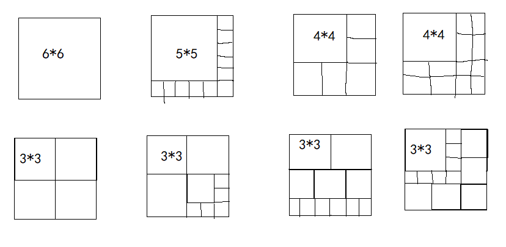

紧接上文[贪心算法题目合集-CSDN博客](https://blog.csdn.net/m0_73693552/article/details/144020981)。

因为不同的题贪心策略可能完全不同，它们的共同点是做决策时往往只看局部最优。这里按照个人理解划分。

完善了很多细节，比如Johnson算法的证明、排序规律的分析过程等。

# 一般排序

这类题用`sort`自带的反函数（小于）就能解决。

## 排队接水

[1319：【例6.1】排队接水](http://ybt.ssoier.cn:8088/problem_show.php?pid=1319) 

求怎么做才能让每人的平均接水时间最少，用贪心策略的话，就是**谁接水用的时间最少**，**谁就先接水**。同时所有人接水时，每个人总共消耗的时间是**等待时间**加**接水时间**，等待时间是之前的人接水用的时间，这个可以用递推式去计算。另外最后一个人的接水时间并不算进总的等待时间里。

例如这个样例：

```
5
1 2 3 4 5
//递推式
接水时间：1 2 3 4 5
实际耗时：1 3 6 10 15
等待时间：0 1 4 10 20
```

到这里，这题的思路就很清晰了：先排序，再用递推式去计算等待时间，最后求平均值即可。

```c
#define _CRT_SECURE_NO_WARNINGS 1

#include<iostream>
#include<algorithm>
#include<iomanip>
using namespace std;

struct info {
	int tim;
	int ord;
	info(int a = 0, int b = 0) {//构造函数初始化
		tim = a; ord = b;
	}
};
info t[1001];
bool cmp(info a, info b) {
	return a.tim < b.tim;
}

int main() {
	int n;
	double sum = 0;
	cin >> n;
	for (int i = 1; i <= n; i++) {
		cin >> t[i].tim;
		t[i].ord = i;
	}
	sort(t + 1, t + n + 1, cmp);//STL的sort函数，底层是快排
	for (int i = 1; i <= n; i++) {
		cout << t[i].ord << " ";
        
        //之前的那个人的接水时间就是现在这个人的等待时间
		sum += double(t[i - 1].tim); 
		t[i].tim += t[i - 1].tim;
	}
	cout << endl;
	cout << fixed << setprecision(2) << (sum / n);//保留2位小数输出
	return 0;
}
```

## 整数区间

[1324：【例6.6】整数区间](http://ybt.ssoier.cn:8088/problem_show.php?pid=1324)

题目要求找到一个集合，使得所有区间至少有1个点，都能在这个集合上找到。既然是集合，所以不要求连续。

站在人的视角，将所有区间放在数轴上展示，能更直观地展示。例如这个样例：

```
4
3 6
2 4
0 2
4 7
```


可以很直观地看到，区间`[2,4]`正好包含所有区间的至少有1个点。

因此就有了贪心策略：

1. 按区间右端点排序。
2. 给一个初始变量`x=-1`表示上一个区间的右端点，选`-1`是为了能将第1个区间也进行统一计算。
3. 枚举每个区间`a[i]`的左端点，若`a[i]`左端点`<=x`则说明该区间在划定的集合中有端点，否则将左端点加如集合（形式上的加入，并不记录），并更新`x`为`a[i]`这个区间的右端点。

参考程序：

```cpp
#include <bits/stdc++.h>
using namespace std;

void ac(){
	vector<pair<int,int> >a;
	int n;
	cin>>n;a.resize(n+1,{0,0});
	for(int i=1;i<=n;i++)
		cin>>a[i].second>>a[i].first;//为方便排序，交换区间左、右端点
	sort(a.begin()+1,a.end());
	
	int len=0,x=-1;
	for(int i=1;i<=n;i++){
		if(a[i].second<=x)
			continue;
		len++;//加一个点
		x=a[i].first;
	}
	cout<<len;
}

int main() {
	ac();
	return 0;
}
```

## 金银岛

[1225：金银岛](http://ybt.ssoier.cn:8088/problem_show.php?pid=1225)

这题需要将所有金属的单位价格进行枚举，然后进行贪心策略：装单位价值最大的金属，直到装不下时就切割还没选过的单位价值最大的金属来填。

参考程序：

```cpp
#include<bits/stdc++.h>
using namespace std;

int main() {
	int T;
	cin >> T;
	while (T--) {
		int w, n;
		cin >> w >> n;
		vector<pair<double, pair<int, int> > >a(n + 1, {0, { 0,0 } });
		//单位价格、重量和总价

		for (int i = 1; i <= n; i++) {
			cin >> a[i].second.first >> a[i].second.second;
			a[i].first = a[i].second.second * 1.0 / a[i].second.first;
		}
		sort(a.begin() + 1, a.end());
		double ans = 0;
		for (int i = n; i >= 1; i--) {
			if (w >= a[i].second.first) {
				w -= a[i].second.first;
				ans += a[i].second.second;
			}
			else {
				ans += w * a[i].first;
				break;
			}
		}
		printf("%.2lf\n", ans);
	}
}
```

## 寻找平面上的极大点

[1230：寻找平面上的极大点](http://ybt.ssoier.cn:8088/problem_show.php?pid=1230)

1. 将所有点排序。
2. 逆向枚举所有点，对每个点，再在之前的点找支配的点，找到了就标记。
3. 正向遍历所有的点，对没有做过标记的点输出即可。

```cpp
#include<bits/stdc++.h>
using namespace std;

int main() {
	int n;
	cin >> n;
	vector<pair<int, int> >a(n + 1, pair<int, int>());//匿名对象初始化
	for (int i = 1; i <= n; i++)
		cin >> a[i].first >> a[i].second;
	sort(a.begin() + 1, a.end());

	vector<bool>used(n + 1, 0);
	for (int i = n; i >= 1; i--) {
		if (used[i]) continue;
		for (int j = 1; j < i; j++) {
			if (used[j])
				continue;
			if (a[j].first <= a[i].first&& a[j].second <= a[i].second)
				used[j] = 1;
		}
	}
	for (int i = 1; i < n; i++) {
		if (!used[i])
			cout << "(" << a[i].first << "," << a[i].second << "),";
	}
	cout << "(" << a[n].first << "," << a[n].second << ")";
	return 0;
}
```

[P1056 [NOIP 2008 普及组\] 排座椅 - 洛谷](https://www.luogu.com.cn/problem/P1056)

因为横向通道和纵向通道互不影响，所以可以分别处理横向通道和纵向通道。

因为同一个一维坐标可能有多个交头接耳的同学，所以需要坐标和数量进行绑定，可以用结构体或类表示。

```cpp
#include <bits/stdc++.h>
using namespace std;

struct Inf {
	int index = 0; int cnt = 0;
};
void ac() {
	int n, m, k, l, d;
	cin >> m >> n >> k >> l >> d;
	vector<Inf>H(m+1), L(n+1);
	for (int i = 1; i <= m; i++)
		H[i].index = i;
	for (int i = 1; i <= n; i++)
		L[i].index = i;
	for (int i = 1; i <= d; i++) {
		int x1, x2, y1, y2;
		cin >> x1 >> y1 >> x2 >> y2;
		if (x1 == x2)
			L[min(y1, y2)].cnt++;
		else
			H[min(x1, x2)].cnt++;
	}
    
	sort(H.begin() + 1, H.end(), [&](Inf& a, Inf& b) {return a.cnt > b.cnt; });
	sort(L.begin() + 1, L.end(), [&](Inf& a, Inf& b) {return a.cnt > b.cnt; });
	sort(H.begin() + 1, H.begin()+k+1, [&](Inf& a, Inf& b) {return a.index < b.index; });
	sort(L.begin() + 1, L.begin()+l+1, [&](Inf& a, Inf& b) {return a.index < b.index; });


	for (int i = 1; i <= k; i++)
		cout << H[i].index << ' ';
	cout << endl;
	for (int i = 1; i <= l; i++)
		cout << L[i].index << ' ';

}

int main() {
	int T = 1;
	//cin>>T;
	while (T--)
		ac();
	return 0;
}
```

## NOIP 2008 普及组 排座椅

[P1056 [NOIP 2008 普及组\] 排座椅 - 洛谷](https://www.luogu.com.cn/problem/P1056)

给两个数组`H`和`L`，分别记录第`i`条横道或竖道的交头接耳的同学对数`num`，同时记住和`num`绑定的下标`i`。

之后给的一对坐标`(x,y)`和`(p,q)`，若`x==p`，说明在`min(y,q)`竖道的交头接耳的同学多了一对，反之同理。

之后先对`H`和`L`数组的`num`进行降序排序，再对`H`和`L`的前`k`个和前`l`个数据的和`num`绑定的下标`i`进行降序排序，再输出即可。

```cpp
#include<bits/stdc++.h>
using namespace std;

struct P {
	int num = 0;
	int i = 0;
};

//仿函数
struct Big {
	template<class T>
	bool operator()(T& a, T& b) {
		return a.num > b.num;
	}
};

struct Sml {
	template<class T>
	bool operator()(T& a, T& b) {
		return a.i < b.i;
	}
};

void ac() {
	int m, n, k, l, d;
	cin >> m >> n >> k >> l >> d;
	vector<P>H(m + 1), L(n + 1);
	for (int i = 1; i <= d; i++) {
		int x, y, p, q;
		cin >> x >> y >> p >> q;
		if (x == p) {
			int mi = min(y, q);
			L[mi].num++;
			L[mi].i = mi;
		}
		else {
			int mi = min(x, p);
			H[mi].num++;
			H[mi].i = mi;
		}
	}

	sort(H.begin() + 1, H.end(), Big());
	sort(L.begin() + 1, L.end(), Big());
	sort(H.begin() + 1, H.begin() + 1 + k, Sml());
	sort(L.begin() + 1, L.begin() + 1 + l, Sml());
	for (int i = 1; i <= k; i++)
		cout << H[i].i << ' ';
	cout << endl;
	for (int i = 1; i <= l; i++)
		cout << L[i].i << ' ';
	cout << endl;
}

int main() {
	int T = 1;
	//cin >> T;
	while (T--)
		ac();
	return 0;
}

```


# 推导排序规律

这类题就是寻找排序规则，排序就是在该排序规则下对整个对象排序。 

在解决某些问题的时，当我们发现最终结果**需要调整每个对象的先后顺序**，也就是对整个对象排序时，那么我们就可以用推公式的方式，得出我们的排序规则，进而对整个对象排序。 

正确性证明： 利用排序解决问题，最重要的就是需要证明“在新的排序规则下，整个集合可以排序”。这需要用到离散数学中“全序关系”的知识。我会在第一道题中证明该题的排序规则下，整个集合是可以排序的。 

但是证明过程很麻烦，后续题目中我们只要发现该题最终结果**需要排序**，并且**交换相邻两个元素的时候**，**对其余元素不会产生影响**，那么我们就可以推导出排序的规则，然后直接去排序，就不去证明了。 

## NOIP 1998 提高组 拼数

[P1012 [NOIP 1998 提高组\] 拼数 - 洛谷](https://www.luogu.com.cn/problem/P1012)

[ 拼数](https://www.luogu.com.cn/problem/P1012)这题用`string`数组存储数据，对数组按照`sort`自带的仿函数（大于）进行排序，只有2个样例不过不过。这种按照原始字典序进行排序的思路可以举例出反例：53和534。

假设两个数`a`，`b`，例如73，345。按照字典序，73 > 345，因此73345 > 34573，而且字典序已经有反例53、534。

因此需要更换策略。两个数只有两种拼接方法`ab`或`ba`。

* 若`ab > ba`，则`a`放`b`前。
* 若`ab < ba`，则`b`放`a`前。
* 若`ab == ba`，则顺序无所谓。

2个数可以按照这个规则，多个也可以。

这个题的本质是确定所有数的先后顺序，很容易想到排序。

以选择排序为例，对比所有的数，谁小就放第1个位置，之后重复同样的对比，直到所有数都对比完，这也可以说用到了某种贪心策略。

所以这个题也可以利用排序算法，结合拼接`ab`或`ba`进行比对的比较方式，确定最终的先后顺序。

但贪心策略不一定是正确的，且这个排序规则不一定正确，衍生的话就是什么样的排序规则才适合用于排序，分析放在后文。

```cpp
#include<bits/stdc++.h>
using namespace std;

void ac() {
	int n; cin >> n;
	vector<string>st;
	for (int i = 0; i < n; i++) {
		string x;
		cin >> x;
		st.push_back(x);
	}
	sort(st.begin(), st.end(), [&](string& a, string& b) {return a + b < b + a; });
	for (size_t i = st.size() - 1; i != -1; i--)
		cout<<st[i];
}

int main() {
	int T = 1;
	//cin >> T;
	while (T--)
		ac();
	return 0;
}
```

## 排序规则的正确性证明：全序关系

当定义新的排序规则时，这个规则并不一定能用于排序。

例如3个数据$\{a,b,c\}$，$a\geq b$，且$b\geq c\rightarrow a\geq c$，则说明这3数据的比较规则具有传递性。若推不出这种传递性，即$a\leq c$，则这种规则时不能用来排序的。例如
`{石头，剪刀，步}`就不能排序。

对朴素的数据进行排序时，即整数和浮点数都是有这种传递性的，所以排序时并不会特意证明这个比价规则。

离散数学的知识点全序关系：假设一个集合`{a,b,c,d,e,f,g}`，从集合中任选2个元素，它们满足某种比较规则下，符合一个全序关系，就说整个集合可以排序的。这个特性可以用于证明排序规则可用。

只要从集合中任选2个元素，满足这3个性质，则说明这个集合有全序关系。

1. 完全性。即某种规则能用于比大小。
2. 反对称性。即两个元素$a$、$b$，在某种规则下$a\leq b$且$b\leq a$，则$a==b$。
   或某种规则下$a$在前$b$在后，且$b$前$a$后，则应该有$a$、$b$的顺序无所谓。若排序规则不满足这个点（即$a$、$b$和$b$、$a$有差异），则不能对$a$、$b$背后的集合排序。
3. 传递性。即$a\geq b$，且$b\geq c\rightarrow a\geq c$。
   或$a$前$b$后，且$b$前$c$后，则$a$前$c$后。

拼数这个OJ的结论：

* 若`ab > ba`，则`a`放`b`前。
* 若`ab < ba`，则`b`放`a`前。
* 若`ab == ba`，则顺序无所谓。

证明拼数的结论有全序关系的3个性质：、

设$a$是$x$位的数，$b$是$y$位的数，$ab$（$a$和$b$进行拼接）相当于$ab=10^{y}\times a+b$，
则$ba=10^{x}\times b+a$。

1. 证明完全性。

   0在平时是不算几位数的，否则在某些推论是错误的。例如0是1位数，则00应该是最小的2位数，但实际最小的2位数是10。

   但在这里，当$a=b=0$时，在这里0当成1位数。例如1和0拼接，则$10=10^{1}\times 1+0$，$01=10^1\times 0+1$，这样才能保证$ab=10^{y}\times a+b$和$ba=10^{x}\times b+a$是正确的。

   当$a$、$b$拼接时，$ab$和$ba$的长度相同，无论是数值还是字典序方面都能比大小（完全性的结论），所以证毕。

2. 证明反对称性。

   $ab\leq ba$且$ba\leq ab$，则$ab=ba$

   将公式代入：
   $10^{y}\times a+b\geq 10^{x}\times b+a$，

   $10^{x}\times b+a\geq 10^{y}\times a+b$，
   这俩能推出$ab\geq ba \geq ab$，根据夹逼准则（见高等数学），得到$ab=ba$。
   于是$10^{y}\times a+b = 10^{x}\times b+a$，证毕。

3. 证明传递性。

   对3个数$a$、$b$、$c$，

   若$ab\geq ba$且$bc\geq cb$，则能推出$ac\geq ca$，即$a$、$b$、$c$这样的顺序。

   假设$a$、$b$、$c$分别是$x$、$y$、$z$，

   则$10^{y}\times a+b\geq 10^{x}\times b+a$，
   $10^{z}\times b+c\geq 10^{y}\times c+b$，

   对$10^{y}\times a+b\geq 10^{x}\times b+a$，将$a$移到左边，$b$移到右边，得到

   $\frac{(10^y-1)\times a}{10^x-1}\geq b$。

   对$10^{z}\times b+c\geq 10^{y}\times c+b$，将$b$移到左边，$c$移到右边，得到

   $\frac{(10^y-1)\times c}{10^z-1}\leq b$。

   $\frac{(10^y-1)\times a}{10^x-1}\geq b$和$\frac{(10^y-1)\times c}{10^z-1}\leq b$能得到$\frac{(10^y-1)\times a}{10^x-1}\geq  \frac{(10^y-1)\times c}{10^z-1}$。

   分母约去$(10^y-1)$并交叉相乘得到$(10^z-1)\times a\geq (10^x-1)\times c$。

   再来看这个式子$ac\geq ca$，代入公式得到

   $10^z\times a+c\geq 10^x\times c+a$，$a$移到左边，$c$移到右边，可得到：

   $(10^z-1)\times a\geq (10^x-1)\times c$，说明结论若$ab\geq ba$且$bc\geq cb$，则$ac\geq ca$正确，说明这个比较规则具有传递性。

综上，这个比价规则满足全序关系，能用于比较大小。

## 证明拼数的贪心策略正确

目标是将整个数组排序，假设这个数组的贪心解是

`[...,a,...,b,...]`，交换`a`和`b`，得到

`[...,b,...,a,...]`，

证明`[...,b,...,a,...]`一定不优于`[...,a,...,b,...]`即可证明贪心策略正确，即`[...,a,...,b,...]>=[...,b,...,a,...]`。

假设`a`、`b`中间的元素分别是`[a,x,y,z,b]`，通过传递性逐步调整成`[b,x,y,z,a]`：

`a` 前，`x`后，根据全序关系的结论，$ax \geq xa$，

所以交换顺序后变成`[x,a,y,z,b]`，因为$ax \geq xa$，所以
`[a,x,y,z,b]>=[x,a,y,z,b]`；

对`[x,a,y,z,b]`，交换`a`和`y`也就有

`[x,a,y,z,b]>=[x,y,a,z,b]`，则$ay\geq ya$，

因为$ax \geq xa$，$xy\geq yx$，所以$ay\geq ya$，所以这3的顺序是$a$、$x$、$y$时才是最优解。

根据这个思路，可以调整到最后：`[x,y,z,b,a]`，

用同样的思路也可以将`b`调整到第1位，得到`[b,x,y,z,a]`。

调整过程中`[a,x,y,z,b]>=[x,a,y,z,b]>=[x,y,a,z,b]>=...>=[b,x,y,z,a]`，说明这种调整方式只会使最后的整数变小或相等，所以交换两个元素并不能得到比贪心解更优的解，贪心策略正确。

## P2878 [USACO07JAN] Protecting the Flowers S

[P2878 [USACO07JAN\] Protecting the Flowers S - 洛谷](https://www.luogu.com.cn/problem/P2878)

最终结果是确定牵牛的顺序，因此需要对所有的牛进行排序。

思路1：

假设2奶牛$i$、$j$，拉走它们要用的时间分别是 $t_i$、$t_j$，它们在单位时间的吃花量是$d_i$、$d_j$。交换它们被牵走的顺序并不影响其他奶牛。

假设牵走$i$、$j$左边的奶牛用时$T_1$，这段时间吃掉的花$D_1$，右边的则是$T_2$，$D_2$


假设$i$先被牵走，$j$后被牵走是最优解，总的吃花数
$sum_i=D_1+D_2+T_1\times d_i+(T_1+2\times t_i)\times d_j$，

$j$先被牵走，$i$后被牵走，总的吃花数
$sum_j=D_1+D_2+T_1\times d_j+(T_1+2\times t_j)\times d_i$，

则$sum_i<sum_j$，将不必要的项削掉之后，最后的式子：

$t_i\times d_j<t_j\times d_i$。

也就是说，当任意两头奶牛的吃草量满足这个不等式时，按顺序牵走所有的奶牛，能得到最小的吃花数。

碍于题目的数据量，最好用`long long`表示数据范围。

思路2：

最终目的是牵走所有的牛，则完全可以采用贪心策略：优先牵走单位时间内吃掉花最多的牛。

例如牵走$a$牛的时间是$t_a$，$a$牛每分钟吃掉的话是$d_a$夺，$b$牛的则是$\{t_b,d_b\}$，则当$\frac{d_a}{t_a}>\frac{d_b}{t_b}$时，优先牵走$a$牛是最优解。

因为$t$，$b$都是整型，直接除的话会舍弃小数部分造成精度损失，所以通过交叉相乘转换一下：$d_a\times t_b>d_b\times t_a$。这个不等式恰好就是思路1的结论。

```cpp
#include<bits/stdc++.h>
using namespace std;
typedef long long LL;

struct cmd {
	template<class T>
	bool operator()(T& a, T& b) {
		return a.first * b.second < a.second* b.first;
	}
};

void ac() {
	LL n; cin >> n;
	LL sum = 0;
	vector<pair<LL, LL> >a(n + 1, { 0,0 });
	for (int i = 1; i <= n; i++) {
		cin >> a[i].first >> a[i].second;
		sum += a[i].second;
	}
	LL res = 0;
	sort(a.begin() + 1, a.end(), cmd());
	for (auto& tmp : a) {
		sum -= tmp.second;
		res += sum * tmp.first * 2;
	}
	cout << res;
}

int main() {
	int T = 1;
	//cin >> T;
	while (T--)
		ac();
	return 0;
}
```


## P1842 [USACO05NOV] 奶牛玩杂技 - 洛谷

[P1842 [USACO05NOV\] 奶牛玩杂技 - 洛谷](https://www.luogu.com.cn/problem/P1842)

首先读题目得到的信息：

1. 牛牛们玩叠罗汉，每头牛都有向下的重力和向上的推力，每头牛的推力减去它受到的重力，即为这头牛的压扁指数；所有牛的压扁指数的最大值，即为整个牛群的压扁指数的最大值。
2. 确定一个顺序，来使这个最大值最小。

首先这个最大值最小很容易误解成二分，但这里并不需要枚举某个有序数据。

和前2个题一样，假设某种最优顺序中，有2头牛分别是第`i`头和第`j`头，交换它们的顺序，对它们下方的牛和上方的牛的压扁指数没有影响（即两头牛的重力不变），但会对中间的牛造成影响。

就算如此，依旧可以用类似冒泡排序的思路，依次比较相邻两头牛交换前和交换后，两头牛互相给对方带来的压扁指数的变化。

即交换前的`j`受到`i`的重力影响产生的压扁指数`w[i]-s[j]`，和交换后的`w[j]-s[i]`，若交换前的`w[i]-s[j]`小于交换后的`w[j]-s[i]`，则说明这两头牛的位置安排合理。通过2头牛的局部最优扩展为全局最优，即可得到贪心解。

因此可以用`w[i]-s[j]<w[j]<s[i]`这个规则去安排牛的顺序也就是排序。

```cpp
#include<bits/stdc++.h>
using namespace std;

struct cmd {
	typedef pair<int, int>pii;
	bool operator()(pii& a, pii& b) {
		return a.second - b.first < b.second - a.first;
	}
};

void ac() {
	int n; cin >> n;
	vector<pair<int, int> >a(n + 1);
	for (int i = 1; i <= n; i++) {
		cin >> a[i].first >> a[i].second;
	}
	sort(a.begin() + 1, a.end(), cmd());

	int res = -2e9, w=0;
	for (int i = 1; i <= n; i++) {
		res = max(w - a[i].second, res);
		w += a[i].first;
	}
	cout << res;
}

int main() {
	int T = 1;
	//cin >> T;
	while (T--)
		ac();
	return 0;
}
```

这里的思路是只算两头牛分别对对方造成的影响，但如果是从全局考虑：


对表达式`max(-si,wi-sj)<max(-sj,wj-si)`，分情况讨论：

1. 假设`<`左边`-si`最大，则`-si>wi-sj`，根据数学规律，`wi-sj>-sj`，因此
   `-si>wi-sj>-sj`，这种情况下原不等式只能取`-si<wj-si`，此时无论`-si`、`wj`、`si`是什么值，它们都是成立的。
2. 同理，假设`<`右边`-sj`最大，则`-sj>wj-si`，根据数学规律，`wj-si>-si`，因此
   `-sj>wj-si>-si`，这种情况下原不等式能取`-sj>wi-sj`或`-sj>-si`，此时若
   `-si>wi-sj`则根据1，不等式恒成立，所以`-sj>wi-sj>-sj`，矛盾。

根据1、2的分析，表达式不能取到`-si`和`-sj`作为不等式两边的最后结果，因此表达式被简化成`wi-sj<wj-si`，也就是上面的代码的思路`w[i]-s[j]<w[j]<s[i]`。

这个不等式还可以移项，只要是通过这个表达式变形得到的规律用于排序，都能得到最终结果。

# 流水作业调度问题（Johnson算法）

有$n$个作业要在两台机器 A 和 B 组成的流水线上完成加工。每个作业$i$都必须先花时间$a_i$在 A 上加工，然后花时间$b_i$在 B 上加工。 确定$n$个作业的加工顺序，使得从作业1在机器 A 上加工开始到作业$n$在机器 B 上加工为止所用的总时间最短。

直观上，最优调度一定让 A 没有空闲，B 的空闲时间尽量短。

##  Johnson算法

 Johnson算法：设$N_1$为$a<b$的作业集合，$N_2$为$a\geq b$的作业集合，将$N_1$的作业按$a$非减序排序，$N_2$中的作业按照$b$非增序排序，则$N_1$作业接$N_2$作业构成最优顺序。 算法时间复杂度为$O(n\log n)$。

该算法的证明在脱离图论的情况下证明较为困难，推荐记住结论直接用即可。这里头铁尝试利用动态规划和数学运算尝试证明：

算法证明：

设$S=\{J_1,J_2,\cdots,J_n\}$为待加工部件的作业排序，若A机器开始加工$S$中的部件完成时，B机器可能还在加工其他部件，也可能已经空闲，但无论是什么情况，在$t$时刻后B机器才可加工A机器加工过的部件。

在这样的条件下，加工$S$中任务所需的最短时间$T(S,t)=\min\{a_i + T(S - \{J_i\},b_i + \max\{t - a_i,0\})\}$
$T(S,T)$表示选择某个作业$J_i$先加工，A机器消耗时间$a_i$，B机器在等待$\max\{t - a_i,0\}$时间后开始处理$J_i$的B部分（耗时$b_i$），整个过程消耗的最短时间。其中，$J_i\in S$。 

下图是机器A在完成作业$i$后，$i$作业进入机器B加工前的所有情况。


假设最佳的方案中，先加工作业$J_i$，然后加工作业$J_j$（$i>j$），则

$T(S,t)=a_i + T(S - \{J_i\},b_i + \max\{t - a_i,0\})$ 

$=a_i + a_j + T(S - \{J_i,J_j\},b_j + \max\{b_i + \max\{t - a_i,0\} - a_j,0\})$ 

> $S - \{J_i,J_j\}$表示排除$J_i$和$J_j$后剩下的工作，$b_i + \max\{t - a_i,0\}$表示之前的作业消耗的时间，所以$b_j + \max\{b_i + \max\{t - a_i,0\}-a_j$表示$J_j$可能的等待时间。

$=a_i + a_j + T(S - \{J_i,J_j\},T_{ij})$ 

其中$T_{ij} = b_j + \max\{b_i+\max\{t - a_i,0\} - a_j,0\}$ 

$=b_i + b_j - a_j + \max\{\max\{t - a_i,0\},a_j - b_i\}$ 

> $T_{ij} = b_j + \max\{b_i+\max\{t - a_i,0\} - a_j,0\}-b_i+b_i+a_j-a_j$，目的是消去$\max$列表内的多项式中多余的单项式。

$=b_i + b_j - a_j + \max\{t - a_i,a_j - b_i,0\}$ 

$=b_i + b_j - a_i - a_j + \max\{t,a_i,a_i + a_j - b_i\}$ 

> 同样的操作，等式同时加一个$a_i$和减一个$a_i$。

$$=\begin{cases}
t+b_i+b_j-a_i-a_j,\quad\ \ 若\max\{t,a_i,a_i+a_j-b_i\}=t\\
b_i+b_j-a_j, \ \quad\quad\quad\quad\quad若\max\{t,a_i,a_i+a_j-b_i\}=a_i\\
b_j,\quad \quad\quad\quad\quad\quad\quad\quad\quad\ 若\max\{t,a_i,a_i+a_j-b_i\}=a_i+a_j-b_i
\end{cases}
\tag{1}$$

若按作业$J_i$和作业$J_j$的加工顺序调换，则有： 
$T'(S,t)=a_i + a_j + T(S - \{J_i,J_j\},T_{ji})$，其中根据上面的推导，
$T_{ji} = b_i + b_j - a_i - a_j + \max\{t,a_j,a_i + a_j - b_j\}$ 

按假设，因为$T \leq T'$成立，所以有： 
$\max\{t,a_i + a_j - b_i,a_i\} \leq \max\{t,a_i + a_j - b_j,a_j\}\cdots ①$

> 由$T\leq T'\rightarrow \max\{t,a_i + a_j - b_i,a_i\}\leq \max\{t,a_i + a_j - b_j,a_j\}$，消去了$-a_i,-a_j,b_i,b_j$。

于是有：
$a_i + a_j + \max\{-b_i,-a_j\}\leq a_i + a_j + \max\{-b_j,-a_i\}$ 

即 $\min\{b_j,a_i\}\leq\min\{b_i,a_j\} \cdots ②$

针对$②$表达式的所有情况：

1. $a_i<b_i$，且$a_j<b_j$，

   假设$a_i\leq a_j$，

   * 因为$a_i\leq a_j<b_j$，所以$a_i<b_j$，$②$左边取$a_i$。

   * 而$②$右边，因为$a_i\leq a_j$，$a_i<b_i$，所以$\min\{b_i,a_j\}\geq a_i$，这里取$a_i\leq a_j$。

   假设$a_i>a_j$，

   * 因为$a_j<a_i<b_i$，所以$②$右边取$a_j$，$\min\{b_j,a_i\}\leq a_j$
   * 因为$a_j<b_j$，$a_i>a_j$，所以无论怎么取，和假设$a_i>a_j$矛盾。

   假设$b_i\leq b_j$，

   * 则$a_i<b_i\leq b_j$，所以$②$变成$a_i\leq \min\{b_i,a_j\}$，
   * 因为$a_i<b_i$，$b_i\leq b_j$，$a_j<b_j$，无法判断$b_i$和$a_j$的大小，
     * 取$b_i$的话说明$b_i<a_j$，且$a_i< b_j$作为假设的结论，可以暂定成立；
     * 取$a_j$的话，说明$b_i>a_j$，而$b_i>a_i$，依旧无法确定$a_i$和$a_j$的大小，但可以猜：
       * 若$a_i\leq a_j$，则这个不等式合理；
       * 而若$a_i >a_j$，则只能取$b_i$，但$a_i<b_i$，假设矛盾。

   * 综上，通过$②$式最后得到的结论是$a_i\leq a_j$。

   假设$b_i>b_j$，

   * 则$b_i>b_j>a_j$，所以$②$变成$\min\{b_j,a_i\}\leq a_j$，
   * 因为$a_j<b_j$，所以$\min\{b_j,a_i\}$只能取$a_i$，即$a_i\leq a_j$。

   发现，无论什么情况，都能得到$a_i\leq a_j$，因此可以得出结论：当集合$J$中的部分作业满足$a_i<b_i$，且$a_j<b_j$时，这部分作业在最优调度中需要满足$a_i\leq a_j$也就是按照在$a$车间的加工时间**严格非递减**才能保证最短加工时间。

2. $a_i\geq b_i$，且$a_j\geq b_j$，

   假设$b_i< b_j$，

   * 因为$b_i< b_j \leq a_j$，所以$②$式即$\min\{b_j,a_i\}\leq\min\{b_i,a_j\}$变成$\min\{b_j,a_i\}\leq b_i$，
   * 因为$a_i\geq b_i$，$b_j> b_i$，矛盾。

   假设$b_i\geq b_j$，

   * 因为$b_j\leq b_i\leq a_i$，所以$②$变成$b_j\leq \min\{b_i,a_j\}$，
   * 因为$a_j\geq b_j$，所以只能取$b_j\leq b_i$，也就是条件。

   假设$a_i\leq a_j$，

   * 因为$b_i\leq a_i \leq a_j$，所以$②$变成$\min\{b_j,a_i\}\leq b_i$，
   * 因为$a_i\geq b_i$，所以只能取$b_j\leq b_i$。

   假设$a_i>a_j$，

   * 因为$b_j\leq a_j<a_i$，所以$②$变成$b_j\leq\min\{b_i,a_j\}$，
   * 因为$b_j\leq a_j$，所以只能取$b_j\leq b_i$。

   发现，无论什么情况，都能得到$b_i\geq b_j$，因此可以得出结论：当集合$J$中的部分作业满足$a_i\geq b_i$，且$a_j\geq b_j$时，这部分作业在最优调度中需要满足$b_i\geq b_j$也就是**严格非递增**才能保证最短加工时间。

3. $a_i<b_i$，且$a_j\geq b_j$，即$i$作业属于情况1，$j$作业属于情况2。因为之前假设$i$作业安排在$j$作业之前进行处理是最优，最后得到了结论$\min\{b_j,a_i\}\leq\min\{b_i,a_j\}$，所以需要证明：

   即使$i$、$j$两个作业满足$a_i<b_i$，且$a_j\geq b_j$这个条件，$i$先于$j$之前处理，依旧能得到$\min\{b_j,a_i\}\leq\min\{b_i,a_j\}$，此时便能说明推理正确，也能得到最终的顺位。

   * 若$b_j<a_i$，则$②$左边是$b_j\leq \min\{b_i,a_j\}$，因为$a_j\geq b_j$，$b_j<a_i<b_i$，所以当$b_j<a_i$时$②$成立。
   * 若$b_j>a_i$，则$②$变成$a_i\leq \min\{b_i,a_j\}$，
     * 若$a_j\geq a_i$，则因为$b_i> a_j$，所以$a_i\leq \min\{b_i,a_j\}$成立；
     * 若$a_j<a_i$，则因为$a_j\geq b_j>a_i$，和$a_j<a_i$矛盾，无法通过$a_j<a_i$这种错误结论来验证$②$是否正确。

   综上，结论正确。

4. $\min\{b_j,a_i\}=\min\{b_i,a_j\}$，这种情况需要根据$i$和$j$两个作业的情况分类讨论：
   
   * $a_i\leq b_j$且$b_i\leq a_j$，此时$\min\{b_j,a_i\}=\min\{b_i,a_j\}$成立的条件是$a_i=b_i$，即作业$i$在两个机器的加工时间相等。
   
   * $a_i\leq b_j$且$b_i>a_j$，此时$\min\{b_j,a_i\}=\min\{b_i,a_j\}$成立的条件是$a_i=a_j$。即2个作业在机器A中加工的时间相等。
   
   * $a_i>b_j$且$b_i\leq a_j$，此时$\min\{b_j,a_i\}=\min\{b_i,a_j\}$成立的条件是$b_j=b_i$，即2个作业在B中加工的时间相等。
   
   * $a_i>b_j$且$b_i>a_j$，此时$\min\{b_j,a_i\}=\min\{b_i,a_j\}$成立的条件是$b_j=a_j$，即作业$j$在两个机器的加工时间相等。
   
   综上，满足这4种情况的作业，也满足等式$\min\{b_j,a_i\}=\min\{b_i,a_j\}$。则这些作业的安排：
   
   1. 若$i$、$j$属于$a_i<b_i$，且$a_j<b_j$，或$i$、$j$属于$a_i\geq b_i$，且$a_j\geq b_j$，即$i$、$j$属于同一阵营，因为$\min\{b_j,a_i\}=\min\{b_i,a_j\}$，所以$a_i=a_j$或$b_i=b_j$时顺序无所谓，但若是$a_i=b_i$或$a_j=b_j$，则应该按照$a_i\leq a_j$的顺序排序。
   
      因为$a_i=b_j$，$a_j=b_i$，当$a_i\leq a_j$时，$b_i\geq b_j$，此时无论2个作业放在哪个阵营都不会冲突。
   
   2. 若$i$、$j$分别属于$a_i<b_i$，且$a_j<b_j$，或$i$、$j$属于$a_i\geq b_i$，且$a_j\geq b_j$，
   
      根据之前的结论，$i$应该安排在$j$之前。
   
      $a_i=a_j$，$b_i=b_j$时即使2个作业属于不同阵营，交换也不影响整体时间，甚至这种情况下2个作业也可以划分到同一阵营；
   
      $a_i=b_j$，$a_j=b_i$时，即使$i$、$j$分属2个不同的阵营，$a_i<a_j$时仍然有$b_i>b_j$，此时$i$和$j$依旧可以划分成同一阵营，但先加工$i$再加工$j$的顺序不会变。
   
   综上，当$\min\{b_j,a_i\}=\min\{b_i,a_j\}$时，按照$a_i\leq a_j$来划分顺序，无论$i$、$j$在哪个阵营或同在一个阵营，都不会对整体时间造成影响。
   

综合上述分析，作业$S$的每个作业先在A机器中加工，再到B机器中加工，整体用时最短的策略是：

将$S$的作业分成2个集合，集合$N_1$的每个作业满足$a<b$，且严格按照$a_i\leq a_j,i<j$的规律排序；集合$N_2$的每个作业满足$a\geq b$，且严格按照$b_i\geq b_j,i<j$的规律排序；

此时的加工时间最短。这个策略正好是Johnson算法的结论。


> 回顾Johnson算法内容：设$N_1$为$a<b$的作业集合，$N_2$为$a\geq b$的作业集合，将$N_1$的作业按$a$非减序排序，$N_2$中的作业按照$b$非增序排序,则$N_1$作业接$N_2$作业构成最优顺序。 算法时间复杂度为$O(n\log n)$。

因此$②$式即$\min\{b_j,a_i\}\leq\min\{b_i,a_j\}$便是Johnson算法的数学表达式。

也就是说在$②$式成立的条件下（即从最优队列中任选两个作业$J_i$和$J_j$都满足$②$式），任务$J_i$安排在任务$J_j$之前加工可以得到最优解，即在A机器上加工时间短的任务应优先，而在B机器上加工时间短的任务应排在后面。 至此，Johnson算法的正确性证明完毕。

## OJ题 加工生产调度

链接：[1425：【例题4】加工生产调度](http://ybt.ssoier.cn:8088/problem_show.php?pid=1425) 

[P1248 加工生产调度 - 洛谷](https://www.luogu.com.cn/problem/P1248)

这个OJ就是典型的Johnson算法模板题。

思路1：

1. 输入所有数据，然后将Johnson算法的结论$\min\{b_j,a_i\}\leq\min\{b_i,a_j\}$用于`sort`的回调函数或仿函数中。

   但有一点需要注意，当$\min\{b_j,a_i\}=\min\{b_i,a_j\}$时，按照之前的结论，需要2个作业按照在A机器中的加工时间来确定顺序，谁在A机器中的加工时间小就先加工谁，相同则无所谓。

2. 模拟：给两个变量`A`和`B`，分别用于监视两个车间被调用的时间。
   * 对每个工作`i`，先安排到A车间，`A`将工作时间叠加。
   * A车间的工作`i`安排完成之后，若之前B车间还在完成之前的工作，则有两种情况：
     * `A<B`，即`A`完成后可立即加工，不做处理。
     * `A>B`，则B车间出现等待时间，则进行时间同步，也就是`B=A`。

对`A`和`B`的处理参考这张图：


思路2：

1. 选出每个工作在两个车间用时的最小值，用另外的数组`arrange`存储。
2. 对`arrange`数组按照记录的最小时间进行升序排序。
3. 利用双指针向内收缩安排工作顺序。如果最小时间是在A车间的用时，则安插在左指针，左指针右移；否则安插在右指针，右指针左移。
4. 和思路1一样的模拟。

参考程序：

```cpp
#include <bits/stdc++.h>
using namespace std;

void ac1() {
	struct Area {
		int at = 0;
		int bt = 0;
		int ord = 0;
		Area(int a, int b, int o) :at(a), bt(b), ord(o) {}
	};
	int n; cin >> n;
	vector<Area>a(n, { 0,0,0 });
	for (int i = 0; i < n; i++)
		cin >> a[i].at, a[i].ord = i;
	for (int i = 0; i < n; i++)
		cin >> a[i].bt;
	sort(a.begin(), a.end(), [&](Area& x, Area& y) {
		//直接套用Johnson算法的结论
		if (min(x.at, y.bt) == min(x.bt, y.at))
			return x.at < y.at;//最小值相同时按照在A机器中的加工时间安排顺序
		return min(x.at, y.bt) < min(x.bt, y.at);
	});

	int times = 0, A = 0, B = 0;
	for (auto& x : a) {
		A += x.at;
		if (B < A)
			B = A;
		B += x.bt;
	}
	cout << B << endl;
	for (auto& x : a) {
		cout << x.ord + 1 << ' ';
	}
}

void ac2() {
	struct Area1 {//a,b表示在a,b车间完成作业的时间
		int a; int b;
		Area1(int _a = 0, int _b = 0) :a(_a), b(_b) {}
	};
	vector<Area1>work;//作业
	struct Area2 {//times表示作业id在哪个车间的完成时间最短，times记录那个时间
		int times; int id;
		Area2(int _a = 0, int _b = 0) :times(_a), id(_b) {}
	};
	vector<Area2>arrange;//安排
	int n;
	cin >> n;

	work.resize(n + 1, Area1());
	arrange.resize(n + 1, Area2());
	for (int i = 1; i <= n; i++)
		cin >> work[i].a;
	for (int i = 1; i <= n; i++)
		cin >> work[i].b;

	//Johnson算法
	//记录每个作业在哪个车间的完成时间最短
	for (int i = 1; i <= n; i++) {
		arrange[i].times = min(work[i].a, work[i].b);
		arrange[i].id = i;
	}
	sort(arrange.begin() + 1, arrange.end(),
		[&](Area2& a, Area2& b) {return a.times < b.times; });

	vector<int>ans(n + 1, 0);//最终安排顺序
	int l = 0, r = n + 1;
	for (int i = 1; i <= n; i++) {
		if (arrange[i].times == work[arrange[i].id].a)
			ans[++l] = arrange[i].id;
		else
			ans[--r] = arrange[i].id;
	}

	l = 0, r = 0;//代码复用，l表示所有作业在A加工的时间
	for (int i = 1; i <= n; i++) {
		l += work[ans[i]].a;
		if (r < l)//计算B车间的等待时间
			r = l;
		r += work[ans[i]].b;
	}

	cout << r << endl;
	for (int i = 1; i < ans.size(); i++)
		cout << ans[i] << ' ';
}

int main() {
	int T = 1;
	//cin>>T;
	while (T--) {
		ac1();
		//ac2();
	}
	return 0;
}
```


# 带点思维

## 均分纸牌(Noip2002)

[1320：【例6.2】均分纸牌(Noip2002)](http://ybt.ssoier.cn:8088/problem_show.php?pid=1320)

这题的最终目的是让若有堆的牌相等。

所以可以反其道而行：先求得所有堆的平均数，知道最后所有堆的牌数是多少，然后枚举除了最后一堆的所有堆，牌数不符合要求就对右边的牌进行操作即可。

参考程序：

```cpp
#include <bits/stdc++.h>
using namespace std;

void ac(){
	int n;cin>>n;
	vector<int>a(n+1,0);
	for(int i=1;i<=n;i++){
		cin>>a[i];
		a[0]+=a[i];
	}
	a[0]/=n;
	int times=0;
	for(int i=1;i<n;i++){
		if(a[i]==a[0]) continue;
		else if(a[i]<a[0]){
			a[i+1]=a[i+1]-(a[0]-a[i]);
			a[i]=a[0];
			times++;
		}
		else if(a[i]>a[0]){
			a[i+1]=a[i+1]+(a[i]-a[0]);
			a[i]=a[0];
			times++;
		}
	}
	cout<<times;
}

int main() {
	ac();
	return 0;
}
```

## 删数问题(Noip1994)

[1321：【例6.3】删数问题(Noip1994)](http://ybt.ssoier.cn:8088/problem_show.php?pid=1321)

[1231：最小新整数](http://ybt.ssoier.cn:8088/problem_show.php?pid=1231)

[P1106 删数问题 - 洛谷](https://www.luogu.com.cn/problem/P1106)

首选不能一味地排序之后再删数。比如这个测试样例：

```cpp
50074897
2
```

若排序后将8、9删除后，剩下的500747并不是最小的。最小的是删掉5和第1个7，此时数变成了4897（前缀0可忽略）。

此时能做的只有猜测贪心策略，猜到了就去尝试，和作者想的一样或能解决问题就血赚，不能就再尝试别的办法。

这题的最终目的是删掉尽可能多的数使剩下的数字尽可能的小，因此往剔除大的数的方向去想。而且左边的数要尽可能小，因为十进制的自然数位数越高，对数的大小的影响越大。

要符合左边尽可能小，删的数尽可能的大，可以尝试贪心策略：

从左向右枚举，数据若是升序则一直枚举，直到出现降序时就算找到了一个最大值。例如`175438`，在枚举到`175`时，7在高位但比低位的5大，删除他能使数变得最大。同样的5：`15438`，删去；4：`1438`，删去，最后`138`已经变成了升序，此时还能再删，所以把最末尾的8给删掉。

这种找升序的最大值的方案是否正确，很难证明。只能尝试实现，若能解决问题则说明是正确的（结果大于一切）。

尝试实现：

```cpp
#include <bits/stdc++.h>
using namespace std;

void ac(){
	string st;int s;
	cin>>st>>s;
	//删到最后是升序，后面是\0，可以删最末尾 
	for(int i=0;i=0,s--;st.erase(i,1)){//结束条件：所有牌都删完。 
		while(i<st.size()&&st[i]<=st[i+1])//找升序最大值 
			++i;
	}
	while(st.size()>1&&st[0]=='0')
		st.erase(0,1);
	cout<<st<<endl;
}

int main() {
    int T=1;
    //cin>>T;//提交到1321删数问题时将这一句给注释掉
    while(T--)
	ac();
	return 0;
}
```

经验证，猜想正确，两个OJ[1321：【例6.3】删数问题(Noip1994)](http://ybt.ssoier.cn:8088/problem_show.php?pid=1321)、[1231：最小新整数](http://ybt.ssoier.cn:8088/problem_show.php?pid=1231)都能AC。证明略，或现有水平暂时无法证明。

## 装箱问题

OJ：[1226：装箱问题](http://ybt.ssoier.cn:8088/problem_show.php?pid=1226) 

因为高度都是`h`，所以主要还是看平面。

主要的包装方法：




也就是说$6\times6$、$5\times5$和$4\times4$的产品要单独用一个包裹，一个包裹最多能装4个$3\times3$的产品。

所以就有了贪心策略：

1. 优先装底边为6、5、4的产品。
2. 底边为3的产品分4个一组，每组用一个包裹。多出来的根据情况选择需要用到的底边为2的产品数。
3. 统计用底边为2的产品填满底边为4和底边为3的包裹的空隙需要的数量，如果多了则用另外的包裹来填。
4. 底边为1的产品的需求可以通过总的底面积减去已经用掉的底面积得到。

参考程序：

```cpp
#ifndef _CRT_SECURE_NO_WARNINGS
#define _CRT_SECURE_NO_WARNINGS 1
#endif

#include<bits/stdc++.h>
using namespace std;

int main() {
	int a[7] = { 0 };
	while (1) {
		a[0] = 0;
		for (int i = 1; i <= 6; i++) {
			cin >> a[i];
			a[0] += a[i];
		}
		if (!a[0])
			return 0;
		int ans = a[6] + a[5] + a[4] + ceil(a[3] / 4.0);//ceil会对浮点数向上取整
		int tmp = 0;
		if (a[3] % 4 == 3)
			tmp = 1;
		if (a[3] % 4 == 2)
			tmp = 3;
		if (a[3] % 4 == 1)
			tmp = 5;
		int num2 = 5 * a[4] + tmp;//底边为2的产品的需求
		if (num2 < a[2]) {
			ans = ans + ceil((a[2] - num2) / 9.0);
		}
		int num1 = 36 * ans - 25 * a[5] - 16 * a[4] - 9 * a[3] - 4 * a[2];
		if (num1 < a[1]) {
			ans = ans + ceil((a[1] - num1) / 36.0);
		}
		cout << ans << endl;
	}
}
```

## Ride to Office

[1227：Ride to Office](http://ybt.ssoier.cn:8088/problem_show.php?pid=1227)

我在做这题的时候首先想到的是追击相遇问题，但后来发现测试样例对不上，因为测试样例直接就是最快的那个人的用时。

还有就是提早出发的人，若比晚出发的人快则会提早到终点；若比晚出发的人慢则会被追上。所以无论什么情况都不考虑他们。

因此这题的贪心策略：枚举所有晚出发的人，找到他们骑完整个路的最短时间即可。

```cpp
#include<bits/stdc++.h>
using namespace std;

int main() {
	int n;
	while (cin >> n && n) {
		int v, t;
		int mmin = 0x3f3f3f3f;
		for (int i = 1; i <= n; i++) {
			cin >> v >> t;
			if (t >= 0) {
				mmin=min(mmin,(int)ceil(4500 * 3.6 / v + t));
			}
		}
		cout << mmin << endl;
	}
	return 0;
}
```

## 电池的寿命

[1229：电池的寿命](http://ybt.ssoier.cn:8088/problem_show.php?pid=1229)

虽然电池不可切割，但电量可以。

所以可以尝试贪心策略：

1. 统计所有电池的总电量`sum`，并找出电量最大的电池`maxx`。
2. 若电量最大的电池，占总电量的一半以上，则所有电池能用的时间就是`sum-maxx`。
3. 否则就是先用其他电池拼凑出电量为`maxx`的虚拟电池，将电量为`maxx`的电池的电量耗尽；再将剩下的电池的总电量对半分，所以所有电池能用的时间就是`maxx+(sum-maxx*2)/2`。

```cpp
#include<bits/stdc++.h>
using namespace std;

int main() {
	int n;
	vector<int>a;
	while (cin >> n) {
		a.resize(n + 1, 0);
		int sum = 0,maxx=0;
		for (int i = 1; i <= n; i++) {
			cin >> a[i];
			sum += a[i];
			maxx = max(maxx, a[i]);
		}
		if (sum - maxx <= sum / 2) {
			printf("%.1lf\n",(double)sum - maxx);
			continue;
		}
		printf("%.1lf\n",(sum - 2.0 * maxx) / 2 + maxx);
	}
	return 0;
}
```

## Crossing River

[1232：Crossing River](http://ybt.ssoier.cn:8088/problem_show.php?pid=1232)

这个题有两种贪心策略：

1. 大佬带萌新。即用时最短的那个人，帮最慢的两个人过河。
2. 假设1、2是过河最快的2人，他们先过河，然后1回；然后最慢的两人过河，2回。

因为不知道哪个策略能得到最优解，于是做一个前瞻预测：

1. 所有人的过河时间进行排序。
2. 针对最慢的两个人，分别计算两种贪心策略的用时，选择用时最小的那个策略。直到只剩3人或不到3个人。
3. 最后只剩3人，1带3过河，1回，1带2过河。
   最后只剩2人或1人，直接过河即可。

```cpp
#include<bits/stdc++.h>
using namespace std;

int main() {
	int _n;
	cin >> _n;
	while (_n--) {
		int n;
		cin >> n;
		vector<int>a(n + 1, 0);
		int vi = 0;
		for (int i = 1; i <= n; i++) 
			cin >> a[i];
		sort(a.begin() + 1, a.end());
		int times = 0;
		while (n > 3) {
			int tmp1 =a[2] + a[1] + a[n] +a[2];//1、2过河，1回，n和n-1再过，2回
			int tmp2 = 2 * a[1] + a[n] + a[n - 1];//大佬带萌新
			times += min(tmp1, tmp2);
			n -= 2;
		}
		if (n == 3)
			times += a[3] + a[2] + a[1];
		if (n == 2)
			times += a[2];
		if (n == 1)
			times += a[1];
		cout << times << endl;
	}
	return 0;
}
```

## 接水问题

[1233：接水问题](http://ybt.ssoier.cn:8088/problem_show.php?pid=1233)

水龙头有多个，可以先安排`m`个人接水，然后枚举`[m+1,n]`的人到`m`个队列中用时最短的队列，最后在`m`个队列中找出用时最大的那个队列即可。

这题很明显可以用dfs加剪枝或堆优化，但测试样例只认目光短浅的贪心策略，所以私以为这是作者故意考思维安排的题。

```cpp
#include<bits/stdc++.h>
using namespace std;

int main() {
	int n, m;
	cin >> n >> m;
	vector<int>a(n + 1, 0);
	for (int i = 1; i <= n; i++)
		cin >> a[i];
	
	int mini = 1;
	//m个水龙头都被占用
	for (int i = m + 1; i <= n; i++) {
		mini = 1;
		for (int j = 1; j <= m; j++)//找谁先接完水 
			if (a[j] < a[mini])
				mini = j;
		a[mini] += a[i];
	}
	mini = 0;
	for (int i = 1; i <= n; i++)
		mini = max(a[i], mini);
	cout << mini;
	return 0;
}
```


# 动态规划

枚举（搜索）、贪心和动态规划是三种常见的解决最优解问题的方法。一般数据量不大时可以枚举，稍微大一点时可以尝试贪心。但贪心因为目光短浅问题有时无法得到最优解，便需要动态规划。

## 拦截导弹(NOIP1999)

[1322：【例6.4】拦截导弹问题(Noip1999)](http://ybt.ssoier.cn:8088/problem_show.php?pid=1322)

分析样例：

```
389 207 155 300 299 170 158 65
```

可以知道，这组样例需要2套拦截系统。第1套拦截`{389 207 155}`，第2套拦截`{300 299 170 158 65}`。

因此可以尝试给出贪心策略进行模拟：
按原顺序枚举导弹，对每枚导弹有两种情况：
1、能被现有的系统给拦截，拦截成功后更新该系统的最大拦截高度。
2、不能被现有的系统给拦截，则再新增一套系统。

[1322：【例6.4】拦截导弹问题(Noip1999)](http://ybt.ssoier.cn:8088/problem_show.php?pid=1322)参考程序：

```cpp
#include <bits/stdc++.h>
using namespace std;

void ac(){
	vector<int>gm,sys;//导弹、系统
	//读取全部的导弹信息 
	for(int i=0;cin>>i;gm.push_back(i));
	
	for(int i=0;i<gm.size();i++){
		bool flag=0;//假设无法成功被拦截
		for(auto&x:sys){
			if(x>=gm[i]){
				x=gm[i];
				flag=1;
				break;
			}
		}
		if(flag)//假设不成立，跳过 
			continue;
		else//假设成立，新增一套系统 
			sys.push_back(gm[i]);
	}
	cout<<sys.size();
}

int main() {
	ac();
	return 0;
}
```

信奥一本通还有一道[1260：【例9.4】拦截导弹(Noip1999)](http://ybt.ssoier.cn:8088/problem_show.php?pid=1260)，求长度需要使用动态规划，详细见[动态规划——特殊线性dp：子序列和子串问题](https://blog.csdn.net/m0_73693552/article/details/146384853)。

## 最大子矩阵和最大子段问题

[1224：最大子矩阵](http://ybt.ssoier.cn:8088/problem_show.php?pid=1224)

[1282：最大子矩阵](http://ybt.ssoier.cn:8088/problem_show.php?pid=1282)

这个题在[动态规划——线性dp_crf 动态规划dp矩阵-CSDN博客](https://blog.csdn.net/m0_73693552/article/details/146384726?spm=1001.2014.3001.5501)中有从一维到二维进行拓展，只要没有明确提到用动态规划的思路，都是贪心。

但无论是哪一个，都用到贪心策略：选最大的那个子矩阵。

[P1115 最大子段和 - 洛谷](https://www.luogu.com.cn/problem/P1115)

这个问题在很多地方都遇到过，例如[动态规划——线性dp](https://blog.csdn.net/m0_73693552/article/details/146384726)，这里给出他的另一种思路：

其实就是一维矩阵的最大子矩阵和，所以可以从左向右枚举，每枚举一个地方就统计一次最大值（可以给一个`ans`变量记录）。

当枚举到某个阶段，子矩阵和小于0了，说明这个子矩阵对后续求最大的子矩阵再无贡献，于是大胆舍弃，从下一阶段重新枚举。这是从局部最优的情况下做的决策。

参考程序之一：

```cpp
#include <bits/stdc++.h>
using namespace std;
typedef long long ll;

void ac() {
	int n; cin >> n;
	vector<ll>a(n+1,0);
	for (int i = 1; i <= n; i++)
		cin >> a[i];
	ll res = 0, ans = -0x3f3f3f3f3f3f3f3f;
	for (int i = 1; i <= n; i++) {
		res += a[i];
		ans = max(res, ans);
		if (res < 0)
			res = 0;
	}
	cout << ans << endl;
}

int main() {
	ac();
	return 0;
}
```

尝试证明：

在某一段`[a,b]`，子段和`<0`，则对任意`a<=c&&c<=b`，都不可能是最优解。

反证法：假设存在点`c`在区间`[a,b]`，累加到不大于`b`时或累加到大于`b`时能找到最优解。记`[a,b]`的字段和为`sum[a,b]`，

1. 累加到不大于`b`时就能找到最优解。
   假设`k`属于`[c,b]`，则`sum[c,k]>sum[a,k]`，这样的话`sum[a,c]<0`，而我们的贪心策略是`sum[a,b]<0`，所以`sum[a,c]<0`和`sum[a,b]<0`的结论矛盾，所以假设不成立。
2. 累加到大于`b`时能找到最优解。
   假设`k>=b`，`sum[c,k]`是最优解，则应该有`sum[c,b]>sum[a,b]`，但是满足`sum[c,b]>sum[a,b]`需要先满足`sum[a,c]<0`，与贪心策略矛盾，所以假设不成立。

所以贪心策略是正确的。

# 枚举

## An Easy Problem

[1223：An Easy Problem](http://ybt.ssoier.cn:8088/problem_show.php?pid=1223)

因为范围已经被固定，所以直接从给定数开始枚举，每枚举到1个数便拆解成二进制统计1的个数，和给定数相同就停止枚举，更换下一个数；否则继续枚举。

```cpp
#include<iostream>
#include<cmath>
#include<string>
#define endl "\n"
using namespace std;

int binary(int& n) {
	int tmp = n;
	int cnt = 0;
	while (tmp) {
		if (tmp % 2)
			++cnt;
		tmp /= 2;
	}
	return cnt;
}

int main()
{
	int n = 0;
	while (cin >> n, n != 0) {
		int cnt = binary(n);
		for (int i = n + 1;; i++) {
			if (cnt == binary(i)) {
				cout << i << endl;
				break;
			}
		}
	}
	return 0;
}
```


## 矩阵消除游戏 二进制枚举

[矩阵消除游戏](https://ac.nowcoder.com/acm/problem/200190)

因为每消除一行都会对列造成影响，所以只能先枚举行的消除方法，枚举时可以通过二进制枚举，详细见枚举。

若消除行之后次数`k`还有剩余，则对每列还剩的元素进行求和，将求和后的数据进行排序，选最大的列数进行相加即可。

开始我连列都用二进制枚举，后来超时才想到用贪心。

```cpp
#include<bits/stdc++.h>
using namespace std;

typedef long long ll;

int calc(int x) {
	int cnt = 0;
	while (x) {
		++cnt;
		x &= (x - 1);
	}
	return cnt;
}

void ac() {
	int n, m, k;
	cin >> n >> m >> k;
	vector<vector<int> >pct(n, vector<int>(m, 0));
	vector<ll>col(m, 0), tmp;
	ll ssum = 0;
	for (int i = 0; i < n; i++) {
		for (int j = 0; j < m; j++) {
			cin >> pct[i][j];
		}
	}
	for (int i = 0; i < m; i++) {
		for (int j = 0; j < n; j++) {
			col[i] += pct[j][i];
		}
	}
	tmp = col;
	ll res = 0;
	for (int i = 0; i < (1 << n); i++) {
		int num = calc(i);
		if (num > k)
			continue;
		col = tmp;
		ll sum = 0;
		for (int j = 0; j < n; j++) {
			if ((i >> j) & 1) {
				for (int kk = 0; kk < m; kk++) {
					sum += pct[j][kk];
					col[kk] -= pct[j][kk];
				}
			}
		}
		sort(col.begin(), col.end());
		num = k - num;
		for (size_t j = col.size() - 1; num > 0 && j != -1; j--, num--) {
			sum += col[j];
		}
		res = max(res, sum);
	}
	cout << res;
}

int main() {
	int T = 1;
	//cin >> T;
	while (T--)
		ac();
	return 0;
}
```


# 贪心算法OJ汇总

1. 绝对值不等式

[P10452 货仓选址 - 洛谷](https://www.luogu.com.cn/problem/P10452)

[P2512 [HAOI2008\] 糖果传递 - 洛谷](https://www.luogu.com.cn/problem/P2512)

2. 交换论证法的模板题

[P1094 [NOIP 2007 普及组\] 纪念品分组 - 洛谷](https://www.luogu.com.cn/problem/P1094)

除了这题，很多区间问题都能用交换论证法证明贪心策略的正确性

3. 堆的应用

[【模板】哈夫曼编码](https://ac.nowcoder.com/acm/problem/233601)

[1228：书架](http://ybt.ssoier.cn:8088/problem_show.php?pid=1228)

[1427：数列极差](http://ybt.ssoier.cn:8088/problem_show.php?pid=1427)

[P1717 钓鱼 - 洛谷](https://www.luogu.com.cn/problem/P1717)

4. 区间问题

[P1803 凌乱的yyy / 线段覆盖 - 洛谷](https://www.luogu.com.cn/problem/P1803)

[P1250 种树 - 洛谷](https://www.luogu.com.cn/problem/P1250)

[1424：【例题3】喷水装置](http://ybt.ssoier.cn:8088/problem_show.php?pid=1424) 

[UVA1193 Radar Installation - 洛谷](https://www.luogu.com.cn/problem/UVA1193)

[P2887 [USACO07NOV\] Sunscreen G - 洛谷](https://www.luogu.com.cn/problem/P2887)

[P2859 [USACO06FEB\] Stall Reservations S - 洛谷](https://www.luogu.com.cn/problem/P2859)（这题也用到了堆优化）

5. 带期限和罚款的单位时间任务调度

[1426：【例题5】智力大冲浪](http://ybt.ssoier.cn:8088/problem_show.php?pid=1426) 

[1430：家庭作业](http://ybt.ssoier.cn:8088/problem_show.php?pid=1430)  

6. 一般排序

[1319：【例6.1】排队接水](http://ybt.ssoier.cn:8088/problem_show.php?pid=1319) 

[1324：【例6.6】整数区间](http://ybt.ssoier.cn:8088/problem_show.php?pid=1324)

[1225：金银岛](http://ybt.ssoier.cn:8088/problem_show.php?pid=1225)

[1230：寻找平面上的极大点](http://ybt.ssoier.cn:8088/problem_show.php?pid=1230)

[P1056 [NOIP 2008 普及组\] 排座椅 - 洛谷](https://www.luogu.com.cn/problem/P1056)

7. 推导排序规律

[P1012 [NOIP 1998 提高组\] 拼数 - 洛谷](https://www.luogu.com.cn/problem/P1012)

[P2878 [USACO07JAN\] Protecting the Flowers S - 洛谷](https://www.luogu.com.cn/problem/P2878)

[P1842 [USACO05NOV\] 奶牛玩杂技 - 洛谷](https://www.luogu.com.cn/problem/P1842)

8. Johnson算法解决流水作业调度问题

[P1248 加工生产调度 - 洛谷](https://www.luogu.com.cn/problem/P1248)

9. 带点思维的模拟题

[1320：【例6.2】均分纸牌(Noip2002)](http://ybt.ssoier.cn:8088/problem_show.php?pid=1320)

[P1106 删数问题 - 洛谷](https://www.luogu.com.cn/problem/P1106)

[1226：装箱问题](http://ybt.ssoier.cn:8088/problem_show.php?pid=1226) 

[1227：Ride to Office](http://ybt.ssoier.cn:8088/problem_show.php?pid=1227)

[1229：电池的寿命](http://ybt.ssoier.cn:8088/problem_show.php?pid=1229)

[1232：Crossing River](http://ybt.ssoier.cn:8088/problem_show.php?pid=1232)

[1233：接水问题](http://ybt.ssoier.cn:8088/problem_show.php?pid=1233)

10. 动态规划

[1322：【例6.4】拦截导弹问题(Noip1999)](http://ybt.ssoier.cn:8088/problem_show.php?pid=1322)

[1282：最大子矩阵](http://ybt.ssoier.cn:8088/problem_show.php?pid=1282)

[P1115 最大子段和 - 洛谷](https://www.luogu.com.cn/problem/P1115)

11. 枚举

[1223：An Easy Problem](http://ybt.ssoier.cn:8088/problem_show.php?pid=1223)

[矩阵消除游戏](https://ac.nowcoder.com/acm/problem/200190)
